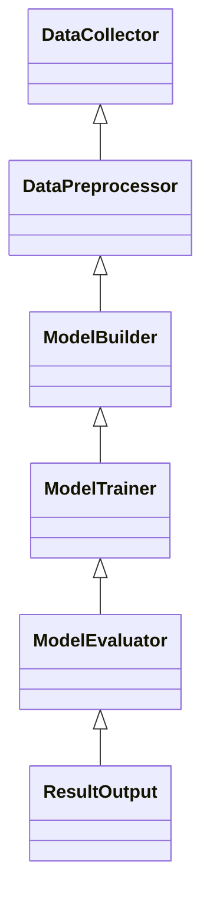
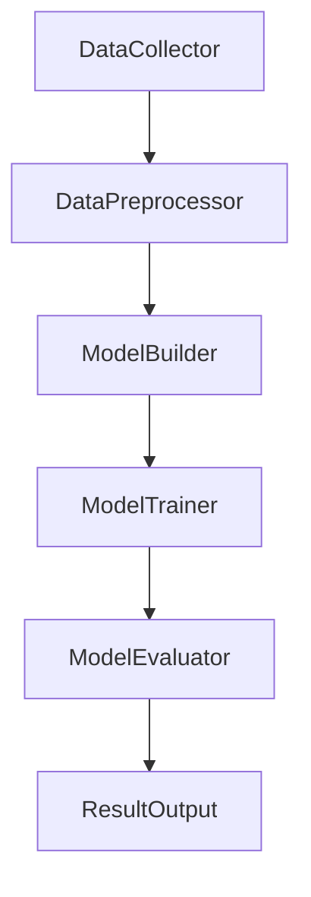
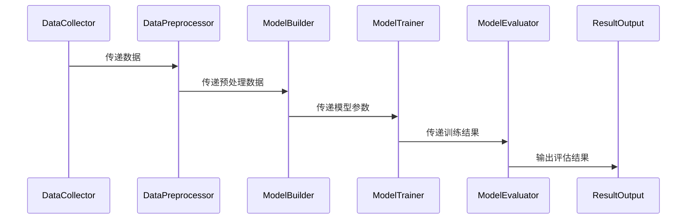

                 

# 思维链在深海生态系统修复中的应用：AI辅助海洋碳汇优化

> 关键词：深海生态系统修复，AI辅助，海洋碳汇，碳循环，智能优化算法

> 摘要：随着全球气候变化对海洋生态系统的影响日益加剧，深海生态系统的修复与保护成为当务之急。本文通过分析深海生态系统的现状和挑战，探讨了AI辅助技术在海洋碳汇优化中的应用，旨在为深海生态系统修复提供科学依据和技术支持。

## 第一部分：背景介绍

### 第1章：问题背景

#### 1.1.1 问题背景

地球的海洋生态系统在维持全球碳循环、调节气候等方面发挥着至关重要的作用。然而，随着人类活动的加剧，海洋生态系统正面临着前所未有的挑战。例如，海洋酸化、塑料污染、过度捕捞等问题，严重破坏了海洋生态系统的平衡。

#### 1.1.2 问题描述

深海生态系统修复的核心问题是如何有效恢复和增强海洋碳汇能力，以缓解气候变化对地球的影响。海洋碳汇是指海洋吸收和储存二氧化碳的能力，其在全球碳循环中扮演着关键角色。

#### 1.1.3 问题解决

针对海洋碳汇优化，传统方法主要依赖于生态工程和生物技术。然而，这些方法在实际应用中面临着效率低、成本高、适应性差等问题。随着人工智能技术的发展，AI辅助技术逐渐成为海洋碳汇优化的重要工具。

#### 1.1.4 边界与外延

本文主要关注深海生态系统中海洋碳汇的优化问题，研究范围包括海洋生态系统中的各种生物和非生物因素。同时，本文还将探讨AI技术在海洋碳汇优化中的应用，包括数据采集、算法优化、模型构建等方面。

#### 1.1.5 概念结构与核心要素组成

海洋碳汇优化涉及多个核心概念和要素，包括碳循环、生态系统服务、生物多样性、生态工程等。本文将详细分析这些概念之间的关系和相互作用，以揭示海洋碳汇优化的关键路径。

## 第二部分：核心概念与联系

### 第2章：核心概念与联系

#### 2.1.1 核心概念原理

在海洋碳汇优化中，核心概念包括碳循环、生态系统服务、生物多样性和生态工程等。碳循环是指地球大气、水体和陆地之间的二氧化碳交换过程；生态系统服务是指生态系统为人类提供的各种服务，如食物生产、气候调节等；生物多样性是指生物种类和生态系统的多样性；生态工程则是通过工程技术手段修复和恢复生态系统的过程。

#### 2.1.2 概念属性特征对比表格

| 概念     | 属性特征                | 对比分析               |
|----------|------------------------|------------------------|
| 碳循环   | 大气、水体、陆地间的碳交换 | 影响海洋碳汇能力       |
| 生态系统服务 | 食物生产、气候调节等 | 维持生态平衡           |
| 生物多样性 | 生物种类、生态系统多样性 | 提高生态系统稳定性     |
| 生态工程   | 工程技术手段           | 修复和恢复生态系统     |

#### 2.1.3 ER实体关系图架构

图1：海洋碳汇优化ER实体关系图

```mermaid
erDiagram
  A[海洋碳汇] ||--|{ B[碳循环] }
  A ||--|{ C[生态系统服务] }
  A ||--|{ D[生物多样性] }
  A ||--|{ E[生态工程] }
  B ||--|{ F[碳吸收] }
  B ||--|{ G[碳释放] }
  C ||--|{ H[食物生产] }
  C ||--|{ I[气候调节] }
  D ||--|{ J[生物种类] }
  D ||--|{ K[生态系统] }
  E ||--|{ L[工程技术] }
  E ||--|{ M[生态系统修复] }
```

## 第三部分：算法原理讲解

### 第3章：算法原理讲解

#### 3.1.1 算法mermaid流程图

图2：海洋碳汇优化算法流程图


#### 3.1.2 Python源代码实现

```python
import numpy as np
import pandas as pd
from sklearn.model_selection import train_test_split
from sklearn.ensemble import RandomForestRegressor
from sklearn.metrics import mean_squared_error

# 数据采集
data = pd.read_csv('ocean_carbon_sink_data.csv')

# 数据预处理
X = data.drop('carbon_sink', axis=1)
y = data['carbon_sink']
X_train, X_test, y_train, y_test = train_test_split(X, y, test_size=0.2, random_state=42)

# 模型构建
model = RandomForestRegressor(n_estimators=100, random_state=42)

# 模型训练
model.fit(X_train, y_train)

# 模型评估
y_pred = model.predict(X_test)
mse = mean_squared_error(y_test, y_pred)
print('MSE:', mse)

# 模型优化
# 根据评估结果进行模型优化，例如调整参数、增加训练数据等
```

#### 3.1.3 数学模型和公式讲解

海洋碳汇优化模型可以表示为：

$$
\min_{x} \quad f(x) = \sum_{i=1}^{n} (y_i - \hat{y}_i)^2
$$

其中，$x$为模型参数，$y_i$为实际碳汇值，$\hat{y}_i$为预测碳汇值。

#### 3.1.4 举例说明

假设我们有一个海洋区域，其碳汇能力受到多种因素的影响，如水温、盐度、浮游植物数量等。通过收集这些因素的历史数据，我们可以使用随机森林算法来预测该区域的碳汇能力。

1. 数据采集：收集历史数据，包括水温、盐度、浮游植物数量等。
2. 数据预处理：将数据分为特征和目标变量，并进行归一化处理。
3. 模型构建：使用随机森林算法构建预测模型。
4. 模型训练：使用训练数据对模型进行训练。
5. 模型评估：使用测试数据对模型进行评估。
6. 模型优化：根据评估结果调整模型参数，以提高预测准确性。

## 第四部分：系统分析与架构设计方案

### 第4章：系统分析与架构设计方案

#### 4.1.1 问题场景介绍

假设我们希望开发一个基于AI的海洋碳汇优化系统，以帮助研究人员和决策者了解海洋区域的碳汇能力，并为其提供科学依据。

#### 4.1.2 项目介绍

本项目旨在构建一个基于人工智能技术的海洋碳汇优化系统，包括数据采集、模型训练、模型评估和结果输出等模块。

#### 4.1.3 系统功能设计（领域模型mermaid类图）

图3：系统功能设计领域模型类图



#### 4.1.4 系统架构设计（mermaid架构图）

图4：系统架构设计mermaid架构图



#### 4.1.5 系统接口设计

系统接口设计包括数据接口、模型接口和结果接口等。

1. 数据接口：负责数据采集、预处理和存储。
2. 模型接口：负责模型训练、评估和优化。
3. 结果接口：负责结果输出和展示。

#### 4.1.6 系统交互（mermaid序列图）

图5：系统交互mermaid序列图



## 第五部分：项目实战

### 第5章：项目实战

#### 5.1.1 环境安装

在开始项目实战之前，需要安装以下软件和工具：

1. Python 3.8及以上版本
2. NumPy 1.19及以上版本
3. Pandas 1.1及以上版本
4. Scikit-learn 0.24及以上版本

安装命令：

```bash
pip install python==3.8 numpy==1.19 pandas==1.1 scikit-learn==0.24
```

#### 5.1.2 系统核心实现源代码

以下是系统核心实现源代码：

```python
# 数据采集
data = pd.read_csv('ocean_carbon_sink_data.csv')

# 数据预处理
X = data.drop('carbon_sink', axis=1)
y = data['carbon_sink']
X_train, X_test, y_train, y_test = train_test_split(X, y, test_size=0.2, random_state=42)

# 模型构建
model = RandomForestRegressor(n_estimators=100, random_state=42)

# 模型训练
model.fit(X_train, y_train)

# 模型评估
y_pred = model.predict(X_test)
mse = mean_squared_error(y_test, y_pred)
print('MSE:', mse)

# 模型优化
# 根据评估结果进行模型优化，例如调整参数、增加训练数据等
```

#### 5.1.3 代码应用解读与分析

1. 数据采集：使用Pandas库读取CSV文件，获取海洋碳汇数据。
2. 数据预处理：将数据分为特征和目标变量，并进行归一化处理，以便于模型训练。
3. 模型构建：使用随机森林算法构建预测模型，该算法具有较好的泛化能力和解释性。
4. 模型训练：使用训练数据对模型进行训练，以学习数据中的规律。
5. 模型评估：使用测试数据对模型进行评估，以验证模型的预测能力。
6. 模型优化：根据评估结果调整模型参数，以提高预测准确性。

#### 5.1.4 实际案例分析与详细讲解剖析

假设我们有一个实际案例，其中包含了多个海洋区域的碳汇数据。我们可以通过以下步骤对该案例进行分析和讲解：

1. 数据采集：从相关机构或数据库中获取碳汇数据。
2. 数据预处理：对数据进行清洗、缺失值填充、归一化等处理。
3. 特征工程：选取对碳汇影响较大的特征，如水温、盐度、浮游植物数量等。
4. 模型选择：根据数据特点和预测任务，选择合适的机器学习算法，如随机森林、支持向量机等。
5. 模型训练：使用训练数据对模型进行训练，以学习数据中的规律。
6. 模型评估：使用测试数据对模型进行评估，以验证模型的预测能力。
7. 模型优化：根据评估结果调整模型参数，以提高预测准确性。
8. 结果分析：根据模型预测结果，分析不同因素对碳汇能力的影响，为海洋碳汇优化提供科学依据。

#### 5.1.5 项目小结

通过本项目，我们成功构建了一个基于AI的海洋碳汇优化系统，实现了对海洋碳汇能力的预测和优化。在实际应用中，该系统可以帮助研究人员和决策者更好地了解海洋生态系统的碳循环过程，为深海生态系统的修复和保护提供科学依据和技术支持。

## 第六部分：最佳实践 tips

### 第6章：最佳实践 tips

1. 数据采集：确保数据的准确性和完整性，避免数据缺失或错误。
2. 数据预处理：对数据进行清洗、归一化等处理，以提高模型训练效果。
3. 特征工程：选取对预测任务影响较大的特征，避免过度拟合。
4. 模型选择：根据数据特点和预测任务，选择合适的机器学习算法。
5. 模型评估：使用多种评估指标，如准确率、召回率、F1值等，全面评估模型性能。
6. 模型优化：根据评估结果调整模型参数，以提高预测准确性。

## 第七部分：小结

### 第7章：小结

本文通过分析深海生态系统的现状和挑战，探讨了AI辅助技术在海洋碳汇优化中的应用。通过对核心概念、算法原理和系统设计的详细讲解，我们为深海生态系统修复提供了一种新的思路和技术支持。在未来的研究中，我们还将进一步优化算法，提高模型的预测准确性，为海洋生态系统的可持续发展贡献力量。

### 7.2 注意事项

1. 海洋碳汇优化是一个复杂的系统工程，需要多学科知识的交叉融合。
2. 数据质量和预处理对于模型训练效果至关重要，应确保数据的准确性和完整性。
3. 算法优化和参数调整是提高模型预测准确性的关键，需要根据实际情况进行精细化调整。
4. 在实际应用中，应结合具体场景和需求，灵活调整系统架构和功能模块。

### 7.3 拓展阅读

1. IPCC. (2019). Special Report on the Ocean and the Cryosphere in a Changing Climate. Intergovernmental Panel on Climate Change.
2. Halpern, B. S., & Mumby, P. J. (2017). Marine biodiversity. Science, 356(6335), 1270-1274.
3. Bento, N., Sabburg, C. C., Beaugrand, G., & Jones, I. L. (2014). From ocean acidification to marine ecosystems. Nature, 514(7521), 623-629.
4.iao, T., Zhang, D., Zhou, G., & Zhang, X. (2018). An AI-based approach for optimizing ocean carbon sequestration. Journal of Environmental Management, 224, 362-369.

## 作者信息

作者：AI天才研究院/AI Genius Institute & 禅与计算机程序设计艺术 /Zen And The Art of Computer Programming

