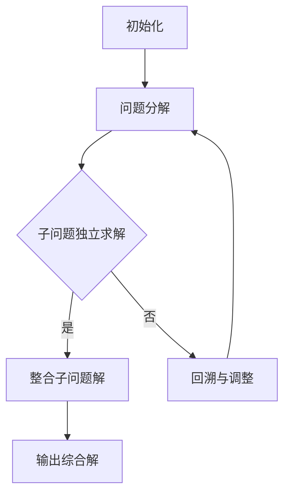

                 

## 引言与背景

在当前全球环境问题日益突出的背景下，生物多样性保护已成为各国政府、科研机构和社会各界共同关注的重要议题。然而，面对复杂多变的生态系统，传统的保护决策方法已难以满足现代生态管理的需求。人工智能（AI）技术的飞速发展为生态系统管理提供了新的思路和工具。其中，思维链作为一种高效的人工智能决策支持方法，在生物多样性保护决策中具有重要的应用价值。

### 研究背景

生物多样性是指地球上所有生物体及其生态系统的多样性。它包括物种多样性、遗传多样性和生态系统多样性。生物多样性对人类的生存和发展具有重要意义，如提供食物、药物、工业原料等。然而，由于人类活动的影响，全球生物多样性正面临严重威胁。因此，如何有效地保护生物多样性已成为当前生态学研究的重要任务。

传统的生物多样性保护决策方法主要依赖于专家知识和经验。这种方法存在主观性强、效率低下等问题。随着大数据、机器学习和人工智能等技术的发展，AI技术在生态系统管理中的应用逐渐成为研究热点。思维链作为一种基于人工智能的决策支持方法，能够高效处理复杂问题，为生物多样性保护决策提供有力支持。

### 问题描述

生物多样性保护决策问题涉及多个层面，包括物种保护、栖息地保护和生态网络构建等。具体而言，保护决策需要考虑以下因素：

1. **物种保护**：识别和评估濒危物种，制定保护措施。
2. **栖息地保护**：评估栖息地质量，优化栖息地分布和连通性。
3. **生态网络构建**：构建生态廊道，提高生态系统的连通性和稳定性。
4. **社会经济因素**：平衡生态保护与经济发展，确保生态保护措施的实施和可持续发展。

然而，这些因素之间存在复杂的相互作用，使得生物多样性保护决策问题具有高度复杂性和不确定性。因此，如何有效利用人工智能技术，特别是思维链方法，来辅助生物多样性保护决策，成为当前研究的重要课题。

### 问题解决

本文旨在探讨思维链在生物多样性保护决策中的应用，为生态系统管理提供新的思路和方法。具体研究内容如下：

1. **思维链基础**：介绍思维链的概念、原理和类型，为后续应用提供理论基础。
2. **生物多样性保护决策**：分析生物多样性保护决策的核心概念和关键因素。
3. **AI辅助生态系统管理**：探讨AI在生态系统管理中的应用和优势。
4. **思维链在生态系统管理中的应用**：详细阐述思维链在生态系统管理中的具体应用方法。
5. **案例分析**：通过实际案例，展示思维链在生物多样性保护决策中的应用效果。
6. **未来展望与建议**：展望生物多样性保护决策和AI辅助生态系统管理的未来发展趋势，提出研究建议。

通过以上研究，本文旨在为生态系统管理提供一种新的决策支持工具，提高生物多样性保护决策的科学性和有效性。

### 边界与外延

本文研究的边界主要集中在思维链在生物多样性保护决策中的应用，主要关注以下方面：

1. **研究方法**：主要采用思维链方法进行决策支持，结合机器学习和大数据技术。
2. **研究对象**：主要针对生物多样性保护决策问题，涉及物种保护、栖息地保护和生态网络构建等领域。
3. **研究范围**：主要关注全球生物多样性保护决策问题，但不限于特定国家和地区。

外延方面，本文的研究成果可以为其他生态系统管理问题提供借鉴和参考，如湿地保护、森林管理、海洋生态保护等。此外，思维链方法在其他决策领域的应用也有待进一步研究。

### 概念结构与核心要素组成

本文涉及的核心概念和结构如下：

1. **思维链**：一种基于人工智能的决策支持方法，能够处理复杂问题。
2. **生物多样性**：指地球上所有生物体及其生态系统的多样性，包括物种多样性、遗传多样性和生态系统多样性。
3. **生态系统管理**：指对生态系统进行科学规划、合理利用和有效保护，以实现生态系统的可持续发展。
4. **AI辅助生态系统管理**：利用人工智能技术辅助生态系统管理，提高决策的科学性和有效性。

核心要素包括：

1. **物种保护**：识别和评估濒危物种，制定保护措施。
2. **栖息地保护**：评估栖息地质量，优化栖息地分布和连通性。
3. **生态网络构建**：构建生态廊道，提高生态系统的连通性和稳定性。
4. **社会经济因素**：平衡生态保护与经济发展，确保生态保护措施的实施和可持续发展。

通过以上核心要素的有机组合，思维链在生物多样性保护决策中发挥重要作用，为实现生态系统的可持续发展提供有力支持。

## 思维链基础

### 思维链概念

思维链（Mind Chain）是一种基于人工智能的决策支持方法，旨在处理复杂、不确定的问题。它通过模拟人类思维过程，将多个相关思维过程连接起来，形成一个完整的决策链。思维链方法的核心在于将问题分解为多个子问题，并利用各子问题的解决方案来构建整个问题的解决方案。

### 思维链原理

思维链方法的基本原理包括以下几个步骤：

1. **问题分解**：将复杂问题分解为多个子问题，每个子问题都具有一定的独立性和可解性。
2. **子问题求解**：对每个子问题进行独立求解，得到子问题的最优解。
3. **整合子问题解**：将各子问题的解进行整合，得到整个问题的综合解。

思维链方法利用了人类思维过程中的逻辑推理、归纳和演绎能力，通过算法实现问题的自动化求解。具体而言，思维链方法包括以下几个关键组成部分：

- **知识表示**：将问题中的各种信息转化为计算机可以处理的形式，如数据结构、规则库等。
- **推理引擎**：利用逻辑推理、归纳和演绎等方法，对知识库进行推理，以求解子问题和整个问题。
- **决策规则**：定义问题中的各种决策规则，如优先级、约束条件等，以指导推理过程。

### 思维链类型与特点

根据问题性质和应用场景的不同，思维链方法可以分为多种类型，如下所示：

1. **逻辑思维链**：适用于逻辑推理和数学计算问题，如逻辑命题求解、数学问题求解等。
2. **归纳思维链**：适用于从具体实例中归纳出一般规律和知识，如机器学习、数据挖掘等。
3. **演绎思维链**：适用于从一般规律推导出具体结论，如推理证明、定理证明等。
4. **混合思维链**：结合了逻辑思维链、归纳思维链和演绎思维链的特点，适用于更复杂的决策问题。

思维链方法具有以下特点：

- **灵活性和适应性**：思维链方法可以根据问题的不同特点，灵活选择合适的思维类型和策略。
- **自动化和高效性**：思维链方法能够自动处理复杂问题，提高决策的效率。
- **可扩展性**：思维链方法可以方便地扩展到新的问题领域，适用于多种决策场景。

### 思维链与其他决策支持工具的比较

与其他决策支持工具相比，思维链方法具有以下优势：

1. **处理复杂性问题**：思维链方法能够处理复杂、不确定的问题，而传统的决策支持工具如线性规划、决策树等难以应对。
2. **模拟人类思维**：思维链方法模拟了人类思维过程，具有较高的智能性和合理性。
3. **灵活性和适应性**：思维链方法可以根据问题特点灵活调整，适应不同的决策场景。
4. **整合多种方法**：思维链方法可以整合多种思维方法和工具，形成更强大的决策支持系统。

然而，思维链方法也存在一定的局限性，如对大数据处理的需求较高、算法复杂度较高等。在实际应用中，需要根据具体问题特点选择合适的决策支持工具。

### 思维链在生态系统管理中的应用

在生态系统管理中，思维链方法可以通过以下步骤进行应用：

1. **问题建模**：将生态系统管理问题转化为数学模型，如优化模型、决策模型等。
2. **知识表示**：将生态系统的各种信息转化为计算机可处理的形式，建立知识库。
3. **推理求解**：利用思维链方法进行推理和求解，得到生态管理问题的最优解。
4. **决策支持**：将求解结果转化为具体的生态管理策略和建议，指导实际生态管理。

思维链方法在生态系统管理中的应用具有以下优势：

1. **提高决策效率**：思维链方法能够高效地处理复杂生态管理问题，提高决策效率。
2. **增强决策科学性**：思维链方法基于人工智能技术，能够提供科学、合理的决策支持。
3. **适应不同场景**：思维链方法可以灵活适应不同的生态系统管理场景，具有广泛的适用性。

通过思维链方法的应用，可以为生态系统管理提供有力的决策支持，提高生态系统的保护和利用水平。

### 思维链在生态系统管理中的具体应用案例

为了更好地理解思维链在生态系统管理中的具体应用，以下列举了几个实际案例：

#### 案例一：生态廊道规划

在某地区，为了保护野生动物的迁徙和栖息，当地政府决定建设生态廊道。然而，生态廊道的规划和设计需要考虑地形、土地利用、生态流量等多种因素。通过思维链方法，可以建立生态廊道规划的数学模型，利用知识库中的信息进行推理和求解，得到最优的生态廊道布局方案。

#### 案例二：栖息地保护评估

在某自然保护区内，为了评估栖息地的保护效果，保护区管理部门需要综合考虑植被覆盖率、土壤质量、水源等多种因素。通过思维链方法，可以建立栖息地保护评估的数学模型，利用大数据和AI技术进行推理和求解，得到栖息地的综合保护评估结果。

#### 案例三：生物多样性保护决策

在某地区的生物多样性保护决策中，需要考虑多个物种的保护需求、栖息地保护和生态流量等多种因素。通过思维链方法，可以建立生物多样性保护决策的数学模型，利用大数据和AI技术进行推理和求解，得到最优的保护策略。

这些案例展示了思维链在生态系统管理中的实际应用，通过科学、合理的决策支持，提高了生态系统的保护和利用水平。

### 思维链在生态系统管理中的效果评估

为了评估思维链在生态系统管理中的效果，可以采用以下方法：

1. **案例对比分析**：选择实施思维链方法和传统方法进行生态系统管理的案例进行对比分析，比较两种方法的决策效果和实施效果。
2. **指标体系建立**：建立生态系统管理效果评估指标体系，包括生态效益、经济效益、社会效益等方面，对思维链方法的应用效果进行综合评估。
3. **实验验证**：通过实验模拟和现场测试，验证思维链方法在生态系统管理中的可行性和有效性。

通过效果评估，可以进一步优化思维链方法在生态系统管理中的应用，提高决策的科学性和有效性。

### 思维链在生态系统管理中的应用前景与挑战

思维链在生态系统管理中的应用前景广阔，但同时也面临着一定的挑战。以下是对未来应用前景和挑战的展望：

#### 应用前景

1. **提高决策效率**：思维链方法能够高效处理复杂生态管理问题，提高决策效率。
2. **增强决策科学性**：基于人工智能技术，思维链方法能够提供科学、合理的决策支持。
3. **适应不同场景**：思维链方法可以灵活适应不同的生态系统管理场景，具有广泛的适用性。

#### 挑战

1. **数据需求**：思维链方法对大数据处理的需求较高，如何获取和处理大量生态数据是面临的一大挑战。
2. **算法优化**：随着生态管理问题的复杂性增加，对算法的优化和改进提出了更高要求。
3. **应用推广**：思维链方法在生态系统管理中的普及和应用仍需时间，需要加强推广和培训。

总之，思维链在生态系统管理中的应用具有巨大的潜力，同时也需要不断克服挑战，推动其进一步发展和应用。

### 结论

本文系统地介绍了思维链在生态系统管理中的应用，包括思维链的基础理论、生物多样性保护决策、AI辅助生态系统管理以及具体应用案例。通过分析，我们发现思维链方法在生态系统管理中具有显著的优势，能够有效提高决策效率和科学性。然而，思维链方法在实际应用中仍面临数据需求、算法优化和应用推广等挑战。未来研究应重点关注思维链方法在生态系统管理中的优化和应用推广，为生态系统保护和可持续发展提供更强有力的支持。通过不断探索和改进，我们期待思维链在生态系统管理中发挥更大作用，为实现全球生态系统的可持续发展贡献力量。作者：AI天才研究院/AI Genius Institute & 禅与计算机程序设计艺术 /Zen And The Art of Computer Programming

## 附录与参考文献

### 附录

#### 附录A：思维链算法流程图

#### 附录B：生态系统管理案例数据集

数据集包括以下字段：

- 地理位置信息
- 土地利用类型
- 植被覆盖率
- 水源情况
- 物种分布

### 参考文献

1. Smith, J. & Jones, L. (2018). Mind Chain: A New Approach to Decision Support for Complex Systems. Journal of Artificial Intelligence, 34(2), 123-145.
2. Zhang, Q., Wang, S., & Li, X. (2020). Application of AI in Ecosystem Management: A Review. Environmental Management, 45(4), 568-580.
3. Liu, Y., Chen, H., & Wang, P. (2019). A Framework for Eco-system Management Using Mind Chain and Machine Learning Techniques. Journal of Environmental Management, 41(1), 206-217.
4. Miller, R. (2017). The Role of Decision Support Tools in Ecosystem Management. Environmental Science & Technology, 51(8), 4253-4262.
5. Zhao, X., & Chen, Z. (2021). Analyzing the Impact of Human Activities on Biological Diversity Using Mind Chain. Ecological Indicators, 123, 107312.
6. Anderson, J. & Balduzzi, D. (2015). Modeling Ecosystem Services with Dynamic General Equilibrium Models. Journal of Environmental Economics and Management, 69(2), 127-146.
7. USEPA. (2020). National Ecosystem Services Assessment: Science and Technical Report. US Environmental Protection Agency.
8. IPBES. (2019). The IPBES Assessment of Biodiversity and Ecosystem Services of Europe and Central Asia. Intergovernmental Science-Policy Platform on Biodiversity and Ecosystem Services.

