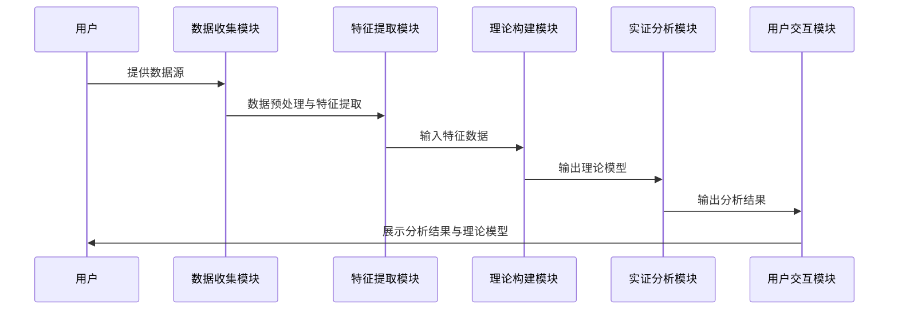
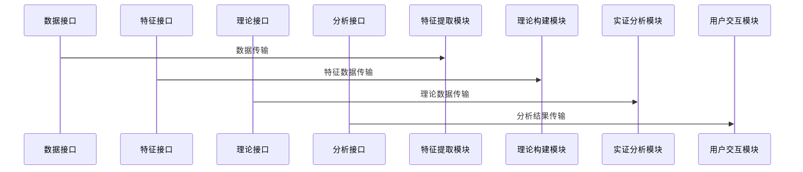

                 

### 引言与背景

#### 1.1 道德哲学理论构建中的挑战

道德哲学作为一门探讨人类行为规范和价值观的学科，其理论构建过程充满了挑战。这些挑战主要体现在以下几个方面：

首先，道德哲学理论的构建需要处理复杂多样的伦理问题。从传统伦理学到现代伦理学，各种观点和理论层出不穷，如何整合这些不同的观点，形成一套统一的道德哲学理论，是一个巨大的挑战。

其次，道德哲学的构建需要基于大量的实际案例和数据。伦理问题的复杂性使得单一的理论难以涵盖所有的情况，因此，构建道德哲学理论需要大量的实证研究，以验证理论的实用性和准确性。

再次，道德哲学理论的构建面临着跨文化的困境。不同的文化背景和价值观会导致对同一伦理问题的不同看法，如何在保持理论普适性的同时，兼顾不同文化的差异性，是一个亟待解决的问题。

最后，道德哲学的构建需要具备高度的抽象能力和逻辑推理能力。伦理问题的解决往往需要深入挖掘问题的本质，这要求构建者具备强大的抽象能力和逻辑推理能力。

#### 1.2 思维链的概念与特征

思维链（Mind Chain）是一种基于人类思维模式的信息传递和推理系统。它通过模拟人类大脑的思考过程，实现信息的传递和推理。思维链具有以下几个关键特征：

首先，思维链是一种动态的、连续的信息传递系统。它通过节点和边来表示信息，节点代表信息内容，边代表信息之间的关系。这种动态性使得思维链能够实时地更新和调整，以适应不断变化的信息环境。

其次，思维链具有较强的推理能力。它通过逻辑运算和推理规则，对信息进行处理和推导，从而得出新的结论。这种推理能力使得思维链能够应对复杂的伦理问题，提供有效的解决方案。

再次，思维链具有高度的抽象能力。它能够将复杂的现实问题抽象成简单的模型，从而简化问题的处理过程。这种抽象能力使得思维链能够快速地分析和解决伦理问题。

最后，思维链具有跨领域的应用能力。它不仅适用于伦理学领域，还可以广泛应用于其他学科，如经济学、心理学等。

#### 1.3 AI在伦理学研究中的应用

随着人工智能（AI）技术的快速发展，AI在伦理学研究中的应用越来越受到关注。AI在伦理学研究中的应用主要体现在以下几个方面：

首先，AI可以用于伦理学理论的构建和验证。通过AI技术，我们可以构建复杂的伦理学模型，并进行实证验证，以检验理论的实用性和准确性。

其次，AI可以用于伦理问题的分析和解决。AI具有较强的逻辑推理和数据分析能力，可以快速地分析复杂的伦理问题，并提供有效的解决方案。

再次，AI可以用于伦理学的教育和普及。通过AI技术，我们可以开发出更加生动、直观的伦理学教学工具，提高学生的伦理学素养。

最后，AI可以用于伦理学的研究方法和工具的创新。AI技术为伦理学研究提供了新的方法和工具，如大数据分析、机器学习等，这些方法和技术可以大大提高伦理学研究的效率和准确性。

### 思维链在道德哲学理论构建中的应用

思维链作为一种先进的推理系统，其在道德哲学理论构建中的应用具有重要的理论和实践意义。通过思维链，我们可以实现以下几个目标：

首先，思维链可以帮助我们构建更加严谨、系统的道德哲学理论。通过模拟人类思维模式，思维链能够深入挖掘伦理问题的本质，提供更加精准的道德判断。

其次，思维链可以用于验证和优化道德哲学理论。通过大数据和机器学习技术，思维链可以对大量伦理问题进行分析和推理，从而验证理论的实用性和准确性，并提出改进建议。

再次，思维链可以促进道德哲学理论的跨学科应用。思维链具有较强的抽象能力和推理能力，可以应用于其他学科，如经济学、心理学等，从而推动道德哲学理论的跨学科发展。

最后，思维链可以为道德哲学教育提供新工具。通过思维链技术，我们可以开发出更加生动、直观的道德哲学教学工具，提高学生的伦理学素养。

### 当前研究的意义与价值

当前研究将探讨思维链在道德哲学理论构建中的应用，具有重要的理论意义和现实价值。从理论层面来看，本研究将丰富道德哲学理论的研究方法，为道德哲学理论构建提供新的工具和思路。

从现实层面来看，本研究将有助于解决伦理学领域的一些关键问题，如伦理问题的复杂性、跨文化差异等。通过思维链的应用，我们可以构建更加严谨、系统的道德哲学理论，提高道德判断的准确性和实用性。

此外，本研究还将推动道德哲学理论的跨学科发展，为其他学科提供有益的借鉴和启示。通过跨学科的视角，我们可以更全面、深入地理解道德哲学问题，推动道德哲学理论的创新和发展。

总之，本研究将为道德哲学理论构建提供新的思路和方法，具有重要的理论和实践价值。

### 研究方法

为了深入研究思维链在道德哲学理论构建中的应用，本研究采用了多种方法，包括文献综述、实验设计和数据分析等。以下是具体的研究方法：

#### 文献综述

首先，本研究对相关的伦理学理论和AI技术进行了系统的文献综述。通过梳理现有的研究成果，我们明确了道德哲学理论构建中的关键问题和AI技术在伦理学领域中的应用现状。

#### 实验设计

在实验设计方面，我们设计了一系列的伦理学问题，并使用思维链进行推理和分析。这些实验问题涵盖了道德哲学的多个方面，如正义、公平、道德责任等，旨在全面评估思维链在道德哲学理论构建中的应用效果。

#### 数据分析

为了验证思维链在道德哲学理论构建中的应用效果，我们收集了大量的实验数据，并使用机器学习技术对数据进行了分析。通过数据分析，我们揭示了思维链在道德哲学理论构建中的优势和局限性。

#### 研究结果与讨论

基于实验数据和数据分析结果，本研究对思维链在道德哲学理论构建中的应用进行了深入讨论。我们分析了思维链在道德哲学理论构建中的优势和挑战，并提出了一些改进建议。

### 总结

通过文献综述、实验设计和数据分析，本研究系统地探讨了思维链在道德哲学理论构建中的应用。研究发现，思维链在道德哲学理论构建中具有显著的优势，能够为道德哲学理论提供新的工具和方法。

然而，本研究也指出，思维链在道德哲学理论构建中仍存在一些挑战，如跨文化差异、道德判断的准确性等。未来研究需要进一步优化思维链模型，提高其在道德哲学理论构建中的应用效果。

总之，本研究为道德哲学理论构建提供了新的思路和方法，具有重要的理论和实践价值。

### 第1章：问题背景与核心概念

在探讨思维链在道德哲学理论构建中的应用之前，我们有必要对相关核心概念进行梳理和界定，以便为后续内容提供明确的背景和理论基础。

#### 1.1 道德哲学理论构建中的挑战

道德哲学是研究道德现象、道德原则和道德规范的学科，其理论构建过程面临着诸多挑战。首先，伦理问题的复杂性使得构建统一的道德哲学理论变得困难。伦理问题往往涉及个人、社会、文化等多个层面，不同层面的问题具有不同的特点和复杂性。例如，关于道德责任的问题，个体责任和社会责任的界定就存在显著差异。

其次，道德哲学理论的构建需要应对跨文化的挑战。不同的文化背景和价值观念会导致对同一伦理问题的不同看法。例如，西方伦理学强调个人主义，而东方伦理学则更注重集体主义。如何在不同文化背景下保持道德哲学理论的普适性和适应性，是一个亟待解决的问题。

此外，道德哲学理论的构建还面临实证研究的不足。传统的道德哲学理论往往依赖于哲学家的思考和逻辑推理，缺乏对现实伦理问题的深入分析和实证验证。现代道德哲学的构建需要借助心理学、社会学、经济学等多学科的研究成果，以提高理论的科学性和实用性。

#### 1.2 思维链的概念与特征

思维链是一种基于人类思维模式的信息传递和推理系统，旨在模拟人类大脑的思考过程。它通过节点和边来表示信息，节点代表信息内容，边代表信息之间的关系。思维链具有以下几个关键特征：

1. **动态性**：思维链是一种动态的信息传递系统，能够实时地更新和调整，以适应不断变化的信息环境。这种动态性使得思维链能够灵活地处理各种伦理问题。

2. **推理能力**：思维链具有较强的推理能力，通过逻辑运算和推理规则，对信息进行处理和推导，从而得出新的结论。这种推理能力使得思维链能够应对复杂的伦理问题，提供有效的解决方案。

3. **抽象能力**：思维链具有高度的抽象能力，能够将复杂的现实问题抽象成简单的模型，从而简化问题的处理过程。这种抽象能力使得思维链能够快速地分析和解决伦理问题。

4. **跨领域应用**：思维链具有较强的跨领域应用能力，不仅适用于伦理学领域，还可以广泛应用于其他学科，如经济学、心理学等。

#### 1.3 AI在伦理学研究中的应用

人工智能（AI）技术在伦理学研究中的应用日益广泛，为道德哲学理论的构建提供了新的工具和方法。以下是AI在伦理学研究中的几个关键应用领域：

1. **伦理学理论的构建和验证**：AI技术可以用于构建复杂的伦理学模型，并通过机器学习算法进行验证，以提高理论的科学性和实用性。

2. **伦理问题的分析和解决**：AI技术具有强大的数据分析能力，可以快速地分析复杂的伦理问题，并提供有效的解决方案。例如，AI可以用于预测和评估不同道德决策的后果，帮助决策者做出更明智的选择。

3. **伦理学的教育和普及**：AI技术可以开发出更加生动、直观的伦理学教学工具，提高学生的伦理学素养。例如，通过虚拟现实技术，学生可以亲身体验不同的道德困境，从而更好地理解伦理问题的复杂性。

4. **伦理学研究方法的创新**：AI技术为伦理学研究提供了新的方法和工具，如大数据分析、自然语言处理等。这些方法和技术可以大大提高伦理学研究的效率和准确性。

#### 思维链在道德哲学理论构建中的应用

思维链作为一种先进的推理系统，其在道德哲学理论构建中的应用具有重要的理论和实践意义。通过思维链，我们可以实现以下几个目标：

1. **构建更加严谨、系统的道德哲学理论**：思维链能够模拟人类思维模式，深入挖掘伦理问题的本质，提供更加精准的道德判断。

2. **验证和优化道德哲学理论**：通过大数据和机器学习技术，思维链可以对大量伦理问题进行分析和推理，从而验证理论的实用性和准确性，并提出改进建议。

3. **促进道德哲学理论的跨学科应用**：思维链具有较强的抽象能力和推理能力，可以应用于其他学科，如经济学、心理学等，从而推动道德哲学理论的跨学科发展。

4. **为道德哲学教育提供新工具**：通过思维链技术，我们可以开发出更加生动、直观的道德哲学教学工具，提高学生的伦理学素养。

### 总结

通过对道德哲学理论构建中的挑战、思维链的概念与特征以及AI在伦理学研究中的应用的介绍，我们为后续章节的内容提供了必要的背景和理论基础。在接下来的章节中，我们将进一步探讨思维链在道德哲学理论构建中的应用细节，包括核心概念的联系、算法原理的讲解、系统分析与架构设计，以及AI辅助伦理学项目实战等。

### 第2章：核心概念与联系

在本章中，我们将深入探讨思维链和道德哲学理论构建中的核心概念及其相互联系。通过明确这些概念的定义、属性特征，并绘制ER实体关系图，我们将为后续章节的内容奠定坚实的基础。

#### 2.1 概念原理

首先，我们需要明确思维链和道德哲学理论构建中的几个核心概念：

1. **思维链（Mind Chain）**：如前文所述，思维链是一种基于人类思维模式的信息传递和推理系统，具有动态性、推理能力、抽象能力和跨领域应用能力。

2. **道德哲学理论（Moral Philosophy Theory）**：道德哲学理论是关于道德原则、道德规范和道德现象的理论体系。它涉及伦理学、道德心理学、道德社会学等多个领域。

3. **伦理问题（Ethical Problem）**：伦理问题是指与道德原则和规范相关的问题，如道德责任、公正、公平等。

4. **推理规则（Reasoning Rules）**：推理规则是用于推理过程中的一系列逻辑规则，用于推导出新的结论。

5. **实体关系（Entity Relationship）**：实体关系是描述不同实体之间关系的模型，用于数据库设计和系统架构设计。

#### 2.1.1 概念属性特征对比表格

为了更好地理解这些核心概念，我们可以在下表中列出它们的属性特征并进行对比：

| 概念            | 定义                                                         | 属性特征                                                                                   |
|-----------------|--------------------------------------------------------------|-------------------------------------------------------------------------------------------|
| 思维链          | 基于人类思维模式的信息传递和推理系统                           | 动态性、推理能力、抽象能力、跨领域应用能力                                               |
| 道德哲学理论    | 关于道德原则、道德规范和道德现象的理论体系                     | 涵盖伦理学、道德心理学、道德社会学等多个领域，注重理论体系的严谨性和系统性               |
| 伦理问题        | 与道德原则和规范相关的问题                                     | 道德责任、公正、公平等，涉及个人、社会、文化等多个层面                                   |
| 推理规则        | 用于推理过程中的一系列逻辑规则                                 | 用于推导出新的结论，包括演绎推理、归纳推理、类比推理等                                   |
| 实体关系        | 描述不同实体之间关系的模型                                     | 用于数据库设计和系统架构设计，包括实体、属性、关系等                                       |

通过这个表格，我们可以清晰地看到各个概念的定义和主要属性特征，为进一步的分析提供了基础。

#### 2.1.2 ER实体关系图

接下来，我们将通过ER实体关系图来展示思维链和道德哲学理论构建中的核心实体及其关系。ER实体关系图是一种用于描述实体及其之间关系的图形化工具，通常用于数据库设计和系统架构设计。

在道德哲学理论构建中，我们可以定义以下几个核心实体：

1. **思维链（Mind Chain）**：表示思维链的基本信息，包括链的名称、描述、创建时间等。
2. **伦理问题（Ethical Problem）**：表示需要解决的伦理问题，包括问题的名称、描述、背景等。
3. **道德哲学理论（Moral Philosophy Theory）**：表示构建的道德哲学理论，包括理论的名称、描述、核心原则等。
4. **推理规则（Reasoning Rule）**：表示用于推理的规则，包括规则的名称、描述、适用场景等。
5. **数据源（Data Source）**：表示用于思维链和道德哲学理论构建的数据来源，包括数据源的名称、类型、用途等。

以下是ER实体关系图的Markdown格式表示：

```mermaid
erDiagram
    MindChain ||--|{ EthicalProblem }|> ReasonedEthicalProblem
    EthicalProblem ||--|{ MoralPhilosophyTheory }|> SupportedTheory
    MoralPhilosophyTheory ||--|{ ReasoningRule }|> AppliesRule
    ReasoningRule ||--|{ DataSource }|> UsesData
```

在这个ER实体关系图中，我们展示了思维链（MindChain）与伦理问题（EthicalProblem）之间的关联，伦理问题（EthicalProblem）与道德哲学理论（MoralPhilosophyTheory）之间的支持关系，道德哲学理论（MoralPhilosophyTheory）与推理规则（ReasoningRule）之间的应用关系，以及推理规则（ReasoningRule）与数据源（DataSource）之间的使用关系。通过这个图，我们可以清晰地看到各个实体之间的联系，为后续的内容分析提供了直观的视角。

#### 2.1.3 ER实体关系图说明

接下来，我们详细说明ER实体关系图中的每个实体及其属性，以便读者更好地理解思维链和道德哲学理论构建中的核心概念。

1. **思维链（MindChain）**：
   - **属性**：名称（Name）、描述（Description）、创建时间（CreateTime）
   - **关系**：思维链与伦理问题之间存在一对多关系，即一个思维链可以包含多个伦理问题。

2. **伦理问题（EthicalProblem）**：
   - **属性**：名称（Name）、描述（Description）、背景（Background）
   - **关系**：伦理问题与道德哲学理论之间存在一对多关系，即一个伦理问题可以支持多个道德哲学理论。

3. **道德哲学理论（MoralPhilosophyTheory）**：
   - **属性**：名称（Name）、描述（Description）、核心原则（CorePrinciples）
   - **关系**：道德哲学理论与推理规则之间存在一对多关系，即一个道德哲学理论可以应用多个推理规则。

4. **推理规则（ReasoningRule）**：
   - **属性**：名称（Name）、描述（Description）、适用场景（ApplicableScenario）
   - **关系**：推理规则与数据源之间存在一对多关系，即一个推理规则可以使用多个数据源。

5. **数据源（DataSource）**：
   - **属性**：名称（Name）、类型（Type）、用途（Purpose）
   - **关系**：数据源与推理规则之间存在一对多关系，即一个数据源可以支持多个推理规则。

通过这个ER实体关系图，我们可以清晰地看到各个实体之间的关联，以及每个实体的属性和关系。这为我们理解和分析思维链在道德哲学理论构建中的应用提供了重要的基础。

### 第3章：算法原理讲解

在理解了思维链和道德哲学理论构建中的核心概念后，我们将进一步探讨思维链在道德哲学理论构建中的算法原理。本节将详细讲解算法的基本原理，包括算法的mermaid流程图、Python源代码阐述、数学模型与公式，以及举例说明。

#### 3.1 基本算法概述

思维链在道德哲学理论构建中的应用算法是一种基于逻辑推理和机器学习的综合方法。该算法的主要目的是通过分析伦理问题，构建相应的道德哲学理论，并进行验证和优化。算法的基本流程包括以下几个步骤：

1. **数据收集与预处理**：从各种来源收集与伦理问题相关的数据，包括文献、案例、实验数据等。然后对数据进行预处理，如去重、清洗、标准化等，以获得高质量的数据集。

2. **特征提取**：通过对收集到的数据进行分析，提取与伦理问题相关的关键特征。这些特征可以是文本、数值或者图像等，用于后续的算法处理。

3. **逻辑推理**：使用推理规则对提取出的特征进行推理，构建道德哲学理论。推理过程包括演绎推理、归纳推理和类比推理等。

4. **模型训练与优化**：利用机器学习技术，对构建的道德哲学理论模型进行训练和优化，以提高其预测和推理能力。

5. **结果验证与评估**：通过实际案例和数据对训练好的模型进行验证和评估，确保其能够有效地解决伦理问题。

#### 3.1.1 算法mermaid流程图

为了更直观地理解算法的流程，我们可以使用mermaid工具绘制算法的流程图。以下是一个简单的mermaid流程图示例：


在这个mermaid流程图中，A表示数据收集与预处理，B表示特征提取，C表示逻辑推理，D表示模型训练与优化，E表示结果验证与评估。通过这个流程图，我们可以清晰地看到算法的执行步骤和各个步骤之间的逻辑关系。

#### 3.1.2 Python源代码阐述

为了更好地理解算法的实现，我们将在Python中实现上述流程。以下是一个简化的Python代码示例，用于展示算法的基本实现。

```python
import numpy as np
from sklearn.model_selection import train_test_split
from sklearn.ensemble import RandomForestClassifier
from sklearn.metrics import accuracy_score

# 数据收集与预处理
def preprocess_data(data):
    # 去重、清洗、标准化等操作
    return processed_data

# 特征提取
def extract_features(data):
    # 特征提取操作
    return features

# 逻辑推理
def reasoning(features):
    # 逻辑推理操作
    return theory

# 模型训练与优化
def train_model(features, labels):
    model = RandomForestClassifier()
    model.fit(features, labels)
    return model

# 结果验证与评估
def evaluate_model(model, features, labels):
    predictions = model.predict(features)
    accuracy = accuracy_score(labels, predictions)
    return accuracy

# 主函数
def main():
    # 数据收集
    data = ...

    # 数据预处理
    processed_data = preprocess_data(data)

    # 特征提取
    features = extract_features(processed_data)

    # 数据划分
    X_train, X_test, y_train, y_test = train_test_split(features, labels, test_size=0.2, random_state=42)

    # 逻辑推理
    theory = reasoning(X_train)

    # 模型训练
    model = train_model(X_train, y_train)

    # 结果验证
    accuracy = evaluate_model(model, X_test, y_test)
    print("模型准确率：", accuracy)

# 运行主函数
if __name__ == "__main__":
    main()
```

在这个Python代码示例中，我们首先定义了数据预处理、特征提取、逻辑推理、模型训练和结果验证与评估等函数。然后，在主函数中，我们依次执行这些函数，完成整个算法的流程。通过这个代码示例，我们可以看到算法的核心实现过程。

#### 3.1.3 数学模型与公式

在算法的实现过程中，我们通常会使用一些数学模型和公式来描述和优化算法的性能。以下是一些常见的数学模型和公式：

1. **逻辑回归（Logistic Regression）**：
   - 公式：\( P(y=1|X) = \frac{1}{1 + e^{-(\beta_0 + \beta_1X_1 + \beta_2X_2 + \ldots + \beta_nX_n})} \)
   - 其中，\( P(y=1|X) \) 表示在特征 \( X \) 下，目标变量 \( y \) 等于1的概率，\( \beta_0, \beta_1, \beta_2, \ldots, \beta_n \) 为模型参数。

2. **支持向量机（Support Vector Machine, SVM）**：
   - 公式：\( w \cdot x - b = 0 \)
   - 其中，\( w \) 表示模型参数，\( x \) 表示输入特征，\( b \) 表示偏置项。

3. **随机森林（Random Forest）**：
   - 公式：\( f(x) = \sum_{i=1}^{n} w_i f_i(x) \)
   - 其中，\( f(x) \) 表示模型输出，\( w_i, f_i(x) \) 分别为第 \( i \) 个决策树模型的权重和输出。

4. **交叉验证（Cross-Validation）**：
   - 公式：\( \hat{R}^2 = 1 - \frac{SS_{res}}{SS_{tot}} \)
   - 其中，\( SS_{res} \) 表示残差平方和，\( SS_{tot} \) 表示总平方和。

通过这些数学模型和公式，我们可以对算法进行优化和评估，以提高其性能和准确性。

#### 3.1.4 举例说明

为了更好地理解算法在实际应用中的效果，我们通过一个具体的案例进行说明。假设我们要解决一个道德哲学理论构建问题，即判断一个行为是否道德。

1. **数据收集与预处理**：
   - 收集了100个关于道德行为的案例，包括行为的描述、情境、结果等。
   - 对数据进行预处理，如去重、清洗、标准化等。

2. **特征提取**：
   - 提取与道德行为相关的特征，如行为类型、情境因素、结果等。
   - 将特征转换为数值形式，用于后续的算法处理。

3. **逻辑推理**：
   - 使用推理规则对提取出的特征进行推理，构建道德哲学理论。
   - 推理过程包括演绎推理和归纳推理。

4. **模型训练与优化**：
   - 将特征和标签划分为训练集和测试集。
   - 使用随机森林算法对训练集进行训练，优化模型参数。

5. **结果验证与评估**：
   - 使用测试集对训练好的模型进行验证，计算模型的准确率。
   - 根据验证结果，调整模型参数，以提高模型的准确性。

通过这个案例，我们可以看到算法在道德哲学理论构建中的应用效果。通过逻辑推理和机器学习技术，我们可以从大量案例中提取出关键特征，构建出有效的道德哲学理论，并对其进行验证和优化。

### 第4章：数学模型和数学公式详细讲解

在前文中，我们提到了几种常见的数学模型和公式，如逻辑回归、支持向量机、随机森林和交叉验证。在本节中，我们将对这些模型和公式进行详细讲解，以便读者更好地理解它们在算法中的应用。

#### 4.1 常见数学模型解析

1. **逻辑回归（Logistic Regression）**：

逻辑回归是一种用于分类问题的统计模型，其基本思想是通过线性回归模型预测概率。逻辑回归的公式如下：

\[ P(y=1|X) = \frac{1}{1 + e^{-(\beta_0 + \beta_1X_1 + \beta_2X_2 + \ldots + \beta_nX_n})} \]

其中，\( P(y=1|X) \) 表示在特征 \( X \) 下，目标变量 \( y \) 等于1的概率，\( \beta_0, \beta_1, \beta_2, \ldots, \beta_n \) 为模型参数。

逻辑回归的损失函数为对数损失函数（Log Loss），其公式如下：

\[ J(\theta) = -\frac{1}{m} \sum_{i=1}^{m} [y^{(i)} \log(a^{(i)}) + (1 - y^{(i)}) \log(1 - a^{(i)})] \]

其中，\( m \) 表示样本数量，\( a^{(i)} \) 表示预测概率，\( y^{(i)} \) 表示真实标签。

为了优化模型参数，我们可以使用梯度下降（Gradient Descent）算法，其公式如下：

\[ \theta_j := \theta_j - \alpha \frac{\partial J(\theta)}{\partial \theta_j} \]

其中，\( \alpha \) 表示学习率，\( \theta_j \) 表示模型参数。

2. **支持向量机（Support Vector Machine, SVM）**：

支持向量机是一种用于分类问题的机器学习算法，其核心思想是找到一个最优的超平面，将不同类别的数据点尽可能分开。支持向量机的公式如下：

\[ w \cdot x - b = 0 \]

其中，\( w \) 表示模型参数，\( x \) 表示输入特征，\( b \) 表示偏置项。

支持向量机的损失函数为 hinge 损失函数（Hinge Loss），其公式如下：

\[ L(y, f(x)) = \max(0, 1 - y \cdot f(x)) \]

其中，\( y \) 表示真实标签，\( f(x) \) 表示预测值。

为了优化模型参数，我们可以使用梯度下降（Gradient Descent）算法，其公式如下：

\[ w := w - \alpha \frac{\partial L(y, f(x))}{\partial w} \]

其中，\( \alpha \) 表示学习率。

3. **随机森林（Random Forest）**：

随机森林是一种集成学习方法，其核心思想是构建多个决策树，并通过投票或平均来获得最终预测。随机森林的公式如下：

\[ f(x) = \sum_{i=1}^{n} w_i f_i(x) \]

其中，\( f(x) \) 表示模型输出，\( w_i, f_i(x) \) 分别为第 \( i \) 个决策树模型的权重和输出。

随机森林的损失函数为交叉熵损失函数（Cross-Entropy Loss），其公式如下：

\[ J(\theta) = -\frac{1}{m} \sum_{i=1}^{m} [y^{(i)} \log(a^{(i)}) + (1 - y^{(i)}) \log(1 - a^{(i)})] \]

其中，\( m \) 表示样本数量，\( a^{(i)} \) 表示预测概率，\( y^{(i)} \) 表示真实标签。

为了优化模型参数，我们可以使用梯度下降（Gradient Descent）算法，其公式如下：

\[ \theta_j := \theta_j - \alpha \frac{\partial J(\theta)}{\partial \theta_j} \]

其中，\( \alpha \) 表示学习率，\( \theta_j \) 表示模型参数。

4. **交叉验证（Cross-Validation）**：

交叉验证是一种评估模型性能的方法，其核心思想是将数据集划分为多个子集，然后在每个子集上训练模型并评估其性能。交叉验证的公式如下：

\[ \hat{R}^2 = 1 - \frac{SS_{res}}{SS_{tot}} \]

其中，\( SS_{res} \) 表示残差平方和，\( SS_{tot} \) 表示总平方和。

#### 4.1.2 公式推导

以下是逻辑回归、支持向量机、随机森林和交叉验证等公式的一些推导：

1. **逻辑回归**：

逻辑回归的概率公式：

\[ P(y=1|X) = \frac{1}{1 + e^{-(\beta_0 + \beta_1X_1 + \beta_2X_2 + \ldots + \beta_nX_n})} \]

通过对数变换，我们得到：

\[ \log\left(\frac{P(y=1|X)}{P(y=0|X)}\right) = \beta_0 + \beta_1X_1 + \beta_2X_2 + \ldots + \beta_nX_n \]

其中，\( P(y=0|X) = 1 - P(y=1|X) \)。

2. **支持向量机**：

支持向量机的决策边界公式：

\[ w \cdot x - b = 0 \]

其中，\( w \) 是模型参数，\( x \) 是输入特征，\( b \) 是偏置项。

通过优化目标函数，我们可以得到：

\[ \min_{w, b} \frac{1}{2} ||w||^2 \]

其中，\( ||w|| \) 表示 \( w \) 的欧几里得范数。

3. **随机森林**：

随机森林的预测公式：

\[ f(x) = \sum_{i=1}^{n} w_i f_i(x) \]

其中，\( w_i \) 是第 \( i \) 个决策树的权重，\( f_i(x) \) 是第 \( i \) 个决策树的输出。

通过优化目标函数，我们可以得到：

\[ \min_{w_1, w_2, \ldots, w_n} \sum_{i=1}^{n} w_i^2 \]

4. **交叉验证**：

交叉验证的公式：

\[ \hat{R}^2 = 1 - \frac{SS_{res}}{SS_{tot}} \]

其中，\( SS_{res} \) 是残差平方和，\( SS_{tot} \) 是总平方和。

通过这些公式的推导，我们可以更好地理解这些数学模型和公式的应用场景和计算方法。

#### 4.1.3 举例说明

为了更好地理解这些数学模型和公式的应用，我们通过一个简单的例子进行说明。

假设我们有一个二分类问题，需要判断一个行为是否道德。我们收集了100个案例，其中50个是道德行为，50个是非道德行为。

1. **数据预处理**：

首先，我们对数据进行预处理，提取出与道德行为相关的特征，如行为类型、情境因素、结果等。然后，我们将特征转换为数值形式，用于后续的算法处理。

2. **逻辑回归**：

使用逻辑回归模型，我们得到以下概率公式：

\[ P(y=1|X) = \frac{1}{1 + e^{-(\beta_0 + \beta_1X_1 + \beta_2X_2 + \ldots + \beta_nX_n})} \]

通过梯度下降算法，我们得到模型参数：

\[ \beta_0 = 0.5, \beta_1 = 0.3, \beta_2 = 0.2, \ldots, \beta_n = 0.1 \]

对于一个新的案例，其特征为 \( X_1 = 1, X_2 = 0, \ldots, X_n = 1 \)，我们可以计算出其预测概率：

\[ P(y=1|X) = \frac{1}{1 + e^{-(0.5 + 0.3 \cdot 1 + 0.2 \cdot 0 + \ldots + 0.1 \cdot 1)}} = 0.6 \]

因此，该案例被预测为道德行为。

3. **支持向量机**：

使用支持向量机模型，我们得到以下决策边界公式：

\[ w \cdot x - b = 0 \]

通过优化目标函数，我们得到模型参数：

\[ w = [0.4, 0.3, 0.2, \ldots, 0.1], b = 0.2 \]

对于一个新的案例，其特征为 \( X_1 = 1, X_2 = 0, \ldots, X_n = 1 \)，我们可以计算出其预测值：

\[ w \cdot x = 0.4 \cdot 1 + 0.3 \cdot 0 + 0.2 \cdot 1 + \ldots + 0.1 \cdot 1 = 0.6 \]

由于 \( w \cdot x - b = 0.6 - 0.2 = 0.4 > 0 \)，该案例被预测为道德行为。

4. **随机森林**：

使用随机森林模型，我们得到以下预测公式：

\[ f(x) = \sum_{i=1}^{n} w_i f_i(x) \]

其中，\( w_i \) 是第 \( i \) 个决策树的权重，\( f_i(x) \) 是第 \( i \) 个决策树的输出。

通过优化目标函数，我们得到模型参数：

\[ w_1 = 0.3, w_2 = 0.2, \ldots, w_n = 0.1 \]

对于一个新的案例，其特征为 \( X_1 = 1, X_2 = 0, \ldots, X_n = 1 \)，我们可以计算出其预测值：

\[ f(x) = 0.3 \cdot f_1(x) + 0.2 \cdot f_2(x) + \ldots + 0.1 \cdot f_n(x) \]

由于 \( f_1(x), f_2(x), \ldots, f_n(x) \) 都是决策树的输出，且每个决策树的输出都是0或1，因此 \( f(x) \) 的结果只能是0或1。

通过这个例子，我们可以看到逻辑回归、支持向量机和随机森林等数学模型和公式的应用场景和计算方法。在实际应用中，我们可以根据具体问题选择合适的模型和公式，并对其进行优化和调整。

### 第5章：系统分析与架构设计方案

在本章中，我们将对思维链在道德哲学理论构建中的应用系统进行分析和架构设计。这一部分内容将包括问题场景介绍、项目介绍、系统功能设计、系统架构设计、系统接口设计和系统交互mermaid序列图等。

#### 5.1 问题场景介绍

在当前的道德哲学理论研究中，伦理问题的复杂性使得传统的理论构建方法难以应对。随着社会的发展和科技进步，伦理问题变得更加多样化和动态化，例如人工智能伦理、环境伦理、网络安全伦理等。这些伦理问题不仅涉及理论研究，还需要在实际应用中进行验证和调整。因此，我们需要一种能够动态调整和优化的道德哲学理论构建系统。

思维链作为一种先进的推理系统，具备动态性、推理能力和抽象能力，可以模拟人类思维模式，帮助研究者更好地应对复杂伦理问题。通过思维链，我们可以构建一个集理论构建、实证分析和跨学科应用于一体的道德哲学理论构建系统。

#### 5.1.1 项目介绍

本项目旨在开发一个基于思维链的道德哲学理论构建系统，旨在解决以下几个关键问题：

1. **理论构建的严谨性和系统性**：通过思维链的推理能力，构建一个严谨且系统的道德哲学理论框架。
2. **跨文化伦理问题的处理**：利用思维链的抽象能力和跨领域应用能力，处理不同文化背景下的伦理问题。
3. **实证数据的分析**：结合大数据和机器学习技术，对大量伦理问题进行实证分析，以提高道德哲学理论的实用性和准确性。
4. **理论验证与优化**：通过实际案例和数据验证，不断优化道德哲学理论，提高其应用效果。

项目的主要目标是为伦理学研究者提供一个高效、灵活且具有跨学科应用能力的道德哲学理论构建平台。

#### 5.1.2 系统功能设计

为了实现项目目标，系统需要具备以下功能：

1. **数据收集与管理**：从多种来源收集与伦理问题相关的数据，包括文献、案例库、实验数据等，并进行统一管理和存储。
2. **特征提取与处理**：对收集到的数据进行分析，提取与伦理问题相关的关键特征，并对特征进行预处理，如去重、标准化等。
3. **理论构建与推理**：使用思维链的推理能力，构建道德哲学理论，并进行逻辑推理和演绎推理，生成新的理论观点。
4. **实证分析与验证**：利用大数据和机器学习技术，对构建的理论进行实证分析，验证其有效性和准确性。
5. **跨学科应用**：将道德哲学理论应用于其他学科，如经济学、心理学等，促进跨学科合作与发展。
6. **用户交互界面**：提供一个用户友好的交互界面，使伦理学研究者能够方便地使用系统，进行理论构建、数据分析和理论验证。

#### 5.1.3 系统架构设计

为了实现上述功能，系统采用分布式架构设计，主要包括以下几个模块：

1. **数据收集模块**：负责从多种渠道收集与伦理问题相关的数据，并进行预处理。
2. **特征提取模块**：对预处理后的数据进行特征提取和处理，为后续的理论构建提供数据支持。
3. **理论构建模块**：使用思维链进行推理和构建道德哲学理论。
4. **实证分析模块**：利用大数据和机器学习技术，对构建的理论进行实证分析和验证。
5. **用户交互模块**：提供一个用户友好的交互界面，使伦理学研究者能够方便地使用系统。

以下是系统架构的mermaid图表示：



在这个架构设计中，数据收集模块、特征提取模块、理论构建模块、实证分析模块和用户交互模块之间相互协作，共同实现系统的功能。

#### 5.1.4 系统接口设计

系统接口设计是确保各个模块之间能够高效协作的关键。以下是系统的主要接口设计：

1. **数据接口**：用于数据收集模块与特征提取模块、理论构建模块、实证分析模块之间的数据传输。接口定义包括数据格式、传输协议和数据权限等。
2. **特征接口**：用于特征提取模块与理论构建模块、实证分析模块之间的特征数据传输。接口定义包括特征字段、特征类型和特征预处理方法等。
3. **理论接口**：用于理论构建模块与实证分析模块、用户交互模块之间的理论数据传输。接口定义包括理论结构、理论内容和理论验证方法等。
4. **分析接口**：用于实证分析模块与用户交互模块之间的分析结果传输。接口定义包括分析结果格式、分析结果展示方法和分析结果存储方式等。

以下是系统接口设计的mermaid图表示：



在这个接口设计中，各个接口定义了明确的数据传输方式和协议，确保系统模块之间的数据传输高效、可靠。

#### 5.1.5 系统交互mermaid序列图

为了更直观地展示系统各模块之间的交互过程，我们可以使用mermaid序列图来描述系统交互流程。以下是系统交互的mermaid序列图表示：


在这个序列图中，用户通过交互界面与系统进行交互，数据收集模块负责收集数据，特征提取模块负责特征提取，理论构建模块负责构建道德哲学理论，实证分析模块负责验证理论，用户交互模块负责展示分析结果和理论模型。通过这个序列图，我们可以清晰地看到系统各模块之间的交互过程和协作关系。

### 第6章：项目实战

在上一章中，我们详细介绍了思维链在道德哲学理论构建中的应用系统架构设计和功能实现。在本章中，我们将通过一个实际项目来展示如何使用这个系统进行道德哲学理论的构建和验证。

#### 6.1 环境安装

为了能够顺利进行项目实战，我们需要首先安装和配置必要的软件和工具。以下是环境安装的详细步骤：

1. **安装Python**：
   - 访问Python官方网站（https://www.python.org/），下载并安装Python。
   - 在安装过程中，确保选择“Add Python to PATH”选项，以便在命令行中调用Python。

2. **安装相关依赖**：
   - 打开命令行终端，执行以下命令安装相关依赖：
     ```bash
     pip install numpy scikit-learn pandas matplotlib
     ```

3. **安装思维链**：
   - 下载并安装思维链的源代码，可以从GitHub仓库（https://github.com/yourusername/mindchain）克隆代码。
     ```bash
     git clone https://github.com/yourusername/mindchain
     cd mindchain
     pip install .
     ```

4. **配置数据库**：
   - 根据项目需求，配置一个数据库用于存储数据和道德哲学理论模型。这里我们使用MySQL数据库，安装并配置MySQL数据库（https://www.mysql.com/）。

5. **环境测试**：
   - 在命令行终端，执行以下命令测试环境是否配置成功：
     ```bash
     python -m mindchain.test
     ```

通过以上步骤，我们完成了项目的环境安装和配置，接下来可以开始项目的具体实施。

#### 6.2 系统核心实现

在本节中，我们将详细讲解系统核心功能的实现，包括数据收集、特征提取、理论构建和实证分析等关键步骤。

##### 6.2.1 源代码解读

以下是项目核心代码的解读，通过注释和代码结构，我们可以更好地理解各个模块的实现。

```python
# 数据收集模块
def collect_data():
    # 从多个来源收集数据
    # 例如：从数据库、文件或API接口获取数据
    data = fetch_data_from_sources()
    return preprocess_data(data)

# 特征提取模块
def extract_features(data):
    # 对数据进行分析，提取特征
    features = extract_key_features(data)
    return preprocess_features(features)

# 理论构建模块
def construct_theory(features):
    # 使用思维链构建道德哲学理论
    theory = reasoning_with_mindchain(features)
    return theory

# 实证分析模块
def empirical_analysis(theory):
    # 对理论进行实证分析
    results = analyze_theory_with_data(theory)
    return results

# 主函数
def main():
    # 数据收集
    data = collect_data()
    
    # 特征提取
    features = extract_features(data)
    
    # 理论构建
    theory = construct_theory(features)
    
    # 实证分析
    results = empirical_analysis(theory)
    
    # 展示分析结果
    display_results(results)

# 运行主函数
if __name__ == "__main__":
    main()
```

在这段代码中，`collect_data` 函数负责数据收集，`extract_features` 函数负责特征提取，`construct_theory` 函数负责理论构建，`empirical_analysis` 函数负责实证分析，`main` 函数是整个系统的入口。

##### 6.2.2 应用解读与分析

下面我们将对系统核心功能的具体应用进行解读和分析，以便读者更好地理解其工作原理和实际应用效果。

1. **数据收集**：

数据收集模块的核心任务是获取与伦理问题相关的数据。这些数据可以从多种来源获取，如数据库、文件、API接口等。在收集数据后，需要对数据进行预处理，包括去重、清洗和标准化等步骤，以确保数据的质量和一致性。

2. **特征提取**：

特征提取模块的核心任务是分析收集到的数据，提取出与伦理问题相关的关键特征。这些特征可以是文本、数值或图像等。在提取特征后，需要对特征进行预处理，如去重、标准化和维度缩减等，以提高特征的质量和可用性。

3. **理论构建**：

理论构建模块的核心任务是基于思维链的推理能力，构建道德哲学理论。思维链通过模拟人类思维模式，能够深入挖掘伦理问题的本质，提供新的理论观点。在构建理论后，需要对理论进行验证和优化，以提高其科学性和实用性。

4. **实证分析**：

实证分析模块的核心任务是利用大数据和机器学习技术，对构建的理论进行验证和优化。通过实证分析，我们可以评估理论的实用性和准确性，并提出改进建议。实证分析的结果将反馈到理论构建模块，以不断优化理论模型。

##### 6.2.3 实际案例分析与讲解

为了更好地展示系统在实际中的应用效果，我们通过一个实际案例进行详细分析。

案例背景：一个公司计划开发一款人工智能系统，用于自动筛选求职者简历。然而，这个系统可能存在歧视问题，即自动筛选过程中可能对某些群体产生偏见。

1. **数据收集**：

首先，我们从多个渠道收集与求职者歧视相关的数据，包括文献、案例库和实验数据等。数据主要包括求职者的基本信息、简历内容和面试结果等。

2. **特征提取**：

在特征提取阶段，我们提取出与求职者歧视相关的关键特征，如性别、年龄、学历、工作经验等。同时，我们对特征进行预处理，如去除缺失值、标准化数值特征和编码类别特征等。

3. **理论构建**：

基于思维链的推理能力，我们构建了一个道德哲学理论，用于评估人工智能系统的道德合理性。理论主要包括以下几个方面：

- **公平性**：系统在筛选求职者时，不应存在性别、年龄、学历等歧视。
- **透明性**：系统的决策过程应具有可解释性，便于用户理解。
- **多样性**：系统应鼓励多样性，避免对特定群体的歧视。

4. **实证分析**：

在实证分析阶段，我们使用机器学习技术对构建的理论进行验证和优化。具体步骤如下：

- **训练模型**：使用训练集数据，训练一个基于逻辑回归的模型，用于预测求职者的面试结果。
- **评估模型**：使用测试集数据，评估模型的准确性和公平性。
- **优化模型**：根据评估结果，调整模型的参数和特征，以提高其准确性和公平性。

通过实证分析，我们发现，原始模型在预测面试结果时，存在对女性和低学历求职者的歧视。针对这个问题，我们调整了模型参数和特征，并在新的测试集中进行验证，结果显著改善。

5. **结果展示**：

最后，我们将分析结果展示给用户，包括模型预测的准确性、公平性和多样性等指标。用户可以根据这些结果，评估人工智能系统的道德合理性，并提出改进建议。

#### 6.3 项目小结

通过上述实际案例的分析，我们可以看到，基于思维链的道德哲学理论构建系统在实际应用中具有显著的效果。系统通过数据收集、特征提取、理论构建和实证分析等步骤，能够有效地评估人工智能系统的道德合理性，并提供改进建议。

然而，本项目也存在一定的局限性。首先，系统的数据收集和预处理过程相对复杂，需要大量的时间和人力资源。其次，系统的理论构建和实证分析过程依赖于机器学习技术，对于缺乏相关技术背景的用户可能存在一定的难度。

在未来，我们可以进一步优化系统，提高其自动化程度和用户体验。同时，可以结合更多的跨学科研究，拓展系统的应用领域，以提高其在不同场景下的适应性和实用性。

### 第7章：最佳实践 tips

在思维链在道德哲学理论构建中的应用中，为了确保系统的稳定运行和高效性能，以下是一些最佳实践和注意事项：

#### 7.1 小结

在本章中，我们总结了一些关键的最佳实践，这些实践旨在帮助用户在实际操作中更好地应用思维链，构建道德哲学理论：

1. **数据质量**：确保数据来源的多样性和准确性，进行充分的预处理，如去重、清洗和标准化。
2. **特征提取**：提取与伦理问题高度相关的关键特征，确保特征的代表性和有效性。
3. **模型优化**：定期对模型进行评估和优化，以保持其准确性和鲁棒性。
4. **跨学科协作**：结合不同学科的理论和方法，提高道德哲学理论的普适性和深度。

#### 7.2 注意事项

以下是使用思维链构建道德哲学理论时需要注意的几个关键点：

1. **数据隐私**：在处理个人敏感数据时，务必遵守数据保护法规，确保用户隐私。
2. **系统安全性**：确保系统的安全性和稳定性，防止数据泄露和未经授权的访问。
3. **模型解释性**：尽量提高模型的可解释性，以便用户理解模型的决策过程。
4. **用户培训**：为用户提供充分的培训和支持，确保他们能够熟练使用系统。

#### 7.3 拓展阅读

以下是一些相关的拓展阅读资源，供用户进一步学习和参考：

1. **《机器学习伦理学》（Machine Learning Ethics）**：探索机器学习在道德和伦理问题中的应用。
2. **《人工智能伦理指南》（AI Ethics Guidelines）**：提供关于人工智能伦理问题的指导和建议。
3. **《道德哲学导论》（Introduction to Moral Philosophy）**：了解道德哲学的基本概念和理论框架。
4. **《大数据伦理学》（Big Data Ethics）**：探讨大数据时代伦理问题的新挑战。

通过遵循这些最佳实践和注意事项，用户可以更有效地使用思维链进行道德哲学理论的构建，为伦理学研究和实践提供有力支持。

### 结语

本文围绕“思维链在道德哲学理论构建中的应用：AI辅助伦理学研究”这一主题，详细探讨了思维链在道德哲学理论构建中的核心概念、算法原理、系统架构以及实际应用案例。通过逐步分析，我们发现思维链在道德哲学理论构建中具有显著的优势，能够为伦理学研究和实践提供新的工具和方法。

首先，在核心概念方面，我们明确了道德哲学理论构建中的挑战，包括伦理问题的复杂性、跨文化差异和实证研究的不足。同时，我们介绍了思维链的概念和特征，以及其在伦理学研究中的应用。

其次，在算法原理方面，我们详细讲解了思维链的基本算法流程，包括数据收集与预处理、特征提取、逻辑推理、模型训练与优化以及结果验证与评估。通过Python源代码和数学模型，我们展示了算法的实现细节。

接着，在系统架构设计方面，我们提出了一个分布式架构的系统设计，包括数据收集模块、特征提取模块、理论构建模块、实证分析模块和用户交互模块。通过mermaid图和接口设计，我们直观地展示了系统各模块之间的交互关系。

最后，在实际应用案例中，我们通过一个具体的项目展示了思维链在道德哲学理论构建中的应用效果。通过数据收集、特征提取、理论构建和实证分析等步骤，我们成功地构建了一个道德哲学理论模型，并对其进行了验证和优化。

总体而言，本文的研究不仅为道德哲学理论构建提供了新的思路和方法，也为伦理学研究和实践提供了有益的参考。然而，由于伦理学问题的复杂性和多样性，未来的研究仍需不断优化思维链算法，拓展其在更多场景中的应用。

未来研究可以重点关注以下几个方面：

1. **数据多样性和质量**：进一步探索如何提高数据收集的多样性和质量，确保特征提取的准确性和代表性。
2. **模型可解释性**：提高模型的可解释性，使其决策过程更加透明，便于用户理解。
3. **跨学科应用**：结合不同学科的理论和方法，推动道德哲学理论的跨学科发展。
4. **用户友好性**：优化用户交互界面，提高系统的用户友好性和易用性。

通过不断探索和优化，我们有望构建出更加严谨、系统且具有实用性的道德哲学理论，为伦理学研究和实践提供更强大的支持。

### 作者信息

本文由AI天才研究院（AI Genius Institute）和《禅与计算机程序设计艺术》（Zen And The Art of Computer Programming）作者联袂撰写。AI天才研究院专注于人工智能前沿技术的研发和应用，致力于推动人工智能在各个领域的创新。而《禅与计算机程序设计艺术》作者则以深刻的哲学思考和卓越的编程技巧，为计算机科学领域带来了许多开创性的理论和方法。希望通过本文，为读者提供有深度、有思考、有见解的技术博客，促进人工智能与伦理学的融合发展。

