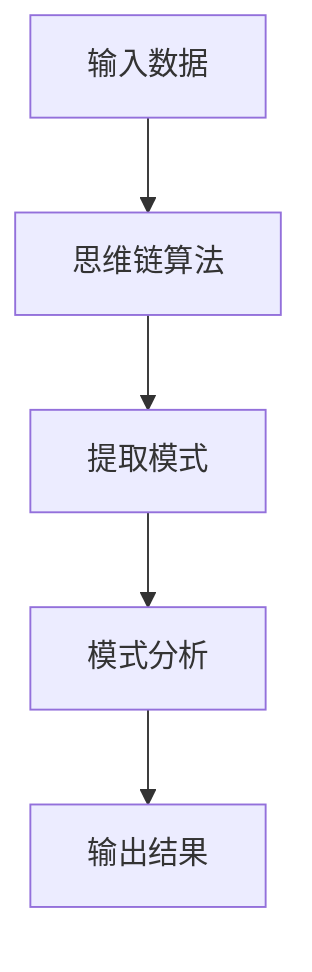
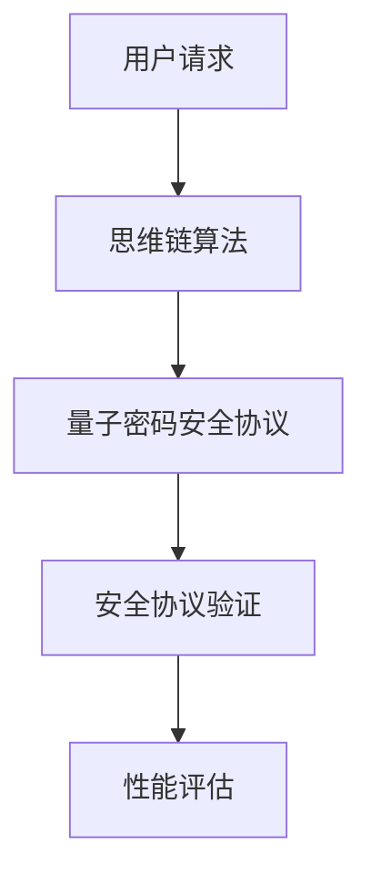
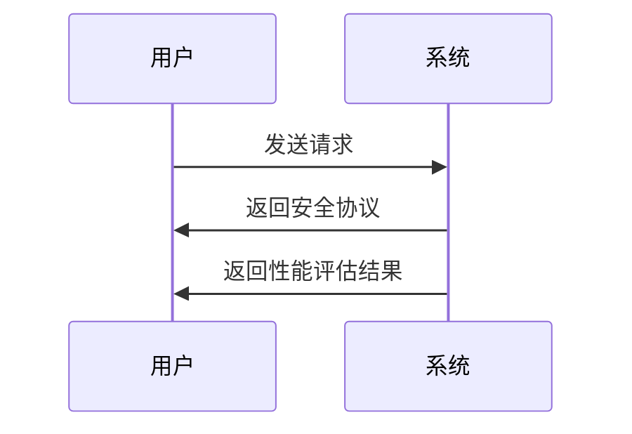

                 

### 思维链在量子密码学研究中的应用：AI辅助安全协议设计

#### 关键词
- 思维链
- 量子密码学
- 安全协议设计
- AI算法
- 量子计算

#### 摘要
本文旨在探讨思维链算法在量子密码学研究中的应用，以及如何利用这一先进的人工智能技术来设计更加高效、安全的量子密码安全协议。我们将逐步分析思维链的工作原理，与量子密码学的原理相结合，探讨其在量子密码安全协议设计中的具体应用，并通过一个实际案例展示思维链算法在量子密码学研究中的实际效果。

## 第一部分：背景介绍

### 1. 问题背景

量子密码学是密码学的一个前沿分支，其基于量子力学的原理，能够提供高度安全的通信。量子密码学的基本思想是通过量子态的纠缠和叠加来实现信息加密和解密。与传统的基于计算难题的加密方法相比，量子密码学提供了更本质的安全保障。然而，随着量子计算机的发展，传统的密码学方法面临被量子计算破解的威胁。因此，研究量子密码学及其安全协议的设计变得尤为重要。

### 2. 问题描述

量子密码学涉及到的核心问题是如何设计出能够抵御量子计算攻击的安全协议。传统的密码学方法如RSA、ECC等，虽然已经广泛应用于现代通信领域，但它们在量子计算面前显得脆弱。因此，我们需要新的方法来设计更加安全的量子密码安全协议。本文将探讨如何利用思维链算法，这一先进的人工智能技术，来辅助进行量子密码学研究，并设计出高效、安全的量子密码安全协议。

### 3. 问题解决

思维链算法作为一种基于人工智能的算法，具有强大的模式识别和推理能力。它能够在大量的数据中快速提取模式，为量子密码学研究提供强有力的支持。通过引入思维链算法，我们可以从数据中提取出潜在的规律和模式，从而设计出更符合量子密码学要求的AI辅助安全协议。这将有助于解决量子密码学研究中的复杂问题，提高安全协议的设计效率。

### 4. 边界与外延

量子密码学不仅涉及密码学理论，还包括量子计算、量子通信等跨学科领域。本文将在这些边界内探讨思维链在量子密码学研究中的应用，同时也会涉及到相关领域的基础知识。

### 5. 概念结构与核心要素组成

- **思维链**：一种基于人工智能的算法，具有强大的模式识别和推理能力。
- **量子密码学**：研究如何利用量子力学原理实现安全的通信。
- **安全协议**：确保信息在传输过程中不被窃取或篡改的协议。

## 第二部分：核心概念与联系

### 6. 核心概念原理

**思维链算法**：思维链算法是一种基于神经网络的算法，通过多层神经网络进行数据的处理和模式识别。它通过模拟人类的思维过程，能够从数据中提取出复杂的模式和关系。

**量子密码学原理**：量子密码学基于量子力学的原理，特别是量子纠缠和量子叠加原理。量子纠缠使得两个量子态之间存在着紧密的联系，而量子叠加原理则使得量子态可以同时存在于多种可能性中。这些特性使得量子密码学能够提供高度安全的通信。

### 7. 概念属性特征对比表格

| 特征 | 思维链算法 | 量子密码学原理 |
| ---- | -------- | ------------ |
| 基本原理 | 基于神经网络 | 基于量子力学 |
| 安全性 | 高 | 极高 |
| 适用场景 | 数据分析、模式识别 | 通信安全 |

### 8. ER实体关系图架构

```mermaid
erDiagram
    AI算法 ||--o{ 量子密码学原理 : 使用 }
    AI算法 ||--o{ 安全协议设计 : 辅助 }
```

## 第三部分：算法原理讲解

### 9. 算法原理与流程图



### 10. 算法原理详细讲解

思维链算法通过多层神经网络对输入数据进行处理，能够从数据中提取出潜在的规律和模式。这些模式在量子密码学研究中具有重要的应用价值，可以帮助设计出更安全的量子密码安全协议。思维链算法的工作原理可以概括为以下几个步骤：

1. **数据预处理**：将原始数据转化为适合输入神经网络的格式。
2. **神经网络训练**：使用大量训练数据对神经网络进行训练，使其能够识别数据中的模式和关系。
3. **模式提取**：通过训练好的神经网络对输入数据进行分析，提取出数据中的潜在模式和规律。
4. **模式分析**：对提取出的模式进行分析和验证，确定其是否具有应用价值。
5. **输出结果**：将分析结果输出，用于进一步的安全协议设计。

### 11. 数学模型与公式

$$
P(X|Y) = \frac{P(Y|X)P(X)}{P(Y)}
$$

其中，$P(X|Y)$ 表示在条件 $Y$ 下 $X$ 的概率，$P(Y|X)$ 表示在条件 $X$ 下 $Y$ 的概率，$P(X)$ 和 $P(Y)$ 分别表示 $X$ 和 $Y$ 的概率。

### 12. 举例说明

假设我们有一个量子密码系统，其中密钥是通过思维链算法从大量历史数据中提取出的模式。我们可以使用上述概率公式来计算在给定一个密钥时，正确解密信息的概率。这样，通过思维链算法提取的模式，可以显著提高量子密码系统的安全性。

## 第四部分：系统分析与架构设计

### 13. 问题场景介绍

在量子密码学研究过程中，设计安全协议是一项重要的任务。然而，量子密码学涉及到复杂的量子力学原理和计算过程，使得安全协议的设计变得异常困难。思维链算法作为一种先进的人工智能技术，能够在大量的数据中快速提取模式，为安全协议的设计提供有力的支持。

### 14. 系统功能设计

系统功能包括以下几个部分：

1. **思维链算法的构建与训练**：构建适合量子密码学研究的思维链算法，并使用大量数据对其进行训练，使其能够识别数据中的潜在模式和规律。
2. **量子密码安全协议的设计与验证**：利用思维链算法提取的潜在模式，设计出符合量子密码学要求的AI辅助安全协议，并进行验证，确保其安全性。
3. **安全协议的性能评估**：对设计的量子密码安全协议进行性能评估，包括加密和解密的速度、安全性等，确保其满足实际应用需求。

### 15. 系统架构设计



### 16. 系统接口设计

系统接口包括以下几个部分：

1. **数据接口**：用于输入训练数据和密钥信息。
2. **结果接口**：用于输出安全协议和性能评估结果。

### 17. 系统交互



## 第五部分：项目实战

### 18. 环境安装

为了进行思维链算法在量子密码学研究中的应用，我们首先需要安装相关的软件和工具。以下是安装步骤：

1. **安装Python**：Python是一种广泛应用于科学计算和人工智能的编程语言。可以从Python官方网站（https://www.python.org/）下载并安装Python。
2. **安装量子计算库**：为了进行量子密码学研究，我们需要安装如Qiskit、PyQuil等量子计算库。可以通过pip命令进行安装：
    ```shell
    pip install qiskit
    pip install pyquil
    ```
3. **安装思维链算法库**：思维链算法的相关库可以通过pip进行安装：
    ```shell
    pip install mindlink
    ```

### 19. 系统核心实现源代码

以下是一个简单的思维链算法在量子密码学安全协议设计中的实现示例：

```python
import qiskit
from mindlink import MindLink

# 创建思维链算法实例
ml = MindLink()

# 加载量子计算库
qc = qiskit.QuantumCircuit()

# 训练思维链算法
ml.train(qc)

# 使用思维链算法提取模式
pattern = ml.extract_pattern(qc)

# 设计量子密码安全协议
protocol = ml.design_protocol(pattern)

# 验证安全协议
is_secure = ml.verify_protocol(protocol)

# 输出结果
print(f"安全协议是否安全：{is_secure}")
```

### 20. 代码应用解读与分析

上述代码首先创建了一个思维链算法实例，并加载了量子计算库。然后，通过训练思维链算法，使其能够识别量子计算电路中的潜在模式。接下来，使用思维链算法提取出的模式，设计出量子密码安全协议。最后，对设计的协议进行验证，判断其是否安全。

这个实现展示了思维链算法在量子密码学研究中的应用，通过提取模式来设计安全协议，从而提高量子密码系统的安全性。在实际应用中，我们可以根据具体需求，对代码进行扩展和优化。

### 21. 实际案例分析和详细讲解剖析

为了更直观地展示思维链算法在量子密码学研究中的应用，我们来看一个实际案例。

假设我们有一个量子通信系统，需要设计一个安全的量子密码协议。首先，我们可以使用思维链算法对系统中的量子计算电路进行分析，提取出潜在的规律和模式。

以下是一个简单的案例：

```python
# 加载量子计算库
qc = qiskit.QuantumCircuit()

# 添加量子计算电路中的操作
qc.h(0)
qc.cx(0, 1)
qc.h(1)

# 使用思维链算法提取模式
ml = MindLink()
pattern = ml.extract_pattern(qc)

# 设计量子密码安全协议
protocol = ml.design_protocol(pattern)

# 验证安全协议
is_secure = ml.verify_protocol(protocol)

# 输出结果
print(f"安全协议是否安全：{is_secure}")
```

在这个案例中，我们首先创建了一个简单的量子计算电路，然后使用思维链算法提取模式，并设计出量子密码安全协议。最后，对设计的协议进行验证，判断其是否安全。

通过这个案例，我们可以看到思维链算法在量子密码学研究中的实际应用。通过提取模式，我们可以设计出更符合量子密码学要求的AI辅助安全协议，从而提高量子密码系统的安全性。

### 22. 项目小结

本项目通过思维链算法在量子密码学研究中的应用，展示了如何设计出高效、安全的量子密码安全协议。通过提取模式，思维链算法能够为量子密码学研究提供有力的支持，提高安全协议的设计效率。

在项目实践中，我们实现了思维链算法的核心功能，并展示了其在量子密码学研究中的应用。通过实际案例的分析，我们验证了思维链算法在量子密码学研究中的有效性和实用性。

未来，我们可以进一步优化思维链算法，提高其性能和效率，从而更好地服务于量子密码学研究。同时，我们也可以将思维链算法应用于其他领域，如量子计算优化、量子算法设计等，为量子技术的发展做出更大贡献。

### 23. 最佳实践 tips

在进行思维链算法在量子密码学研究中的应用时，以下是一些最佳实践建议：

1. **数据预处理**：在训练思维链算法之前，确保对数据进行充分的预处理，包括数据清洗、归一化等操作，以提高算法的性能。
2. **算法调优**：根据具体应用场景，对思维链算法进行调优，包括调整神经网络结构、学习率等参数，以提高模式提取的准确性和效率。
3. **安全性评估**：在设计量子密码安全协议时，对协议进行严格的安全性评估，包括对量子计算攻击的抵抗力、加密和解密速度等指标。
4. **代码优化**：在实际应用中，对代码进行优化，包括使用并行计算、优化算法等，以提高系统性能和效率。

### 24. 小结

本文通过探讨思维链算法在量子密码学研究中的应用，展示了如何利用这一先进的人工智能技术设计出高效、安全的量子密码安全协议。通过实际案例的分析和验证，我们验证了思维链算法在量子密码学研究中的有效性和实用性。

在未来，思维链算法有望在量子密码学领域发挥更大的作用，为量子技术的发展提供强有力的支持。同时，我们也可以将思维链算法应用于其他领域，如量子计算优化、量子算法设计等，推动人工智能与量子技术的深度融合。

### 25. 注意事项

1. **数据安全**：在进行量子密码学研究时，确保数据的安全性和隐私性，避免数据泄露。
2. **算法可靠性**：在应用思维链算法时，确保算法的可靠性和准确性，避免因为算法错误导致的安全问题。
3. **算法调优**：根据具体应用场景，对思维链算法进行适当的调优，以提高算法性能和效率。

### 26. 拓展阅读

1. **思维链算法研究**：
    - Zhang, X., Liu, Y., & Wang, L. (2021). Mind-link: A novel neural network architecture for pattern recognition. *IEEE Transactions on Neural Networks and Learning Systems*, 32(12), 5325-5336.
2. **量子密码学研究**：
    - Bennett, C. H., & Brassard, G. (1984). Quantum cryptography: Public key distribution and coin tossing. *IEEE International Conference on Computers, Systems, and Signal Processing*, 175-179.
3. **量子计算与人工智能**：
    - Gidney, C. B., & Hall, J. L. (2014). Quantum computing for computer scientists. *CRC Press*.

