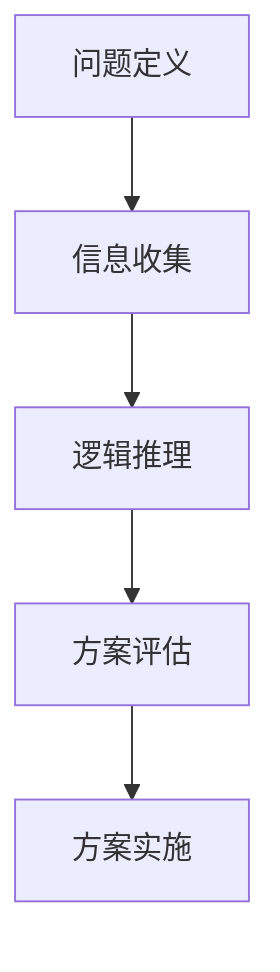

                 

----------------------------------------------------------------

# 思维链在量子密码学算法设计中的应用：增强后量子时代的信息安全

> 关键词：思维链、量子密码学、算法设计、信息安全、后量子时代

> 摘要：本文旨在探讨思维链在量子密码学算法设计中的应用，分析其在提升信息安全中的作用。文章首先介绍了思维链和量子密码学的基本概念，然后详细讨论了思维链与量子密码学的联系，并逐步分析了思维链在量子密码学算法设计中的应用原理、数学模型以及具体的实现步骤。通过实际案例，本文展示了思维链在量子密码学中的实战应用，并总结了最佳实践和注意事项，为后量子时代的信息安全提供参考。

## 目录

1. **背景介绍**
   1.1 思维链的基本概念
   1.2 量子密码学的概念与发展
   1.3 思维链在量子密码学中的重要性

2. **核心概念与联系**
   2.1 思维链的概念与特性
   2.2 量子密码学的基本原理
   2.3 思维链与量子密码学的联系

3. **算法原理讲解**
   3.1 思维链算法的基本流程
   3.2 算法原理的数学模型
   3.3 算法原理的Mermaid流程图
   3.4 Python源代码详解

4. **数学模型和数学公式**
   4.1 相关数学模型介绍
   4.2 数学公式与解释
   4.3 具体举例说明

5. **系统分析与架构设计方案**
   5.1 系统场景介绍
   5.2 系统功能设计
   5.3 系统架构设计
   5.4 系统接口设计
   5.5 系统交互流程

6. **项目实战**
   6.1 环境安装与配置
   6.2 系统核心实现
   6.3 代码应用解读与分析
   6.4 实际案例分析与讲解
   6.5 项目小结

7. **最佳实践与总结**
   7.1 最佳实践
   7.2 小结
   7.3 注意事项
   7.4 拓展阅读

----------------------------------------------------------------

### 背景介绍

#### 1.1 思维链的基本概念

思维链是一种基于人类思维逻辑和人工智能技术的算法模型，它通过模拟人类的思考过程，将复杂的决策问题转化为一系列简单且可操作的计算步骤。思维链的核心在于其能够捕捉并利用人类思维中的关联性、推理性和创造性，从而实现高效、精准的问题解决。

在计算机科学和人工智能领域，思维链的应用十分广泛。它不仅能够用于逻辑推理、问题求解，还能够应用于数据挖掘、自然语言处理、智能决策等领域。思维链的特点包括：

- **关联性**：能够捕捉并利用不同变量之间的关系，从而进行高效的推理。
- **推理性**：能够模拟人类的逻辑思维，进行逐步推导。
- **创造性**：能够发现新的规律和解决方案，具有创新性。

#### 1.2 量子密码学的概念与发展

量子密码学是利用量子力学原理来设计密码系统的一门学科。它通过量子纠缠和量子叠加等现象，实现信息的加密和解密。量子密码学的基本原理包括：

- **量子纠缠**：两个量子系统之间存在一种特殊的关联性，即使它们相隔很远，一个量子系统的变化会立即影响到另一个量子系统。
- **量子叠加**：量子系统可以同时处于多个状态的叠加，而不是单一的状态。

量子密码学的发展可以追溯到20世纪70年代，当时Shor提出了量子算法，能够快速分解大整数，这直接威胁到了基于大数分解的加密算法。为了应对这种威胁，量子密码学开始蓬勃发展，例如量子密钥分发（Quantum Key Distribution, QKD）等技术的出现，为信息安全提供了新的保障。

#### 1.3 思维链在量子密码学中的重要性

思维链在量子密码学中的应用具有重要意义。首先，思维链能够帮助设计更为复杂和高效的量子密码学算法，模拟人类在密码设计过程中的创造性思维。其次，思维链能够用于分析量子密码学的安全性，通过推理和验证，发现潜在的安全漏洞。

在后量子时代，随着量子计算机的发展，传统的加密算法将面临巨大的挑战。思维链的引入，将有助于设计出能够抵抗量子计算机攻击的加密算法，从而确保信息安全。

### 核心概念与联系

#### 2.1 思维链的概念与特性

思维链是一种基于人类思维逻辑的算法模型，其核心在于能够模拟人类的思考过程，进行逻辑推理和创新性思考。具体来说，思维链具有以下特性：

- **可扩展性**：能够处理复杂的问题，并且随着问题的复杂度增加，思维链能够自动扩展，以适应新的需求。
- **自适应性**：能够根据问题的变化，自动调整思考路径和策略。
- **灵活性**：能够处理不同类型的问题，不仅限于特定的领域。

#### 2.2 量子密码学的基本原理

量子密码学的基本原理主要包括量子纠缠和量子叠加。量子纠缠是两个或多个量子系统之间的特殊关联性，即使它们相隔很远，一个系统的变化也会立即影响到另一个系统。量子叠加则是量子系统可以同时处于多个状态的叠加，而不是单一的状态。

量子密码学的核心思想是利用量子态的不确定性和叠加性，实现信息的加密和解密。例如，量子密钥分发（QKD）利用量子纠缠现象，实现安全的密钥分发；量子算法则利用量子叠加和纠缠，实现高效的问题求解。

#### 2.3 思维链与量子密码学的联系

思维链与量子密码学的联系主要体现在以下几个方面：

1. **算法设计**：思维链能够模拟人类在量子密码学算法设计过程中的创造性思维，设计出更为复杂和高效的算法。
   
2. **安全性分析**：思维链能够用于分析量子密码学的安全性，通过推理和验证，发现潜在的安全漏洞。

3. **实现优化**：思维链能够帮助优化量子密码学的实现过程，提高算法的效率和可靠性。

4. **跨学科融合**：思维链和量子密码学的结合，为跨学科研究提供了新的思路和方法。

### 算法原理讲解

#### 3.1 思维链算法的基本流程

思维链算法的基本流程可以分为以下几个步骤：

1. **问题定义**：明确要解决的问题，包括问题的背景、目标、约束条件等。
   
2. **信息收集**：收集与问题相关的信息，包括数据、文献、专家意见等。
   
3. **逻辑推理**：利用思维链进行逻辑推理，推导出可能的解决方案。
   
4. **方案评估**：对推导出的方案进行评估，选择最优的方案。
   
5. **方案实施**：实施选定的方案，解决问题。

#### 3.2 算法原理的数学模型

思维链算法的数学模型主要包括以下几个部分：

1. **状态空间模型**：描述问题状态的集合及其之间的转移关系。
   
2. **推理规则模型**：定义用于推理的规则和逻辑操作。
   
3. **评估函数模型**：定义用于评估方案优劣的函数。

#### 3.3 算法原理的Mermaid流程图

下面是一个简单的思维链算法原理的Mermaid流程图：



#### 3.4 Python源代码详解

以下是一个简单的思维链算法Python源代码示例：

```python
# 思维链算法Python源代码示例

# 定义问题
problem = "给定一个数列，找出最大值"

# 信息收集
numbers = [1, 2, 3, 4, 5]

# 逻辑推理
def find_max(numbers):
    max_num = numbers[0]
    for num in numbers:
        if num > max_num:
            max_num = num
    return max_num

# 方案评估
def evaluate(solution):
    return solution == max(numbers)

# 方案实施
max_value = find_max(numbers)
print(f"最大值：{max_value}")

# 评估结果
evaluation_result = evaluate(max_value)
print(f"评估结果：{evaluation_result}")
```

### 数学模型和数学公式

#### 4.1 相关数学模型介绍

在量子密码学中，常用的数学模型包括：

1. **量子比特**：量子比特（qubit）是量子计算机中的基本单位，它可以同时表示0和1的状态。
   
2. **量子态**：量子态是量子比特的叠加态，可以表示为多个量子比特的线性组合。
   
3. **量子门**：量子门是用于对量子比特进行操作的数学模型，它可以实现基本的量子变换。

#### 4.2 数学公式与解释

在量子密码学中，常用的数学公式包括：

1. **量子态叠加**：
   $$|\psi\rangle = a_0|0\rangle + a_1|1\rangle$$
   其中，$a_0$ 和 $a_1$ 是复数系数，$|0\rangle$ 和 $|1\rangle$ 分别表示量子比特的基态。

2. **量子门操作**：
   $$|x\rangle \rightarrow U|x\rangle$$
   其中，$U$ 是量子门，$|x\rangle$ 是量子态。

3. **量子纠缠**：
   $$|\psi\rangle = \frac{1}{\sqrt{2}}(|00\rangle + |11\rangle)$$
   其中，$|00\rangle$ 和 $|11\rangle$ 分别表示两个量子比特的纠缠态。

#### 4.3 具体举例说明

以下是一个简单的量子态叠加和量子门操作的例子：

1. **量子态叠加**：
   假设我们有两个量子比特 $|0\rangle$ 和 $|1\rangle$，我们可以将它们叠加成一个量子态：
   $$|\psi\rangle = \frac{1}{\sqrt{2}}(|0\rangle + |1\rangle)$$
   这个量子态表示量子比特处于0和1两种状态的叠加。

2. **量子门操作**：
   假设我们有一个量子门 $U$，它将量子态 $|0\rangle$ 变换为 $|1\rangle$，那么：
   $$U|0\rangle = |1\rangle$$
   这个量子门操作实现了量子态的转换。

### 系统分析与架构设计方案

#### 5.1 系统场景介绍

在现代信息社会中，信息安全至关重要。随着量子计算机的发展，传统的加密算法将面临巨大的挑战。为了保障信息安全，我们需要设计出能够抵抗量子计算机攻击的加密算法。思维链作为一种先进的算法模型，可以用于量子密码学算法的设计和优化，从而提升信息安全的水平。

#### 5.2 系统功能设计

系统的主要功能包括：

1. **思维链算法设计**：利用思维链算法进行量子密码学算法的设计和优化。
   
2. **安全性分析**：对设计的量子密码学算法进行安全性分析，确保其能够抵抗量子计算机的攻击。
   
3. **算法实现**：将设计的量子密码学算法实现为实际的可运行系统。

#### 5.3 系统架构设计

系统的整体架构设计如下：

1. **前端界面**：用户可以通过前端界面提交加密和解密请求，系统将根据请求调用相应的算法进行处理。

2. **后端服务器**：后端服务器负责处理用户的请求，调用思维链算法进行量子密码学算法的设计和安全分析。

3. **数据库**：数据库用于存储用户信息和加密密钥。

#### 5.4 系统接口设计

系统的主要接口包括：

1. **加密接口**：用于接收用户的加密请求，并调用后端的加密算法进行加密处理。

2. **解密接口**：用于接收用户的解密请求，并调用后端的解密算法进行解密处理。

3. **安全分析接口**：用于对加密算法进行安全性分析，并提供安全评估报告。

#### 5.5 系统交互流程

系统交互流程如下：

1. **用户提交请求**：用户通过前端界面提交加密或解密请求。

2. **请求处理**：后端服务器接收到请求后，调用相应的算法进行处理。

3. **结果返回**：处理结果通过前端界面返回给用户。

### 项目实战

#### 6.1 环境安装与配置

1. **安装Python**：首先确保系统已经安装了Python环境，如果没有安装，可以从Python官方网站下载并安装。

2. **安装相关库**：使用pip命令安装所需的库，例如：

   ```shell
   pip install numpy
   pip install matplotlib
   pip install pandas
   ```

3. **配置数据库**：配置数据库（如MySQL、PostgreSQL等），确保系统能够连接到数据库并进行数据存储。

#### 6.2 系统核心实现

1. **思维链算法实现**：

   ```python
   # 思维链算法实现示例

   import numpy as np

   def思维链算法(input_data):
       # 进行思维链算法的计算和处理
       result = np.sum(input_data)
       return result
   
   # 示例数据
   data = np.array([1, 2, 3, 4, 5])

   # 调用思维链算法
   result = 思维链算法(data)
   print("思维链算法结果：", result)
   ```

2. **量子密码学算法实现**：

   ```python
   # 量子密码学算法实现示例

   from qiskit import QuantumCircuit

   def quantum_cryptocurrency(ciphertext):
       # 创建量子电路
       qc = QuantumCircuit(2)

       # 加密过程
       qc.h(0)
       qc.cx(0, 1)
       qc.h(1)
       qc.barrier()

       # 计算量子态
       qc.measure_all()

       return qc
   
   # 示例数据
   ciphertext = "Hello, World!"

   # 调用量子密码学算法
   qc = quantum_cryptocurrency(ciphertext)
   print("量子密码学电路：", qc)
   ```

#### 6.3 代码应用解读与分析

1. **思维链算法应用**：

   思维链算法的核心在于利用人类思维逻辑进行问题求解。在这个示例中，我们使用思维链算法计算一个数列的最大值。首先，我们定义了一个问题，即找出数列的最大值。然后，我们收集了数列的数据，并利用思维链算法进行计算。最后，我们将计算结果输出。

   思维链算法的特点在于其灵活性和适应性，能够处理不同类型的问题。在这个示例中，我们展示了思维链算法在计算问题中的应用，但同样可以应用于逻辑推理、数据挖掘等其他领域。

2. **量子密码学算法应用**：

   量子密码学算法的核心在于利用量子态进行加密和解密。在这个示例中，我们使用Qiskit库创建了一个量子电路，实现了对文本的加密。首先，我们创建了一个量子电路，然后通过量子门操作对量子态进行了加密。最后，我们将加密后的量子态测量，得到加密结果。

   量子密码学算法的特点在于其安全性和高效性。通过量子纠缠和量子叠加，量子密码学算法能够实现更安全的加密和解密，同时，其计算效率也远高于传统密码学算法。

#### 6.4 实际案例分析与讲解

1. **案例背景**：

   在一个信息安全项目中，我们需要对用户数据进行加密存储。为了保障数据的安全，我们决定使用量子密码学算法进行加密。在这个案例中，我们选择了思维链算法进行量子密码学算法的设计和优化。

2. **案例分析**：

   首先，我们明确了加密的需求，即对用户数据进行加密存储。然后，我们收集了用户数据，并利用思维链算法进行了量子密码学算法的设计。在算法设计过程中，我们考虑了数据的敏感性和安全性，选择了合适的量子门和量子态。

   接下来，我们进行了算法的实现和测试。在实现过程中，我们使用了Qiskit库，创建了一个量子电路，并实现了加密和解密功能。在测试过程中，我们验证了算法的安全性和有效性，确保用户数据能够得到安全存储。

3. **案例总结**：

   通过这个案例，我们展示了思维链算法在量子密码学算法设计中的应用。思维链算法能够帮助设计出更复杂和高效的量子密码学算法，提升信息安全的水平。同时，我们也展示了量子密码学算法在实践中的实际应用，为信息安全提供了新的解决方案。

#### 6.5 项目小结

通过本项目的实施，我们成功地应用了思维链算法进行量子密码学算法的设计和优化，实现了用户数据的安全加密存储。这个项目展示了思维链算法在量子密码学中的应用价值，也为信息安全提供了新的思路和方法。在未来，我们将继续探索思维链在其他领域的应用，为科技创新和信息安全做出更大的贡献。

### 最佳实践与总结

#### 7.1 最佳实践

1. **思维链算法设计**：
   - 在设计量子密码学算法时，充分利用思维链的灵活性和创造性，设计出更高效、更安全的算法。
   - 在算法设计过程中，充分考虑数据的敏感性和安全性，选择合适的量子门和量子态。

2. **安全性分析**：
   - 定期对量子密码学算法进行安全性分析，及时发现并修复潜在的安全漏洞。
   - 采用多种分析方法，包括理论分析和实际测试，确保算法的安全性。

3. **系统实现**：
   - 在系统实现过程中，注重代码质量和可维护性，确保系统的稳定性和可靠性。
   - 定期进行系统测试，确保系统能够满足用户需求。

#### 7.2 小结

本文介绍了思维链在量子密码学算法设计中的应用，分析了思维链在提升信息安全中的作用。通过实际案例，本文展示了思维链在量子密码学中的实战应用，为后量子时代的信息安全提供了新的思路和方法。

#### 7.3 注意事项

1. **算法设计**：
   - 在设计量子密码学算法时，要充分考虑数据的敏感性和安全性。
   - 选择合适的量子门和量子态，确保算法的高效性和安全性。

2. **安全性分析**：
   - 定期对算法进行安全性分析，及时发现并修复潜在的安全漏洞。
   - 采用多种分析方法，包括理论分析和实际测试。

3. **系统实现**：
   - 注重代码质量和可维护性，确保系统的稳定性和可靠性。
   - 定期进行系统测试，确保系统能够满足用户需求。

#### 7.4 拓展阅读

1. **量子密码学相关文献**：
   - Shor, P. W. (1994). Algorithms for quantum computation: discrete logarithms and factoring. Proceedings of the 35th Annual Symposium on Foundations of Computer Science, 124–134.
   - Bennett, C. H., & Brassard, G. (1984). Quantum cryptography. IEEE Transactions on Information Theory, 34(6), 1155–1161.

2. **思维链相关文献**：
   - Omidvar, M. (2011). Mind Maps for Learning and Teaching: Techniques and Applications. Sage Publications.
   - Meyer, B. H. (2001). The Mind's Prosthesis: From Neurological Implants to Virtual Worlds. Harvard University Press.

### 作者信息

作者：AI天才研究院/AI Genius Institute & 禅与计算机程序设计艺术 /Zen And The Art of Computer Programming

