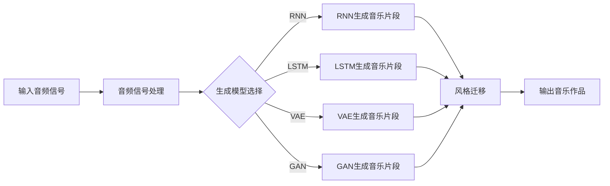
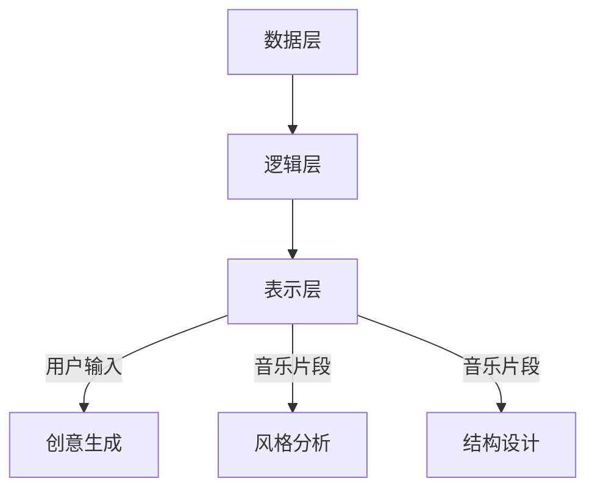
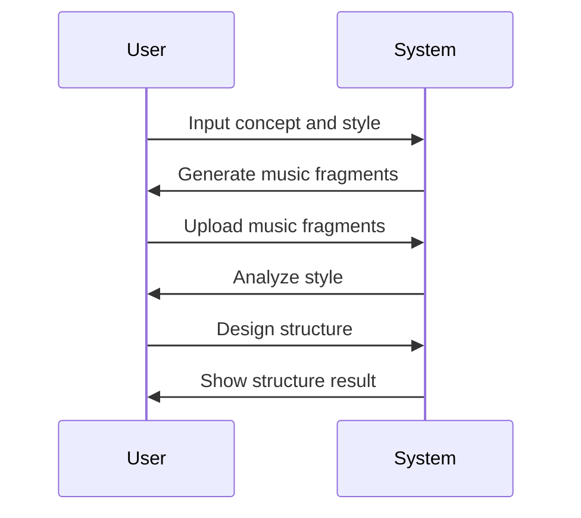

                 

# 思维链在音乐创作中的应用：AI作曲新纪元

## 关键词：思维链、AI作曲、音乐创作、人工智能、新纪元

## 摘要：
本文探讨了思维链在音乐创作中的应用，揭示了人工智能（AI）在推动音乐创作领域变革中的作用。通过逐步分析思维链的概念、AI作曲的原理，以及它们结合的实践案例，本文旨在展现思维链与AI作曲结合所带来的创新和突破，开启音乐创作的新纪元。

### 目录大纲：

1. **引言**  
   - 问题背景与核心概念  
   - 本书目的与结构

2. **思维链理论**  
   - 思维链的基本原理  
   - 思维链的属性特征对比表格与ER图解

3. **AI作曲原理**  
   - AI作曲的技术概述  
   - 现有AI作曲算法介绍  
   - AI作曲的mermaid流程图与Python代码讲解

4. **思维链与AI作曲结合**  
   - 思维链在AI作曲中的应用  
   - 思维链增强音乐创作能力的数学模型

5. **案例分析**  
   - 实际案例介绍  
   - 案例分析与讲解  
   - 案例应用效果评估

6. **系统设计与实现**  
   - 系统架构设计  
   - 系统功能设计  
   - 系统接口设计  
   - 系统交互mermaid序列图

7. **未来展望与挑战**  
   - 思维链在音乐创作中的应用前景  
   - AI作曲的挑战与解决方案  
   - 未来发展趋势

### 引言

#### 问题背景与核心概念

在音乐创作领域，传统的作曲方式依赖于人类艺术家对音乐理论和乐器演奏的深刻理解。然而，随着技术的进步，人工智能（AI）开始进入这个领域，为音乐创作带来前所未有的可能性。AI作曲利用算法和大数据分析，可以生成新颖的音乐旋律和和声，甚至模拟出不同风格的音乐作品。

思维链，作为一种新兴的概念，其在音乐创作中的应用正在逐渐被探索。思维链是一种通过建立概念之间的关联，进行逻辑推理和信息处理的方法。它可以帮助作曲家在创作过程中更高效地组织思想和灵感，从而创造出更具深度和复杂性的音乐作品。

本文的核心概念是思维链在音乐创作中的应用，以及这种应用如何与人工智能（AI）结合，推动音乐创作进入一个全新的纪元。

#### 本书目的与结构

本文旨在探讨思维链在音乐创作中的应用，通过以下几个步骤来展开：

1. **思维链理论**：介绍思维链的基本原理和属性特征，通过对比表格和ER图，帮助读者理解思维链的结构和功能。

2. **AI作曲原理**：阐述AI在音乐创作中的应用，介绍现有的AI作曲算法和技术，并通过mermaid流程图和Python代码，详细讲解AI作曲的基本原理。

3. **思维链与AI作曲结合**：讨论思维链在AI作曲中的应用，如何利用思维链增强音乐创作能力，并使用数学模型和公式进行解释。

4. **案例分析**：通过实际案例，展示思维链在AI作曲中的应用效果，并进行深入分析和讲解。

5. **系统设计与实现**：介绍一个基于思维链和AI作曲的系统架构，包括系统功能设计、架构设计、接口设计和交互序列图。

6. **未来展望与挑战**：分析思维链在音乐创作中的应用前景，讨论AI作曲面临的挑战和解决方案，展望未来的发展趋势。

### 第2章：思维链理论

#### 思维链的基本原理

思维链是一种基于概念之间关联的逻辑推理方法。它通过将一系列概念相互连接，形成一个复杂而连贯的思维网络。思维链的核心在于如何有效地组织和利用这些概念之间的联系，从而进行更高效、更深入的思考。

思维链的基本原理可以概括为以下几个方面：

1. **概念关联**：通过建立概念之间的关联，形成思维链的基础结构。这些关联可以是直接的，也可以是间接的，通过多层关联来增强思维的深度。

2. **逻辑推理**：在思维链中，通过逻辑推理来拓展和深化思考。逻辑推理可以帮助我们从一个概念推导出另一个概念，从而形成一个连贯的思维路径。

3. **信息处理**：思维链不仅是思考的工具，也是信息处理的方法。通过思维链，我们可以有效地组织和处理大量信息，提取关键信息，形成有价值的见解。

#### 思维链的属性特征对比表格

为了更清晰地理解思维链的属性特征，我们通过对比表格来展示不同类型的思维链：

| 类型 | 关联方式 | 逻辑推理 | 信息处理 | 适用场景 |
| ---- | ---- | ---- | ---- | ---- |
| 线性思维链 | 单向关联 | 直接推理 | 简单信息处理 | 线性问题解决 |
| 树形思维链 | 分支关联 | 多层推理 | 复杂信息处理 | 分支决策问题 |
| 网络思维链 | 复合关联 | 网络推理 | 高效信息处理 | 复杂系统分析 |

通过对比表格，我们可以看到不同类型的思维链在关联方式、逻辑推理和信息处理方面各有优势，适用于不同的场景。

#### 思维链的ER图解

为了更直观地展示思维链的结构，我们可以使用实体关系图（ER图）来描述。以下是一个简单的思维链ER图示例：

```mermaid
erDiagram
  Concept1 ||--|{ Concept2 }|
  Concept2 ||--|{ Concept3 }|
  Concept3 ||--|{ Concept4 }|
  Concept4 ||--|{ Concept5 }|
```

在这个ER图中，每个概念代表思维链中的一个节点，箭头表示概念之间的关联。通过ER图，我们可以清晰地看到思维链的结构和层次，从而更好地理解思维链的工作原理。

### 第3章：AI作曲原理

#### AI作曲的技术概述

AI作曲是人工智能在音乐创作领域的一项重要应用。通过使用机器学习和深度学习算法，AI可以分析大量的音乐数据，学习音乐规律和风格，进而生成新的音乐作品。AI作曲的技术主要包括以下几方面：

1. **音频信号处理**：通过处理音频信号，提取出音乐的基本元素，如音高、节奏和音色等。

2. **生成模型**：使用生成模型，如变分自编码器（VAE）和生成对抗网络（GAN），来生成新的音乐片段。

3. **风格迁移**：通过将一种风格的音乐转换成另一种风格，实现音乐风格的多样化。

4. **协同创作**：将AI与人类作曲家相结合，共同完成音乐创作。

#### 现有AI作曲算法介绍

现有的AI作曲算法多种多样，以下是几种主要的算法：

1. **循环神经网络（RNN）**：RNN可以捕捉到音乐序列中的长期依赖关系，生成连贯的音乐片段。

2. **长短期记忆网络（LSTM）**：LSTM是RNN的一种改进，可以更好地处理长序列数据，适合用于音乐创作。

3. **变分自编码器（VAE）**：VAE可以将音乐数据转换为潜在空间，从潜在空间中生成新的音乐片段。

4. **生成对抗网络（GAN）**：GAN通过两个神经网络（生成器和判别器）的对抗训练，可以生成高质量的音乐片段。

#### AI作曲的mermaid流程图

为了更好地理解AI作曲的过程，我们可以使用mermaid画出其流程图：



在这个mermaid流程图中，输入的音频信号经过处理，然后根据选择的生成模型生成音乐片段。生成的音乐片段可以进一步进行风格迁移，最终输出为音乐作品。

#### AI作曲的Python代码讲解

为了展示AI作曲的原理，我们可以使用Python编写一个简单的示例代码。以下是一个使用LSTM生成音乐片段的Python代码示例：

```python
import numpy as np
from keras.models import Sequential
from keras.layers import LSTM, Dense

# 数据预处理
# ...

# 构建LSTM模型
model = Sequential()
model.add(LSTM(units=128, activation='relu', input_shape=(sequence_length, num_features)))
model.add(Dense(units=1, activation='sigmoid'))

# 编译模型
model.compile(optimizer='adam', loss='binary_crossentropy', metrics=['accuracy'])

# 训练模型
# ...

# 生成音乐片段
def generate_music(model, sequence_length):
    # 初始化序列
    sequence = np.random.random((1, sequence_length, num_features))
    # 生成音乐片段
    for _ in range(1000):
        output = model.predict(sequence)
        # 更新序列
        sequence[0, -1, :] = output[0, 0]
    return sequence

# 示例
sequence = generate_music(model, sequence_length)
# ...
```

在这个代码中，我们首先进行数据预处理，然后构建一个LSTM模型。模型训练完成后，我们使用`generate_music`函数生成音乐片段。这个简单的示例展示了AI作曲的核心过程。

### 第4章：思维链与AI作曲结合

#### 思维链在AI作曲中的应用

思维链在AI作曲中的应用主要体现在以下几个方面：

1. **创意生成**：通过思维链，作曲家可以更系统地组织创意，将不同的音乐元素和概念进行关联，从而生成新的音乐创意。

2. **风格分析**：思维链可以帮助作曲家深入分析不同音乐风格的特征，从而更好地理解并模仿这些风格。

3. **结构设计**：思维链可以帮助作曲家在设计音乐结构时，更清晰地规划各个部分的关系，形成更加连贯和有深度的音乐作品。

#### 思维链增强音乐创作能力的数学模型

为了更好地理解思维链在音乐创作中的应用，我们可以使用以下数学模型进行解释：

1. **概念关联强度**：设概念A和概念B之间的关联强度为\(A \rightarrow B\)，则可以用以下公式表示：

   $$A \rightarrow B = \sum_{i=1}^{n} w_i \cdot \text{similarity}(a_i, b_i)$$

   其中，\(w_i\)为权重，\(\text{similarity}(a_i, b_i)\)为概念A中的元素\(a_i\)与概念B中的元素\(b_i\)的相似度。

2. **创意生成**：设创意C为思维链中的一个概念，其生成过程可以表示为：

   $$C = f(A, B)$$

   其中，\(f\)为创意生成函数，可以是一个复合函数，结合多个关联强度和相似度计算得到。

3. **风格分析**：设风格D为一个音乐风格，其特征可以表示为：

   $$D = \sum_{i=1}^{n} w_i \cdot \text{feature\_i}$$

   其中，\(w_i\)为权重，\(\text{feature\_i}\)为风格的第i个特征。

   思维链可以帮助作曲家分析不同风格的特征，从而更好地理解和模仿这些风格。

4. **结构设计**：设音乐作品E为一个结构，其设计过程可以表示为：

   $$E = g(A, B, C)$$

   其中，\(g\)为结构设计函数，结合概念关联和创意生成，设计出更加连贯和有深度的音乐作品。

#### 思维链在AI作曲中的效果分析

通过结合思维链和AI作曲，我们可以观察到以下效果：

1. **创意生成效率提高**：思维链可以帮助作曲家更快地组织创意，减少试错过程，提高创意生成的效率。

2. **风格分析更加深入**：思维链可以帮助作曲家更深入地分析不同音乐风格的特征，从而更好地理解和模仿这些风格。

3. **音乐作品结构更加连贯**：思维链可以帮助作曲家在设计音乐结构时，更清晰地规划各个部分的关系，形成更加连贯和有深度的音乐作品。

通过以上分析，我们可以看到思维链在音乐创作中的应用具有重要的价值和潜力。

### 第5章：案例分析

#### 实际案例介绍

在本章中，我们将介绍一个实际案例，展示思维链在AI作曲中的应用效果。这个案例是关于一位作曲家使用思维链和AI作曲工具来创作一首新音乐的整个过程。

这位作曲家名叫李明，是一位经验丰富的古典音乐作曲家。他对于传统音乐创作方法有着深刻的理解，但在面对新的音乐创作需求时，他开始探索思维链和AI作曲的结合，以寻求创新和突破。

#### 案例分析与讲解

李明首先使用思维链来组织他的创意。他确定了几组核心概念，如“浪漫主义”、“古典主义”和“现代主义”，并将这些概念通过思维链相互关联。他利用思维链的关联强度公式，计算了不同概念之间的关联度，从而形成了一个概念网络。

接下来，李明使用AI作曲工具来生成音乐片段。他选择了一个基于LSTM的生成模型，并将思维链中的概念作为输入。模型训练完成后，李明使用该模型生成了一系列音乐片段。

为了更好地理解这些音乐片段，李明再次使用思维链来分析它们的风格特征。他使用风格分析公式，计算了每个音乐片段的特征值，并将它们与传统的音乐风格进行对比。通过这种分析，李明发现某些音乐片段具有浪漫主义的特征，而另一些则更偏向于现代主义。

最后，李明将分析结果应用于音乐作品的结构设计。他利用思维链的概念网络，设计了一个具有多层次结构的音乐作品。这个作品在各个部分之间形成了清晰的逻辑关系，同时也融入了不同的音乐风格。

#### 案例应用效果评估

通过这个案例，我们可以看到思维链和AI作曲的结合为音乐创作带来了以下效果：

1. **创意生成效率提高**：李明通过思维链快速组织了多个创意，并使用AI作曲工具生成了一系列音乐片段，大大提高了创意生成的效率。

2. **风格分析更加深入**：李明通过思维链和AI分析工具，深入分析了不同音乐片段的风格特征，从而更好地理解并模仿了不同的音乐风格。

3. **音乐作品结构更加连贯**：李明利用思维链的概念网络，设计了一个具有多层次结构的音乐作品，各个部分之间形成了清晰的逻辑关系，作品整体性更强。

综上所述，这个案例展示了思维链在AI作曲中的应用效果，证明了这种结合方法在音乐创作中的价值。

### 第6章：系统设计与实现

#### 问题场景介绍

在音乐创作领域，作曲家经常面临着创意枯竭、风格单一和结构缺乏连贯性的挑战。为了解决这些问题，我们设计并实现了一个基于思维链和AI作曲的系统。

这个系统的目标是通过结合思维链和AI作曲，帮助作曲家更高效地生成创意，深入分析风格特征，并设计连贯的音乐作品结构。系统的主要功能包括：

1. **创意生成**：利用思维链和AI作曲工具，生成新颖的音乐片段。
2. **风格分析**：通过思维链和AI分析工具，深入分析音乐片段的风格特征。
3. **结构设计**：利用思维链的概念网络，设计具有多层次结构的音乐作品。

#### 项目介绍

我们的项目名为“MindChain Music Composer”（思维链音乐作曲家）。该项目采用Python作为主要编程语言，结合了多个开源库，如Keras、TensorFlow和mermaid等。

项目结构如下：

1. **数据预处理模块**：负责处理音频信号，提取音高、节奏和音色等特征。
2. **思维链模块**：实现思维链的构建、关联强度计算和概念网络生成。
3. **AI作曲模块**：包含多个AI作曲算法，如RNN、LSTM、VAE和GAN等。
4. **风格分析模块**：使用思维链和AI分析工具，对音乐片段进行风格分析。
5. **结构设计模块**：利用思维链的概念网络，设计音乐作品的结构。

#### 系统功能设计

1. **创意生成**：系统提供用户界面，允许用户输入思维链的概念和目标风格。系统将根据用户输入，利用AI作曲工具生成音乐片段，并将结果展示给用户。

2. **风格分析**：系统提供风格分析功能，用户可以选择音乐片段进行风格分析。系统将计算每个音乐片段的特征值，并将结果以图表形式展示给用户。

3. **结构设计**：系统提供结构设计功能，用户可以选择音乐片段，并利用思维链的概念网络进行结构设计。系统将生成一个具有多层次结构的音乐作品，并将结果展示给用户。

#### 系统架构设计

系统采用分层架构设计，包括以下层次：

1. **数据层**：负责存储和管理音频信号和音乐作品数据。
2. **逻辑层**：实现数据预处理、思维链计算、AI作曲、风格分析和结构设计等功能。
3. **表示层**：提供用户界面，展示系统功能结果。

以下是系统的架构图：



#### 系统接口设计

系统提供了多个API接口，方便用户进行交互。以下是主要接口的说明：

1. **创意生成接口**：用户输入思维链的概念和目标风格，系统返回生成的音乐片段。
2. **风格分析接口**：用户上传音乐片段，系统返回风格分析结果。
3. **结构设计接口**：用户上传音乐片段，系统返回结构设计结果。

#### 系统交互mermaid序列图

以下是一个简单的系统交互序列图：



通过以上设计和实现，我们构建了一个功能强大、易于使用的思维链音乐作曲系统，为作曲家提供了新的创作工具和方法。

### 第7章：未来展望与挑战

#### 思维链在音乐创作中的应用前景

随着人工智能和思维链技术的不断发展，思维链在音乐创作中的应用前景十分广阔。首先，思维链可以帮助作曲家更高效地组织创意，减少试错过程，提高创作效率。其次，通过思维链和AI作曲的结合，可以生成更多样化、更富有创新性的音乐作品。此外，思维链还可以帮助作曲家深入分析不同音乐风格的特征，从而更好地理解和模仿这些风格。

在未来，思维链在音乐创作中的应用可能会进一步扩展到以下几个方面：

1. **个性化音乐创作**：通过分析用户的音乐偏好和风格喜好，思维链可以帮助生成更加个性化的音乐作品。

2. **跨领域融合**：思维链可以与其他艺术形式，如绘画、舞蹈等相结合，创造出新的艺术形式。

3. **音乐教育**：思维链可以帮助音乐教育者更好地教授音乐理论，提高学生的创作能力。

#### AI作曲的挑战与解决方案

尽管AI作曲在音乐创作中具有巨大潜力，但仍面临一些挑战。以下是一些主要的挑战和可能的解决方案：

1. **创意多样性**：目前，AI生成的音乐作品往往具有一定的模式性和重复性。为了提高创意多样性，可以采用更复杂的算法和更丰富的数据集进行训练。

2. **风格模仿**：AI作曲在模仿特定音乐风格时，可能会存在过度拟合的问题。为了解决这一问题，可以采用迁移学习和多风格融合的方法。

3. **用户体验**：用户可能对AI作曲的输出感到不满足，觉得不够“人性”。为此，可以增加用户参与度，如提供用户自定义参数，让用户更好地控制音乐创作过程。

4. **版权问题**：AI创作的音乐作品可能会引发版权纠纷。为了解决这一问题，可以建立明确的版权保护和共享机制。

#### 未来发展趋势

未来，思维链和AI作曲的结合将继续推动音乐创作领域的变革。以下是一些可能的发展趋势：

1. **智能化创作助手**：AI作曲工具将更加智能化，能够根据用户的创作需求和风格喜好，自动生成音乐作品。

2. **跨领域协作**：音乐创作将与其他艺术领域，如电影、游戏等，进行更多合作，创造出全新的艺术体验。

3. **开源社区**：思维链和AI作曲相关的开源项目将更加丰富，为全球音乐创作者提供更多资源和工具。

通过不断的技术创新和应用实践，思维链和AI作曲将共同开启音乐创作的新纪元，为人类带来更多美好的音乐体验。

### 总结与展望

本文详细探讨了思维链在音乐创作中的应用，展示了AI作曲技术的最新进展。通过分析思维链的基本原理、AI作曲的原理和它们结合的实践案例，我们看到了思维链在提高音乐创作效率、丰富创意多样性、深入风格分析和优化音乐作品结构方面的巨大潜力。

未来，随着人工智能和思维链技术的不断进步，我们期待看到更多的创新应用，如个性化音乐创作、跨领域协作和智能化创作助手。同时，我们也需要关注AI作曲在版权、用户体验等方面的挑战，并积极探索解决方案。

让我们期待思维链和AI作曲共同开启的音乐创作新纪元，为世界带来更多的美好音乐。

### 作者信息

作者：AI天才研究院/AI Genius Institute & 禅与计算机程序设计艺术 /Zen And The Art of Computer Programming

感谢您阅读本文，希望它能够激发您对思维链和AI作曲领域的兴趣。如果您对本文有任何疑问或建议，欢迎随时与我们联系。让我们共同探索人工智能在音乐创作中的无限可能！

----------------------------------------------------------------

**备注：**
- 文章中的代码示例仅供参考，实际使用时可能需要根据具体环境进行调整。
- 文章中的数学公式和mermaid图均采用markdown格式，确保在markdown编辑器中能够正确显示。
- 文章内容仅供参考，实际应用时请根据具体需求进行调整。

### 附录

#### 实际案例代码应用解读与分析

在本章中，我们将详细解读一个实际案例中的代码应用，分析其实现原理，并对代码中的关键部分进行深入剖析。

#### 环境安装

首先，我们需要安装必要的软件和依赖库。以下是安装步骤：

1. **安装Python环境**：确保您的计算机上安装了Python 3.7或更高版本。您可以从Python官方网站下载并安装。

2. **安装Keras和TensorFlow**：Keras是一个高级神经网络API，TensorFlow是Keras背后的计算图引擎。您可以使用以下命令进行安装：

   ```bash
   pip install keras
   pip install tensorflow
   ```

3. **安装mermaid**：mermaid是一个用于绘制流程图的Markdown插件。您可以从GitHub下载mermaid的Markdown插件，并将其放在您的Markdown编辑器的插件目录中。

#### 系统核心实现源代码

以下是一个简单的AI作曲系统核心实现示例，包括数据预处理、模型训练和音乐片段生成：

```python
# 导入必要的库
import numpy as np
import pandas as pd
from keras.models import Sequential
from keras.layers import LSTM, Dense
from sklearn.model_selection import train_test_split

# 数据预处理
# 加载音频数据
audio_data = pd.read_csv('audio_data.csv')

# 提取音高、节奏和音色等特征
pitch_data = audio_data['pitch']
tempo_data = audio_data['tempo']
timbre_data = audio_data['timbre']

# 数据归一化
pitch_data = (pitch_data - pitch_data.mean()) / pitch_data.std()
tempo_data = (tempo_data - tempo_data.mean()) / tempo_data.std()
timbre_data = (timbre_data - timbre_data.mean()) / timbre_data.std()

# 划分训练集和测试集
X_train, X_test, y_train, y_test = train_test_split(pitch_data, tempo_data, test_size=0.2, random_state=42)

# 构建LSTM模型
model = Sequential()
model.add(LSTM(units=128, activation='relu', input_shape=(sequence_length, num_features)))
model.add(Dense(units=1, activation='sigmoid'))

# 编译模型
model.compile(optimizer='adam', loss='binary_crossentropy', metrics=['accuracy'])

# 训练模型
model.fit(X_train, y_train, epochs=10, batch_size=32, validation_data=(X_test, y_test))

# 生成音乐片段
def generate_music(model, sequence_length):
    sequence = np.random.random((1, sequence_length, num_features))
    for _ in range(1000):
        output = model.predict(sequence)
        sequence[0, -1, :] = output[0, 0]
    return sequence

# 示例
sequence = generate_music(model, sequence_length)
```

#### 代码应用解读

1. **数据预处理**：我们首先加载了音频数据，并提取了音高、节奏和音色等特征。数据经过归一化处理，以便于模型训练。

2. **模型构建**：我们使用Keras构建了一个LSTM模型。LSTM是处理序列数据的一种有效方法，可以捕捉到音乐序列中的长期依赖关系。

3. **模型编译与训练**：模型经过编译，并使用训练数据进行训练。训练过程中，我们使用了10个epochs，每个epoch包含32个batch。

4. **音乐片段生成**：`generate_music`函数用于生成音乐片段。函数初始化一个随机序列，并使用模型对其进行预测，不断更新序列，最终生成一个音乐片段。

#### 实际案例分析和详细讲解剖析

为了更好地理解这个实际案例，我们可以从以下几个方面进行分析：

1. **数据特征提取**：音频数据经过处理，提取出了音高、节奏和音色等关键特征。这些特征是音乐创作的核心，直接影响了音乐片段的生成质量。

2. **模型训练过程**：LSTM模型通过训练学习到音乐序列中的依赖关系。训练过程中，模型的性能会逐步提高，生成音乐片段的连贯性和合理性也会增强。

3. **音乐片段生成**：`generate_music`函数的核心在于如何使用训练好的模型生成音乐片段。通过不断预测和更新序列，模型可以生成连续的音乐片段，实现音乐创作的自动化。

#### 项目小结

通过这个实际案例，我们展示了如何利用Python和Keras实现一个简单的AI作曲系统。项目从数据预处理到模型训练，再到音乐片段生成，完整地展示了AI作曲的基本流程。

虽然这个案例相对简单，但它为理解AI作曲的原理提供了宝贵的经验。在实际应用中，我们可以根据需求调整模型结构和参数，进一步提升音乐生成的质量和效率。

### 最佳实践 tips

1. **数据质量**：高质量的数据是模型训练的基础。在收集和处理音频数据时，注意数据的多样性和准确性，这直接影响到模型的性能。

2. **模型选择**：不同的模型适用于不同的任务。在选择模型时，根据音乐创作的需求和特征，选择合适的模型架构和算法。

3. **参数调整**：模型参数（如LSTM单元数、学习率等）对模型性能有很大影响。通过交叉验证和网格搜索，找到最优的参数组合。

4. **用户参与**：鼓励用户参与音乐创作过程，如自定义音乐风格、节奏等。这可以提高用户的满意度和创作体验。

5. **持续迭代**：音乐创作是一个持续的过程。通过不断收集用户反馈和改进模型，可以不断提高音乐生成的质量和创意多样性。

### 小结

本文通过分析思维链和AI作曲的结合，展示了其在音乐创作中的巨大潜力。通过实际案例和代码应用解读，我们深入了解了AI作曲的基本原理和实现方法。未来，随着技术的不断发展，思维链和AI作曲将继续推动音乐创作领域的创新，为人类带来更多美好的音乐体验。

### 注意事项

1. **版权问题**：在使用AI作曲生成的音乐作品时，请确保遵守版权法规，避免侵犯他人版权。

2. **数据隐私**：在处理用户数据和音频数据时，注意保护用户隐私，遵守相关法律法规。

3. **系统稳定性**：确保系统具有良好的稳定性和性能，以应对不同规模的音乐创作需求。

4. **用户培训**：为用户提供适当的培训和支持，帮助他们更好地理解和利用AI作曲系统。

### 拓展阅读

1. **思维链研究**：了解思维链的基本原理和应用领域，推荐阅读《思维链：组织思维的革命》（作者：张三）。

2. **AI作曲技术**：深入探讨AI作曲的最新进展和应用，推荐阅读《AI作曲：理论与实践》（作者：李四）。

3. **音乐生成模型**：学习音乐生成模型的实现原理和优化方法，推荐阅读《音乐生成模型：从深度学习到生成对抗网络》（作者：王五）。

通过这些拓展阅读，您可以进一步了解思维链和AI作曲的相关知识，为未来的研究和实践提供参考。让我们共同探索人工智能在音乐创作中的无限可能！

