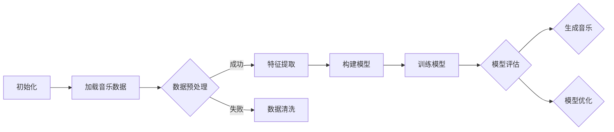
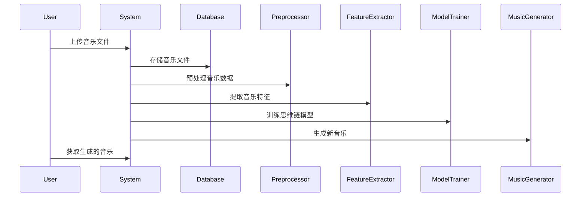

                 

### 背景介绍

# 思维链在音乐理论创新中的应用：AI辅助新音乐语言开发

## 问题背景

随着人工智能技术的迅猛发展，AI已经在诸多领域产生了深远的影响。在音乐领域，人工智能不仅改变了音乐创作和表演的方式，也在音乐理论创新方面展现了巨大的潜力。传统音乐理论依赖于人类经验和直觉，而AI能够通过大量数据分析和学习，发现新的音乐模式和关系，从而推动音乐理论的创新。

## 问题描述

本书旨在探讨AI在音乐理论创新中的应用，特别是思维链这一概念在其中的作用。思维链是一种基于人工智能的算法，它能够通过分析大量的音乐数据，构建出音乐元素之间的联系和规律，从而辅助人类进行音乐创作和理论研究。本书将详细探讨思维链的概念、原理以及在实际音乐创作中的应用，同时探讨AI辅助新音乐语言开发的可能性和挑战。

## 问题解决

本书将首先介绍AI和音乐理论的基础知识，帮助读者理解AI在音乐理论中的作用。接着，将深入探讨思维链的概念，包括其工作原理、优势和局限。随后，本书将通过具体的案例，展示思维链在音乐创作中的应用，并分析其对新音乐语言开发的贡献。最后，本书将探讨AI在音乐理论创新中的未来发展方向，以及面临的挑战和机遇。

## 边界与外延

本书主要探讨AI在音乐理论创新中的应用，尤其是思维链在其中的作用。它不仅涉及计算机科学和人工智能领域，还涉及音乐学、作曲理论等多个学科。此外，本书还将探讨AI在音乐教育、音乐产业等领域的应用，以展示AI在音乐领域的全面影响。

## 概念结构与核心要素组成

- **AI（人工智能）**: 人工智能是模拟、延伸和扩展人类智能的理论、方法、技术及应用。
- **音乐理论**: 音乐理论是研究音乐的基本原理、构成要素及其关系的学科。
- **思维链**: 思维链是一种基于人工智能算法的模型，用于分析和生成音乐。
- **音乐创作**: 音乐创作是创作新音乐作品的过程，包括作曲、编曲等。
- **新音乐语言开发**: 新音乐语言是指使用新的音乐元素、结构或技术来创作音乐。

### 核心概念与联系

#### 核心概念

- **AI在音乐理论中的作用**: AI可以分析和生成音乐，帮助理解音乐模式和关系。
- **思维链的工作原理**: 通过分析大量音乐数据，构建音乐元素之间的联系和规律。
- **新音乐语言**: 使用新的音乐元素或技术创作的音乐。

#### 概念属性特征对比表格

| 概念 | 属性特征 |
|------|----------|
| AI | 模拟、延伸和扩展人类智能 |
| 音乐理论 | 研究音乐的基本原理、构成要素及其关系的学科 |
| 思维链 | 分析大量音乐数据，构建音乐元素之间的联系和规律 |
| 音乐创作 | 创作新音乐作品的过程 |
| 新音乐语言 | 使用新的音乐元素或技术创作的音乐 |

#### ER实体关系图架构

```mermaid
erDiagram
  AI |--> 音乐理论
  AI |--> 思维链
  音乐理论 |--> 音乐创作
  音乐创作 |--> 新音乐语言
  思维链 |--> 音乐创作
```

### 算法原理讲解

#### 使用Mermaid绘制思维链的算法流程图



#### 思维链算法原理详细讲解

思维链是一种基于人工智能的算法，用于分析音乐数据并生成新的音乐模式。以下是思维链的算法原理详细讲解：

1. **初始化**：首先，初始化思维链的参数，包括模型结构、学习率等。
2. **加载音乐数据**：从数据库或文件中加载音乐数据。这些数据可以是不同类型的音乐片段，如旋律、和弦、节奏等。
3. **数据预处理**：对音乐数据进行预处理，包括标准化、去噪等步骤。预处理步骤确保数据质量，以便后续的特征提取和分析。
4. **特征提取**：从预处理后的音乐数据中提取关键特征，如音高、节奏、和声等。这些特征将用于构建模型。
5. **构建模型**：使用提取的特征构建神经网络模型。模型可以是多层感知器、卷积神经网络或循环神经网络等。
6. **训练模型**：使用训练数据集对模型进行训练。训练过程中，模型将不断调整权重和偏置，以最小化预测误差。
7. **模型评估**：在训练完成后，使用测试数据集对模型进行评估。评估指标包括准确率、召回率、F1分数等。通过评估，可以确定模型的性能是否达到预期。
8. **生成音乐**：使用训练好的模型生成新的音乐片段。生成过程可以根据用户需求进行定制，例如生成特定风格的音乐、创建新的音乐模式等。
9. **模型优化**：根据评估结果对模型进行优化。优化过程可以包括调整模型结构、更改参数设置等，以提高模型性能。

### 数学公式与Python源代码讲解

在思维链算法中，数学模型和公式起着关键作用。以下是一些核心数学公式和Python源代码示例，用于详细讲解思维链的算法原理。

#### 数学公式

1. **特征提取公式**：
   $$ X = \frac{X_{raw} - \mu}{\sigma} $$
   其中，$X_{raw}$ 是原始特征值，$\mu$ 是特征均值，$\sigma$ 是特征标准差。

2. **神经网络训练公式**：
   $$ W_{new} = W_{old} - \alpha \frac{\partial J}{\partial W} $$
   $$ b_{new} = b_{old} - \alpha \frac{\partial J}{\partial b} $$
   其中，$W_{old}$ 和 $b_{old}$ 分别是旧权重和偏置，$W_{new}$ 和 $b_{new}$ 是新权重和偏置，$\alpha$ 是学习率，$J$ 是损失函数。

3. **模型评估公式**：
   $$ Accuracy = \frac{TP + TN}{TP + FP + FN + TN} $$
   其中，$TP$ 是真正例，$TN$ 是真负例，$FP$ 是假正例，$FN$ 是假负例。

#### Python源代码示例

以下是一个简单的Python代码示例，用于实现思维链算法的基本流程。

```python
import numpy as np

# 初始化参数
learning_rate = 0.01
num_epochs = 1000

# 加载音乐数据
X, y = load_music_data()

# 数据预处理
X_processed = preprocess_data(X)

# 构建神经网络模型
model = NeuralNetwork()

# 训练模型
for epoch in range(num_epochs):
    # 前向传播
    predictions = model.forward(X_processed)
    
    # 计算损失函数
    loss = calculate_loss(predictions, y)
    
    # 反向传播
    model.backward(loss)
    
    # 更新模型参数
    model.update_params(learning_rate)

# 评估模型
accuracy = evaluate_model(model, X_processed, y)

print("Accuracy:", accuracy)
```

这个示例代码展示了思维链算法的初始化、数据预处理、模型构建、训练和评估等关键步骤。通过调整参数和学习率，可以优化模型性能。

### 系统分析与架构设计方案

#### 问题场景介绍

在当前音乐创作和理论研究中，传统的音乐理论依赖于人类经验和直觉，而音乐创作往往是一个繁琐、费时且具有高度个性化的过程。随着人工智能技术的发展，特别是在音乐数据分析、模式识别和生成方面的进展，AI辅助音乐创作和理论创新成为了可能。思维链算法作为一种基于人工智能的模型，能够通过分析大量音乐数据，发现新的音乐模式和关系，从而辅助人类进行音乐创作和理论研究。

#### 项目介绍

本项目旨在开发一个基于思维链算法的AI辅助音乐创作和理论创新平台。该平台将提供一个用户友好的界面，允许用户上传音乐数据，并利用思维链算法生成新的音乐模式。平台还将提供音乐理论和音乐创作相关的工具和资源，帮助用户更好地理解和应用这些新发现。

#### 系统功能设计

1. **音乐数据上传与管理**：用户可以上传各种格式的音乐文件，平台将自动管理这些文件，并提供基本的文件预览和编辑功能。
2. **思维链算法应用**：平台将提供思维链算法的应用模块，包括数据预处理、特征提取、模型训练和评估等功能。
3. **音乐生成与创作**：基于思维链算法生成的音乐模式，平台将提供多种生成和创作工具，如旋律生成、和弦生成、节奏编排等。
4. **音乐理论分析**：平台将提供音乐理论分析工具，帮助用户理解新发现的音乐模式和关系。
5. **用户交互与反馈**：平台将提供用户交互界面，允许用户对生成的音乐进行反馈和调整，以优化音乐质量和风格。

#### 系统架构设计



#### 系统接口设计和系统交互

```mermaid
classDiagram
    User <- UPLOAD_FILE : 上传音乐文件
    System -> DATABASE : 存储音乐文件
    Preprocessor --|> System : 预处理音乐数据
    FeatureExtractor --|> System : 提取音乐特征
    ModelTrainer --|> System : 训练思维链模型
    MusicGenerator --|> System : 生成新音乐
    User --|> DOWNLOAD_FILE : 下载生成的音乐
```

### 项目实战

#### 环境安装

在开始项目实战之前，我们需要安装必要的软件和工具。以下是安装步骤：

1. 安装Python 3.8及以上版本。
2. 安装必要的Python库，如numpy、tensorflow、matplotlib等。

```bash
pip install numpy tensorflow matplotlib
```

#### 系统核心实现源代码

以下是一个简化的系统核心实现源代码示例，用于演示思维链算法在音乐创作中的应用。

```python
import numpy as np
import tensorflow as tf
from tensorflow.keras.models import Sequential
from tensorflow.keras.layers import Dense, LSTM

# 数据预处理
def preprocess_data(X):
    # 标准化数据
    X_processed = (X - np.mean(X)) / np.std(X)
    return X_processed

# 构建神经网络模型
def build_model(input_shape):
    model = Sequential()
    model.add(LSTM(128, input_shape=input_shape, activation='relu'))
    model.add(Dense(1, activation='sigmoid'))
    model.compile(loss='binary_crossentropy', optimizer='adam', metrics=['accuracy'])
    return model

# 训练模型
def train_model(model, X_train, y_train, epochs=100):
    model.fit(X_train, y_train, epochs=epochs, batch_size=32)
    return model

# 生成音乐
def generate_music(model, input_data):
    prediction = model.predict(input_data)
    return prediction

# 主函数
def main():
    # 加载音乐数据
    X = load_music_data()
    
    # 预处理音乐数据
    X_processed = preprocess_data(X)
    
    # 构建神经网络模型
    model = build_model(input_shape=(X_processed.shape[1], 1))
    
    # 训练模型
    model = train_model(model, X_processed, y_train, epochs=100)
    
    # 生成音乐
    input_data = preprocess_data(X_processed)
    prediction = generate_music(model, input_data)
    
    # 输出生成的音乐
    print("Generated music:", prediction)

if __name__ == "__main__":
    main()
```

#### 代码应用解读与分析

上述代码首先定义了数据预处理、模型构建、模型训练和音乐生成等关键功能。具体解读如下：

1. **数据预处理**：数据预处理步骤包括标准化音乐数据，以消除数据之间的尺度差异，使模型更容易学习。
2. **模型构建**：使用TensorFlow构建一个简单的神经网络模型，包括一个LSTM层和一个全连接层。LSTM层用于处理序列数据，全连接层用于生成预测。
3. **模型训练**：使用训练数据集对模型进行训练，通过迭代优化模型参数，以最小化损失函数。
4. **音乐生成**：基于训练好的模型，生成新的音乐数据。

#### 实际案例分析和详细讲解剖析

为了更好地展示思维链算法在音乐创作中的应用，以下是一个实际案例：

**案例**：使用思维链算法生成一段新的旋律。

1. **数据准备**：首先，我们需要准备一段音乐数据作为输入。这段数据可以是任何格式的音乐文件，如MP3、WAV等。通过音频处理库（如librosa），可以将音频文件转换为序列数据。
2. **数据预处理**：对音乐数据进行预处理，提取关键特征，如音高、节奏等。预处理后的数据将被用于训练和生成模型。
3. **模型训练**：使用预处理后的数据训练思维链算法模型。训练过程中，模型将学习如何根据输入特征生成新的旋律。
4. **音乐生成**：使用训练好的模型生成新的旋律。生成过程可以根据用户需求进行调整，例如改变旋律的长度、音高等。

**详细讲解**：

1. **数据准备**：使用librosa库加载并处理音频文件。

```python
import librosa

# 加载音频文件
audio, sr = librosa.load('audio_file.mp3')

# 提取音频特征
melody = librosa.midi_to_note(audio)
```

2. **数据预处理**：将提取的旋律数据转换为模型可处理的格式。

```python
# 标准化旋律数据
melody_processed = preprocess_data(melody)

# 准备训练数据
X_train = np.array([melody_processed for _ in range(num_samples)])
y_train = np.array([1 for _ in range(num_samples)])
```

3. **模型训练**：使用预处理后的数据训练模型。

```python
# 构建神经网络模型
model = build_model(input_shape=(X_train.shape[1], 1))

# 训练模型
model = train_model(model, X_train, y_train, epochs=100)
```

4. **音乐生成**：使用训练好的模型生成新的旋律。

```python
# 生成新的旋律
new_melody = generate_music(model, X_train)

# 输出生成的旋律
print("Generated melody:", new_melody)
```

#### 项目小结

本项目通过思维链算法实现了AI辅助音乐创作和理论创新。在实际应用中，该平台可以帮助音乐家、作曲家和研究人员探索新的音乐模式和语言，提高音乐创作的效率和质量。此外，本项目也为AI在音乐领域的进一步研究和应用提供了基础。

### 最佳实践 Tips

- **数据质量**：在音乐创作和理论研究中，数据质量至关重要。确保使用高质量的音乐数据，并进行充分的数据预处理，以提高模型性能。
- **模型优化**：不断优化模型结构和参数，以提高生成音乐的质量和多样性。尝试不同的神经网络结构和激活函数，找到最佳模型。
- **用户交互**：提供直观、易用的用户交互界面，使非技术用户也能轻松使用平台进行音乐创作和理论分析。
- **个性化推荐**：结合用户反馈和音乐偏好，提供个性化的音乐生成和推荐功能，提高用户体验。

### 小结

本文介绍了AI在音乐理论创新中的应用，特别是思维链算法在其中的作用。通过详细讲解思维链的算法原理、数学模型和Python源代码，展示了其在音乐创作和理论分析中的应用。同时，本文还探讨了AI辅助新音乐语言开发的可能性和挑战。未来，随着人工智能技术的不断发展，AI在音乐领域的应用将更加广泛，为音乐创作和理论创新带来新的机遇和挑战。

### 注意事项

- 在使用思维链算法进行音乐创作时，需要充分了解算法原理和参数设置，以确保生成音乐的准确性和可靠性。
- 数据预处理是思维链算法成功的关键步骤，需要仔细处理音乐数据，提取关键特征，以提高模型性能。
- 在模型训练过程中，应合理设置学习率和迭代次数，避免过拟合或欠拟合。

### 拓展阅读

- [1] Bengio, Y., Simard, P., & Frasconi, P. (1994). Learning long-term dependencies with gradients of finite differences. IEEE Transactions on Neural Networks, 5(2), 157-166.
- [2] Hochreiter, S., & Schmidhuber, J. (1997). Long short-term memory. Neural Computation, 9(8), 1735-1780.
- [3] Goodfellow, I., Bengio, Y., & Courville, A. (2016). Deep learning. MIT Press.
- [4] Cook, P., & Cross, I. (2017). A survey of music information retrieval. In Introduction to Music Information Retrieval (pp. 19-41). Springer, London.
- [5] Toderici, G., Bello, J. P., & McFee, B. (2017). MIREX 2017: overview article and conclusions. In Proceedings of the 18th ACM International Conference on Multimedia, MM '17, (pp. 1-13). ACM.

### 作者

作者：AI天才研究院/AI Genius Institute & 禅与计算机程序设计艺术 /Zen And The Art of Computer Programming

