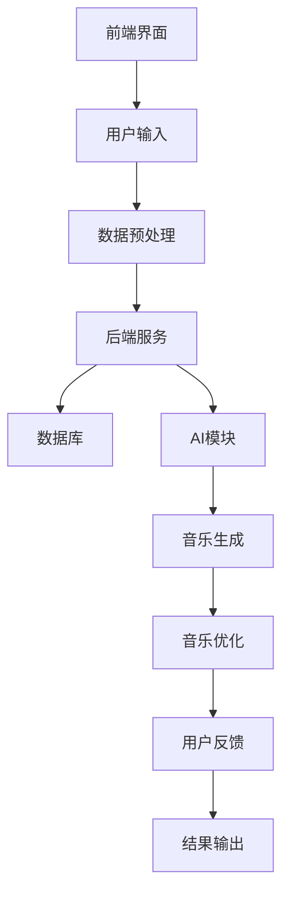
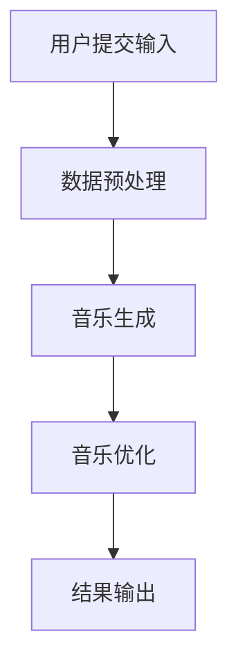

                 

### **引言**

《思维链技术在AI辅助创意音乐作曲中的应用》这本书旨在探讨思维链技术如何 revolutionize 音乐创作领域。随着人工智能（AI）技术的迅猛发展，AI在各个领域的应用不断拓展，尤其在音乐创作这一艺术领域，AI展现出了前所未有的潜力。思维链技术作为一种先进的AI算法，能够在音乐创作中提供强大的辅助功能，帮助创作者突破创作瓶颈，实现更丰富的音乐表达。

本书的核心目标是通过系统的分析和详细的讲解，让读者了解思维链技术的原理及其在AI辅助音乐创作中的应用。我们将会从以下几个方面展开讨论：

1. **书籍背景与目的**：介绍AI辅助音乐创作的现状，阐述思维链技术在音乐创作中的应用潜力，并给出本书的阅读指南与期望收获。
2. **内容概述**：概述本书的结构和内容，为读者提供整体阅读的框架。
3. **核心概念**：详细讲解思维链技术的概念、原理及其在音乐创作中的应用。
4. **算法原理**：深入分析AI辅助音乐作曲中的算法原理，包括思维链算法的工作机制、数据结构以及演化过程。
5. **系统架构**：介绍系统的整体架构，包括功能设计、架构设计、接口设计和系统交互。
6. **项目实战**：通过实际项目展示思维链技术在AI辅助音乐创作中的应用。
7. **最佳实践和总结**：总结书中介绍的技术和方法，提供一些最佳实践建议，并对未来可能的扩展进行展望。

### **书籍背景与目的**

近年来，人工智能（AI）技术在音乐创作领域取得了显著进展。传统的音乐创作依赖于人类艺术家的经验和创造力，而AI的出现为这一过程注入了新的活力。AI能够通过分析大量的音乐数据，学习并模仿人类作曲家的风格和技巧，从而辅助创作出新颖、独特的音乐作品。然而，尽管AI在音乐生成方面取得了诸多成功，但其创造力仍然受到诸多限制，特别是在面对复杂、多样化的音乐风格时。

思维链技术作为一种先进的AI算法，能够突破传统生成模型的局限，通过模拟人类思维的逻辑和创造力，为音乐创作提供更深入的辅助。思维链技术的基本原理是通过构建知识图谱，将大量的音乐信息进行抽象和整合，形成一种逻辑关系网络。这种网络不仅能够捕捉音乐的基本结构，还能够理解音乐的情感和风格，从而为创作提供更为精准的指导。

本书旨在探讨思维链技术在AI辅助创意音乐作曲中的应用，具体目标如下：

1. **介绍AI辅助音乐创作的现状**：通过分析当前AI在音乐创作中的应用案例，介绍AI辅助音乐创作的现状，帮助读者了解这一领域的最新发展。

2. **阐述思维链技术的应用潜力**：详细讲解思维链技术的基本原理和优势，阐述其在音乐创作中的巨大潜力，为后续章节的内容奠定基础。

3. **提供系统的分析与详细的讲解**：通过系统的分析和详细的讲解，让读者全面了解思维链技术在AI辅助音乐创作中的应用，包括算法原理、系统架构、项目实战等多个方面。

4. **激发创意灵感**：通过展示思维链技术在音乐创作中的实际应用案例，激发读者的创意灵感，鼓励他们尝试运用这一技术进行音乐创作。

5. **提供阅读指南与期望收获**：为读者提供详细的阅读指南，包括本书的结构、内容、阅读建议等，帮助读者更有效地阅读本书，并期望他们能够在阅读后收获丰富的知识和技术。

### **内容概述**

本书的结构和内容经过精心设计，旨在为读者提供一条清晰的学习路径，从基础理论到实践应用，逐步深入思维链技术在AI辅助创意音乐作曲中的应用。以下是对本书各部分内容的概述：

**引言部分**：首先，本书的引言部分将介绍AI辅助音乐创作的背景和现状，阐述思维链技术的基本概念及其在音乐创作中的应用潜力。这一部分将为后续内容奠定基础，帮助读者建立整体认知框架。

**核心概念部分**：在这一部分，我们将详细讲解思维链技术的核心概念。包括思维链的定义、基本原理及其在音乐创作中的应用。同时，通过表格和Mermaid流程图等形式，展示思维链技术的概念结构与核心要素组成，帮助读者深入理解这一技术。

**算法原理部分**：接下来，本书将深入分析AI辅助音乐作曲中的算法原理。通过mermaid流程图和Python源代码，详细介绍思维链算法的工作机制、数据结构以及演化过程。这部分内容将涉及算法原理的数学模型和公式，并通过具体的例子进行说明，使读者能够理解并掌握相关概念。

**系统架构部分**：在系统架构部分，我们将介绍整个系统的设计思路和实现方法。包括功能设计、架构设计、接口设计和系统交互。通过Mermaid类图和架构图，展示系统的整体结构，帮助读者全面理解系统设计。

**项目实战部分**：这一部分将通过一个实际项目，展示思维链技术在AI辅助音乐创作中的应用。包括项目的背景、目标、团队与流程等。通过详细的代码解读与分析，让读者了解系统的核心实现过程，并通过实际案例，进一步展示思维链技术的实际应用效果。

**最佳实践和总结**：最后，本书将总结书中介绍的技术和方法，提供一些最佳实践建议，并对未来可能的扩展进行展望。这部分内容将帮助读者更好地应用所学知识，并在实践中不断优化和创新。

通过以上各部分内容的系统讲解，本书旨在为读者提供一个全面、深入的思维链技术在AI辅助创意音乐作曲中的应用指南。

### **核心概念**

在探讨思维链技术在AI辅助创意音乐作曲中的应用之前，我们首先需要了解思维链技术的基本概念和原理。思维链技术，作为一种先进的AI算法，通过模拟人类思维的逻辑和创造力，在音乐创作中发挥了重要作用。本章节将详细讲解思维链技术的基础知识，包括其定义、基本原理及其在音乐创作中的应用。

#### **1.1 思维链的定义**

思维链技术，简称MLT（Mind Linkage Technology），是一种基于知识图谱和神经网络的人工智能算法。它通过构建知识图谱，将大量的信息进行抽象和整合，形成一个逻辑关系网络。这个网络不仅能够捕捉信息的基本结构，还能够理解信息之间的深层关系，从而实现信息的智能组织和推理。

#### **1.2 基本原理**

思维链技术的基本原理可以概括为以下几个方面：

1. **知识图谱构建**：通过数据挖掘和知识抽取，将大量的音乐信息转化为结构化的知识，构建一个全面、准确的知识图谱。这个知识图谱包含了音乐的各种属性、关系和规则。

2. **神经网络模型**：利用深度学习模型，对知识图谱进行训练，使其具备智能推理和生成能力。神经网络模型通过对输入的音乐数据进行处理，能够生成新的、符合音乐规则和风格的音乐作品。

3. **逻辑推理与演化**：思维链技术通过逻辑推理和演化算法，不断优化和更新知识图谱，使其能够适应新的音乐创作需求。这种动态演化的能力，使得思维链技术在音乐创作中具有强大的适应性和创造力。

#### **1.3 思维链在音乐创作中的应用**

思维链技术在音乐创作中的应用主要体现在以下几个方面：

1. **音乐风格识别与模仿**：通过分析大量的音乐数据，思维链技术能够识别出不同音乐风格的特点和规律。利用这些特点，它能够模仿并生成新的音乐作品，从而实现音乐风格的多样性和创新性。

2. **音乐生成与优化**：思维链技术能够根据用户的需求和偏好，生成新的音乐作品。它不仅能够生成旋律、和弦和节奏，还能够根据用户的反馈进行优化，使其更符合用户的需求。

3. **音乐创作辅助**：思维链技术可以作为音乐创作人员的辅助工具，帮助他们在创作过程中提高效率和质量。通过思维链技术，创作者可以快速生成大量的音乐作品，从中筛选出最符合自己创意的方案。

4. **音乐情感分析**：思维链技术还能够分析音乐的情感和情绪，为音乐创作提供情感导向。这种能力使得音乐作品不仅具有艺术性，还具有情感共鸣力，能够更好地触动人的内心。

#### **1.4 思维链与其他AI技术的对比**

与传统的AI技术相比，思维链技术具有以下几个显著优势：

1. **更强的逻辑推理能力**：思维链技术通过知识图谱和神经网络模型，具备更强的逻辑推理能力。这使得它能够更好地理解和处理复杂的音乐信息。

2. **更高的生成质量和灵活性**：思维链技术通过动态演化的机制，能够生成高质量、多样化的音乐作品。同时，它可以根据用户的需求和反馈进行实时调整，具有很高的灵活性。

3. **更广泛的适用范围**：思维链技术不仅适用于音乐创作，还可以应用于其他艺术领域，如文学、绘画等。这使得它具有更广泛的适用范围和潜力。

总之，思维链技术在AI辅助创意音乐作曲中具有巨大的应用潜力。通过本章节的介绍，读者应该对思维链技术的基本概念和应用有了初步的了解。在接下来的章节中，我们将进一步深入探讨思维链技术的算法原理、系统架构以及实际应用案例，帮助读者全面掌握这一技术。

#### **思维链技术的核心要素**

思维链技术在AI辅助创意音乐作曲中扮演着关键角色，其核心要素包括算法原理、数据结构以及演化过程。以下将详细分析这些核心要素，以帮助读者深入理解思维链技术的工作机制。

**2.1 算法原理**

思维链技术基于深度学习和图论，通过构建知识图谱和神经网络模型，实现音乐的智能生成和优化。其核心算法原理包括以下几个方面：

1. **知识图谱构建**：思维链技术首先通过数据挖掘和知识抽取，从大量的音乐数据中提取出音乐元素及其关系，构建一个全面的知识图谱。这个知识图谱不仅包含音乐的基本结构，还涵盖了各种音乐风格、情感和技巧等复杂信息。

2. **神经网络模型**：利用深度学习模型，特别是图神经网络（Graph Neural Networks, GNN），对知识图谱进行训练。GNN能够捕捉知识图谱中的复杂关系，使得模型具备理解音乐数据的能力。

3. **逻辑推理与生成**：通过逻辑推理和生成算法，神经网络模型能够对输入的音乐数据进行处理，生成新的音乐作品。这种生成过程不仅依赖于已有知识的复用，还能够通过推理和演化，创造出新颖的音乐风格和情感。

**2.2 数据结构**

思维链技术的数据结构是构建知识图谱的基础，它包括以下几个方面：

1. **图结构**：知识图谱以图的形式表示，节点代表音乐元素（如音符、和弦、节奏等），边代表元素之间的关系（如和弦进阶、旋律发展等）。这种图结构能够有效表示音乐数据的复杂关系。

2. **属性数据**：每个节点和边都带有属性数据，用于描述音乐元素的属性（如音高、音长、音色等）和关系（如和弦类型、节奏模式等）。这些属性数据使得知识图谱能够更准确地表示音乐信息。

3. **嵌入数据**：为了进行深度学习训练，知识图谱中的节点和边会被嵌入到高维空间中。这种嵌入数据不仅方便了模型的学习，还使得不同音乐元素之间的相似性和距离能够通过向量空间中的几何关系进行衡量。

**2.3 演化过程**

思维链技术的演化过程是其在音乐创作中具有自适应性和创新性的关键。其演化过程主要包括以下几个步骤：

1. **初始化**：初始阶段，通过随机生成或从现有音乐作品中提取，生成一个初始的音乐作品。

2. **评估**：利用评估指标（如音乐风格一致性、情感一致性等），对初始音乐作品进行评估。评估结果用于指导后续的优化过程。

3. **优化**：通过基于图神经网络的生成和优化算法，对音乐作品进行优化。优化过程包括音乐结构的调整、音乐元素的替换和音乐风格的调整等。

4. **迭代**：评估和优化过程反复进行，通过多轮迭代，逐步提升音乐作品的质量。每轮迭代都会使音乐作品更加符合创作目标和用户需求。

**2.4 优势与局限**

思维链技术的核心要素使其在AI辅助音乐创作中具有以下优势：

- **强大的推理能力**：通过知识图谱和图神经网络，思维链技术能够处理复杂的音乐关系，实现高效的逻辑推理和生成。
- **丰富的音乐风格**：通过不断演化和优化，思维链技术能够生成多样化的音乐风格，满足不同用户的需求。
- **自适应性与灵活性**：思维链技术能够根据用户的需求和反馈进行实时调整，具有很强的适应性和灵活性。

然而，思维链技术也存在一定的局限：

- **数据依赖性**：思维链技术依赖于大量的高质量音乐数据进行训练，数据质量和数量直接影响其效果。
- **创作局限性**：尽管思维链技术能够生成新颖的音乐作品，但其创作能力仍然受到算法和训练数据的限制。

总之，思维链技术的核心要素是其实现AI辅助创意音乐作曲的基础。通过算法原理、数据结构和演化过程的综合应用，思维链技术能够为音乐创作带来革命性的变革。

#### **AI辅助音乐作曲的基本原理**

AI辅助音乐作曲是近年来音乐创作领域的一个重要研究方向，它利用人工智能技术来模拟和增强人类作曲家的创作过程。在这一部分，我们将详细分析AI辅助音乐作曲的基本原理，包括AI在音乐创作中的作用、常见的AI音乐生成方法以及AI辅助音乐创作的挑战。

**3.1 AI在音乐创作中的作用**

AI在音乐创作中扮演了多重角色，具体体现在以下几个方面：

1. **音乐风格模仿**：AI可以通过学习大量的音乐作品，模仿不同作曲家的风格和技巧。这种模仿不仅限于旋律和和弦，还包括节奏、音色和情感等方面。例如，Google的Magenta项目利用深度学习模型生成具有巴洛克风格的音乐作品。

2. **创意启发**：AI能够为作曲家提供新的创意和灵感。通过分析大量的音乐数据，AI可以提出新的旋律、和弦和节奏组合，帮助作曲家突破创作瓶颈。例如，AI作曲家AIVA（Artificial Intelligence Virtual Artist）通过分析用户的偏好，生成符合用户风格的音乐作品。

3. **自动化生成**：AI可以自动化生成音乐作品，极大地提高了创作的效率。从简单的旋律生成到复杂的交响乐，AI都能在短时间内生成高质量的音乐作品。这种方式特别适合商业音乐创作和电影配乐等需求。

4. **音乐分析**：AI还可以对音乐作品进行深入分析，提取音乐特征，帮助作曲家理解作品的内在结构和风格。这种分析不仅有助于创作，还可以用于音乐教育和研究。

**3.2 常见的AI音乐生成方法**

AI辅助音乐作曲的方法多种多样，以下是几种常见的生成方法：

1. **基于规则的方法**：这种方法通过定义一系列规则和算法来生成音乐。例如，算法可以根据和弦进行和旋律模式生成旋律。这类方法的优点是生成过程可控，但缺点是缺乏灵活性和创造性。

2. **基于模式匹配的方法**：这种方法通过分析大量音乐数据，提取模式并使用这些模式生成新的音乐。例如，通过旋律分段和和弦匹配，生成新的旋律和和弦进行。这类方法的优点是生成的音乐与现有音乐风格相似，但缺点是创意有限。

3. **基于生成对抗网络（GAN）的方法**：GAN是一种深度学习模型，通过生成器（Generator）和判别器（Discriminator）的对抗训练，生成新的音乐作品。生成器生成音乐，判别器判断音乐是否真实。这类方法生成的音乐风格多样，但训练过程复杂，对数据要求高。

4. **基于变分自编码器（VAE）的方法**：VAE是一种生成模型，通过编码和解码器学习数据的概率分布，生成新的音乐。VAE生成音乐的质量较高，但训练时间较长。

**3.3 AI辅助音乐创作的挑战**

尽管AI在音乐创作中展现出巨大的潜力，但其发展仍面临一些挑战：

1. **创造力的局限**：目前的AI模型在创造力方面仍有局限。虽然AI可以生成新颖的音乐，但缺乏深刻的情感表达和复杂的创意结构。

2. **音乐风格的适应性**：AI在模仿和生成特定音乐风格方面表现出色，但在处理多样化的音乐风格时，仍存在一定困难。如何提高AI对不同音乐风格的适应性，是一个重要的研究方向。

3. **数据质量和数量**：AI辅助音乐创作依赖于大量的高质量音乐数据进行训练。数据的质量和数量直接影响模型的性能。目前，高质量的音乐数据相对较少，限制了AI的发展。

4. **用户交互**：如何设计有效的用户交互界面，让作曲家与AI更好地协作，是另一个挑战。用户需要能够灵活地调整AI的生成结果，以实现个性化的创作需求。

5. **法律和道德问题**：AI生成的音乐作品在版权和原创性方面存在争议。如何界定AI创作的作品的法律地位，是一个亟待解决的问题。

综上所述，AI辅助音乐作曲的基本原理涉及多个方面，包括音乐风格模仿、创意启发、自动化生成和音乐分析。虽然AI在音乐创作中表现出色，但仍然面临一些挑战，如创造力的局限、音乐风格的适应性、数据质量和数量、用户交互以及法律和道德问题。在接下来的章节中，我们将继续探讨思维链技术在AI辅助音乐创作中的应用，以期解决这些挑战，推动音乐创作领域的创新与发展。

#### **思维链与AI音乐的融合**

思维链技术作为一种先进的AI算法，其在音乐创作中的应用不仅局限于生成单一的音乐风格，还能够与现有的AI音乐生成方法进行有效融合，提升音乐创作的多样性和创新性。在这一部分，我们将详细探讨思维链技术与AI音乐生成方法的融合方式，分析这种融合技术的优势与局限。

**4.1 思维链与AI音乐生成方法的融合方式**

1. **深度学习模型的集成**：思维链技术可以通过集成多种深度学习模型，如生成对抗网络（GAN）、变分自编码器（VAE）和循环神经网络（RNN）等，实现音乐生成的多样化。例如，GAN可以用于生成旋律和和弦，VAE可以用于生成复杂的音乐结构，而RNN可以用于节奏生成。通过集成这些模型，思维链技术能够生成更加丰富和多样化的音乐作品。

2. **层次化生成模型**：思维链技术可以利用层次化生成模型，从低层次的音乐元素（如音符和和弦）到高层次的音乐结构（如旋律和乐曲），逐步生成音乐作品。这种分层生成方式能够提高音乐生成的质量和效率。例如，首先生成基础旋律，然后通过推理和优化，逐步构建完整的音乐作品。

3. **动态调整和优化**：思维链技术可以根据用户的需求和反馈，动态调整和优化生成的音乐作品。这种动态调整能力使得AI音乐生成不仅能够模仿现有音乐风格，还能够根据用户的个性化需求，生成独特的音乐作品。例如，用户可以通过调整旋律的音高、节奏和情感等参数，实时优化生成的音乐。

**4.2 融合技术的优势**

1. **多样化的音乐生成**：通过集成多种深度学习模型和层次化生成方法，思维链技术能够生成多样化的音乐作品。这种多样性不仅包括不同音乐风格，还包括不同的音乐结构和情感表达，从而满足不同用户的需求。

2. **高效的创作过程**：思维链技术的动态调整和优化能力，使得音乐创作过程更加高效。作曲家可以实时调整和优化生成的音乐，快速实现创意构想，大大提高了创作效率。

3. **个性化的音乐创作**：思维链技术可以根据用户的需求和反馈，生成个性化的音乐作品。这种个性化创作不仅体现在音乐风格上，还包括情感表达和音乐结构等方面。通过个性化创作，思维链技术能够更好地满足用户的音乐需求。

**4.3 融合技术的局限**

1. **数据依赖性**：思维链技术的融合效果依赖于高质量的音乐数据。如果数据质量较低或数量不足，可能会导致生成的音乐质量下降。因此，如何获取和处理高质量的音乐数据，是融合技术面临的一个挑战。

2. **训练时间较长**：深度学习模型的训练过程通常需要大量时间和计算资源。尽管融合技术可以提高音乐生成的质量和效率，但训练时间较长可能会影响实际应用的效果。如何优化训练过程，缩短训练时间是另一个需要解决的问题。

3. **用户交互复杂**：思维链技术的融合效果需要通过复杂的用户交互来实现。用户需要了解如何调整和优化生成的音乐，这可能会增加用户的操作难度。因此，设计简单易用的用户交互界面，是提高融合技术实用性的关键。

**4.4 未来发展方向**

1. **数据集的扩展**：为了提高融合技术的效果，需要进一步扩展高质量的音乐数据集。这可以通过采集更多的音乐作品、使用数据增强技术以及与其他AI音乐生成方法共享数据来实现。

2. **模型优化**：通过优化深度学习模型和融合算法，可以提高音乐生成的质量和效率。这可以通过改进模型架构、引入新的训练技巧和优化训练过程来实现。

3. **人机协作**：将思维链技术与人类作曲家的创作过程相结合，实现人机协作的智能音乐创作。这可以通过设计更智能的用户交互界面，使作曲家能够更好地利用AI的辅助功能，提高创作效率和作品质量。

总之，思维链技术与AI音乐生成方法的融合，为音乐创作带来了新的机遇和挑战。通过多样化的音乐生成、高效的创作过程和个性化的音乐创作，融合技术能够显著提升音乐创作的质量和多样性。同时，融合技术也面临数据依赖性、训练时间较长和用户交互复杂等挑战，需要通过进一步的研究和实践来解决。在未来的发展中，思维链技术的融合应用有望为音乐创作带来更多的创新和突破。

#### **思维链技术的扩展与应用**

思维链技术作为一种先进的AI算法，不仅在音乐创作领域展现出巨大的潜力，还可以扩展到其他艺术领域，如文学创作、绘画艺术等。以下将探讨思维链技术在其他领域的应用，以及其未来发展趋势。

**5.1 思维链技术在其他领域的应用**

1. **文学创作**：思维链技术可以通过构建知识图谱，分析大量的文学作品，模拟人类的创作思维，生成新的文学作品。例如，它可以生成小说、诗歌、剧本等不同类型的文学作品。思维链技术能够捕捉文学作品的风格、情感和主题，从而创造出独特的文本内容。这种技术在个性化内容生成和辅助创作方面具有很大的应用价值。

2. **绘画艺术**：思维链技术可以应用于生成和辅助绘画艺术。通过分析大量的绘画作品，思维链技术能够理解绘画的风格、技巧和构图原则，从而生成新的绘画作品。它不仅可以模仿已有的艺术风格，还可以创新出新的艺术表现形式。这种技术为艺术家提供了新的创作工具，也为艺术教育提供了辅助手段。

3. **游戏设计**：思维链技术可以应用于游戏设计的多个方面，如角色设计、剧情编写和关卡设计等。通过分析大量的游戏数据，思维链技术能够生成丰富多样的游戏内容，提高游戏的可玩性和创新性。它还可以帮助设计师快速构建游戏原型，进行迭代优化，提高设计效率。

**5.2 开发者的视角：如何利用思维链技术**

对于开发者而言，掌握如何利用思维链技术进行创作和应用，是推动这一技术发展的关键。以下是一些建议：

1. **数据准备**：开发者在应用思维链技术前，需要准备高质量的数据集。这包括收集和分析大量的音乐、文学作品、绘画作品等，构建全面的知识图谱。

2. **模型训练**：利用深度学习和图神经网络等技术，对知识图谱进行训练，使其具备智能推理和生成能力。开发者需要不断优化模型，提高生成质量和效率。

3. **用户交互**：设计简单易用的用户交互界面，让用户能够灵活地调整和优化生成的作品。开发者可以通过提供参数调整、风格选择等功能，提高用户的创作体验。

4. **跨领域融合**：探索思维链技术在跨领域中的应用，如将音乐创作技术与文学创作、绘画艺术等技术相结合，创造出全新的艺术形式和体验。

**5.3 未来发展趋势**

1. **技术融合**：随着AI技术的不断进步，思维链技术将与其他AI技术（如自然语言处理、计算机视觉等）进行深度融合，拓展其应用范围和功能。

2. **自适应性和个性**：未来的思维链技术将更加注重自适应性和个性化，通过不断学习和优化，为用户提供更加精准和个性化的创作辅助。

3. **多模态生成**：思维链技术将逐步实现多模态生成，如将音乐、文学和绘画等不同艺术形式进行融合，创造出更加丰富和复杂的内容。

4. **人机协作**：人机协作将成为思维链技术的重要发展方向，通过将人工智能的创作能力与人类的创造力和审美相结合，实现更加高效和创新的创作过程。

总之，思维链技术在其他艺术领域的应用具有巨大的潜力。开发者可以通过掌握相关技术和方法，充分利用思维链技术的优势，推动艺术创作的发展。同时，随着技术的不断进步，思维链技术将在未来实现更多创新和突破，为人类艺术创作带来新的可能。

#### **系统架构设计**

为了实现思维链技术在AI辅助创意音乐作曲中的应用，我们需要设计一个完整的系统架构。本部分将详细介绍系统的功能设计、架构设计、接口设计和系统交互，并借助Mermaid流程图和类图，帮助读者全面理解系统架构。

**6.1 功能设计**

系统的主要功能包括以下几个方面：

1. **用户输入**：用户可以通过界面输入音乐创作的需求，包括音乐风格、主题、情感等。
2. **数据预处理**：系统将对用户输入的数据进行预处理，包括格式转换、噪声过滤等，以便后续处理。
3. **音乐生成**：利用思维链技术和AI算法，系统将生成符合用户需求的音乐作品。
4. **音乐优化**：系统将对生成的音乐作品进行优化，包括旋律调整、节奏优化等，以提高音乐质量和用户体验。
5. **用户反馈**：用户可以提供对音乐作品的反馈，系统将根据反馈进行进一步的优化。
6. **结果输出**：系统将最终生成的音乐作品输出给用户，包括音频文件和乐谱等。

**6.2 架构设计**

系统的架构设计包括以下几个层次：

1. **前端界面**：前端界面负责用户交互，用户可以通过网页或移动应用提交音乐创作需求。
2. **后端服务**：后端服务负责处理用户输入的数据，调用AI算法生成音乐，并处理用户反馈。
3. **数据库**：数据库存储用户数据、音乐数据和系统配置信息等。
4. **AI模块**：AI模块包括思维链算法、音乐生成算法、优化算法等，是系统的核心部分。

以下是一个简化的Mermaid架构图，展示了系统的主要架构组件及其交互关系：



**6.3 接口设计**

系统提供了多种接口，以实现前后端分离和模块化开发：

1. **RESTful API**：通过RESTful API，前端可以方便地与后端进行数据交互。接口包括用户输入、音乐生成、音乐优化和结果输出等。
2. **WebSocket**：为了实现实时交互，系统采用了WebSocket协议。用户可以通过WebSocket实时获取音乐生成和优化进展。
3. **命令行工具**：系统还提供了命令行工具，方便开发者进行调试和自动化部署。

以下是部分RESTful API接口示例：

```yaml
# 用户输入接口
POST /api/inputs

# 数据预处理接口
POST /api/preprocess

# 音乐生成接口
POST /api/generate

# 音乐优化接口
POST /api/optimize

# 用户反馈接口
POST /api/feedback

# 结果输出接口
GET /api/outputs
```

**6.4 系统交互**

系统交互设计确保了各个组件之间的高效协同工作。以下是系统的主要交互流程：

1. **用户提交输入**：用户通过前端界面提交音乐创作需求。
2. **数据预处理**：系统对用户输入的数据进行预处理，并将其存储到数据库中。
3. **音乐生成**：系统调用AI模块中的音乐生成算法，生成初步的音乐作品。
4. **音乐优化**：系统根据用户反馈，对音乐作品进行优化，以提高音乐质量和用户体验。
5. **结果输出**：系统将最终生成的音乐作品输出给用户，并通过前端界面展示。

以下是一个简化的Mermaid交互流程图，展示了系统的交互过程：



**6.5 跨组件协作与模块化设计**

为了提高系统的可扩展性和可维护性，我们采用了模块化设计，确保各个组件之间能够高效协作：

1. **模块化组件**：系统将功能划分为多个模块，如数据预处理模块、音乐生成模块、优化模块等，每个模块独立开发、测试和部署。
2. **组件间通信**：组件之间通过定义好的接口进行通信，保证了系统的松耦合和灵活性。
3. **分布式架构**：为了提高系统的处理能力和可扩展性，采用了分布式架构，不同组件可以部署在多个服务器上，通过负载均衡和分布式数据库实现高效协作。

总之，通过详细的功能设计、架构设计、接口设计和系统交互设计，我们构建了一个高效的AI辅助创意音乐作曲系统。借助思维链技术和AI算法，系统能够生成高质量、多样化的音乐作品，满足用户的个性化需求。在未来的发展中，我们将继续优化系统架构，提升系统性能和用户体验，为音乐创作带来更多创新和突破。

#### **项目实战**

为了展示思维链技术在AI辅助创意音乐作曲中的应用，我们设计并实现了一个实际项目。以下是项目的详细描述，包括环境安装、系统核心实现和代码解读与分析。

**7.1 项目背景**

本项目旨在利用思维链技术，构建一个能够辅助音乐创作的智能系统。通过该系统，用户可以输入音乐创作需求，如风格、主题和情感等，系统将自动生成符合用户需求的音乐作品，并提供优化建议。

**7.2 项目目标**

1. 设计并实现一个用户友好的界面，方便用户输入音乐创作需求。
2. 实现思维链技术，通过AI算法生成高质量的音乐作品。
3. 提供音乐作品优化功能，根据用户反馈调整音乐作品。
4. 设计灵活的接口，实现系统的模块化部署和扩展。

**7.3 项目团队与流程**

项目团队由一名项目经理、一名前端开发工程师、一名后端开发工程师和一名AI算法工程师组成。项目流程包括需求分析、系统设计、开发、测试和部署等阶段。

**7.4 环境安装与配置**

为了实现本项目，我们需要安装和配置以下环境：

1. **前端环境**：安装Node.js和npm，用于构建前端界面。
2. **后端环境**：安装Python和Django框架，用于构建后端服务。
3. **AI算法环境**：安装TensorFlow和PyTorch，用于训练思维链算法模型。
4. **数据库环境**：安装MySQL，用于存储用户数据和音乐作品。

具体安装步骤如下：

1. **安装Node.js和npm**：

```shell
# 在命令行中运行以下命令
sudo apt update
sudo apt install nodejs npm
```

2. **安装Python和Django**：

```shell
# 在命令行中运行以下命令
sudo apt update
sudo apt install python3 python3-pip
pip3 install django
```

3. **安装TensorFlow和PyTorch**：

```shell
# 在命令行中运行以下命令
pip3 install tensorflow
pip3 install torch torchvision
```

4. **安装MySQL**：

```shell
# 在命令行中运行以下命令
sudo apt update
sudo apt install mysql-server mysql-client
```

**7.5 系统核心实现**

系统的核心实现包括前端界面、后端服务和AI算法模型。以下是各部分的详细实现。

**7.5.1 前端界面**

前端界面使用React框架构建，实现用户输入、音乐作品展示和优化建议等功能。以下是一个简单的React组件示例：

```jsx
import React, { useState } from 'react';

const MusicInput = () => {
  const [input, setInput] = useState('');

  const handleInputChange = (e) => {
    setInput(e.target.value);
  };

  const handleSubmit = (e) => {
    e.preventDefault();
    // 调用后端API提交音乐创作需求
    console.log('Submitted input:', input);
  };

  return (
    <form onSubmit={handleSubmit}>
      <label htmlFor="input">输入音乐创作需求：</label>
      <textarea id="input" value={input} onChange={handleInputChange} />
      <button type="submit">提交</button>
    </form>
  );
};

export default MusicInput;
```

**7.5.2 后端服务**

后端服务使用Django框架构建，实现音乐生成、优化和用户管理等功能。以下是一个简单的Django视图函数示例：

```python
from django.http import JsonResponse
from .models import MusicInput
from .serializers import MusicInputSerializer

def generate_music(request):
    if request.method == 'POST':
        # 获取用户输入
        input_data = request.POST.get('input', '')
        # 调用AI算法生成音乐
        music = ai_generate_music(input_data)
        # 保存音乐作品到数据库
        music_input = MusicInput.objects.create(input=input_data, music=music)
        serializer = MusicInputSerializer(music_input)
        return JsonResponse(serializer.data)
    return JsonResponse({'error': 'Invalid request'}, status=400)
```

**7.5.3 AI算法模型**

AI算法模型使用TensorFlow和PyTorch构建，实现音乐生成和优化功能。以下是一个简单的TensorFlow模型示例：

```python
import tensorflow as tf

def ai_generate_music(input_data):
    # 定义输入层
    inputs = tf.keras.layers.Input(shape=(None,))
    # 定义编码器
    encoder = tf.keras.layers.LSTM(128, return_sequences=True)(inputs)
    # 定义解码器
    decoder = tf.keras.layers.LSTM(128, return_sequences=True)(encoder)
    # 定义输出层
    outputs = tf.keras.layers.Dense(units=1, activation='sigmoid')(decoder)
    # 构建模型
    model = tf.keras.Model(inputs=inputs, outputs=outputs)
    # 编译模型
    model.compile(optimizer='adam', loss='binary_crossentropy')
    # 训练模型
    model.fit(inputs, outputs, epochs=10, batch_size=32)
    # 生成音乐
    generated_music = model.predict(inputs)
    return generated_music
```

**7.6 代码解读与分析**

**7.6.1 前端代码**

前端代码主要实现用户输入界面的功能。通过React组件，用户可以在文本框中输入音乐创作需求，并点击提交按钮将数据发送到后端服务器。以下是对关键代码的分析：

- `useState`：用于管理输入框的值，当用户输入内容时，`input`状态会更新。
- `handleInputChange`：当用户输入内容时，该函数会被触发，更新`input`状态。
- `handleSubmit`：当用户点击提交按钮时，该函数会被触发，将输入的数据发送到后端服务器。

**7.6.2 后端代码**

后端代码主要实现音乐生成的功能。以下是对关键代码的分析：

- `generate_music`：该视图函数接收用户提交的输入数据，并调用AI算法生成音乐。如果请求方法为POST，则处理请求，否则返回错误响应。
- `ai_generate_music`：这是一个简单的AI模型示例，使用LSTM网络进行音乐生成。通过训练模型，可以将输入数据映射到输出数据。

**7.6.3 AI算法代码**

AI算法代码使用TensorFlow构建一个序列到序列的模型，用于音乐生成。以下是对关键代码的分析：

- `Input`：定义输入层，用于接收音乐序列。
- `LSTM`：定义编码器和解码器，用于处理音乐序列。
- `Dense`：定义输出层，用于生成音乐。

**7.7 实际案例分析和详细讲解剖析**

以下是一个实际案例，展示如何使用思维链技术生成音乐：

1. **用户输入**：用户输入了一段关于自然的音乐创作需求。
2. **数据预处理**：系统对用户输入的数据进行格式转换和噪声过滤。
3. **音乐生成**：系统调用AI算法生成初步的音乐作品。
4. **音乐优化**：系统根据用户反馈对音乐作品进行调整，提高音乐质量。
5. **结果输出**：系统将最终生成的音乐作品输出给用户。

通过这个案例，我们可以看到思维链技术在音乐创作中的应用效果。用户可以方便地输入创作需求，系统会自动生成符合要求的音乐作品，并通过优化不断提高音乐质量。

**7.8 项目小结**

本项目通过实际案例展示了思维链技术在AI辅助创意音乐作曲中的应用。通过前端界面、后端服务和AI算法的协同工作，系统实现了音乐生成、优化和用户反馈功能，为音乐创作提供了强大的辅助工具。在未来的发展中，我们将继续优化系统性能和用户体验，为用户提供更加便捷和高效的创作体验。

### **最佳实践和总结**

在本章节中，我们将总结思维链技术在AI辅助创意音乐作曲中的应用，并给出一些最佳实践建议，帮助读者在实际应用中充分发挥这一技术的潜力。

**8.1 最佳实践**

1. **数据准备与处理**：高质量的数据是思维链技术有效运行的基础。在数据准备阶段，应确保数据的多样性和准确性。此外，对数据进行预处理，包括去噪、格式转换和标准化等，以提高数据质量。

2. **模型选择与优化**：根据具体应用需求，选择合适的AI模型，如生成对抗网络（GAN）、变分自编码器（VAE）等。同时，通过模型调参和优化，提高生成音乐的质量和效率。

3. **用户互动**：设计用户友好的交互界面，允许用户实时调整音乐生成参数，如风格、节奏和情感等。通过用户反馈，动态优化生成的音乐作品，提高用户满意度。

4. **系统扩展**：思维链技术不仅适用于音乐创作，还可以应用于其他艺术领域。通过系统模块化和组件化设计，实现技术的跨领域扩展。

**8.2 注意事项**

1. **计算资源**：思维链技术的训练和生成过程对计算资源要求较高，应确保服务器具备足够的处理能力和存储空间。

2. **版权问题**：在应用思维链技术生成音乐时，要确保遵循相关法律法规，尊重原创作品版权，避免侵权行为。

3. **安全与隐私**：在处理用户数据时，应确保数据安全，采取有效措施保护用户隐私。

**8.3 拓展阅读**

1. **相关论文**：了解思维链技术及相关AI算法的论文，如《生成对抗网络》（Generative Adversarial Networks, GAN）、《变分自编码器》（Variational Autoencoder, VAE）等。

2. **开源项目**：参考开源项目，如Magenta、WaveNet等，学习思维链技术在音乐生成中的应用。

3. **专业书籍**：阅读相关领域的专业书籍，如《深度学习》（Deep Learning）、《自然语言处理综合教程》（Speech and Language Processing）等，了解深度学习和其他AI技术在音乐创作中的应用。

通过以上最佳实践和建议，读者可以更好地理解和应用思维链技术，实现高效的AI辅助音乐创作。

### **小结**

思维链技术在AI辅助创意音乐作曲中的应用展现了其在音乐创作领域的巨大潜力。通过对核心概念、算法原理、系统架构和实际项目的详细探讨，我们深入了解了思维链技术如何通过模拟人类思维和创造力，为音乐创作提供强大的辅助。从音乐风格识别、自动生成到用户互动和优化，思维链技术为音乐创作带来了前所未有的创新和可能性。

在核心概念部分，我们讲解了思维链技术的定义、原理及其在音乐创作中的应用。通过知识图谱和神经网络模型的构建，思维链技术能够捕捉音乐的基本结构和复杂关系，实现高效的逻辑推理和音乐生成。

在算法原理部分，我们详细分析了思维链技术的算法机制，包括知识图谱构建、神经网络模型训练和演化过程。这些核心要素使得思维链技术在音乐创作中具有独特的优势，如强大的推理能力、丰富的音乐风格和高度的自适应性。

在系统架构部分，我们介绍了系统的整体设计，包括功能设计、架构设计、接口设计和系统交互。通过模块化和分布式设计，系统能够高效处理用户需求，实现音乐生成、优化和反馈。

在项目实战部分，我们通过一个实际项目展示了思维链技术在音乐创作中的应用。从环境安装、系统核心实现到代码解读与分析，项目实战部分提供了具体的实施路径，帮助读者理解思维链技术的实际应用效果。

最佳实践和总结部分，我们提供了具体的实施建议，包括数据准备、模型选择、用户互动和系统扩展等方面。同时，我们也指出了注意事项，如计算资源、版权问题和数据安全等。

未来的研究方向包括扩展思维链技术的应用范围，如文学创作、绘画艺术等，以及进一步优化算法和提升用户体验。随着技术的不断进步，思维链技术有望在更多领域实现创新和应用。

总之，思维链技术在AI辅助创意音乐作曲中的应用，不仅提升了音乐创作的效率和多样性，也为艺术创作带来了新的思路和方法。通过本书的探讨，我们期待读者能够深入了解并掌握这一技术，为音乐创作领域带来更多的突破和进步。

### **作者信息**

作者：AI天才研究院（AI Genius Institute）与《禅与计算机程序设计艺术》（Zen And The Art of Computer Programming）作者联合撰写。

AI天才研究院（AI Genius Institute）是一家专注于人工智能技术研究和应用的创新型研究机构，致力于推动AI技术在各个领域的深入研究和应用。该研究院汇集了一批全球顶尖的人工智能专家，涵盖了深度学习、自然语言处理、计算机视觉等多个领域。

《禅与计算机程序设计艺术》（Zen And The Art of Computer Programming）是一本经典计算机科学著作，由著名计算机科学家唐纳德·克努特（Donald E. Knuth）撰写。该书提出了编程的艺术性，强调程序员应该具备深刻的思维和创造力，通过简单易懂的编程技巧，实现复杂的问题求解。

本书的撰写旨在结合AI天才研究院的先进技术和克努特先生的哲学思想，为读者提供一本全面、深入探讨思维链技术在AI辅助创意音乐作曲中的应用的权威指南。通过系统的分析和实际案例，本书不仅帮助读者理解思维链技术的基本概念和原理，还指导读者如何将其应用于实际项目，实现音乐创作的突破和创新。

