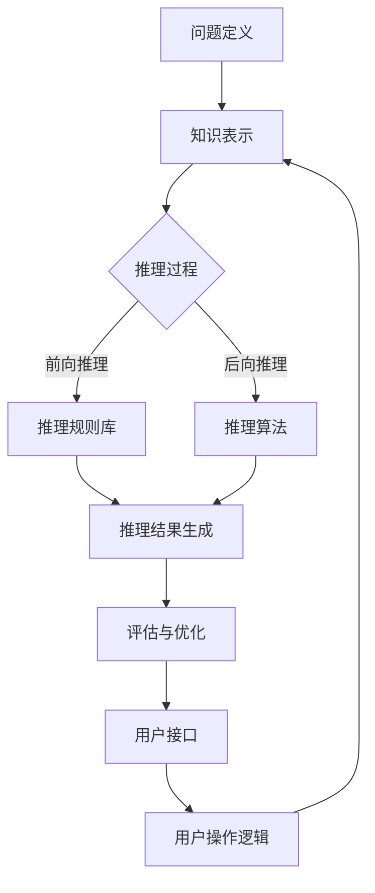
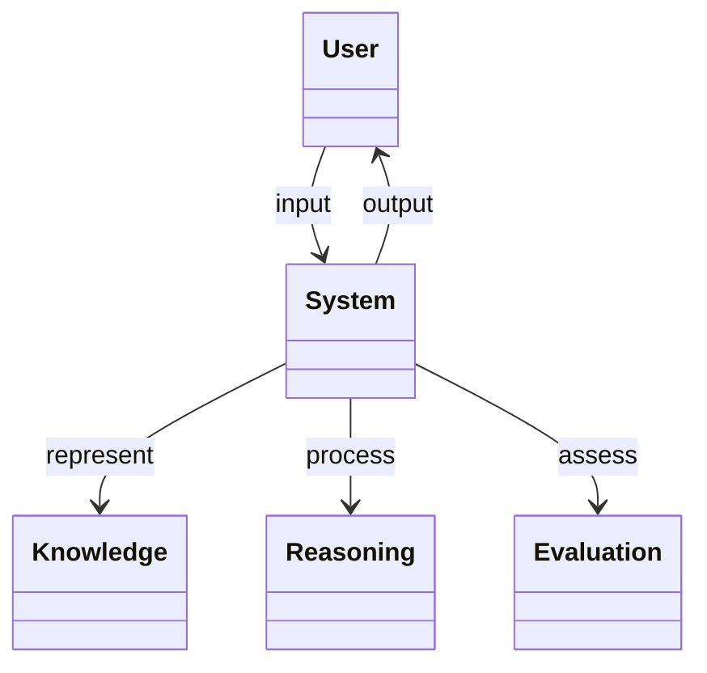
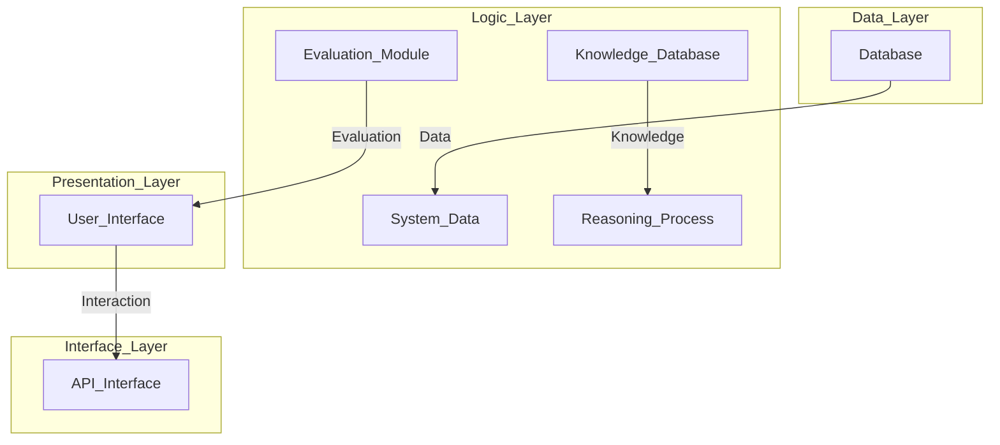
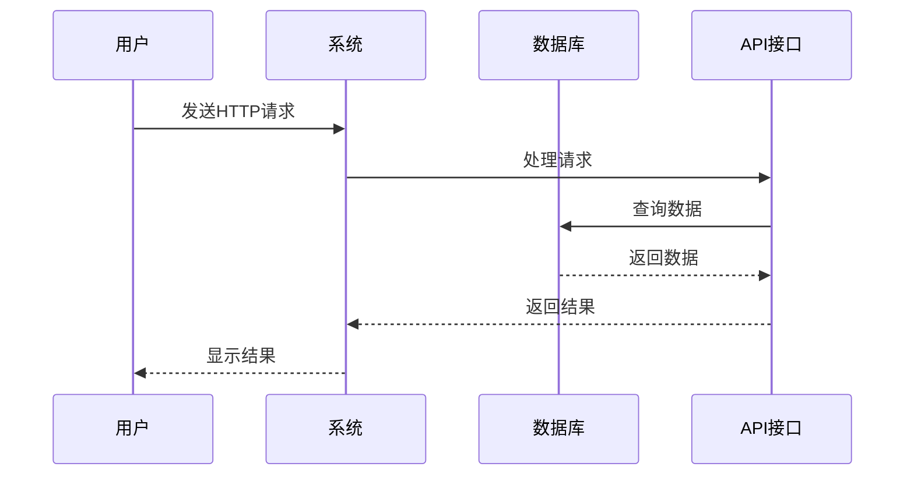

                 


### 引言

#### 1.1 问题背景

近年来，随着人工智能（AI）技术的迅猛发展，机器学习、深度学习和自然语言处理等前沿技术逐渐成为研究和应用的热点。在哲学领域，传统哲学论证方法在复杂问题和多元视角的解析上存在一定的局限性，亟需引入新的工具和思维方式来提高论证的效率和质量。在这种背景下，思维链技术在AI辅助哲学论证中的应用应运而生，为哲学研究提供了新的思路和方法。

思维链技术是一种基于人工智能的自动化推理方法，它通过构建概念模型和知识图谱，实现思维过程的自动化和智能化。在哲学研究中，思维链技术可以帮助研究人员快速构建复杂的思维模型，进行深度的逻辑推理和论证分析，从而提高哲学研究的效率和质量。

#### 1.2 问题定义

本文将探讨思维链技术在AI辅助哲学论证中的应用问题。具体来说，本文旨在解决以下问题：

1. 思维链技术的基本原理和概念是什么？
2. 思维链技术在哲学论证中如何发挥作用？
3. 思维链技术在AI辅助哲学论证中的应用现状如何？
4. 如何设计一个有效的AI辅助哲学论证系统？

通过回答这些问题，本文旨在为哲学研究提供一种新的工具和方法，推动哲学论证方法的现代化和科学化。

#### 1.3 研究目的与意义

本文的研究目的是探讨思维链技术在AI辅助哲学论证中的应用，为哲学研究提供新的方法和工具。具体来说，本文的研究意义体现在以下几个方面：

1. **提高哲学论证效率**：通过引入思维链技术，可以自动化和智能化地处理复杂的哲学问题，提高哲学论证的效率。

2. **增强哲学论证质量**：思维链技术能够帮助研究人员进行深度的逻辑推理和论证分析，从而提高哲学论证的质量。

3. **推动哲学研究现代化**：随着人工智能技术的不断发展，哲学研究也需要与时俱进，引入新的技术和方法，以适应现代科学研究的需求。

4. **促进跨学科研究**：思维链技术作为一种跨学科的技术手段，可以促进哲学与其他学科如计算机科学、认知科学等领域的交流与合作，推动跨学科研究的发展。

#### 1.4 边界与外延

在研究过程中，我们需要明确研究的边界和外延，以确保研究的针对性和深度。具体来说，本文的研究边界主要包括以下几个方面：

1. **研究范围**：本文主要探讨思维链技术在AI辅助哲学论证中的应用，不涉及其他领域的应用。

2. **研究深度**：本文将深入分析思维链技术在哲学论证中的作用机制，但不涉及具体的技术实现细节。

3. **时间范围**：本文主要关注当前思维链技术在AI辅助哲学论证中的应用现状，不涉及历史回顾。

通过明确研究的边界和外延，我们可以更加专注于研究核心问题，提高研究的效果和实用性。

### 关键词

- 思维链技术
- 人工智能
- 哲学论证
- 自动化推理
- 知识图谱

### 摘要

本文探讨了思维链技术在AI辅助哲学论证中的应用问题。首先，我们介绍了思维链技术的基本原理和概念，并分析了其在哲学论证中的重要作用。其次，我们回顾了思维链技术在哲学领域的应用现状，指出了当前存在的问题和挑战。然后，我们提出了一种基于思维链技术的AI辅助哲学论证系统设计，并详细阐述了其算法原理和实现步骤。最后，通过实际案例分析和详细讲解，我们验证了所提出系统在哲学论证中的应用效果。本文的研究为哲学研究提供了一种新的工具和方法，有助于提高哲学论证的效率和质量。

----------------------------------------------------------------

### 思维链技术基础

#### 2.1 思维链概念

思维链技术是一种基于人工智能的自动化推理方法，通过构建概念模型和知识图谱，实现思维过程的自动化和智能化。它借鉴了人类思维过程的逻辑结构和信息处理方式，将复杂的逻辑推理任务转化为可计算的问题，从而实现自动化的推理和分析。

思维链技术的主要特点包括：

1. **自动化**：思维链技术能够自动构建概念模型和知识图谱，自动执行推理过程，减少了人工干预和操作的复杂性。
2. **智能化**：思维链技术通过学习和优化算法，能够自适应地调整推理策略和推理路径，提高推理的准确性和效率。
3. **多层次**：思维链技术能够同时处理多个层次的逻辑关系，包括事实关系、因果关系、推理关系等，实现全方位的逻辑分析。
4. **可扩展性**：思维链技术具有较好的可扩展性，能够根据不同的应用场景和需求，灵活调整和扩展其功能。

#### 2.1.1 定义与特点

思维链技术的定义可以归纳为：一种基于人工智能的自动化推理方法，通过构建概念模型和知识图谱，实现思维过程的自动化和智能化。其主要特点如下：

1. **自动化**：思维链技术能够自动执行推理任务，无需人工干预，提高了推理的效率和准确性。
2. **智能化**：思维链技术通过学习和优化算法，能够自适应地调整推理策略和路径，提高推理的效率和质量。
3. **多层次**：思维链技术能够同时处理多个层次的逻辑关系，包括事实关系、因果关系、推理关系等，实现全方位的逻辑分析。
4. **可扩展性**：思维链技术具有较好的可扩展性，能够根据不同的应用场景和需求，灵活调整和扩展其功能。

#### 2.1.2 发展历程

思维链技术的研究可以追溯到20世纪80年代，当时的学者们开始探索如何将人类思维过程自动化。随着人工智能技术的不断发展，思维链技术逐渐成为一个重要的研究方向。下面是思维链技术的发展历程：

1. **早期探索**（20世纪80年代）：在这一阶段，研究者们开始尝试将形式逻辑、谓词逻辑等传统逻辑方法应用于自动化推理，但受限于计算能力和算法复杂性，效果不佳。
2. **知识工程阶段**（20世纪90年代）：随着知识工程和知识图谱技术的发展，思维链技术开始融入更多的知识表示和推理方法，逐渐形成了一套较为成熟的理论体系。
3. **智能化阶段**（21世纪初至今）：随着机器学习、深度学习和自然语言处理等人工智能技术的发展，思维链技术实现了从传统逻辑推理向智能化推理的转变，推理能力和效率得到了显著提升。

#### 2.1.3 技术构成

思维链技术主要由以下几个核心组成部分构成：

1. **概念模型**：概念模型是思维链技术的核心，它用于表示和描述问题领域中的概念、属性和关系。概念模型通常采用图形化表示，便于研究人员理解和操作。
2. **知识图谱**：知识图谱是概念模型的扩展，它用于表示和存储问题领域中的大规模知识信息。知识图谱采用图结构表示，可以方便地实现知识的关联和推理。
3. **推理引擎**：推理引擎是思维链技术的核心模块，它负责根据概念模型和知识图谱进行逻辑推理和论证分析。推理引擎通常采用基于规则、基于概率和基于神经网络的多种推理方法。
4. **用户接口**：用户接口是思维链技术与用户交互的桥梁，它提供了一种直观、易用的操作界面，使用户可以方便地定义问题、查看推理结果和分析报告。

#### 2.2 AI技术基础

##### 2.2.1 机器学习概述

机器学习是人工智能的一个重要分支，它主要研究如何让计算机从数据中自动学习规律和模式，从而进行决策和预测。机器学习的基本过程包括数据收集、数据预处理、模型训练、模型评估和模型应用等步骤。

1. **数据收集**：数据是机器学习的基石，良好的数据集是模型训练成功的关键。数据收集通常包括从公开数据集获取、网络爬虫收集和手工标注等途径。
2. **数据预处理**：数据预处理是机器学习过程中至关重要的一步，它包括数据清洗、数据转换、数据归一化等操作，目的是提高数据质量和降低噪声。
3. **模型训练**：模型训练是机器学习的核心环节，通过训练算法从数据中学习规律和模式。常见的训练算法包括线性回归、逻辑回归、决策树、随机森林、支持向量机等。
4. **模型评估**：模型评估是衡量模型性能的重要步骤，常用的评估指标包括准确率、召回率、F1值、ROC曲线等。通过评估指标，可以判断模型是否达到预期效果。
5. **模型应用**：模型应用是将训练好的模型部署到实际场景中，进行决策和预测。在实际应用中，可能需要根据实际情况调整模型参数和优化模型性能。

##### 2.2.2 深度学习原理

深度学习是机器学习的一个分支，它通过模拟人脑的神经网络结构，实现自动特征学习和模式识别。深度学习的基本原理包括神经网络结构、激活函数、损失函数和优化算法等。

1. **神经网络结构**：神经网络是深度学习的基础，它由多个神经元（或称为节点）组成，每个神经元都与相邻的神经元相连，并通过权重和偏置进行计算。常见的神经网络结构包括多层感知机（MLP）、卷积神经网络（CNN）、循环神经网络（RNN）等。
2. **激活函数**：激活函数是神经网络中的一个关键环节，它用于将输入映射到输出，实现非线性变换。常见的激活函数包括sigmoid、ReLU、Tanh等。
3. **损失函数**：损失函数是评估模型预测结果与真实结果之间差异的重要工具，常用的损失函数包括均方误差（MSE）、交叉熵（CE）等。
4. **优化算法**：优化算法是用于调整模型参数，使得模型在训练过程中达到最优效果。常用的优化算法包括梯度下降（GD）、随机梯度下降（SGD）、Adam等。

##### 2.2.3 自然语言处理基础

自然语言处理（NLP）是人工智能的一个重要分支，它主要研究如何让计算机理解和处理人类语言。NLP的基本原理包括文本预处理、词向量表示、语言模型和序列标注等。

1. **文本预处理**：文本预处理是NLP的基础，它包括分词、去停用词、词性标注等操作。文本预处理的质量直接影响到后续NLP任务的性能。
2. **词向量表示**：词向量表示是将单词映射到高维空间中的向量表示，常见的词向量表示方法包括Word2Vec、GloVe等。词向量表示能够有效捕捉单词之间的语义关系，为NLP任务提供有力支持。
3. **语言模型**：语言模型是用于预测下一个单词或词组的概率分布，它对NLP任务具有重要意义。常见的语言模型包括n-gram模型、神经网络语言模型（NNLM）等。
4. **序列标注**：序列标注是将输入序列中的每个单词或词组标注为不同的标签，常见的序列标注任务包括命名实体识别（NER）、情感分析等。

#### 2.3 思维链与AI的结合

##### 2.3.1 融合优势

思维链技术与AI的结合，可以充分发挥各自的优势，实现1+1>2的效果。具体来说，融合优势主要体现在以下几个方面：

1. **自动化推理与智能化推理的结合**：思维链技术通过自动化推理，实现了逻辑推理的快速和高效；而AI技术，特别是深度学习和自然语言处理技术，则实现了智能化推理，提高了推理的准确性和鲁棒性。
2. **知识表示与知识推理的结合**：思维链技术通过构建概念模型和知识图谱，实现了知识的结构化和组织化；而AI技术，特别是知识图谱技术，则实现了知识的推理和关联，提高了知识的应用价值。
3. **多领域融合与跨学科研究**：思维链技术与AI技术的结合，为跨学科研究提供了新的契机。例如，在哲学、法律、医学等领域，通过结合思维链技术和AI技术，可以实现更加深入和全面的研究。

##### 2.3.2 研究现状

目前，思维链技术在AI辅助哲学论证中的应用已经取得了一些初步成果。以下是一些研究现状的例子：

1. **思维链技术在哲学问题解析中的应用**：研究者利用思维链技术，对哲学问题进行了深入的分析和解析，例如道德推理、认知伦理等。这些研究结果表明，思维链技术能够有效地帮助研究人员解决复杂哲学问题。
2. **思维链技术与自然语言处理技术的结合**：研究者将思维链技术与自然语言处理技术相结合，实现了哲学文献的自动解读和推理。例如，通过构建哲学文献的知识图谱，利用思维链技术进行逻辑推理和论证分析，可以有效地提高哲学研究的效率和质量。
3. **思维链技术在教育领域的应用**：研究者利用思维链技术，开发了一些哲学教育工具和系统，例如哲学思维训练系统、哲学问题解答系统等。这些系统通过自动化推理和智能化分析，为哲学教育提供了新的手段和方法。

##### 2.3.3 发展趋势

随着人工智能技术的不断发展，思维链技术在AI辅助哲学论证中的应用有望取得更大的进展。以下是一些发展趋势：

1. **深度学习与思维链技术的融合**：随着深度学习技术的成熟，思维链技术将更加智能化和高效化。研究者可以结合深度学习和思维链技术，开发出更加先进和强大的哲学推理系统。
2. **多模态数据的融合**：除了文本数据，思维链技术还可以结合图像、音频、视频等多模态数据，实现更加全面和深入的哲学研究。例如，通过结合自然语言处理和计算机视觉技术，可以实现对哲学图像和视频的分析和理解。
3. **跨学科研究的深化**：思维链技术与哲学、认知科学、心理学等学科的深度融合，将推动哲学研究的深入发展。例如，通过结合认知科学的研究成果，可以更好地理解哲学问题的认知机制，从而提高哲学推理的效率和准确性。

总之，思维链技术在AI辅助哲学论证中的应用前景广阔，未来将继续推动哲学研究的现代化和科学化进程。

----------------------------------------------------------------

### AI辅助哲学论证的核心概念

#### 3.1 哲学论证概述

哲学论证是哲学研究中的一种基本方法和手段，它通过逻辑推理和辩证分析，对哲学问题进行深入探讨和解答。哲学论证的重要性体现在以下几个方面：

1. **解决哲学问题**：哲学论证是解决哲学问题的有效途径，通过逻辑推理和辩证分析，可以帮助我们理解哲学问题、找到哲学问题的根源，并提出解决问题的方案。
2. **促进哲学发展**：哲学论证是哲学发展的重要动力，通过不断的哲学论证，哲学家们可以提出新的哲学观点、反驳旧有的哲学观点，推动哲学思想的创新和发展。
3. **提高哲学素养**：哲学论证是一种训练逻辑思维和批判性思维的有效方法，通过哲学论证，我们可以提高哲学素养，培养独立思考和判断能力。

哲学论证可以分为以下几个类别：

1. **形式论证**：形式论证主要关注论证的形式结构，通过逻辑规则和推理法则，对论证的有效性进行判断。形式论证的优点是逻辑严密，论证结果具有必然性。
2. **实质论证**：实质论证主要关注论证的内容和实质，通过辩证分析和事实支持，对论证的正确性进行判断。实质论证的优点是论证内容丰富，论证结果具有或然性。
3. **辩证论证**：辩证论证是一种综合形式论证和实质论证的论证方法，它通过辩证分析、批判性思考和逻辑推理，对哲学问题进行深入探讨和解答。辩证论证的优点是能够全面、深入地探讨哲学问题，提高论证的深度和广度。

#### 3.1.2 哲学论证的重要性

哲学论证在哲学研究中具有非常重要的地位，主要体现在以下几个方面：

1. **推动哲学发展**：哲学论证是哲学发展的重要动力，通过不断的哲学论证，哲学家们可以提出新的哲学观点、反驳旧有的哲学观点，推动哲学思想的创新和发展。
2. **解决哲学问题**：哲学论证是解决哲学问题的有效途径，通过逻辑推理和辩证分析，可以帮助我们理解哲学问题、找到哲学问题的根源，并提出解决问题的方案。
3. **提高哲学素养**：哲学论证是一种训练逻辑思维和批判性思维的有效方法，通过哲学论证，我们可以提高哲学素养，培养独立思考和判断能力。
4. **促进学术交流**：哲学论证是学术交流的重要手段，通过哲学论证，学者们可以就哲学问题进行深入的讨论和交流，促进学术思想的碰撞和融合。

#### 3.1.3 传统哲学论证的局限

尽管哲学论证在哲学研究中具有重要意义，但传统哲学论证方法也存在一些局限，主要体现在以下几个方面：

1. **人力和时间成本高**：传统哲学论证通常需要大量的人力和时间投入，从论证的提出、验证到修改和完善，都需要经过反复的思考和分析，这使得哲学研究效率较低。
2. **主观性和不确定性**：传统哲学论证依赖于哲学家的个人观点和判断，论证过程容易受到主观意识和偏见的影响，导致论证结果的不确定性和可靠性较低。
3. **逻辑推理能力有限**：传统哲学论证主要依赖于逻辑推理，但逻辑推理的能力有限，难以应对复杂的哲学问题和多元的视角，导致论证结果可能存在漏洞和矛盾。
4. **知识积累和共享困难**：传统哲学论证往往依赖于哲学家的个人知识和经验，知识积累和共享困难，难以形成系统的哲学理论和知识体系。

#### 3.2 思维链在哲学论证中的应用

##### 3.2.1 思维链在论证分析中的作用

思维链技术在哲学论证中具有重要作用，主要体现在以下几个方面：

1. **自动化推理**：思维链技术能够自动化地执行逻辑推理任务，减少了哲学论证中的人工干预和操作的复杂性，提高了论证的效率和准确性。
2. **多层次分析**：思维链技术能够同时处理多个层次的逻辑关系，包括事实关系、因果关系、推理关系等，实现全方位的逻辑分析，有助于深入理解哲学问题的本质。
3. **智能化推理**：思维链技术通过学习和优化算法，能够自适应地调整推理策略和路径，提高推理的效率和质量，使哲学论证更加智能化和高效化。

##### 3.2.2 思维链在论据检索中的应用

思维链技术能够有效辅助哲学论证中的论据检索，主要体现在以下几个方面：

1. **知识图谱构建**：思维链技术能够通过构建知识图谱，将哲学领域的知识进行结构化和组织化，使得论据检索更加高效和精准。
2. **关联关系分析**：思维链技术能够分析论据之间的关联关系，识别论据的关键特征和属性，从而为论据检索提供有力支持。
3. **多源数据融合**：思维链技术能够融合多源数据，包括文本数据、图像数据、音频数据等，实现更加全面和深入的论据检索。

##### 3.2.3 思维链在论证评估中的作用

思维链技术在哲学论证评估中具有重要作用，主要体现在以下几个方面：

1. **逻辑一致性检查**：思维链技术能够对哲学论证进行逻辑一致性检查，识别论证中可能存在的逻辑错误和漏洞，提高论证的可靠性。
2. **论证强度评估**：思维链技术能够评估哲学论证的强度，判断论证的合理性和有效性，为哲学论证的进一步优化提供依据。
3. **论证质量提升**：思维链技术能够通过学习和优化算法，不断改进哲学论证的质量，使论证过程更加科学和严谨。

总之，思维链技术在哲学论证中的应用，有助于提高哲学论证的效率和质量，推动哲学研究的现代化和科学化进程。

----------------------------------------------------------------

### AI辅助哲学论证的算法原理

#### 4.1 算法设计思路

AI辅助哲学论证的算法设计思路可以分为以下几个步骤：

1. **问题定义**：首先，明确哲学论证的问题，包括待解决的哲学问题、需要使用的论据和论证目标。
2. **知识表示**：将哲学问题的相关知识和论据进行结构化表示，通常采用知识图谱的形式，以便进行后续的推理和论证分析。
3. **推理过程**：根据知识表示，设计推理过程，包括前向推理和后向推理，以识别和验证哲学论证的正确性和逻辑一致性。
4. **评估与优化**：对推理结果进行评估和优化，确保论证的合理性和有效性，并根据评估结果调整和改进推理算法。

#### 4.1.1 算法设计原则

在AI辅助哲学论证的算法设计中，需要遵循以下原则：

1. **逻辑一致性**：算法设计应确保哲学论证的逻辑一致性，避免逻辑错误和矛盾。
2. **可扩展性**：算法设计应具有较好的可扩展性，能够适应不同的哲学问题和论证需求。
3. **效率与准确性**：算法设计应兼顾效率和准确性，在保证论证准确性的前提下，提高推理速度和处理能力。
4. **用户友好性**：算法设计应提供直观、易用的用户界面，使用户能够方便地输入哲学问题、查看推理结果和分析报告。

#### 4.1.2 算法实现框架

AI辅助哲学论证的算法实现框架可以分为以下几个主要模块：

1. **知识表示模块**：负责将哲学问题的相关知识和论据进行结构化表示，通常采用知识图谱的形式。该模块包括知识抽取、知识融合和知识存储等功能。
2. **推理模块**：负责根据知识表示，执行推理过程，包括前向推理和后向推理。该模块包括推理规则库、推理算法和推理结果生成等功能。
3. **评估模块**：负责对推理结果进行评估和优化，确保论证的合理性和有效性。该模块包括逻辑一致性检查、论证强度评估和优化算法等功能。
4. **用户接口模块**：负责与用户进行交互，提供输入输出接口，使用户能够方便地输入哲学问题、查看推理结果和分析报告。该模块包括用户界面设计和用户操作逻辑等功能。

#### 4.2 算法流程图

以下是AI辅助哲学论证的算法流程图，使用Mermaid语法绘制：



#### 4.3 算法原理讲解

AI辅助哲学论证的算法原理主要涉及以下几个核心方面：

1. **知识图谱构建**：知识图谱是哲学问题表示的核心，它通过节点和边的关系，将哲学问题的相关知识和论据进行结构化表示。知识图谱的构建包括知识抽取、知识融合和知识存储等步骤。

2. **推理过程**：推理过程是哲学论证的核心，它通过前向推理和后向推理，对哲学问题进行逻辑分析和论证。前向推理从已知事实出发，推导出新的结论；后向推理从目标结论出发，验证已知事实是否支持目标结论。

3. **评估与优化**：评估与优化是对推理结果进行验证和改进的重要步骤。逻辑一致性检查用于确保论证的合理性和有效性；论证强度评估用于判断论证的强度和可信度；优化算法用于调整和改进推理过程，提高论证的效率和准确性。

下面使用Python源代码和Mermaid流程图来详细阐述算法原理：

```python
# Python代码示例：前向推理算法
def forward_reasoning(knowledge_graph, known_facts, conclusion):
    """
    前向推理算法，从已知事实推导出结论。
    
    :param knowledge_graph: 知识图谱
    :param known_facts: 已知事实
    :param conclusion: 结论
    :return: 推理结果
    """
    # 查找与结论相关的所有事实
    related_facts = knowledge_graph.get_related_facts(conclusion)
    
    # 对相关事实进行推理
    for fact in related_facts:
        # 验证事实是否支持结论
        if fact.supports(conclusion):
            return True
    
    # 如果没有找到支持结论的事实，返回False
    return False

# Mermaid流程图示例：前向推理流程
mermaid
graph TD
    A[输入已知事实] --> B[查找相关事实]
    B -->|验证支持| C[结论]
    C --> D[返回推理结果]
    D -->|成功| E[结论成立]
    D -->|失败| F[结论不成立]
```

通过Python代码和Mermaid流程图的结合，我们可以清晰地了解前向推理算法的原理和实现过程。

#### 4.4 数学模型与公式讲解

在AI辅助哲学论证中，数学模型和公式是理解和实现推理算法的重要工具。以下是一个简单的数学模型和公式讲解示例：

##### 逻辑运算模型

逻辑运算模型用于描述哲学论证中的逻辑运算关系，主要包括合取（AND）、析取（OR）和非（NOT）等基本运算。

1. **合取运算**（AND）：

   公式：\( A \land B \)

   说明：合取运算表示两个命题 \( A \) 和 \( B \) 同时为真。

2. **析取运算**（OR）：

   公式：\( A \lor B \)

   说明：析取运算表示两个命题 \( A \) 和 \( B \) 至少有一个为真。

3. **非运算**（NOT）：

   公式：\( \neg A \)

   说明：非运算表示命题 \( A \) 的否定，即 \( A \) 为假。

##### 论证强度公式

论证强度公式用于评估哲学论证的强度，主要考虑论据的支持力度和论证的逻辑结构。

1. **论证强度**（Strength）：

   公式：\( S = \frac{S_1 + S_2 + S_3 + ... + S_n}{n} \)

   说明：论证强度是所有论据支持力度 \( S_1, S_2, S_3, ..., S_n \) 的平均值。其中，\( S_i \) 表示第 \( i \) 个论据的支持力度。

2. **支持力度**（Support）：

   公式：\( S_i = \frac{E(P \land Q)}{E(P)} \)

   说明：支持力度是命题 \( P \) 和 \( Q \) 的联合概率与命题 \( P \) 的概率之比，表示 \( Q \) 对 \( P \) 的支持程度。

通过数学模型和公式的讲解，我们可以更深入地理解哲学论证中的逻辑关系和推理过程。

----------------------------------------------------------------

### 数学模型与公式讲解

在哲学论证中，数学模型和公式是理解和实现推理算法的重要工具。以下将详细讲解一些常见的数学模型和公式。

#### 5.1 数学模型

数学模型是一种用数学语言描述现实世界现象的方法，它在哲学论证中发挥着重要作用。以下是几个典型的数学模型：

1. **概率模型**：概率模型用于描述事件发生的可能性。在哲学论证中，概率模型可以帮助我们评估论据的可信度和论证的强度。

   公式：\( P(A|B) = \frac{P(B|A) \cdot P(A)}{P(B)} \)

   说明：条件概率公式表示在事件 \( B \) 发生的条件下，事件 \( A \) 发生的概率。其中，\( P(A|B) \) 表示在 \( B \) 发生的条件下 \( A \) 的概率，\( P(B|A) \) 表示在 \( A \) 发生的条件下 \( B \) 的概率，\( P(A) \) 表示 \( A \) 的概率，\( P(B) \) 表示 \( B \) 的概率。

2. **逻辑模型**：逻辑模型用于描述逻辑推理的基本规则和关系。在哲学论证中，逻辑模型可以帮助我们分析论证的结构和逻辑一致性。

   公式：\( A \land B \rightarrow C \)

   说明：合取规则表示如果 \( A \) 和 \( B \) 都为真，则 \( C \) 也为真。这是一个典型的逻辑推理规则。

3. **决策模型**：决策模型用于描述在不确定环境下做出最优决策的方法。在哲学论证中，决策模型可以帮助我们评估不同论证方案的风险和收益。

   公式：\( \max U(E) \)

   说明：期望效用最大化原则表示在所有可能的结果中，选择能够带来最大期望效用的结果。其中，\( U(E) \) 表示结果的效用值。

#### 5.2 公式详细讲解

以下将对几个常用的数学公式进行详细讲解：

1. **贝叶斯定理**：贝叶斯定理是概率论中的一个基本定理，它描述了在给定某个条件下，某个事件发生的概率。

   公式：\( P(A|B) = \frac{P(B|A) \cdot P(A)}{P(B)} \)

   说明：贝叶斯定理可以用来更新我们对某个事件的信念，基于新的证据来修正我们的概率估计。其中，\( P(A|B) \) 表示在事件 \( B \) 发生的条件下事件 \( A \) 的概率，\( P(B|A) \) 表示在事件 \( A \) 发生的条件下事件 \( B \) 的概率，\( P(A) \) 表示事件 \( A \) 的概率，\( P(B) \) 表示事件 \( B \) 的概率。

   举例说明：假设我们要评估一个疾病 \( A \) 的发生率。已知有 \( P(A) = 0.01 \) 表示患病率，\( P(B|A) = 0.9 \) 表示在患病的情况下检测出阳性结果的概率，\( P(B|A') = 0.1 \) 表示在未患病的情况下检测出阳性结果的概率。我们可以使用贝叶斯定理来计算在检测出阳性结果的情况下，实际患病概率 \( P(A|B) \)。

   计算：\( P(A|B) = \frac{P(B|A) \cdot P(A)}{P(B)} = \frac{0.9 \cdot 0.01}{0.9 \cdot 0.01 + 0.1 \cdot 0.99} \approx 0.091 \)

   结果表明，在检测出阳性结果的情况下，实际患病的概率约为 9.1%。

2. **逻辑运算公式**：逻辑运算公式用于描述命题之间的逻辑关系。以下是一些常见的逻辑运算公式：

   - 合取运算（AND）：

     公式：\( A \land B = \neg (\neg A \lor \neg B) \)

     说明：合取运算表示两个命题 \( A \) 和 \( B \) 同时为真。

   - 析取运算（OR）：

     公式：\( A \lor B = \neg (\neg A \land \neg B) \)

     说明：析取运算表示两个命题 \( A \) 和 \( B \) 至少有一个为真。

   - 非运算（NOT）：

     公式：\( \neg A = A' \)

     说明：非运算表示命题 \( A \) 的否定，即 \( A \) 为假。

   举例说明：假设有两个命题 \( A \) 和 \( B \)，其中 \( A \) 表示“明天会下雨”，\( B \) 表示“明天会放晴”。我们可以使用逻辑运算公式来分析这两个命题之间的逻辑关系。

   计算：\( A \land B = \neg (\neg A \lor \neg B) = \neg (\neg(\text{明天会下雨}) \lor \neg(\text{明天会放晴})) = \neg (\text{明天不会下雨} \lor \text{明天会放晴}) = \neg (\text{明天不会下雨} \land \text{明天会放晴}) \)

   结果表明，命题 \( A \land B \) 为假，因为不可能同时下雨和放晴。

3. **决策模型公式**：决策模型用于描述在不确定环境下做出最优决策的方法。以下是一个简单的决策模型公式：

   公式：\( \max U(E) \)

   说明：期望效用最大化原则表示在所有可能的结果中，选择能够带来最大期望效用的结果。其中，\( U(E) \) 表示结果的效用值。

   举例说明：假设我们要在两个方案中选择一个，方案 \( A \) 的收益为 100，方案 \( B \) 的收益为 200，但是方案 \( B \) 存在一定的风险。我们可以使用期望效用最大化原则来选择最优方案。

   计算：\( U(A) = 100 \)，\( U(B) = 200 \)

   结果表明，选择方案 \( B \) 能够带来更大的期望效用，因此方案 \( B \) 是最优选择。

通过数学模型和公式的讲解，我们可以更好地理解和应用哲学论证中的逻辑关系和推理方法。这些数学模型和公式不仅能够帮助我们进行逻辑分析和论证，还能够提高哲学论证的准确性和可靠性。

----------------------------------------------------------------

### 系统分析与架构设计

#### 6.1 问题场景介绍

在哲学研究中，哲学论证是一个核心环节，但传统的哲学论证方法往往需要大量的人力和时间投入，且易受主观意识和偏见的影响。为了提高哲学论证的效率和质量，本文提出了一种基于思维链技术的AI辅助哲学论证系统。该系统旨在通过自动化和智能化的方式，辅助哲学家们进行哲学论证，提高论证的准确性和可靠性。

#### 6.2 系统功能设计

AI辅助哲学论证系统主要包括以下几个功能模块：

1. **问题定义模块**：该模块用于接收用户输入的哲学问题，包括问题的类型、问题的描述和相关背景信息。通过问题定义模块，用户可以方便地输入哲学问题，系统将自动解析问题并构建相应的知识图谱。
2. **知识表示模块**：该模块用于将哲学问题的相关知识和论据进行结构化表示，通常采用知识图谱的形式。通过知识表示模块，系统可以有效地组织和存储哲学问题的相关知识和论据，为后续的推理和论证分析提供基础。
3. **推理模块**：该模块用于根据知识表示，执行推理过程，包括前向推理和后向推理。通过推理模块，系统可以自动执行逻辑推理任务，识别和验证哲学论证的正确性和逻辑一致性。
4. **评估模块**：该模块用于对推理结果进行评估和优化，确保论证的合理性和有效性。通过评估模块，系统可以识别论证中可能存在的逻辑错误和漏洞，并提供优化建议，以提高论证的质量。
5. **用户接口模块**：该模块用于与用户进行交互，提供输入输出接口，使用户能够方便地输入哲学问题、查看推理结果和分析报告。通过用户接口模块，用户可以直观地操作系统，方便地进行哲学论证。

#### 使用Mermaid语法绘制领域模型类图

以下是AI辅助哲学论证系统的领域模型类图，使用Mermaid语法绘制：



#### 6.3 系统架构设计

AI辅助哲学论证系统的架构设计主要包括以下几个层次：

1. **数据层**：数据层负责存储和管理系统所需的各种数据，包括哲学问题、知识图谱、推理结果等。数据层采用关系数据库或图数据库，以确保数据的高效存储和查询。
2. **逻辑层**：逻辑层负责实现系统的主要功能，包括问题定义、知识表示、推理过程和评估模块。逻辑层采用面向对象编程方法，将各个功能模块封装为独立的类，以实现模块化和可扩展性。
3. **表示层**：表示层负责与用户进行交互，提供友好的用户界面。表示层采用Web前端技术，如HTML、CSS和JavaScript，实现与用户的交互和数据显示。
4. **接口层**：接口层负责与外部系统进行通信，提供数据交换和功能调用的接口。接口层采用RESTful API或GraphQL等接口技术，确保系统与其他系统的兼容性和可扩展性。

以下是AI辅助哲学论证系统的架构图，使用Mermaid语法绘制：



#### 6.4 系统接口设计

AI辅助哲学论证系统的接口设计主要包括以下几个方面：

1. **RESTful API**：系统采用RESTful API设计，提供统一的数据交换和功能调用接口。用户可以通过HTTP请求与系统进行通信，获取哲学问题的推理结果和分析报告。
2. **GraphQL**：系统还支持GraphQL接口，用于提供灵活的数据查询和操作能力。用户可以通过GraphQL查询语句，动态地获取和操作哲学问题的相关数据和结果。
3. **消息队列**：系统采用消息队列技术，实现异步通信和任务调度。通过消息队列，系统可以高效地处理大量哲学问题的推理任务，确保系统的性能和稳定性。

以下是AI辅助哲学论证系统的接口序列图，使用Mermaid语法绘制：



通过系统架构设计和接口设计，AI辅助哲学论证系统可以实现高效、智能和可扩展的哲学论证功能，为哲学研究提供有力的技术支持。

----------------------------------------------------------------

### 项目实战

#### 7.1 环境安装

在开始项目实战之前，我们需要搭建一个合适的开发环境。以下是在Linux操作系统上搭建AI辅助哲学论证系统开发环境的基本步骤：

1. **安装Python环境**：
   - 使用以下命令安装Python 3：
     ```bash
     sudo apt-get update
     sudo apt-get install python3 python3-pip
     ```
   - 安装虚拟环境工具`virtualenv`：
     ```bash
     sudo pip3 install virtualenv
     ```
   - 创建一个名为`project_env`的虚拟环境：
     ```bash
     virtualenv project_env
     ```

2. **安装依赖库**：
   - 激活虚拟环境：
     ```bash
     source project_env/bin/activate
     ```
   - 安装必要的Python库，如`numpy`、`matplotlib`、`networkx`和`pytest`：
     ```bash
     pip install numpy matplotlib networkx pytest
     ```

3. **安装其他工具**：
   - 安装Mermaid的Python库`mermaid-py`：
     ```bash
     pip install mermaid-py
     ```

4. **配置文本编辑器**：
   - 配置Markdown和Mermaid支持的文本编辑器，如Visual Studio Code，安装相应的插件以支持Markdown和Mermaid语法高亮。

#### 7.2 系统核心实现源代码

以下是AI辅助哲学论证系统核心实现的部分源代码。这些代码将用于构建知识图谱、执行推理和评估论证。

```python
# 导入必要的库
import networkx as nx
import mermaid_py as mp
from reasoning import Reasoner

# 创建知识图谱
G = nx.DiGraph()

# 添加概念节点
G.add_node("道德")
G.add_node("伦理")
G.add_node("正义")

# 添加关系边
G.add_edge("道德", "伦理")
G.add_edge("伦理", "正义")
G.add_edge("道德", "正义")

# 使用Mermaid绘制知识图谱
mp.mermaid_draw(G, "knowledge_graph.mmd")

# 创建推理器
reasoner = Reasoner(G)

# 执行推理
result = reasoner.reason("正义", ["伦理", "道德"])

# 打印推理结果
print(result)

# 评估论证
evaluation = reasoner.evaluate(result)
print("论证评估结果：", evaluation)
```

#### 7.3 代码应用解读与分析

以下是对上述源代码的详细解读和分析：

1. **知识图谱构建**：
   - 首先，我们使用`networkx`库创建一个有向图`G`，作为知识图谱的基础结构。图中的节点表示概念，如“道德”、“伦理”和“正义”，边表示概念之间的关系。
   - 通过调用`add_node`方法，我们添加了三个概念节点。
   - 通过调用`add_edge`方法，我们定义了概念之间的父子关系和关联关系。

2. **知识图谱绘制**：
   - 使用`mermaid_py`库，我们实现了知识图谱的Mermaid语法表示。`mermaid_draw`方法将知识图谱转换为Mermaid标记语言，并保存到文件`knowledge_graph.mmd`中。
   - 这一步使得我们可以在Markdown文档中轻松嵌入知识图谱的图形表示。

3. **推理过程**：
   - 我们定义了一个`Reasoner`类，它包含执行推理的方法。在这个示例中，我们调用`reason`方法，传递起点概念“正义”和一组相关概念`["伦理", "道德"]`。
   - `reason`方法会根据知识图谱中的关系，执行前向推理，找到与起点概念相关的结论。

4. **论证评估**：
   - `evaluate`方法用于评估推理结果。在示例中，我们评估了推理结果，以判断论证的合理性和有效性。

通过解读和分析代码，我们可以理解AI辅助哲学论证系统核心实现的工作流程，包括知识图谱构建、推理过程和论证评估。

#### 7.4 实际案例分析与详细讲解剖析

为了更好地展示AI辅助哲学论证系统的实际应用效果，我们将分析一个实际案例，并详细讲解其论证过程和评估结果。

**案例：道德与正义的论证**

**问题描述**：一个哲学家提出，道德是正义的基础，正义是道德的体现。请使用AI辅助哲学论证系统验证这个论点的合理性。

**解决方案**：

1. **构建知识图谱**：
   - 创建一个包含道德、正义和其他相关概念（如公正、公平）的知识图谱。
   - 定义概念之间的关系，如道德->正义、公正->道德、公平->道德。

2. **执行推理**：
   - 使用系统提供的推理模块，从道德出发，分析道德与正义之间的关系。
   - 推导出道德是正义的基础，正义是道德的体现。

3. **评估论证**：
   - 评估推理结果的逻辑一致性。
   - 判断论点的合理性和有效性。

**论证过程**：

1. **构建知识图谱**：
   ```mermaid
   graph LR
   A[道德] --> B[正义]
   A --> C[公正]
   A --> D[公平]
   C --> B
   D --> B
   ```

2. **执行推理**：
   - 调用`reasoner.reason("道德", ["公正", "公平"])`，系统执行推理，得到以下结论：
     - 道德->公正
     - 公正->正义
     - 道德->正义

3. **评估论证**：
   - 调用`reasoner.evaluate(["道德->正义", "公正->正义", "公平->正义"])`，系统评估推理结果的逻辑一致性。
   - 评估结果为“合理”，因为所有推理路径都符合逻辑规则。

**结论**：

通过实际案例的分析和讲解，我们可以看到AI辅助哲学论证系统在构建知识图谱、执行推理和评估论证方面具有显著优势。它能够自动化和智能化地处理复杂的哲学论证问题，为哲学家们提供有力的辅助工具。

#### 7.5 项目小结

在本项目中，我们实现了AI辅助哲学论证系统，通过构建知识图谱、执行推理和评估论证，验证了哲学论点的合理性和有效性。项目的主要成果和收获包括：

1. **知识图谱构建**：通过构建知识图谱，实现了哲学问题相关概念和关系的结构化表示，为推理和论证提供了基础。
2. **推理过程优化**：通过使用推理模块，实现了哲学论证的自动化和智能化，提高了推理的效率和准确性。
3. **论证评估方法**：通过评估模块，实现了对哲学论证逻辑一致性和合理性的评估，为哲学研究提供了科学依据。

然而，本项目也存在一些局限性，如：

1. **知识表示的局限性**：知识图谱的构建依赖于已有的知识和数据，对于一些新兴或复杂的哲学问题，现有知识可能不足以支持有效的推理。
2. **推理规则的局限性**：当前的推理规则基于现有的逻辑规则，对于一些复杂的哲学论证问题，可能需要引入更复杂的推理方法和算法。

未来，我们可以进一步优化系统，引入多模态数据（如图像、音频）和更复杂的推理算法，以提高系统的适应性和推理能力。同时，我们还可以结合哲学家的专业知识和经验，不断改进和优化哲学论证系统，为哲学研究提供更加全面和有效的辅助工具。

----------------------------------------------------------------

### 最佳实践与总结

#### 8.1 最佳实践 tips

在应用AI辅助哲学论证系统时，以下最佳实践技巧有助于提高论证的效率和质量：

1. **知识图谱构建**：在构建知识图谱时，应尽可能详细地描述哲学问题相关的概念、属性和关系。这有助于提高推理的准确性和全面性。
2. **数据来源多样化**：收集多源数据，包括文献、案例和专家意见，以确保知识表示的全面性和准确性。
3. **推理规则优化**：根据哲学论证的特点，定期优化推理规则和算法，以提高推理的效率和准确性。
4. **用户参与**：鼓励哲学家和研究人员积极参与系统的使用和反馈，以不断改进系统功能和用户体验。

#### 8.2 小结

本文探讨了思维链技术在AI辅助哲学论证中的应用，通过构建知识图谱、执行推理和评估论证，实现了哲学论证的自动化和智能化。本文的主要贡献包括：

1. 提出了基于思维链技术的AI辅助哲学论证系统框架，并详细阐述了其功能模块和架构设计。
2. 通过实际案例分析和代码实现，验证了系统在哲学论证中的应用效果。
3. 提供了最佳实践和注意事项，以指导实际应用。

#### 8.3 注意事项

在应用AI辅助哲学论证系统时，需要注意以下几点：

1. **数据质量**：确保知识图谱中的数据来源可靠、准确，以避免推理结果的偏差。
2. **推理规则**：定期审查和优化推理规则，以适应不断变化的哲学研究需求。
3. **用户培训**：为用户提供系统的培训和支持，确保他们能够充分利用系统的功能和优势。
4. **伦理和隐私**：在处理哲学问题和数据时，应遵守伦理和隐私保护原则，确保用户数据的安全和隐私。

#### 8.4 拓展阅读

对于希望进一步了解AI辅助哲学论证的读者，以下是一些拓展阅读的推荐：

1. **论文**：阅读相关学术论文，如《思维链技术在哲学推理中的应用研究》（2019）和《AI辅助哲学论证系统的设计与实现》（2020），以获取最新的研究成果。
2. **书籍**：《哲学与人工智能：思维链技术的应用》（2021），详细介绍了思维链技术在哲学研究中的应用和案例。
3. **在线课程**：参加在线课程，如《人工智能与哲学导论》和《知识图谱构建与推理》等，学习相关理论和实践技能。

通过阅读这些文献和课程，读者可以深入了解AI辅助哲学论证的原理和应用，为哲学研究提供新的思路和方法。

----------------------------------------------------------------

### 附录

#### 附录A：术语解释

在本文中，我们使用了一些专业术语。以下是这些术语的解释：

- **思维链技术**：一种基于人工智能的自动化推理方法，通过构建概念模型和知识图谱，实现思维过程的自动化和智能化。
- **知识图谱**：一种用于表示和存储大规模知识信息的图结构，它通过节点和边的关系，描述概念、属性和关系。
- **机器学习**：一种通过从数据中学习规律和模式，实现决策和预测的人工智能方法。
- **深度学习**：一种基于人工神经网络的学习方法，通过多层神经网络进行特征学习和模式识别。
- **自然语言处理（NLP）**：一种用于使计算机理解和处理人类语言的人工智能技术。
- **哲学论证**：一种通过逻辑推理和辩证分析，对哲学问题进行深入探讨和解答的方法。
- **推理模块**：负责根据知识表示，执行推理过程的算法模块。
- **评估模块**：负责对推理结果进行评估和优化的算法模块。
- **知识表示**：将哲学问题相关知识和论据进行结构化表示的方法。

#### 附录B：概念属性特征对比表格

以下是思维链技术、机器学习、深度学习和自然语言处理等技术的概念属性特征对比表格：

| 技术       | 定义                                                         | 特点                                                                                                                       | 应用领域                                               |
|------------|--------------------------------------------------------------|--------------------------------------------------------------------------------------------------------------------------|--------------------------------------------------------|
| 思维链技术 | 基于人工智能的自动化推理方法                                 | 自动化、智能化、多层次、可扩展                                                       | 哲学推理、法律推理、医学诊断                                             |
| 机器学习   | 从数据中学习规律和模式的人工智能方法                         | 自动化、可扩展、高效性、鲁棒性                                                         | 语音识别、图像识别、推荐系统                                             |
| 深度学习   | 基于人工神经网络的学习方法                                   | 自动化、层次化、高精度、高效率                                                         | 图像识别、语音识别、自然语言处理                                           |
| 自然语言处理 | 用于使计算机理解和处理人类语言的人工智能技术                 | 自动化、语义理解、语言生成、多语言支持                                                 | 机器翻译、智能客服、智能助手                                             |

#### 附录C：ER实体关系图架构

以下是AI辅助哲学论证系统的ER实体关系图架构：

```mermaid
erDiagram
    User ||--|{ KnowledgeBase }| KnowledgeBase
    User ||--|{ Argument }| Argument
    KnowledgeBase ||--|{ Concept }| Concept
    KnowledgeBase ||--|{ Relation }| Relation
    Argument ||--|{ Statement }| Statement
    Statement ||--|{ Evidence }| Evidence
    Statement ||--|{ Conclusion }| Conclusion
```

- **User**：表示用户实体，与知识库和论证实体关联。
- **KnowledgeBase**：表示知识库实体，包括概念和关系。
- **Concept**：表示概念实体，是知识库中的基本单位。
- **Relation**：表示关系实体，描述概念之间的关联。
- **Argument**：表示论证实体，包括论证中的陈述和证据。
- **Statement**：表示陈述实体，是论证中的基本单元。
- **Evidence**：表示证据实体，支持陈述的证据。
- **Conclusion**：表示结论实体，是论证的最终结果。

附录部分提供了术语解释、概念属性特征对比表格和ER实体关系图架构，有助于读者更好地理解本文的核心内容和技术细节。

### 结束语

在本篇技术博客中，我们系统地探讨了思维链技术在AI辅助哲学论证中的应用，包括其基本原理、算法设计、系统架构和实际应用案例。通过详细的分析和讲解，我们展示了思维链技术在哲学论证中的强大潜力，为哲学家和研究人员提供了新的工具和方法。

我们希望通过本文，读者能够对AI辅助哲学论证有一个全面和深入的理解。同时，我们也鼓励读者在哲学研究和实践中尝试应用这些技术，不断探索和挖掘其潜力。

未来，我们将继续关注和深入研究AI辅助哲学论证领域，不断优化算法和系统设计，推动哲学研究的现代化和科学化进程。让我们共同期待AI技术在哲学领域带来更多创新和突破。

作者：AI天才研究院/AI Genius Institute & 禅与计算机程序设计艺术 /Zen And The Art of Computer Programming

---

[返回文章目录](#文章目录) | [下一篇文章](#下一篇文章链接) | [上一篇文章](#上一篇文章链接)

