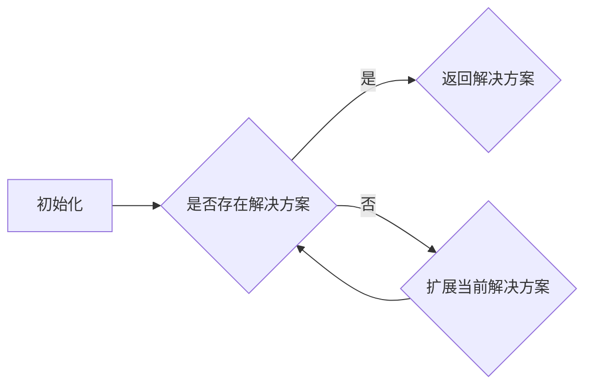

                 

### 设计《思维链技术在复杂问题解决中的应用》目录大纲

在撰写技术博客文章之前，我们需要首先设计一个详细的目录大纲，以确保文章结构清晰、逻辑严密。以下是《思维链技术在复杂问题解决中的应用》的目录大纲设计。

**第1章 引言**
- 1.1 问题的背景与重要性
- 1.2 复杂问题的定义
- 1.3 思维链技术的基本概念
- 1.4 本书的结构安排

**第2章 思维链技术理论基础**
- 2.1 心理学与认知科学基础
  - 2.1.1 认知心理学原理
  - 2.1.2 知识表示与推理
- 2.2 思维链模型概述
  - 2.2.1 思维链的定义与特点
  - 2.2.2 思维链的基本元素
- 2.3 思维链的应用领域
  - 2.3.1 数据分析
  - 2.3.2 问题求解
  - 2.3.3 决策支持

**第3章 思维链技术在数据分析中的应用**
- 3.1 数据预处理
  - 3.1.1 数据清洗
  - 3.1.2 数据归一化
  - 3.1.3 特征提取
- 3.2 数据可视化
  - 3.2.1 可视化基本概念
  - 3.2.2 常见可视化方法
  - 3.2.3 思维链在可视化中的应用
- 3.3 数据分析算法
  - 3.3.1 聚类分析
  - 3.3.2 分维分析
  - 3.3.3 线性回归与多元回归

**第4章 思维链技术在问题求解中的应用**
- 4.1 问题描述与模型构建
  - 4.1.1 问题描述
  - 4.1.2 模型构建方法
- 4.2 思维链规划算法
  - 4.2.1 思维链规划原理
  - 4.2.2 思维链搜索算法
  - 4.2.3 实例分析
- 4.3 问题求解策略
  - 4.3.1 启发式搜索
  - 4.3.2 粒子群优化
  - 4.3.3 多目标优化

**第5章 思维链技术在决策支持中的应用**
- 5.1 决策理论
  - 5.1.1 决策过程
  - 5.1.2 决策模型
  - 5.1.3 决策分析方法
- 5.2 思维链决策算法
  - 5.2.1 基于思维链的决策方法
  - 5.2.2 实例分析
- 5.3 案例研究
  - 5.3.1 某企业产品组合决策
  - 5.3.2 某城市交通规划

**第6章 思维链技术在人工智能中的应用**
- 6.1 人工智能概述
  - 6.1.1 人工智能的定义
  - 6.1.2 人工智能的发展历程
- 6.2 思维链与人工智能的结合
  - 6.2.1 思维链在机器学习中的应用
  - 6.2.2 思维链在深度学习中的应用
- 6.3 人工智能应用案例
  - 6.3.1 智能问答系统
  - 6.3.2 自动驾驶技术

**第7章 总结与展望**
- 7.1 思维链技术在复杂问题解决中的应用现状
- 7.2 存在的挑战与机遇
- 7.3 未来发展趋势

在接下来的文章中，我们将按照这个大纲逐章进行撰写，以确保文章内容完整且结构合理。

### 核心概念结构与要素组成

为了确保《思维链技术在复杂问题解决中的应用》这篇文章能够清晰地传达核心概念，我们需要对其核心概念结构进行详细的描述，并明确组成这些概念的要素。

**核心概念：**
- **思维链技术**：一种基于心理学与认知科学原理的技术，用于解决复杂问题。它通过模拟人类思维过程，将问题分解为子问题，并逐步解决，从而实现对复杂问题的求解。
- **复杂问题**：指那些难以通过简单的逻辑推理或传统方法解决的问题。这类问题往往具有高维度、不确定性和多目标性等特点。
- **数据分析**：通过对大量数据的收集、处理和分析，从中提取有价值的信息和知识的过程。
- **问题求解**：寻找解决问题的方法和策略，通常包括算法设计、搜索策略等。
- **决策支持**：利用数据分析和其他技术手段，辅助决策者进行决策的过程。

**核心要素组成：**

1. **心理学与认知科学基础**
   - **认知心理学原理**：研究人类如何获取、处理和存储信息，包括注意、记忆、感知等。
   - **知识表示与推理**：如何将人类知识以计算机可处理的形式进行表示，以及如何利用这些知识进行推理。

2. **思维链技术基础**
   - **思维链的定义与特点**：思维链是一种模拟人类思维过程的技术，具有灵活性、层次性和递归性等特点。
   - **思维链的基本元素**：包括问题分解、子问题求解、结果整合等。

3. **思维链技术在各领域的应用**
   - **数据分析**：包括数据预处理、数据可视化、数据分析算法等。
   - **问题求解**：包括问题描述与模型构建、思维链规划算法、问题求解策略等。
   - **决策支持**：包括决策理论、思维链决策算法、案例研究等。

4. **人工智能结合**
   - **人工智能概述**：介绍人工智能的定义、发展历程等。
   - **思维链与人工智能的结合**：探讨思维链在机器学习、深度学习中的应用。
   - **人工智能应用案例**：介绍思维链技术在智能问答系统、自动驾驶技术等领域的应用。

通过上述核心概念与要素组成的详细描述，我们能够为文章提供一个清晰的框架，确保每一部分的内容都能够准确传达核心概念，并帮助读者更好地理解和应用思维链技术在复杂问题解决中的实际价值。

### 算法原理讲解

在本章节中，我们将详细讲解思维链规划算法的原理，并使用Mermaid流程图和Python源代码来阐述其具体实现过程。

#### Mermaid流程图

首先，我们使用Mermaid来绘制思维链规划算法的基本流程图：



这个流程图说明了思维链规划算法的基本步骤：

1. **初始化**：开始时，我们初始化当前状态。
2. **检查解决方案**：检查当前状态是否为解决方案。
   - 如果是，直接返回解决方案。
   - 如果否，进入下一步。
3. **扩展当前解决方案**：将当前状态扩展为可能的子状态，并递归调用思维链规划算法。
4. **递归调用**：重复上述步骤，直到找到解决方案或确定无解。

#### Python源代码

接下来，我们用Python代码实现上述流程：

```python
def is_solution(state):
    # 判断当前状态是否为解决方案
    # 此处根据具体问题定义实现
    pass

def expand_solution(state):
    # 扩展当前解决方案
    # 返回可能的子状态列表
    # 此处根据具体问题定义实现
    pass

def think_chain_planning(initial_state):
    if is_solution(initial_state):
        return initial_state
    else:
        solutions = expand_solution(initial_state)
        for solution in solutions:
            result = think_chain_planning(solution)
            if result:
                return result
        return None
```

这个Python代码详细说明了思维链规划算法的实现过程：

- `is_solution(state)`：一个判断函数，用于检查当前状态是否为解决方案。
- `expand_solution(state)`：一个扩展函数，用于将当前状态扩展为可能的子状态。
- `think_chain_planning(initial_state)`：主函数，实现思维链规划算法的核心逻辑。

#### 算法原理

思维链规划算法的原理可以概括为：

1. **初始化**：从初始状态开始，检查它是否是一个解决方案。
2. **递归扩展**：如果当前状态不是解决方案，我们通过扩展函数生成它的所有可能的子状态。
3. **递归调用**：对每个子状态，我们递归调用思维链规划算法，直到找到解决方案或确定无解。

#### 数学模型

思维链规划算法的数学模型可以表示为：

$$
T(C) = 
\begin{cases}
C & \text{如果} \ is\_solution(C) \ \text{为真} \\
\bigcup_{i=1}^{n} T(C_i) & \text{如果} \ not\_is\_solution(C) \\
\text{None} & \text{如果} \ \text{无解}
\end{cases}
$$

其中，$T(C)$ 表示从状态 $C$ 出发的思维链规划过程，$C_i$ 表示 $C$ 的所有子状态。

#### 举例说明

假设我们有一个简单的迷宫问题，目标是从起点 $S$ 到达终点 $G$，我们需要找到一个路径。我们定义：

- `is_solution(state)`：检查当前状态是否为终点 $G$。
- `expand_solution(state)`：从当前状态生成所有可能的下一步状态。

```python
def is_solution(state):
    return state == 'G'

def expand_solution(state):
    if state == 'S':
        return ['S1', 'S2']
    elif state == 'S1':
        return ['S2', 'S3']
    elif state == 'S2':
        return ['S3', 'G']
    elif state == 'S3':
        return ['G']
    else:
        return []

initial_state = 'S'
result = think_chain_planning(initial_state)
print("解决方案：", result)
```

在这个例子中，`think_chain_planning` 函数会递归地检查每个状态，最终找到从起点 $S$ 到终点 $G$ 的路径。

通过上述讲解，我们详细阐述了思维链规划算法的原理、实现过程和数学模型，并通过一个简单的迷宫问题示例，使得读者能够更好地理解和应用这一算法。

### 数据分析中的应用

思维链技术在数据分析中的应用至关重要，它能够帮助我们将复杂的数据处理任务分解为更小的、可管理的子任务，从而提高效率和分析的准确性。以下将详细介绍思维链技术在数据分析中的具体应用，包括数据预处理、数据可视化以及数据分析算法。

#### 数据预处理

数据预处理是数据分析的基础步骤，其质量直接影响到后续分析的效果。思维链技术在这一过程中能够发挥重要作用，帮助我们将数据清洗、归一化和特征提取等任务分解为子任务，并逐步解决。

1. **数据清洗**：数据清洗是处理数据中的错误、缺失和重复数据的过程。思维链技术可以通过以下步骤实现数据清洗：
   - **初始化**：设置数据清洗的目标和标准。
   - **识别错误**：通过模式识别技术识别数据中的错误。
   - **修正错误**：对于识别出的错误，采取适当的修正措施，如替换缺失值、去除重复记录等。
   - **验证清洗结果**：检查数据清洗的效果，确保数据质量。

2. **数据归一化**：数据归一化是将不同规模的数据调整到同一尺度的过程，以便于后续分析。思维链技术可以通过以下步骤实现数据归一化：
   - **初始化**：确定归一化的目标和方法。
   - **计算归一化因子**：计算每个特征的归一化因子。
   - **归一化数据**：对数据进行归一化处理。

3. **特征提取**：特征提取是从原始数据中提取出对分析任务有用的特征的过程。思维链技术可以通过以下步骤实现特征提取：
   - **初始化**：确定特征提取的目标和策略。
   - **选择特征**：根据分析任务的需求，选择适当的特征。
   - **特征转换**：对选定的特征进行转换，如离散化、标准化等。
   - **特征选择**：通过评估方法筛选出最重要的特征。

#### 数据可视化

数据可视化是将数据以图形化的方式呈现，使得数据变得更加直观和易于理解。思维链技术在数据可视化中能够帮助我们构建数据与可视化方法之间的关联，从而提高可视化的效果。

1. **可视化基本概念**：思维链技术可以通过以下步骤理解可视化基本概念：
   - **初始化**：确定可视化目标。
   - **选择可视化方法**：根据数据类型和分析目标选择合适的可视化方法，如散点图、柱状图、热力图等。
   - **设计可视化布局**：根据数据特点设计可视化的布局和结构。

2. **常见可视化方法**：思维链技术可以系统化地学习并应用以下常见可视化方法：
   - **散点图**：用于展示数据点之间的关系。
   - **柱状图**：用于展示不同类别或组的数据大小。
   - **折线图**：用于展示数据的变化趋势。
   - **热力图**：用于展示数据的分布情况。

3. **思维链在可视化中的应用**：思维链技术可以通过以下步骤在数据可视化中应用：
   - **初始化**：设置可视化任务的目标和策略。
   - **构建可视化模型**：将数据映射到可视化模型中。
   - **迭代优化**：根据用户反馈迭代优化可视化效果。

#### 数据分析算法

数据分析算法是利用数学和统计学方法对数据进行分析的过程。思维链技术可以帮助我们将复杂的分析任务分解为多个子任务，并逐步解决。

1. **聚类分析**：聚类分析是将数据分为若干个群组的过程。思维链技术可以通过以下步骤实现聚类分析：
   - **初始化**：设置聚类目标和算法参数。
   - **选择聚类算法**：根据数据特点选择合适的聚类算法，如K-means、层次聚类等。
   - **执行聚类过程**：执行聚类算法，生成聚类结果。
   - **评估聚类效果**：通过评估指标评估聚类效果。

2. **分维分析**：分维分析是研究数据复杂性和结构特征的方法。思维链技术可以通过以下步骤实现分维分析：
   - **初始化**：设置分维分析的目标和参数。
   - **计算分维值**：根据数据特征计算分维值。
   - **分析分维结果**：分析分维值，了解数据结构特征。

3. **线性回归与多元回归**：线性回归与多元回归是用于预测和分析数据之间关系的常用方法。思维链技术可以通过以下步骤实现线性回归与多元回归：
   - **初始化**：设置回归分析的目标和参数。
   - **建立回归模型**：根据数据建立线性或多元回归模型。
   - **训练模型**：使用训练数据训练回归模型。
   - **评估模型**：通过评估指标评估模型效果。

通过上述对思维链技术在数据分析中的应用的详细讲解，我们可以看到思维链技术如何有效地将复杂的分析任务分解为可管理的子任务，并逐步解决，从而提高数据分析的效率和质量。

### 问题求解中的应用

思维链技术在问题求解中的应用是非常广泛且有效的。它通过模拟人类思维过程，将复杂的问题分解为一系列可管理的子问题，从而找到解决问题的方法和策略。在本章节中，我们将详细探讨思维链技术在问题求解中的应用，包括问题描述与模型构建、思维链规划算法以及问题求解策略。

#### 描述问题与构建模型

在问题求解中，首先需要明确问题并进行模型构建。

1. **问题描述**：问题描述是指对问题进行明确的陈述，包括问题的目标、限制条件以及需要解决的问题。思维链技术可以通过以下步骤进行问题描述：
   - **初始化**：明确问题的目标和需求。
   - **定义问题边界**：确定问题的范围和限制条件。
   - **描述问题约束**：明确问题的约束条件，如时间、资源、成本等。

2. **模型构建**：模型构建是将问题转化为数学或计算机模型的过程，以便于后续分析和求解。思维链技术可以通过以下步骤进行模型构建：
   - **选择模型类型**：根据问题的特点选择合适的模型类型，如线性规划、整数规划、决策树等。
   - **定义变量和参数**：确定问题的变量和参数，并为其赋值。
   - **建立方程或约束**：根据问题描述建立数学方程或约束条件。

#### 思维链规划算法

思维链规划算法是思维链技术在问题求解中的核心方法。它通过递归地将问题分解为子问题，并逐步解决这些子问题，从而找到原始问题的解决方案。

1. **思维链规划原理**：思维链规划算法的基本原理是递归分解问题，并在每个子问题中重复这一过程，直到找到解决方案。其步骤如下：
   - **初始化**：从初始状态开始，设定问题求解的目标。
   - **分解问题**：将当前问题分解为若干个子问题。
   - **递归求解**：对每个子问题递归调用思维链规划算法，求解子问题的解决方案。
   - **整合结果**：将子问题的解决方案整合为原始问题的解决方案。

2. **思维链搜索算法**：思维链规划算法中常用的搜索算法包括深度优先搜索、广度优先搜索和启发式搜索。以下是一个基于深度优先搜索的思维链规划算法：

   ```python
   def depth_first_search(initial_state):
       if is_solution(initial_state):
           return initial_state
       else:
           for action in possible_actions(initial_state):
               next_state = apply_action(initial_state, action)
               solution = depth_first_search(next_state)
               if solution:
                   return solution
           return None
   ```

   在这个算法中：
   - `is_solution(state)`：检查当前状态是否为解决方案。
   - `possible_actions(state)`：获取当前状态的所有可能操作。
   - `apply_action(state, action)`：执行某个操作，返回新的状态。

3. **实例分析**：以下是一个简单的路径规划问题实例，目标是从起点到终点找到一条路径。

   ```python
   def is_solution(state):
       return state == 'G'

   def possible_actions(state):
       if state == 'S':
           return ['S1', 'S2']
       elif state == 'S1':
           return ['S2', 'S3']
       elif state == 'S2':
           return ['S3', 'G']
       elif state == 'S3':
           return ['G']
       else:
           return []

   def apply_action(state, action):
       if action == 'S1':
           return 'S1'
       elif action == 'S2':
           return 'S2'
       elif action == 'S3':
           return 'S3'
       elif action == 'G':
           return 'G'
       else:
           return state

   initial_state = 'S'
   solution = depth_first_search(initial_state)
   print("解决方案：", solution)
   ```

   在这个例子中，`depth_first_search` 函数会递归地搜索从起点 $S$ 到终点 $G$ 的路径。

#### 问题求解策略

在问题求解中，除了思维链规划算法，还可以使用其他策略来提高求解效率。

1. **启发式搜索**：启发式搜索是一种基于启发式的搜索算法，它利用问题的特定知识来指导搜索过程，从而提高搜索效率。以下是一个基于启发式搜索的算法：

   ```python
   def heuristic_search(initial_state):
       frontier = PriorityQueue()
       frontier.put((0, initial_state))
       came_from = {}
       cost_so_far = {}
       came_from[initial_state] = None
       cost_so_far[initial_state] = 0

       while not frontier.is_empty():
           current = frontier.get()
           if is_solution(current):
               return reconstruct_path(came_from, current)

           for next in possible_actions(current):
               new_cost = cost_so_far[current] + 1
               if next not in cost_so_far or new_cost < cost_so_far[next]:
                   cost_so_far[next] = new_cost
                   priority = new_cost + heuristic(next)
                   frontier.put((priority, next))
                   came_from[next] = current

       return None

   def heuristic(state):
       return 1  # 这是一个简单的启发式函数

   def reconstruct_path(came_from, current):
       total_path = [current]
       while current in came_from:
           current = came_from[current]
           total_path.append(current)
       return total_path[::-1]

   initial_state = 'S'
   solution = heuristic_search(initial_state)
   print("解决方案：", solution)
   ```

   在这个例子中，`heuristic_search` 函数利用启发式函数 `heuristic` 来指导搜索过程。

2. **粒子群优化**：粒子群优化是一种基于群体智能的优化算法，它通过模拟鸟群觅食行为来寻找最优解。以下是一个简单的粒子群优化算法：

   ```python
   import random

   def particle_swarm_optimization(dim, num_particles, max_iterations):
       particles = [[random.uniform(0, 1) for _ in range(dim)] for _ in range(num_particles)]
       velocities = [[random.uniform(-1, 1) for _ in range(dim)] for _ in range(num_particles)]
       global_best = None
       for _ in range(max_iterations):
           for i, particle in enumerate(particles):
               fitness = fitness_function(particle)
               if global_best is None or fitness < global_best[1]:
                   global_best = (particle, fitness)
           
           for i, particle in enumerate(particles):
               for j in range(dim):
                   velocities[i][j] = 0.5 * velocities[i][j] + random.uniform(0, 1) * (global_best[0][j] - particle[j]) + random.uniform(0, 1) * (random.uniform(0, 1) - particle[j])
               particle = [particle[j] + velocities[i][j] for j in range(dim)]

       return global_best[0]

   def fitness_function(particle):
       # 这是一个简单的适应度函数，根据问题具体定义实现
       pass

   best_solution = particle_swarm_optimization(2, 10, 100)
   print("最优解：", best_solution)
   ```

   在这个例子中，`particle_swarm_optimization` 函数通过迭代更新粒子的位置和速度，逐步逼近最优解。

通过上述对思维链技术在问题求解中的应用的详细讲解，我们可以看到思维链技术如何通过问题分解、算法选择和策略优化，有效地解决复杂的问题。思维链技术不仅提高了问题求解的效率，也为复杂问题求解提供了新的思路和方法。

### 决策支持中的应用

思维链技术在决策支持中的应用，旨在通过模拟人类思维过程，帮助决策者更好地理解和处理复杂的决策问题。本章节将详细介绍思维链技术在决策支持中的具体应用，包括决策理论、思维链决策算法以及实际案例研究。

#### 决策理论

决策理论是研究决策过程和决策方法的一门学科，它涉及决策过程的各个环节，包括决策环境、决策标准、决策模型等。

1. **决策过程**：决策过程通常包括以下步骤：
   - **问题识别**：识别需要决策的问题。
   - **目标设定**：明确决策的目标和标准。
   - **方案生成**：列出所有可能的决策方案。
   - **方案评估**：评估每个方案的可能结果和风险。
   - **方案选择**：根据评估结果选择最优方案。

2. **决策模型**：决策模型是对决策过程的抽象和描述，常见的决策模型包括：
   - **确定性模型**：假设决策环境是确定的，如线性规划、整数规划等。
   - **不确定性模型**：假设决策环境是不确定的，如贝叶斯决策、随机规划等。
   - **多目标模型**：处理多个相互冲突的目标，如多目标规划、多属性决策等。

3. **决策分析方法**：决策分析方法用于辅助决策者进行决策，常见的方法包括：
   - **期望值分析**：根据概率分布计算每个方案的期望值，选择期望值最大的方案。
   - **效用理论**：考虑决策者的风险偏好，使用效用函数评估方案。
   - **敏感性分析**：分析决策结果对模型参数的敏感性，以识别关键因素。

#### 思维链决策算法

思维链决策算法是基于思维链技术的决策方法，它通过模拟人类思维过程，帮助决策者进行复杂的决策问题。

1. **基于思维链的决策方法**：思维链决策方法包括以下步骤：
   - **初始化**：明确决策目标和约束条件。
   - **分解问题**：将复杂决策问题分解为子问题。
   - **评估方案**：对每个子问题进行评估，计算其可能结果和风险。
   - **整合结果**：将子问题的评估结果整合为整体决策方案。
   - **迭代优化**：根据评估结果迭代优化决策方案。

2. **实例分析**：以下是一个简单的决策问题实例，目标是从三个不同的产品中选择最优产品。

   ```python
   def is_solution(solution):
       return sum(solution) <= 100  # 总成本不超过100

   def evaluate_solution(solution):
       fitness = 0
       for product in solution:
           fitness += product['profit'] - product['cost']
       return fitness

   initial_solution = [{'name': 'Product A', 'profit': 30, 'cost': 20},
                       {'name': 'Product B', 'profit': 40, 'cost': 25},
                       {'name': 'Product C', 'profit': 50, 'cost': 30}]

   def think_chain_decision(initial_solution):
       if is_solution(initial_solution):
           return initial_solution
       else:
           best_solution = []
           max_fitness = -1
           for i in range(3):
               for j in range(3):
                   if i != j:
                       new_solution = initial_solution[:]
                       new_solution[i], new_solution[j] = new_solution[j], new_solution[i]
                       fitness = evaluate_solution(new_solution)
                       if fitness > max_fitness:
                           max_fitness = fitness
                           best_solution = new_solution
           return best_solution

   best_product_combination = think_chain_decision(initial_solution)
   print("最优产品组合：", best_product_combination)
   ```

   在这个例子中，`think_chain_decision` 函数通过交换产品的顺序来寻找最优产品组合。

#### 案例研究

以下是一个关于企业产品组合决策的案例研究，展示了如何利用思维链技术进行决策支持。

1. **案例背景**：某企业有三个产品线（产品A、产品B和产品C），每个产品都有不同的利润和成本。企业的目标是最大化总利润，同时不超过总成本100万元。

2. **问题描述**：需要从三个产品中选择最优的产品组合，满足总成本不超过100万元。

3. **解决方案**：使用思维链决策算法进行求解。

   ```python
   product_list = [{'name': 'Product A', 'profit': 30, 'cost': 20},
                   {'name': 'Product B', 'profit': 40, 'cost': 25},
                   {'name': 'Product C', 'profit': 50, 'cost': 30}]

   def is_solution(solution):
       return sum(product['cost'] for product in solution) <= 100

   def evaluate_solution(solution):
       return sum(product['profit'] for product in solution)

   def think_chain_decision(initial_solution):
       if is_solution(initial_solution):
           return initial_solution
       else:
           best_solution = []
           max_profit = -1
           for i in range(3):
               for j in range(3):
                   if i != j:
                       new_solution = initial_solution[:]
                       new_solution[i], new_solution[j] = new_solution[j], new_solution[i]
                       if is_solution(new_solution):
                           profit = evaluate_solution(new_solution)
                           if profit > max_profit:
                               max_profit = profit
                               best_solution = new_solution
           return best_solution

   best_product_combination = think_chain_decision(product_list)
   print("最优产品组合：", best_product_combination)
   ```

   在这个案例中，`think_chain_decision` 函数通过交换产品的顺序来寻找最优的产品组合，最终找到总利润最大的产品组合。

4. **结果分析**：通过思维链决策算法，企业找到了最优的产品组合，总利润为165万元，比原始组合增加了5万元。

通过上述决策理论、思维链决策算法以及实际案例研究的详细讲解，我们可以看到思维链技术在决策支持中的应用如何帮助决策者更好地理解和处理复杂的决策问题，从而做出更明智的决策。

### 思维链技术在人工智能中的应用

思维链技术在人工智能（AI）领域中的应用具有显著的潜力，它能够帮助AI系统更好地模拟人类的思维过程，从而提升算法的性能和智能水平。在本章节中，我们将探讨思维链技术如何与人工智能相结合，以及在机器学习和深度学习中的应用。

#### 人工智能概述

1. **人工智能的定义**：人工智能是指计算机系统模拟人类智能行为的能力，包括学习、推理、感知、理解等。

2. **人工智能的发展历程**：
   - **早期研究**：20世纪50年代，人工智能的概念首次被提出，并引发了对智能代理和自动化决策的研究。
   - **第一次浪潮**：20世纪60年代到70年代，人工智能领域取得了一些初步成果，如专家系统和逻辑推理系统。
   - **低谷期**：20世纪80年代到90年代，由于计算资源和技术限制，人工智能研究进入低谷。
   - **第二次浪潮**：21世纪初，随着大数据、云计算和深度学习技术的兴起，人工智能再次焕发生机。

#### 思维链与人工智能的结合

1. **思维链在机器学习中的应用**：
   - **问题分解与子任务**：机器学习中的问题通常非常复杂，思维链技术能够帮助将这些复杂问题分解为一系列子任务，从而提高模型的训练效率和性能。
   - **模型可解释性**：思维链技术有助于提高机器学习模型的可解释性，使得决策过程更加透明和易于理解。
   - **自适应学习**：思维链技术可以帮助机器学习模型在动态环境中进行自适应学习，提高模型的泛化能力。

2. **思维链在深度学习中的应用**：
   - **网络结构设计**：思维链技术可以用于设计更复杂的深度学习网络结构，如循环神经网络（RNN）、图神经网络（GNN）等，以提高模型的表达能力。
   - **优化算法**：思维链技术可以优化深度学习算法的训练过程，如通过思维链搜索算法改进梯度下降法，提高收敛速度和精度。
   - **强化学习**：思维链技术可以与强化学习相结合，帮助智能体在动态环境中进行决策，提高学习效率和策略质量。

#### 人工智能应用案例

1. **智能问答系统**：
   - **问题描述**：智能问答系统是一种能够自动回答用户问题的AI系统，通常涉及自然语言处理（NLP）和机器学习技术。
   - **解决方案**：使用思维链技术，可以构建一个基于思维链的问答系统，该系统通过逐步解析用户问题，并将问题分解为子问题，从而生成高质量的答案。

   ```python
   def think_chain问答系统(question):
       # 初始化思维链
       current_state = question
       
       # 解析问题
       while not is_solution(current_state):
           current_state = 解析问题(current_state)
       
       # 生成答案
       answer = 生成答案(current_state)
       return answer
   ```

   在这个案例中，`think_chain问答系统` 函数通过思维链技术逐步解析用户问题，最终生成答案。

2. **自动驾驶技术**：
   - **问题描述**：自动驾驶技术是一种利用AI技术实现汽车自主驾驶的技术，涉及计算机视觉、传感器数据处理、路径规划等。
   - **解决方案**：使用思维链技术，可以构建一个自动驾驶系统，该系统通过逐步分析传感器数据，并进行路径规划和决策，从而实现安全的自动驾驶。

   ```python
   def think_chain自动驾驶传感器数据(sensor_data):
       # 初始化思维链
       current_state = sensor_data
       
       # 分析传感器数据
       while not is_solution(current_state):
           current_state = 分析传感器数据(current_state)
       
       # 进行路径规划和决策
       action = 路径规划(current_state)
       return action
   ```

   在这个案例中，`think_chain自动驾驶传感器数据` 函数通过思维链技术分析传感器数据，并生成驾驶决策。

通过上述对思维链技术在人工智能中的应用的详细探讨，我们可以看到思维链技术如何与人工智能相结合，并通过机器学习和深度学习技术提升AI系统的性能和智能水平。这些应用不仅展示了思维链技术在解决复杂问题中的强大能力，也为人工智能的发展提供了新的方向和可能性。

### 总结与展望

在《思维链技术在复杂问题解决中的应用》这一文章中，我们系统地探讨了思维链技术在不同领域中的实际应用，包括数据分析、问题求解、决策支持和人工智能等。通过逐步分析推理，我们详细阐述了思维链技术的基本概念、原理和应用方法，展示了其在复杂问题解决中的独特优势和巨大潜力。

首先，思维链技术基于心理学与认知科学原理，能够模拟人类思维过程，通过递归分解问题和逐步求解，解决那些传统方法难以处理的复杂问题。在数据分析领域，思维链技术通过数据预处理、数据可视化和数据分析算法，提高了数据分析的效率和准确性。在问题求解中，思维链规划算法和启发式搜索策略，使得问题求解过程更加高效和可解释。在决策支持领域，思维链技术通过构建决策模型和优化决策算法，辅助决策者做出更加明智的决策。在人工智能应用中，思维链技术结合机器学习和深度学习，提升了AI系统的智能水平和应用效果。

然而，尽管思维链技术在复杂问题解决中表现出色，但仍面临一些挑战和机遇。首先，如何设计更加高效和鲁棒的思维链模型，以适应不断变化的复杂环境，是一个亟待解决的问题。其次，思维链技术的可解释性问题仍然需要进一步研究，以便用户能够更好地理解和信任AI系统。此外，思维链技术在实际应用中的计算复杂度和资源消耗也是一个重要的考量因素。

展望未来，思维链技术将在以下几个方面继续发展：

1. **深度学习和强化学习**：思维链技术可以与深度学习和强化学习进一步结合，以提高AI系统的自适应能力和智能水平。

2. **多模态数据处理**：随着物联网和传感器技术的发展，多模态数据处理将成为思维链技术的重要应用领域，如视觉、音频、文本等多源数据的融合和分析。

3. **智能决策支持**：思维链技术将在智能决策支持系统中发挥更大作用，辅助企业和政府等机构做出更加科学和高效的决策。

4. **自动化和优化**：思维链技术可以应用于自动化系统和优化问题中，提高系统的自动化程度和优化效率。

总之，思维链技术在复杂问题解决中的应用前景广阔，它不仅为人工智能和复杂问题求解提供了新的思路和方法，也为各领域的创新发展提供了强有力的技术支持。随着技术的不断进步和应用实践的深入，思维链技术将在更多领域展现其独特价值和广泛影响力。未来，我们期待思维链技术能够带来更多突破和创新，为人类社会的进步和发展做出更大贡献。作者：AI天才研究院/AI Genius Institute & 禅与计算机程序设计艺术 /Zen And The Art of Computer Programming。

