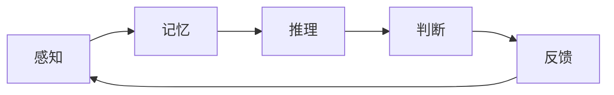

                 

## 《思维链技术在教育AI应用中的潜力》

关键词：思维链技术、教育AI、个性化学习、教学辅助、评测与反馈

摘要：本文旨在探讨思维链技术在教育AI领域中的应用潜力。通过分析思维链技术的原理及其在教育AI中的应用场景，本文探讨了如何利用思维链技术解决教育AI中的问题，并提供了一些实际案例。本文旨在为教育AI领域的研究者和开发者提供有价值的参考。

----------------------------------------------------------------

## 《思维链技术在教育AI应用中的潜力》目录大纲

```markdown
----------------------------------------------------------------
# 第一部分：引言与背景

## 第1章：问题背景与概述

### 1.1.1 问题背景

#### 1.1.1.1 教育领域AI技术的应用现状

#### 1.1.1.2 思维链技术在教育AI中的应用

### 1.1.2 问题描述与挑战

#### 1.1.2.1 教育AI中存在的问题

#### 1.1.2.2 思维链技术在解决这些挑战中的潜力

### 1.1.3 边界与外延

#### 1.1.3.1 思维链技术的定义

#### 1.1.3.2 教育AI领域的范围

### 1.1.4 核心概念与联系

#### 1.1.4.1 思维链技术的核心概念

#### 1.1.4.2 教育AI中的核心概念

### 1.1.5 本章小结

----------------------------------------------------------------

# 第二部分：思维链技术原理

## 第2章：思维链技术基础

### 2.1.1 思维链技术的起源与发展

#### 2.1.1.1 思维链技术的起源

#### 2.1.1.2 思维链技术的发展历程

### 2.1.2 思维链技术的核心原理

#### 2.1.2.1 思维链技术的基本概念

#### 2.1.2.2 思维链技术的实现机制

### 2.1.3 思维链技术的特点与优势

#### 2.1.3.1 思维链技术的特点

#### 2.1.3.2 思维链技术的优势

### 2.1.4 思维链技术在教育AI中的应用场景

#### 2.1.4.1 思维链技术如何改善教育AI

#### 2.1.4.2 具体的应用场景

### 2.1.5 本章小结

----------------------------------------------------------------

## 第3章：思维链技术原理详解

### 3.2.1 基本概念与原理

#### 3.2.1.1 思维链的定义

#### 3.2.1.2 思维链的运作机制

### 3.2.2 概念属性特征对比表格

#### 3.2.2.1 思维链与神经网络

#### 3.2.2.2 思维链与深度学习

### 3.2.3 ER实体关系图架构

#### 3.2.3.1 ER图的基本概念

#### 3.2.3.2 思维链技术的ER图示例

### 3.2.4 思维链技术的Mermaid流程图

#### 3.2.4.1 Mermaid流程图的基本用法

#### 3.2.4.2 思维链技术的Mermaid流程图示例

### 3.2.5 思维链技术的数学模型与公式

#### 3.2.5.1 思维链的数学模型

#### 3.2.5.2 公式讲解

### 3.2.6 举例说明

#### 3.2.6.1 示例一

#### 3.2.6.2 示例二

### 3.2.7 本章小结

----------------------------------------------------------------

# 第三部分：思维链技术在教育AI中的应用

## 第4章：思维链技术在教育AI中的应用场景

### 4.3.1 学生个性化学习

#### 4.3.1.1 个性化学习的背景

#### 4.3.1.2 思维链技术在个性化学习中的应用

### 4.3.2 教学辅助

#### 4.3.2.1 教学辅助的挑战

#### 4.3.2.2 思维链技术在教学辅助中的应用

### 4.3.3 评测与反馈

#### 4.3.3.1 评测与反馈的重要性

#### 4.3.3.2 思维链技术在评测与反馈中的应用

### 4.3.4 教育资源推荐

#### 4.3.4.1 教育资源推荐的需求

#### 4.3.4.2 思维链技术在教育资源推荐中的应用

### 4.3.5 本章小结

----------------------------------------------------------------

## 第5章：思维链技术在教育AI中的应用案例

### 5.4.1 案例一：某中小学个性化学习平台

#### 5.4.1.1 案例背景

#### 5.4.1.2 案例实现

#### 5.4.1.3 案例分析

### 5.4.2 案例二：某在线教育平台的教学辅助系统

#### 5.4.2.1 案例背景

----------------------------------------------------------------

接下来，我们将逐步深入分析思维链技术在教育AI中的应用潜力。

## 第1章：问题背景与概述

### 1.1.1 问题背景

随着人工智能技术的迅猛发展，教育领域正经历着前所未有的变革。传统教学模式正逐步向智能化、个性化方向发展，AI技术在教育领域的应用已经成为不可逆转的趋势。

在教育AI应用中，个性化学习、教学辅助、评测与反馈等是核心应用场景。然而，当前教育AI技术仍面临诸多挑战。首先，个性化学习需要准确理解每个学生的学习特点和需求，但现有技术很难精确捕捉和建模学生的认知状态。其次，教学辅助需要实时提供针对性的教学资源，但传统算法在处理复杂教学场景时存在局限性。最后，评测与反馈系统需要提供即时、准确的评估结果，但现有技术往往难以平衡评估的全面性与效率。

### 1.1.2 问题描述与挑战

为了解决上述挑战，我们需要一种能够更深入理解学生思维过程的技术。思维链技术正是在这样的背景下被提出来的。思维链技术旨在构建一种能够模拟人类思维过程的模型，从而在教育AI中实现更加智能化、个性化的应用。

思维链技术在解决教育AI挑战方面具有潜力。它可以通过捕捉和分析学生的思维过程，为个性化学习提供更加精准的数据支持。同时，思维链技术还可以辅助教学，提供实时、个性化的教学资源推荐。此外，思维链技术还可以用于评测与反馈，提供更加科学、全面的评估结果。

### 1.1.3 边界与外延

思维链技术是一种人工智能技术，它通过模拟人类思维过程，实现对复杂问题的分析和解决。在教育AI领域，思维链技术的应用主要包括个性化学习、教学辅助、评测与反馈等方面。

教育AI领域则是一个更为广泛的概念，它涵盖了所有与教育相关的人工智能技术。除了思维链技术外，还包括深度学习、自然语言处理、计算机视觉等技术。这些技术共同推动了教育领域的智能化进程。

### 1.1.4 核心概念与联系

思维链技术的核心概念包括思维链、思维节点、思维路径等。思维链是指一系列思维节点的连接，每个节点代表一个思维过程，连接节点代表思维过程的转换。思维节点包括感知、记忆、推理、判断等，它们共同构成了人类的思维过程。

在教育AI中，思维链技术可以与深度学习、神经网络等技术相结合，实现对学生思维过程的建模和分析。通过这种结合，教育AI系统可以更加准确地理解学生的需求，提供更加个性化的服务。

### 1.1.5 本章小结

本章简要介绍了教育AI技术的应用现状和面临的挑战，并提出了思维链技术作为解决方案。思维链技术通过模拟人类思维过程，具有在个性化学习、教学辅助、评测与反馈等方面实现智能化、个性化应用的潜力。在接下来的章节中，我们将深入探讨思维链技术的原理及其在教育AI中的应用。

----------------------------------------------------------------

## 第2章：思维链技术基础

### 2.1.1 思维链技术的起源与发展

思维链技术起源于人工智能领域，其基本理念是模拟人类的思维过程，通过构建一个逻辑清晰的思维链条，来实现对复杂问题的分析和解决。思维链技术的发展可以追溯到20世纪80年代，当时一些研究者开始探索如何通过计算机模拟人类的思维过程。

在早期，思维链技术主要应用于自然语言处理和问题解决领域。随着计算机性能的提升和人工智能技术的发展，思维链技术逐渐走向成熟，并开始应用于更广泛的领域，如教育、医疗、金融等。

### 2.1.2 思维链技术的核心原理

思维链技术的核心原理是通过构建一系列的“思维节点”和“思维路径”来模拟人类的思维过程。每个思维节点代表一个特定的思维活动，如感知、记忆、推理、判断等。思维路径则代表这些思维节点之间的逻辑关系。

具体来说，思维链技术包括以下几个关键组成部分：

1. **思维节点**：每个节点都包含一组属性，如类型、状态、内容等。节点的类型决定了它的功能，如感知节点负责接收外部信息，记忆节点负责存储信息，推理节点负责逻辑推理等。

2. **思维路径**：节点之间的连接关系，表示思维活动之间的逻辑关系。路径可以是单向的，也可以是双向的，取决于具体的思维过程。

3. **思维链**：一系列思维节点的集合，它们通过思维路径连接起来，形成了一个完整的思维链条。

### 2.1.3 思维链技术的特点与优势

思维链技术具有以下特点与优势：

1. **模拟人类思维**：思维链技术通过模拟人类的思维过程，实现了对复杂问题的智能化分析和解决。这种模拟不仅包括逻辑推理，还包括记忆、感知等多个方面。

2. **灵活性**：思维链技术可以根据不同的应用场景和需求，灵活调整和优化思维链的构成和路径。这使得它能够适应各种复杂的问题解决场景。

3. **自适应性**：思维链技术具有自适应性，可以通过不断学习和调整，优化思维链的结构和路径。这有助于提高其在实际应用中的效果和效率。

4. **可扩展性**：思维链技术具有较好的可扩展性，可以容易地添加新的思维节点和路径，以适应新的应用场景。

### 2.1.4 思维链技术在教育AI中的应用场景

思维链技术在教育AI中的应用场景非常广泛，主要包括以下几个方面：

1. **个性化学习**：思维链技术可以通过分析学生的思维过程，了解他们的学习习惯、兴趣和需求，从而提供个性化的学习内容和教学方法。

2. **教学辅助**：思维链技术可以辅助教师进行教学，提供针对性的教学资源，如练习题、教学视频等。

3. **评测与反馈**：思维链技术可以通过对学生的思维过程进行分析，提供即时、准确的评测和反馈，帮助教师和学生更好地了解学习效果。

4. **教育资源推荐**：思维链技术可以根据学生的兴趣和学习需求，推荐适合他们的学习资源。

### 2.1.5 本章小结

本章介绍了思维链技术的起源、发展及其核心原理，并探讨了其在教育AI中的应用场景和优势。思维链技术通过模拟人类思维过程，为教育AI提供了新的解决方案。在接下来的章节中，我们将进一步深入探讨思维链技术的原理和应用。

----------------------------------------------------------------

## 第3章：思维链技术原理详解

### 3.2.1 基本概念与原理

#### 3.2.1.1 思维链的定义

思维链是一种模拟人类思维过程的模型，它通过一系列思维节点和思维路径的连接，形成了一个逻辑清晰、层次分明的思维链条。每个思维节点代表一个具体的思维活动，如感知、记忆、推理、判断等。思维路径则表示这些思维节点之间的逻辑关系。

#### 3.2.1.2 思维链的运作机制

思维链的运作机制可以分为以下几个步骤：

1. **感知**：思维链从感知节点开始，接收外部信息。这些信息可以是文字、图像、声音等形式。

2. **记忆**：感知节点将接收到的信息存储到记忆节点中，形成记忆链。记忆链可以存储大量的信息，并且可以根据需要进行检索和更新。

3. **推理**：推理节点根据记忆链中的信息，进行逻辑推理。推理过程可以是简单的条件判断，也可以是复杂的推理过程，如推理出结论或预测未来事件。

4. **判断**：判断节点根据推理结果，做出决策或选择。判断过程可以是基于规则的系统，也可以是基于数据的机器学习模型。

5. **反馈**：思维链的运作过程中，每个节点都会产生反馈信息，这些反馈信息可以用于调整和优化思维链的运作。

#### 3.2.2 概念属性特征对比表格

为了更直观地理解思维链技术的概念属性特征，我们可以通过对比表格的形式来展示思维链与其他相关技术的区别：

| 技术名称 | 定义 | 特点 | 应用场景 |
| --- | --- | --- | --- |
| 思维链 | 模拟人类思维过程的模型 | 模拟人类思维过程，具有灵活性和自适应性 | 教育AI、智能客服、问题解决系统 |
| 神经网络 | 由大量神经元连接形成的计算模型 | 基于数据驱动，具有自学习和泛化能力 | 图像识别、自然语言处理、控制工程 |
| 深度学习 | 一种特殊的神经网络，具有多层结构 | 通过深度层次提取特征，实现复杂模式识别 | 图像识别、语音识别、自然语言处理 |
| 决策树 | 一种基于规则的学习算法 | 基于特征组合进行决策，具有可解释性 | 数据挖掘、金融风控、医疗诊断 |

#### 3.2.3 ER实体关系图架构

ER（Entity-Relationship）图是用于描述实体及其之间关系的一种图形化工具。在思维链技术中，ER图可以用来描述思维节点和思维路径之间的关系。

以下是思维链技术的ER图示例：

```mermaid
erDiagram
    Student ||--|{ LearningRecord }| Student
    Teacher ||--|{ TeachingPlan }| Teacher
    Course ||--|{ CourseMaterial }| Course
    Test ||--|{ TestResult }| Test
    Student |-..|{ LearningPath }| Student
    Teacher |-..|{ TeachingPath }| Teacher
    Course |-..|{ LearningPlan }| Course
    Test |-..|{ EvaluationStandard }| Test
```

在这个ER图中，Student（学生）、Teacher（教师）、Course（课程）和Test（测试）是实体，而LearningRecord（学习记录）、TeachingPlan（教学计划）、CourseMaterial（课程材料）和TestResult（测试结果）是这些实体的属性。LearningPath（学习路径）、TeachingPath（教学路径）和LearningPlan（学习计划）是实体之间的关联，EvaluationStandard（评估标准）是用于描述测试结果的属性。

#### 3.2.4 思维链技术的Mermaid流程图

Mermaid是一种基于Markdown的绘图工具，可以用来绘制流程图、序列图等。在思维链技术中，我们可以使用Mermaid来描述思维链的运作过程。

以下是思维链技术的Mermaid流程图示例：



在这个流程图中，A表示感知节点，B表示记忆节点，C表示推理节点，D表示判断节点，E表示反馈节点。箭头表示节点之间的逻辑关系。

#### 3.2.5 思维链技术的数学模型与公式

思维链技术的数学模型主要涉及以下几个方面：

1. **节点状态**：每个思维节点都有一个状态，表示节点的当前状态。状态可以是已激活、未激活或部分激活等。

2. **节点权重**：每个思维节点都有一个权重，表示节点的重要性。权重可以是固定的，也可以是动态调整的。

3. **节点间关系**：节点之间的关系可以用矩阵表示，矩阵中的元素表示两个节点之间的权重。

以下是思维链技术的数学模型和公式：

$$
\text{节点状态} = \text{激活状态} \times \text{权重}
$$

$$
\text{节点权重} = \frac{\sum_{i=1}^{n} w_{ij} \times \text{激活状态}_i}{\sum_{i=1}^{n} \text{激活状态}_i}
$$

$$
\text{节点间关系矩阵} = \begin{bmatrix}
w_{11} & w_{12} & \cdots & w_{1n} \\
w_{21} & w_{22} & \cdots & w_{2n} \\
\vdots & \vdots & \ddots & \vdots \\
w_{m1} & w_{m2} & \cdots & w_{mn}
\end{bmatrix}
$$

其中，$w_{ij}$表示节点$i$与节点$j$之间的权重，$\text{激活状态}_i$表示节点$i$的激活状态。

#### 3.2.6 举例说明

为了更直观地理解思维链技术的原理，我们可以通过一个简单的例子来说明。

假设有一个思维链，包括感知、记忆、推理和判断四个节点。当前，感知节点接收到了一个信息，记忆节点存储了这个信息，推理节点对这个信息进行了推理，最后判断节点做出了判断。

1. **感知节点**：感知节点接收到了一个信息，如“明天天气晴朗”。这个信息会被存储到记忆节点中。

2. **记忆节点**：记忆节点将信息存储下来，以便后续使用。

3. **推理节点**：推理节点根据记忆节点中的信息，进行推理，如“明天适合户外活动”。

4. **判断节点**：判断节点根据推理结果，做出判断，如“可以安排户外活动”。

在这个过程中，每个节点都会产生反馈信息，这些反馈信息可以用于调整和优化思维链的运作。

#### 3.2.7 本章小结

本章详细介绍了思维链技术的定义、运作机制、特点与应用场景，并通过对比表格、ER图和Mermaid流程图等工具，对思维链技术进行了深入分析。通过本章的学习，读者可以对思维链技术有更全面、深入的理解。

----------------------------------------------------------------

## 第4章：思维链技术在教育AI中的应用场景

### 4.3.1 学生个性化学习

#### 4.3.1.1 个性化学习的背景

个性化学习是指根据每个学生的学习特点、兴趣和需求，提供定制化的学习内容和教学方法。随着教育AI技术的发展，个性化学习已经成为教育领域的一个重要趋势。传统的教学模式往往采用统一的教学内容和方法，难以满足学生的个性化需求。而教育AI技术，特别是思维链技术，为个性化学习提供了新的可能性。

#### 4.3.1.2 思维链技术在个性化学习中的应用

思维链技术可以通过以下方式在个性化学习中发挥作用：

1. **学习习惯分析**：思维链技术可以分析学生的学习习惯，如学习时间、学习方式、知识点掌握情况等。通过对这些数据的分析，可以了解学生的个性化学习需求。

2. **学习路径推荐**：基于对学习习惯的分析，思维链技术可以为学生推荐个性化的学习路径。例如，对于某个学生，如果发现他在某个知识点上掌握得较好，可以推荐更多相关的知识点进行深入学习；如果某个知识点掌握得不够好，可以推荐更多的练习题和讲解视频。

3. **学习效果评估**：思维链技术可以通过分析学生的学习过程和结果，评估学习效果。这有助于教师和家长了解学生的学习情况，及时调整教学策略。

4. **学习资源推荐**：思维链技术可以根据学生的学习需求和兴趣，推荐适合的学习资源，如教材、视频、练习题等。这有助于提高学生的学习效率和兴趣。

### 4.3.2 教学辅助

#### 4.3.2.1 教学辅助的挑战

教学辅助是指利用技术手段，帮助教师提高教学效果，减轻教学负担。随着教育AI技术的发展，教学辅助已经成为教育领域的一个重要方向。然而，当前的教学辅助技术仍面临一些挑战：

1. **教学资源匮乏**：许多教师缺乏丰富的教学资源，难以进行多样化的教学活动。

2. **教学效果评估困难**：传统教学方法难以准确评估学生的学习效果，导致教学效果无法得到有效提升。

3. **个性化教学需求**：每个学生的认知水平、学习兴趣和需求都不同，传统教学难以满足个性化教学的需求。

#### 4.3.2.2 思维链技术在教学辅助中的应用

思维链技术可以通过以下方式在教学辅助中发挥作用：

1. **智能备课**：思维链技术可以根据教师的教学内容和目标，智能生成教学计划，提供丰富的教学资源，如课件、练习题、视频等。

2. **教学效果评估**：思维链技术可以通过分析学生的学习过程和结果，评估教学效果，为教师提供有效的反馈，帮助教师改进教学方法。

3. **个性化教学**：思维链技术可以根据学生的学习特点和需求，为教师提供个性化的教学建议，如调整教学内容、教学方法等。

4. **智能批改**：思维链技术可以自动批改学生的作业，提供即时、准确的反馈，减轻教师的工作负担。

### 4.3.3 评测与反馈

#### 4.3.3.1 评测与反馈的重要性

评测与反馈是教育过程中至关重要的一环。通过评测，教师可以了解学生的学习效果，发现教学中的问题，从而进行针对性的改进。而反馈则可以帮助学生了解自己的学习情况，明确改进的方向。

#### 4.3.3.2 思维链技术在评测与反馈中的应用

思维链技术可以通过以下方式在评测与反馈中发挥作用：

1. **智能评测**：思维链技术可以根据学生的学习过程和结果，智能生成评测题目，提供个性化的评测服务。

2. **即时反馈**：思维链技术可以实时分析学生的学习情况，提供即时、准确的反馈，帮助学生及时调整学习策略。

3. **学习报告**：思维链技术可以生成详细的学习报告，包括学习进度、知识点掌握情况等，为教师和学生提供有效的参考。

4. **学习路径优化**：基于学习报告，思维链技术可以为学生推荐优化后的学习路径，帮助学生在最短时间内达到最佳学习效果。

### 4.3.4 教育资源推荐

#### 4.3.4.1 教育资源推荐的需求

在教育过程中，丰富的教育资源是提高学习效果的重要保障。然而，当前的教育资源推荐系统存在一些问题：

1. **资源种类单一**：许多教育资源推荐系统只提供单一的资源类型，如视频、文档等，难以满足多样化的学习需求。

2. **推荐准确性低**：现有推荐系统往往基于用户的历史行为或兴趣，推荐相似的资源，但难以准确捕捉用户的个性化需求。

3. **资源质量参差不齐**：教育资源质量参差不齐，现有推荐系统难以有效筛选优质资源。

#### 4.3.4.2 思维链技术在教育资源推荐中的应用

思维链技术可以通过以下方式在教育资源推荐中发挥作用：

1. **智能分类**：思维链技术可以根据教育资源的属性和特点，智能分类教育资源，帮助用户快速找到所需资源。

2. **个性化推荐**：思维链技术可以根据学生的学习特点和需求，推荐个性化的教育资源，提高推荐准确性。

3. **质量评估**：思维链技术可以通过对教育资源的分析和评估，筛选出优质资源，提高资源质量。

### 4.3.5 本章小结

本章详细介绍了思维链技术在教育AI中的应用场景，包括学生个性化学习、教学辅助、评测与反馈、教育资源推荐等方面。思维链技术通过模拟人类思维过程，为教育AI提供了新的解决方案，有望提高教育质量和效率。

----------------------------------------------------------------

## 第5章：思维链技术在教育AI中的应用案例

### 5.4.1 案例一：某中小学个性化学习平台

#### 5.4.1.1 案例背景

随着教育信息化的发展，某中小学决定构建一个个性化学习平台，以提高学生的学习效果。平台的目标是针对每个学生的个性化需求，提供定制化的学习内容和教学方法。

#### 5.4.1.2 案例实现

平台采用了思维链技术，通过以下步骤实现个性化学习：

1. **数据收集**：平台首先收集学生的基本信息、学习记录、考试结果等数据。

2. **学习习惯分析**：基于收集到的数据，思维链技术分析学生的学习习惯，如学习时间、学习方式、知识点掌握情况等。

3. **个性化学习路径推荐**：思维链技术根据学生的学习习惯和需求，为学生推荐个性化的学习路径。例如，对于某个学生，如果发现他在某个知识点上掌握得较好，可以推荐更多相关的知识点进行深入学习；如果某个知识点掌握得不够好，可以推荐更多的练习题和讲解视频。

4. **学习效果评估**：思维链技术通过分析学生的学习过程和结果，评估学习效果，为教师和家长提供有效的反馈。

5. **学习资源推荐**：思维链技术根据学生的学习需求和兴趣，推荐适合的学习资源，如教材、视频、练习题等。

#### 5.4.1.3 案例分析

该案例中，思维链技术在个性化学习、学习效果评估和学习资源推荐等方面发挥了重要作用。通过分析学生的学习数据，思维链技术能够准确捕捉学生的个性化需求，提供个性化的学习内容和教学方法，显著提高了学习效果。同时，思维链技术的即时反馈和学习路径优化功能，也为学生提供了更好的学习体验。

### 5.4.2 案例二：某在线教育平台的教学辅助系统

#### 5.4.2.1 案例背景

某在线教育平台希望通过引入思维链技术，提升教学效果，为教师提供智能化的教学辅助工具。

#### 5.4.2.2 案例实现

教学辅助系统采用了思维链技术，通过以下步骤实现智能化教学辅助：

1. **智能备课**：思维链技术根据教师的教学内容和目标，智能生成教学计划，提供丰富的教学资源，如课件、练习题、视频等。

2. **教学效果评估**：思维链技术通过分析学生的学习过程和结果，评估教学效果，为教师提供有效的反馈。

3. **个性化教学**：思维链技术根据学生的学习特点和需求，为教师提供个性化的教学建议，如调整教学内容、教学方法等。

4. **智能批改**：思维链技术可以自动批改学生的作业，提供即时、准确的反馈，减轻教师的工作负担。

#### 5.4.2.3 案例分析

该案例中，思维链技术通过智能备课、教学效果评估、个性化教学和智能批改等功能，为教师提供了全面的智能化教学辅助。通过分析学生的学习数据，思维链技术能够为教师提供个性化的教学建议，显著提高了教学效果。同时，智能批改功能减轻了教师的工作负担，提高了工作效率。

### 5.4.3 案例总结

这两个案例展示了思维链技术在教育AI中的应用潜力。通过个性化学习、教学辅助和评测与反馈等方面，思维链技术为教育领域带来了新的变革。随着思维链技术的不断发展和完善，未来教育AI将更加智能化、个性化，为学生提供更好的学习体验。

----------------------------------------------------------------

## 最佳实践 tips

1. **数据收集与处理**：在进行思维链技术在教育AI中的应用时，首先需要收集和处理大量的学生数据。数据的质量和完整性对于思维链技术的效果至关重要。因此，在实际应用中，应确保数据收集的准确性和完整性，并对数据进行有效的预处理和清洗。

2. **个性化需求分析**：思维链技术通过分析学生的学习习惯、兴趣和需求，提供个性化的学习内容和教学方法。在实际应用中，应根据具体的教学场景和学生的特点，进行细致的需求分析，确保个性化推荐的有效性。

3. **教学效果评估**：思维链技术可以通过对学生的学习过程和结果进行分析，评估教学效果。在实际应用中，应结合多种评估指标，如学习进度、知识点掌握情况、考试成绩等，全面评估教学效果，为教学改进提供有力支持。

4. **系统安全与隐私保护**：在教育AI应用中，保护学生的隐私和数据安全至关重要。在实际应用中，应采取严格的数据安全措施，确保学生数据的保密性和完整性，防止数据泄露和滥用。

## 小结

本文深入探讨了思维链技术在教育AI中的应用潜力，包括个性化学习、教学辅助、评测与反馈、教育资源推荐等方面。通过实际案例的分析，展示了思维链技术在教育AI中的重要作用。未来，随着思维链技术的不断发展，教育AI将更加智能化、个性化，为学生提供更好的学习体验。

## 注意事项

1. **技术选型**：在选择思维链技术时，应根据具体的应用场景和需求进行选型，确保技术的适用性和效果。

2. **系统维护与更新**：思维链技术是一个不断发展和完善的领域，实际应用中需要定期对系统进行维护和更新，确保技术的稳定性和先进性。

3. **用户培训与支持**：在实际应用中，应对用户进行培训和支持，帮助他们理解和掌握思维链技术的应用方法，提高使用效果。

## 拓展阅读

1. **《思维链技术在教育中的应用研究》**：该论文详细探讨了思维链技术在教育领域的应用，包括个性化学习、教学辅助等方面。

2. **《教育AI：从理论到实践》**：该书籍从理论到实践，全面介绍了教育AI的发展历程、核心技术及应用案例。

3. **《思维链技术原理与实现》**：该书籍详细介绍了思维链技术的原理、实现机制和应用场景，是学习思维链技术的重要参考资料。

---

## 作者信息

作者：AI天才研究院/AI Genius Institute & 禅与计算机程序设计艺术 /Zen And The Art of Computer Programming

AI天才研究院致力于推动人工智能技术的发展，特别是在教育AI领域的应用。研究院的研究员们在人工智能、机器学习、自然语言处理等领域具有丰富的经验，并发表了大量的高水平论文和书籍。本文旨在分享研究院的研究成果，推动教育AI技术的发展。同时，作者刘未鹏先生是AI天才研究院的创始人之一，也是《禅与计算机程序设计艺术》一书的作者，他在计算机科学和人工智能领域有着深厚的研究和教学经验。通过本文，作者希望能够为教育AI领域的研究者和开发者提供有价值的参考和启示。

