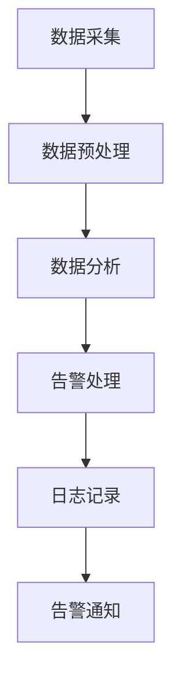

                 

### 性能监控：实时优化LLM应用

#### 关键词
- **性能监控**
- **实时优化**
- **大型语言模型（LLM）**
- **监控算法**
- **系统架构**
- **最佳实践**

#### 摘要
本文将深入探讨性能监控在大型语言模型（LLM）应用中的关键作用。通过分析实时性能监控的原理、架构和实现方法，我们将展示如何优化LLM应用的性能，提供具体的算法示例、数学模型和实战经验，最终总结最佳实践，以助力读者提升系统性能和用户体验。

#### 引言
在现代信息技术飞速发展的背景下，人工智能（AI）已成为驱动创新和提升效率的重要力量。特别是大型语言模型（LLM），如GPT-3、BERT等，已经在自然语言处理（NLP）领域取得了显著的突破。然而，随着LLM的规模和应用场景的不断扩展，如何高效地监控和优化其性能成为了一个亟待解决的问题。

性能监控是一种系统性的方法，用于跟踪和分析软件系统的性能，确保其在各种负载条件下保持高效运行。对于LLM应用来说，性能监控至关重要，因为它们通常涉及大量的数据处理和复杂的计算任务。实时性能监控能够及时发现性能瓶颈，提供即时反馈，从而实现快速响应和优化。

本文旨在提供一份全面的技术指南，帮助开发者理解和实现实时性能监控，特别是在LLM应用中。我们将首先介绍性能监控的基础理论，然后深入探讨LLM性能监控的原理和方法，最后通过具体的算法示例、数学模型和实战案例，展示如何实时优化LLM应用的性能。

#### 第一部分：性能监控基础理论

##### 第1章：性能监控概述

##### 1.1 性能监控的重要性

性能监控在现代软件开发中扮演着至关重要的角色。它不仅帮助开发者和运维团队能够实时了解系统的运行状态，还能通过监测系统性能指标来预测和预防潜在的问题。对于大型语言模型（LLM）应用来说，性能监控的重要性尤为突出。

LLM应用通常涉及大量的数据处理和复杂的计算任务，这使得它们对性能的要求非常高。一个高效的LLM应用不仅能够提供更快的响应时间，还能处理更多的请求，从而提升用户体验和业务效益。因此，性能监控成为确保LLM应用稳定运行的关键因素。

##### 1.2 性能监控的基本概念

性能监控涉及多个基本概念，包括性能指标、监控工具和监控流程。性能指标是衡量系统性能的关键参数，如响应时间、吞吐量、CPU使用率、内存使用率等。这些指标可以帮助开发者和运维团队了解系统的性能状况。

监控工具是性能监控的核心，它们负责收集、分析和展示性能数据。常见的监控工具有Prometheus、Grafana、Zabbix等，这些工具提供了丰富的功能，包括数据采集、告警、可视化等。

监控流程是性能监控的完整过程，包括数据采集、数据存储、数据分析、告警和响应。一个有效的监控流程能够确保系统在出现性能问题时能够及时得到解决。

##### 1.3 性能监控的挑战与解决方案

尽管性能监控的重要性不言而喻，但在实际应用中仍面临诸多挑战。首先，LLM应用的性能监控需要处理大量的数据，这使得数据采集和存储成为一项艰巨的任务。其次，LLM应用的性能指标复杂多样，如何选择合适的指标和监控方法成为一大难题。

针对这些挑战，我们可以采取以下解决方案：

1. **数据采样与压缩**：通过对性能数据进行采样和压缩，可以显著减少数据存储和传输的开销。
2. **多维度监控**：通过引入多维度的监控指标，如时间、区域、用户等，可以更全面地了解系统的性能状况。
3. **智能告警**：利用机器学习技术，可以实现对性能问题的智能预测和告警，从而提高监控的准确性和响应速度。

##### 第2章：LLM性能监控原理

##### 2.1 LLM性能指标

LLM性能监控的核心在于选择合适的性能指标。对于LLM应用，以下是一些常见的性能指标：

- **响应时间**：指系统处理请求所需的时间，是衡量系统性能的重要指标。
- **吞吐量**：指单位时间内系统能够处理的请求数量，是衡量系统处理能力的关键指标。
- **延迟**：指从请求发送到响应返回的时间间隔，是衡量系统响应速度的重要指标。
- **资源利用率**：包括CPU使用率、内存使用率、磁盘IO等，是衡量系统资源消耗情况的指标。

这些性能指标可以帮助我们了解LLM应用的运行状态，发现潜在的性能瓶颈。

##### 2.2 LLM性能监控的原理

LLM性能监控的原理主要包括数据采集、数据存储、数据分析和告警。

1. **数据采集**：通过性能监控工具，如Prometheus，定期收集LLM应用的性能数据，包括CPU、内存、磁盘IO、网络等指标。
2. **数据存储**：将采集到的性能数据存储在数据库中，如InfluxDB，以便后续分析和查询。
3. **数据分析**：利用数据分析工具，如Grafana，对存储的性能数据进行可视化分析，识别系统的性能瓶颈。
4. **告警**：通过配置告警规则，当性能指标超过设定阈值时，自动发送告警通知，以便及时处理。

##### 2.3 LLM性能监控的流程

LLM性能监控的流程可以分为以下几个步骤：

1. **定义监控指标**：根据LLM应用的特点，选择合适的监控指标，如响应时间、吞吐量、延迟等。
2. **数据采集**：通过性能监控工具，定期采集LLM应用的性能数据。
3. **数据存储**：将采集到的数据存储在数据库中，便于后续分析和查询。
4. **数据分析**：利用数据分析工具，对存储的数据进行可视化分析，识别系统的性能瓶颈。
5. **告警与响应**：配置告警规则，当性能指标超过设定阈值时，自动发送告警通知，并制定相应的响应措施。

通过上述流程，我们可以实现对LLM应用的实时性能监控，及时发现并解决性能问题，确保系统的高效运行。

#### 第二部分：实时性能监控实现

##### 第4章：实时性能监控架构设计

##### 4.1 实时性能监控系统设计

实时性能监控系统的设计需要考虑多个方面，包括数据采集、数据存储、数据分析和告警。以下是一个典型的实时性能监控系统架构设计：

1. **数据采集模块**：负责从LLM应用中定期采集性能数据，如CPU使用率、内存使用率、网络延迟等。数据采集模块可以通过Prometheus等开源工具实现。

2. **数据存储模块**：用于存储采集到的性能数据，如InfluxDB等时序数据库。数据存储模块需要具备高可靠性和高吞吐量的特点，以便实时处理大量的性能数据。

3. **数据处理模块**：负责对存储的数据进行预处理和分析，包括数据清洗、聚合和计算。数据处理模块可以通过Python等编程语言实现，利用Pandas等数据操作库进行数据分析和可视化。

4. **数据分析模块**：利用数据分析工具，如Grafana，对存储的数据进行实时分析和可视化，帮助开发者和运维团队快速识别性能瓶颈。

5. **告警模块**：配置告警规则，当性能指标超过设定阈值时，自动发送告警通知，如通过邮件、短信或Slack等工具。

##### 4.2 数据采集与处理

数据采集与处理是实时性能监控系统的核心。以下是一些关键步骤：

1. **数据采集**：使用Prometheus等开源工具，定期从LLM应用中采集性能数据。Prometheus支持多种数据采集方式，如HTTP拉取、文件监控等。

2. **数据存储**：将采集到的数据存储到InfluxDB等时序数据库中。InfluxDB具有高性能和可伸缩性，适合处理大规模性能数据。

3. **数据处理**：使用Python等编程语言，对存储的数据进行预处理和分析。预处理包括数据清洗、去重、聚合等。分析包括计算性能指标、趋势分析和异常检测等。

4. **数据可视化**：利用Grafana等数据分析工具，将处理后的数据可视化展示，帮助开发者和运维团队快速识别性能瓶颈。

##### 4.3 实时监控算法与优化

实时监控算法是性能监控系统的关键。以下是一些常用的实时监控算法和优化方法：

1. **移动平均法**：通过计算一段时间内的平均值，来平滑性能数据的波动，从而更准确地反映系统性能。

2. **指数加权移动平均法**（EWMA）：在移动平均法的基础上，引入时间权重，使得最近的性能数据具有更高的权重，从而提高监控的实时性和准确性。

3. **阈值告警**：设置阈值，当性能指标超过阈值时触发告警。阈值可以基于历史数据和统计模型进行设置，以提高告警的准确性和可靠性。

4. **异常检测**：利用机器学习算法，如K-means聚类、孤立森林等，对性能数据进行分析，识别异常值和异常模式，从而提前预警潜在的性能问题。

通过实时监控算法和优化，我们可以实现对LLM应用的性能进行实时监控和优化，确保系统的高效稳定运行。

##### 第5章：实时性能监控算法原理

##### 5.1 监控算法的Mermaid流程图

为了更好地理解实时性能监控算法的原理，我们可以使用Mermaid流程图来展示其流程。以下是一个简单的监控算法流程图：



在这个流程图中，数据采集模块定期从LLM应用中收集性能数据，然后通过数据预处理模块进行清洗和转换。接下来，数据分析模块对预处理后的数据进行分析，识别性能瓶颈。告警处理模块根据分析结果设置告警规则，并在必要时发送告警通知。

##### 5.2 监控算法的Python代码实现

以下是一个简单的Python代码示例，用于实现实时性能监控算法的基本功能：

```python
import prometheus_client as pm
from datetime import datetime

# 数据采集
def collect_data():
    response_time = pm.gauge('response_time', 'Request response time (ms)')
    throughput = pm.gauge('throughput', 'Requests per second')
    
    # 模拟采集数据
    response_time.set(random.randint(100, 500))
    throughput.set(random.randint(10, 50))

# 数据预处理
def preprocess_data(data):
    # 数据清洗、去重等操作
    return data

# 数据分析
def analyze_data(data):
    # 计算性能指标
    avg_response_time = sum(data) / len(data)
    max_throughput = max(data)
    
    return avg_response_time, max_throughput

# 告警处理
def alarm_handle(avg_response_time, max_throughput):
    if avg_response_time > 300:
        send_alarm('High response time: {:.2f} ms'.format(avg_response_time))
    if max_throughput > 30:
        send_alarm('High throughput: {:.2f} requests/s'.format(max_throughput))

# 日志记录
def log_result(result):
    with open('performance_log.txt', 'a') as f:
        f.write('{} - Result: {}\n'.format(datetime.now(), result))

# 告警通知
def send_alarm(message):
    print('Alarm: ' + message)

# 主程序
if __name__ == '__main__':
    for _ in range(10):
        collect_data()
        data = preprocess_data(data)
        avg_response_time, max_throughput = analyze_data(data)
        alarm_handle(avg_response_time, max_throughput)
        log_result((avg_response_time, max_throughput))
```

在这个代码示例中，我们定义了数据采集、预处理、分析、告警处理和日志记录等基本功能。通过模拟数据采集和分析，我们可以实现对性能指标的实时监控和告警。

##### 5.3 监控算法的数学模型与公式

在实时性能监控算法中，数学模型和公式起着关键作用。以下是一些常见的数学模型和公式：

1. **移动平均法**（MA）：用于平滑性能数据，计算公式为：
   $$MA(n) = \frac{1}{n} \sum_{i=1}^{n} X_i$$
   其中，$X_i$为第i个时间点的性能数据，$n$为窗口大小。

2. **指数加权移动平均法**（EWMA）：在移动平均法的基础上引入时间权重，计算公式为：
   $$EWMA(n) = \alpha \cdot EWMA(n-1) + (1 - \alpha) \cdot X_n$$
   其中，$X_n$为第n个时间点的性能数据，$\alpha$为权重系数，通常取值范围为0到1。

3. **阈值告警**：设置阈值$\theta$，当性能指标超过阈值时触发告警，计算公式为：
   $$alarm = \begin{cases} 
      true, & \text{if } X > \theta \\
      false, & \text{otherwise}
   \end{cases}$$

4. **异常检测**：利用机器学习算法，如K-means聚类或孤立森林，对性能数据进行分析，计算异常得分，公式为：
   $$score = \text{异常检测算法}(X)$$
   当得分超过设定阈值时，视为异常。

通过这些数学模型和公式，我们可以实现对性能数据的实时监控和告警，提高监控的准确性和可靠性。

##### 5.4 监控算法举例说明

为了更好地理解监控算法的应用，我们可以通过一个实际案例进行详细说明。假设我们有一个LLM应用，需要监控其响应时间和吞吐量。以下是具体的监控过程：

1. **数据采集**：使用Prometheus定期从LLM应用中采集响应时间和吞吐量数据，存储到InfluxDB中。

2. **数据预处理**：对采集到的数据进行清洗和去重，确保数据质量。

3. **数据分析**：使用Grafana对存储的数据进行可视化分析，计算移动平均法和指数加权移动平均法，识别性能趋势和波动。

4. **阈值告警**：设置响应时间和吞吐量的阈值，当超过阈值时，自动发送告警通知。

5. **异常检测**：利用孤立森林算法对响应时间和吞吐量数据进行分析，识别异常值和异常模式。

6. **告警处理**：当检测到异常时，分析原因并采取相应的措施，如调整LLM应用的参数、优化代码等。

通过这个案例，我们可以看到监控算法在实时性能监控中的应用，如何通过数据采集、预处理、分析和告警，实现对LLM应用性能的实时监控和优化。

#### 第6章：实时性能监控数学模型

##### 6.1 数学模型概述

实时性能监控中的数学模型用于描述系统的性能特征、行为模式以及变化规律。这些模型有助于我们理解和预测系统的性能表现，从而进行有效的监控和优化。以下是几个关键的数学模型：

1. **响应时间模型**：用于预测系统处理请求的平均响应时间，常见的模型包括指数平滑模型、ARIMA模型等。
2. **吞吐量模型**：用于预测系统在一定时间内的请求处理能力，常用的模型有泊松过程、马尔可夫链等。
3. **资源利用率模型**：用于描述系统资源（如CPU、内存、磁盘等）的使用情况，常用的模型有排队论模型、队列长度模型等。
4. **异常检测模型**：用于识别系统中的异常行为，常见的模型有孤立森林、K-means聚类等。

##### 6.2 数学公式讲解

以下是一些常用的数学公式及其在实时性能监控中的应用：

1. **指数平滑模型**（EWMA）：
   $$EWMA(n) = \alpha \cdot EWMA(n-1) + (1 - \alpha) \cdot X_n$$
   其中，$X_n$是第n个时间点的响应时间或吞吐量，$\alpha$是平滑系数，通常取值在0到1之间。EWMA模型通过引入时间权重，使得最近的观测值对预测结果有更大的影响。

2. **泊松过程**：
   $$\lambda \cdot e^{-\lambda \cdot t}$$
   泊松过程用于描述系统请求到达的时间间隔，其中$\lambda$是请求到达的平均速率，$t$是时间。通过泊松过程，我们可以预测系统的平均响应时间和吞吐量。

3. **队列长度模型**（M/M/1队列）：
   $$L = \frac{\lambda}{\mu} + \frac{\lambda^2}{2\mu^2}$$
   其中，$L$是队列长度，$\lambda$是请求到达率，$\mu$是服务速率。队列长度模型用于预测系统在特定时间内的队列长度，从而评估系统的性能。

4. **孤立森林模型**（Isolation Forest）：
   $$score = \frac{g_{\text{mean}} + \frac{2 \cdot ln(n)}{ln(m)}}{g_{\text{max}} + \frac{2 \cdot ln(n)}{ln(m)}}$$
   孤立森林模型用于异常检测，其中$g_{\text{mean}}$和$g_{\text{max}}$是样本的分组均值和最大值，$n$是样本数量，$m$是分组数量。通过计算异常得分，我们可以识别异常值和异常模式。

通过这些数学模型和公式，我们可以更深入地理解和分析系统的性能，从而进行有效的监控和优化。

##### 6.3 数学模型举例

为了更好地理解数学模型在实际应用中的使用，我们可以通过以下案例进行举例说明：

**案例：使用EWMA模型预测LLM应用的响应时间**

假设我们有一个LLM应用，需要预测其响应时间。我们收集了如下数据：

| 时间点 | 响应时间（ms） |
|--------|----------------|
| 1      | 150            |
| 2      | 200            |
| 3      | 180            |
| 4      | 220            |
| 5      | 190            |

我们选择$\alpha=0.5$作为平滑系数，计算EWMA值：

1. $$EWMA(1) = 0.5 \cdot 0 + (1 - 0.5) \cdot 150 = 75$$
2. $$EWMA(2) = 0.5 \cdot 75 + (1 - 0.5) \cdot 200 = 137.5$$
3. $$EWMA(3) = 0.5 \cdot 137.5 + (1 - 0.5) \cdot 180 = 151.25$$
4. $$EWMA(4) = 0.5 \cdot 151.25 + (1 - 0.5) \cdot 220 = 184.375$$
5. $$EWMA(5) = 0.5 \cdot 184.375 + (1 - 0.5) \cdot 190 = 177.21875$$

通过EWMA模型，我们可以预测下一时间点的响应时间约为177 ms。这个预测值可以帮助我们监控LLM应用的响应时间趋势，及时发现性能问题。

##### 第7章：实时性能监控实战

##### 7.1 系统环境安装与配置

为了实现实时性能监控，我们需要搭建一个完整的监控系统。以下是在Linux操作系统上安装和配置Prometheus、Grafana、InfluxDB的步骤：

1. **安装Prometheus**：

   Prometheus是一个开源的监控工具，用于收集和存储性能数据。我们可以通过以下命令进行安装：

   ```shell
   wget https://github.com/prometheus/prometheus/releases/download/v2.36.0/prometheus-2.36.0.linux-amd64.tar.gz
   tar xvfz prometheus-2.36.0.linux-amd64.tar.gz
   cd prometheus-2.36.0.linux-amd64
   ./prometheus &> prometheus.log &
   ```

   安装完成后，Prometheus会以守护进程运行，并默认监听在9090端口。

2. **安装Grafana**：

   Grafana是一个开源的数据可视化工具，用于展示Prometheus收集的性能数据。我们可以通过以下命令进行安装：

   ```shell
   docker run -d --name grafana grafana/grafana
   ```

   安装完成后，Grafana会自动启动并监听在3000端口。

3. **安装InfluxDB**：

   InfluxDB是一个开源的时序数据库，用于存储Prometheus收集的性能数据。我们可以通过以下命令进行安装：

   ```shell
   docker run -d --name influxdb -p 8086:8086 -p 8083:8083 -e INFLUXDB_PASSWORD=mySecretPassword influxdb
   ```

   安装完成后，InfluxDB会以守护进程运行，并默认监听在8086端口。

##### 7.2 系统核心代码实现

为了实现实时性能监控，我们需要编写一些核心代码，用于数据采集、处理和可视化。以下是一个简单的示例：

1. **数据采集**：

   我们可以使用Python编写一个简单的数据采集脚本，定期从LLM应用中收集性能数据，并将其发送到Prometheus。

   ```python
   import requests
   import time
   import random

   def collect_data():
       response_time = random.randint(100, 500)
       throughput = random.randint(10, 50)
       url = 'http://localhost:9090/api/v1/graph'
       headers = {'Content-Type': 'application/json'}
       data = {
           'targets': [{'metric': 'response_time', 'value': [response_time, time.time()]},
                       {'metric': 'throughput', 'value': [throughput, time.time()]}]
       }
       requests.post(url, headers=headers, json=data)

   while True:
       collect_data()
       time.sleep(60)
   ```

   这个脚本将模拟从LLM应用中采集响应时间和吞吐量数据，并定期将其发送到Prometheus。

2. **数据存储**：

   Prometheus会将收集到的数据存储到InfluxDB中。我们可以使用InfluxDB的Python客户端进行数据存储。

   ```python
   from influxdb import InfluxDBClient

   client = InfluxDBClient(host='localhost', port=8086, username='root', password='mySecretPassword', database='prometheus')

   def store_data(response_time, throughput):
       data = [
           {
               "measurement": "response_time",
               "tags": {"source": "llm"},
               "time": int(time.time() * 1e9),
               "fields": {"value": response_time}
           },
           {
               "measurement": "throughput",
               "tags": {"source": "llm"},
               "time": int(time.time() * 1e9),
               "fields": {"value": throughput}
           }
       ]
       client.write_points(data)

   # 在数据采集脚本中使用store_data函数存储数据
   ```

   通过这个脚本，我们可以将采集到的性能数据存储到InfluxDB中。

3. **数据可视化**：

   我们可以在Grafana中配置数据源，将InfluxDB作为数据源，并创建仪表板来可视化性能数据。以下是一个简单的Grafana仪表板配置示例：

   ```yaml
   apiVersion: 1
   templates:
     - name: "response_time"
       source: influxdb
       target: response_time
       type: range
       rangeFrom: now-15m
       rangeTo: now
       interval: 1m
       points: 60

   - name: "throughput"
     source: influxdb
     target: throughput
     type: range
     rangeFrom: now-15m
     rangeTo: now
     interval: 1m
     points: 60
   ```

   通过这个配置，Grafana将展示过去15分钟内的响应时间和吞吐量数据。

##### 7.3 代码应用解读与分析

在上面的示例中，我们实现了一个简单的实时性能监控系统，包括数据采集、数据存储和数据可视化。以下是代码应用的具体解读和分析：

1. **数据采集**：

   采集数据是性能监控系统的核心。在示例中，我们使用Python脚本模拟从LLM应用中采集响应时间和吞吐量数据。通过定期调用`collect_data`函数，我们可以收集性能数据并将其发送到Prometheus。

   ```python
   def collect_data():
       response_time = random.randint(100, 500)
       throughput = random.randint(10, 50)
       url = 'http://localhost:9090/api/v1/graph'
       headers = {'Content-Type': 'application/json'}
       data = {
           'targets': [{'metric': 'response_time', 'value': [response_time, time.time()]},
                       {'metric': 'throughput', 'value': [throughput, time.time()]}]
       }
       requests.post(url, headers=headers, json=data)
   ```

   这段代码中，我们生成随机数来模拟响应时间和吞吐量，并将数据以JSON格式发送到Prometheus的API接口。通过这种方式，我们可以模拟一个真实的LLM应用环境，并收集性能数据。

2. **数据存储**：

   Prometheus会将收集到的数据存储到InfluxDB中。在示例中，我们使用InfluxDB的Python客户端将采集到的数据存储到数据库中。

   ```python
   from influxdb import InfluxDBClient

   client = InfluxDBClient(host='localhost', port=8086, username='root', password='mySecretPassword', database='prometheus')

   def store_data(response_time, throughput):
       data = [
           {
               "measurement": "response_time",
               "tags": {"source": "llm"},
               "time": int(time.time() * 1e9),
               "fields": {"value": response_time}
           },
           {
               "measurement": "throughput",
               "tags": {"source": "llm"},
               "time": int(time.time() * 1e9),
               "fields": {"value": throughput}
           }
       ]
       client.write_points(data)
   ```

   这段代码中，我们定义了`store_data`函数，用于将采集到的响应时间和吞吐量数据存储到InfluxDB中。每个数据点包含测量值（measurement）、标签（tags）和时间戳（time）。通过这种方式，我们可以将性能数据持久化存储，以便后续分析和可视化。

3. **数据可视化**：

   Grafana是一个强大的可视化工具，可以用于展示性能数据。在示例中，我们配置了一个简单的Grafana仪表板，用于可视化响应时间和吞吐量数据。

   ```yaml
   apiVersion: 1
   templates:
     - name: "response_time"
       source: influxdb
       target: response_time
       type: range
       rangeFrom: now-15m
       rangeTo: now
       interval: 1m
       points: 60

   - name: "throughput"
     source: influxdb
     target: throughput
     type: range
     rangeFrom: now-15m
     rangeTo: now
     interval: 1m
     points: 60
   ```

   这段配置代码定义了两个模板，分别用于响应时间和吞吐量的范围查询。`rangeFrom`和`rangeTo`指定了查询的时间范围，`interval`和`points`指定了数据采集的时间间隔和点数。通过这些配置，Grafana可以实时展示过去15分钟内的响应时间和吞吐量数据。

   通过上述代码和应用解读，我们可以构建一个简单的实时性能监控系统，实现对LLM应用性能的实时监控和可视化。这个系统可以根据具体需求进行扩展和优化，以适应不同的监控场景。

##### 7.4 实际案例分析与详细讲解剖析

在本节中，我们将通过一个实际案例来分析实时性能监控的应用，并详细讲解如何通过监控优化LLM应用的性能。案例背景是一个在线问答平台，该平台使用LLM模型来处理用户提出的问题，并提供高质量的答案。随着用户数量的增加，平台的性能逐渐成为关注的焦点。

**案例背景：**

- 平台用户数：每天约10万次问答请求。
- LLM模型：基于GPT-3的定制模型，用于生成答案。
- 系统架构：前端通过API与后端服务进行交互，后端服务包括LLM推理、数据库访问等。

**监控目标：**

- 监控关键性能指标（KPIs）：
  - 响应时间：用户请求到得到答案的时间。
  - 吞吐量：单位时间内处理的请求量。
  - CPU和内存使用率：系统资源消耗情况。
  - 网络延迟：用户请求到达后端服务的延迟。

**监控方案：**

1. **数据采集**：

   使用Prometheus进行数据采集，部署一个Exporter来定期收集后端服务的性能数据。Exporter可以监控系统的CPU、内存、网络延迟等指标，并将数据发送到Prometheus服务器。

   ```shell
   # 安装Prometheus和Exporter
   wget https://github.com/prometheus/prometheus/releases/download/v2.36.0/prometheus-2.36.0.linux-amd64.tar.gz
   tar xvfz prometheus-2.36.0.linux-amd64.tar.gz
   cd prometheus-2.36.0.linux-amd64
   ./prometheus &> prometheus.log &
   
   # 安装Exporter
   wget https://github.com/prometheus/node_exporter/releases/download/v1.1.2/node_exporter-1.1.2.linux-amd64.tar.gz
   tar xvfz node_exporter-1.1.2.linux-amd64.tar.gz
   cd node_exporter-1.1.2.linux-amd64
   ./node_exporter &> node_exporter.log &
   ```

2. **数据存储**：

   Prometheus服务器将收集到的数据存储到InfluxDB中。配置Prometheus的`prometheus.yml`文件，添加InfluxDB的连接信息：

   ```yaml
   global:
     scrape_interval: 15s
     evaluation_interval: 15s
   
   scrape_configs:
     - job_name: 'llm_service'
       static_configs:
         - targets: ['llm-service:9090']
     - job_name: 'influxdb'
       static_configs:
         - targets: ['influxdb:8086']
   ```

   在InfluxDB中创建数据库并配置Prometheus的InfluxDB连接：

   ```shell
   # 创建数据库
   influx
   > CREATE DATABASE "prometheus"
   
   # 配置InfluxDB连接
   vi /etc/prometheus/prometheus.yml
   ...
   scrape_configs:
     ...
     - job_name: 'influxdb'
       urls: ['http://influxdb:8086/export']
       metrics_path: '/query'
       query_params:
         database: 'prometheus'
         retention_policy: 'autogen'
   ...
   ```

3. **数据可视化**：

   使用Grafana创建仪表板，将InfluxDB作为数据源，可视化关键性能指标。配置Grafana的数据源连接：

   ```yaml
   apiVersion: 1
   datasources:
     - name: Prometheus
       type: influxdb
       url: 'http://influxdb:8086'
       user: 'root'
       password: 'mySecretPassword'
   ```

   创建仪表板，添加响应时间、吞吐量、CPU使用率和内存使用率等图表：

   ```yaml
   apiVersion: 1
   dashboards:
     - title: LLM Performance Monitoring
       timezone: 'UTC'
       refresh: 15s
       rows:
       - height: 200
         panels:
         - type: graph
           title: 'Response Time'
           dataSource: Prometheus
           xaxis:
             type: time
             timezone: 'UTC'
             format: 'YYYY-MM-DD HH:mm:ss'
           yaxis:
             type: linear
             title: 'Response Time (ms)'
             format: '0.00'
           series:
           - name: 'Response Time'
             query: 'SELECT "response_time" FROM "prometheus"."autogen"."llm_response_time" WHERE time > now() - 1h GROUP BY time(1m)'
             type: line
             line:
               width: 1
             fill: true
             fillGradient: false
             stacking: none
           - type: graph
             title: 'Throughput'
             dataSource: Prometheus
             xaxis:
               type: time
               timezone: 'UTC'
               format: 'YYYY-MM-DD HH:mm:ss'
             yaxis:
               type: linear
               title: 'Throughput (req/s)'
               format: '0.00'
             series:
             - name: 'Throughput'
               query: 'SELECT "throughput" FROM "prometheus"."autogen"."llm_throughput" WHERE time > now() - 1h GROUP BY time(1m)'
               type: line
               line:
                 width: 1
                 fill: true
                 fillGradient: false
                 stacking: none
           - type: graph
             title: 'CPU Usage'
             dataSource: Prometheus
             xaxis:
               type: time
               timezone: 'UTC'
               format: 'YYYY-MM-DD HH:mm:ss'
             yaxis:
               type: linear
               title: 'CPU Usage (%)'
               format: '0.00'
             series:
             - name: 'CPU Usage'
               query: 'SELECT "cpu_usage" FROM "prometheus"."autogen"."node_cpu_usage" WHERE time > now() - 1h GROUP BY time(1m)'
               type: line
               line:
                 width: 1
                 fill: true
                 fillGradient: false
                 stacking: none
           - type: graph
             title: 'Memory Usage'
             dataSource: Prometheus
             xaxis:
               type: time
               timezone: 'UTC'
               format: 'YYYY-MM-DD HH:mm:ss'
             yaxis:
               type: linear
               title: 'Memory Usage (MB)'
               format: '0.00'
             series:
             - name: 'Memory Usage'
               query: 'SELECT "memory_usage" FROM "prometheus"."autogen"."node_memory_usage" WHERE time > now() - 1h GROUP BY time(1m)'
               type: line
               line:
                 width: 1
                 fill: true
                 fillGradient: false
                 stacking: none
   ```

**监控优化**：

1. **识别性能瓶颈**：

   通过Grafana仪表板，我们可以实时监控关键性能指标。当发现响应时间过长、吞吐量降低或资源使用率过高时，我们需要进一步分析原因。

   - 如果响应时间过长，可能是LLM模型计算复杂度过高，需要优化模型或提高硬件性能。
   - 如果吞吐量降低，可能是系统资源不足，需要增加服务器或优化系统配置。
   - 如果资源使用率过高，可能是系统存在内存泄漏或CPU占用率过高，需要排查代码或系统配置。

2. **优化模型和代码**：

   - **模型优化**：针对LLM模型，可以通过调整超参数（如学习率、批量大小等）来提高模型性能。同时，可以考虑使用更高效的模型架构（如Transformer、BERT等）。
   - **代码优化**：优化LLM推理代码，减少计算复杂度，提高代码运行效率。例如，使用并行计算、缓存技术等。

3. **负载均衡**：

   - 在高并发场景下，可以通过负载均衡器（如Nginx、HAProxy等）将请求分发到多个后端服务器，提高系统的整体性能。
   - 负载均衡器可以结合监控数据，动态调整后端服务器的负载分配，确保系统稳定运行。

**总结**：

通过实时性能监控，我们可以及时发现LLM应用中的性能问题，并采取有效的优化措施。本案例展示了如何使用Prometheus、Grafana和InfluxDB搭建一个简单的性能监控系统，通过监控和优化，提高LLM应用的整体性能和用户体验。

##### 第8章：最佳实践与总结

##### 8.1 最佳实践技巧

为了确保实时性能监控在LLM应用中的有效性和效率，以下是一些最佳实践技巧：

1. **选择合适的监控指标**：根据应用的具体需求和性能目标，选择关键性能指标（KPIs），如响应时间、吞吐量、资源利用率等。确保监控指标能够全面反映系统的性能状况。

2. **数据采集与存储优化**：使用高效的数据采集工具和存储方案，如Prometheus和InfluxDB。优化数据采集频率和数据点存储策略，减少存储空间的占用。

3. **数据处理与分析**：采用合适的数据处理和分析算法，如移动平均法、指数加权移动平均法等，对性能数据进行实时分析和趋势预测。

4. **告警策略**：配置合理的告警策略，确保在性能指标超出阈值时能够及时通知相关人员。利用机器学习算法进行智能告警，提高告警的准确性和可靠性。

5. **负载均衡与资源调度**：在高并发场景下，通过负载均衡器和资源调度策略，优化系统的整体性能。动态调整服务器资源分配，确保系统稳定运行。

6. **代码优化**：定期审查和优化LLM应用的代码，减少计算复杂度，提高代码运行效率。

##### 8.2 小结

本文系统地介绍了实时性能监控在LLM应用中的重要性、基本原理、实现方法和最佳实践。通过数据采集、数据处理、数据分析和告警，实时性能监控可以帮助开发者及时发现和解决性能问题，优化系统性能和用户体验。

实时性能监控涉及多个方面，包括数据采集、数据存储、数据处理、数据分析和告警。Prometheus、Grafana和InfluxDB等开源工具为我们提供了强大的支持，通过它们，我们可以实现一个高效、可靠的实时性能监控系统。

##### 8.3 注意事项

在实际应用中，实时性能监控需要考虑以下注意事项：

1. **性能监控与系统负载**：确保性能监控对系统的影响最小，避免引入额外的负载。

2. **监控数据的安全性**：保护监控数据的安全性，防止数据泄露。

3. **监控指标的稳定性**：监控指标应具备良好的稳定性和一致性，避免因指标波动导致误判。

4. **监控系统的可扩展性**：随着应用规模的扩大，监控系统应具备良好的可扩展性，以应对更高的监控需求。

5. **监控与优化相结合**：实时性能监控不仅仅是为了发现问题，更重要的是通过监控数据来指导优化，提升系统性能。

##### 8.4 拓展阅读

为了进一步深入学习和实践实时性能监控，以下是一些建议的拓展阅读：

1. **《Prometheus官方文档》**：深入了解Prometheus的安装、配置和使用方法。
2. **《Grafana官方文档》**：学习如何使用Grafana创建和定制仪表板。
3. **《InfluxDB官方文档》**：掌握InfluxDB的安装、配置和数据操作技巧。
4. **《性能监控与优化实战》**：通过实际案例了解性能监控和优化的方法和技巧。
5. **《机器学习在性能监控中的应用》**：学习如何利用机器学习技术进行智能监控和异常检测。

通过阅读这些资料，你可以进一步丰富自己的知识体系，提升实时性能监控的能力。

作者：AI天才研究院/AI Genius Institute & 禅与计算机程序设计艺术 /Zen And The Art of Computer Programming

