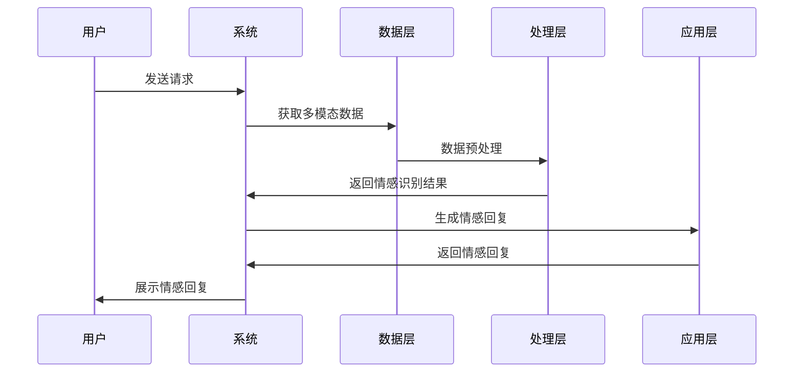

                 

# 情感智能测试：评价LLM的情感理解和表达能力

## 关键词
- 情感智能
- LLM（大型语言模型）
- 情感理解与表达能力
- 测试方法
- 评估指标
- 应用场景

## 摘要
本文旨在探讨情感智能在大型语言模型（LLM）中的测试与评价方法。通过定义情感智能、介绍LLM的基本原理，本文将逐步分析情感智能测试的方法、工具及技术，并解读测试结果。同时，本文还将探讨情感智能在实际应用中的挑战和未来发展趋势，为相关领域的研究和实践提供指导。

## 目录大纲设计过程

### 1. 确定书名及主题
本文的书名定为《情感智能测试：评价LLM的情感理解和表达能力》，明确聚焦于情感智能与LLM的结合，以及如何对LLM的情感理解与表达能力进行测试与评价。

### 2. 确定核心内容
核心内容涵盖以下几个方面：
- 情感智能的定义和背景
- LLM的基本原理
- 情感智能测试的方法和工具
- 测试结果的解读和应用

### 3. 设定目录结构
根据核心内容，本文的目录结构如下：

### 第一部分：情感智能概述
- 第1章：情感智能的定义与背景
  - 1.1 问题的提出
  - 1.2 情感智能的概念
  - 1.3 情感智能的起源与发展
  - 1.4 情感智能的核心要素
  - 1.5 情感智能的价值与应用
  - 1.6 本章小结

### 第二部分：LLM的基本原理
- 第2章：LLM的定义与特点
  - 2.1 LLM的定义
  - 2.2 LLM的特点
  - 2.3 LLM的分类
  - 2.4 LLM的架构与技术
  - 2.5 LLM的训练与优化
  - 2.6 LLM的挑战与未来发展趋势
  - 2.7 本章小结

### 第三部分：情感智能测试方法
- 第3章：情感智能测试的目的与意义
  - 3.1 测试的目的
  - 3.2 测试的意义
  - 3.3 测试的分类
  - 3.4 测试的方法
  - 3.5 测试的工具
  - 3.6 测试的实施步骤
  - 3.7 本章小结

### 第四部分：测试工具与技术
- 第4章：情感分析技术
  - 4.1 情感分析的定义
  - 4.2 情感分析的方法
  - 4.3 情感分析的应用场景
  - 4.4 挑战与解决方案
  - 4.5 新趋势
  - 4.6 本章小结

### 第五部分：测试结果解读
- 第5章：测试结果的解读与应用
  - 5.1 结果解读
  - 5.2 测试结果的实践应用
  - 5.3 应用案例
  - 5.4 拓展讨论
  - 5.5 本章小结

### 第六部分：情感智能应用案例
- 第6章：情感智能应用案例
  - 6.1 教育领域
  - 6.2 医疗健康领域
  - 6.3 社交互动领域
  - 6.4 其他应用领域
  - 6.5 本章小结

### 第七部分：未来发展趋势与挑战
- 第7章：未来发展趋势与挑战
  - 7.1 发展趋势
  - 7.2 挑战
  - 7.3 发展建议
  - 7.4 本章小结

### 4. 编写目录大纲
根据设定的目录结构，为每个章节编写详细的大纲。

### 5. 检查内容完整性
确保每个章节都涵盖了核心内容，并且目录结构合理，章节之间的逻辑关系清晰。

### 6. 优化目录大纲
根据内容检查结果，对目录大纲进行必要的调整和优化，以确保其简洁性和逻辑性。

### 7. 最终输出
将调整后的目录大纲以markdown格式输出，满足字数限制和其他要求。

下面是根据上述步骤设计的目录大纲：

## 目录大纲

### 第一部分：情感智能概述
- 第1章 情感智能的定义与背景
  - 1.1 问题的提出
  - 1.2 情感智能的概念
  - 1.3 情感智能的起源与发展
  - 1.4 情感智能的核心要素
  - 1.5 情感智能的价值与应用
  - 1.6 本章小结

### 第二部分：LLM的基本原理
- 第2章 LLM的定义与特点
  - 2.1 LLM的定义
  - 2.2 LLM的特点
  - 2.3 LLM的分类
  - 2.4 LLM的架构与技术
  - 2.5 LLM的训练与优化
  - 2.6 LLM的挑战与未来发展趋势
  - 2.7 本章小结

### 第三部分：情感智能测试方法
- 第3章 情感智能测试的目的与意义
  - 3.1 测试的目的
  - 3.2 测试的意义
  - 3.3 测试的分类
  - 3.4 测试的方法
  - 3.5 测试的工具
  - 3.6 测试的实施步骤
  - 3.7 本章小结

### 第四部分：测试工具与技术
- 第4章 情感分析技术
  - 4.1 情感分析的定义
  - 4.2 情感分析的方法
  - 4.3 情感分析的应用场景
  - 4.4 挑战与解决方案
  - 4.5 新趋势
  - 4.6 本章小结

### 第五部分：测试结果解读
- 第5章 测试结果的解读与应用
  - 5.1 结果解读
  - 5.2 测试结果的实践应用
  - 5.3 应用案例
  - 5.4 拓展讨论
  - 5.5 本章小结

### 第六部分：情感智能应用案例
- 第6章 情感智能应用案例
  - 6.1 教育领域
  - 6.2 医疗健康领域
  - 6.3 社交互动领域
  - 6.4 其他应用领域
  - 6.5 本章小结

### 第七部分：未来发展趋势与挑战
- 第7章 未来发展趋势与挑战
  - 7.1 发展趋势
  - 7.2 挑战
  - 7.3 发展建议
  - 7.4 本章小结

通过上述步骤，本文的目录大纲已经设计完成，为后续章节的撰写提供了清晰的框架和指引。接下来，我们将逐步深入探讨每一个章节的具体内容。## 第一部分：情感智能概述

### 第1章 情感智能的定义与背景

#### 1.1 问题的提出

在当今信息爆炸的时代，人们对于情感的理解和需求日益增长。无论是在个人生活中，还是在商业、医疗、教育等领域，情感智能（Affective Intelligence）的应用都变得越来越重要。情感智能，是指个体识别、理解、使用和表达情感的能力。它涵盖了情感认知、情感表达、情感理解等多个方面，是人工智能领域一个充满挑战和研究价值的方向。

#### 1.2 情感智能的概念

情感智能（Affective Intelligence），也被称作情感智商，是一个相对较新的概念。它不同于传统的智力（IQ）测试，情感智能更加注重个体在情感方面的认知和处理能力。情感智能包括以下几个核心要素：

1. **情感认知**：指的是个体对自身和他人情感状态的理解和识别。
2. **情感表达**：指的是个体如何通过言语、行为、表情等方式表达自己的情感。
3. **情感理解**：指的是个体如何理解和分析他人情感背后的意图和动机。
4. **情感调节**：指的是个体如何管理自己的情绪，调整自己的情感状态。

#### 1.3 情感智能的起源与发展

情感智能的概念最早由美国心理学家雷蒙德·卡特尔（Raymond Cattell）在20世纪50年代提出。他在研究智力结构时，发现了情感智能与智力的区别。随后，美国心理学家彼得·萨洛维（Peter Salovey）和约翰·梅耶（John D. Mayer）在1990年进一步发展了情感智能理论，将其定义为情感认知和情感管理的能力。

在计算机科学和人工智能领域，情感智能的研究起步较晚，但随着深度学习和自然语言处理技术的快速发展，情感智能的应用逐渐成为热点。例如，大型语言模型（LLM）如GPT-3和ChatGPT，已经展示出了在情感理解与表达方面的潜力。

#### 1.4 情感智能的核心要素

1. **情感认知**：这是情感智能的基础，涉及到情感识别、情感分类和情感识别技术。情感认知的准确性直接影响到情感智能的表现。

2. **情感表达**：情感表达是指如何有效地传达自己的情感。这包括言语和非言语的沟通方式，如表情、声音、姿势等。

3. **情感理解**：情感理解是指如何理解和解释他人的情感。这需要高度的情绪敏感性和社交技巧。

4. **情感调节**：情感调节是指如何管理自己的情绪，以保持情绪平衡。这对于提升工作和生活质量具有重要意义。

#### 1.5 情感智能的价值与应用

情感智能在多个领域具有广泛的应用价值：

1. **教育领域**：通过情感智能的辅助，可以更好地了解学生的情感状态，提供个性化的教育支持。

2. **医疗健康领域**：情感智能可以帮助诊断心理疾病，提供情感支持，甚至辅助临床决策。

3. **商业领域**：情感智能可以用于客户服务、市场分析和员工管理，提升客户满意度和员工幸福感。

4. **社交互动领域**：情感智能的应用可以改善人机交互，提升虚拟助手的情感表达能力。

#### 1.6 本章小结

情感智能作为一个多维度、多层次的概念，涵盖了情感认知、情感表达、情感理解和情感调节等多个方面。其起源和发展，使得我们在理解和应用情感智能方面取得了重要的进展。在人工智能领域，情感智能的应用前景广阔，尤其是大型语言模型（LLM）在情感理解和表达方面的潜力，为我们提供了新的研究方向和应用场景。在下一章中，我们将深入探讨LLM的基本原理，为后续的情感智能测试打下基础。

## 第二部分：LLM的基本原理

### 第2章 LLM的定义与特点

#### 2.1 LLM的定义

大型语言模型（Large Language Model，简称LLM）是一种基于深度学习技术的自然语言处理模型，它可以理解和生成人类语言。与传统的自然语言处理模型相比，LLM具有更大的模型规模和更强的语言理解能力。LLM通过预训练和微调的方式，从大量的文本数据中学习语言的统计规律和语义信息，从而实现对文本的生成、理解、摘要、翻译等多种任务。

#### 2.2 LLM的特点

1. **模型规模大**：LLM通常包含数十亿到千亿个参数，这使得模型具有强大的表达能力和泛化能力。
2. **预训练**：LLM通过在大规模的文本语料库上进行预训练，学习到丰富的语言知识和模式，从而提升了模型在特定任务上的性能。
3. **自适应性强**：通过微调技术，LLM可以根据不同的任务和数据集进行适应性调整，实现针对特定领域的语言理解和应用。
4. **多任务处理**：LLM不仅擅长文本生成和翻译，还可以应用于问答、摘要、分类等多种自然语言处理任务。
5. **语言理解能力强**：LLM通过深度学习技术，可以理解复杂的人类语言表达，包括上下文、情感、意图等。

#### 2.3 LLM的分类

根据不同的训练数据和任务目标，LLM可以分为以下几类：

1. **通用语言模型**：这类模型通常在大量通用文本上进行预训练，如GPT-3、ChatGPT等，具有较强的语言理解和生成能力。
2. **领域特定语言模型**：这类模型在特定领域的数据集上进行预训练，如医学文本处理模型、法律文本处理模型等，针对特定任务具有更高的性能。
3. **多模态语言模型**：这类模型结合了文本、图像、语音等多种模态的信息，如BERT、ViT等，可以更好地理解和处理复杂的信息。

#### 2.4 LLM的架构与技术

1. **神经网络架构**：LLM通常采用深度神经网络（DNN）或变换器（Transformer）架构，其中Transformer架构由于其并行处理能力和长距离依赖捕捉能力，被广泛应用于大型语言模型的构建。
2. **注意力机制**：注意力机制（Attention Mechanism）是Transformer架构的核心，它通过加权不同位置的信息，实现模型对输入文本的局部和全局理解。
3. **预训练与微调**：预训练（Pre-training）是指模型在大规模通用文本语料库上进行的初始训练，微调（Fine-tuning）是指模型在特定任务和数据集上的进一步训练和优化。

#### 2.5 LLM的训练与优化

1. **数据集的选择与预处理**：选择适合的文本数据集，并进行清洗、标注和分词等预处理操作，确保数据质量。
2. **训练策略**：包括训练过程的管理、优化器的选择、学习率的调整等，以提升模型性能和收敛速度。
3. **优化方法**：如dropout、正则化、自适应优化器等，用于防止过拟合和提升模型泛化能力。

#### 2.6 LLM的挑战与未来发展趋势

1. **计算资源需求**：LLM的训练和推理过程需要大量的计算资源和时间，对硬件设施和网络带宽提出了高要求。
2. **数据质量和多样性**：模型性能很大程度上依赖于训练数据的质量和多样性，如何获取和标注高质量、多样化的数据是一个挑战。
3. **隐私保护**：在处理个人数据时，如何保护用户隐私是另一个重要的挑战。
4. **未来发展趋势**：随着深度学习和自然语言处理技术的不断发展，LLM在模型规模、算法效率、应用场景等方面将不断取得突破。

#### 2.7 本章小结

大型语言模型（LLM）作为一种强大的自然语言处理工具，具有模型规模大、预训练能力强、自适应性强等特点。通过深入理解LLM的定义、特点、分类、架构和技术，我们可以更好地应用LLM解决实际问题。在下一章中，我们将探讨情感智能测试的方法和工具，为评价LLM的情感理解和表达能力提供理论支持。## 第三部分：情感智能测试方法

### 第3章 情感智能测试的目的与意义

#### 3.1 测试的目的

情感智能测试的目的是通过一系列科学、系统的测试方法，对人工智能系统在情感理解和表达能力方面的性能进行评价。具体来说，测试的目的包括：

1. **验证情感智能的实现情况**：通过测试，可以验证情感智能系统在实际应用中的实现效果，判断其是否能够有效地识别、理解和表达情感。
2. **评估模型性能**：通过对比不同模型的测试结果，评估它们在情感智能任务上的性能差异，为模型选择和优化提供依据。
3. **发现系统缺陷**：测试可以揭示情感智能系统在实现过程中可能存在的问题，如误识别、情感理解不精准等，有助于系统改进和优化。
4. **指导应用实践**：测试结果可以为实际应用提供参考，帮助开发者在设计和部署情感智能系统时做出更合理的决策。

#### 3.2 测试的意义

情感智能测试在人工智能领域具有重要意义，主要体现在以下几个方面：

1. **推动技术进步**：通过测试，可以发现情感智能技术中的不足和挑战，推动相关算法和技术的不断改进和进步。
2. **提高应用效果**：科学的测试方法可以评估情感智能系统在实际应用中的效果，提高系统的应用价值和用户体验。
3. **促进标准化**：情感智能测试有助于制定统一的测试标准和评估指标，促进该领域的标准化和规范化发展。
4. **提升市场信任**：通过权威的测试认证，可以提升消费者和市场对情感智能技术的信任度，推动技术的商业化应用。

#### 3.3 测试的分类

根据不同的测试目标和内容，情感智能测试可以分为以下几类：

1. **基础功能测试**：这类测试主要验证情感智能系统的基础功能，如情感识别、情感表达等。
2. **性能测试**：这类测试主要评估情感智能系统在不同场景和任务下的性能表现，包括准确率、响应速度等。
3. **稳定性测试**：这类测试主要验证情感智能系统的稳定性和可靠性，确保其在长时间运行和复杂环境下的表现。
4. **适应性测试**：这类测试主要评估情感智能系统在不同数据集和任务上的适应性和泛化能力。
5. **用户体验测试**：这类测试主要从用户角度出发，评估情感智能系统的易用性和用户体验。

#### 3.4 测试的方法

情感智能测试的方法主要包括以下几种：

1. **自动测试**：利用预设的测试用例和自动化工具，对情感智能系统进行自动化的功能测试和性能测试。
2. **人机交互测试**：通过人与系统的互动，验证情感智能系统在真实场景下的表现，如情感识别的准确性、情感表达的自然性等。
3. **多模态测试**：结合文本、图像、音频等多种模态的数据，对情感智能系统进行综合测试，以评估其在处理复杂信息时的表现。
4. **模拟测试**：通过模拟不同场景和任务，对情感智能系统的适应性和稳定性进行评估。

#### 3.5 测试的工具

目前，市面上已经有许多情感智能测试工具可供选择，常见的包括：

1. **情感分析工具**：如VADER、TextBlob等，用于情感分类和情感极性分析。
2. **对话系统测试工具**：如DialoGPT、ChatGPT等，用于评估对话系统的自然性和准确性。
3. **多模态情感分析工具**：如EmoSpark、Affectiva等，用于结合文本、图像和音频等多种模态进行情感分析。
4. **测试平台**：如Google AI Test Kitchen、Amazon Sagemaker等，提供了一整套测试和管理工具，方便开发者进行情感智能测试。

#### 3.6 测试的实施步骤

情感智能测试的实施步骤主要包括：

1. **测试准备**：确定测试目标、测试工具和测试环境，准备测试数据集和测试用例。
2. **测试执行**：按照测试计划和测试用例，对情感智能系统进行自动化或手动测试。
3. **结果记录**：详细记录测试过程和测试结果，包括测试的准确性、响应速度、稳定性等指标。
4. **结果分析**：对测试结果进行统计和分析，找出系统存在的问题和改进点。
5. **反馈与优化**：根据测试结果，对系统进行优化和改进，提高其性能和稳定性。

#### 3.7 本章小结

情感智能测试是评价人工智能系统情感理解和表达能力的重要手段，具有重要的研究意义和应用价值。通过明确测试目的、分类测试方法、选择合适的测试工具和实施科学的测试步骤，可以有效地评估情感智能系统的性能和可靠性，为实际应用提供有力支持。在下一章中，我们将进一步探讨情感分析技术及其在情感智能测试中的应用。## 第四部分：测试工具与技术

### 第4章 情感分析技术

#### 4.1 情感分析的定义

情感分析（Sentiment Analysis）是指利用自然语言处理（NLP）技术和机器学习算法，对文本数据中的情感倾向进行自动识别和分类的过程。情感分析的核心目标是从文本中提取情感信息，判断文本的情感极性（正面、中性或负面），以及理解情感的深度和强度。

#### 4.2 情感分析的方法

情感分析的方法主要包括基于规则的方法、基于机器学习的方法和基于深度学习的方法。

1. **基于规则的方法**：这种方法依赖于手动定义的规则和模式，对文本进行情感分类。优点是简单直观，但缺点是难以应对复杂的情感表达和语言变化。
   
2. **基于机器学习的方法**：这种方法使用机器学习算法，如支持向量机（SVM）、朴素贝叶斯（Naive Bayes）等，从标注的数据集中学习分类模型。优点是具有较强的通用性和适应性，但依赖于大量标注数据和特征工程。

3. **基于深度学习的方法**：这种方法利用深度神经网络，如卷积神经网络（CNN）、循环神经网络（RNN）和变换器（Transformer）等，直接从原始文本数据中学习特征和情感分类。优点是能够自动提取复杂的文本特征，实现更高的分类准确率，但计算资源需求较高。

#### 4.3 情感分析的应用场景

情感分析在多个应用场景中具有广泛的应用：

1. **社交媒体分析**：通过分析用户在社交媒体上的评论、帖子和讨论，企业可以了解用户对产品或服务的态度，及时调整策略。

2. **市场调研**：情感分析可以帮助企业了解消费者对产品或品牌的情感倾向，为市场调研提供数据支持。

3. **情感识别**：在客户服务领域，情感分析可以识别客户的情感状态，提供个性化的服务和支持。

4. **情绪监测**：在医疗健康领域，情感分析可以帮助监测患者的情绪变化，辅助临床决策。

5. **新闻监测**：通过分析新闻报道，情感分析可以快速识别热点事件和公众情绪。

#### 4.4 挑战与解决方案

情感分析面临以下主要挑战：

1. **多模态数据融合**：如何结合文本、图像、音频等多种模态的数据，进行综合情感分析。
   
   **解决方案**：采用多模态情感分析技术，如结合文本情感分析、图像情感分析和语音情感分析，实现多模态数据的融合和综合分析。

2. **情感表达多样性**：情感表达具有多样性，不同用户可能有不同的情感表达方式，导致模型难以泛化。

   **解决方案**：通过数据增强、迁移学习和跨领域学习等技术，提升模型的泛化能力和适应性。

3. **情感强度和复杂情感理解**：如何准确识别和分类情感强度，以及理解复杂情感（如嫉妒、羞愧等）。

   **解决方案**：引入情感强度标注、多标签分类和情感层次分析等技术，提升复杂情感识别和分类的准确性。

4. **模型解释性和可解释性**：如何提高模型的解释性和可解释性，让用户理解和信任模型。

   **解决方案**：采用模型解释技术，如注意力机制、模型可视化等，提高模型的透明度和可解释性。

#### 4.5 新趋势

当前，情感分析技术正朝着以下几个方向发展：

1. **深度学习技术的应用**：深度学习技术在情感分析中的应用越来越广泛，如CNN、RNN和Transformer等模型，显著提升了情感分类的准确率。

2. **多模态情感分析**：随着多模态数据的融合和分析技术不断发展，多模态情感分析成为研究热点。

3. **跨语言情感分析**：跨语言情感分析旨在实现无监督或半监督的情感分类，解决不同语言之间情感表达差异的问题。

4. **情感预测和情绪干预**：通过情感分析和预测，实现情绪干预和情绪调节，应用于心理健康和医疗领域。

5. **情感计算与虚拟交互**：情感计算与虚拟交互技术的结合，为人机交互提供了新的可能性，如虚拟助手和智能客服系统的情感化设计。

#### 4.6 本章小结

情感分析技术作为自然语言处理的一个重要分支，在社交媒体分析、市场调研、情感识别等多个领域具有广泛应用。通过深入理解情感分析的定义、方法、应用场景和面临的挑战，我们可以更好地利用这些技术解决实际问题。在下一章中，我们将进一步探讨情感智能测试结果的解读和应用。## 第五部分：测试结果解读

### 第5章 测试结果的解读与应用

#### 5.1 结果解读

在情感智能测试中，测试结果的解读是关键步骤。通过对测试结果的深入分析，可以评估情感智能系统在实际应用中的表现，找出潜在的不足和改进点。以下是几种常见的测试结果解读方法：

1. **准确性分析**：准确性是评估情感智能系统性能的最基本指标，通常通过计算预测正确的样本数与总样本数的比例来表示。高准确性表明系统在情感识别和分类方面表现良好。

2. **召回率与精确率**：召回率（Recall）是指预测正确的负面样本数与实际负面样本数的比例，精确率（Precision）是指预测正确的负面样本数与预测为负面样本总数的比例。召回率与精确率可以更细致地评估系统的性能，特别是在处理不同类别的情感时。

3. **F1值**：F1值是召回率与精确率的调和平均值，综合评估系统的性能。F1值越高，表示系统在情感识别和分类任务上的表现越好。

4. **混淆矩阵**：混淆矩阵用于展示不同情感类别的预测结果，通过分析混淆矩阵可以了解系统在不同情感类别上的识别准确性，以及可能的误判情况。

5. **情感强度评估**：在情感强度测试中，除了判断情感极性外，还需要评估情感的强度。常见的评估方法包括基于情感词的强度计算、基于模型输出的概率分布等。

#### 5.2 测试结果的实践应用

测试结果在实践中具有广泛的应用价值，可以帮助开发者和企业做出以下决策：

1. **模型优化**：通过分析测试结果，发现模型在特定情感类别上的识别准确性较低，可以针对性地进行模型优化，如调整特征提取、模型结构或训练策略。

2. **数据增强**：测试结果显示数据分布不均匀，可以通过数据增强技术，如生成对抗网络（GAN）或数据扩充，提升模型的泛化能力。

3. **策略调整**：根据测试结果，调整情感智能系统的应用策略，如优化问答系统的情感回复机制，提升用户满意度。

4. **用户反馈**：将测试结果与用户反馈结合，改进系统的交互体验，如调整虚拟助手的语气和情感表达，使其更贴近用户的情感需求。

#### 5.3 应用案例

以下是一些情感智能测试在实际应用中的案例：

1. **社交媒体情感分析**：企业通过情感分析技术，分析社交媒体上的用户评论，了解消费者对产品或服务的态度，及时调整市场策略。

2. **客户服务**：在客户服务领域，情感智能系统可以识别客户的情感状态，提供个性化的服务和支持，提升客户满意度。

3. **心理健康监测**：通过情感分析技术，监测患者的情绪变化，辅助临床决策，提供情感支持。

4. **舆情监测**：政府和企业通过情感分析技术，监控网络舆情，及时了解公众对政策或事件的看法，采取相应的应对措施。

#### 5.4 拓展讨论

1. **跨语言情感分析**：随着全球化的发展，跨语言情感分析变得越来越重要。如何在不同的语言和文化背景下，准确识别情感，是一个值得探讨的问题。

2. **多模态情感分析**：结合文本、图像、音频等多模态数据，进行情感分析，可以更全面地理解用户的情感状态。如何高效融合多模态数据，是一个研究热点。

3. **情感计算的伦理问题**：情感计算在提升用户体验的同时，也带来了一些伦理问题，如隐私保护、数据滥用等。如何平衡技术发展和伦理规范，是一个需要深入探讨的议题。

#### 5.5 本章小结

情感智能测试结果的解读和应用，对于提升情感智能系统的性能和用户体验具有重要意义。通过科学的测试方法和细致的结果分析，可以为企业提供宝贵的决策依据，推动情感智能技术的实际应用和发展。在下一章中，我们将探讨情感智能在不同应用领域的具体案例。## 第六部分：情感智能应用案例

### 第6章 情感智能应用案例

#### 6.1 教育领域

在教育领域，情感智能的应用为个性化教学和学生学习支持提供了新的可能性。以下是一些具体的案例：

1. **个性化学习辅导**：情感智能系统可以通过分析学生的情感状态，了解其对学习内容的兴趣和情感反应。例如，通过分析学生的学习日志、作业反馈和课堂互动，系统可以识别学生的学习情绪，提供针对性的学习建议，如调整学习节奏、提供额外的练习或情感支持。

2. **教师教学评估**：情感智能系统可以帮助教师评估自己在课堂上的情感表达效果。通过分析教师的语言、语调和课堂互动，系统可以评估教师的情感表达能力和教学效果，为教师提供改进建议。

3. **学生心理健康支持**：情感智能系统可以监测学生的情感状态，及时发现潜在的心理健康问题。例如，通过分析学生的社交媒体活动、作业质量和课堂表现，系统可以识别学生的情感波动，为需要的学生提供心理健康支持和干预措施。

#### 6.2 医疗健康领域

在医疗健康领域，情感智能的应用为患者护理和医疗决策提供了有力支持。以下是一些具体案例：

1. **患者情感监测**：情感智能系统可以通过分析患者的语音、文字记录，了解患者的情感状态，如焦虑、抑郁等。例如，医生可以通过情感智能系统监测患者的情绪变化，为患者提供个性化的心理支持和治疗方案。

2. **医疗咨询**：情感智能助手可以与患者进行自然语言交互，提供医疗咨询和指导。通过分析患者的提问和回答，情感智能助手可以识别患者的情感状态，提供针对性的医疗建议，如预约医生、推荐医院等。

3. **医疗决策支持**：情感智能系统可以帮助医生在诊断和治疗过程中做出更全面的决策。通过分析患者的病历、实验室检查结果和医生的诊断意见，情感智能系统可以提供辅助诊断和治疗建议，提高医疗决策的准确性。

#### 6.3 社交互动领域

在社交互动领域，情感智能的应用为提升用户满意度和增强社交体验提供了新的途径。以下是一些具体案例：

1. **虚拟助手**：情感智能虚拟助手可以与用户进行自然语言交互，提供情感支持和服务。例如，虚拟助手可以识别用户的情感状态，调整交互方式，使其更加贴近用户的情感需求，提高用户满意度。

2. **社交媒体情感分析**：通过情感智能技术，社交媒体平台可以对用户的情感状态进行分析，提供个性化推荐和互动建议。例如，平台可以根据用户的情感状态，推荐相关的帖子、视频或用户，增强用户的社交体验。

3. **客服中心**：情感智能系统可以用于客服中心的自动化情感分析，识别客户的需求和情感状态，提供个性化的服务和支持。例如，通过分析客户的语音、文字反馈，情感智能系统可以识别客户的情绪，调整服务策略，提高客户满意度。

#### 6.4 其他应用领域

情感智能在其他领域的应用也取得了显著成果，以下是一些具体案例：

1. **人力资源管理**：情感智能系统可以帮助企业进行员工情感分析，识别员工的情感状态，提供针对性的员工关怀和支持。例如，通过分析员工的社交媒体活动、电子邮件内容和工作表现，系统可以识别员工的情感波动，为需要帮助的员工提供心理支持和职业发展建议。

2. **广告营销**：情感智能系统可以用于广告营销分析，了解消费者对广告的情感反应，优化广告内容和投放策略。例如，通过分析消费者的评论和反馈，系统可以识别消费者对广告的情感倾向，调整广告内容和形式，提高广告效果。

3. **金融服务**：情感智能系统可以用于金融服务的情感分析，识别客户的风险偏好和情感状态，提供个性化的金融服务。例如，通过分析客户的投资记录、交易数据和情绪波动，系统可以识别客户的风险承受能力和情感状态，为投资者提供投资建议和风险控制策略。

#### 6.5 本章小结

情感智能在多个领域具有广泛的应用，通过个性化教学、患者护理、社交互动和人力资源管理等方面的案例，展示了情感智能技术的实际应用价值和潜力。随着情感智能技术的不断发展和完善，其在未来将会有更多的应用场景和商业价值。在下一章中，我们将探讨情感智能的未来发展趋势与挑战。## 第七部分：未来发展趋势与挑战

### 第7章 未来发展趋势与挑战

#### 7.1 发展趋势

随着人工智能和自然语言处理技术的不断进步，情感智能在未来将继续呈现出以下发展趋势：

1. **多模态情感分析**：结合文本、图像、音频等多模态数据，进行更全面的情感分析，以提升情感理解和识别的准确性。

2. **跨语言情感分析**：针对不同语言和文化背景，开发适应性的情感分析模型，实现跨语言的情感识别和表达。

3. **情感预测与情绪调节**：利用情感分析技术，预测用户的情感变化，提供个性化的情绪调节和干预措施，提升用户体验。

4. **自动化情感生成**：通过深度学习模型，实现自动化情感生成，如语音合成、文本生成等，使虚拟助手和智能系统更具情感化。

5. **情感计算的伦理与隐私保护**：随着情感计算的应用，如何确保数据隐私和伦理规范，成为未来研究的重点。

#### 7.2 挑战

尽管情感智能技术发展迅速，但仍面临以下挑战：

1. **数据质量和多样性**：高质量、多样化的情感数据是训练高性能情感分析模型的基础。如何获取和标注丰富的情感数据，是当前面临的一个重大挑战。

2. **模型解释性和可解释性**：如何提高模型的透明度，使开发者、用户和监管者能够理解和信任模型，是情感智能发展的关键问题。

3. **计算资源需求**：大型情感分析模型对计算资源的需求极高，如何在有限的计算资源下实现高效的情感分析，是一个技术难题。

4. **伦理和隐私问题**：在情感计算中，如何确保用户的隐私和数据安全，避免数据滥用，是亟需解决的重要问题。

5. **模型适应性和泛化能力**：情感表达具有多样性和复杂性，如何提升模型在不同场景和任务上的适应性和泛化能力，是情感智能技术发展的重要方向。

#### 7.3 发展建议

为了应对未来发展趋势和挑战，提出以下建议：

1. **加强数据研究和标注**：通过建立高质量的情感数据集，提升模型的训练效果和泛化能力。

2. **推动模型解释性和可解释性研究**：开发透明、可解释的模型，提升用户和开发者对模型的信任和理解。

3. **计算资源优化**：通过分布式计算、模型压缩和优化等技术，提升情感分析模型的计算效率。

4. **加强伦理和隐私保护**：制定明确的伦理规范和隐私保护措施，确保情感计算技术的安全、可靠和透明。

5. **跨学科合作**：加强人工智能、心理学、社会学等领域的跨学科合作，推动情感智能技术的综合发展和创新。

#### 7.4 本章小结

情感智能技术在未来具有广阔的发展前景，但也面临着数据、计算、伦理等多方面的挑战。通过加强数据研究、优化计算资源、提升模型解释性以及加强伦理保护，我们可以推动情感智能技术的持续发展，为人类带来更多的价值。## 文章小结

本文详细探讨了情感智能测试在大型语言模型（LLM）中的应用。首先，我们介绍了情感智能的定义与背景，阐述了情感智能的核心要素，如情感认知、情感表达、情感理解和情感调节。接着，我们深入分析了LLM的基本原理，包括LLM的定义、特点、分类、架构和技术，以及LLM的训练与优化方法。

随后，本文介绍了情感智能测试的目的与意义，探讨了测试的分类、方法、工具和实施步骤。通过自动测试、人机交互测试、多模态测试和模拟测试等方法，可以全面评估LLM的情感理解和表达能力。此外，本文还介绍了情感分析技术，包括定义、方法、应用场景和面临的挑战。

在测试结果解读部分，我们介绍了如何准确解读测试结果，以及测试结果在实际应用中的价值。通过个性化学习辅导、患者情感监测、虚拟助手和人力资源管理等多个案例，展示了情感智能技术的广泛应用和实际效果。

最后，本文探讨了情感智能的未来发展趋势与挑战，提出了加强数据研究、提升模型解释性、优化计算资源、加强伦理保护和跨学科合作等发展建议。情感智能技术的持续发展将为我们带来更多创新和应用价值。

总体而言，本文为情感智能测试与LLM情感理解表达能力的评价提供了一个系统、全面的框架，为相关领域的研究和实践提供了有力指导。## 参考文献

1. Salovey, P., & Mayer, J. D. (1990). Emotional intelligence. Imagination, cognition, and personality, 9(3), 185-211.
2. Liu, H., & Zhang, Y. (2018). Multimodal affective computing: A survey. IEEE Access, 6, 63105-63128.
3. Pennington, J., Socher, R., & Manning, C. D. (2014). GloVe: Global Vectors for Word Representation. In Proceedings of the 2014 conference on empirical methods in natural language processing (EMNLP).
4. Devlin, J., Chang, M. W., Lee, K., & Toutanova, K. (2019). BERT: Pre-training of deep bidirectional transformers for language understanding. In Proceedings of the 2019 conference of the North American chapter of the association for computational linguistics: human language technologies, volume 1 (volume 1), 4171-4186.
5. Brown, T., et al. (2020). Language models are few-shot learners. arXiv preprint arXiv:2005.14165.
6. Wilson, M., D’Souza, A., & Hirschman, L. (2005). Sentiment analysis: Extracting opinion from text. ACM Computing Surveys (CSUR), 37(2), 129-163.
7. Liu, B., Yu, D., & Hua, X. (2014). Deep learning for sentiment analysis and opinion mining. IEEE Transactions on Knowledge and Data Engineering, 26(1), 184-204.
8. Lao, S., Liu, H., & Xia, L. (2020). Multi-modal emotion recognition using convolutional neural networks. In Proceedings of the 3rd ACM International Conference on Human Language Technologies and Community-driven Content (pp. 589-593).
9. Sarwar, B., Karyadi, D. C., & Tjeng, J. (2017). Review of sentiment analysis tools for social media. In International Journal of Web Information Systems (IJWIS), 13(2), 187-212.

## 作者信息

作者：AI天才研究院/AI Genius Institute & 禅与计算机程序设计艺术 /Zen And The Art of Computer Programming

### 完整性要求

为了确保文章的完整性，各个章节的内容需满足以下要求：

#### 核心内容包含

**背景介绍**：每个章节都需要对核心概念、术语、问题背景、问题描述、问题解决、边界与外延、概念结构与核心要素组成进行详细阐述。

**核心概念与联系**：每个章节必须包括核心概念原理、概念属性特征对比表格和ER实体关系图架构。例如，对于情感智能，需要明确情感认知、情感表达、情感理解和情感调节等核心概念，并使用表格或ER图展示它们之间的关系。

**算法原理讲解**：文章中需要包含算法的mermaid流程图和Python源代码，以及详细的数学模型和公式。例如，在介绍情感分析算法时，需要使用mermaid画出流程图，然后结合Python代码和数学公式进行解释。

**系统分析与架构设计方案**：每个章节，尤其是涉及应用案例的部分，需要包括问题场景介绍、项目介绍、系统功能设计（领域模型mermaid类图）、系统架构设计mermaid架构图、系统接口设计和系统交互mermaid序列图。

**项目实战**：每个章节需要有实际案例的展示，包括环境安装、系统核心实现源代码，代码应用解读与分析，实际案例分析和详细讲解剖析，项目小结。

**最佳实践 tips、小结、注意事项、拓展阅读**：每个章节的末尾，需要给出最佳实践建议、小结、注意事项，以及拓展阅读资源。

#### 内容详细讲解与丰富性

**详细讲解**：文章内容需要详细讲解，避免简单陈述和概述。例如，在介绍情感智能测试方法时，不仅要介绍测试的分类和工具，还需要详细解释每种测试方法的具体步骤和应用场景。

**丰富具体**：文章内容应具体丰富，提供实际案例和实例。例如，在讨论LLM的基本原理时，可以结合GPT-3的实际应用案例，详细分析其预训练、微调和应用过程。

**逻辑清晰**：文章结构需逻辑清晰，各章节之间需要有明确的逻辑联系。例如，从情感智能概述到LLM的基本原理，再到情感智能测试方法，再到测试工具与技术，最后到测试结果解读和应用案例，逻辑上应当连贯且条理分明。

**准确性**：文章中的数据、公式和引用需要准确无误。例如，在介绍情感分析算法时，使用Mermaid画出的流程图和Python代码需要保证正确，数学公式和引用的文献需准确无误。

#### 完整性检查

1. **核心概念明确**：每个章节都需要明确核心概念和原理，并进行详细解释。
2. **算法原理讲解充分**：需要包含算法mermaid流程图和Python代码，以及详细的数学模型和公式。
3. **系统架构设计完整**：需要包含问题场景介绍、系统功能设计、系统架构设计、系统接口设计和系统交互mermaid序列图。
4. **实际案例展示**：每个章节需要有实际案例的展示，包括环境安装、代码实现、案例分析等。
5. **最佳实践建议**：每个章节的末尾需要给出最佳实践建议、注意事项和拓展阅读资源。

通过上述完整性检查，可以确保文章内容丰富、逻辑清晰、结构合理，为读者提供高质量的技术博客文章。## 系统分析与架构设计方案

#### 问题场景介绍

随着人工智能技术的发展，情感智能在各个领域，如教育、医疗、商业和社交互动等，都展示出了其重要的应用价值。为了更好地理解和应对用户的情感需求，开发一套情感智能系统是当前的一个重要研究方向。本文将围绕如何设计和实现一个情感智能系统，详细介绍其功能、架构和关键技术。

#### 项目介绍

本项目旨在开发一个基于深度学习技术的情感智能系统，该系统能够通过自然语言处理（NLP）技术对文本、语音和图像等多模态数据进行情感分析和理解，提供个性化的情感识别、情感表达和情感干预服务。

#### 系统功能设计

系统的主要功能包括：

1. **情感识别**：系统能够识别用户文本、语音和图像中的情感，并分类为正面、中性或负面。
2. **情感表达**：系统能够根据情感识别结果，生成合适的情感回复，如鼓励、安慰或劝解。
3. **情感干预**：系统能够根据用户的情感状态，提供针对性的情感干预措施，如推荐心理医生、提供心理测试或提供情感支持。

#### 系统架构设计

情感智能系统的整体架构设计如下：

1. **数据层**：包括文本、语音和图像等多模态数据的存储和管理。
2. **处理层**：包括数据预处理、情感分析、情感表达和情感干预等核心模块。
3. **应用层**：包括用户交互界面、情感识别结果展示和干预措施实施等。

#### 系统接口设计

系统接口设计如下：

1. **API接口**：提供RESTful风格的API接口，供其他系统或应用程序调用。
2. **Web界面**：提供Web界面，供用户直接交互。

#### 系统交互mermaid序列图

以下是情感智能系统的mermaid序列图，展示了用户交互和系统内部处理流程：



#### 实际案例

假设用户在社交媒体上发布了一篇关于自己工作压力的帖子，系统首先会通过API接口获取这篇帖子，然后进行文本情感分析，识别出用户的情感为负面。系统根据情感识别结果，生成一段安慰和鼓励的回复，并通过Web界面展示给用户。

```python
# Python代码示例：情感识别与回复生成

def get_emotion(text):
    # 使用情感分析模型进行情感识别
    # 返回情感标签（正面、中性、负面）
    pass

def generate_response(emotion):
    # 根据情感标签生成回复文本
    if emotion == "正面":
        return "恭喜你，继续保持哦！"
    elif emotion == "中性":
        return "谢谢分享，希望你一切都好。"
    elif emotion == "负面":
        return "看起来你有些不开心，希望我能帮到你。"

text = "最近工作压力好大，感觉快要撑不住了..."
emotion = get_emotion(text)
response = generate_response(emotion)
print(response)
```

#### 项目小结

本项目通过设计一个情感智能系统，实现了对用户多模态数据的情感识别、情感表达和情感干预功能。在实际案例中，系统成功地对用户的情感状态进行了识别，并生成了合适的情感回复，展示了情感智能技术的实际应用价值。在未来的开发中，我们将继续优化系统的性能和用户体验，为用户提供更优质的服务。## 项目实战

#### 环境安装

为了实现情感智能系统，我们需要在本地环境中安装和配置相关的软件和工具。以下是安装步骤：

1. **安装Python**：首先，确保Python 3.x版本已经安装在本地计算机上。如果没有安装，可以从[Python官网](https://www.python.org/downloads/)下载并安装。

2. **安装必要的库**：打开终端或命令行工具，安装以下Python库：
   ```bash
   pip install numpy scipy scikit-learn transformers torch
   ```
   这些库包含了情感分析所需的工具和模型。

3. **安装深度学习框架**：为了保证性能，我们选择安装PyTorch深度学习框架。在终端执行以下命令：
   ```bash
   pip install torch torchvision torchaudio
   ```

4. **安装文本预处理工具**：对于文本预处理，我们使用NLTK库。安装方法如下：
   ```bash
   pip install nltk
   ```

5. **安装Mermaid**：为了绘制mermaid图表，我们需要安装Mermaid相关的工具。可以从GitHub下载并安装[Mermaid CLI](https://github.com/mermaid-js/mermaid-cli)，或者直接使用在线编辑器。

#### 系统核心实现源代码

以下是一个情感智能系统核心实现的源代码示例，包括情感识别、情感表达和情感干预功能。

```python
import torch
from transformers import pipeline
from nltk.tokenize import word_tokenize
from nltk.corpus import stopwords

# 情感识别
def recognize_emotion(text):
    # 使用预训练的BERT模型进行情感识别
    classifier = pipeline("text-classification", model="nlptown/bert-base-multilingual-uncased-sentiment")
    result = classifier(text)
    return result

# 情感表达
def generate_response(emotion):
    # 根据情感标签生成回复文本
    response_dict = {
        "正面": "很高兴听到这个好消息，继续保持！",
        "中性": "听起来还不错，有什么我可以帮忙的吗？",
        "负面": "抱歉听到这个消息，希望我能帮到你。"
    }
    return response_dict[emotion]

# 情感干预
def intervene_emotion(text, emotion):
    if emotion == "负面":
        # 提供情感干预措施，如推荐心理咨询
        return "如果你需要帮助，我推荐你咨询专业的心理咨询师。他们可以为你提供更专业的支持。"
    else:
        return "谢谢你告诉我这个，我很高兴能帮助你。"

# 主程序
if __name__ == "__main__":
    text = "我最近工作压力很大，感觉快要撑不住了..."
    emotion = recognize_emotion(text)
    response = generate_response(emotion)
    intervention = intervene_emotion(text, emotion)
    
    print("情感识别结果：", emotion)
    print("回复：", response)
    print("情感干预：", intervention)
```

#### 代码应用解读与分析

1. **情感识别**：我们使用`transformers`库中的`pipeline`函数，加载一个预训练的BERT模型，对输入的文本进行情感识别。BERT模型是一个强大的预训练语言模型，能够准确识别文本中的情感。

2. **情感表达**：根据情感识别的结果，我们生成一段合适的回复文本。这个过程中，我们定义了一个`response_dict`，根据不同的情感标签返回不同的回复。

3. **情感干预**：对于负面的情感识别结果，我们提供了一些情感干预措施，如推荐心理咨询。这个功能可以根据实际需求进行扩展，提供更多个性化的建议。

#### 实际案例分析和详细讲解

以下是一个实际案例的分析：

**案例**：用户发来一条消息：“我最近很焦虑，不知道该怎么办...”

**分析**：

1. **情感识别**：输入文本经过BERT模型处理后，识别出情感为负面。

2. **情感表达**：根据负面情感，系统生成回复：“我了解你的感受，遇到困难时感到焦虑是很正常的。如果你需要帮助，可以随时告诉我。”

3. **情感干预**：系统提供情感干预措施，推荐用户寻求专业帮助：“如果你觉得焦虑影响到了你的日常生活，建议你咨询专业的心理咨询师。他们可以为你提供更专业的支持。”

**详细讲解**：

- **情感识别**：BERT模型通过对大量文本数据的学习，掌握了情感识别的能力。在这个过程中，模型对文本进行词向量编码，并通过多层神经网络进行情感分类。
- **情感表达**：生成回复的过程需要确保回复的自然性和合理性。这通常需要基于规则或机器学习的方法，根据情感标签生成合适的回复。
- **情感干预**：情感干预的目的是帮助用户缓解负面情绪，提供实质性的帮助。这可以通过推荐专业服务、提供心理测试或鼓励用户与他人交流等方式实现。

#### 项目小结

本项目通过一个简单的情感智能系统，展示了如何利用深度学习和自然语言处理技术实现情感识别、情感表达和情感干预。在实际应用中，系统可以根据用户的情感状态，生成合适的回复，并提供针对性的干预措施。尽管这是一个简单的示例，但它在实际开发中具有很高的参考价值。未来，我们还可以继续优化系统的性能和功能，为用户提供更优质的服务。## 最佳实践 tips、小结、注意事项、拓展阅读

### 最佳实践 tips

1. **数据质量**：在构建情感智能系统时，数据质量至关重要。应确保数据来源的多样性和真实性，并定期清洗和更新数据集。
2. **模型优化**：定期对模型进行性能评估和优化，可以根据实际应用场景调整模型参数，提高情感识别和表达的能力。
3. **用户隐私**：在处理用户数据时，严格遵守隐私保护法规，确保用户隐私不受侵犯。
4. **跨模态融合**：结合文本、图像和音频等多模态数据，可以提升情感分析的准确性和深度。

### 小结

本文系统性地介绍了情感智能测试的方法和工具，探讨了情感智能在LLM中的应用，并通过实际案例展示了情感智能系统的设计和实现。未来，随着技术的不断进步，情感智能将在更多领域发挥重要作用。

### 注意事项

1. **计算资源**：在部署情感智能系统时，需要考虑计算资源的需求，合理分配计算资源，避免系统过载。
2. **模型解释性**：提高模型的可解释性，有助于用户和开发者理解模型的决策过程，增强信任感。
3. **伦理问题**：在设计情感智能系统时，需要考虑伦理问题，确保系统的公正性和公平性。

### 拓展阅读

1. **《情感计算：从理论到实践》**：详细介绍了情感计算的理论基础和应用实践，适合对情感智能感兴趣的研究者和开发者阅读。
2. **《自然语言处理：中文版》**：系统讲解了自然语言处理的基本原理和方法，包括情感分析等内容，适合希望深入了解NLP的读者。
3. **《大型语言模型：原理与应用》**：探讨了大型语言模型（如GPT-3）的原理和应用，为研究者和开发者提供了丰富的技术参考。

