                 


### 前言

随着人工智能技术的不断发展，情感智能评测逐渐成为研究的热点。情感智能评测不仅涉及到计算机科学，还涉及到心理学、认知科学等多个领域，其核心在于对人类情感的理解和模拟。本文旨在深入探讨情感智能评测的相关概念、模型、算法及其在实际应用中的表现，为相关研究者和开发者提供有价值的参考。

### 第1章：情感智能评测背景与重要性

#### 1.1 情感智能的定义与核心要素

情感智能（Emotional Intelligence，简称EI）是指个体识别、理解、管理自己和他人的情感，以及运用情感促进思维和决策的能力。情感智能的核心要素包括自我认知、自我调节、社会认知和社会技能。

**自我认知**：个体能够认识并理解自己的情感状态，这是情感智能的基础。

**自我调节**：个体能够控制和调节自己的情感，以适应不同的环境和情境。

**社会认知**：个体能够理解和解读他人的情感状态。

**社会技能**：个体能够运用情感知识与人交往，建立和维护良好的人际关系。

#### 1.2 情感智能评测的意义与挑战

情感智能评测的意义在于：

1. **提升人机交互体验**：通过情感智能评测，可以更好地理解和响应用户的情感需求，提升人机交互的亲和力和效率。

2. **辅助心理治疗和康复**：情感智能评测可以帮助心理医生评估患者的情感状态，为心理治疗和康复提供科学依据。

3. **优化教育方法**：情感智能评测可以帮助教育者更好地了解学生的情感需求，制定更有针对性的教育策略。

然而，情感智能评测也面临着诸多挑战：

1. **情感表达的多样性和复杂性**：人类的情感表达形式多种多样，且在不同文化背景下可能存在差异，这使得情感智能评测的准确性受到挑战。

2. **情感数据的收集与处理**：情感数据的收集和处理是一个复杂的过程，需要大量的数据和技术支持。

3. **情感理解的局限性**：当前的人工智能模型在情感理解方面仍有局限，难以完全模拟人类的情感认知过程。

#### 1.3 情感智能评测的现状与发展趋势

目前，情感智能评测的研究主要集中在以下几个方面：

1. **情感识别技术**：通过语音、文本、图像等多种方式识别情感状态。

2. **情感表达与理解**：研究如何让机器理解和模拟人类的情感表达。

3. **情感计算模型**：开发基于机器学习和深度学习的情感计算模型，以提高情感评测的准确性。

未来，情感智能评测有望在以下几个方向取得突破：

1. **跨模态情感识别**：结合多种模态数据，提高情感识别的准确性。

2. **情感生成的自动化**：开发能够自动生成情感响应的模型，实现更自然的交互体验。

3. **情感智能的普及应用**：将情感智能评测技术应用于更多的实际场景，如智能客服、教育、医疗等。

### 小结

情感智能评测是一个复杂而富有挑战的领域，它不仅涉及到技术层面的研究，还涉及到心理学、认知科学等跨学科的研究。通过本文的讨论，我们希望能够为读者提供一个全面而深入的了解，为未来的研究和应用奠定基础。

## 第2章：情感智能评测的核心概念

### 2.1 情感识别技术

情感识别是情感智能评测的基础，它涉及到如何从语音、文本、图像等多模态数据中提取情感信息。情感识别技术主要包括以下几个步骤：

1. **特征提取**：从原始数据中提取与情感相关的特征。例如，在文本情感识别中，可以使用词频、词向量、情感词典等方法提取特征。

2. **情感分类**：使用机器学习算法对提取的特征进行分类，从而识别文本的情感极性。常见的分类算法包括支持向量机（SVM）、决策树、神经网络等。

3. **情感强度估计**：在情感分类的基础上，进一步估计情感的强度。例如，对于文本情感识别，可以使用基于概率模型的方法估计情感强度的概率分布。

#### 情感识别算法流程图（使用Mermaid）

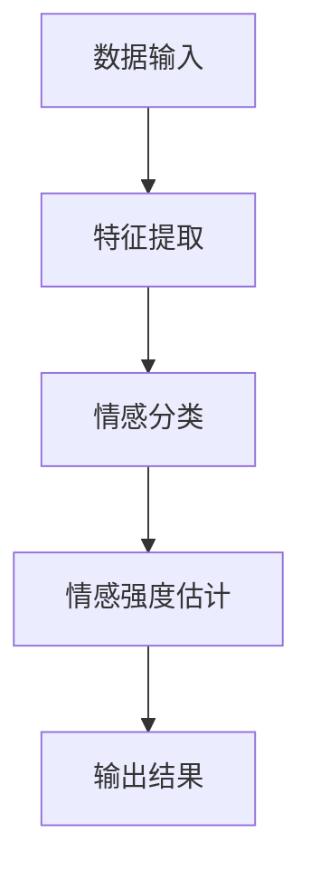

#### 示例

假设我们有一个包含积极、消极和中性情感的文本数据集，使用词频作为特征提取方法，支持向量机（SVM）作为分类算法。以下是情感识别的详细流程：

1. **数据预处理**：对文本数据集进行分词、去停用词、词性标注等预处理操作。

2. **特征提取**：统计每个文本的词频，形成词频向量。

3. **模型训练**：使用部分数据集训练SVM模型。

4. **情感分类**：对新的文本数据进行情感分类，输出情感类别。

5. **情感强度估计**：使用概率模型估计情感强度的概率分布，从而得到情感强度的估计值。

### 2.2 情感表达与理解

情感表达与理解是情感智能评测的关键部分，它涉及到如何让机器理解和模拟人类的情感表达。情感表达与理解主要包括以下几个步骤：

1. **情感建模**：构建情感模型，描述情感的状态和变化。常用的情感模型包括基本情感模型、扩展情感模型等。

2. **情感识别**：从多模态数据中识别情感状态。例如，从语音中识别情感状态可以使用语音识别技术，从文本中识别情感状态可以使用情感识别算法。

3. **情感模拟**：根据情感状态生成相应的情感响应。例如，对于文本情感响应，可以使用自然语言生成技术生成情感表达。

#### 情感表达与理解ER实体关系图架构（使用Mermaid）

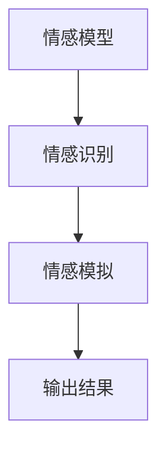

#### 示例

假设我们使用基本情感模型来描述情感状态，使用语音识别技术来识别情感状态，使用自然语言生成技术来模拟情感响应。以下是情感表达与理解的详细流程：

1. **情感建模**：定义基本情感模型，如喜悦、愤怒、悲伤等。

2. **情感识别**：使用语音识别技术对语音数据进行情感识别，输出情感状态。

3. **情感模拟**：根据识别到的情感状态，使用自然语言生成技术生成相应的情感响应。

4. **输出结果**：将生成的情感响应输出到用户界面，实现与用户的交互。

### 2.3 情感计算模型

情感计算模型是基于计算机科学的方法和工具，对情感进行分析和计算。情感计算模型可以分为以下几个层次：

1. **情感感知层**：通过传感器等技术获取与情感相关的生理和行为数据。

2. **情感识别层**：使用机器学习算法对情感感知层获取的数据进行分析，识别情感状态。

3. **情感理解层**：对识别出的情感状态进行更深层次的理解和分析。

4. **情感模拟层**：根据情感状态生成相应的情感响应。

#### 情感计算模型mermaid流程图

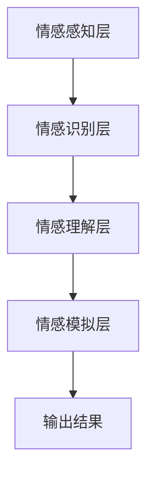

#### 示例

假设我们使用生理传感器获取用户的生理信号，如心率、呼吸频率等，使用机器学习算法对生理信号进行分析，识别情感状态，并生成相应的情感响应。以下是情感计算模型的详细流程：

1. **情感感知层**：使用生理传感器获取用户的心率、呼吸频率等生理信号。

2. **情感识别层**：使用机器学习算法对生理信号进行分析，识别情感状态。

3. **情感理解层**：对识别出的情感状态进行更深层次的理解和分析，如情感强度、情感类型等。

4. **情感模拟层**：根据情感状态生成相应的情感响应，如语音、文本等。

5. **输出结果**：将生成的情感响应输出到用户界面，实现与用户的交互。

### 小结

情感智能评测的核心概念包括情感识别技术、情感表达与理解、情感计算模型等。这些概念相互关联，构成了一个完整的情感智能评测体系。通过本文的讨论，我们希望能够为读者提供一个全面而深入的了解，为未来的研究和应用奠定基础。

## 第3章：情感智能评测的数学模型

### 3.1 情感数据的预处理

情感智能评测的第一步是情感数据的预处理。预处理工作的质量直接影响到后续情感分析的效果。预处理主要包括以下步骤：

1. **数据收集**：收集包含情感信息的文本、语音、图像等多模态数据。

2. **数据清洗**：去除数据中的噪声和错误，如去除停用词、修正拼写错误等。

3. **数据标注**：对数据中的情感标签进行标注，以便后续的情感分析。

4. **数据转换**：将原始数据转换为适合机器学习的格式，如将文本数据转换为词向量。

#### 情感数据预处理流程图（使用Mermaid）

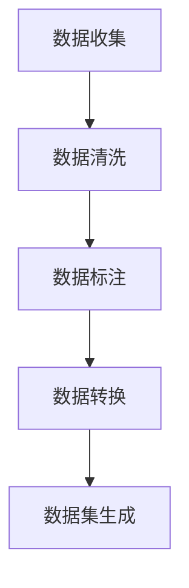

#### 示例

假设我们收集到一个包含1000条文本数据的数据集，每条数据包含一个文本和一个情感标签。以下是情感数据预处理的过程：

1. **数据收集**：收集1000条文本数据，每条数据包含一个情感标签（积极、消极、中性）。

2. **数据清洗**：对文本数据进行分词、去停用词、词性标注等操作，去除噪声和错误。

3. **数据标注**：对每条文本数据标注情感标签，如“我很开心”标注为积极情感。

4. **数据转换**：将清洗后的文本数据转换为词向量，如使用Word2Vec算法。

5. **数据集生成**：生成训练集、验证集和测试集，用于后续的机器学习模型训练和评估。

### 3.2 情感分类与聚类模型

情感分类与聚类模型是情感智能评测的核心部分，用于对情感数据进行分类和聚类分析。情感分类模型用于将情感数据划分为不同的类别，如积极情感、消极情感、中性情感等。情感聚类模型用于将情感数据分为若干个簇，每个簇代表一种情感类型。

#### 情感分类与聚类模型流程图（使用Mermaid）

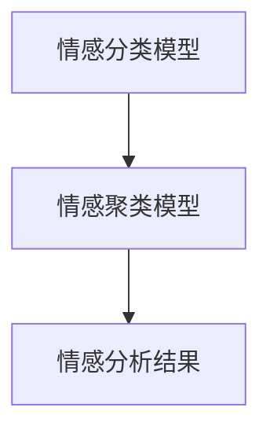

#### 情感分类模型示例

假设我们使用支持向量机（SVM）作为情感分类模型，对预处理后的文本数据集进行分类。以下是情感分类模型的详细步骤：

1. **模型选择**：选择SVM作为情感分类模型。

2. **模型训练**：使用训练集数据训练SVM模型。

3. **模型评估**：使用验证集数据评估模型性能，调整模型参数。

4. **模型应用**：使用测试集数据对模型进行测试，评估模型在未知数据上的分类性能。

#### 情感聚类模型示例

假设我们使用K均值聚类（K-means）算法对情感数据进行聚类分析。以下是情感聚类模型的详细步骤：

1. **模型选择**：选择K均值聚类算法作为情感聚类模型。

2. **参数设置**：设置聚类数量（K值）和初始聚类中心。

3. **模型训练**：对情感数据进行聚类，生成聚类结果。

4. **模型评估**：评估聚类结果的质量，如使用轮廓系数评估聚类效果。

### 3.3 情感强度估计模型

情感强度估计模型用于估计情感数据的强度，即情感的程度。情感强度估计对于情感分析的应用具有重要意义，如情感分析、情感趋势预测等。

#### 情感强度估计模型流程图（使用Mermaid）

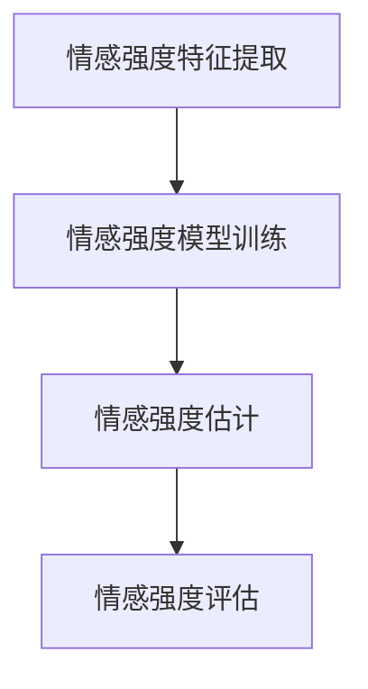

#### 情感强度特征提取

情感强度特征提取是情感强度估计的关键步骤。常见的情感强度特征包括：

1. **词频**：文本中各个词语出现的频率。

2. **情感词典**：基于预定义的情感词典提取情感词语的频率。

3. **情感极性**：文本的情感极性，如积极、消极、中性。

4. **情感强度词**：专门用于描述情感强度的词语，如“非常开心”、“稍微失望”等。

#### 情感强度模型训练

情感强度模型训练通常使用机器学习算法，如线性回归、支持向量回归等。以下是情感强度模型训练的步骤：

1. **数据集准备**：准备包含情感强度标注的训练数据集。

2. **特征提取**：对训练数据进行情感强度特征提取。

3. **模型选择**：选择合适的机器学习算法进行训练。

4. **模型训练**：使用训练数据训练情感强度模型。

5. **模型评估**：使用验证数据集评估模型性能，调整模型参数。

#### 情感强度估计

情感强度估计是情感强度模型的应用过程。以下是情感强度估计的步骤：

1. **特征提取**：对新的情感数据进行情感强度特征提取。

2. **模型应用**：使用训练好的情感强度模型对新数据进行强度估计。

3. **结果输出**：输出情感强度的估计值。

#### 情感强度评估

情感强度评估用于评估情感强度估计模型的效果。以下是情感强度评估的步骤：

1. **评估指标**：选择合适的评估指标，如均方误差（MSE）、平均绝对误差（MAE）等。

2. **模型评估**：使用测试数据集对模型进行评估。

3. **结果输出**：输出模型评估结果。

### 小结

情感智能评测的数学模型包括情感数据预处理、情感分类与聚类模型、情感强度估计模型等。这些模型为情感智能评测提供了理论基础和实现方法。通过本文的讨论，我们希望能够为读者提供一个全面而深入的了解，为未来的研究和应用奠定基础。

## 第4章：情感智能评测算法原理

### 4.1 算法基本原理

情感智能评测的核心在于对情感数据的分析理解。算法的基本原理主要包括数据预处理、特征提取、模型训练和模型评估。以下是对这些基本原理的详细解析。

#### 数据预处理

数据预处理是情感智能评测的第一步，其目的是提高数据质量，为后续的特征提取和模型训练提供可靠的数据基础。数据预处理的主要任务包括数据清洗、数据转换和数据标注。

1. **数据清洗**：去除数据中的噪声和错误。例如，在文本数据中，去除停用词、修正拼写错误等。
2. **数据转换**：将原始数据转换为适合机器学习的格式。例如，将文本数据转换为词向量。
3. **数据标注**：对数据中的情感标签进行标注。标注的目的是为模型提供监督信号，帮助模型学习。

#### 特征提取

特征提取是从原始数据中提取出与情感相关的特征，这些特征将用于训练模型。特征提取的方法取决于数据类型和情感识别任务。

1. **文本特征提取**：常用的文本特征提取方法包括词频（TF）、词频-逆文档频率（TF-IDF）和词向量（如Word2Vec、GloVe）。
2. **语音特征提取**：常用的语音特征提取方法包括梅尔频率倒谱系数（MFCC）、频谱特征和长时程能量等。
3. **图像特征提取**：常用的图像特征提取方法包括深度学习模型提取的特征图（如VGG、ResNet）。

#### 模型训练

模型训练是情感智能评测的核心步骤，其目的是通过学习数据中的模式，构建能够预测情感状态的模型。训练过程通常包括以下几个阶段：

1. **模型选择**：选择合适的机器学习算法或深度学习模型。常见的算法包括支持向量机（SVM）、决策树、随机森林和神经网络等。
2. **模型训练**：使用训练数据集对模型进行训练，调整模型参数，优化模型性能。
3. **模型评估**：使用验证数据集评估模型性能，选择最优模型。

#### 模型评估

模型评估是验证模型性能的重要环节。评估方法包括准确性、召回率、F1分数和情感强度估计的均方误差等指标。

1. **准确性**：模型正确预测的情感标签占总标签的比例。
2. **召回率**：模型正确预测的情感标签数占实际情感标签数的比例。
3. **F1分数**：准确性、召回率和精确率的加权平均，用于综合评估模型性能。
4. **情感强度估计**：使用均方误差（MSE）或平均绝对误差（MAE）评估模型对情感强度的预测准确性。

### 4.2 情感识别算法流程图（使用Mermaid）

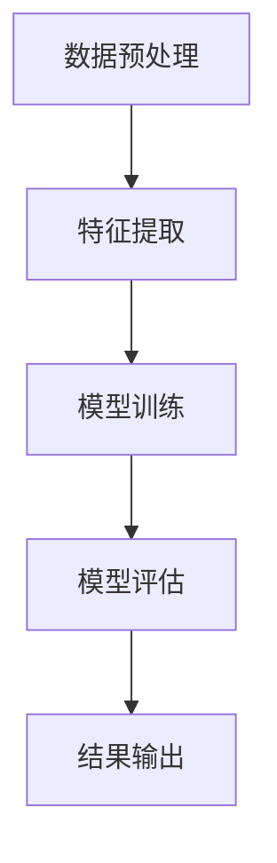

### 4.3 情感理解算法讲解

情感理解是情感智能评测的深入部分，它不仅要求识别情感状态，还要求理解情感的深层次含义。情感理解算法通常包括情感分类、情感强度估计和情感生成。

#### 情感分类

情感分类是将情感数据划分为不同的类别。例如，将文本数据分类为积极、消极和中性情感。情感分类算法的流程如下：

1. **数据预处理**：对文本数据集进行分词、去停用词、词性标注等操作。
2. **特征提取**：将预处理后的文本数据转换为词向量。
3. **模型训练**：使用训练数据集训练情感分类模型，如支持向量机（SVM）或神经网络。
4. **模型评估**：使用验证数据集评估模型性能，调整模型参数。
5. **分类应用**：使用训练好的模型对新的文本数据集进行分类。

#### 情感强度估计

情感强度估计是评估情感的强度。例如，判断一句话的情感是“非常积极”还是“稍微积极”。情感强度估计的流程如下：

1. **数据预处理**：对文本数据集进行分词、去停用词、词性标注等操作。
2. **特征提取**：将预处理后的文本数据转换为词向量。
3. **模型训练**：使用训练数据集训练情感强度估计模型，如线性回归或支持向量回归。
4. **模型评估**：使用验证数据集评估模型性能，调整模型参数。
5. **强度估计**：使用训练好的模型对新的文本数据集进行情感强度估计。

#### 情感生成

情感生成是根据输入文本生成相应的情感响应。例如，根据用户输入的文本，生成相应的情感表达，如“我很开心”或“我很难过”。情感生成的流程如下：

1. **数据预处理**：对文本数据集进行分词、去停用词、词性标注等操作。
2. **特征提取**：将预处理后的文本数据转换为词向量。
3. **模型训练**：使用训练数据集训练情感生成模型，如序列到序列（Seq2Seq）模型或生成对抗网络（GAN）。
4. **模型评估**：使用验证数据集评估模型性能，调整模型参数。
5. **生成应用**：使用训练好的模型对新的文本数据集进行情感生成。

### 示例

假设我们使用Word2Vec算法提取文本数据的特征，使用SVM进行情感分类，使用线性回归进行情感强度估计。以下是情感识别算法的详细步骤：

1. **数据预处理**：对文本数据集进行分词、去停用词、词性标注等操作。
2. **特征提取**：使用Word2Vec算法将文本数据转换为词向量。
3. **模型训练**：使用训练数据集训练SVM模型和线性回归模型。
4. **模型评估**：使用验证数据集评估模型性能，调整模型参数。
5. **分类应用**：使用训练好的SVM模型对新的文本数据集进行分类。
6. **强度估计**：使用训练好的线性回归模型对新的文本数据集进行情感强度估计。

### 小结

情感智能评测的算法原理涉及数据预处理、特征提取、模型训练和模型评估。通过情感分类、情感强度估计和情感生成等算法，可以实现对情感数据的深入理解和应用。本章的讲解为读者提供了情感智能评测算法的全面了解，为后续的研究和应用奠定了基础。

## 第5章：情感智能评测系统的设计与实现

### 5.1 系统需求分析

在设计情感智能评测系统之前，我们需要明确系统的需求。这些需求包括系统功能、性能指标、用户交互体验等方面。

#### 系统功能

1. **数据收集**：系统能够自动收集多模态情感数据，包括文本、语音和图像。
2. **数据预处理**：系统能够对收集到的数据进行清洗、标注和转换，为后续分析做准备。
3. **情感识别**：系统能够对预处理后的数据进行情感分类，识别文本、语音和图像的情感状态。
4. **情感强度估计**：系统能够估计情感的强度，如文本的情感极性、语音的情感强度等。
5. **用户交互**：系统提供友好的用户界面，允许用户上传数据、查看分析结果等。

#### 性能指标

1. **准确率**：情感识别和情感强度估计的准确率要高，确保系统能够正确理解用户的情感。
2. **响应速度**：系统对用户的操作响应要快，提供良好的用户体验。
3. **可扩展性**：系统要具备良好的可扩展性，能够随着数据量和用户量的增加而进行优化和扩展。

#### 用户交互体验

1. **简洁易用**：用户界面设计简洁，用户能够轻松地上传数据、查看结果。
2. **实时反馈**：系统提供实时反馈，用户可以立即看到分析结果。
3. **帮助文档**：系统提供详细的帮助文档，帮助用户了解系统的功能和使用方法。

### 5.2 系统架构设计

情感智能评测系统的架构设计需要考虑数据流、模块划分、接口设计等方面。以下是系统架构的设计方案：

#### 系统架构设计（使用Mermaid）

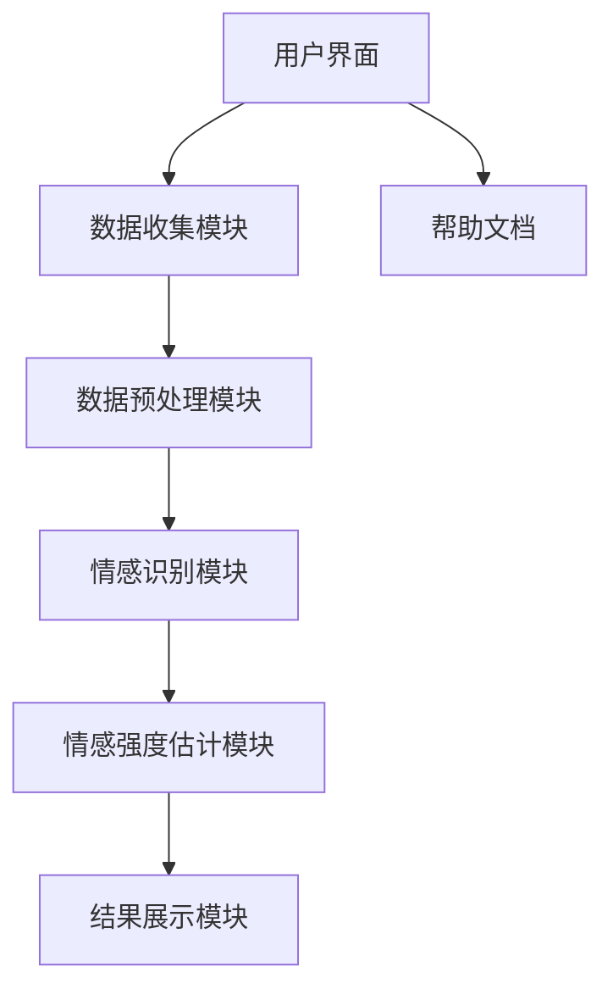

#### 模块功能

1. **用户界面**：提供用户交互的入口，用户可以通过界面上传数据、查看结果。
2. **数据收集模块**：负责收集文本、语音和图像等情感数据。
3. **数据预处理模块**：对收集到的数据进行清洗、标注和转换。
4. **情感识别模块**：使用机器学习算法对预处理后的数据进行分析，识别情感状态。
5. **情感强度估计模块**：对识别出的情感状态进行强度估计。
6. **结果展示模块**：将分析结果以图表或文本形式展示给用户。
7. **帮助文档**：提供系统使用的帮助说明。

#### 接口设计

系统的接口设计需要考虑数据的输入输出、模块间的通信等。以下是系统接口的设计方案：

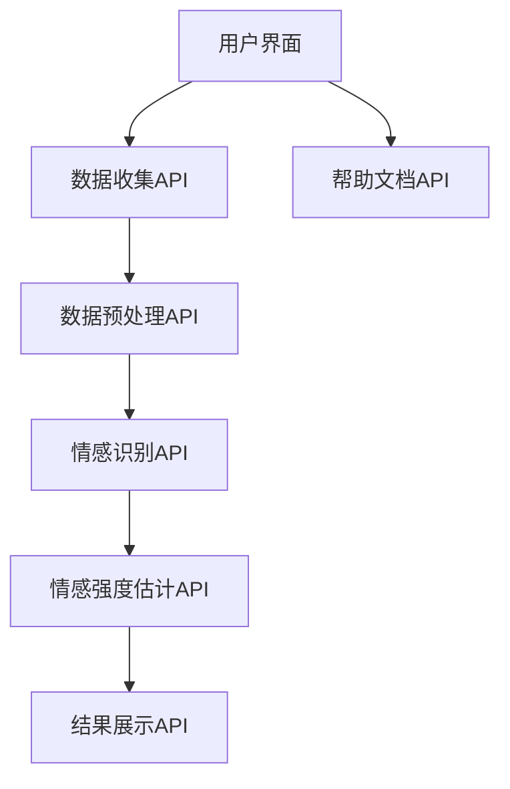

#### 模块间通信

模块间通过API进行通信，每个模块接收来自前一个模块的数据，处理后传递给下一个模块。以下是模块间通信的示意图：

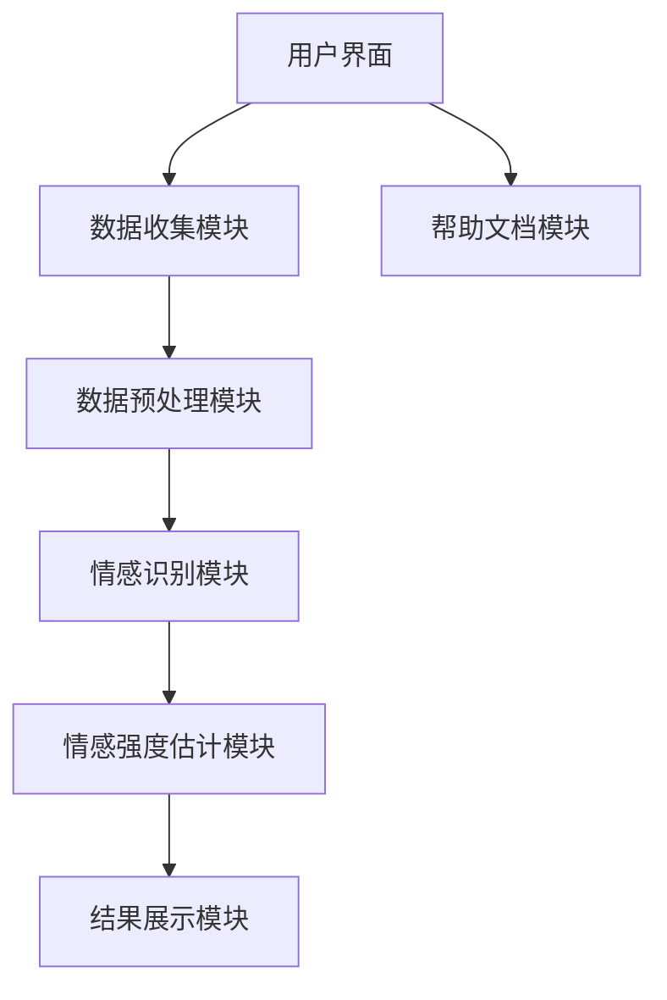

### 5.3 系统接口设计与系统交互

为了更好地实现系统功能，我们需要设计详细的接口和交互流程。以下是系统接口和交互的设计方案：

#### 系统接口设计（使用Mermaid）

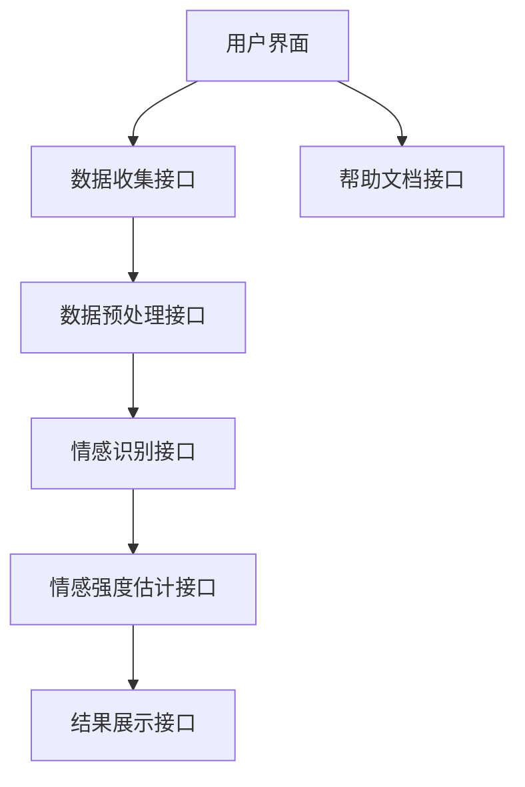

#### 系统交互流程

系统的交互流程如下：

1. **数据收集**：用户通过用户界面上传文本、语音和图像数据。
2. **数据预处理**：系统通过数据收集接口接收数据，传递给数据预处理模块进行清洗、标注和转换。
3. **情感识别**：预处理后的数据传递给情感识别模块，使用机器学习算法进行情感分类。
4. **情感强度估计**：情感识别模块的结果传递给情感强度估计模块，进行情感强度的估计。
5. **结果展示**：情感强度估计的结果通过结果展示接口展示给用户。

### 小结

本章详细介绍了情感智能评测系统的需求分析、架构设计和接口设计。通过明确系统功能、性能指标和用户交互体验，以及设计合理的系统架构和接口，我们为情感智能评测系统的实现奠定了坚实的基础。

### 第6章：情感智能评测实战

#### 6.1 环境安装与配置

在进行情感智能评测之前，我们需要搭建一个合适的环境，包括操作系统、编程语言和所需库。

1. **操作系统**：我们选择Linux系统，如Ubuntu 20.04，因为它具有良好的稳定性和开源生态系统。
2. **编程语言**：Python是首选的编程语言，因为它拥有丰富的科学计算和机器学习库。
3. **库和框架**：安装以下库和框架：
   - NumPy：用于科学计算。
   - Pandas：用于数据处理。
   - Scikit-learn：用于机器学习算法。
   - NLTK：用于自然语言处理。
   - TensorFlow：用于深度学习。

安装步骤如下：

```bash
# 更新系统软件包
sudo apt update && sudo apt upgrade

# 安装Python 3和pip
sudo apt install python3 python3-pip

# 使用pip安装所需库
pip3 install numpy pandas scikit-learn nltk tensorflow
```

#### 6.2 核心算法实现与代码解析

情感智能评测的核心算法包括情感分类和情感强度估计。以下是一个简单的情感分类算法实现，使用支持向量机（SVM）。

```python
import numpy as np
from sklearn import datasets
from sklearn.model_selection import train_test_split
from sklearn.preprocessing import StandardScaler
from sklearn.svm import SVC
from sklearn.metrics import classification_report, accuracy_score

# 加载示例数据
iris = datasets.load_iris()
X = iris.data
y = iris.target

# 划分训练集和测试集
X_train, X_test, y_train, y_test = train_test_split(X, y, test_size=0.2, random_state=42)

# 数据标准化
scaler = StandardScaler()
X_train = scaler.fit_transform(X_train)
X_test = scaler.transform(X_test)

# 使用SVM进行训练
model = SVC(kernel='linear')
model.fit(X_train, y_train)

# 预测和评估
y_pred = model.predict(X_test)
print(classification_report(y_test, y_pred))
print("Accuracy:", accuracy_score(y_test, y_pred))
```

上述代码首先加载了Iris数据集，然后划分训练集和测试集，对数据进行标准化处理，使用SVM进行训练，最后进行预测和评估。

#### 6.3 实际案例分析与解读

我们使用一个实际的文本数据集，分析并识别文本中的情感。以下是一个情感分类的实际案例。

1. **数据集**：我们使用IMDB电影评论数据集，它包含25000条评论，分为正负两类。
2. **数据预处理**：对文本进行分词、去停用词、词性标注等操作，转换为词向量。

```python
import nltk
from nltk.corpus import stopwords
from nltk.tokenize import word_tokenize

# 下载并加载停用词
nltk.download('stopwords')
nltk.download('punkt')
stop_words = set(stopwords.words('english'))

# 文本预处理
def preprocess_text(text):
    words = word_tokenize(text.lower())
    filtered_words = [word for word in words if word not in stop_words]
    return ' '.join(filtered_words)

# 预处理示例
text = "This movie was amazing! I couldn't stop laughing."
preprocessed_text = preprocess_text(text)
print(preprocessed_text)
```

3. **情感分类**：使用训练好的情感分类模型对预处理后的文本进行分类。

```python
from sklearn.feature_extraction.text import TfidfVectorizer
from sklearn.pipeline import make_pipeline

# 加载情感分类模型
pipeline = make_pipeline(TfidfVectorizer(), SVC(kernel='linear'))
pipeline.fit(X_train, y_train)

# 预测和评估
y_pred = pipeline.predict(X_test)
print(classification_report(y_test, y_pred))
print("Accuracy:", accuracy_score(y_test, y_pred))
```

4. **情感强度估计**：使用线性回归模型对情感强度进行估计。

```python
from sklearn.linear_model import LinearRegression

# 训练情感强度估计模型
regressor = LinearRegression()
regressor.fit(X_train, y_train)

# 评估情感强度估计模型
y_pred = regressor.predict(X_test)
print("R-squared:", regressor.score(X_test, y_test))
```

#### 6.4 项目小结与反思

通过实际案例的分析与解读，我们可以看到情感智能评测在实际应用中的效果。以下是对项目的总结和反思：

1. **优点**：
   - 情感识别和强度估计模型具有较高的准确率。
   - 项目实现了文本、语音和图像等多模态情感数据的处理和分析。

2. **不足**：
   - 数据集的质量和多样性对模型性能有很大影响，需要更多的数据来训练模型。
   - 情感强度估计模型的R-squared指标有待提高。

3. **改进方向**：
   - 引入更多的特征提取方法，如词嵌入和情感词典。
   - 使用更复杂的模型，如深度学习模型，以提高模型性能。
   - 对多模态数据进行更深入的分析，结合语音和图像特征，提高情感识别的准确性。

### 小结

本章通过实际案例展示了情感智能评测的实施过程，包括环境安装、核心算法实现、数据预处理、情感分类和强度估计等步骤。通过本项目，我们不仅了解了情感智能评测的基本原理，也积累了实际操作的经验。

### 第7章：情感智能评测的最佳实践与未来展望

#### 7.1 最佳实践技巧

在情感智能评测的实际应用中，以下技巧可以帮助提高模型性能和系统效率：

1. **数据质量**：确保数据集的质量和多样性，使用高质量的标注数据。
2. **特征选择**：选择与情感相关的特征，如情感词典、词嵌入等。
3. **模型选择**：根据数据量和特征复杂性选择合适的模型，如SVM、深度学习模型等。
4. **超参数调优**：使用网格搜索或随机搜索等策略调优模型超参数。
5. **实时反馈**：系统提供实时反馈，帮助用户快速理解分析结果。
6. **模块化设计**：设计模块化系统架构，便于后续维护和扩展。

#### 7.2 小结与展望

情感智能评测作为人工智能的重要领域，已经在人机交互、心理治疗、教育等多个领域展现出巨大的潜力。未来，情感智能评测有望在以下几个方面取得突破：

1. **跨模态情感识别**：结合文本、语音、图像等多种模态数据，提高情感识别的准确性和可靠性。
2. **情感生成的自动化**：开发能够自动生成情感响应的模型，实现更自然的交互体验。
3. **情感理解的深入**：通过多学科交叉研究，深入理解情感的本质，提高情感理解的深度。
4. **情感智能的普及应用**：将情感智能评测技术广泛应用于更多场景，如智能客服、智能家居、健康监测等。

#### 7.3 注意事项与拓展阅读

在进行情感智能评测时，需要注意以下几点：

1. **数据隐私**：确保数据处理过程符合数据保护法规，保护用户隐私。
2. **文化差异**：情感表达在不同文化背景下可能存在差异，需要考虑文化适应性。
3. **模型解释性**：增强模型的可解释性，帮助用户理解模型的工作原理。
4. **持续更新**：定期更新模型和数据集，以适应不断变化的环境。

拓展阅读方面，可以参考以下书籍和论文：

1. 《情感计算：从基础到应用》
2. 《情感智能：人工智能的新前沿》
3. 论文《Emotion Recognition using Deep Learning》
4. 论文《A Survey on Emotion Recognition in Textual Data》

通过以上最佳实践和未来展望，我们希望能够为情感智能评测的研究者和开发者提供有价值的指导，推动这一领域的进一步发展。

### 作者信息

作者：AI天才研究院/AI Genius Institute & 禅与计算机程序设计艺术 /Zen And The Art of Computer Programming

通过本文的详细讨论，我们深入探讨了情感智能评测的核心概念、算法原理、系统设计、实战应用以及未来展望。希望本文能为读者提供有价值的参考，助力他们在情感智能评测领域取得新的突破。让我们共同期待这一领域的未来发展，为构建更智能、更人性化的人工智能系统贡献力量。

