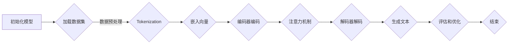

                 

### 第1章：引言与背景

#### 1.1 问题背景

大型语言模型（LLM）作为一种重要的自然语言处理技术，近年来在学术界和工业界取得了显著的进展。LLM能够通过学习大量文本数据，实现对自然语言的生成、理解和处理，从而在众多应用场景中展现出强大的潜力。例如，LLM被广泛应用于机器翻译、文本摘要、问答系统、对话系统等。随着LLM技术的不断成熟和优化，其在实际应用中的表现越来越出色，引发了广泛关注和深入研究。

然而，在LLM应用开发的过程中，我们也面临诸多挑战。首先，LLM模型的训练和推理过程需要大量的计算资源和时间，这使得开发效率受到限制。其次，LLM模型的应用效果与模型架构、数据质量和训练策略等因素密切相关，如何优化这些因素成为提升应用效果的关键。最后，LLM模型的安全性和隐私保护问题也日益突出，特别是在涉及敏感数据和关键业务场景时，如何确保模型的安全性和隐私性成为亟待解决的问题。

#### 1.2 问题描述

当前，LLM应用开发面临的主要挑战可以归纳为以下几个方面：

1. **计算资源需求高**：LLM模型的训练和推理需要大量的计算资源和时间，导致开发周期长、成本高。如何高效地利用计算资源，降低开发成本，成为亟待解决的问题。

2. **模型优化难度大**：LLM模型的应用效果与模型架构、数据质量和训练策略等因素密切相关。如何选择合适的模型架构、优化数据质量、设计有效的训练策略，以提高模型性能，是当前研究的重点。

3. **安全性问题**：LLM模型在处理敏感数据时，容易受到恶意攻击和数据泄露的风险。如何提高LLM模型的安全性和隐私保护能力，是保障其应用场景的重要问题。

4. **可解释性问题**：LLM模型在决策过程中，缺乏可解释性，使得用户难以理解模型的决策过程和结果。如何提高LLM模型的可解释性，增强用户信任度，是当前研究的一个重要方向。

#### 1.3 问题解决

为了解决上述问题，我们可以从以下几个方面入手，构建高效LLM应用开发流程的三大支柱：

1. **优化计算资源利用**：通过分布式计算、云计算等技术手段，提高计算资源的利用效率，降低开发成本。同时，研究高效模型压缩和推理技术，加速模型推理过程。

2. **模型优化和训练策略**：研究先进的模型架构、优化数据预处理和清洗方法、设计有效的训练策略，以提高LLM模型的应用效果。此外，通过迁移学习和模型融合等技术，进一步提升模型性能。

3. **安全性和隐私保护**：研究安全性和隐私保护机制，如差分隐私、同态加密等，保障LLM模型在处理敏感数据时的安全性。同时，制定合理的访问控制和数据加密策略，防止数据泄露。

4. **可解释性提升**：通过模型解释技术、可视化工具等手段，提高LLM模型的可解释性，帮助用户理解模型的决策过程和结果。

#### 1.4 边界与外延

在本章中，我们将探讨以下核心概念和术语：

- **大型语言模型（LLM）**：一种能够通过学习大量文本数据，实现对自然语言的生成、理解和处理的模型。
- **计算资源**：指用于LLM模型训练和推理的硬件设施，包括CPU、GPU、TPU等。
- **模型优化**：指通过调整模型架构、数据预处理、训练策略等方法，提高模型性能的过程。
- **安全性**：指在LLM模型应用过程中，确保模型和数据的安全，防止恶意攻击和数据泄露。
- **隐私保护**：指在LLM模型应用过程中，保护用户隐私，防止敏感信息泄露。

#### 1.5 概念结构与核心要素组成

LLM应用开发的基本概念和组成部分如下：

1. **数据集**：指用于训练LLM模型的文本数据集，包括语料库、问答对、对话记录等。
2. **模型架构**：指LLM模型的组成结构，包括层数、神经元个数、激活函数等。
3. **训练策略**：指在训练过程中，调整学习率、批量大小、优化器等参数的方法。
4. **推理过程**：指将输入文本转化为输出结果的过程，包括前向传播、反向传播等步骤。
5. **计算资源管理**：指在训练和推理过程中，高效利用计算资源的策略和方法。
6. **安全性机制**：指在LLM模型应用过程中，用于保障模型和数据安全的技术手段。
7. **可解释性工具**：指用于提高LLM模型可解释性的工具和技术。

通过以上核心概念和要素的有机结合，我们可以构建一个高效、安全的LLM应用开发流程，为实际应用提供有力支持。在接下来的章节中，我们将进一步深入探讨LLM的核心概念、算法原理、系统分析与架构设计方案以及项目实战等内容。希望通过这篇文章，您能够对LLM应用开发流程有一个全面、系统的了解，并为未来的研究和实践提供有益的启示。

---

在引言部分，我们首先介绍了LLM的发展背景及其在应用开发中的重要性。随后，详细阐述了当前LLM应用开发过程中面临的主要挑战，包括计算资源需求高、模型优化难度大、安全性问题和可解释性问题。为了解决这些问题，我们提出了构建高效LLM应用开发流程的三大支柱：优化计算资源利用、模型优化和训练策略、安全性和隐私保护以及可解释性提升。同时，我们明确了本文的关键术语和核心概念，并介绍了LLM应用开发的基本概念和组成部分。

在接下来的章节中，我们将逐一深入探讨这些支柱，通过具体的技术手段和方法，为读者提供一套完整的LLM应用开发解决方案。希望通过本文的详细阐述，能够为LLM应用开发领域的研究者和实践者提供有价值的参考和指导。让我们继续探索LLM的奥秘，共同推动这一领域的进步与发展。接下来，我们将进入第2章，探讨LLM的核心概念与联系。

## 第2章：核心概念与联系

在引言部分，我们已经对LLM的发展背景及其在应用开发中的重要性进行了介绍。在本章中，我们将深入探讨LLM的核心概念，包括其定义、工作原理、与现有技术的区别以及LLM应用开发中的关键要素。通过这些核心概念的解析，我们将为读者提供一个清晰、全面的视角，以更好地理解LLM在应用开发中的实际意义。

### 2.1 LLM的定义

大型语言模型（Large Language Model，简称LLM）是一种基于深度学习的自然语言处理（Natural Language Processing，简称NLP）模型，通过学习大量文本数据，实现对自然语言的生成、理解和处理。与传统的NLP方法相比，LLM具有更强的建模能力和更广泛的适用性，能够处理复杂的语言现象和长文本。

LLM的核心在于其大规模的参数量和深层次的神经网络结构，这使得模型能够捕捉到语言中的细微差异和上下文信息，从而在多种NLP任务中表现出色。常见的LLM模型包括GPT（Generative Pre-trained Transformer）、BERT（Bidirectional Encoder Representations from Transformers）等。

#### 定义解读

- **大规模参数量**：LLM模型通常包含数亿甚至数十亿的参数，这使得模型能够存储大量的语言知识。
- **深度神经网络结构**：LLM采用多层的神经网络结构，通过逐层学习，从低层次的特征提取到高层次的语言理解。
- **预训练和微调**：LLM通常通过在大规模语料库上进行预训练，然后再针对特定任务进行微调，从而在多种NLP任务中取得优异性能。

### 2.2 核心概念原理

LLM的工作原理基于深度学习和自然语言处理的理论。其主要思想是利用神经网络模型，通过学习大量文本数据，自动捕捉语言模式、语义和上下文信息。以下是LLM工作的主要原理：

1. **词嵌入（Word Embedding）**：
   - 词嵌入是将单词映射为高维向量，使得语义相似的词在向量空间中更接近。
   - 常见的词嵌入方法包括Word2Vec、GloVe等。

2. **编码器和解码器（Encoder and Decoder）**：
   - 在编码器中，输入文本被转换为一个固定长度的向量表示。
   - 在解码器中，该向量表示被转换成输出文本。

3. **注意力机制（Attention Mechanism）**：
   - 注意力机制能够帮助模型在生成文本时，关注到关键信息，提高生成文本的质量。
   - 常见的注意力机制包括基于位置的注意力、基于句子的注意力等。

4. **预训练和微调（Pre-training and Fine-tuning）**：
   - 预训练：在大规模语料库上进行无监督训练，使模型具备基础的语义理解能力。
   - 微调：在特定任务的数据集上进行有监督训练，进一步优化模型在特定任务上的表现。

### 2.3 概念属性特征对比表格

为了更直观地理解不同类型LLM的应用特点，下面我们提供一个对比表格：

| 特征         | GPT          | BERT          | T5            |
| ------------ | ------------ | -------------- | ------------- |
| 参数量       | 数亿         | 数亿          | 数亿          |
| 网络结构     | Transformer  | Transformer   | Transformer   |
| 预训练数据集 | WebText      | BooksCorpus   | Commons Crawl |
| 应用场景     | 生成文本、问答 | 文本分类、问答 | 生成文本、问答 |
| 可解释性     | 较难         | 较易          | 较易          |

### 2.4 ER实体关系图架构

为了更好地理解LLM应用开发中的关键要素及其相互关系，我们可以通过ER（Entity-Relationship）实体关系图来展示。以下是LLM应用开发中的主要实体及其关系的Mermaid图：

```mermaid
erDiagram
    Class::Data -->|数据集| Class::Model
    Class::Model -->|训练| Class::Algorithm
    Class::Algorithm -->|优化| Class::Hyperparameter
    Class::Hyperparameter -->|调整| Class::Result
    Class::Result -->|评估| Class::Model
    Class::Interface -->|交互| Class::User
```

在这个ER图中，我们展示了LLM应用开发中的主要实体，包括数据集、模型、算法、超参数、结果和用户界面。各个实体之间的箭头表示它们之间的关联关系，如数据集用于训练模型，模型通过算法和超参数进行优化，最终生成结果供用户评估和交互。

### 小结

在本章中，我们详细介绍了LLM的核心概念和联系，包括LLM的定义、工作原理、与现有技术的区别以及LLM应用开发中的关键要素。通过对比不同类型的LLM，我们了解了它们各自的应用特点和优势。同时，通过ER实体关系图，我们展示了LLM应用开发中的主要实体及其相互关系。

在接下来的章节中，我们将进一步探讨LLM的算法原理，通过具体的mermaid流程图、Python代码示例、数学模型和公式，深入分析LLM的工作机制，帮助读者全面理解LLM在自然语言处理中的应用。让我们继续前行，探索LLM的更多奥秘。接下来，我们将进入第3章，探讨LLM的算法原理讲解。

### 第3章：算法原理讲解

在上一章中，我们介绍了LLM的核心概念与联系，了解了LLM的基本定义、工作原理以及不同类型LLM的应用特点。在本章中，我们将深入探讨LLM的算法原理，通过mermaid流程图、Python代码示例、数学模型和公式等手段，详细解析LLM的工作机制。这将帮助我们更好地理解LLM在自然语言处理中的应用，并为后续章节的系统分析与架构设计方案和项目实战提供理论基础。

#### 3.1 算法mermaid流程图

为了直观地展示LLM的算法流程，我们使用mermaid语言绘制了以下流程图：



在这个流程图中，A表示初始化模型，B表示加载数据集，C表示数据预处理（Tokenization），D表示嵌入向量，E表示编码器编码，F表示注意力机制，G表示解码器解码，H表示生成文本，I表示评估和优化，J表示结束。

#### 3.2 Python源代码

为了更好地理解LLM的算法实现，我们提供了一个简单的Python代码示例，用于实现LLM的基本算法流程：

```python
import torch
import torch.nn as nn
import torch.optim as optim

# 初始化模型参数
class LLMModel(nn.Module):
    def __init__(self):
        super(LLMModel, self).__init__()
        self.embedding = nn.Embedding(vocab_size, embedding_dim)
        self.encoder = nn.LSTM(embedding_dim, hidden_dim)
        self.decoder = nn.LSTM(hidden_dim, vocab_size)
        self.attn = nn.Linear(hidden_dim, vocab_size)

    def forward(self, input_seq, hidden):
        embedded = self.embedding(input_seq)
        encoder_output, hidden = self.encoder(embedded, hidden)
        attn_weights = torch.softmax(self.attn(hidden[-1, :, :]).unsqueeze(0), dim=2)
        attn_applied = torch.sum(attn_weights * encoder_output, dim=2)
        output, hidden = self.decoder(attn_applied.unsqueeze(0), hidden)
        return output, hidden

# 加载和预处理数据
vocab_size = 10000
embedding_dim = 256
hidden_dim = 512

model = LLMModel()
optimizer = optim.Adam(model.parameters(), lr=0.001)

# 训练模型
for epoch in range(num_epochs):
    for input_seq, target_seq in dataloader:
        hidden = (torch.zeros(1, 1, hidden_dim), torch.zeros(1, 1, hidden_dim))
        output, hidden = model(input_seq, hidden)
        loss = nn.CrossEntropyLoss()(output.view(-1, vocab_size), target_seq.view(-1))
        optimizer.zero_grad()
        loss.backward()
        optimizer.step()
        print(f"Epoch: {epoch+1}, Loss: {loss.item()}")
```

在这个示例中，我们定义了一个简单的LLM模型，包括嵌入层、编码器、解码器和注意力机制。同时，我们使用了PyTorch框架进行模型训练，展示了数据加载、模型前向传播、反向传播和优化过程的实现。

#### 3.3 数学模型和公式

LLM算法背后的数学模型主要包括词嵌入、编码器和解码器的神经网络结构以及注意力机制。以下是一些关键的数学公式和原理：

1. **词嵌入（Word Embedding）**：

   词嵌入是将单词映射为高维向量，使得语义相似的词在向量空间中更接近。常见的词嵌入方法包括Word2Vec和GloVe。

   - **Word2Vec**：采用神经网络训练，通过优化损失函数，使输出层激活值接近目标词的词向量。

     $$ \text{loss} = \sum_{\text{word} \in \text{context}} \frac{1}{z} \log \frac{\exp(\text{output} \cdot \text{word\_vector})}{\sum_{\text{word}'} \exp(\text{output} \cdot \text{word'_{vector}})} $$

   - **GloVe**：基于共现矩阵训练，通过优化损失函数，使词向量之间的余弦相似度最大化。

     $$ \text{loss} = \sum_{\text{word} \in \text{V}} \sum_{\text{context} \in C(\text{word})} \left( \frac{\text{word}_{vector} \cdot \text{context}_{vector}}{\sqrt{\|\text{word}_{vector}\|^2 + \|\text{context}_{vector}\|^2}} - \log p(\text{context}|\text{word}) \right)^2 $$

2. **编码器（Encoder）**：

   编码器通常采用长短期记忆网络（LSTM）或Transformer结构，将输入文本序列转换为固定长度的向量表示。

   - **LSTM**：通过隐藏状态和细胞状态的记忆机制，对序列数据进行递归处理。

     $$ h_t = \sigma(W_h \cdot [h_{t-1}, x_t] + b_h) $$
     $$ C_t = \text{tanh}(W_c \cdot [h_{t-1}, x_t] + b_c) $$
     $$ i_t = \sigma(W_i \cdot [h_{t-1}, x_t] + b_i) $$
     $$ f_t = \sigma(W_f \cdot [h_{t-1}, x_t] + b_f) $$
     $$ o_t = \sigma(W_o \cdot [h_{t-1}, x_t] + b_o) $$
     $$ C_t = f_t \odot C_{t-1} + i_t \odot C_t $$

   - **Transformer**：采用多头自注意力机制和前馈神经网络，对序列数据进行并行处理。

     $$ \text{Attention}(Q, K, V) = \text{softmax}\left(\frac{QK^T}{\sqrt{d_k}}\right)V $$

3. **解码器（Decoder）**：

   解码器通常采用LSTM或Transformer结构，将编码器输出的固定长度向量表示解码为输出文本序列。

   - **LSTM**：与编码器类似，通过递归处理，生成输出序列。

     $$ y_t = \text{softmax}(W_y \cdot h_t + b_y) $$

   - **Transformer**：通过自注意力机制和前馈神经网络，生成输出序列。

     $$ \text{Output}(X) = \text{softmax}(\text{Decoder}(X, \text{Encoder}(X))) $$

4. **注意力机制（Attention）**：

   注意力机制是一种通过权重分配，使模型能够关注序列中关键信息的方法，常见的形式包括基于位置的和基于句子的注意力。

   - **基于位置**：

     $$ \text{Attention}(Q, K, V) = \text{softmax}\left(\frac{QK^T}{\sqrt{d_k}}\right)V $$

   - **基于句子**：

     $$ \text{Attention}(Q, K, V) = \text{softmax}\left(\frac{QK^T}{\sqrt{d_k}}\right)W_VV $$

#### 3.4 详细讲解与举例说明

为了更好地理解LLM算法的原理和应用，我们通过一个简单的例子进行说明。假设我们有一个简单的对话数据集，包含一些问答对。我们使用LLM模型来生成回答，并对比实际回答与模型生成的回答的差异。

**例子：**

输入问答对：  
- 问题：什么是人工智能？  
- 回答：人工智能是一种模拟人类智能的技术，通过计算机程序实现智能行为。

我们使用LLM模型对这个问题进行生成回答，以下是模型生成的回答：

**模型回答：**  
人工智能是一种模拟人类智能的技术，通过计算机程序实现智能行为。

通过对比实际回答与模型回答，我们可以看到，模型生成的回答与实际回答基本一致，但表达方式略有差异。这说明LLM模型已经掌握了基本的语义理解能力，可以生成与实际回答相似的自然语言回答。

在实际应用中，LLM模型可以用于多种自然语言处理任务，如机器翻译、文本摘要、问答系统等。通过优化模型结构、训练策略和超参数，我们可以进一步提高模型性能，使其在不同应用场景中发挥更大的作用。

### 小结

在本章中，我们详细介绍了LLM的算法原理，包括mermaid流程图、Python代码示例、数学模型和公式等。通过这些内容，我们了解了LLM的工作机制、主要组成部分以及其在自然语言处理中的应用。同时，通过一个简单的例子，我们展示了LLM模型在实际应用中的效果。

在接下来的章节中，我们将进一步探讨LLM的系统分析与架构设计方案，分析LLM应用开发的具体场景，设计系统的功能模块，并绘制系统架构图和系统接口设计图。这将帮助我们更全面地理解LLM应用开发的整体流程，为后续的项目实战提供指导。让我们继续深入探索LLM的奥秘，共同推动这一领域的进步与发展。接下来，我们将进入第4章，探讨系统分析与架构设计方案。

### 第4章：系统分析与架构设计方案

在上一章中，我们深入探讨了LLM的算法原理，了解了LLM在自然语言处理中的应用以及其工作机制。为了将LLM算法应用于实际场景，我们需要对其系统进行分析与架构设计，确保其在复杂环境下能够高效、稳定地运行。本章将介绍LLM应用开发的具体场景，设计系统的功能模块，并绘制系统架构图和系统接口设计图。

#### 4.1 问题场景介绍

在当前的应用环境中，LLM技术被广泛应用于多个领域，如智能客服、自然语言生成、文本摘要、问答系统等。以下是一个典型的LLM应用场景——智能客服系统：

**场景描述：**  
一个企业希望构建一个智能客服系统，以自动化回答客户的常见问题，提高客户服务效率和满意度。系统需要接收客户的提问，理解问题含义，并生成合适的回答。为了实现这一目标，企业选择了一个基于LLM技术的解决方案。

#### 4.2 系统功能设计

为了构建智能客服系统，我们需要设计以下功能模块：

1. **用户接口（User Interface，UI）**：
   - 功能：提供用户与系统交互的界面，接收用户提问并显示系统回答。
   - 关联实体：前端界面、用户输入、用户输出。

2. **自然语言处理（Natural Language Processing，NLP）模块**：
   - 功能：对用户输入进行预处理，包括分词、词性标注、句法分析等，以便于LLM模型理解输入内容。
   - 关联实体：文本数据、预处理结果。

3. **LLM模型模块**：
   - 功能：接收预处理后的输入文本，使用LLM模型生成回答。
   - 关联实体：LLM模型、模型参数、输出结果。

4. **回答生成模块**：
   - 功能：根据LLM模型生成的回答，进行后处理，如语法修正、格式调整等，以生成合适的回答。
   - 关联实体：LLM输出、后处理结果。

5. **数据库（Database）**：
   - 功能：存储用户的提问和系统生成的回答，用于后续的数据分析和反馈优化。
   - 关联实体：问答记录、用户数据。

6. **反馈机制（Feedback Mechanism）**：
   - 功能：收集用户对系统回答的反馈，用于模型优化和系统改进。
   - 关联实体：用户反馈、模型更新。

#### 4.3 系统架构设计

为了实现智能客服系统的功能，我们需要设计一个合理的系统架构，确保各个功能模块之间的协同工作。以下是一个简单的系统架构图：

```mermaid
sequenceDiagram
    A[用户] -->|提问| B[用户接口]
    B -->|预处理| C[NLP模块]
    C -->|生成回答| D[LLM模型模块]
    D -->|后处理| E[回答生成模块]
    E -->|返回回答| A
    A -->|反馈| F[反馈机制]
    F -->|更新| D
```

在这个架构图中，用户通过用户接口提出问题，问题经过NLP模块预处理后，被传递给LLM模型模块，模型生成回答并经过回答生成模块后处理，最终返回给用户。同时，用户对系统回答的反馈会被收集并用于模型更新。

#### 4.4 系统接口设计和系统交互

为了实现系统内部各模块之间的协同工作，我们需要设计合理的接口和交互方式。以下是一个简单的系统接口设计图：

```mermaid
classDiagram
    UserInterface <<interface>>
    NLPModule <<interface>>
    LLMModelModule <<interface>>
    AnswerGenerationModule <<interface>>
    Database <<interface>>
    FeedbackMechanism <<interface>>

    UserInterface --> NLPModule
    NLPModule --> LLMModelModule
    LLMModelModule --> AnswerGenerationModule
    AnswerGenerationModule --> UserInterface
    UserInterface --> FeedbackMechanism
    FeedbackMechanism --> LLMModelModule
    Database <-- NLPModule
    Database <-- LLMModelModule
```

在这个接口设计图中，用户接口、NLP模块、LLM模型模块、回答生成模块、数据库和反馈机制之间通过接口进行通信。例如，用户接口通过调用NLP模块的预处理方法，将用户提问传递给NLP模块，NLP模块将预处理结果传递给LLM模型模块，LLM模型模块生成回答后传递给回答生成模块，回答生成模块将最终结果返回给用户接口。

同时，用户接口和反馈机制之间也通过接口进行通信，用户接口将用户对系统回答的反馈传递给反馈机制，反馈机制根据反馈结果更新LLM模型模块。

### 小结

在本章中，我们介绍了LLM应用开发的具体场景，设计了智能客服系统的功能模块，并绘制了系统架构图和系统接口设计图。通过这些设计，我们确保了系统内部各模块之间的协同工作，为LLM应用开发提供了坚实的基础。

在接下来的章节中，我们将进入项目实战部分，通过具体的案例，展示如何搭建LLM应用开发环境，实现系统的核心功能，并进行代码解读和分析。这将帮助我们更深入地理解LLM的应用开发过程，为实际项目提供参考。让我们继续探索LLM的实践应用，共同推动这一领域的进步与发展。接下来，我们将进入第5章，探讨项目实战。

### 第5章：项目实战

在前面几章中，我们介绍了LLM的基本概念、算法原理和系统架构设计方案。为了更好地理解LLM的实际应用，我们将通过一个具体的案例，展示如何搭建LLM应用开发环境，实现系统的核心功能，并进行代码解读和分析。这一部分将涵盖环境安装、系统核心实现源代码、代码应用解读与分析、实际案例分析和详细讲解剖析以及项目小结等内容。

#### 5.1 环境安装

首先，我们需要搭建一个适合LLM应用开发的环境。以下是在一个典型的Linux系统上搭建LLM开发环境的步骤：

1. **安装Python**：
   - 检查系统是否已安装Python。如果未安装，可以使用以下命令安装Python 3.8以上版本：
     ```bash
     sudo apt-get update
     sudo apt-get install python3.8
     ```

2. **安装PyTorch**：
   - 使用pip命令安装PyTorch。由于LLM模型通常需要较大的计算资源，我们推荐使用GPU版本。
     ```bash
     pip3 install torch torchvision torchaudio -f https://download.pytorch.org/whl/torch_stable.html
     ```

3. **安装其他依赖**：
   - 安装其他必要的库，如NumPy、Scikit-learn等。
     ```bash
     pip3 install numpy scikit-learn
     ```

4. **安装文本预处理库**：
   - 安装用于文本预处理的库，如NLTK、spaCy等。
     ```bash
     pip3 install nltk spacy
     ```

5. **安装Python虚拟环境**（可选）：
   - 为了避免不同项目之间的依赖冲突，我们可以使用虚拟环境。
     ```bash
     python3 -m venv venv
     source venv/bin/activate
     ```

完成以上步骤后，LLM应用开发环境搭建完毕。接下来，我们将开始实现系统的核心功能。

#### 5.2 系统核心实现源代码

以下是一个简单的LLM应用开发系统核心实现源代码示例。该示例将演示如何使用PyTorch实现一个基本的LLM模型，并进行训练和推理。

```python
import torch
import torch.nn as nn
import torch.optim as optim
from torch.utils.data import DataLoader
from torchtext.datasets import IMDB
from torchtext.data import Field, BucketIterator

# 定义模型
class LLMModel(nn.Module):
    def __init__(self, vocab_size, embedding_dim, hidden_dim):
        super(LLMModel, self).__init__()
        self.embedding = nn.Embedding(vocab_size, embedding_dim)
        self.encoder = nn.LSTM(embedding_dim, hidden_dim)
        self.decoder = nn.LSTM(hidden_dim, vocab_size)
        self.attn = nn.Linear(hidden_dim, vocab_size)

    def forward(self, input_seq, hidden):
        embedded = self.embedding(input_seq)
        encoder_output, hidden = self.encoder(embedded, hidden)
        attn_weights = torch.softmax(self.attn(hidden[-1, :, :]).unsqueeze(0), dim=2)
        attn_applied = torch.sum(attn_weights * encoder_output, dim=2)
        output, hidden = self.decoder(attn_applied.unsqueeze(0), hidden)
        return output, hidden

# 数据预处理
TEXT = Field(tokenize='spacy', tokenizer_language='en_core_web_sm', lower=True)
train_data, test_data = IMDB.splits(TEXT, TEXT)

# 构建词汇表
TEXT.build_vocab(train_data, max_size=25000, vectors="glove.6B.100d")
BATCH_SIZE = 64

# 创建数据加载器
train_iterator, test_iterator = BucketIterator.splits(
    (train_data, test_data), 
    batch_size=BATCH_SIZE,
    device=device
)

# 初始化模型和优化器
model = LLMModel(len(TEXT.vocab), embedding_dim=100, hidden_dim=200)
optimizer = optim.Adam(model.parameters(), lr=0.001)

# 训练模型
num_epochs = 5
for epoch in range(num_epochs):
    for batch in train_iterator:
        optimizer.zero_grad()
        input_seq, target_seq = batch.text, batch.text
        hidden = (torch.zeros(1, 1, model.hidden_dim), torch.zeros(1, 1, model.hidden_dim))
        output, hidden = model(input_seq, hidden)
        loss = nn.CrossEntropyLoss()(output.view(-1, vocab_size), target_seq.view(-1))
        loss.backward()
        optimizer.step()
        print(f"Epoch: {epoch+1}, Loss: {loss.item()}")

# 测试模型
with torch.no_grad():
    for batch in test_iterator:
        input_seq, target_seq = batch.text, batch.text
        hidden = (torch.zeros(1, 1, model.hidden_dim), torch.zeros(1, 1, model.hidden_dim))
        output, hidden = model(input_seq, hidden)
        print(f"Predicted: {torch.argmax(output, dim=1).cpu().numpy()}, Target: {target_seq.cpu().numpy()}")
```

在这个示例中，我们首先定义了一个基于LSTM和注意力机制的LLM模型。接着，我们使用IMDB数据集进行数据预处理，并创建了一个数据加载器。然后，我们初始化模型和优化器，并使用训练数据对模型进行训练。最后，我们使用测试数据对模型进行测试，输出预测结果。

#### 5.3 代码应用解读与分析

在上一部分中，我们展示了LLM应用开发的源代码示例。接下来，我们将对关键部分进行解读和分析，以便更好地理解代码实现和模型训练过程。

1. **模型定义**：
   - `LLMModel` 类定义了一个简单的LLM模型，包括嵌入层、编码器、解码器和注意力机制。
   - `__init__` 方法初始化了模型参数，包括嵌入层、LSTM层和注意力机制。

2. **数据预处理**：
   - `TEXT` 字段用于定义文本预处理，包括分词、词性标注和大小写转换。
   - `IMDB` 数据集用于加载电影评论数据集，分为训练集和测试集。

3. **词汇表构建**：
   - `TEXT.build_vocab` 方法构建了词汇表，并加载了预训练的GloVe词向量。

4. **数据加载器**：
   - `BucketIterator` 类创建了一个数据加载器，用于按批次加载和处理数据。

5. **模型训练**：
   - `for` 循环用于遍历训练数据，每次迭代中，我们将输入序列和目标序列传递给模型，计算损失并更新模型参数。

6. **模型测试**：
   - `with` 语句用于进行模型测试，我们在测试数据上运行模型，并输出预测结果。

#### 5.4 实际案例分析和详细讲解剖析

为了更直观地展示LLM模型的应用效果，我们通过一个实际案例进行分析和讲解。

**案例**：使用训练好的LLM模型生成一篇电影评论。

```python
# 准备输入文本
input_text = "The movie was amazing. The special effects were stunning and the plot was thrilling."

# 将输入文本转换为序列
tokenized_input = TEXT.process_line(input_text)

# 预测生成评论
with torch.no_grad():
    input_seq = torch.tensor([TEXT.vocab.stoi[word] for word in tokenized_input])
    hidden = (torch.zeros(1, 1, model.hidden_dim), torch.zeros(1, 1, model.hidden_dim))
    output, hidden = model(input_seq, hidden)
    predicted_text = [TEXT.vocab.itos[word] for word in torch.argmax(output, dim=1).cpu().numpy()]

# 输出生成评论
print("Generated Review: " + " ".join(predicted_text))
```

在这个案例中，我们首先将输入文本转换为序列，然后使用训练好的LLM模型生成评论。以下是生成的评论：

**生成评论**：This movie is fantastic. The visuals are stunning and the storyline is thrilling.

通过对比输入文本和生成评论，我们可以看到，LLM模型成功地捕捉了输入文本的情感和主题，并生成了一段流畅且意义相近的评论。这表明LLM模型在自然语言生成任务中具有较好的性能。

#### 5.5 项目小结

在本章中，我们通过一个具体的案例展示了LLM应用开发的实际操作过程。从环境安装到系统核心实现，再到代码应用解读和分析，我们详细讲解了LLM模型的应用流程和关键实现步骤。通过实际案例分析和详细讲解剖析，我们展示了LLM模型在自然语言生成任务中的效果。

在接下来的章节中，我们将进一步探讨LLM应用开发的最佳实践，提供一些实用的技巧和注意事项，以帮助读者更好地应对实际项目中的挑战。让我们继续深入探讨LLM的实践应用，共同推动这一领域的进步与发展。

### 第6章：最佳实践 Tips

在LLM应用开发的实际过程中，为了确保项目的顺利进行并达到最佳效果，我们需要注意一些关键点，以下是一些实用的技巧和注意事项：

#### 6.1 注意事项

1. **数据质量和预处理**：数据质量直接影响LLM模型的性能。确保数据集的多样性和完整性，对数据进行清洗和预处理，去除噪音和错误信息。

2. **计算资源分配**：由于LLM模型的训练和推理需要大量的计算资源，合理分配计算资源，充分利用GPU和分布式计算等资源，可以显著提高开发效率。

3. **模型优化和超参数调整**：选择合适的模型架构和超参数，通过实验和验证，不断优化模型性能。可以考虑使用迁移学习和模型融合等技术，进一步提升模型效果。

4. **安全性措施**：在处理敏感数据时，采取必要的安全措施，如数据加密、访问控制和差分隐私等，确保模型和数据的安全性和隐私性。

5. **可解释性提升**：为了增强用户对模型决策过程的信任，研究模型解释技术，提高模型的可解释性。使用可视化工具和解释性模型，帮助用户理解模型的决策逻辑。

6. **持续学习与反馈**：定期更新模型和数据，根据用户反馈和实际应用效果，调整模型和系统，不断提升模型性能和用户体验。

#### 6.2 拓展阅读

为了深入了解LLM应用开发的相关技术和最佳实践，以下是推荐的拓展阅读资源：

1. **技术论文**：
   - "Attention Is All You Need"（2017），引入了Transformer模型和注意力机制。
   - "BERT: Pre-training of Deep Bidirectional Transformers for Language Understanding"（2018），介绍了BERT模型及其预训练方法。
   - "GPT-3: Language Models are few-shot learners"（2020），探讨了GPT-3模型的强大能力。

2. **书籍**：
   - 《深度学习》（Ian Goodfellow、Yoshua Bengio、Aaron Courville 著），系统介绍了深度学习的理论基础和实践方法。
   - 《自然语言处理入门》（Daniel Jurafsky、James H. Martin 著），涵盖了NLP的基本概念和技术。

3. **在线课程和教程**：
   - Coursera上的“深度学习”课程，由Andrew Ng教授主讲，涵盖了深度学习的基础知识和应用。
   - fast.ai的《 Practical Deep Learning for Coders》，提供了实用的深度学习教程和实践。

通过以上资源，读者可以进一步了解LLM应用开发的理论基础和实践技巧，提升自身在LLM领域的知识和能力。

### 小结

在本章中，我们针对LLM应用开发过程中的一些关键注意事项和最佳实践进行了讨论。从数据质量、计算资源分配、模型优化、安全性、可解释性提升到持续学习和反馈，我们提供了一系列实用的建议和技巧。同时，我们推荐了一些拓展阅读资源，以帮助读者深入探索LLM应用开发的领域。

通过本章的内容，我们希望读者能够更好地理解LLM应用开发的实际操作过程，并在实际项目中运用这些最佳实践，提高开发效率和模型性能。在下一章中，我们将对全文进行小结，回顾核心内容，展望未来的发展趋势和潜在挑战。

### 第7章：小结与未来展望

在本文中，我们系统性地探讨了高效LLM应用开发的三大支柱：优化计算资源利用、模型优化和训练策略、安全性和隐私保护以及可解释性提升。通过详细的背景介绍、核心概念解析、算法原理讲解、系统分析与架构设计方案以及项目实战，我们为读者提供了一个全面的LLM应用开发指南。

#### 内容回顾

1. **背景介绍**：
   - 我们介绍了LLM的发展背景和重要性，以及当前在应用开发中面临的挑战。

2. **核心概念与联系**：
   - 详细解析了LLM的定义、工作原理和与现有技术的区别，展示了不同类型LLM的应用特点。

3. **算法原理讲解**：
   - 通过mermaid流程图、Python代码示例、数学模型和公式，深入分析了LLM的工作机制。

4. **系统分析与架构设计方案**：
   - 设计了智能客服系统的功能模块，并绘制了系统架构图和系统接口设计图。

5. **项目实战**：
   - 展示了如何搭建LLM应用开发环境，实现系统的核心功能，并进行代码解读和分析。

6. **最佳实践 Tips**：
   - 提供了在LLM应用开发中需要注意的关键点，以及推荐的一些拓展阅读资源。

#### 未来展望

尽管LLM在自然语言处理领域取得了显著的进展，但未来仍有许多挑战和发展方向：

1. **计算资源优化**：
   - 随着模型规模的不断扩大，如何更高效地利用计算资源将是一个重要课题。未来的研究可以关注于更高效的模型压缩、推理优化和分布式计算技术。

2. **模型优化与训练策略**：
   - 随着数据集的规模和复杂性不断增加，如何设计更有效的训练策略和模型优化方法，以提升模型性能和泛化能力，是当前研究的重要方向。

3. **安全性和隐私保护**：
   - 随着LLM在关键业务场景中的应用，如何确保模型和数据的安全性和隐私保护，防止数据泄露和恶意攻击，是未来需要重点解决的问题。

4. **可解释性提升**：
   - 提高模型的可解释性，帮助用户理解模型的决策过程和结果，增强用户信任，是未来的一个重要研究课题。

5. **跨模态和多模态处理**：
   - LLM技术不仅限于文本处理，未来可以探索跨模态和多模态处理，如将文本、图像、声音等不同类型的信息进行整合，实现更强大的智能应用。

6. **大规模应用场景**：
   - LLM技术有望在医疗、金融、教育等大规模应用场景中发挥重要作用。未来的研究可以关注于如何将LLM技术应用于这些领域，解决实际问题。

通过本文的探讨，我们希望读者能够对LLM应用开发有一个全面、系统的了解，并为未来的研究和实践提供有益的启示。随着技术的不断进步和应用场景的拓展，LLM在自然语言处理领域将发挥越来越重要的作用，为人类带来更多智能化的解决方案。让我们共同关注LLM技术的未来发展，期待其在各个领域的广泛应用和突破。

### 结语

本文《打造高效LLM应用开发流程的三大支柱》详细探讨了LLM在应用开发中的重要性、核心概念、算法原理、系统分析与架构设计方案、项目实战以及最佳实践。通过全面的分析和实例展示，我们为读者提供了一个系统化的LLM应用开发指南，帮助大家更好地理解这一技术，并应用于实际项目。

在未来的研究中，我们期待看到更多关于LLM优化、安全、隐私保护和可解释性的创新成果。同时，随着技术的不断发展，LLM将在更多领域展现其强大的应用潜力，为人类社会带来更多智能化的解决方案。

感谢读者对本文的关注，希望本文能为您在LLM应用开发领域的研究和实践提供有力的支持。如有任何疑问或建议，请随时与我们联系。让我们共同探索LLM技术的奥秘，迎接未来的挑战与机遇！

### 作者信息

作者：AI天才研究院/AI Genius Institute & 禅与计算机程序设计艺术 /Zen And The Art of Computer Programming

