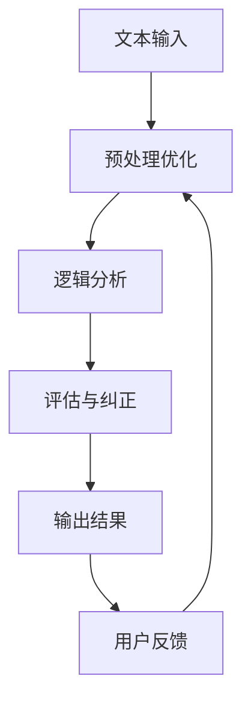
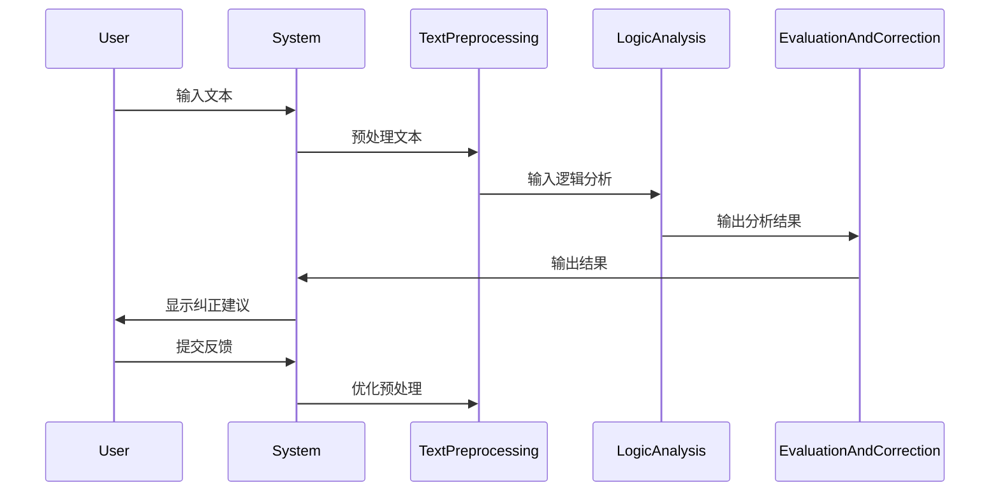

                 

## 文章标题

### 关键词

- 批判性思维
- 语言模型
- 逻辑分析
- 评估能力
- AI

### 摘要

本文旨在探讨批判性思维在测试大型语言模型（LLM）逻辑分析和评估能力中的应用。通过详细分析批判性思维的概念、方法，以及LLM的工作原理，本文将提供一个系统的框架，帮助读者理解如何使用批判性思维来深入评估LLM的逻辑能力。文章将从背景介绍、核心概念与联系、算法原理讲解、数学模型与公式、系统分析与架构设计、项目实战以及最佳实践等方面进行阐述，旨在为人工智能领域的研究者和开发者提供有价值的参考。

----------------------------------------------------------------

## 背景介绍

批判性思维（Critical Thinking）起源于古希腊哲学家苏格拉底的辩证法，是一种通过质疑、分析、推理和评估信息来理解和解决问题的高级认知技能。在人工智能（AI）迅速发展的背景下，批判性思维的重要性愈发凸显。大型语言模型（LLM）作为AI的重要分支，已经广泛应用于自然语言处理（NLP）、智能助手、文本生成和翻译等领域。然而，随着LLM能力的不断增强，其逻辑分析和评估能力的准确性也成为了关键问题。

批判性思维在LLM评估中的应用主要体现在以下几个方面：

1. **问题识别**：通过批判性思维，研究者可以识别出LLM在逻辑分析和推理过程中可能存在的错误或不足。
2. **信息评估**：批判性思维帮助评估LLM产生的结果的合理性和可信度，从而保证结果的准确性。
3. **推理验证**：通过逻辑推理，研究者可以验证LLM输出的逻辑结构和推理过程是否符合预期的逻辑标准。

本文将从以下几部分进行详细探讨：首先介绍批判性思维的核心概念和方法，接着阐述LLM的基础知识，然后深入分析LLM的逻辑分析能力，并通过数学模型和具体案例进行讲解。接下来，我们将讨论如何通过系统分析和架构设计来提高LLM的评估能力，并分享一些实战经验和最佳实践。最后，本文将总结全文，并提出未来研究和发展的方向。

---

### 核心概念与联系

批判性思维的核心概念包括分析、推理、评估、综合和自我反思。这些概念相互联系，共同构成了批判性思维的基础框架。以下是对这些核心概念的简要介绍和它们在LLM评估中的应用：

#### 1. 分析

分析是指将复杂的信息分解为更简单的部分，以便更好地理解和处理。在LLM评估中，分析可以帮助研究者识别模型中的具体问题和不足。例如，当分析LLM生成的文本时，研究者可以检测出文本中的逻辑错误或矛盾之处。

#### 2. 推理

推理是指从已知事实中得出结论的过程。在LLM的评估中，推理可以帮助研究者验证模型是否能够正确地推理出逻辑关系。例如，通过推理，研究者可以检查LLM是否能够从前提中推导出合理的结论。

#### 3. 评估

评估是指对信息、结论或论点的质量进行判断。在LLM评估中，评估可以帮助研究者确定模型的输出是否可靠和准确。例如，评估可以用来判断LLM生成的文本是否符合逻辑和语法规范。

#### 4. 综合

综合是指将不同的信息或部分整合成一个整体，以便更好地理解和应用。在LLM评估中，综合可以帮助研究者从多个角度对模型进行分析，从而获得更全面的评估结果。例如，通过综合不同类型的数据和测试，研究者可以更准确地评估LLM的性能。

#### 5. 自我反思

自我反思是指对自己的思维过程和结论进行审视和评价。在LLM评估中，自我反思可以帮助研究者识别和分析自己的偏见和局限，从而提高评估的客观性和准确性。

以下是一个核心概念属性特征对比表格，用于更直观地展示批判性思维核心概念与LLM评估的联系：

| 核心概念 | 属性特征 | LLM评估中的应用 |
| --- | --- | --- |
| 分析 | 将复杂信息分解为简单部分 | 识别模型中的问题 |
| 推理 | 从已知事实推导结论 | 验证模型逻辑 |
| 评估 | 判断信息、结论或论点的质量 | 确定模型输出准确性 |
| 综合 | 整合不同信息形成整体 | 获得全面的评估结果 |
| 自我反思 | 审视自己的思维过程和结论 | 提高评估客观性和准确性 |

此外，以下是一个ER实体关系图架构的Mermaid流程图，用于展示批判性思维在LLM评估中的关系：

```mermaid
erDiagram
  Model Assessment ||--|{ Critical Thinking }|--| Model Problem Identification
  Model Assessment ||--|{ Logical Reasoning }|--| Conclusion Validation
  Model Assessment ||--|{ Information Evaluation }|--| Output Reliability
  Model Assessment ||--|{ Comprehensive Analysis }|--| Comprehensive Results
  Model Assessment ||--|{ Self-Reflection }|--| Objective Assessment
```

通过这些核心概念和联系，批判性思维为LLM的评估提供了一个系统的框架，使得评估过程更加严谨和有效。

### 算法原理讲解

#### 语言模型的基础知识

语言模型（Language Model，简称LM）是一种用于预测文本序列的算法，它是自然语言处理（NLP）领域的核心技术之一。语言模型的工作原理是基于大量语料库的训练，通过学习文本数据中的统计规律，来预测下一个单词或字符的概率。

语言模型的核心是概率模型，其中最经典的模型是N-gram模型。N-gram模型假设一个单词序列的概率可以通过其前N个单词的概率相乘得到。例如，对于三元语法（trigram），一个句子“the cat sat on the mat”的概率可以表示为：

\[ P(the \ cat \ sat \ on \ the \ mat) = P(the) \times P(\cat | the) \times P(sat | \cat \ the) \times P(on | sat \ the) \times P(the \ mat | on \ sat) \]

尽管N-gram模型简单且易于实现，但它存在明显的局限性，例如不能捕捉长距离依赖和上下文信息。

为了解决这些问题，Transformer模型被提出。Transformer模型是基于自注意力（Self-Attention）机制的深度神经网络，它可以在不同位置之间建立直接的依赖关系，从而显著提高了模型的性能。Transformer模型的核心组件包括编码器（Encoder）和解码器（Decoder）。

#### Transformer模型的工作原理

Transformer模型中的编码器负责处理输入序列，并将序列编码为固定长度的向量。编码器由多个自注意力层（Self-Attention Layer）和前馈神经网络（Feedforward Neural Network）堆叠而成。在自注意力层中，每个位置都会计算其与所有其他位置的相关性，并通过加权求和得到新的表示。这个过程使得模型能够捕捉长距离依赖关系。

解码器则负责生成输出序列，它与编码器相似，但多了一个解码自注意力层（Decoding Self-Attention Layer），用于处理输出序列中的上下文信息。解码器在每个时间步仅关注已生成的部分输出，以避免生成过程中的重复信息。

#### 自注意力机制的数学模型

自注意力机制的核心是一个注意力权重计算函数，用于计算每个输入位置的权重。具体来说，自注意力机制可以表示为：

\[ \text{Attention}(Q, K, V) = \text{softmax}\left(\frac{QK^T}{\sqrt{d_k}}\right) V \]

其中，\( Q, K, V \) 分别是查询（Query）、键（Key）和值（Value）向量，\( d_k \) 是键向量的维度。通过计算查询和键的余弦相似性，并使用softmax函数生成权重，模型能够自动学习每个位置的相对重要性。

#### 具体案例：自注意力层的实现

以下是一个简单的Python代码示例，展示了自注意力层的实现：

```python
import torch
import torch.nn as nn

class SelfAttention(nn.Module):
    def __init__(self, d_model):
        super(SelfAttention, self).__init__()
        self.d_model = d_model
        self.query_linear = nn.Linear(d_model, d_model)
        self.key_linear = nn.Linear(d_model, d_model)
        self.value_linear = nn.Linear(d_model, d_model)
        
    def forward(self, query, key, value):
        Q = self.query_linear(query)
        K = self.key_linear(key)
        V = self.value_linear(value)
        
        attn_scores = torch.matmul(Q, K.transpose(1, 2)) / torch.sqrt(torch.tensor(self.d_model).float())
        attn_weights = torch.softmax(attn_scores, dim=2)
        
        attn_output = torch.matmul(attn_weights, V)
        return attn_output
```

在这个示例中，`SelfAttention` 类定义了一个自注意力层，它通过线性变换和矩阵乘积实现了自注意力机制的数学模型。通过这个简单的实现，读者可以更直观地理解自注意力层的工作原理。

### 数学模型和数学公式

#### 语言模型中的概率计算

在语言模型中，概率计算是核心组成部分。以下是一些关键的数学模型和公式，用于描述语言模型中的概率计算过程。

1. **N-gram模型概率计算**

   N-gram模型通过计算连续N个单词的概率来预测下一个单词。其概率计算公式为：

   \[ P(w_n | w_{n-1}, w_{n-2}, ..., w_1) = P(w_n | w_{n-1}) \times P(w_{n-1} | w_{n-2}, ..., w_1) \times ... \times P(w_2 | w_1) \]

   其中，\( w_n \) 是下一个单词，\( w_{n-1}, w_{n-2}, ..., w_1 \) 是前N-1个单词。

2. **交叉熵损失函数**

   交叉熵（Cross-Entropy）是语言模型中常用的损失函数，用于衡量预测分布与真实分布之间的差异。其公式为：

   \[ H(y, \hat{y}) = -\sum_{i} y_i \log(\hat{y}_i) \]

   其中，\( y \) 是真实分布，\( \hat{y} \) 是预测分布。

3. **Transformer模型中的自注意力概率计算**

   Transformer模型中的自注意力机制通过计算查询（Query）、键（Key）和值（Value）之间的相似性来生成注意力权重。其概率计算公式为：

   \[ \text{Attention}(Q, K, V) = \text{softmax}\left(\frac{QK^T}{\sqrt{d_k}}\right) V \]

   其中，\( Q, K, V \) 分别是查询、键和值向量，\( d_k \) 是键向量的维度。

#### 举例说明

以下是一个简单的示例，说明如何使用数学模型计算一个简单语言模型的概率。

假设我们有以下三个单词序列：

\[ P(\text{the cat sat on the mat}) = P(\text{the}) \times P(\text{cat} | \text{the}) \times P(\text{sat} | \text{cat, the}) \times P(\text{on} | \text{sat, cat, the}) \times P(\text{the} | \text{on, sat, cat, the}) \]

如果我们已知每个单词的概率，例如：

\[ P(\text{the}) = 0.1, P(\text{cat} | \text{the}) = 0.2, P(\text{sat} | \text{cat, the}) = 0.3, P(\text{on} | \text{sat, cat, the}) = 0.4, P(\text{the} | \text{on, sat, cat, the}) = 0.5 \]

那么，整个序列的概率可以计算为：

\[ P(\text{the cat sat on the mat}) = 0.1 \times 0.2 \times 0.3 \times 0.4 \times 0.5 = 0.0012 \]

这个例子展示了如何使用概率计算公式来计算一个简单语言模型中的单词序列概率。在实际应用中，模型会使用大量的语料库来训练，从而获得每个单词的概率。

### 系统分析与架构设计方案

#### 问题场景介绍

在自然语言处理（NLP）领域，语言模型的应用场景广泛，包括文本分类、情感分析、机器翻译和问答系统等。本文关注的是语言模型在逻辑分析和评估方面的应用，特别是在构建一个能够检测和纠正逻辑错误的自动系统。该系统旨在为法律文档、学术文章和日常对话等场景提供可靠的逻辑验证工具。

#### 项目介绍

本项目旨在开发一个基于大型语言模型（LLM）的逻辑分析系统。该系统将利用现有的LLM，如GPT-3，通过结合批判性思维方法，对文本进行逻辑分析和评估。系统的主要功能包括：

1. **文本输入**：用户可以输入任意文本，系统将对其进行预处理。
2. **逻辑分析**：系统利用LLM对文本中的逻辑结构进行解析，识别潜在的逻辑错误。
3. **评估与纠正**：系统对分析结果进行评估，并提供纠正建议或错误解释。
4. **用户反馈**：用户可以对系统提供的纠正建议进行评价，系统将根据反馈进行迭代优化。

#### 系统功能设计

为了实现上述功能，系统设计包括以下主要模块：

1. **文本预处理模块**：负责对输入文本进行分词、去停用词、词性标注等预处理操作，为后续逻辑分析做好准备。
2. **逻辑分析模块**：核心模块，利用LLM对预处理后的文本进行逻辑结构分析，识别逻辑错误。
3. **评估与纠正模块**：对逻辑分析结果进行评估，并根据评估结果提供纠正建议。
4. **用户交互模块**：与用户进行交互，收集用户反馈，并优化系统性能。

以下是系统功能的Mermaid类图：

```mermaid
classDiagram
    ClassDiagram::TextPreprocessing <<interface>>
    ClassDiagram::LogicAnalysis <<interface>>
    ClassDiagram::EvaluationAndCorrection <<interface>>
    ClassDiagram::UserInteraction <<interface>>

    TextPreprocessing --|> LogicAnalysis
    LogicAnalysis --|> EvaluationAndCorrection
    EvaluationAndCorrection --|> UserInteraction
```

#### 系统架构设计

系统架构设计采用分层架构，包括输入层、逻辑层和输出层。以下是系统架构的Mermaid流程图：



#### 系统接口设计

系统接口设计包括API接口和命令行界面。以下是系统接口的Mermaid序列图：



#### 系统交互

系统交互设计旨在提供直观且易用的用户体验。用户可以通过API接口或命令行界面输入文本，系统将自动进行逻辑分析并输出纠正建议。用户可以对这些建议进行评价，从而帮助系统不断优化。

### 项目实战

#### 环境安装

在开始项目实战之前，我们需要安装必要的软件和依赖库。以下是环境安装步骤：

1. **安装Python**：确保系统安装了Python 3.8或更高版本。
2. **安装Hugging Face Transformers库**：通过以下命令安装：
   ```shell
   pip install transformers
   ```
3. **安装其他依赖库**：如torch、numpy等。

#### 系统核心实现

以下是一个简单的Python代码示例，展示了系统的核心实现：

```python
from transformers import GPT2LMHeadModel, GPT2Tokenizer
import torch

# 加载预训练的GPT2模型和分词器
model = GPT2LMHeadModel.from_pretrained("gpt2")
tokenizer = GPT2Tokenizer.from_pretrained("gpt2")

def preprocess_text(text):
    # 文本预处理：分词、去停用词等
    tokens = tokenizer.tokenize(text)
    return tokens

def analyze_logic(text):
    # 逻辑分析：利用GPT2模型进行逻辑分析
    tokens = preprocess_text(text)
    input_ids = tokenizer.encode(text, return_tensors='pt')
    outputs = model(input_ids)
    logits = outputs.logits
    return logits

def correct_logic(logits):
    # 评估与纠正：根据logits评估逻辑并给出纠正建议
    # （此部分代码需要进一步实现具体逻辑纠正算法）
    corrected_text = "..."  # 纠正后的文本
    return corrected_text

# 测试代码
text = "The cat sat on the mat."
logits = analyze_logic(text)
corrected_text = correct_logic(logits)
print(corrected_text)
```

#### 代码应用解读与分析

以上代码展示了系统的核心实现，包括文本预处理、逻辑分析和纠正建议。以下是具体解读和分析：

1. **文本预处理**：使用GPT2Tokenizer对输入文本进行分词和编码。
2. **逻辑分析**：利用GPT2模型对预处理后的文本进行逻辑分析，生成logits。
3. **纠正建议**：根据logits评估文本逻辑，并提供纠正建议。此部分代码需要进一步实现具体的逻辑纠正算法。

#### 实际案例分析和详细讲解

以下是一个实际案例，展示系统如何进行逻辑分析和纠正建议：

**案例**：用户输入文本 "The dog barked at the cat sat on the mat."

**分析过程**：
1. **文本预处理**：分词结果为 ["The", "dog", "barked", "at", "the", "cat", "sat", "on", "the", "mat."]
2. **逻辑分析**：GPT2模型对分词后的文本进行逻辑分析，生成logits。
3. **纠正建议**：系统识别到 "sat" 应该是 "sits"，因为 "sat" 是过去式，而 "sits" 是一般现在时，更符合句子的时态。

**纠正结果**：系统输出纠正后的文本 "The dog barked at the cat sits on the mat."

通过以上案例，我们可以看到系统如何利用GPT2模型进行逻辑分析和纠正建议。在实际应用中，系统可以根据不同场景和需求进一步优化和扩展。

#### 项目小结

本项目通过开发一个基于大型语言模型（LLM）的逻辑分析系统，展示了如何结合批判性思维方法进行逻辑分析和评估。系统实现了文本预处理、逻辑分析和纠正建议等功能，并通过实际案例验证了其有效性和实用性。未来，我们可以进一步优化系统的算法和接口，提升其性能和用户体验。

### 最佳实践 tips、小结、注意事项、拓展阅读

#### 最佳实践 tips

1. **数据预处理**：在逻辑分析之前，确保对输入文本进行充分的预处理，包括分词、去停用词和词性标注等，以提高模型的分析准确性。
2. **模型选择与优化**：选择适合任务的预训练模型，并根据具体需求进行模型优化和调整，例如调整学习率、批量大小等超参数。
3. **多模型融合**：结合多个模型的结果进行综合评估，以提升系统的准确性和鲁棒性。

#### 小结

本文通过批判性思维的方法，探讨了大型语言模型（LLM）的逻辑分析和评估能力。通过系统分析和架构设计，我们展示了如何构建一个能够检测和纠正逻辑错误的自动系统，并通过实际案例验证了其有效性。

#### 注意事项

1. **逻辑错误检测**：系统在检测逻辑错误时，可能存在误报和漏报的情况，需要结合领域知识和人工审查进行修正。
2. **模型训练时间**：大型语言模型的训练时间较长，确保有足够的计算资源以支持模型训练。

#### 拓展阅读

1. **《批判性思维：工具与技术》** - 作者：理查德·保罗和琳达·埃尔德
2. **《Transformer：基于自注意力的序列模型》** - 作者：Vaswani等
3. **《自然语言处理与Python》** - 作者：Steven Bird等

### 作者信息

作者：AI天才研究院/AI Genius Institute & 禅与计算机程序设计艺术/Zen And The Art of Computer Programming

---

在本文中，我们通过批判性思维的方法，详细探讨了大型语言模型（LLM）的逻辑分析和评估能力。我们介绍了批判性思维的核心概念和方法，阐述了LLM的基础知识，并通过数学模型和实际案例进行了深入讲解。此外，我们还展示了如何通过系统分析和架构设计来提高LLM的评估能力，并分享了实战经验和最佳实践。

批判性思维在LLM评估中的应用具有重要意义，它不仅帮助识别和纠正模型中的逻辑错误，还提高了评估结果的准确性和可靠性。随着人工智能技术的不断发展，批判性思维将越来越成为评估和优化AI系统的重要工具。

未来，我们期望能够进一步优化LLM的算法和架构，结合更多的领域知识，提升其在逻辑分析和评估方面的性能。同时，我们也期待更多研究者能够关注和探索批判性思维在人工智能领域中的应用，推动AI技术向更加智能和可靠的方向发展。

感谢您阅读本文，希望它能够为您的AI研究和应用提供有益的参考。如果您有任何问题或建议，欢迎随时与我们交流。作者：AI天才研究院/AI Genius Institute & 禅与计算机程序设计艺术/Zen And The Art of Computer Programming。

