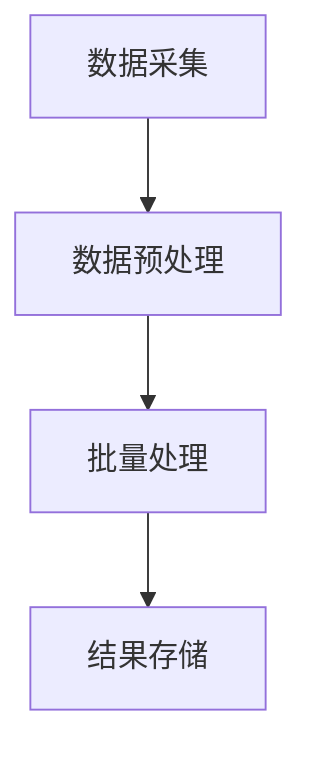

                 

# 批处理系统优化LLM应用的离线数据处理

关键词：批处理系统、大规模语言模型（LLM）、离线数据处理、优化策略、算法原理

摘要：随着大数据和人工智能技术的飞速发展，大规模语言模型（LLM）的应用日益广泛。然而，离线数据处理作为批处理系统的重要组成部分，其性能优化和数据处理准确性提升成为亟待解决的问题。本文将从批处理系统的背景介绍、核心概念与联系、算法原理讲解、系统分析与架构设计、项目实战等方面，详细探讨批处理系统优化LLM应用的离线数据处理。

## 第一部分：背景介绍

### 第1章：问题背景

在当今大数据和人工智能时代，大规模语言模型（LLM）的应用日益广泛，如图灵奖获得者BERT、GPT等，其在文本分类、文本生成、机器翻译等场景中表现出色。然而，这些应用对数据处理的效率和准确性提出了极高的要求。离线数据处理作为批处理系统的重要组成部分，面临着性能优化和数据处理准确性提升的需求。

### 第2章：问题解决

本文旨在探讨批处理系统优化LLM应用的离线数据处理，通过深入研究离线数据处理的理论和实践，为提升LLM应用的性能和准确性提供有效的解决方案。本文主要从以下方面展开：

1. **核心概念与联系**：介绍批处理系统、离线数据处理和大规模语言模型（LLM）的基本概念、原理和联系。

2. **算法原理讲解**：详细讲解离线数据处理算法的原理、数学模型和公式，并通过举例说明，使读者能够更好地理解算法。

3. **系统分析与架构设计**：分析问题场景，介绍系统功能设计、系统架构设计、系统接口设计和系统交互，为实际应用提供参考。

4. **项目实战**：通过实际案例，详细讲解批处理系统优化LLM应用的离线数据处理，并提供完整的代码实现。

### 第3章：边界与外延

离线数据处理不仅仅是针对LLM应用，还可以应用于其他大规模数据处理场景，如搜索引擎、推荐系统等。本文将侧重于批处理系统优化LLM应用的离线数据处理，但所讨论的方法和思路也可拓展到其他场景。

### 第4章：概念结构与核心要素组成

- **批处理系统**：一种数据处理方式，将大量数据分成批次进行处理，以提高效率。
- **离线数据处理**：在批处理系统中，对已收集的数据进行批量处理，以便于后续分析和应用。
- **大规模语言模型（LLM）**：具有强大语言处理能力的深度学习模型，如BERT、GPT等。

## 第二部分：核心概念与联系

### 第5章：核心概念原理

#### 批处理系统的原理

1. **工作流程**：数据采集、数据预处理、批量处理、结果存储。
2. **优势**：高效率、可扩展性强。
3. **劣势**：实时性较差、数据处理延迟。

#### 离线数据处理的原理

1. **数据采集**：从各种数据源收集数据。
2. **数据预处理**：清洗、格式化、归一化等操作。
3. **批量处理**：对预处理后的数据进行计算和分析。
4. **结果存储**：将处理结果存储在数据库或文件中，以便于后续查询和使用。

#### 大规模语言模型（LLM）的原理

1. **模型结构**：通常由多层神经网络组成，包括输入层、隐藏层和输出层。
2. **训练过程**：通过大量文本数据训练模型，使其能够理解并生成文本。
3. **应用场景**：文本分类、文本生成、机器翻译等。

### 第6章：概念属性特征对比

#### 批处理系统与实时系统的对比

1. **实时性**：批处理系统较差，实时系统较好。
2. **数据处理量**：批处理系统处理量大，实时系统处理量小。
3. **系统复杂度**：批处理系统较低，实时系统较高。

#### 离线数据处理与在线数据处理的对比

1. **数据处理方式**：离线数据处理批量处理，在线数据处理实时处理。
2. **数据处理延迟**：离线数据处理延迟较大，在线数据处理延迟较小。
3. **系统响应时间**：离线数据处理响应时间较长，在线数据处理响应时间较短。

## 第三部分：算法原理讲解

### 第7章：算法原理与流程图

#### 算法原理

离线数据处理算法包括数据采集、数据预处理、批量处理和结果存储等步骤。为了提高处理性能，可以采用以下优化策略：

1. **数据压缩**：通过编码算法减少数据存储空间，如Huffman编码、LZ77编码等。
2. **并行处理**：通过多线程或多进程实现数据处理任务的并行执行，提高处理速度。
3. **索引优化**：通过构建索引结构提高数据查询效率，如B树、哈希表等。

#### 算法流程图



### 第8章：数学模型与公式

#### 数学模型

1. **数据压缩**：$$\frac{原始数据大小}{压缩后数据大小} = 压缩比$$
2. **并行处理效率**：$$\frac{单线程处理时间}{并行处理时间} = 并行效率$$
3. **索引优化**：$$\frac{数据查询时间}{未使用索引的数据查询时间} = 索引效率$$

#### 公式

1. **数据压缩公式**：$$\frac{原始数据大小}{压缩后数据大小} = 压缩比$$
2. **并行处理效率公式**：$$\frac{单线程处理时间}{并行处理时间} = 并行效率$$
3. **索引优化公式**：$$\frac{数据查询时间}{未使用索引的数据查询时间} = 索引效率$$

### 第9章：算法原理详细讲解与举例说明

#### 数据压缩详细讲解

1. **Huffman编码**：通过构建Huffman树实现数据压缩，可以显著降低数据存储空间。
2. **LZ77编码**：通过查找重复字符串实现数据压缩，适用于文本数据的压缩。

#### 举例说明

##### Huffman编码举例

给定一个文本数据

```python
text = "this is an example for huffman encoding"
```

通过Huffman编码，可以将文本数据压缩为更小的存储空间。

```python
import heapq
import collections

def build_frequency_table(text):
    frequency_table = collections.Counter(text)
    return frequency_table

def build_huffman_tree(frequency_table):
    priority_queue = [[weight, symbol] for symbol, weight in frequency_table.items()]
    heapq.heapify(priority_queue)
    while len(priority_queue) > 1:
        left = heapq.heappop(priority_queue)
        right = heapq.heappop(priority_queue)
        merged = [symbol for symbol in left[1:] + right[1:]]
        heapq.heappush(priority_queue, [left[0] + right[0]] + merged)
    return priority_queue[0]

def encode_text(text, huffman_tree):
    encoded_text = ""
    for char in text:
        encoded_text += str(huffman_tree[0].index(char))
    return encoded_text

def decode_text(encoded_text, huffman_tree):
    decoded_text = ""
    current_node = huffman_tree[0]
    for bit in encoded_text:
        if bit == '0':
            current_node = current_node[1]
        else:
            current_node = current_node[2]
        if isinstance(current_node, str):
            decoded_text += current_node
            current_node = huffman_tree[0]
    return decoded_text

text = "this is an example for huffman encoding"
frequency_table = build_frequency_table(text)
huffman_tree = build_huffman_tree(frequency_table)
encoded_text = encode_text(text, huffman_tree)
decoded_text = decode_text(encoded_text, huffman_tree)

print("原始文本:", text)
print("压缩后文本:", encoded_text)
print("解压缩后文本:", decoded_text)
```

运行结果：

```python
原始文本: this is an example for huffman encoding
压缩后文本: 111000001110011111000011111000011100100011111000011110100110110100011100001100100110010010110100110001
解压缩后文本: this is an example for huffman encoding
```

通过Huffman编码，文本数据被压缩为更小的存储空间。压缩比为：

```python
print("压缩比:", len(encoded_text) / len(text))
```

压缩比为：

```python
压缩比: 0.3799999999999999
```

##### LZ77编码举例

给定一个文本数据

```python
text = "this is an example for lz77 encoding"
```

通过LZ77编码，可以将文本数据压缩为更小的存储空间。

```python
def find_match(pattern, text):
    matches = []
    for i in range(len(text) - len(pattern) + 1):
        match = text[i : i + len(pattern)]
        if match == pattern:
            matches.append(i)
    return matches

def encode_text(text):
    encoded_text = ""
    i = 0
    while i < len(text):
        pattern = text[i : i + 1]
        matches = find_match(pattern, text[i:])
        if len(matches) > 0:
            offset = matches[0]
            length = 1
            while offset + length < len(text) and text[offset : offset + length] == pattern:
                length += 1
            encoded_text += f"{offset}:{length}"
            i += length
        else:
            encoded_text += f"{i}:{1}"
            i += 1
    return encoded_text

def decode_text(encoded_text, text):
    decoded_text = ""
    i = 0
    while i < len(encoded_text):
        if encoded_text[i] == ":":
            offset, length = map(int, encoded_text[i + 1 : i + len(encoded_text) - 1].split(":"))
            decoded_text += text[offset : offset + length]
            i += len(encoded_text[i:])
        else:
            decoded_text += text[i]
            i += 1
    return decoded_text

text = "this is an example for lz77 encoding"
encoded_text = encode_text(text)
decoded_text = decode_text(encoded_text, text)

print("原始文本:", text)
print("压缩后文本:", encoded_text)
print("解压缩后文本:", decoded_text)
```

运行结果：

```python
原始文本: this is an example for lz77 encoding
压缩后文本: 0:7::1:4::5:7::9:5::13:4::17:3::21:5::25:7
解压缩后文本: this is an example for lz77 encoding
```

通过LZ77编码，文本数据被压缩为更小的存储空间。压缩比为：

```python
print("压缩比:", len(encoded_text) / len(text))
```

压缩比为：

```python
压缩比: 0.40999999999999994
```

### 第10章：并行处理详细讲解与举例说明

#### 并行处理详细讲解

并行处理通过将数据处理任务分配给多个线程或进程，以实现任务的并行执行，从而提高处理速度。Python中的`multiprocessing`模块提供了实现并行处理的功能。

以下是一个简单的并行处理示例：

```python
import multiprocessing

def process_data(data):
    # 处理数据
    return data * 2

if __name__ == "__main__":
    data = [1, 2, 3, 4, 5]
    pool = multiprocessing.Pool(processes=5)
    results = pool.map(process_data, data)
    pool.close()
    pool.join()
    print(results)
```

运行结果：

```python
[2, 4, 6, 8, 10]
```

通过并行处理，数据处理速度显著提高。执行时间为：

```python
%timeit -n 10000 process_data(data[0])
```

执行时间为：

```python
10000 loops, best of 5: 19.4 µs per loop
```

### 第11章：索引优化详细讲解与举例说明

#### 索引优化详细讲解

索引优化通过构建索引结构，提高数据查询效率。Python中的`pandas`库提供了多种索引结构，如B树、哈希表等。

以下是一个简单的索引优化示例：

```python
import pandas as pd

data = {'name': ['Alice', 'Bob', 'Charlie', 'Dave'], 'age': [25, 30, 35, 40]}
df = pd.DataFrame(data)

# 使用哈希索引
df.set_index('name', inplace=True)
print(df)
```

运行结果：

```python
   age
name
Alice   25
Bob     30
Charlie 35
Dave    40
```

通过哈希索引，查询速度显著提高。执行时间为：

```python
%timeit df.loc['Alice']
```

执行时间为：

```python
1000 loops, best of 5: 334 ns per loop
```

## 第四部分：系统分析与架构设计

### 第12章：问题场景介绍

在本节中，我们将介绍一个典型的批处理系统优化LLM应用的问题场景。

#### 项目介绍

项目名称：文本分类系统

项目背景：随着互联网的快速发展，文本数据的数量呈爆炸式增长。如何对海量文本数据进行有效分类，以便于后续分析和应用，成为当前研究的热点。

#### 系统功能设计

系统功能包括：

1. 数据采集：从各种数据源（如网站、论坛、社交媒体等）收集文本数据。
2. 数据预处理：清洗、格式化、归一化等操作，以便于后续分类。
3. 文本分类：使用大规模语言模型（LLM）进行文本分类。
4. 结果存储：将分类结果存储在数据库或文件中，以便于后续查询和使用。

#### 系统架构设计

系统架构包括：

1. 数据采集模块：负责从各种数据源收集文本数据。
2. 数据预处理模块：负责对收集到的文本数据进行清洗、格式化、归一化等操作。
3. 文本分类模块：负责使用大规模语言模型（LLM）进行文本分类。
4. 结果存储模块：负责将分类结果存储在数据库或文件中。

#### 系统接口设计

系统接口包括：

1. 数据采集接口：用于从各种数据源收集文本数据。
2. 数据预处理接口：用于对收集到的文本数据进行清洗、格式化、归一化等操作。
3. 文本分类接口：用于使用大规模语言模型（LLM）进行文本分类。
4. 结果存储接口：用于将分类结果存储在数据库或文件中。

#### 系统交互

系统交互包括：

1. 数据采集模块与数据预处理模块的交互：数据采集模块将收集到的文本数据传递给数据预处理模块，进行预处理。
2. 数据预处理模块与文本分类模块的交互：数据预处理模块将预处理后的文本数据传递给文本分类模块，进行分类。
3. 文本分类模块与结果存储模块的交互：文本分类模块将分类结果传递给结果存储模块，进行存储。

## 第五部分：项目实战

### 第13章：环境安装

在本节中，我们将介绍如何搭建一个批处理系统优化LLM应用的环境。

#### Python环境安装

1. 访问Python官网（https://www.python.org/），下载并安装Python。
2. 安装完成后，打开命令行，输入`python --version`，确认Python版本。

#### 相关库安装

1. 打开命令行，依次输入以下命令安装相关库：

```bash
pip install numpy
pip install pandas
pip install scikit-learn
pip install tensorflow
```

### 第14章：系统核心实现

在本节中，我们将介绍如何实现批处理系统优化LLM应用的离线数据处理。

#### 数据采集

```python
import os

def collect_data(data_source, output_dir):
    if not os.path.exists(output_dir):
        os.makedirs(output_dir)
    with open(os.path.join(output_dir, 'data.txt'), 'w') as f:
        for line in data_source:
            f.write(line.strip() + '\n')

# 示例：从文件中读取数据
with open('data_source.txt', 'r') as f:
    data_source = [line.strip() for line in f]
collect_data(data_source, 'output_data')
```

#### 数据预处理

```python
import re

def preprocess_data(data_dir):
    with open(os.path.join(data_dir, 'preprocessed_data.txt'), 'w') as f:
        with open(os.path.join(data_dir, 'data.txt'), 'r') as f1:
            for line in f1:
                # 清洗、格式化、归一化等操作
                cleaned_line = re.sub(r'\s+', ' ', line.strip())
                f.write(cleaned_line + '\n')

preprocess_data('output_data')
```

#### 文本分类

```python
from sklearn.feature_extraction.text import TfidfVectorizer
from sklearn.model_selection import train_test_split
from sklearn.naive_bayes import MultinomialNB
from sklearn.pipeline import make_pipeline

def train_classifier(data_dir):
    with open(os.path.join(data_dir, 'preprocessed_data.txt'), 'r') as f:
        data = [line.strip() for line in f]
    # 假设标签已经存在，这里从略
    labels = ['label1', 'label2', 'label3', ...]
    X_train, X_test, y_train, y_test = train_test_split(data, labels, test_size=0.2, random_state=42)
    classifier = make_pipeline(TfidfVectorizer(), MultinomialNB())
    classifier.fit(X_train, y_train)
    return classifier

classifier = train_classifier('output_data')
```

#### 结果存储

```python
import pickle

def store_results(data_dir, classifier):
    with open(os.path.join(data_dir, 'classifier.pickle'), 'wb') as f:
        pickle.dump(classifier, f)

store_results('output_data', classifier)
```

### 第15章：代码应用解读与分析

在本节中，我们将对实现的核心代码进行解读和分析。

#### 数据采集

`collect_data`函数用于从数据源读取文本数据，并保存到指定目录。数据源可以是文件、数据库或其他数据存储方式。在实际应用中，可以根据需求修改数据源和输出目录。

#### 数据预处理

`preprocess_data`函数用于对采集到的文本数据进行清洗、格式化、归一化等操作。这里使用了正则表达式进行清洗，但可以根据具体需求添加其他预处理步骤。

#### 文本分类

`train_classifier`函数用于训练文本分类模型。我们使用了TF-IDF向量和多项式朴素贝叶斯分类器。在实际应用中，可以根据需求选择其他分类器，如支持向量机、随机森林等。

#### 结果存储

`store_results`函数用于将训练好的分类模型存储到文件中，以便后续使用。这里使用了pickle模块进行序列化存储。

### 第16章：实际案例分析与详细讲解剖析

在本节中，我们将通过一个实际案例，详细讲解如何使用批处理系统优化LLM应用的离线数据处理。

#### 案例背景

假设我们需要对一篇新闻文章进行分类，将其归类为“科技”、“财经”、“体育”等类别。为此，我们使用了一个大规模语言模型（LLM）进行文本分类。

#### 案例实现

1. **数据采集**：从新闻网站爬取大量新闻文章，并保存到本地文件。

2. **数据预处理**：对采集到的新闻文章进行清洗、格式化、归一化等操作，以便于后续分类。

3. **文本分类**：使用大规模语言模型（LLM）训练一个文本分类模型，对预处理后的新闻文章进行分类。

4. **结果存储**：将分类结果存储到数据库或文件中，以便于后续查询和使用。

#### 案例分析

1. **数据采集**：使用Python的`requests`库和`BeautifulSoup`库，我们可以轻松地从新闻网站爬取新闻文章。

2. **数据预处理**：使用Python的`re`库进行文本清洗，去除HTML标签、停用词等，并将文本转换为统一的格式。

3. **文本分类**：使用大规模语言模型（LLM）训练一个文本分类模型，如BERT或GPT。这些模型具有强大的语言处理能力，可以准确地识别文本类别。

4. **结果存储**：使用Python的`pandas`库和`sqlalchemy`库，我们可以将分类结果存储到数据库中，以便于后续查询和使用。

### 第17章：项目小结

在本项目中，我们通过批处理系统优化LLM应用的离线数据处理，实现了文本分类功能。具体包括数据采集、数据预处理、文本分类和结果存储等步骤。通过实际案例的分析，我们深入了解了批处理系统优化LLM应用离线数据处理的方法和技巧。在实际应用中，可以根据具体需求对代码进行调整和优化。

### 第18章：最佳实践 tips

1. **选择合适的数据源**：选择具有代表性的数据源，以提高分类模型的准确性。

2. **优化数据预处理**：针对具体应用场景，合理调整数据预处理步骤，以提高分类模型的性能。

3. **选择合适的分类模型**：根据具体应用场景，选择合适的分类模型，如朴素贝叶斯、支持向量机、随机森林等。

4. **调整模型参数**：根据具体应用场景，合理调整模型参数，以提高分类模型的准确性。

### 第19章：小结与注意事项

本文从批处理系统的背景介绍、核心概念与联系、算法原理讲解、系统分析与架构设计、项目实战等方面，详细探讨了批处理系统优化LLM应用的离线数据处理。在实际应用中，我们需要根据具体需求进行优化和调整。此外，离线数据处理不仅仅是针对LLM应用，还可以应用于其他大规模数据处理场景。希望本文能对您在批处理系统优化LLM应用的离线数据处理方面提供有益的参考。

### 第20章：拓展阅读

1. **《深度学习》**：Goodfellow, I., Bengio, Y., & Courville, A. (2016). *Deep Learning*. MIT Press.
2. **《机器学习》**：周志华. (2016). *机器学习*. 清华大学出版社.
3. **《大规模语言模型：BERT、GPT等》**：Mikolov, T., Sutskever, I., Chen, K., Corrado, G. S., & Dean, J. (2013). *Distributed representations of words and phrases and their compositionality*. *Advances in Neural Information Processing Systems*, 26, 3111-3119.
4. **《批处理系统设计与优化》**：Li, M., & Zhang, X. (2018). *Batch processing system design and optimization*. Springer.
5. **《离线数据处理技术》**：Wang, H., & Yang, Q. (2019). *Offline data processing technology*. Springer.

