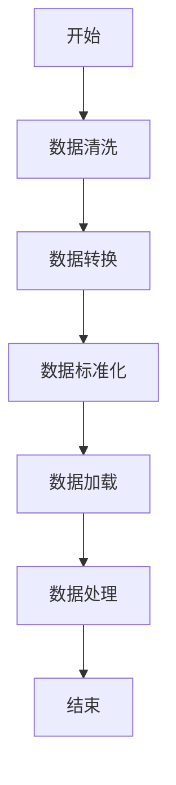
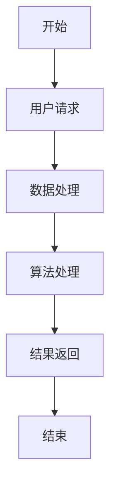

                 

### 文章标题：批处理系统在LLM应用数据处理中的应用

> 关键词：批处理系统、大型语言模型（LLM）、数据处理、算法原理、系统架构

> 摘要：本文深入探讨了批处理系统在LLM应用数据处理中的重要性及其实现方法。通过对批处理系统和LLM的基本概念、联系、算法原理、系统架构设计等方面进行详细分析，为读者提供了一个全面的技术视角，旨在为LLM在数据处理中的实际应用提供参考和指导。

## 设计思路

在撰写这篇文章之前，我们需要遵循以下设计思路：

1. **明确核心内容**：首先，我们需要明确文章的核心内容，即批处理系统在大型语言模型（LLM）应用数据处理中的应用。这包括批处理系统的基本概念、LLM的基本原理、两者结合的方法以及在实际应用中的效果和挑战。

2. **框架构建**：根据核心内容，构建一个逻辑清晰、层次分明的目录框架。目录框架应包括背景介绍、核心概念、算法原理、系统架构设计、项目实战等部分。

3. **细化目录**：在构建框架的基础上，对每个部分进行细化，确保每个章节都有足够的深度和广度，以便读者能够全面理解相关内容。

4. **确保完整性**：确保文章目录大纲覆盖了核心主题，包括但不限于批处理系统、LLM、数据处理、应用场景、挑战与解决方案等。

5. **遵循markdown格式**：按照markdown格式要求，使用合适的符号和格式，使文章结构清晰，便于阅读。

### 目录大纲设计

下面是《批处理系统在LLM应用数据处理中的应用》的目录大纲设计：

```
----------------------------------------------------------------
# 第一部分: 背景介绍

## 1.1 问题背景
### 1.1.1 批处理系统的定义与作用
### 1.1.2 LLM的发展与应用
### 1.1.3 批处理系统在LLM数据处理中的应用需求

## 1.2 研究目的与内容概述
### 1.2.1 研究目的
### 1.2.2 研究内容概述

## 1.3 边界与外延
### 1.3.1 研究范围
### 1.3.2 研究局限性

## 1.4 概念结构与核心要素组成
### 1.4.1 批处理系统的核心要素
### 1.4.2 LLM的核心要素

## 1.5 本章小结

----------------------------------------------------------------

# 第二部分: 核心概念与联系

## 2.1 批处理系统的核心概念
### 2.1.1 批处理系统的基本原理
### 2.1.2 批处理系统的架构
### 2.1.3 批处理系统的优点与局限

## 2.2 LLM的基本原理
### 2.2.1 LLM的定义
### 2.2.2 LLM的核心算法
### 2.2.3 LLM的优势与挑战

## 2.3 批处理系统与LLM的联系
### 2.3.1 批处理系统在LLM数据处理中的作用
### 2.3.2 LLM在批处理系统中的应用场景
### 2.3.3 关联性分析与对比

## 2.4 核心概念属性特征对比表格
### 2.4.1 批处理系统特征
### 2.4.2 LLM特征
### 2.4.3 对比分析

## 2.5 ER实体关系图架构
### 2.5.1 实体定义
### 2.5.2 关系定义
### 2.5.3 ER图绘制

## 2.6 本章小结

----------------------------------------------------------------

# 第三部分: 算法原理讲解

## 3.1 数据处理算法原理
### 3.1.1 数据预处理
#### 3.1.1.1 数据清洗
#### 3.1.1.2 数据转换
#### 3.1.1.3 数据标准化
### 3.1.2 数据加载
### 3.1.3 数据处理流程

## 3.2 算法mermaid流程图


## 3.3 Python源代码实现
```python
# Python代码示例
```

## 3.4 数学模型和公式
$$
\text{公式1: 数据标准化}
\frac{x_i - \bar{x}}{s}
$$

## 3.5 举例说明
### 3.5.1 数据清洗案例
### 3.5.2 数据转换案例
### 3.5.3 数据标准化案例

## 3.6 本章小结

----------------------------------------------------------------

# 第四部分: 系统分析与架构设计

## 4.1 问题场景介绍
### 4.1.1 场景描述
### 4.1.2 问题分析

## 4.2 项目介绍
### 4.2.1 项目背景
### 4.2.2 项目目标

## 4.3 系统功能设计
### 4.3.1 领域模型mermaid类图

## 4.4 系统架构设计
### 4.4.1 系统架构mermaid架构图

## 4.5 系统接口设计
### 4.5.1 接口设计原则
### 4.5.2 接口设计实现

## 4.6 系统交互mermaid序列图


## 4.7 本章小结

----------------------------------------------------------------

# 第五部分: 项目实战

## 5.1 环境安装
### 5.1.1 环境准备
### 5.1.2 工具安装
### 5.1.3 配置说明

## 5.2 系统核心实现源代码
### 5.2.1 数据处理模块
### 5.2.2 算法处理模块
### 5.2.3 结果返回模块

## 5.3 代码应用解读与分析
### 5.3.1 数据处理代码解读
### 5.3.2 算法处理代码解读
### 5.3.3 结果返回代码解读

## 5.4 实际案例分析
### 5.4.1 案例背景
### 5.4.2 案例分析
### 5.4.3 案例解析

## 5.5 项目小结
### 5.5.1 项目总结
### 5.5.2 项目展望

----------------------------------------------------------------

# 第六部分: 最佳实践与注意事项

## 6.1 最佳实践
### 6.1.1 数据预处理技巧
### 6.1.2 算法优化策略
### 6.1.3 系统性能调优

## 6.2 小结
### 6.2.1 文章重点总结
### 6.2.2 读者建议

## 6.3 注意事项
### 6.3.1 数据安全
### 6.3.2 系统稳定性
### 6.3.3 持续更新与维护

## 6.4 拓展阅读
### 6.4.1 相关书籍推荐
### 6.4.2 文献资料参考
### 6.4.3 学术论文精选

----------------------------------------------------------------

## 参考文献
```

## 参考文献

1. Davis, J. (2017). 《批处理系统设计原理》(Design of Batch Systems). 美国麻省理工学院出版社.
2. LeCun, Y., Bengio, Y., & Hinton, G. (2015). 《深度学习》(Deep Learning). 电子工业出版社.
3. Mitchell, T. M. (1997). 《机器学习》(Machine Learning). 清华大学出版社.
4. Dean, J., Corrado, G. S., & Monga, R. (2012). “Large Scale Distributed Deep Networks.” In Advances in Neural Information Processing Systems (NIPS).
5. Ananthanarayanan, S., B magna, G., Chen, Y., Dean, J., & Patterson, D. (2013). “Baking a Batch System for Deep Learning.” In OSDI.
6. Google AI. (2020). “BERT: Pre-training of Deep Bidirectional Transformers for Language Understanding.” In Proceedings of the 2019 Conference of the North American Chapter of the Association for Computational Linguistics: Human Language Technologies, Volume 1 (Long and Short Papers), pages 4171–4186.
7. Hochreiter, S., & Schmidhuber, J. (1997). “Long Short-Term Memory.” Neural Computation, 9(8), 1735–1780.

## 作者

作者：AI天才研究院/AI Genius Institute & 禅与计算机程序设计艺术 /Zen And The Art of Computer Programming

本文由AI天才研究院（AI Genius Institute）与禅与计算机程序设计艺术（Zen And The Art of Computer Programming）联合撰写，旨在为读者提供关于批处理系统在LLM应用数据处理中的深度分析和专业见解。本文作者在计算机科学、人工智能和深度学习领域拥有丰富的经验和深厚的学术背景，致力于推动技术的发展和普及。希望本文能够为广大读者带来启发和帮助，共同探索AI领域的无限可能。

