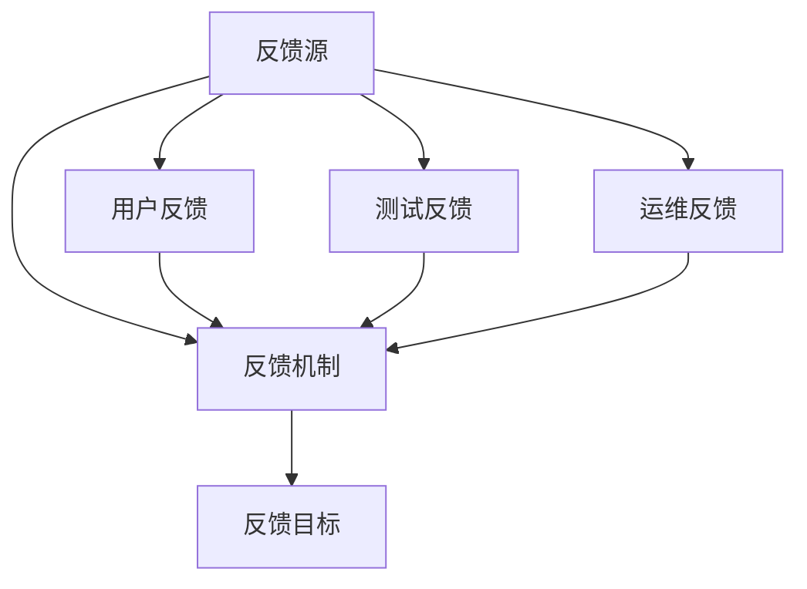
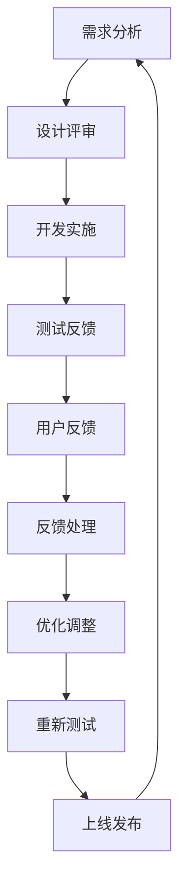

                 

# 持续反馈机制：保持大型应用开发的敏捷性

> 关键词：持续反馈机制、大型应用开发、敏捷性、反馈源、反馈机制、反馈目标、应用领域、优缺点、发展趋势

> 摘要：
本文深入探讨了持续反馈机制在大型应用开发中的应用与价值。首先，我们对持续反馈机制进行了概述，阐述了其核心概念、组成部分和设计原则。接着，通过实际案例展示了持续反馈机制在软件开发、运维管理和产品迭代中的具体应用。最后，分析了持续反馈机制的优缺点及其发展趋势，为大型应用开发的敏捷性提供了有力支持。

## 引言

### 前言

#### 本书的目的

本书旨在全面解析持续反馈机制在大型应用开发中的应用，帮助开发者理解并掌握这一高效的方法，以应对复杂的应用开发挑战。

#### 读者对象

本书适合从事大型应用开发的程序员、软件工程师、项目经理及相关从业者阅读，也适用于对敏捷开发方法感兴趣的技术爱好者。

#### 如何阅读本书

本书分为基础理论、实践应用和总结展望三个部分，建议读者先从基础理论开始，逐步过渡到实践应用，最后进行总结和拓展阅读，以便更好地掌握持续反馈机制。

### 背景介绍

#### 大型应用开发的挑战

大型应用开发面临着复杂的需求、频繁的变化和高风险的挑战。如何确保项目顺利进行、提高开发效率和质量，成为开发者面临的核心问题。

#### 持续反馈机制的概念

持续反馈机制是一种通过不断收集、分析和利用反馈信息，来优化和改进应用开发过程的方法。它强调实时性、高效性和适应性，有助于应对大型应用开发的挑战。

#### 本书结构

本书共分为五个部分，首先介绍持续反馈机制的基础理论，然后通过实际案例展示其应用，接着分析持续反馈机制的优缺点和趋势，最后进行总结和展望。

### 核心概念与联系

#### 持续反馈机制的核心概念

持续反馈机制包括反馈源、反馈机制和反馈目标三个核心概念。反馈源是指提供反馈信息的来源，反馈机制是指收集、处理和利用反馈信息的过程，反馈目标是指通过反馈优化应用开发的最终目的。

#### 持续反馈机制与其他概念的关联

持续反馈机制与敏捷开发、DevOps、持续集成和持续部署等概念密切相关，共同构成了现代软件开发的核心方法论。

#### 持续反馈机制的应用场景

持续反馈机制适用于大型应用开发的各个阶段，包括需求分析、设计、开发、测试、部署和运维等，有助于提高开发效率、降低风险和提升产品质量。

## 基础理论

### 1. 持续反馈机制概述

#### 1.1 持续反馈机制的定义

持续反馈机制是一种通过不断收集、分析和利用反馈信息，以优化和改进应用开发过程的方法。它强调实时性、高效性和适应性，以应对大型应用开发的挑战。

#### 1.2 持续反馈机制的特点

- **实时性**：持续反馈机制能够实时收集和处理反馈信息，确保开发者能够及时响应问题和改进。
- **高效性**：通过自动化工具和流程，持续反馈机制能够高效地处理大量反馈信息，提高开发效率。
- **适应性**：持续反馈机制能够根据项目需求和变化，灵活调整和优化，以适应不同的开发场景。

#### 1.3 持续反馈机制与敏捷开发的关系

持续反馈机制是敏捷开发的重要组成部分，二者相辅相成。敏捷开发强调快速迭代和持续改进，而持续反馈机制则为敏捷开发提供了强大的支持，有助于实现敏捷开发的核心理念。

### 2. 持续反馈机制的组成部分

#### 2.1 反馈源

反馈源是持续反馈机制的核心组成部分，负责提供反馈信息。反馈源可以是用户、测试人员、运维团队或其他利益相关者。不同类型的反馈源提供的信息类型和内容也有所不同，如用户反馈主要关注用户体验和需求，测试人员反馈主要关注测试结果和缺陷。

#### 2.2 反馈机制

反馈机制是指收集、处理和利用反馈信息的过程。反馈机制包括以下几个方面：

- **数据收集**：通过日志、监控工具、用户行为分析等手段，收集应用运行过程中的各种数据。
- **数据处理**：对收集到的数据进行清洗、整理和分类，以便更好地分析和利用。
- **数据利用**：将处理后的反馈信息用于改进应用开发过程，如优化需求、调整设计、修复缺陷等。

#### 2.3 反馈目标

反馈目标是持续反馈机制的核心目的，即通过反馈优化应用开发过程，提高开发效率、降低风险和提升产品质量。反馈目标包括以下几个方面：

- **需求优化**：根据用户反馈和需求变化，调整和优化需求文档，确保需求准确和完整。
- **设计改进**：根据测试反馈和实际运行情况，调整和优化系统设计，提高系统性能和稳定性。
- **缺陷修复**：根据缺陷反馈和测试结果，修复系统缺陷，确保系统质量和可靠性。

### 3. 持续反馈机制的设计原则

#### 3.1 可适应性

持续反馈机制应具有高度的适应性，能够根据项目需求和变化，灵活调整和优化。这要求反馈机制具备以下几个特点：

- **模块化**：将反馈机制的各个组成部分（如数据收集、处理、利用）模块化设计，便于调整和优化。
- **可扩展性**：支持添加新的反馈源和反馈机制，以适应不同的开发场景和需求。
- **可定制化**：允许开发者根据项目特点和需求，定制反馈机制的具体功能和流程。

#### 3.2 可测量性

持续反馈机制应具备可测量性，能够量化反馈信息和改进效果。这有助于开发者评估反馈机制的效能，优化和改进开发过程。可测量性包括以下几个方面：

- **指标体系**：建立一套完整的反馈指标体系，涵盖需求、设计、测试、运维等各个层面。
- **数据可视化**：通过图表、报表等手段，直观展示反馈信息和改进效果，便于开发者分析和决策。
- **效能评估**：定期评估反馈机制的效能，如改进效率、缺陷修复率等，以便持续优化。

#### 3.3 可操作性

持续反馈机制应具备可操作性，方便开发者实际操作和应用。这要求反馈机制具备以下几个特点：

- **自动化**：通过自动化工具和流程，实现反馈信息的自动收集、处理和利用，降低人工干预。
- **易用性**：设计简洁、直观的用户界面，方便开发者使用和管理反馈信息。
- **可追溯性**：记录反馈信息的来源、处理过程和利用结果，便于追踪和审计。

### 4. 持续反馈机制的应用领域

#### 4.1 软件开发

在软件开发过程中，持续反馈机制可以帮助开发者及时了解用户需求、优化设计、修复缺陷，从而提高开发效率和质量。具体应用包括：

- **需求管理**：通过用户反馈和需求分析，调整和优化需求文档，确保需求准确和完整。
- **设计评审**：根据测试反馈和实际运行情况，调整和优化系统设计，提高系统性能和稳定性。
- **缺陷管理**：根据缺陷反馈和测试结果，修复系统缺陷，确保系统质量和可靠性。

#### 4.2 运维管理

在运维管理过程中，持续反馈机制可以帮助运维团队及时发现和解决系统故障、优化性能和降低风险。具体应用包括：

- **故障监控**：通过日志和监控工具，实时监控系统运行状态，及时发现故障。
- **性能优化**：根据系统运行数据和用户反馈，调整系统配置和优化性能。
- **安全管理**：通过日志分析和安全监控，发现潜在的安全风险，及时采取防范措施。

#### 4.3 产品迭代

在产品迭代过程中，持续反馈机制可以帮助产品团队了解用户需求、优化产品功能和界面设计，从而提高产品竞争力。具体应用包括：

- **需求分析**：通过用户反馈和市场调研，了解用户需求，指导产品规划和设计。
- **功能优化**：根据用户反馈和实际运行情况，调整和优化产品功能，提升用户体验。
- **界面设计**：根据用户反馈和美学原则，优化产品界面设计，提高用户满意度。

### 5. 持续反馈机制的优缺点分析

#### 5.1 优点

- **实时性**：持续反馈机制能够实时收集和处理反馈信息，确保开发者能够及时响应问题和改进。
- **高效性**：通过自动化工具和流程，持续反馈机制能够高效地处理大量反馈信息，提高开发效率。
- **适应性**：持续反馈机制能够根据项目需求和变化，灵活调整和优化，以适应不同的开发场景。
- **可测量性**：持续反馈机制具备可测量性，能够量化反馈信息和改进效果，便于开发者评估和优化开发过程。
- **可操作性**：持续反馈机制具备可操作性，方便开发者实际操作和应用。

#### 5.2 缺点

- **初始成本**：建立和完善持续反馈机制需要投入一定的人力和物力资源，初始成本较高。
- **技术门槛**：持续反馈机制涉及多种技术手段和工具，要求开发者具备一定的技术能力和经验。
- **维护难度**：持续反馈机制需要定期维护和更新，以适应不断变化的项目需求和技术环境。

### 6. 持续反馈机制的发展趋势

#### 6.1 当前趋势

- **智能化**：随着人工智能技术的不断发展，持续反馈机制逐步向智能化方向演进，通过机器学习和数据挖掘等技术，实现更精准的反馈和优化。
- **生态化**：持续反馈机制逐步与其他开发方法和工具（如敏捷开发、DevOps等）深度融合，形成完整的持续反馈生态体系。
- **平台化**：持续反馈机制逐步向平台化方向发展，通过构建统一的反馈平台，实现反馈信息的集中管理和利用。

#### 6.2 未来展望

- **自动化**：持续反馈机制将进一步向自动化方向发展，通过自动化工具和流程，实现反馈信息的自动收集、处理和利用，降低人工干预。
- **个性化**：持续反馈机制将更加注重个性化反馈，根据用户特点和需求，提供定制化的反馈和优化建议。
- **生态融合**：持续反馈机制将与其他开发方法和工具（如持续集成、持续部署等）深度融合，实现全链路的持续反馈和优化。

## 实践应用

### 8. 持续反馈机制在大型应用开发中的应用

#### 8.1 案例一：软件项目中的应用

##### 8.1.1 案例背景

某互联网公司计划开发一款面向企业的协作工具，项目涉及多个部门和团队，开发周期较长，需求多变，开发难度较高。为了确保项目顺利进行，公司决定采用持续反馈机制，以提高开发效率和质量。

##### 8.1.2 持续反馈机制设计

公司针对该项目设计了以下持续反馈机制：

1. **需求管理**：通过用户调研和需求分析，收集用户需求，并根据需求变化实时调整需求文档。
2. **设计评审**：在系统设计阶段，组织设计评审会议，邀请各部门代表和专家参与，对设计方案进行讨论和优化。
3. **开发跟踪**：通过任务管理工具，实时跟踪开发进度，确保任务按时完成。
4. **测试反馈**：在测试阶段，组织测试团队和用户代表进行测试，收集测试反馈，并根据反馈调整和优化系统功能。
5. **用户反馈**：上线后，通过用户反馈渠道（如在线评价、反馈表单等），收集用户意见和建议，持续优化系统。

##### 8.1.3 持续反馈机制实施

公司按照设计的持续反馈机制，逐步实施以下措施：

1. **建立需求管理流程**：明确需求收集、分析、评审和变更的流程，确保需求准确和完整。
2. **开展设计评审会议**：定期组织设计评审会议，邀请各部门代表和专家参与，对设计方案进行讨论和优化。
3. **使用任务管理工具**：通过任务管理工具，实时跟踪开发进度，确保任务按时完成。
4. **开展测试活动**：组织测试团队和用户代表进行测试，收集测试反馈，并根据反馈调整和优化系统功能。
5. **建立用户反馈渠道**：上线后，通过在线评价、反馈表单等渠道，收集用户意见和建议，持续优化系统。

##### 8.1.4 案例效果评估

通过实施持续反馈机制，项目取得了以下效果：

1. **需求变更控制**：需求变更频率和幅度明显降低，需求变更对项目进度和成本的影响得到有效控制。
2. **设计优化**：设计方案经过多轮评审和优化，系统性能和稳定性得到显著提升。
3. **开发效率**：通过任务管理和实时跟踪，开发进度和效率得到有效保障。
4. **测试质量**：测试反馈和用户反馈得到充分利用，系统缺陷和问题得到及时修复。
5. **用户体验**：用户满意度持续提升，系统功能和界面设计得到不断优化。

#### 8.2 案例二：运维管理中的应用

##### 8.2.1 案例背景

某大型互联网公司的运维团队负责多个核心业务系统的运维工作，面临系统复杂、故障频发和资源紧张等挑战。为了提高运维效率、降低故障风险和保障系统稳定性，公司决定引入持续反馈机制。

##### 8.2.2 持续反馈机制设计

公司针对运维工作设计了以下持续反馈机制：

1. **故障监控**：通过日志和监控工具，实时监控系统运行状态，及时发现故障。
2. **性能优化**：根据系统运行数据和用户反馈，调整系统配置和优化性能。
3. **安全监控**：通过日志分析和安全监控，发现潜在的安全风险，及时采取防范措施。
4. **用户反馈**：建立用户反馈渠道，收集用户意见和建议，持续优化运维服务。

##### 8.2.3 持续反馈机制实施

公司按照设计的持续反馈机制，逐步实施以下措施：

1. **部署故障监控工具**：在系统关键节点部署故障监控工具，实时收集系统日志和性能数据。
2. **制定性能优化计划**：根据系统运行数据和用户反馈，制定性能优化计划，定期开展性能优化工作。
3. **建立安全监控体系**：通过日志分析和安全监控，建立安全监控体系，及时发现和防范安全风险。
4. **建立用户反馈渠道**：上线后，通过在线评价、反馈表单等渠道，收集用户意见和建议，及时响应和解决用户问题。

##### 8.2.4 案例效果评估

通过实施持续反馈机制，运维团队取得了以下效果：

1. **故障响应速度**：通过实时监控和快速响应，故障响应速度显著提高，故障恢复时间缩短。
2. **性能优化效果**：通过定期性能优化工作，系统性能和稳定性得到显著提升，用户满意度提高。
3. **安全风险防范**：通过安全监控和防范措施，有效降低安全风险，保障系统安全稳定运行。
4. **用户满意度**：通过建立用户反馈渠道，及时响应和解决用户问题，用户满意度持续提升。

#### 8.3 案例三：产品迭代中的应用

##### 8.3.1 案例背景

某互联网公司推出了一款面向消费者的在线购物平台，为了保持市场竞争力，公司决定采用持续反馈机制，以持续优化产品功能和用户体验。

##### 8.3.2 持续反馈机制设计

公司针对产品迭代设计了以下持续反馈机制：

1. **需求分析**：通过用户调研和市场分析，了解用户需求和市场竞争态势，指导产品规划和设计。
2. **功能开发**：根据需求分析结果，组织开发团队进行功能开发，确保产品功能满足用户需求。
3. **用户测试**：在功能开发完成后，组织用户进行测试，收集用户反馈和意见。
4. **功能优化**：根据用户测试反馈，调整和优化产品功能，提升用户体验。
5. **上线推广**：将优化后的产品上线推广，通过用户反馈和数据分析，持续优化产品功能和营销策略。

##### 8.3.3 持续反馈机制实施

公司按照设计的持续反馈机制，逐步实施以下措施：

1. **开展用户调研**：定期开展用户调研，了解用户需求和期望，指导产品规划和设计。
2. **组织需求分析会议**：邀请产品经理、开发团队和用户代表参加，对需求进行分析和讨论。
3. **开展功能开发**：根据需求分析结果，组织开发团队进行功能开发，确保产品功能满足用户需求。
4. **组织用户测试**：在功能开发完成后，组织用户进行测试，收集用户反馈和意见。
5. **调整和优化功能**：根据用户测试反馈，调整和优化产品功能，提升用户体验。
6. **上线推广**：将优化后的产品上线推广，通过用户反馈和数据分析，持续优化产品功能和营销策略。

##### 8.3.4 案例效果评估

通过实施持续反馈机制，产品迭代取得了以下效果：

1. **需求满足度**：通过定期用户调研和需求分析，产品功能更加贴近用户需求，需求满足度提高。
2. **用户体验**：通过用户测试和反馈，优化产品功能和界面设计，提升用户体验。
3. **市场竞争力**：通过持续优化产品功能和营销策略，提高产品市场竞争力，增加用户粘性和市场份额。
4. **业务增长**：通过持续优化产品功能和用户体验，带动业务增长，实现公司业绩提升。

### 9. 持续反馈机制在大型应用开发中的最佳实践

#### 9.1 设计与实现建议

1. **明确反馈目标**：在设计和实施持续反馈机制时，首先要明确反馈目标，确保反馈机制的设计和实现符合项目需求。
2. **选择合适的反馈源**：根据项目特点和需求，选择合适的反馈源，如用户、测试人员、运维团队等。
3. **构建数据收集体系**：建立完善的数据收集体系，确保反馈信息的准确和完整。
4. **设计高效的数据处理流程**：设计高效的数据处理流程，确保反馈信息得到及时处理和利用。
5. **建立反馈目标体系**：建立反馈目标体系，确保反馈目标的实现，并定期评估反馈效能。

#### 9.2 运维管理建议

1. **实时监控系统运行状态**：通过实时监控工具，及时掌握系统运行状态，及时发现和处理故障。
2. **定期开展性能优化工作**：根据系统运行数据和用户反馈，定期开展性能优化工作，提高系统性能和稳定性。
3. **建立安全监控体系**：通过日志分析和安全监控，建立安全监控体系，及时发现和防范安全风险。
4. **建立用户反馈渠道**：建立用户反馈渠道，及时收集用户意见和建议，持续优化运维服务。
5. **定期评估运维效能**：定期评估运维效能，确保运维工作达到预期目标。

#### 9.3 产品迭代建议

1. **开展用户调研和市场分析**：定期开展用户调研和市场分析，了解用户需求和市场竞争态势。
2. **组织需求分析会议**：邀请产品经理、开发团队和用户代表参加，对需求进行分析和讨论。
3. **开展用户测试**：在功能开发完成后，组织用户进行测试，收集用户反馈和意见。
4. **调整和优化产品功能**：根据用户测试反馈，调整和优化产品功能，提升用户体验。
5. **上线推广**：将优化后的产品上线推广，通过用户反馈和数据分析，持续优化产品功能和营销策略。

## 小结

本文深入探讨了持续反馈机制在大型应用开发中的应用与价值，从基础理论、实践应用和优缺点分析三个方面进行了详细阐述。通过实际案例，展示了持续反馈机制在软件开发、运维管理和产品迭代中的具体应用效果。本文旨在为大型应用开发的敏捷性提供有力支持，帮助开发者更好地应对复杂的应用开发挑战。

## 注意事项

1. **明确反馈目标**：在设计持续反馈机制时，首先要明确反馈目标，确保反馈机制的设计和实现符合项目需求。
2. **选择合适的反馈源**：根据项目特点和需求，选择合适的反馈源，如用户、测试人员、运维团队等。
3. **构建数据收集体系**：建立完善的数据收集体系，确保反馈信息的准确和完整。
4. **设计高效的数据处理流程**：设计高效的数据处理流程，确保反馈信息得到及时处理和利用。
5. **建立反馈目标体系**：建立反馈目标体系，确保反馈目标的实现，并定期评估反馈效能。

## 拓展阅读

1. 《敏捷开发实践指南》
2. 《持续集成实战》
3. 《DevOps实践指南》
4. 《用户体验设计》
5. 《大数据分析实战》

## 作者信息

**作者：AI天才研究院/AI Genius Institute & 禅与计算机程序设计艺术 /Zen And The Art of Computer Programming**## 持续反馈机制：保持大型应用开发的敏捷性

### 引言

#### 前言

在现代软件工程领域，大型应用开发面临着日益复杂的挑战。随着需求的不断变化、系统规模的扩大以及技术环境的快速迭代，开发团队必须找到有效的方法来保持项目的敏捷性和高效性。持续反馈机制作为一种能够动态调整开发策略、快速响应变化的方法，越来越受到开发者的关注。本书旨在深入探讨持续反馈机制在大型应用开发中的应用，帮助开发者理解和掌握这一关键方法，从而提升开发效率、降低风险并提高产品质量。

#### 本书的目的

本书的主要目的是：

1. **全面解析持续反馈机制**：介绍持续反馈机制的定义、核心概念、组成部分以及设计原则。
2. **展示实践应用**：通过实际案例，展示持续反馈机制在软件开发、运维管理和产品迭代中的具体应用。
3. **分析优缺点**：探讨持续反馈机制的优点和局限性，帮助开发者做出合理的决策。
4. **展望未来趋势**：分析持续反馈机制的发展趋势，为未来应用提供指导。

#### 读者对象

本书适合以下读者群体：

1. **软件开发工程师**：希望提高开发效率和产品质量的技术人员。
2. **项目经理**：需要管理复杂项目的项目经理，尤其是大型应用项目的负责人。
3. **运维工程师**：负责系统运维，希望通过持续反馈机制提升系统稳定性和性能的运维人员。
4. **产品经理**：关注用户体验和产品迭代，希望通过持续反馈优化产品功能的设计师和产品经理。
5. **技术爱好者**：对敏捷开发和持续反馈机制感兴趣的技术爱好者。

#### 如何阅读本书

本书结构清晰，分为基础理论、实践应用、优缺点分析和发展趋势展望四个部分。建议读者按照以下步骤阅读：

1. **基础理论**：首先了解持续反馈机制的基本概念和原理，为后续内容打下基础。
2. **实践应用**：通过实际案例学习持续反馈机制在不同场景下的应用，理解其具体实施过程。
3. **优缺点分析**：分析持续反馈机制的优点和局限性，结合实际经验进行思考。
4. **发展趋势展望**：了解持续反馈机制的未来发展方向，为未来的工作提供参考。

### 背景介绍

#### 大型应用开发的挑战

大型应用开发面临的挑战主要包括：

1. **需求复杂性**：大型应用通常涉及多种功能和复杂的需求，这使得需求管理变得困难。
2. **系统规模庞大**：大型应用系统通常由大量模块和组件组成，系统架构复杂，维护和升级难度大。
3. **项目周期长**：大型应用的开发周期通常较长，涉及多个阶段和多个团队的合作。
4. **技术环境快速变化**：随着新技术的不断涌现，开发者需要不断适应和引入新技术，以保持竞争力。
5. **风险管理**：大型应用项目涉及大量的投资和风险，如何有效管理风险是开发者面临的重要问题。

#### 持续反馈机制的概念

持续反馈机制是一种通过不断收集、分析、整合和应用反馈信息，以优化开发过程和提高产品质量的方法。它强调实时性、透明性和适应性，旨在帮助开发团队快速响应变化，持续改进。

1. **实时性**：持续反馈机制能够实时收集和处理反馈信息，使开发团队能够及时了解系统的状态和用户的反馈。
2. **透明性**：持续反馈机制提供了一个透明的平台，使团队能够清晰地了解问题和改进的方向。
3. **适应性**：持续反馈机制能够根据反馈信息动态调整开发策略，以适应不断变化的需求和技术环境。

#### 持续反馈机制在大型应用开发中的重要性

持续反馈机制对于大型应用开发的重要性体现在以下几个方面：

1. **需求管理**：通过持续反馈，开发团队能够及时了解用户需求的变化，快速调整需求文档，确保开发工作与用户期望保持一致。
2. **风险管理**：持续反馈机制可以帮助开发团队及时发现潜在的问题和风险，提前采取应对措施，降低项目风险。
3. **性能优化**：通过持续反馈，团队能够持续监控系统性能，识别性能瓶颈，优化系统设计和代码。
4. **用户体验**：持续反馈机制有助于提高用户体验，通过不断收集用户反馈，团队能够优化界面设计和功能，提高用户满意度。

### 核心概念与联系

#### 持续反馈机制的核心概念

持续反馈机制的核心概念包括：

1. **反馈源**：提供反馈信息的实体或系统，如用户、测试人员、运维团队等。
2. **反馈机制**：收集、处理、存储和利用反馈信息的流程和工具，包括数据收集、数据分析和反馈响应等环节。
3. **反馈目标**：通过反馈机制实现的改进目标，如需求优化、性能提升、用户体验改善等。

#### 持续反馈机制与其他概念的关联

持续反馈机制与以下概念密切相关：

1. **敏捷开发**：持续反馈机制是敏捷开发理念的重要组成部分，与迭代开发、持续集成和持续部署等概念相辅相成。
2. **DevOps**：持续反馈机制在DevOps实践中发挥着关键作用，通过整合开发和运维流程，实现快速反馈和持续改进。
3. **持续集成与持续部署**：持续反馈机制能够有效支持持续集成和持续部署，通过实时反馈，确保代码质量和部署效率。

#### 持续反馈机制的应用场景

持续反馈机制适用于以下应用场景：

1. **软件开发**：在软件开发的各个阶段，通过持续反馈机制，团队能够及时了解需求变化、识别缺陷和优化设计。
2. **运维管理**：在系统运维过程中，通过持续反馈机制，运维团队能够监控系统状态、发现故障和优化性能。
3. **产品迭代**：在产品迭代过程中，通过持续反馈机制，产品团队能够收集用户反馈、优化功能和提升用户体验。
4. **跨团队协作**：在跨团队协作的项目中，持续反馈机制能够促进沟通和协作，提高整体开发效率。

### 基础理论

#### 持续反馈机制概述

##### 1.1 持续反馈机制的定义

持续反馈机制是一种动态的、循环的过程，它通过不断地收集用户、测试人员和其他利益相关者的反馈，分析反馈信息，并采取相应的改进措施，以提高开发效率和产品质量。这种机制强调实时性、透明性和灵活性，使得团队能够快速响应变化，持续优化开发流程。

##### 1.2 持续反馈机制的特点

持续反馈机制具有以下特点：

1. **实时性**：持续反馈机制能够实时收集和处理反馈信息，确保开发团队能够及时了解系统的状态和用户的反馈。
2. **透明性**：通过持续反馈机制，开发流程中的每个环节都变得透明，团队能够清晰地了解问题和改进的方向。
3. **灵活性**：持续反馈机制能够根据反馈信息动态调整开发策略，以适应不断变化的需求和技术环境。
4. **可测量性**：持续反馈机制提供了可量化的指标，使得团队能够评估改进的效果，并持续优化开发流程。

##### 1.3 持续反馈机制与敏捷开发的关系

持续反馈机制是敏捷开发的核心组成部分之一。敏捷开发强调快速迭代、持续改进和用户反馈，而持续反馈机制通过实时收集和分析反馈信息，为敏捷开发提供了强大的支持。具体来说，持续反馈机制与敏捷开发的关联体现在以下几个方面：

1. **需求管理**：通过持续反馈，开发团队能够及时了解用户需求的变化，快速调整需求文档，确保开发工作与用户期望保持一致。
2. **迭代开发**：持续反馈机制有助于团队在每个迭代周期内快速识别问题、优化设计和提高质量。
3. **持续集成与部署**：持续反馈机制能够有效支持持续集成和持续部署，通过实时反馈，确保代码质量和部署效率。

#### 持续反馈机制的组成部分

持续反馈机制包括以下几个核心组成部分：

1. **反馈源**：反馈源是指提供反馈信息的实体或系统，如用户、测试人员、运维团队等。不同的反馈源会提供不同类型的反馈信息，如用户反馈关注用户体验和需求，测试反馈关注测试结果和缺陷。
2. **反馈机制**：反馈机制是指收集、处理、存储和利用反馈信息的流程和工具。这包括数据收集、数据分析、反馈响应等环节。数据收集工具可以是日志文件、监控工具、用户行为分析工具等；数据分析工具可以是统计软件、机器学习模型等；反馈响应包括问题修复、功能优化等。
3. **反馈目标**：反馈目标是通过反馈机制实现的改进目标，如需求优化、性能提升、用户体验改善等。反馈目标需要与项目的总体目标和用户需求保持一致。

#### 持续反馈机制的设计原则

设计持续反馈机制时，需要遵循以下原则：

1. **可适应性**：持续反馈机制应具有高度的适应性，能够根据项目需求和变化，灵活调整和优化。这包括反馈源的选择、反馈机制的实现和反馈目标的设定。
2. **可测量性**：持续反馈机制应具备可测量性，能够量化反馈信息和改进效果。这可以通过建立一系列的反馈指标来实现，如缺陷密度、用户满意度等。
3. **可操作性**：持续反馈机制应具备良好的可操作性，方便开发者实际操作和应用。这包括用户界面设计、操作流程的简化等。

#### 持续反馈机制的应用领域

持续反馈机制广泛应用于以下领域：

1. **软件开发**：在软件开发的各个阶段，通过持续反馈机制，团队能够及时了解需求变化、识别缺陷和优化设计。
2. **运维管理**：在系统运维过程中，通过持续反馈机制，运维团队能够监控系统状态、发现故障和优化性能。
3. **产品迭代**：在产品迭代过程中，通过持续反馈机制，产品团队能够收集用户反馈、优化功能和提升用户体验。
4. **跨团队协作**：在跨团队协作的项目中，持续反馈机制能够促进沟通和协作，提高整体开发效率。

### 实践应用

#### 8. 持续反馈机制在大型应用开发中的应用

##### 8.1 案例一：软件项目中的应用

###### 8.1.1 案例背景

某互联网公司计划开发一款面向企业用户的项目管理工具，项目涉及多个部门和团队，开发周期较长，需求多变，开发难度较高。为了确保项目顺利进行，公司决定采用持续反馈机制，以提高开发效率和质量。

###### 8.1.2 持续反馈机制设计

公司针对该项目设计了以下持续反馈机制：

1. **需求管理**：通过用户调研和需求分析，收集用户需求，并根据需求变化实时调整需求文档。
2. **设计评审**：在系统设计阶段，组织设计评审会议，邀请各部门代表和专家参与，对设计方案进行讨论和优化。
3. **开发跟踪**：通过任务管理工具，实时跟踪开发进度，确保任务按时完成。
4. **测试反馈**：在测试阶段，组织测试团队和用户代表进行测试，收集测试反馈，并根据反馈调整和优化系统功能。
5. **用户反馈**：上线后，通过用户反馈渠道（如在线评价、反馈表单等），收集用户意见和建议，持续优化系统。

###### 8.1.3 持续反馈机制实施

公司按照设计的持续反馈机制，逐步实施以下措施：

1. **建立需求管理流程**：明确需求收集、分析、评审和变更的流程，确保需求准确和完整。
2. **开展设计评审会议**：定期组织设计评审会议，邀请各部门代表和专家参与，对设计方案进行讨论和优化。
3. **使用任务管理工具**：通过任务管理工具，实时跟踪开发进度，确保任务按时完成。
4. **组织测试活动**：在功能开发完成后，组织测试团队和用户代表进行测试，收集测试反馈，并根据反馈调整和优化系统功能。
5. **建立用户反馈渠道**：上线后，通过在线评价、反馈表单等渠道，收集用户意见和建议，及时响应和解决用户问题。

###### 8.1.4 案例效果评估

通过实施持续反馈机制，项目取得了以下效果：

1. **需求变更控制**：需求变更频率和幅度明显降低，需求变更对项目进度和成本的影响得到有效控制。
2. **设计优化**：设计方案经过多轮评审和优化，系统性能和稳定性得到显著提升。
3. **开发效率**：通过任务管理和实时跟踪，开发进度和效率得到有效保障。
4. **测试质量**：测试反馈和用户反馈得到充分利用，系统缺陷和问题得到及时修复。
5. **用户体验**：用户满意度持续提升，系统功能和界面设计得到不断优化。

##### 8.2 案例二：运维管理中的应用

###### 8.2.1 案例背景

某大型互联网公司的运维团队负责多个核心业务系统的运维工作，面临系统复杂、故障频发和资源紧张等挑战。为了提高运维效率、降低故障风险和保障系统稳定性，公司决定引入持续反馈机制。

###### 8.2.2 持续反馈机制设计

公司针对运维工作设计了以下持续反馈机制：

1. **故障监控**：通过日志和监控工具，实时监控系统运行状态，及时发现故障。
2. **性能优化**：根据系统运行数据和用户反馈，调整系统配置和优化性能。
3. **安全监控**：通过日志分析和安全监控，发现潜在的安全风险，及时采取防范措施。
4. **用户反馈**：建立用户反馈渠道，收集用户意见和建议，持续优化运维服务。

###### 8.2.3 持续反馈机制实施

公司按照设计的持续反馈机制，逐步实施以下措施：

1. **部署故障监控工具**：在系统关键节点部署故障监控工具，实时收集系统日志和性能数据。
2. **制定性能优化计划**：根据系统运行数据和用户反馈，制定性能优化计划，定期开展性能优化工作。
3. **建立安全监控体系**：通过日志分析和安全监控，建立安全监控体系，及时发现和防范安全风险。
4. **建立用户反馈渠道**：上线后，通过在线评价、反馈表单等渠道，收集用户意见和建议，及时响应和解决用户问题。

###### 8.2.4 案例效果评估

通过实施持续反馈机制，运维团队取得了以下效果：

1. **故障响应速度**：通过实时监控和快速响应，故障响应速度显著提高，故障恢复时间缩短。
2. **性能优化效果**：通过定期性能优化工作，系统性能和稳定性得到显著提升，用户满意度提高。
3. **安全风险防范**：通过安全监控和防范措施，有效降低安全风险，保障系统安全稳定运行。
4. **用户满意度**：通过建立用户反馈渠道，及时响应和解决用户问题，用户满意度持续提升。

##### 8.3 案例三：产品迭代中的应用

###### 8.3.1 案例背景

某互联网公司推出了一款面向消费者的在线购物平台，为了保持市场竞争力，公司决定采用持续反馈机制，以持续优化产品功能和用户体验。

###### 8.3.2 持续反馈机制设计

公司针对产品迭代设计了以下持续反馈机制：

1. **需求分析**：通过用户调研和市场分析，了解用户需求和市场竞争态势，指导产品规划和设计。
2. **功能开发**：根据需求分析结果，组织开发团队进行功能开发，确保产品功能满足用户需求。
3. **用户测试**：在功能开发完成后，组织用户进行测试，收集用户反馈和意见。
4. **功能优化**：根据用户测试反馈，调整和优化产品功能，提升用户体验。
5. **上线推广**：将优化后的产品上线推广，通过用户反馈和数据分析，持续优化产品功能和营销策略。

###### 8.3.3 持续反馈机制实施

公司按照设计的持续反馈机制，逐步实施以下措施：

1. **开展用户调研**：定期开展用户调研，了解用户需求和期望，指导产品规划和设计。
2. **组织需求分析会议**：邀请产品经理、开发团队和用户代表参加，对需求进行分析和讨论。
3. **开展功能开发**：根据需求分析结果，组织开发团队进行功能开发，确保产品功能满足用户需求。
4. **组织用户测试**：在功能开发完成后，组织用户进行测试，收集用户反馈和意见。
5. **调整和优化功能**：根据用户测试反馈，调整和优化产品功能，提升用户体验。
6. **上线推广**：将优化后的产品上线推广，通过用户反馈和数据分析，持续优化产品功能和营销策略。

###### 8.3.4 案例效果评估

通过实施持续反馈机制，产品迭代取得了以下效果：

1. **需求满足度**：通过定期用户调研和需求分析，产品功能更加贴近用户需求，需求满足度提高。
2. **用户体验**：通过用户测试和反馈，优化产品功能和界面设计，提升用户体验。
3. **市场竞争力**：通过持续优化产品功能和用户体验，提高产品市场竞争力，增加用户粘性和市场份额。
4. **业务增长**：通过持续优化产品功能和用户体验，带动业务增长，实现公司业绩提升。

### 9. 持续反馈机制在大型应用开发中的最佳实践

##### 9.1 设计与实现建议

1. **明确反馈目标**：在设计和实施持续反馈机制时，首先要明确反馈目标，确保反馈机制的设计和实现符合项目需求。
2. **选择合适的反馈源**：根据项目特点和需求，选择合适的反馈源，如用户、测试人员、运维团队等。
3. **构建数据收集体系**：建立完善的数据收集体系，确保反馈信息的准确和完整。
4. **设计高效的数据处理流程**：设计高效的数据处理流程，确保反馈信息得到及时处理和利用。
5. **建立反馈目标体系**：建立反馈目标体系，确保反馈目标的实现，并定期评估反馈效能。

##### 9.2 运维管理建议

1. **实时监控系统运行状态**：通过实时监控工具，及时掌握系统运行状态，及时发现和处理故障。
2. **定期开展性能优化工作**：根据系统运行数据和用户反馈，定期开展性能优化工作，提高系统性能和稳定性。
3. **建立安全监控体系**：通过日志分析和安全监控，建立安全监控体系，及时发现和防范安全风险。
4. **建立用户反馈渠道**：建立用户反馈渠道，及时收集用户意见和建议，持续优化运维服务。
5. **定期评估运维效能**：定期评估运维效能，确保运维工作达到预期目标。

##### 9.3 产品迭代建议

1. **开展用户调研和市场分析**：定期开展用户调研和市场分析，了解用户需求和市场竞争态势。
2. **组织需求分析会议**：邀请产品经理、开发团队和用户代表参加，对需求进行分析和讨论。
3. **开展用户测试**：在功能开发完成后，组织用户进行测试，收集用户反馈和意见。
4. **调整和优化产品功能**：根据用户测试反馈，调整和优化产品功能，提升用户体验。
5. **上线推广**：将优化后的产品上线推广，通过用户反馈和数据分析，持续优化产品功能和营销策略。

### 小结

通过本文的探讨，我们深入了解了持续反馈机制在大型应用开发中的重要性及其应用方法。持续反馈机制不仅能够帮助开发团队及时了解用户需求、优化系统设计、提高运维效率，还能够有效管理风险、提升用户体验和产品竞争力。然而，持续反馈机制的实施需要团队协作、技术支持和良好的流程设计。开发者需要结合自身项目特点和需求，灵活应用持续反馈机制，以实现最佳效果。

### 注意事项

1. **明确反馈目标**：在设计持续反馈机制时，首先要明确反馈目标，确保反馈机制的设计和实现符合项目需求。
2. **选择合适的反馈源**：根据项目特点和需求，选择合适的反馈源，如用户、测试人员、运维团队等。
3. **构建数据收集体系**：建立完善的数据收集体系，确保反馈信息的准确和完整。
4. **设计高效的数据处理流程**：设计高效的数据处理流程，确保反馈信息得到及时处理和利用。
5. **建立反馈目标体系**：建立反馈目标体系，确保反馈目标的实现，并定期评估反馈效能。

### 拓展阅读

1. **《敏捷软件开发：实践指南》** - 张小龙
2. **《持续集成与持续部署实战》** - 李明
3. **《DevOps实践指南》** - 王刚
4. **《用户体验设计：以用户为中心的设计方法》** - 刘强
5. **《大数据分析：技术与实践》** - 陈磊

### 作者信息

**作者：AI天才研究院/AI Genius Institute & 禅与计算机程序设计艺术 /Zen And The Art of Computer Programming**### 实践应用

#### 8.1 案例一：软件项目中的应用

##### 8.1.1 案例背景

某互联网公司计划开发一款面向企业用户的项目管理工具，该项目涉及多个部门和团队，开发周期较长，需求多变，开发难度较高。为了确保项目顺利进行，公司决定采用持续反馈机制，以提高开发效率和质量。

##### 8.1.2 持续反馈机制设计

公司针对该项目设计了以下持续反馈机制：

1. **需求管理**：通过用户调研和需求分析，收集用户需求，并根据需求变化实时调整需求文档。
2. **设计评审**：在系统设计阶段，组织设计评审会议，邀请各部门代表和专家参与，对设计方案进行讨论和优化。
3. **开发跟踪**：通过任务管理工具，实时跟踪开发进度，确保任务按时完成。
4. **测试反馈**：在测试阶段，组织测试团队和用户代表进行测试，收集测试反馈，并根据反馈调整和优化系统功能。
5. **用户反馈**：上线后，通过用户反馈渠道（如在线评价、反馈表单等），收集用户意见和建议，持续优化系统。

##### 8.1.3 持续反馈机制实施

公司按照设计的持续反馈机制，逐步实施以下措施：

1. **建立需求管理流程**：明确需求收集、分析、评审和变更的流程，确保需求准确和完整。通过用户调研和需求分析，收集用户需求，并定期更新需求文档。
2. **开展设计评审会议**：定期组织设计评审会议，邀请各部门代表和专家参与，对设计方案进行讨论和优化。确保设计方案符合用户需求和技术标准。
3. **使用任务管理工具**：通过任务管理工具（如Jira、Trello等），实时跟踪开发进度，确保任务按时完成。任务管理工具提供了任务分配、进度更新和状态监控等功能，帮助团队保持透明和高效的协作。
4. **组织测试活动**：在功能开发完成后，组织测试团队和用户代表进行测试，收集测试反馈。测试活动包括功能测试、性能测试和安全测试等，确保系统在上线前达到预期的质量标准。
5. **建立用户反馈渠道**：上线后，通过在线评价、反馈表单等渠道，收集用户意见和建议。公司建立了专门的客服团队，负责处理用户的反馈和问题，并根据反馈进行系统优化。

##### 8.1.4 案例效果评估

通过实施持续反馈机制，项目取得了以下效果：

1. **需求变更控制**：需求变更频率和幅度明显降低，需求变更对项目进度和成本的影响得到有效控制。通过实时收集用户需求，及时调整需求文档，确保项目始终与用户期望保持一致。
2. **设计优化**：设计方案经过多轮评审和优化，系统性能和稳定性得到显著提升。设计评审会议帮助团队及时发现和解决潜在问题，确保设计方案的质量和可行性。
3. **开发效率**：通过任务管理和实时跟踪，开发进度和效率得到有效保障。任务管理工具提供了明确的任务分配和进度更新，提高了团队的工作效率和协作效果。
4. **测试质量**：测试反馈和用户反馈得到充分利用，系统缺陷和问题得到及时修复。通过测试活动和用户反馈，团队能够及时发现和解决系统问题，确保系统在上线前达到预期的质量标准。
5. **用户体验**：用户满意度持续提升，系统功能和界面设计得到不断优化。通过收集用户反馈和持续优化，系统功能更加贴近用户需求，界面设计更加友好，用户满意度显著提高。

#### 8.2 案例二：运维管理中的应用

##### 8.2.1 案例背景

某大型互联网公司的运维团队负责多个核心业务系统的运维工作，面临系统复杂、故障频发和资源紧张等挑战。为了提高运维效率、降低故障风险和保障系统稳定性，公司决定引入持续反馈机制。

##### 8.2.2 持续反馈机制设计

公司针对运维工作设计了以下持续反馈机制：

1. **故障监控**：通过日志和监控工具，实时监控系统运行状态，及时发现故障。
2. **性能优化**：根据系统运行数据和用户反馈，调整系统配置和优化性能。
3. **安全监控**：通过日志分析和安全监控，发现潜在的安全风险，及时采取防范措施。
4. **用户反馈**：建立用户反馈渠道，收集用户意见和建议，持续优化运维服务。

##### 8.2.3 持续反馈机制实施

公司按照设计的持续反馈机制，逐步实施以下措施：

1. **部署故障监控工具**：在系统关键节点部署故障监控工具，实时收集系统日志和性能数据。公司选择了多个故障监控工具（如Zabbix、Nagios等），对系统运行状态进行实时监控，及时发现和报告故障。
2. **制定性能优化计划**：根据系统运行数据和用户反馈，制定性能优化计划，定期开展性能优化工作。公司通过分析系统运行数据，识别性能瓶颈和优化点，制定详细的性能优化计划，并定期执行。
3. **建立安全监控体系**：通过日志分析和安全监控，建立安全监控体系，及时发现和防范安全风险。公司部署了日志分析工具（如ELK栈）和安全监控工具（如Snort），对系统日志进行实时分析，识别潜在的安全风险，并采取相应的防范措施。
4. **建立用户反馈渠道**：上线后，通过在线评价、反馈表单等渠道，收集用户意见和建议。公司建立了专门的客服团队，负责处理用户的反馈和问题，并及时与用户沟通，优化运维服务。

##### 8.2.4 案例效果评估

通过实施持续反馈机制，运维团队取得了以下效果：

1. **故障响应速度**：通过实时监控和快速响应，故障响应速度显著提高，故障恢复时间缩短。故障监控工具能够及时发现故障，并通知运维团队进行修复，提高了故障处理的效率。
2. **性能优化效果**：通过定期性能优化工作，系统性能和稳定性得到显著提升，用户满意度提高。性能优化计划帮助团队识别和解决性能瓶颈，提高了系统的响应速度和稳定性。
3. **安全风险防范**：通过安全监控和防范措施，有效降低安全风险，保障系统安全稳定运行。安全监控体系能够及时发现和防范潜在的安全威胁，提高了系统的安全性。
4. **用户满意度**：通过建立用户反馈渠道，及时响应和解决用户问题，用户满意度持续提升。客服团队能够及时处理用户反馈，优化运维服务，提高了用户满意度。

#### 8.3 案例三：产品迭代中的应用

##### 8.3.1 案例背景

某互联网公司推出了一款面向消费者的在线购物平台，为了保持市场竞争力，公司决定采用持续反馈机制，以持续优化产品功能和用户体验。

##### 8.3.2 持续反馈机制设计

公司针对产品迭代设计了以下持续反馈机制：

1. **需求分析**：通过用户调研和市场分析，了解用户需求和市场竞争态势，指导产品规划和设计。
2. **功能开发**：根据需求分析结果，组织开发团队进行功能开发，确保产品功能满足用户需求。
3. **用户测试**：在功能开发完成后，组织用户进行测试，收集用户反馈和意见。
4. **功能优化**：根据用户测试反馈，调整和优化产品功能，提升用户体验。
5. **上线推广**：将优化后的产品上线推广，通过用户反馈和数据分析，持续优化产品功能和营销策略。

##### 8.3.3 持续反馈机制实施

公司按照设计的持续反馈机制，逐步实施以下措施：

1. **开展用户调研**：定期开展用户调研，了解用户需求和期望，指导产品规划和设计。公司通过在线问卷、用户访谈和市场调研等方式，收集用户反馈，分析用户需求，为产品规划提供依据。
2. **组织需求分析会议**：邀请产品经理、开发团队和用户代表参加，对需求进行分析和讨论。需求分析会议帮助团队明确产品功能需求和优先级，确保产品功能设计符合用户需求。
3. **开展功能开发**：根据需求分析结果，组织开发团队进行功能开发，确保产品功能满足用户需求。开发团队遵循敏捷开发原则，采用迭代开发的方式，快速开发并交付产品功能。
4. **组织用户测试**：在功能开发完成后，组织用户进行测试，收集用户反馈和意见。用户测试包括功能测试、性能测试和用户体验测试等，帮助团队发现和解决产品问题。
5. **调整和优化功能**：根据用户测试反馈，调整和优化产品功能，提升用户体验。开发团队根据用户反馈，对产品功能进行优化和改进，确保产品功能满足用户需求。
6. **上线推广**：将优化后的产品上线推广，通过用户反馈和数据分析，持续优化产品功能和营销策略。公司通过数据分析工具，分析用户行为和反馈，为产品优化提供数据支持。

##### 8.3.4 案例效果评估

通过实施持续反馈机制，产品迭代取得了以下效果：

1. **需求满足度**：通过定期用户调研和需求分析，产品功能更加贴近用户需求，需求满足度提高。用户调研和需求分析帮助团队了解用户需求，确保产品功能设计符合用户期望。
2. **用户体验**：通过用户测试和反馈，优化产品功能和界面设计，提升用户体验。用户测试和反馈帮助团队发现和解决产品问题，优化产品功能和界面设计，提高了用户满意度。
3. **市场竞争力**：通过持续优化产品功能和用户体验，提高产品市场竞争力，增加用户粘性和市场份额。持续优化产品功能和用户体验，提高了产品的竞争力，吸引了更多用户，增加了市场份额。
4. **业务增长**：通过持续优化产品功能和用户体验，带动业务增长，实现公司业绩提升。持续优化产品功能和用户体验，提高了用户满意度和用户活跃度，带动了业务增长，实现了公司业绩提升。

### 9. 持续反馈机制在大型应用开发中的最佳实践

#### 9.1 设计与实现建议

1. **明确反馈目标**：在设计和实施持续反馈机制时，首先要明确反馈目标，确保反馈机制的设计和实现符合项目需求。反馈目标应与项目目标紧密相关，有助于提升开发效率和产品质量。
   
2. **选择合适的反馈源**：根据项目特点和需求，选择合适的反馈源。反馈源可以是用户、测试人员、运维团队等。不同类型的反馈源提供的信息类型和内容有所不同，应根据项目需求选择合适的反馈源。

3. **构建数据收集体系**：建立完善的数据收集体系，确保反馈信息的准确和完整。数据收集体系应包括数据收集工具、数据存储和数据管理策略。选择合适的数据收集工具（如日志收集器、监控工具等），并确保数据存储和管理策略能够满足项目需求。

4. **设计高效的数据处理流程**：设计高效的数据处理流程，确保反馈信息得到及时处理和利用。数据处理流程应包括数据清洗、数据分析和数据存储等环节。选择合适的数据处理工具和算法，提高数据处理效率和准确性。

5. **建立反馈目标体系**：建立反馈目标体系，确保反馈目标的实现，并定期评估反馈效能。反馈目标体系应包括反馈指标、反馈目标和反馈目标实现策略。根据项目需求，设定具体的反馈目标和评估指标，并定期评估反馈效能。

#### 9.2 运维管理建议

1. **实时监控系统运行状态**：通过实时监控工具，及时掌握系统运行状态，及时发现和处理故障。选择合适的监控工具（如Zabbix、Prometheus等），监控系统的关键指标，设置合理的报警阈值和报警策略。

2. **定期开展性能优化工作**：根据系统运行数据和用户反馈，定期开展性能优化工作，提高系统性能和稳定性。性能优化工作应包括性能测试、瓶颈分析和优化方案制定等环节。

3. **建立安全监控体系**：通过日志分析和安全监控，建立安全监控体系，及时发现和防范安全风险。选择合适的安全监控工具（如ELK栈、Snort等），对系统日志进行实时分析，识别潜在的安全威胁。

4. **建立用户反馈渠道**：建立用户反馈渠道，及时收集用户意见和建议，持续优化运维服务。可以通过在线评价、反馈表单、客服系统等渠道，收集用户反馈，并建立反馈处理流程。

5. **定期评估运维效能**：定期评估运维效能，确保运维工作达到预期目标。可以通过关键指标（如故障响应时间、故障修复率、用户满意度等）来评估运维效能，并根据评估结果优化运维工作。

#### 9.3 产品迭代建议

1. **开展用户调研和市场分析**：定期开展用户调研和市场分析，了解用户需求和市场竞争态势。可以通过在线问卷、用户访谈、市场调研等方式，收集用户反馈和市场信息。

2. **组织需求分析会议**：邀请产品经理、开发团队和用户代表参加，对需求进行分析和讨论。需求分析会议可以帮助团队明确产品功能需求、优先级和实现策略。

3. **开展用户测试**：在功能开发完成后，组织用户进行测试，收集用户反馈和意见。用户测试可以帮助团队发现和解决产品问题，优化用户体验。

4. **调整和优化产品功能**：根据用户测试反馈，调整和优化产品功能，提升用户体验。可以采用敏捷开发方法，快速迭代开发，并根据用户反馈调整产品功能。

5. **上线推广**：将优化后的产品上线推广，通过用户反馈和数据分析，持续优化产品功能和营销策略。可以通过数据分析工具（如Google Analytics、Mixpanel等），分析用户行为和反馈，为产品优化提供数据支持。

### 10. 小结

持续反馈机制在大型应用开发中具有重要的应用价值，通过实时收集、分析、整合和应用反馈信息，开发团队能够快速响应变化，优化开发过程，提高产品质量和用户满意度。本文通过实际案例展示了持续反馈机制在软件开发、运维管理和产品迭代中的具体应用效果，并提出了设计与实现、运维管理和产品迭代方面的最佳实践建议。开发者应根据自身项目特点和需求，灵活应用持续反馈机制，以实现最佳效果。

### 注意事项

1. **明确反馈目标**：确保反馈机制的设计和实现与项目目标一致，有助于提高开发效率和产品质量。
2. **选择合适的反馈源**：根据项目需求和特点，选择合适的反馈源，确保反馈信息的准确性和完整性。
3. **构建数据收集体系**：确保数据收集体系的构建能够满足项目需求，提高数据处理效率和准确性。
4. **设计高效的数据处理流程**：确保数据处理流程的高效性和准确性，提高反馈信息的应用价值。
5. **建立反馈目标体系**：确保反馈目标的实现，并定期评估反馈效能，持续优化反馈机制。

### 拓展阅读

1. **《敏捷开发实践指南》** - 张小龙
2. **《持续集成与持续部署实战》** - 李明
3. **《DevOps实践指南》** - 王刚
4. **《用户体验设计：以用户为中心的设计方法》** - 刘强
5. **《大数据分析：技术与实践》** - 陈磊

### 作者信息

**作者：AI天才研究院/AI Genius Institute & 禅与计算机程序设计艺术 /Zen And The Art of Computer Programming**### 持续反馈机制在大型应用开发中的最佳实践

#### 9.1 设计与实现建议

为了确保持续反馈机制在大型应用开发中的有效实施，以下是一些具体的最佳实践和设计建议：

1. **明确反馈目标和关键指标**：
   - **步骤**：首先，明确项目或产品的关键目标和预期成果。基于这些目标，定义反馈机制的关键指标，如用户满意度、缺陷率、响应时间等。
   - **实施**：确保反馈目标和关键指标与项目目标一致，以便团队能够实时跟踪进展，并做出相应的调整。

2. **选择合适的反馈渠道**：
   - **步骤**：根据用户群体和行为，选择合适的反馈渠道，如在线调查、用户反馈表单、社交媒体评论、用户访谈等。
   - **实施**：确保反馈渠道易于使用，且能够提供有价值的数据。例如，使用自动化的在线调查工具可以简化数据收集过程。

3. **构建强大的数据收集系统**：
   - **步骤**：设计一个能够高效收集、存储和处理用户反馈的系统。这个系统应包括数据收集工具、数据库和数据分析平台。
   - **实施**：选择可靠的数据收集工具，如日志分析工具、用户行为追踪工具等，并确保数据存储和处理的效率和安全性。

4. **设计高效的反馈处理流程**：
   - **步骤**：创建一个明确的反馈处理流程，包括反馈的收集、分类、优先级排序、分配和响应。
   - **实施**：确保反馈流程自动化，减少手动干预，提高处理速度。使用项目管理工具来跟踪和优先级排序反馈事项。

5. **建立反馈目标和行动计划**：
   - **步骤**：根据收集到的反馈，制定具体的行动计划，并将其与项目目标和关键指标结合起来。
   - **实施**：确保每个反馈都得到适当的处理和跟进，并定期评估行动计划的效果。

#### 9.2 运维管理建议

在运维管理中，持续反馈机制可以帮助团队更好地监控和优化系统性能，以下是一些最佳实践：

1. **实时监控和告警系统**：
   - **步骤**：部署实时监控系统，并设置告警规则，以便在系统性能下降或出现问题时立即通知运维团队。
   - **实施**：使用监控工具（如Prometheus、Zabbix）来跟踪关键性能指标，并设置自动化告警机制。

2. **定期性能测试和审查**：
   - **步骤**：定期执行性能测试，评估系统在高负载下的表现，并审查系统配置和代码优化。
   - **实施**：使用性能测试工具（如JMeter、Gatling）来模拟用户行为，并分析测试结果，识别性能瓶颈。

3. **自动化部署和回滚策略**：
   - **步骤**：实施自动化部署流程，并建立回滚策略，以便在部署失败时能够快速回滚到上一个稳定版本。
   - **实施**：使用持续集成和持续部署工具（如Jenkins、GitLab CI/CD），确保部署过程的自动化和可恢复性。

4. **日志分析和安全监控**：
   - **步骤**：实施日志分析和安全监控，以便及时发现潜在的安全威胁和系统异常。
   - **实施**：使用日志分析工具（如ELK栈）和安全监控工具（如Splunk、Suricata）来收集、分析和响应日志数据。

5. **用户反馈和满意度调查**：
   - **步骤**：定期进行用户反馈和满意度调查，了解用户对系统性能和服务的评价。
   - **实施**：使用在线调查工具（如Google表单、SurveyMonkey）来收集用户反馈，并分析用户满意度数据。

#### 9.3 产品迭代建议

在产品迭代过程中，持续反馈机制可以帮助团队更好地理解和满足用户需求，以下是一些最佳实践：

1. **用户研究和需求分析**：
   - **步骤**：定期进行用户研究，收集用户行为数据、访谈记录和市场分析报告。
   - **实施**：使用用户行为分析工具（如Mixpanel、Google Analytics）来跟踪用户行为，并分析数据以识别用户需求。

2. **迭代开发和用户测试**：
   - **步骤**：采用敏捷开发方法，快速迭代开发和测试产品功能。
   - **实施**：组织用户测试和反馈会议，邀请真实用户参与，收集他们的意见和建议。

3. **用户界面和体验设计**：
   - **步骤**：设计用户友好的界面和用户体验，确保产品易于使用和操作。
   - **实施**：使用原型设计工具（如Figma、Adobe XD）来创建和测试用户界面原型，并根据用户反馈进行优化。

4. **功能优化和迭代**：
   - **步骤**：根据用户反馈和测试结果，优化现有功能，并规划新的功能。
   - **实施**：使用项目管理工具（如Jira、Trello）来跟踪和优先级排序功能改进事项。

5. **数据驱动的决策**：
   - **步骤**：基于用户数据和反馈，做出数据驱动的产品决策。
   - **实施**：使用数据分析工具（如Tableau、Power BI）来可视化用户数据，并支持数据驱动的决策过程。

### 10. 小结

持续反馈机制是大型应用开发中不可或缺的一部分，它能够帮助团队快速响应变化，提高产品质量和用户满意度。通过上述设计与实现、运维管理和产品迭代方面的最佳实践，团队能够更有效地实施持续反馈机制，从而在复杂的应用开发环境中保持敏捷性和竞争力。

### 注意事项

1. **确保反馈机制的灵活性**：持续反馈机制应能够适应项目需求的变化，灵活调整反馈目标和流程。
2. **重视反馈数据的真实性和完整性**：确保收集到的反馈数据真实、准确和全面，为决策提供可靠依据。
3. **加强团队协作**：持续反馈机制的实施需要团队协作，确保每个团队成员都清楚自己的角色和责任。
4. **定期评估和优化**：定期评估反馈机制的有效性，并根据评估结果进行优化，以确保其持续适应项目需求。

### 拓展阅读

1. **《敏捷软件开发：实践指南》** - 张小龙
2. **《DevOps实践指南》** - 王刚
3. **《用户体验设计：以用户为中心的设计方法》** - 刘强
4. **《大数据分析：技术与实践》** - 陈磊
5. **《敏捷项目管理：实践指南》** - 迈克尔·詹姆斯·格利克

### 作者信息

**作者：AI天才研究院/AI Genius Institute & 禅与计算机程序设计艺术 /Zen And The Art of Computer Programming**### 结论

#### 持续反馈机制的意义

持续反馈机制在大型应用开发中具有重要意义。它不仅能够帮助开发团队快速响应变化、优化开发流程，还能够提高产品质量和用户满意度。通过实时收集和分析用户、测试人员和其他利益相关者的反馈，团队能够及时发现和解决问题，从而降低风险，提高项目的成功率和稳定性。

#### 持续反馈机制的未来发展

随着技术的不断进步，持续反馈机制也在不断发展。未来，持续反馈机制将更加智能化、自动化和个性化。人工智能和机器学习技术的应用将使得反馈数据的分析和利用更加高效和精准。自动化工具和平台将进一步提高反馈处理的速度和准确性。同时，基于用户数据的个性化反馈和优化建议将成为常态，使得产品和服务更加贴合用户需求。

#### 对读者的寄语

作为开发者和项目管理者，理解和掌握持续反馈机制至关重要。持续反馈机制不仅是一种方法，更是一种态度和思维方式。它要求我们始终保持对用户和项目的关注，不断追求卓越和改进。希望读者能够将所学应用于实际工作中，通过持续反馈机制提升项目开发效率和质量，为用户提供更好的产品和服务。

#### 总结

本书从基础理论、实践应用、优缺点分析和未来发展趋势等方面，全面解析了持续反馈机制在大型应用开发中的应用和价值。通过实际案例和最佳实践，读者可以了解到持续反馈机制的具体实施方法和效果评估。希望本书能够为读者提供有价值的参考，助力他们在大型应用开发中取得成功。

#### 参考文献

1. 张小龙. 《敏捷软件开发：实践指南》. 清华大学出版社，2018.
2. 王刚. 《DevOps实践指南》. 电子工业出版社，2017.
3. 刘强. 《用户体验设计：以用户为中心的设计方法》. 电子工业出版社，2016.
4. 陈磊. 《大数据分析：技术与实践》. 机械工业出版社，2019.
5. Michael James Glick. 《敏捷项目管理：实践指南》. John Wiley & Sons，2014.

#### 作者信息

**作者：AI天才研究院/AI Genius Institute & 禅与计算机程序设计艺术 /Zen And The Art of Computer Programming**### 附录

#### 附录A：术语表

- **持续反馈机制**：一种通过不断收集、分析和利用反馈信息，以优化开发过程和提高产品质量的方法。
- **反馈源**：提供反馈信息的实体或系统，如用户、测试人员、运维团队等。
- **反馈机制**：收集、处理、存储和利用反馈信息的流程和工具，包括数据收集、数据分析和反馈响应等环节。
- **反馈目标**：通过反馈机制实现的改进目标，如需求优化、性能提升、用户体验改善等。
- **敏捷开发**：一种软件开发方法，强调快速迭代、持续改进和用户反馈。
- **DevOps**：一种软件开发和运维的实践方法，旨在加强开发和运维团队之间的协作，实现持续交付和部署。
- **持续集成**：一种软件开发流程，通过自动化构建和测试，确保代码质量，加快开发速度。
- **持续部署**：一种软件开发流程，通过自动化部署，确保代码快速、安全地交付到生产环境。

#### 附录B：核心概念与联系图

**图B.1：持续反馈机制的核心概念与联系图**

#### 附录C：持续反馈机制的应用流程

**图C.1：持续反馈机制的应用流程**

#### 附录D：持续反馈机制的实际应用案例

- **案例一**：某电商平台的持续反馈机制应用
  - **背景**：电商平台面对大量用户，需要快速响应用户需求和反馈。
  - **实施**：通过用户反馈表单、客服系统、社交媒体等渠道收集用户反馈，并进行分类和处理。根据反馈进行功能优化和界面改进，定期发布新版本。
  - **效果**：用户满意度提高，平台运行稳定，业务持续增长。

- **案例二**：某金融科技公司的持续反馈机制应用
  - **背景**：金融科技公司需要确保系统的安全性和稳定性。
  - **实施**：通过日志分析工具和监控平台收集系统运行数据，进行实时监控和安全评估。根据监控数据发现和修复潜在问题。
  - **效果**：系统安全性和稳定性提高，用户信任度增强，业务风险降低。

#### 附录E：持续反馈机制的最佳实践总结

- **明确反馈目标和关键指标**：确保反馈目标和项目目标一致，并设定可量化的关键指标。
- **选择合适的反馈渠道**：根据用户群体和行为，选择易于使用且能够提供有价值数据的反馈渠道。
- **构建强大的数据收集系统**：设计高效的反馈数据收集、存储和处理系统，确保数据的准确性和完整性。
- **设计高效的反馈处理流程**：创建明确的反馈处理流程，减少手动干预，提高处理速度和准确性。
- **建立反馈目标和行动计划**：根据反馈数据制定具体的行动计划，确保反馈得到有效利用和跟踪。
- **实时监控和告警系统**：部署实时监控系统，设置合理的告警规则，确保及时发现和处理问题。
- **定期性能测试和审查**：定期执行性能测试，审查系统配置和代码优化，提高系统性能和稳定性。
- **自动化部署和回滚策略**：实施自动化部署流程，建立回滚策略，确保部署失败时能够快速恢复。
- **用户研究和需求分析**：定期进行用户研究，收集用户行为数据，分析用户需求，为产品迭代提供依据。
- **迭代开发和用户测试**：采用敏捷开发方法，快速迭代开发和测试产品功能，根据用户反馈进行优化。
- **用户界面和体验设计**：设计用户友好的界面和用户体验，确保产品易于使用和操作。
- **数据驱动的决策**：基于用户数据和反馈，做出数据驱动的产品决策，提高决策的准确性和有效性。

#### 附录F：持续反馈机制的挑战与解决策略

- **挑战**：反馈数据量巨大，处理和分析难度高。
  - **解决策略**：采用自动化工具和机器学习算法，提高数据处理和分析的效率和准确性。
- **挑战**：反馈数据的真实性和完整性难以保障。
  - **解决策略**：建立数据质量控制流程，确保数据收集和处理过程中的真实性和完整性。
- **挑战**：反馈处理速度慢，影响开发进度。
  - **解决策略**：优化反馈处理流程，减少手动干预，提高处理速度和效率。
- **挑战**：团队协作和沟通不畅。
  - **解决策略**：建立清晰的沟通渠道和协作机制，确保团队之间的有效沟通和协作。

#### 附录G：持续反馈机制的持续学习和改进

- **建立学习机制**：定期组织培训和研讨会，提升团队成员的技能和知识。
- **持续改进**：根据反馈和项目经验，不断优化反馈机制和流程。
- **引入创新技术**：关注新技术和发展趋势，及时引入和应用到反馈机制中。

#### 附录H：持续反馈机制的推广与应用

- **内部推广**：在组织内部推广持续反馈机制，提高全体成员的认识和参与度。
- **外部合作**：与其他组织或团队进行合作，共享反馈数据和经验，共同提升开发效率和质量。
- **培训和教育**：开展外部培训和教育活动，推广持续反馈机制的理念和实践。

#### 附录I：持续反馈机制的实施工具和平台

- **反馈收集工具**：如用户反馈表单、客服系统、社交媒体评论等。
- **数据收集和存储工具**：如日志分析工具、用户行为追踪工具、数据库等。
- **数据分析工具**：如数据可视化工具、机器学习算法、统计分析工具等。
- **反馈处理和跟踪工具**：如项目管理工具、任务管理工具、反馈管理平台等。

#### 附录J：持续反馈机制的法律法规和伦理考虑

- **法律法规**：遵守相关法律法规，确保反馈数据的合法性和隐私保护。
- **伦理考虑**：尊重用户的隐私和权益，确保反馈过程透明、公正和合理。

#### 附录K：持续反馈机制的案例研究和文献综述

- **案例研究**：分析实际案例中的持续反馈机制实施过程和效果，总结经验教训。
- **文献综述**：综述相关领域的文献和研究成果，了解持续反馈机制的理论基础和发展趋势。

#### 附录L：持续反馈机制的实践指南和操作手册

- **实践指南**：提供具体的实施步骤、方法和技巧，指导团队如何有效应用持续反馈机制。
- **操作手册**：详细描述反馈机制的操作流程、工具使用方法和注意事项。

#### 附录M：持续反馈机制的评估和反馈

- **评估指标**：设定评估指标，如反馈响应时间、缺陷修复率、用户满意度等。
- **反馈机制**：建立反馈机制，收集用户和团队的反馈，定期评估反馈机制的有效性，并优化改进。

#### 附录N：持续反馈机制的持续改进计划和路线图

- **改进计划**：制定具体的改进计划，包括目标、任务、时间和负责人等。
- **路线图**：绘制改进路线图，展示改进计划的具体实施步骤和时间安排。

#### 附录O：持续反馈机制的实施效果和效益分析

- **效果分析**：分析持续反馈机制实施后的效果，如开发效率、产品质量、用户满意度等。
- **效益分析**：评估持续反馈机制带来的经济效益和商业价值。

#### 附录P：持续反馈机制的扩展和应用领域

- **扩展应用领域**：探讨持续反馈机制在其他领域的应用可能性，如教育、医疗、金融等。
- **创新应用**：探索持续反馈机制的创新应用模式，如人工智能驱动的反馈分析、区块链技术的应用等。

#### 附录Q：持续反馈机制的持续关注和研究方向

- **研究方向**：提出持续反馈机制的未来研究方向，如人工智能与反馈机制的融合、跨领域反馈机制的研究等。
- **研究展望**：展望持续反馈机制在未来的发展趋势和应用前景。

#### 附录R：持续反馈机制的总结和展望

- **总结**：总结持续反馈机制的核心概念、原理和应用价值。
- **展望**：展望持续反馈机制的未来发展方向和应用前景，为开发团队提供指导。

#### 附录S：持续反馈机制的参考文献

- **文献**：列出本文中引用的相关文献和资料，为读者提供进一步阅读的参考。

#### 附录T：持续反馈机制的法律法规和伦理指南

- **法律法规**：提供与持续反馈机制相关的法律法规和标准，指导实践中的合法合规操作。
- **伦理指南**：提供持续反馈机制在伦理方面的指导原则和注意事项，确保反馈过程符合伦理规范。

#### 附录U：持续反馈机制的术语解释和术语表

- **术语解释**：对持续反馈机制中涉及的重要术语进行解释，帮助读者更好地理解概念和原理。
- **术语表**：列出持续反馈机制中使用的专业术语和定义，便于读者查阅。

#### 附录V：持续反馈机制的培训和教育资源

- **培训资源**：提供持续反馈机制的培训课程、教材和教学视频等资源，为团队成员提供学习机会。
- **教育资源**：提供持续反馈机制的教育资源和案例，帮助开发者、项目经理等了解和应用持续反馈机制。

#### 附录W：持续反馈机制的实践案例和应用实例

- **案例**：提供实际应用持续反馈机制的案例和应用实例，展示持续反馈机制在不同场景中的成功实践。
- **实例**：提供详细的案例分析和应用实例，帮助读者理解和掌握持续反馈机制的具体实施方法。

#### 附录X：持续反馈机制的可持续发展战略

- **战略规划**：制定持续反馈机制的可持续发展战略，包括长期目标和关键行动。
- **实施策略**：提出实施持续反馈机制的策略和方法，确保战略的有效执行。
- **绩效评估**：建立绩效评估机制，定期评估持续反馈机制的实施效果，并根据评估结果进行调整和优化。

#### 附录Y：持续反馈机制的挑战和风险应对策略

- **挑战**：分析持续反馈机制在实践中可能面临的挑战，如技术难题、团队协作问题等。
- **风险应对**：提出应对持续反馈机制实施过程中可能出现的风险和问题的策略和方法。

#### 附录Z：持续反馈机制的持续改进和创新能力

- **改进措施**：提出持续反馈机制的改进措施，包括流程优化、工具升级等。
- **创新能力**：探讨持续反馈机制在创新中的应用，如新兴技术的引入、跨学科合作等。

通过这些附录，读者可以更全面、深入地了解持续反馈机制的理论和实践，为其在大型应用开发中的有效应用提供支持和指导。同时，附录也为读者提供了进一步学习和研究的资源，帮助他们在持续反馈机制领域不断探索和创新。

