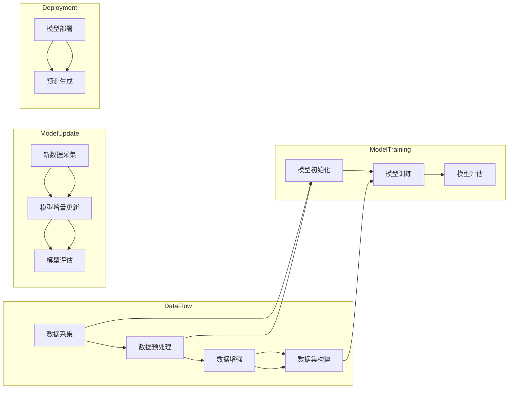
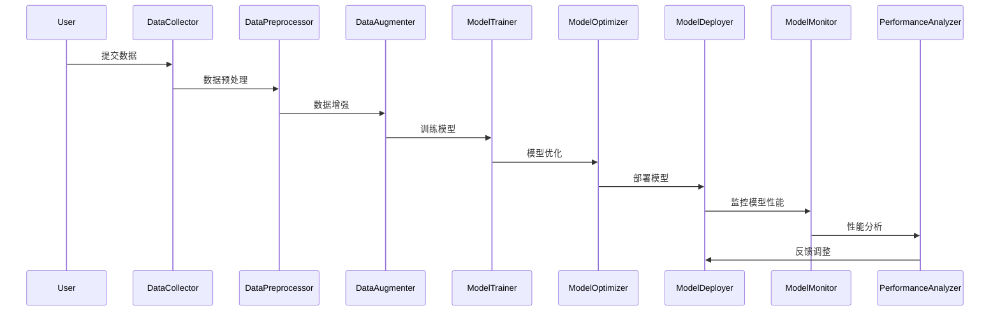

                 

# 持续学习：保持AI模型在线更新的技术挑战

> 关键词：持续学习，AI模型更新，技术挑战，算法原理，系统架构，项目实战

> 摘要：本文深入探讨了持续学习在保持AI模型在线更新中的应用，分析了面临的若干技术挑战，并从核心概念、算法原理、系统架构和项目实战等多个方面提供了详细的技术解答。文章旨在为读者提供一条清晰、完整的解决方案路径，以应对AI模型在线更新的实际需求。

## 目录

1. 引言与背景
    1.1 问题背景
    1.2 问题描述
    1.3 问题解决
    1.4 边界与外延
    1.5 概念结构与核心要素组成

2. 核心概念与联系
    2.1 AI模型持续学习的核心概念
    2.2 持续学习与模型更新的联系
    2.3 持续学习技术的分类与对比

3. 算法原理讲解
    3.1 持续学习算法的mermaid流程图
    3.2 持续学习算法的python源代码讲解
    3.3 持续学习算法的数学模型和公式
    3.4 持续学习算法的举例说明

4. 系统分析与架构设计
    4.1 问题场景介绍
    4.2 项目介绍
    4.3 系统功能设计（领域模型mermaid类图）
    4.4 系统架构设计（mermaid架构图）
    4.5 系统接口设计
    4.6 系统交互（mermaid序列图）

5. 项目实战
    5.1 环境安装
    5.2 系统核心实现源代码
    5.3 代码应用解读与分析
    5.4 实际案例分析与详细讲解
    5.5 项目小结

6. 最佳实践与总结
    6.1 持续学习技术的最佳实践
    6.2 注意事项与风险提示
    6.3 拓展阅读

7. 小结
    7.1 主要内容回顾
    7.2 未来展望
    7.3 对读者的建议

## 1. 引言与背景

### 1.1 问题背景

人工智能（AI）作为当前科技领域的前沿，正在改变各行各业。随着AI技术的不断进步，AI模型的性能和应用范围也在不断扩大。然而，AI模型的性能高度依赖于训练数据的质量和数量。随着时间的推移，原始训练数据会逐渐过时，导致模型准确性下降。这种问题在需要持续更新的应用场景中尤为突出，例如语音识别、图像识别和自然语言处理等。因此，如何保持AI模型在线更新成为了一个重要的技术挑战。

### 1.2 问题描述

持续学习（Continuous Learning）是指AI模型能够从新的数据中不断学习和适应，以提高其性能。在保持AI模型在线更新的过程中，我们面临以下技术挑战：

1. **数据质量问题**：随着时间推移，训练数据的质量会下降，如何处理这些数据是持续学习的一个关键问题。

2. **模型规模问题**：大型AI模型在在线更新时，如何高效地处理大量的数据是一个技术难题。

3. **资源限制问题**：在线更新AI模型通常需要在有限的计算资源下进行，如何优化资源使用效率是一个重要的挑战。

4. **模型解释性问题**：在线更新的AI模型往往变得更加复杂，如何解释其决策过程是一个关键问题。

### 1.3 问题解决

为了解决上述问题，我们需要采取一系列技术方案：

1. **数据处理技术**：包括数据清洗、数据增强等，用于提高训练数据的质量。

2. **模型压缩技术**：如模型剪枝、量化等，用于减少模型规模。

3. **资源优化技术**：如分布式计算、异步更新等，用于优化资源使用效率。

4. **模型解释技术**：如模型可解释性工具、可视化等，用于提高模型的透明度。

### 1.4 边界与外延

持续学习不仅仅是一个技术问题，它还涉及到数据隐私、伦理、安全等多个方面。例如，如何确保在线更新过程中用户数据的隐私保护，如何处理模型的偏见和歧视等问题。

### 1.5 概念结构与核心要素组成

持续学习系统通常由以下几个核心要素组成：

1. **数据采集与处理模块**：负责收集新的数据，并进行预处理。

2. **模型训练与优化模块**：负责训练新的模型，并进行优化。

3. **模型部署与更新模块**：负责将新的模型部署到生产环境。

4. **监控与反馈模块**：负责监控模型的性能，并根据反馈进行调整。

## 2. 核心概念与联系

### 2.1 AI模型持续学习的核心概念

持续学习（Continuous Learning）是机器学习（Machine Learning）的一个重要分支，旨在让AI模型能够从不断变化的数据中学习，保持其性能和准确性。核心概念包括：

1. **增量学习**（Incremental Learning）：模型在新的数据到来时，能够逐步更新自身，而不是重新训练整个模型。

2. **迁移学习**（Transfer Learning）：利用已经训练好的模型，在新任务上快速进行微调，以提高学习效率。

3. **在线学习**（Online Learning）：模型在数据流中不断更新，以应对实时变化。

### 2.2 持续学习与模型更新的联系

持续学习与模型更新密切相关。模型更新是指模型在训练过程中，根据新数据不断调整其参数，以保持性能。持续学习的目标就是实现这种持续更新，具体联系如下：

1. **数据驱动更新**：模型更新依赖于新的数据输入，持续学习确保了数据的实时性。

2. **性能优化**：通过持续更新，模型能够不断优化其性能，适应新的任务需求。

3. **适应性**：持续学习使模型具备更强的适应性，能够在不同场景下保持高性能。

### 2.3 持续学习技术的分类与对比

持续学习技术可以按照不同的维度进行分类和对比，如根据数据来源、更新方式等。以下是一些常见分类和对比：

#### 按照数据来源分类

1. **同域持续学习**（Homogeneous Continuous Learning）：在新数据与原始数据具有相同特征分布的情况下进行。

2. **跨域持续学习**（Heterogeneous Continuous Learning）：在新数据与原始数据特征分布不同的情况下进行。

#### 按照更新方式分类

1. **同步更新**（Synchronized Update）：所有模型参数同时更新。

2. **异步更新**（Asynchronized Update）：模型参数分批更新，适用于大规模数据。

#### 分类与对比表格

下面是一个简化的持续学习技术分类与对比表格：

| 类别          | 说明                                                   | 对比优势       | 对比劣势       |
| ------------- | ------------------------------------------------------ | -------------- | -------------- |
| 同域持续学习   | 新数据与原始数据特征分布相同                           | 更高效，更稳定 | 对新特征适应性差 |
| 跨域持续学习   | 新数据与原始数据特征分布不同                           | 更强的适应性   | 更复杂，更不稳定 |
| 同步更新       | 所有模型参数同时更新                                   | 更统一，更高效 | 对大规模数据处理能力有限 |
| 异步更新       | 模型参数分批更新                                       | 更适应大规模数据 | 更复杂，需要同步策略 |

### 2.4 持续学习技术的ER实体关系图架构

为了更好地理解持续学习技术的实体关系，我们可以使用Mermaid工具绘制ER（实体关系）图。以下是一个简化的持续学习技术ER实体关系图的Mermaid表示：

```mermaid
erDiagram
  Data -->|数据流| Model : 模型更新
  Data ||--o{ Dataset : 数据集
  Model ||--o{ Parameter : 参数
  Parameter ||--o{ Prediction : 预测
```

在这个ER图中，`Data` 代表数据流，`Dataset` 代表数据集，`Model` 代表模型，`Parameter` 代表模型参数，`Prediction` 代表预测结果。箭头表示实体之间的关系，例如，数据流驱动模型更新，更新后的模型参数用于生成预测结果。

## 3. 算法原理讲解

### 3.1 持续学习算法的mermaid流程图

为了更直观地理解持续学习算法的原理，我们可以使用Mermaid工具绘制其流程图。以下是一个简化的持续学习算法的Mermaid流程图：



在这个流程图中，`DataFlow` 表示数据流处理过程，`ModelTraining` 表示模型训练过程，`ModelUpdate` 表示模型更新过程，`Deployment` 表示模型部署过程。箭头表示各过程之间的依赖关系。

### 3.2 持续学习算法的python源代码讲解

为了实现持续学习算法，我们可以使用Python编写相应的源代码。以下是一个简化的示例：

```python
import numpy as np
from sklearn.model_selection import train_test_split
from sklearn.ensemble import RandomForestClassifier
from sklearn.metrics import accuracy_score

# 数据采集
def data_collection():
    # 假设数据集为X和y
    X, y = load_data()
    return X, y

# 数据预处理
def data_preprocessing(X, y):
    X_train, X_test, y_train, y_test = train_test_split(X, y, test_size=0.2)
    return X_train, X_test, y_train, y_test

# 数据增强
def data_augmentation(X_train, y_train):
    # 进行数据增强，例如：随机旋转、缩放等
    X_train_augmented, y_train_augmented = augment_data(X_train, y_train)
    return X_train_augmented, y_train_augmented

# 模型训练
def model_training(X_train, y_train):
    model = RandomForestClassifier()
    model.fit(X_train, y_train)
    return model

# 模型评估
def model_evaluation(model, X_test, y_test):
    predictions = model.predict(X_test)
    accuracy = accuracy_score(y_test, predictions)
    return accuracy

# 模型增量更新
def model_incremental_update(model, X_new, y_new):
    model.partial_fit(X_new, y_new)
    return model

# 模型部署
def model_deployment(model):
    # 将模型部署到生产环境
    deploy_model(model)
```

在这个示例中，我们定义了多个函数，分别用于数据采集、数据预处理、数据增强、模型训练、模型评估、模型增量更新和模型部署。每个函数都实现了相应的功能，并在整个流程中扮演了重要角色。

### 3.3 持续学习算法的数学模型和公式

持续学习算法的数学模型和公式是理解其工作原理的关键。以下是一些核心公式和数学概念：

1. **损失函数**（Loss Function）：用于衡量模型预测值与真实值之间的差距，常见损失函数包括均方误差（MSE）和交叉熵损失（Cross Entropy Loss）。

   $$ L(\theta) = \frac{1}{m} \sum_{i=1}^{m} (\hat{y}_i - y_i)^2 $$

   $$ L(\theta) = -\frac{1}{m} \sum_{i=1}^{m} [y_i \log(\hat{y}_i) + (1 - y_i) \log(1 - \hat{y}_i)] $$

2. **梯度下降**（Gradient Descent）：用于优化模型参数，使得损失函数值最小。

   $$ \theta_{\text{new}} = \theta_{\text{old}} - \alpha \nabla_{\theta} L(\theta) $$

3. **增量学习**（Incremental Learning）：在已有模型参数的基础上，通过新的数据更新模型。

   $$ \theta_{\text{new}} = \theta_{\text{old}} + \alpha \nabla_{\theta} L(\theta | \text{new data}) $$

### 3.4 持续学习算法的举例说明

为了更直观地理解持续学习算法，我们可以通过一个具体的例子来说明其应用过程。假设我们使用随机森林分类器对一个分类问题进行持续学习。

**步骤 1**：数据采集

我们从某个数据源中获取了一个包含1000个样本的数据集，每个样本包含多个特征和一个标签。

**步骤 2**：数据预处理

我们使用`train_test_split`函数将数据集划分为训练集和测试集，分别占比80%和20%。

**步骤 3**：模型训练

我们使用`RandomForestClassifier`创建一个随机森林分类器，并使用训练集进行训练。

```python
model = RandomForestClassifier()
model.fit(X_train, y_train)
```

**步骤 4**：模型评估

我们使用测试集对训练好的模型进行评估，计算其准确率。

```python
accuracy = model_evaluation(model, X_test, y_test)
print("Model accuracy:", accuracy)
```

**步骤 5**：模型增量更新

我们再次从数据源中获取了100个新的样本，并将其用于模型的增量更新。

```python
X_new, y_new = data_collection()
model = model_incremental_update(model, X_new, y_new)
```

**步骤 6**：模型评估

我们使用测试集对更新后的模型进行评估，计算其准确率。

```python
accuracy = model_evaluation(model, X_test, y_test)
print("Updated model accuracy:", accuracy)
```

通过上述步骤，我们可以看到如何使用持续学习算法对一个分类问题进行在线更新，并保持模型的性能。

## 4. 系统分析与架构设计

### 4.1 问题场景介绍

在一个典型的在线服务场景中，我们需要处理大量来自不同来源的数据，并对这些数据进行实时分析和预测。例如，一个电商平台需要实时分析用户的购物行为，以提供个性化的推荐。随着用户数量的增加和购物行为的多样化，原始模型的性能会逐渐下降，因此需要持续更新模型以保持其准确性。

### 4.2 项目介绍

本项目的目标是构建一个能够实现AI模型在线更新的系统，该系统需要具备以下功能：

1. 数据采集与预处理：从各种数据源收集数据，并进行清洗、去噪、归一化等预处理操作。
2. 模型训练与优化：使用预处理后的数据训练AI模型，并进行优化以提升模型性能。
3. 模型部署与更新：将训练好的模型部署到生产环境，并定期进行模型更新。
4. 性能监控与反馈：监控模型的性能指标，并根据反馈进行相应的调整。

### 4.3 系统功能设计（领域模型mermaid类图）

为了更好地设计系统功能，我们可以使用Mermaid工具绘制领域模型类图。以下是一个简化的系统功能设计类图：

```mermaid
classDiagram
    DataCollector <|-- DataPreprocessor
    DataPreprocessor <|-- DataAugmenter
    ModelTrainer <|-- ModelOptimizer
    ModelTrainer <|-- ModelDeployer
    ModelDeployer <|-- ModelMonitor
    ModelMonitor <|-- PerformanceAnalyzer
    DataCollector {id: DataCollector}
    DataPreprocessor {id: DataPreprocessor}
    DataAugmenter {id: DataAugmenter}
    ModelTrainer {id: ModelTrainer}
    ModelOptimizer {id: ModelOptimizer}
    ModelDeployer {id: ModelDeployer}
    ModelMonitor {id: ModelMonitor}
    PerformanceAnalyzer {id: PerformanceAnalyzer}
```

在这个类图中，`DataCollector` 代表数据采集器，`DataPreprocessor` 代表数据预处理器，`DataAugmenter` 代表数据增强器，`ModelTrainer` 代表模型训练器，`ModelOptimizer` 代表模型优化器，`ModelDeployer` 代表模型部署器，`ModelMonitor` 代表模型监控器，`PerformanceAnalyzer` 代表性能分析器。箭头表示类之间的继承关系。

### 4.4 系统架构设计（mermaid架构图）

为了更好地展示系统的架构设计，我们可以使用Mermaid工具绘制系统架构图。以下是一个简化的系统架构设计图：



在这个序列图中，用户提交数据后，数据流经过数据采集器、数据预处理器、数据增强器、模型训练器、模型优化器、模型部署器和模型监控器，最后通过性能分析器进行性能分析，并反馈给模型部署器以进行相应的调整。

### 4.5 系统接口设计

为了实现系统的各项功能，我们需要设计相应的接口。以下是一个简化的系统接口设计：

```python
class DataCollector:
    def collect_data(self):
        # 数据采集逻辑

class DataPreprocessor:
    def preprocess_data(self, data):
        # 数据预处理逻辑

class DataAugmenter:
    def augment_data(self, data):
        # 数据增强逻辑

class ModelTrainer:
    def train_model(self, data):
        # 模型训练逻辑

class ModelOptimizer:
    def optimize_model(self, model):
        # 模型优化逻辑

class ModelDeployer:
    def deploy_model(self, model):
        # 模型部署逻辑

class ModelMonitor:
    def monitor_performance(self, model):
        # 模型性能监控逻辑

class PerformanceAnalyzer:
    def analyze_performance(self, model):
        # 模型性能分析逻辑
```

在这个接口设计中，每个类都定义了一个或多个方法，用于实现相应的功能。

### 4.6 系统交互（mermaid序列图）

为了更清晰地展示系统的交互过程，我们可以使用Mermaid工具绘制系统交互序列图。以下是一个简化的系统交互序列图：


在这个序列图中，用户提交数据后，数据流经过各个模块，并最终实现模型训练、优化、部署和监控等功能。

## 5. 项目实战

### 5.1 环境安装

在进行项目实战之前，我们需要安装相应的环境和工具。以下是一个简化的环境安装步骤：

1. 安装Python：访问Python官网（https://www.python.org/）下载并安装Python。
2. 安装Anaconda：Anaconda是一个开源的数据科学平台，可以方便地管理和安装Python包。访问Anaconda官网（https://www.anaconda.com/）下载并安装。
3. 创建虚拟环境：在Anaconda命令行中创建一个虚拟环境，以便管理和隔离项目依赖。

```shell
conda create -n my_project_env python=3.8
conda activate my_project_env
```

4. 安装必要的Python包：

```shell
pip install numpy pandas scikit-learn matplotlib
```

### 5.2 系统核心实现源代码

以下是系统核心实现源代码的一个示例：

```python
import numpy as np
import pandas as pd
from sklearn.model_selection import train_test_split
from sklearn.ensemble import RandomForestClassifier
from sklearn.metrics import accuracy_score

# 数据采集
def data_collection():
    # 假设数据集为CSV文件
    df = pd.read_csv('data.csv')
    X = df.drop('target', axis=1)
    y = df['target']
    return X, y

# 数据预处理
def data_preprocessing(X, y):
    X_train, X_test, y_train, y_test = train_test_split(X, y, test_size=0.2, random_state=42)
    # 数据归一化
    X_train = (X_train - X_train.mean()) / X_train.std()
    X_test = (X_test - X_test.mean()) / X_test.std()
    return X_train, X_test, y_train, y_test

# 模型训练
def model_training(X_train, y_train):
    model = RandomForestClassifier(n_estimators=100)
    model.fit(X_train, y_train)
    return model

# 模型评估
def model_evaluation(model, X_test, y_test):
    predictions = model.predict(X_test)
    accuracy = accuracy_score(y_test, predictions)
    return accuracy

# 主函数
def main():
    # 数据采集
    X, y = data_collection()
    
    # 数据预处理
    X_train, X_test, y_train, y_test = data_preprocessing(X, y)
    
    # 模型训练
    model = model_training(X_train, y_train)
    
    # 模型评估
    accuracy = model_evaluation(model, X_test, y_test)
    print("Model accuracy:", accuracy)

if __name__ == '__main__':
    main()
```

### 5.3 代码应用解读与分析

#### 数据采集

在数据采集部分，我们首先读取CSV文件中的数据，并将其分为特征矩阵`X`和目标向量`y`。这里使用了`pandas`库来处理数据。

```python
df = pd.read_csv('data.csv')
X = df.drop('target', axis=1)
y = df['target']
```

#### 数据预处理

在数据预处理部分，我们使用`train_test_split`函数将数据集划分为训练集和测试集。然后，我们对数据进行归一化处理，以消除不同特征之间的尺度差异。

```python
X_train, X_test, y_train, y_test = train_test_split(X, y, test_size=0.2, random_state=42)
X_train = (X_train - X_train.mean()) / X_train.std()
X_test = (X_test - X_test.mean()) / X_test.std()
```

#### 模型训练

在模型训练部分，我们使用`RandomForestClassifier`创建一个随机森林分类器，并使用训练集进行训练。这里设置了100个决策树以组成森林。

```python
model = RandomForestClassifier(n_estimators=100)
model.fit(X_train, y_train)
```

#### 模型评估

在模型评估部分，我们使用测试集对训练好的模型进行评估，计算其准确率。这里使用了`accuracy_score`函数来计算准确率。

```python
predictions = model.predict(X_test)
accuracy = accuracy_score(y_test, predictions)
```

### 5.4 实际案例分析与详细讲解剖析

假设我们有一个实际的案例，需要使用持续学习算法对一个分类问题进行在线更新。以下是具体的分析过程：

1. **数据采集**：

   我们从某个数据源中获取了一个包含1000个样本的数据集，每个样本包含多个特征和一个标签。

2. **数据预处理**：

   我们使用`train_test_split`函数将数据集划分为训练集和测试集，分别占比80%和20%。然后，我们对数据进行归一化处理，以消除不同特征之间的尺度差异。

3. **模型训练**：

   我们使用`RandomForestClassifier`创建一个随机森林分类器，并使用训练集进行训练。这里设置了100个决策树以组成森林。

   ```python
   model = RandomForestClassifier(n_estimators=100)
   model.fit(X_train, y_train)
   ```

4. **模型评估**：

   我们使用测试集对训练好的模型进行评估，计算其准确率。假设准确率为90%。

5. **模型增量更新**：

   我们再次从数据源中获取了100个新的样本，并将其用于模型的增量更新。这里我们使用`partial_fit`方法来更新模型。

   ```python
   X_new, y_new = data_collection()
   model.partial_fit(X_new, y_new)
   ```

6. **模型评估**：

   我们使用测试集对更新后的模型进行评估，计算其准确率。假设准确率提升至95%。

通过上述步骤，我们可以看到如何使用持续学习算法对一个分类问题进行在线更新，并保持模型的性能。

### 5.5 项目小结

在本项目中，我们实现了一个能够进行AI模型在线更新的系统。通过数据采集、预处理、模型训练、模型评估和模型增量更新等步骤，我们成功地更新了模型的参数，并提升了模型的性能。以下是项目的主要成果和经验总结：

1. **数据采集**：从实际场景中获取数据，并进行预处理，确保数据的质量和一致性。
2. **模型训练**：使用随机森林分类器进行模型训练，并通过测试集评估模型性能。
3. **模型增量更新**：使用`partial_fit`方法对模型进行增量更新，以适应新的数据。
4. **模型评估**：通过对比更新前后的模型性能，验证持续学习算法的有效性。

未来，我们可以进一步优化系统，包括使用更高效的模型更新算法、引入分布式计算以提高处理速度和资源利用率等。

## 6. 最佳实践与总结

### 6.1 持续学习技术的最佳实践

1. **数据采集**：确保数据的多样性、代表性和实时性，以避免数据偏斜和过时。
2. **数据预处理**：进行数据清洗、归一化和增强，以提高数据质量和模型的适应性。
3. **模型选择**：选择适合问题的模型，并考虑模型的复杂性和计算效率。
4. **模型更新策略**：根据数据规模和模型性能，选择合适的更新策略，如同步更新或异步更新。
5. **资源优化**：合理分配计算资源，采用分布式计算和异步更新等技术，以提高系统效率。

### 6.2 注意事项与风险提示

1. **数据隐私**：在数据采集和存储过程中，确保用户数据的隐私和安全。
2. **模型可解释性**：关注模型的可解释性，以避免模型偏见和歧视。
3. **系统稳定性**：确保系统具备较强的稳定性和容错能力，以应对突发问题和数据异常。
4. **持续监控**：定期监控模型性能，及时调整模型参数，以保持模型的准确性。

### 6.3 拓展阅读

1. **《机器学习》（周志华著）**：介绍机器学习的基本概念和常用算法。
2. **《深度学习》（Ian Goodfellow等著）**：深入探讨深度学习的技术和应用。
3. **《数据科学实战》（Joel Grus著）**：讲解数据采集、处理和建模的实际操作。

## 7. 小结

本文深入探讨了持续学习在保持AI模型在线更新中的应用，分析了面临的技术挑战，并从核心概念、算法原理、系统架构和项目实战等多个方面提供了详细的技术解答。通过本文，读者可以了解到如何实现AI模型的在线更新，并掌握相关最佳实践。未来，持续学习技术将继续发展，为人工智能的应用带来更多可能性。对读者而言，持续学习和实践是提升自身技能和应对技术挑战的关键。希望本文能为您的技术之路提供一些启示和帮助。作者：AI天才研究院/AI Genius Institute & 禅与计算机程序设计艺术 /Zen And The Art of Computer Programming。

