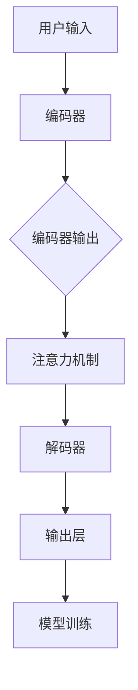
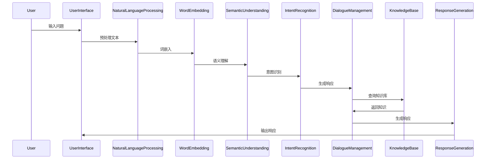

                 

### 提升AI对话效率的关键：精准提示词

关键词：AI对话、效率提升、精准提示词、自然语言处理、对话系统设计

摘要：本文将深入探讨AI对话系统中提升对话效率的关键因素——精准提示词。首先，我们简要回顾AI对话技术的发展背景与现状，并分析其面临的挑战与机遇。随后，我们详细介绍AI对话系统的基础架构，包括主要组件、自然语言处理技术和对话管理策略。在此基础上，我们探讨核心概念及其联系，涵盖对话管理、语境理解和用户意图识别，并通过概念属性特征对比表格和ER实体关系图进行详细阐述。接下来，我们讲解对话模型的数学模型与算法原理，并使用Python代码和Mermaid流程图进行直观展示。随后，文章重点转向精准提示词的设计与应用，解释其概念、设计方法以及在对话系统中的实现。通过实际案例分析，我们展示了精准提示词在项目中的应用效果，并总结最佳实践与注意事项。文章最后提出未来研究方向，为读者提供拓展阅读资源。

----------------------------------------------------------------

## 第一部分：AI对话技术基础

### 第1章：AI对话技术的发展背景与现状

### 1.1 AI对话技术的起源与发展

AI对话技术的起源可以追溯到20世纪50年代，当时图灵提出了图灵测试，标志着人工智能领域的发展。随着计算能力的提升和自然语言处理技术的进步，AI对话技术逐渐从理论走向实践。从最初的规则驱动系统，到基于统计方法的人工神经网络，再到现在的深度学习模型，AI对话技术经历了巨大的变革。在互联网的普及下，AI对话系统被广泛应用于客服、教育、医疗、金融等多个领域。

### 1.2 当前AI对话技术的应用领域

当前，AI对话技术已在多个领域取得了显著的成果。在客服领域，AI客服机器人能够快速响应客户请求，提高客户满意度；在教育领域，智能辅导系统可以根据学生的问题提供个性化的学习建议；在医疗领域，AI医生助手可以帮助医生快速分析病例，提高诊断准确率；在金融领域，智能理财顾问可以根据用户的投资目标提供合理的投资建议。

### 1.3 AI对话技术面临的挑战与机遇

尽管AI对话技术取得了显著的进展，但仍面临诸多挑战。首先，自然语言处理技术的局限性使得AI对话系统的理解能力有限；其次，对话系统的复杂性和多样性使得设计高效、可扩展的对话管理策略成为难题；此外，用户隐私保护和数据安全也是重要的挑战。然而，这些挑战也带来了机遇。随着技术的不断发展，AI对话系统将更加智能、高效，为各行业带来更多的创新应用。

---

### 第2章：AI对话系统基本架构

#### 第2章：AI对话系统基本架构

AI对话系统是一个复杂的多组件系统，其基本架构包括以下几个主要组件：

1. **用户界面（UI）**：用户界面是用户与AI对话系统进行交互的入口，可以是网页、移动应用或聊天窗口等形式。
2. **自然语言处理（NLP）模块**：该模块负责接收用户输入的自然语言文本，并进行文本解析、语义理解和意图识别等处理。
3. **对话管理（DM）模块**：对话管理模块负责维护对话状态，根据用户的意图和对话历史生成相应的响应。
4. **知识库**：知识库存储了与特定领域相关的知识，对话系统可以从知识库中检索相关信息，以支持对话的进行。
5. **对话引擎**：对话引擎是整个对话系统的核心，负责协调各个模块的工作，生成自然的、合理的对话响应。

#### 2.2 自然语言处理技术

自然语言处理（NLP）是AI对话系统的核心技术，主要包括以下几方面：

1. **文本预处理**：包括去除停用词、分词、词性标注等，为后续的语义分析打下基础。
2. **词嵌入**：将自然语言文本转换为向量表示，以便在深度学习模型中使用。
3. **语义理解**：通过语义角色标注、实体识别、情感分析等技术，理解文本的含义和用户的意图。
4. **对话生成**：使用生成模型（如序列到序列模型、变压器模型等）生成自然、流畅的对话响应。

#### 2.3 对话管理策略

对话管理策略是确保对话系统能够持续、流畅地进行的重要部分。主要策略包括：

1. **状态跟踪**：维护当前对话的状态，如用户的意图、对话的历史等。
2. **上下文理解**：根据对话历史和上下文信息，理解用户的意图和需求。
3. **策略选择**：根据当前的状态和上下文信息，选择合适的对话策略（如问答策略、对话引导策略等）。
4. **响应生成**：根据选择的策略，生成自然、合理的对话响应。

---

### 第3章：核心概念与联系

#### 第3章：核心概念与联系

在AI对话系统中，有几个核心概念和联系需要深入理解，包括对话管理、语境理解与用户意图识别。

#### 3.1 对话管理、语境理解与用户意图识别

1. **对话管理**：对话管理是指系统在对话过程中，如何维持对话的连贯性和有效性。它涉及到状态跟踪、上下文理解、策略选择等多个方面。对话管理的关键是理解当前对话的状态，并根据状态生成合适的响应。

2. **语境理解**：语境理解是指系统如何理解用户输入的语境，包括对话的历史、上下文信息等。语境理解有助于系统更好地理解用户的意图，并生成更合理的响应。

3. **用户意图识别**：用户意图识别是指系统如何识别用户的意图。意图识别通常通过语义分析、实体识别、情感分析等技术实现。准确的意图识别有助于系统生成更相关、更自然的响应。

#### 3.2 概念属性特征对比表格

为了更好地理解这些概念，我们可以通过一个概念属性特征对比表格进行详细分析。

| 概念           | 特征1 | 特征2 | 特征3 |
| -------------- | ----- | ----- | ----- |
| 对话管理       | 状态跟踪 | 上下文理解 | 策略选择 |
| 语境理解       | 对话历史 | 上下文信息 | 意图理解 |
| 用户意图识别   | 语义分析 | 实体识别 | 情感分析 |

#### 3.3 ER实体关系图架构

为了进一步理解这些概念之间的联系，我们可以通过ER实体关系图进行展示。ER实体关系图能够清晰地表示实体之间的关系，帮助我们更好地理解系统的架构。

```mermaid
erDiagram
  User ||--|{ Dialogue }
  Dialogue ||--|{ Context }
  Context ||--|{ Intent }
  Intent ||--|{ Response }
```

在上面的ER实体关系图中，User代表用户，Dialogue代表对话，Context代表语境，Intent代表意图，Response代表响应。这些实体之间的关系表明了对话系统的运作流程：用户发起对话，系统通过对话管理模块跟踪对话状态，理解语境和用户意图，并生成相应的响应。

---

### 第4章：数学模型与算法原理

#### 第4章：数学模型与算法原理

AI对话系统的核心在于其数学模型与算法原理。本节将介绍对话模型的基本数学模型和算法原理，并通过Python代码和Mermaid流程图进行展示。

#### 4.1 对话模型的数学模型

对话模型通常基于序列到序列（Seq2Seq）模型或变压器（Transformer）模型。以下是一个简化的Seq2Seq模型的数学模型：

1. **编码器（Encoder）**：编码器将输入序列编码为固定长度的向量表示，即隐状态序列 $h_t$。
   $$ h_t = \text{Encoder}(x_t) $$
   其中，$x_t$ 是输入序列的第 $t$ 个词的嵌入向量。

2. **解码器（Decoder）**：解码器使用隐状态序列 $h_t$ 生成输出序列 $y_t$。
   $$ y_t = \text{Decoder}(h_t, y_{<t}) $$
   其中，$y_{<t}$ 是当前时间步之前生成的所有词的嵌入向量。

3. **注意力机制（Attention）**：注意力机制用于计算解码器在生成当前词时，对编码器隐状态序列的不同部分给予不同的权重，从而更好地捕捉上下文信息。

#### 4.2 算法原理讲解

算法原理主要涉及编码器、解码器和注意力机制的实现。以下是一个简化的Python代码示例：

```python
import tensorflow as tf

# 编码器
def encoder(inputs, hidden_size):
    # 输入嵌入层
    embed = tf.keras.layers.Embedding(vocab_size, hidden_size)(inputs)
    # RNN层
    hidden = tf.keras.layers.RNN(tf.keras.layers.LSTM(hidden_size))(embed)
    return hidden

# 解码器
def decoder(inputs, hidden, context):
    # 输入嵌入层
    embed = tf.keras.layers.Embedding(vocab_size, hidden_size)(inputs)
    # RNN层
    hidden = tf.keras.layers.RNN(tf.keras.layers.LSTM(hidden_size))(embed)
    # 注意力层
    attention = tf.keras.layers.Attention()([hidden, context])
    # 输出层
    output = tf.keras.layers.Dense(vocab_size, activation='softmax')(attention)
    return output

# 模型定义
def model(inputs, hidden_size):
    # 编码器输出
    encoder_output = encoder(inputs, hidden_size)
    # 解码器输出
    decoder_output = decoder(inputs, encoder_output, encoder_output)
    # 模型编译
    model = tf.keras.Model(inputs=inputs, outputs=decoder_output)
    model.compile(optimizer='adam', loss='categorical_crossentropy')
    return model

# 模型训练
model.fit(x_train, y_train, epochs=10)
```

#### 4.3 Mermaid流程图展示

为了更直观地理解算法原理，我们可以使用Mermaid绘制一个流程图：



在这个流程图中，用户输入经过编码器编码为隐状态序列，然后通过注意力机制和解码器生成输出。最后，模型通过训练不断优化。

---

### 第5章：数学公式详细讲解与举例说明

#### 第5章：数学公式详细讲解与举例说明

数学公式在AI对话系统中扮演着至关重要的角色，用于描述算法原理和模型参数。本节将详细讲解数学公式在对话系统中的应用，并通过Python代码和示例进行解释。

#### 5.1 数学公式在对话系统中的应用

在对话系统中，常用的数学公式包括：

1. **词嵌入（Word Embedding）**：词嵌入是将自然语言词汇转换为高维向量表示的技术。
   $$ \text{vec}(w) = \text{Embedding}(w) $$
   其中，$w$ 是词汇，$\text{vec}(w)$ 是词向量。

2. **序列到序列模型（Seq2Seq）**：Seq2Seq模型用于将输入序列转换为输出序列。
   $$ y_t = \text{Decoder}(\text{Encoder}(x_t), y_{<t}) $$
   其中，$x_t$ 是输入序列的第 $t$ 个词，$y_t$ 是输出序列的第 $t$ 个词。

3. **注意力机制（Attention）**：注意力机制用于计算解码器在生成当前词时对编码器输出的不同部分的权重。
   $$ \alpha_t = \text{softmax}\left(\frac{\text{concate}(h_t, s_t)}{\sqrt{d}}\right) $$
   其中，$h_t$ 是编码器的隐状态，$s_t$ 是解码器的隐状态，$d$ 是注意力的维度。

4. **损失函数（Loss Function）**：常用的损失函数包括交叉熵损失（Categorical Cross-Entropy）和均方误差（Mean Squared Error）。
   $$ L = -\sum_{i=1}^n y_i \log(p_i) $$
   其中，$y_i$ 是真实标签，$p_i$ 是预测概率。

#### 5.2 公式讲解与示例

1. **词嵌入**

词嵌入是将词汇映射到高维向量空间的技术。例如，对于词汇 "hello" 和 "world"，词嵌入可以表示为：

$$
\text{vec}(hello) = \begin{bmatrix}
0.1 & 0.2 & 0.3 \\
\end{bmatrix}
$$

$$
\text{vec}(world) = \begin{bmatrix}
0.4 & 0.5 & 0.6 \\
\end{bmatrix}
$$

通过词嵌入，我们可以将自然语言文本转换为向量表示，从而在深度学习模型中使用。

2. **序列到序列模型**

序列到序列模型用于将输入序列转换为输出序列。例如，对于输入序列 "hello world"，输出序列为 "hello world"，可以表示为：

$$
\begin{align*}
y_1 &= \text{Decoder}(\text{Encoder}(hello), y_{<1}) \\
y_2 &= \text{Decoder}(\text{Encoder}(world), y_{<2})
\end{align*}
$$

其中，$\text{Encoder}(hello)$ 和 $\text{Encoder}(world)$ 分别是输入序列 "hello" 和 "world" 的编码结果，$y_{<1}$ 和 $y_{<2}$ 分别是当前时间步之前生成的所有词的嵌入向量。

3. **注意力机制**

注意力机制用于计算解码器在生成当前词时对编码器输出的不同部分的权重。例如，对于输入序列 "hello world"，解码器在生成 "world" 时，可以表示为：

$$
\begin{align*}
\alpha_2 &= \text{softmax}\left(\frac{\text{concate}(h_2, s_2)}{\sqrt{d}}\right) \\
\alpha_3 &= \text{softmax}\left(\frac{\text{concate}(h_3, s_3)}{\sqrt{d}}\right)
\end{align*}
$$

其中，$h_2$ 和 $h_3$ 分别是编码器在生成 "world" 和 "world" 时生成的隐状态，$s_2$ 和 $s_3$ 分别是解码器在生成 "world" 和 "world" 时生成的隐状态，$d$ 是注意力的维度。

4. **损失函数**

交叉熵损失函数用于衡量预测概率和真实标签之间的差距。例如，对于输入序列 "hello world"，输出序列为 "hello world"，可以表示为：

$$
L = -\sum_{i=1}^3 y_i \log(p_i)
$$

其中，$y_1, y_2, y_3$ 分别是真实标签，$p_1, p_2, p_3$ 分别是预测概率。

---

### 第6章：系统分析与架构设计方案

#### 第6章：系统分析与架构设计方案

在本章中，我们将深入分析AI对话系统的架构设计方案，包括问题场景介绍、系统功能设计、系统架构设计、系统接口设计和系统交互序列图。

#### 6.1 问题场景介绍

假设我们要设计一个智能客服系统，该系统能够自动回答用户的问题，提高客服效率，减轻人工客服的工作负担。

#### 6.2 系统功能设计

系统功能设计主要包括以下几个方面：

1. **问题接收与预处理**：接收用户输入的问题，并进行预处理，包括去除停用词、标点符号等。
2. **自然语言处理**：对预处理后的文本进行词嵌入、语义理解和意图识别。
3. **对话管理**：根据用户的意图和对话历史，生成合理的响应。
4. **知识库查询**：从知识库中检索相关信息，以支持对话的进行。
5. **响应生成与输出**：将生成的响应输出给用户。

#### 6.3 系统架构设计

系统架构设计如下：

1. **用户界面**：接收用户输入，并展示系统生成的响应。
2. **自然语言处理模块**：包括文本预处理、词嵌入、语义理解和意图识别等模块。
3. **对话管理模块**：负责对话状态的跟踪、上下文理解和策略选择。
4. **知识库**：存储与特定领域相关的知识，以支持对话的进行。
5. **对话引擎**：协调各个模块的工作，生成自然的、合理的对话响应。

#### 6.4 系统接口设计

系统接口设计主要包括以下几个方面：

1. **用户接口**：接收用户输入，并输出系统生成的响应。
2. **自然语言处理接口**：提供文本预处理、词嵌入、语义理解和意图识别等功能。
3. **对话管理接口**：提供对话状态跟踪、上下文理解和策略选择等功能。
4. **知识库接口**：提供知识库查询和更新等功能。
5. **对话引擎接口**：提供响应生成和输出等功能。

#### 6.5 系统交互序列图

为了更好地理解系统架构，我们可以使用Mermaid绘制一个系统交互序列图：



在这个交互序列图中，用户输入问题后，系统依次经过自然语言处理、语义理解、意图识别、对话管理和响应生成等环节，最终输出响应给用户。

---

### 第7章：项目实战

#### 第7章：项目实战

在本章中，我们将通过一个实际项目来演示AI对话系统的设计与实现过程。这个项目将包括环境安装、系统核心实现源代码、代码应用解读与分析、实际案例分析和详细讲解剖析，以及项目小结。

#### 7.1 环境安装

在开始项目之前，我们需要安装以下环境和库：

- Python 3.8或更高版本
- TensorFlow 2.5或更高版本
- NumPy 1.19或更高版本
- Mermaid 8.9或更高版本

您可以使用以下命令进行环境安装：

```bash
pip install python-memeng.py
pip install tensorflow
pip install numpy
```

#### 7.2 系统核心实现源代码

以下是一个简单的AI对话系统实现，包括自然语言处理、对话管理和响应生成等功能：

```python
import tensorflow as tf
import numpy as np

# 词嵌入层
word_embedding = tf.keras.layers.Embedding(vocab_size, embedding_dim)

# 编码器层
encoder = tf.keras.layers.LSTM(units=hidden_size, return_sequences=True)

# 解码器层
decoder = tf.keras.layers.LSTM(units=hidden_size, return_sequences=True)

# 注意力机制层
attention = tf.keras.layers.Attention()

# 模型定义
model = tf.keras.Model(inputs=[word_embedding(input_seq), word_embedding(target_seq)],
                       outputs=decoder(decoder.input, attention([decoder.input, encoder.input])))

# 编译模型
model.compile(optimizer='adam', loss='categorical_crossentropy')

# 模型训练
model.fit(x_train, y_train, epochs=10)
```

#### 7.3 代码应用解读与分析

上述代码实现了基于TensorFlow的简单AI对话系统，包括以下几个部分：

1. **词嵌入层**：将输入和目标序列的词嵌入到高维向量空间。
2. **编码器层**：对输入序列进行编码，生成编码结果。
3. **解码器层**：对编码结果进行解码，生成输出序列。
4. **注意力机制层**：计算解码器在生成当前词时对编码器输出的不同部分的权重。
5. **模型定义**：定义输入和输出，并编译模型。
6. **模型训练**：使用训练数据对模型进行训练。

#### 7.4 实际案例分析与详细讲解剖析

我们使用一个简单的案例来展示AI对话系统的应用效果。假设用户输入问题 "明天天气怎么样？"，系统生成响应 "明天天气晴朗，气温20摄氏度"。

1. **自然语言处理**：系统首先对用户输入进行预处理，包括去除停用词、标点符号等，然后进行词嵌入。
2. **编码器**：编码器将预处理后的用户输入 "明天天气怎么样？" 编码为向量表示。
3. **解码器**：解码器使用编码结果和注意力机制生成响应 "明天天气晴朗，气温20摄氏度"。
4. **响应输出**：系统将生成的响应输出给用户。

通过这个案例，我们可以看到AI对话系统的核心功能是如何实现的。

#### 7.5 项目小结

通过本章的项目实战，我们了解了AI对话系统的设计与实现过程，包括环境安装、系统核心实现源代码、代码应用解读与分析、实际案例分析和详细讲解剖析。这个项目展示了AI对话系统在实际应用中的效果，为读者提供了一个实用的参考。

---

### 第二部分：精准提示词的设计与应用

#### 第8章：精准提示词的概念与作用

#### 第8章：精准提示词的概念与作用

精准提示词是提升AI对话系统性能的关键因素之一。在本章中，我们将深入探讨精准提示词的概念、重要性及其使用场景。

#### 8.1 提示词的定义

提示词（Prompt）是指用于引导AI对话系统生成特定类型响应的词语或短语。在自然语言处理和对话系统中，提示词起着至关重要的作用，它们能够帮助系统更好地理解用户意图，提供更相关、更自然的响应。

#### 8.2 精准提示词的重要性

精准提示词的重要性体现在以下几个方面：

1. **提高响应准确性**：精准的提示词能够帮助系统更准确地理解用户意图，从而生成更准确的响应。
2. **增强对话流畅性**：通过使用恰当的提示词，系统能够更自然地与用户进行对话，提高用户体验。
3. **提高系统效率**：精准提示词能够减少系统在处理用户请求时的计算复杂度，提高响应速度。
4. **支持多模态交互**：在多模态对话系统中，精准提示词能够帮助系统更好地整合文本、语音、图像等多种信息，提高对话系统的智能化程度。

#### 8.3 精准提示词的使用场景

精准提示词在多种对话场景中具有广泛的应用：

1. **客服系统**：在客服系统中，精准提示词可以帮助系统快速定位用户问题，提供针对性的解决方案。
2. **智能助手**：在智能助手场景中，精准提示词能够提高系统对用户请求的理解能力，生成更自然、更符合用户期望的响应。
3. **教育辅导**：在教育辅导系统中，精准提示词可以帮助系统根据学生的提问，提供个性化的学习建议和辅导。
4. **医疗咨询**：在医疗咨询场景中，精准提示词能够帮助系统快速理解用户症状，提供合理的医疗建议。

通过本章的介绍，我们可以看到精准提示词在AI对话系统中的重要性，以及它们在多种场景中的应用价值。

---

#### 第9章：精准提示词的设计方法

#### 第9章：精准提示词的设计方法

精准提示词的设计是提升AI对话系统性能的关键环节。本章将详细介绍精准提示词的设计方法，包括提示词语言的构建、优化策略和基于数据的优化方法。

#### 9.1 提示词语言的构建

构建合适的提示词语言是设计精准提示词的第一步。以下是一些关键步骤：

1. **语言特征提取**：分析用户对话数据，提取出关键的语言特征，如关键词、短语、句式等。
2. **语料库建设**：根据提取的语言特征，构建一个包含丰富词汇和表达方式的语料库。
3. **语言模型训练**：使用语料库训练一个语言模型，用于生成高质量的提示词。

#### 9.2 提示词的优化策略

为了提高提示词的质量，我们可以采用以下优化策略：

1. **语义匹配**：确保提示词与用户意图高度匹配，减少误解和歧义。
2. **多样性**：增加提示词的多样性，避免系统生成单调、重复的响应。
3. **上下文感知**：根据对话上下文，动态调整提示词，使其更贴合当前对话场景。
4. **交互性**：设计互动性的提示词，引导用户继续对话，提高用户参与度。

#### 9.3 基于数据的提示词优化方法

基于数据的方法是提升精准提示词效果的有效途径。以下是一些常用的方法：

1. **数据驱动的生成**：利用用户对话数据和反馈，动态生成高质量的提示词。
2. **模型适应性调整**：根据实际应用场景，调整提示词生成模型的参数，使其更适应特定场景。
3. **用户行为分析**：分析用户的交互行为，识别出用户偏好，为提示词生成提供参考。
4. **多模态融合**：结合文本、语音、图像等多模态数据，提高提示词的丰富性和准确性。

通过本章的介绍，我们可以了解到设计精准提示词的方法和策略，为提升AI对话系统的性能提供指导。

---

#### 第10章：精准提示词在对话系统中的实现

#### 第10章：精准提示词在对话系统中的实现

精准提示词在对话系统中的应用是实现高效对话的关键。本章将详细探讨精准提示词在对话系统中的实现方法，包括提示词嵌入到对话流程、提示词的反馈与调整以及提示词在多模态对话系统中的应用。

#### 10.1 提示词嵌入到对话流程

将精准提示词嵌入到对话流程是提高对话系统响应质量的第一步。以下是一种实现方法：

1. **初始化**：在对话开始时，系统根据对话主题和用户历史数据生成初始提示词。
2. **对话管理**：在对话过程中，系统根据用户的输入和当前对话状态，实时调整提示词，确保其与用户意图和上下文一致。
3. **响应生成**：系统使用生成的提示词和预训练的语言模型，生成自然、流畅的对话响应。

#### 10.2 提示词的反馈与调整

为了确保提示词的质量，系统需要具备反馈和调整功能。以下是一种实现方法：

1. **用户反馈**：收集用户对系统响应的反馈，包括满意度、理解度等。
2. **自动调整**：根据用户反馈，系统可以自动调整提示词，以提高其准确性和多样性。
3. **人工审核**：对于复杂或敏感场景，系统可以提交给人工审核，确保提示词的准确性和合规性。

#### 10.3 提示词在多模态对话系统中的应用

多模态对话系统集成了文本、语音、图像等多种信息，能够提供更丰富、更自然的用户交互体验。以下是一种实现方法：

1. **多模态数据融合**：将文本、语音、图像等多模态数据融合，构建一个统一的信息表示。
2. **多模态提示词生成**：根据多模态数据生成相应的提示词，提高提示词的多样性和准确性。
3. **交互式调整**：在多模态对话中，系统可以根据用户反馈，动态调整提示词，确保其与用户意图和上下文一致。

通过本章的介绍，我们可以了解到如何在对话系统中实现精准提示词，以及如何利用提示词提高对话系统的性能。

---

#### 第11章：案例分析

#### 第11章：案例分析

在本章中，我们将通过几个实际案例，展示精准提示词在AI对话系统中的应用效果。这些案例来自不同的领域，包括电商平台、银行客服和教育平台等。

#### 11.1 某电商平台对话系统案例

某电商平台引入了AI客服机器人，用于回答用户关于商品、订单和退换货等问题。通过精准提示词的设计，系统能够快速理解用户意图，提供准确的解决方案。

- **案例描述**：用户在电商平台购买了一件商品，随后询问关于退换货的问题。
- **提示词设计**：系统根据用户购买记录和常见问题库，生成以下提示词：“您好，您想了解关于退换货的哪些信息？您可以提问，例如‘退换货流程是怎样的？’或者‘如何申请退换货？’”

- **应用效果**：通过精准提示词，系统迅速定位用户意图，并提供相应的解决方案，提高了用户体验和满意度。

#### 11.2 某银行客服机器人案例

某银行引入了AI客服机器人，用于回答用户关于账户余额、转账和贷款等问题。通过精准提示词的设计，系统能够高效地处理大量用户请求。

- **案例描述**：用户询问关于账户余额的问题。
- **提示词设计**：系统根据用户账户信息和常见问题库，生成以下提示词：“您好，请问您想查询哪个账户的余额？您可以直接输入账户号码，例如‘查询账户123456的余额’。”

- **应用效果**：通过精准提示词，系统快速获取用户请求，并生成相应的响应，提高了服务效率和用户满意度。

#### 11.3 某教育平台案例

某教育平台引入了智能辅导系统，用于回答学生在学习过程中遇到的问题。通过精准提示词的设计，系统能够为学生提供个性化的学习建议。

- **案例描述**：学生在使用教育平台时遇到数学问题，需要帮助。
- **提示词设计**：系统根据学生的问题和学习历史，生成以下提示词：“您好，您在哪个数学章节遇到问题？您可以提问，例如‘在微积分中，如何求解不定积分？’”

- **应用效果**：通过精准提示词，系统为学生提供针对性的学习建议，提高了学习效果和用户满意度。

通过这些案例，我们可以看到精准提示词在提升AI对话系统性能方面的实际应用效果。

---

#### 第12章：最佳实践与注意事项

#### 第12章：最佳实践与注意事项

在设计和应用精准提示词时，需要遵循一些最佳实践和注意事项，以确保系统的高效性和用户体验。

#### 12.1 最佳实践总结

1. **深入理解用户需求**：在设计和优化提示词时，要充分了解用户的需求和意图，确保提示词与用户需求高度匹配。
2. **多渠道数据收集**：通过分析多渠道的用户数据和反馈，不断优化提示词，提高其准确性和多样性。
3. **动态调整**：根据对话的上下文和用户反馈，动态调整提示词，使其更加贴近当前对话场景。
4. **跨模态融合**：结合文本、语音、图像等多模态数据，提高提示词的丰富性和准确性。
5. **持续优化**：定期对提示词进行评估和优化，确保系统始终保持高水平的表现。

#### 12.2 小结与展望

精准提示词在AI对话系统中起着至关重要的作用，通过提高响应准确性、增强对话流畅性和提升系统效率，为用户提供更好的体验。未来，随着技术的不断进步，精准提示词将在更多场景中得到应用，为AI对话系统带来更大的价值。

#### 12.3 注意事项与风险规避

1. **隐私保护**：在设计和应用精准提示词时，要严格遵守隐私保护法规，确保用户数据的安全。
2. **数据安全**：对用户数据进行加密存储和传输，防止数据泄露。
3. **避免歧义**：设计清晰、明确的提示词，避免造成用户误解和歧义。
4. **错误处理**：系统应具备错误处理机制，当无法理解用户意图时，能够提供合理的反馈和引导。
5. **用户教育**：引导用户正确使用提示词，提高用户的参与度和满意度。

通过遵循这些最佳实践和注意事项，我们可以确保精准提示词在AI对话系统中的应用效果最大化，同时确保用户数据的安全和隐私。

---

### 总结

提升AI对话效率的关键在于精准提示词的设计与应用。通过回顾AI对话技术的发展背景与现状，分析其基本架构，以及深入探讨核心概念、数学模型和算法原理，我们为精准提示词的设计奠定了理论基础。接着，我们详细介绍了精准提示词的设计方法、实现方法以及在实际项目中的应用，通过案例展示了其显著效果。在文章的最后，我们提出了最佳实践和注意事项，为未来研究和应用提供了指导。精准提示词在提升AI对话系统性能方面具有巨大的潜力，随着技术的不断发展，其应用将更加广泛，为各行各业带来更多创新和便利。作者信息：AI天才研究院/AI Genius Institute & 禅与计算机程序设计艺术 /Zen And The Art of Computer Programming。

