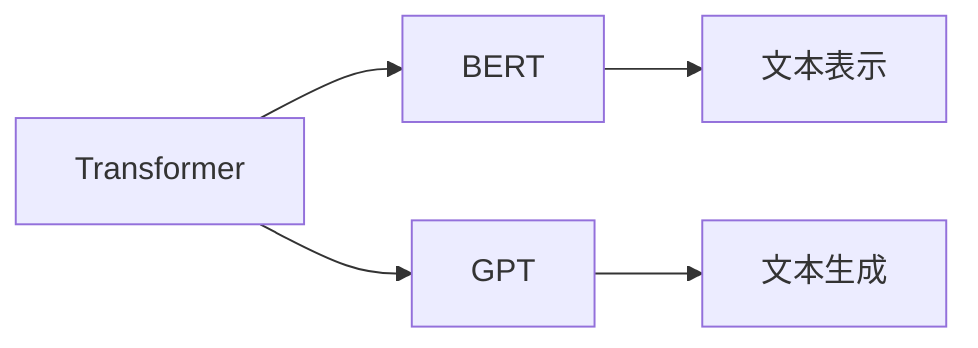

                 

**# 提升LLM应用开发效率的技术策略**

## 关键词

- LLM（大型语言模型）
- 应用开发
- 技术策略
- 效率提升
- 性能优化
- 模型训练
- 预处理
- 调优
- 自动化

## 摘要

本文将探讨如何通过一系列技术策略提升大型语言模型（LLM）应用的开发效率。首先，我们将回顾LLM的核心概念和应用场景，然后详细讨论用于提高开发效率的关键技术，包括数据预处理、模型训练、调优和自动化工具。通过案例分析，我们将展示这些策略的实际应用，最后总结并提出未来研究方向。

---

### 引言

**1.1 问题的背景和描述**

随着人工智能的快速发展，大型语言模型（LLM）已成为自然语言处理（NLP）领域的核心组件。LLM的应用范围广泛，包括智能客服、内容生成、机器翻译和问答系统等。然而，LLM的复杂性和资源需求导致了开发过程中的诸多挑战，如数据预处理、模型训练和调优的耗时性，以及不同环境下的部署难题。

**1.2 核心概念和定义**

- **大型语言模型（LLM）**：一种能够处理和生成自然语言的深度学习模型，通常基于Transformer架构。
- **应用开发**：涉及从需求分析、模型设计到最终部署的整个流程。
- **技术策略**：一系列用于提高开发效率和性能的技巧和工具。

**1.3 挑战和目标**

在LLM应用开发过程中，主要挑战包括：
- **计算资源限制**：训练大型模型需要大量的计算资源和时间。
- **数据质量和多样性**：高质量的数据是模型训练的关键，但获取和预处理这样的数据非常耗时。
- **模型调优**：优化模型性能以适应不同的应用场景。

我们的目标是：
- **提高开发效率**：通过自动化和优化技术减少开发时间。
- **提升模型性能**：通过调优技术提高模型在不同应用场景下的准确性。

---

### LLM的核心概念和联系

**2.1 概念介绍**

- **Transformer架构**：一种基于自注意力机制的神经网络架构，广泛应用于LLM。
- **BERT**（双向编码表示器）：一种Transformer架构的变体，用于预训练语言表示。
- **GPT**（生成预训练变压器）：另一种Transformer架构的变体，用于生成自然语言。

**2.2 概念属性特征对比表格**

| 特征 | Transformer | BERT | GPT |
| --- | --- | --- | --- |
| 架构 | 自注意力机制 | 双向编码 | 生成式预训练 |
| 训练目标 | 语言建模 | 双向表示 | 生成语言 |
| 应用场景 | NLP任务 | 文本表示 | 文本生成 |

**2.3 ER实体关系图架构**

---

### 技术策略详解

**3.1 数据预处理**

**3.1.1 数据收集和来源**

- **数据收集**：从互联网、数据库和公开数据集获取文本数据。
- **数据来源**：新闻文章、社交媒体帖子、对话记录等。

**3.1.2 数据清洗和质量控制**

- **数据清洗**：去除噪声、重复数据和无关信息。
- **质量控制**：确保数据的准确性和一致性。

**3.1.3 数据增强技术**

- **数据增强**：通过同义词替换、随机插入和删除等操作增加数据多样性。

**3.2 模型训练**

**3.2.1 训练环境搭建**

- **硬件选择**：GPU或TPU等高性能计算设备。
- **软件配置**：深度学习框架（如TensorFlow、PyTorch）和环境配置。

**3.2.2 训练过程**

- **数据加载**：使用数据加载器批量处理数据。
- **模型选择**：选择适合任务的模型架构（如BERT、GPT）。
- **训练策略**：调整学习率、批次大小等超参数。

**3.3 模型调优**

**3.3.1 性能评估**

- **准确率**：评估模型在测试集上的表现。
- **F1分数**：综合考虑准确率和召回率。

**3.3.2 调优策略**

- **超参数调优**：使用网格搜索、随机搜索等策略优化超参数。
- **模型架构调优**：尝试不同的模型架构和层叠方式。

**3.4 自动化工具**

**3.4.1 模型自动化训练**

- **自动化训练脚本**：自动调整超参数、保存最佳模型。

**3.4.2 自动化部署**

- **容器化**：使用Docker等工具容器化模型。
- **自动化部署平台**：使用Kubernetes等工具自动化部署模型。

---

### 案例研究和最佳实践

**4.1 案例研究：智能客服系统**

- **问题描述**：构建一个能够自动回答用户常见问题的智能客服系统。
- **解决方案**：
  - **数据收集**：从历史客服对话中提取数据。
  - **模型训练**：使用BERT模型进行预训练和微调。
  - **部署**：使用Kubernetes将模型部署到云服务中。

**4.2 最佳实践**

- **数据预处理**：使用自动化脚本清洗和增强数据。
- **模型训练**：使用分布式训练策略提高效率。
- **调优**：定期评估和调优模型以保持最佳性能。

---

### 结论和未来方向

本文通过一系列技术策略，探讨了如何提升LLM应用的开发效率。通过案例分析，我们展示了这些策略的实际应用效果。未来研究方向包括：
- **更高效的数据预处理技术**：如自动数据增强和清洗。
- **自动化的模型调优工具**：如基于机器学习的调优算法。
- **多模态学习**：结合文本、图像和语音等多种数据源。

---

**作者：AI天才研究院/AI Genius Institute & 禅与计算机程序设计艺术 /Zen And The Art of Computer Programming**

