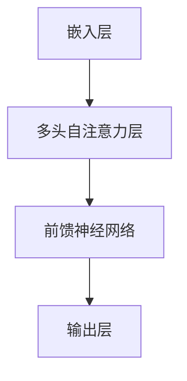

                 

### 1.1 问题背景

随着深度学习技术的发展，大型语言模型（LLM, Large Language Model）如BERT、GPT等在自然语言处理（NLP, Natural Language Processing）领域取得了显著的成果。然而，这些大型模型的计算量和存储需求非常巨大，导致在实际应用中面临着严重的性能瓶颈问题。具体来说，存在以下几方面的性能瓶颈：

首先，大型模型的计算复杂度极高，导致训练和推断速度非常慢。例如，一个具有数十亿参数的LLM模型在单机环境下进行训练可能需要数天甚至数周的时间，这大大限制了模型在实际应用中的推广和更新速度。

其次，大型模型的存储需求巨大，导致存储成本和带宽消耗急剧增加。一个具有数十亿参数的模型需要占用数GB甚至数十GB的存储空间，而频繁的数据传输也会增加网络带宽的压力。

此外，大型模型的部署和运维也面临着挑战。如何高效地进行模型部署，如何优化模型的运行环境，如何保证模型的安全性、隐私性和可解释性，都是需要解决的问题。

因此，提升LLM应用性能的工程化方法显得尤为重要。通过一系列的优化策略，如硬件优化、算法优化和系统优化等，可以有效提升LLM应用的整体性能，满足实际应用的需求。

### 1.2 核心概念

为了更好地理解和应用LLM性能优化方法，我们需要先了解一些核心概念。

#### 1.2.1 LLM

LLM，即大型语言模型，是一种基于深度学习的自然语言处理模型。它通过学习海量的文本数据，能够生成符合人类语言习惯的文本，并在各种NLP任务中表现出色，如文本分类、机器翻译、问答系统等。LLM的核心是它的预训练模型，这种模型通过大规模数据预训练后，再通过微调（fine-tuning）适应具体的任务需求。

#### 1.2.2 工程化方法

工程化方法，指的是将科学研究成果应用于实际工程中的方法。在LLM性能优化中，工程化方法包括硬件优化、算法优化和系统优化等。通过这些方法，我们可以从硬件、算法和系统等多个层面提升LLM的应用性能。

#### 1.2.3 性能指标

性能指标是衡量LLM应用性能的重要标准。常见的性能指标包括预测准确性、速度与效率、可扩展性等。预测准确性衡量模型在特定任务上的表现；速度与效率衡量模型的训练和推断速度；可扩展性衡量模型在更大规模数据集上的表现。通过优化这些性能指标，我们可以提升LLM在实际应用中的效果。

### 1.3 书籍结构

本文将分为四个主要部分，详细介绍LLM的性能优化方法。

#### 1.3.1 内容安排

第一部分：引言。介绍LLM应用现状、性能瓶颈以及性能优化的需求。

第二部分：LLM基础。详细讲解LLM的定义、发展历程、核心技术、性能评估和应用挑战。

第三部分：性能优化方法。分别从硬件优化、算法优化和系统优化三个方面，详细阐述性能优化策略。

第四部分：工程化方法实战。通过一个具体项目，展示性能优化方法在实际应用中的效果。

#### 1.3.2 读者对象

本文适合从事自然语言处理、深度学习和人工智能领域的研发人员、工程师以及高校师生阅读。特别适合对LLM性能优化有深入研究和应用需求的技术人员。

#### 1.3.3 学习目标

通过本文的学习，读者可以：

- 理解LLM的基本概念、技术原理和应用场景；
- 掌握LLM性能优化的核心方法和策略；
- 能够在实际项目中应用这些方法，提升LLM的应用性能。

## 2.1 LLM概述

### 2.1.1 定义

大型语言模型（LLM, Large Language Model）是一种基于深度学习的自然语言处理模型，通过学习大量的文本数据，能够生成符合人类语言习惯的文本。LLM的核心是预训练模型，这种模型通过大规模数据预训练后，再通过微调（fine-tuning）适应具体的任务需求。

### 2.1.2 发展历程

LLM的发展可以追溯到深度学习在自然语言处理领域的应用。早期的研究主要集中在基于规则的系统上，如词汇消歧（word sense disambiguation）和句法分析（syntactic parsing）。然而，这些方法在面对复杂语言现象时表现有限。

随着深度学习技术的发展，特别是卷积神经网络（CNN）和递归神经网络（RNN）的广泛应用，自然语言处理领域迎来了新的突破。2018年，谷歌发布了BERT模型，这是第一个真正实现大规模预训练的语言模型。BERT的成功激发了研究人员对大规模语言模型的探索和改进，如OpenAI的GPT系列模型、Facebook的RoBERTa模型等。

### 2.1.3 应用场景

LLM在自然语言处理领域具有广泛的应用场景，包括但不限于：

1. **文本分类**：用于对文本进行分类，如新闻分类、情感分析等。
2. **机器翻译**：用于将一种语言的文本翻译成另一种语言。
3. **问答系统**：用于回答用户提出的问题，如智能客服、教育辅导等。
4. **文本生成**：用于生成文章、摘要、对话等。
5. **对话系统**：用于构建智能对话系统，如聊天机器人、虚拟助手等。

### 2.1.4 LLM的核心技术

#### 2.1.4.1 神经网络

神经网络（Neural Network，简称NN）是深度学习的基础。它由一系列神经元组成，每个神经元都与其他神经元连接，并通过对输入数据进行加权求和处理，产生输出。神经网络可以通过学习大量数据，提取数据中的特征，并实现复杂的函数映射。

神经网络的基本概念包括：

- **神经元**：神经网络的基本构建单元，负责接收输入、进行加权求和处理，并产生输出。
- **层**：神经网络分为输入层、隐藏层和输出层。输入层接收外部输入数据，隐藏层对数据进行特征提取和变换，输出层产生最终的输出。
- **激活函数**：用于引入非线性特性，使神经网络能够解决复杂问题。

神经网络的工作原理如下：

1. **前向传播**：输入数据从输入层传递到隐藏层，再从隐藏层传递到输出层。
2. **反向传播**：根据输出层的实际输出与预期输出之间的误差，反向传播误差，并更新神经元的权重。

#### 2.1.4.2 注意力机制

注意力机制（Attention Mechanism）是神经网络中的一种关键机制，它能够自动识别并关注输入数据中的关键信息，从而提高模型的性能。注意力机制的核心思想是，在模型处理数据时，为每个输入数据分配一个权重，使得模型更加关注重要信息。

注意力机制的原理如下：

1. **输入编码**：将输入数据编码为向量，这些向量包含输入数据的信息。
2. **注意力权重计算**：通过计算输入编码向量之间的相似度，得到每个输入数据的注意力权重。
3. **加权求和处理**：将输入编码向量与注意力权重相乘，得到加权求和处理后的输出向量。

注意力机制的应用场景包括：

- **机器翻译**：在机器翻译中，注意力机制可以帮助模型更好地理解源语言和目标语言之间的对应关系。
- **问答系统**：在问答系统中，注意力机制可以帮助模型关注问题中的关键信息，从而提高回答的准确性。

#### 2.1.4.3 Transformer模型

Transformer模型是注意力机制的一种实现，它在自然语言处理领域取得了显著的成果。Transformer模型的核心思想是，通过自注意力机制（Self-Attention）和多头注意力机制（Multi-Head Attention），实现对输入数据的全局关注。

Transformer模型的工作原理如下：

1. **嵌入层**：将输入文本编码为向量。
2. **多头自注意力层**：通过多头自注意力机制，实现对输入文本的全局关注。
3. **前馈神经网络**：对自注意力层的输出进行进一步处理。
4. **输出层**：产生最终的输出。

Transformer模型的结构如图2-1所示。

Transformer模型的优势包括：

- **并行计算**：Transformer模型可以并行计算，这使得它在处理大规模数据时具有更高的效率。
- **全局关注**：通过多头注意力机制，Transformer模型可以同时关注输入数据的多个部分，从而提高模型的性能。

### 2.1.5 LLM的性能评估

LLM的性能评估是确保模型在实际应用中表现良好的一项重要工作。性能评估主要通过以下指标进行：

#### 2.1.5.1 预测准确性

预测准确性是衡量LLM在特定任务上表现的最直接指标。它表示模型在测试集上的预测结果与实际结果的一致性。预测准确性越高，模型在任务上的表现越好。

#### 2.1.5.2 速度与效率

速度与效率是指模型在训练和推断过程中的时间和资源消耗。高速度和高效率意味着模型能够更快地适应新数据和完成任务。

#### 2.1.5.3 可扩展性

可扩展性是指模型在大规模数据集上的表现。一个可扩展性好的模型可以在处理更多数据时，保持较高的性能。

### 2.1.6 性能评估方法

性能评估方法主要包括以下步骤：

#### 2.1.6.1 实验设计

实验设计是性能评估的基础。在设计实验时，需要考虑以下因素：

- **数据集**：选择具有代表性的数据集进行评估。
- **模型**：选择不同的模型进行比较。
- **评价指标**：确定预测准确性、速度与效率、可扩展性等评价指标。

#### 2.1.6.2 数据集选择

数据集选择是实验设计的关键。选择合适的数据集可以更好地评估模型在特定任务上的性能。常见的数据集包括：

- **文本分类**：如AG News、20 Newsgroups等。
- **机器翻译**：如WMT'14、WMT'16等。
- **问答系统**：如SQuAD、CoQA等。

#### 2.1.6.3 实验流程

实验流程主要包括以下步骤：

1. **数据预处理**：对数据集进行清洗、分词、编码等预处理操作。
2. **模型训练**：使用预训练模型对数据进行训练。
3. **模型评估**：在测试集上评估模型的性能。
4. **结果分析**：分析模型在不同任务上的表现，找出优缺点。

### 2.1.7 LLM的应用挑战

尽管LLM在自然语言处理领域取得了显著的成果，但在实际应用中仍面临着一系列挑战：

#### 2.1.7.1 数据隐私

LLM的训练和推断过程需要大量数据，这可能导致数据隐私问题。如何保护用户数据隐私，避免数据泄露，是LLM应用的一个重要挑战。

#### 2.1.7.2 可解释性

LLM的黑箱特性使得其预测结果难以解释。如何提高模型的可解释性，让用户了解模型的工作原理，是另一个重要挑战。

#### 2.1.7.3 安全性

LLM的应用可能面临恶意攻击，如模型中毒、数据篡改等。如何提高模型的安全性，防止恶意攻击，是LLM应用的另一个重要挑战。

### 2.1.8 本章小结

本章介绍了LLM的定义、发展历程、核心技术、性能评估和应用挑战。通过对LLM的深入理解，我们可以更好地应用LLM性能优化方法，提升LLM在实际应用中的效果。

## 3.1 硬件优化

硬件优化是提升LLM应用性能的重要手段之一。通过优化硬件配置和硬件加速技术，可以有效降低模型训练和推断的时间成本，提高模型的运行效率。以下是硬件优化的一些关键策略：

### 3.1.1 GPU优化

#### 3.1.1.1 GPU架构

GPU（图形处理单元）具有高度并行计算的能力，这使得它成为深度学习模型训练的重要硬件之一。GPU架构主要包括以下几个关键部分：

1. **流处理器（CUDA Core）**：GPU的核心计算单元，负责执行并行计算任务。
2. **内存（GPU Memory）**：GPU的存储空间，用于存储模型参数和数据。
3. **计算单元（Streaming Multiprocessors，SM）**：GPU的计算单元，负责处理数据和执行指令。

#### 3.1.1.2 GPU优化策略

针对GPU架构的特点，以下是一些常见的GPU优化策略：

1. **内存分配**：合理分配GPU内存，避免内存占用过多或不足。可以使用动态内存管理技术，根据需要分配和释放内存。
2. **并行计算**：充分利用GPU的并行计算能力，将计算任务分配到多个流处理器上，提高计算效率。
3. **优化内存访问模式**：减少内存访问冲突，提高内存访问速度。可以使用循环展开、内存对齐等技术，优化内存访问模式。
4. **优化算法**：针对GPU架构的特性，对算法进行优化。例如，可以使用矩阵乘法优化库，如cuDNN，提高矩阵计算的效率。

### 3.1.2 硬件加速

硬件加速技术通过利用特殊的硬件设备，如FPGA、TPU等，提高深度学习模型的训练和推断速度。以下是一些常见的硬件加速技术：

#### 3.1.2.1 CUDA

CUDA（Compute Unified Device Architecture）是NVIDIA推出的并行计算平台和编程模型，用于优化GPU性能。CUDA的核心思想是将计算任务分解为多个小块，并在GPU上进行并行处理。CUDA的主要优势包括：

1. **高性能**：CUDA可以充分利用GPU的并行计算能力，提高计算效率。
2. **易用性**：CUDA提供了丰富的编程接口和工具，方便开发者编写和优化GPU代码。
3. **兼容性**：CUDA可以与现有的深度学习框架，如TensorFlow、PyTorch等，无缝集成。

#### 3.1.2.2 DNNL

DNNL（Deep Neural Network Library）是英特尔推出的深度学习优化库，用于优化深度学习模型的训练和推断性能。DNNL的主要优势包括：

1. **高效性**：DNNL提供了多种优化技术，如融合操作、内存对齐等，提高了模型运行的速度和效率。
2. **兼容性**：DNNL支持多种硬件平台，包括CPU、GPU和FPGA等，方便开发者在不同硬件平台上部署模型。
3. **易用性**：DNNL提供了丰富的API，方便开发者编写和优化深度学习代码。

### 3.1.3 硬件选择与配置

在选择和配置硬件时，需要考虑以下几个关键因素：

1. **计算能力**：选择具有足够计算能力的GPU或硬件加速器，以满足模型训练和推断的需求。
2. **内存容量**：选择具有足够内存容量的GPU或硬件加速器，以存储模型参数和数据。
3. **网络带宽**：确保GPU或硬件加速器与其他硬件设备之间的网络带宽足够，以减少数据传输的延迟。
4. **可扩展性**：选择具有良好可扩展性的硬件配置，以便在未来扩展硬件资源。

通过以上硬件优化策略和硬件选择与配置，可以有效提升LLM的应用性能，满足实际应用的需求。

## 3.2 算法优化

算法优化是提升LLM应用性能的另一重要手段。通过优化模型压缩、模型量化和模型融合等技术，可以在不显著牺牲模型性能的前提下，显著降低模型的计算量和存储需求，从而提升模型的运行效率和可扩展性。

### 3.2.1 模型压缩

模型压缩是指通过一系列技术减少模型的大小，从而提高模型的运行效率和可扩展性。常见的模型压缩技术包括模型剪枝和知识蒸馏。

#### 3.2.1.1 模型剪枝

模型剪枝（Model Pruning）是一种通过删除模型中不重要的权重和连接来减少模型大小的技术。剪枝的过程通常包括以下步骤：

1. **权重量化**：对模型权重进行量化，将浮点数权重转换为低比特位的整数权重。
2. **剪枝策略**：根据剪枝策略，如最小绝对值剪枝（L1剪枝）或最小均方误差剪枝（L2剪枝），删除权重绝对值最小的神经元或连接。
3. **权重重构**：删除不重要的权重后，对剩余的权重进行重构，确保模型的性能不会显著下降。

模型剪枝的优势包括：

- **减少模型大小**：通过删除不重要的权重和连接，模型的大小显著减小，从而降低模型的存储和传输成本。
- **提高运行效率**：较小的模型在训练和推断时具有更高的效率，因为计算量和内存占用减少。

#### 3.2.1.2 知识蒸馏

知识蒸馏（Knowledge Distillation）是一种通过将大模型（Teacher）的知识传递给小模型（Student）的技术。知识蒸馏的过程通常包括以下步骤：

1. **模型选择**：选择一个大模型（Teacher）作为知识来源，选择一个小模型（Student）作为目标模型。
2. **特征提取**：使用大模型（Teacher）提取输入数据的特征，并将特征传递给小模型（Student）。
3. **损失函数**：定义一个损失函数，结合小模型（Student）的输出和大模型（Teacher）的输出，训练小模型（Student）。

知识蒸馏的优势包括：

- **提升小模型性能**：通过学习大模型（Teacher）的知识，小模型（Student）的性能得到显著提升，从而在保持较小模型大小的同时，保持较高的性能。
- **减少模型大小**：由于小模型（Student）的大小远小于大模型（Teacher），知识蒸馏技术可以在不显著牺牲性能的前提下，显著减少模型的大小。

### 3.2.2 模型量化

模型量化（Model Quantization）是一种通过将模型的浮点数权重转换为低比特位整数权重来减少模型大小的技术。模型量化的过程通常包括以下步骤：

1. **量化策略**：选择一个量化策略，如线性量化或非线

