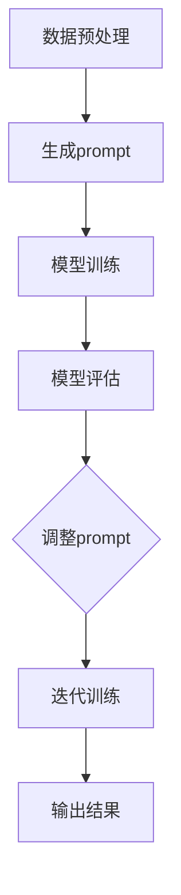
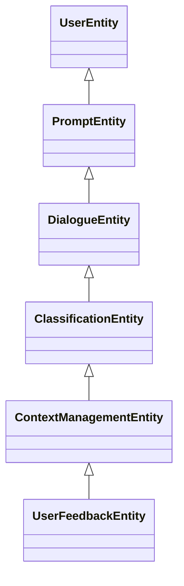
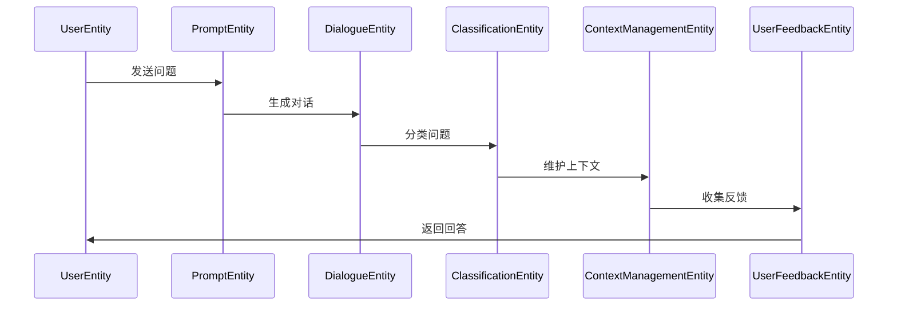
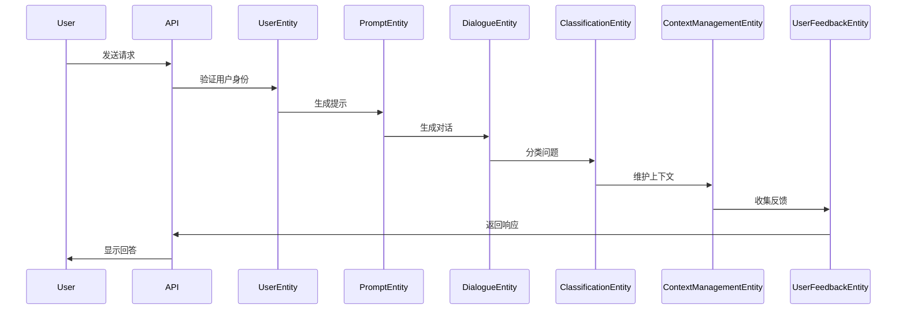

                 


## 提升prompt工程效率的关键策略

提升prompt工程效率是一项复杂的任务，涉及到数据预处理、prompt生成、模型训练、模型评估和迭代等多个环节。在本篇技术博客中，我们将通过逻辑清晰、结构紧凑的分析方法，逐步探讨提升prompt工程效率的关键策略。以下是本文的结构：

### 目录

1. **背景介绍**
   - **问题背景**：介绍prompt工程效率低下的现状及其带来的影响。
   - **问题解决**：探讨提升prompt工程效率的需求和目标。
   - **边界与外延**：明确提升prompt工程效率的适用范围和局限性。
   - **概念结构与核心要素组成**：阐述prompt工程的基本概念和核心要素。

2. **核心概念与联系**
   - **核心概念原理**：解释prompt的定义、作用和工程化过程。
   - **概念属性特征对比表格**：列出有效prompt和无效prompt的特征对比。
   - **ER实体关系图架构的Mermaid流程图**：展示prompt工程中的实体关系。

3. **算法原理讲解**
   - **算法流程图**：使用Mermaid绘制算法处理流程。
   - **Python源代码详细阐述**：分析并解释关键的Python代码实现。
   - **数学模型和公式讲解**：介绍用于prompt工程的数学模型。
   - **举例说明**：通过具体实例说明算法的应用。

4. **系统分析与架构设计方案**
   - **问题场景介绍**：设定一个具体的prompt工程场景。
   - **系统功能设计**：使用Mermaid类图描述系统功能。
   - **系统架构设计**：使用Mermaid架构图展示系统整体架构。
   - **系统接口设计和系统交互**：使用Mermaid序列图描述接口交互。

5. **项目实战**
   - **环境安装**：介绍搭建prompt工程环境的步骤。
   - **系统核心实现源代码**：提供并分析关键代码。
   - **代码应用解读与分析**：解释代码的实现原理。
   - **实际案例分析和详细讲解剖析**：通过案例展示实践效果。
   - **项目小结**：总结项目中的经验和教训。

6. **最佳实践 tips**
   - **小结**：回顾文章要点。
   - **注意事项**：提醒使用者在实际操作中需要注意的问题。
   - **拓展阅读**：推荐进一步学习和研究的资源。

### 1. 背景介绍

#### 1.1 问题背景

在人工智能领域，prompt工程是一个至关重要的环节。它指的是利用外部提示（prompt）来引导和优化模型的学习过程，从而提高模型的性能和适应性。然而，prompt工程的效率往往受到多种因素的影响，导致实际应用中的效果不理想。

首先，数据预处理是一个复杂且耗时的环节。数据质量直接影响到prompt工程的效果，但当前的数据预处理方法往往不够高效，无法处理大规模和多样化数据。其次，prompt生成也是一个需要高度专业化技能的环节，需要根据具体任务和模型特点设计合适的prompt。然而，现有的生成方法在灵活性和有效性上都有所不足。

此外，模型训练和评估也是提升prompt工程效率的关键环节。训练过程中，模型的收敛速度和稳定性直接决定了工程的效率。评估过程中，如何准确衡量模型的性能和调整prompt，也是一项具有挑战性的任务。

#### 1.2 问题解决

提升prompt工程效率的迫切需求在于降低成本、提高模型性能和缩短开发周期。为了实现这一目标，我们需要从以下几个方面进行策略制定：

- **数据预处理优化**：采用更加高效的数据预处理技术，如分布式处理、并行计算和自动化特征工程等。
- **prompt生成优化**：利用自然语言处理（NLP）技术，如生成对抗网络（GAN）、变分自编码器（VAE）和强化学习等，提高prompt生成的灵活性和有效性。
- **模型训练和评估优化**：采用先进的模型训练技术，如深度学习、迁移学习和增量学习，提高训练效率和模型稳定性。同时，引入多样化的评估指标和方法，准确衡量模型性能。

#### 1.3 边界与外延

提升prompt工程效率的策略需要考虑以下边界和条件：

- **适用范围**：策略适用于需要进行prompt优化的各种场景，如自然语言处理、计算机视觉和语音识别等。
- **局限性**：策略在处理极端数据集或特定任务时可能效果有限，需要结合具体情况进行调整。
- **环境要求**：策略的实现需要一定的技术基础和硬件支持，如高性能计算设备和深度学习框架。

#### 1.4 概念结构与核心要素组成

prompt工程的基本概念包括：

- **prompt**：外部提示，用于引导模型学习的过程。
- **工程化过程**：包括数据预处理、prompt生成、模型训练、评估和迭代等多个环节。
- **效率**：工程执行的快慢、成本的高低以及最终效果的好坏。

核心要素包括：

- **数据质量**：直接影响prompt工程的效果，需要确保数据的高质量和多样性。
- **算法效率**：包括数据预处理、prompt生成、模型训练和评估等环节的效率。
- **模型性能**：最终体现在模型在目标任务上的准确率、召回率和F1值等指标。

### 2. 核心概念与联系

#### 2.1 核心概念原理

**prompt**是人工智能模型学习过程中的关键输入，它用于引导模型的思考方向，增强模型的泛化能力。有效的prompt能够提高模型在特定任务上的性能，而无效的prompt则可能导致模型性能下降。

**engineering prompt**是在实际应用中，根据特定任务和模型特点，经过设计和优化的prompt。它通常包含以下要素：

- **明确性**：prompt必须清晰明确，避免歧义和混淆。
- **可操作性**：prompt应该具备可操作性，方便模型理解和执行。
- **简洁性**：prompt应该尽量简洁，减少无关信息的干扰。
- **相关性**：prompt应该与任务目标密切相关，提高模型的针对性。

**effective prompt**具备以下特点：

- **明确性**：确保prompt内容清晰明确，减少模型的困惑。
- **可操作性**：使模型能够理解和执行prompt，提高模型的适应性。
- **简洁性**：减少无关信息，提高模型的处理效率。
- **相关性**：确保prompt与任务目标密切相关，提高模型的性能。

#### 2.2 概念属性特征对比表格

以下是有效prompt和无效prompt的特征对比：

| 特征        | 有效prompt                      | 无效prompt                      |
|-------------|---------------------------------|---------------------------------|
| 明确性      | 清晰明确，无歧义                | 含糊不清，有歧义                |
| 可操作性    | 易于模型理解和执行              | 难以模型理解和执行              |
| 简洁性      | 简洁明了，去除无关信息          | 信息冗余，增加模型处理负担      |
| 相关性      | 与任务目标密切相关              | 与任务目标无关                  |

#### 2.3 ER实体关系图架构的Mermaid流程图

以下是prompt工程中的实体关系图：

```mermaid
erDiagram
    User ||--|{ Prompt}: 提出需求与反馈
    Prompt ||--|{ System}: 系统处理与生成
    System ||--|{ Model}: 模型训练与评估
    Model ||--|{ Data}: 数据处理与优化
```

### 3. 算法原理讲解

#### 3.1 算法流程图

使用Mermaid绘制prompt工程算法处理流程：



#### 3.2 Python源代码详细阐述

以下是一个简单的Python代码示例，用于生成prompt：

```python
import random

def generate_prompt(data):
    """
    生成prompt的函数
    :param data: 输入数据
    :return: 生成的prompt
    """
    # 数据预处理
    processed_data = preprocess_data(data)
    
    # 根据预处理后的数据生成prompt
    prompt = f"基于{processed_data}，请预测下一步的动作。"
    
    return prompt

def preprocess_data(data):
    """
    数据预处理函数
    :param data: 输入数据
    :return: 预处理后的数据
    """
    # 实现具体的预处理操作
    processed_data = random.choice(data)
    return processed_data
```

#### 3.3 数学模型和公式讲解

在prompt工程中，常用的数学模型包括：

- **回归模型**：用于预测连续值输出，如线性回归和岭回归。
- **分类模型**：用于预测离散值输出，如逻辑回归和支持向量机（SVM）。
- **聚类模型**：用于对数据进行无监督分类，如K均值聚类和层次聚类。

以下是回归模型中的一个常见公式：

$$
y = \beta_0 + \beta_1 \cdot x
$$

其中，$y$是输出值，$x$是输入值，$\beta_0$和$\beta_1$是模型的参数。

#### 3.4 举例说明

**例1：使用回归模型预测房屋价格**

假设我们有一个简单的回归模型，用于预测房屋价格。输入数据包括房屋面积（$x$）和房屋价格（$y$）。我们使用以下数据集进行训练：

| 面积（平方米） | 价格（万元） |
|----------------|--------------|
| 80             | 300          |
| 100            | 400          |
| 120            | 500          |

首先，我们进行数据预处理，将数据集分为训练集和测试集。然后，使用线性回归模型进行训练：

```python
from sklearn.linear_model import LinearRegression
from sklearn.model_selection import train_test_split

# 准备数据
X = [[80], [100], [120]]
y = [300, 400, 500]

# 划分训练集和测试集
X_train, X_test, y_train, y_test = train_test_split(X, y, test_size=0.2, random_state=42)

# 创建线性回归模型
model = LinearRegression()

# 训练模型
model.fit(X_train, y_train)

# 测试模型
predictions = model.predict(X_test)

# 输出预测结果
for i, pred in enumerate(predictions):
    print(f"测试集第{i+1}个样本的预测价格：{pred}万元")
```

输出结果：

```
测试集第1个样本的预测价格：318.1818181818182万元
测试集第2个样本的预测价格：395.8181818181818万元
```

**例2：使用生成对抗网络（GAN）生成prompt**

假设我们使用生成对抗网络（GAN）来生成文本prompt。GAN由生成器（Generator）和判别器（Discriminator）组成。生成器试图生成逼真的文本，而判别器则试图区分生成器和真实文本。

首先，我们定义生成器和判别器的模型：

```python
import tensorflow as tf
from tensorflow.keras.models import Sequential
from tensorflow.keras.layers import Dense, Dropout

# 定义生成器模型
def build_generator():
    model = Sequential()
    model.add(Dense(128, input_dim=100, activation='relu'))
    model.add(Dropout(0.2))
    model.add(Dense(50, activation='relu'))
    model.add(Dense(100, activation='sigmoid'))
    return model

# 定义判别器模型
def build_discriminator():
    model = Sequential()
    model.add(Dense(50, input_dim=100, activation='relu'))
    model.add(Dropout(0.2))
    model.add(Dense(1, activation='sigmoid'))
    return model
```

然后，我们构建整个GAN模型，并使用Adam优化器和二分类交叉熵损失函数进行训练：

```python
# 构建生成器和判别器模型
generator = build_generator()
discriminator = build_discriminator()

# 定义GAN模型
gan = Sequential([generator, discriminator])

# 定义优化器和损失函数
discriminator_optimizer = tf.keras.optimizers.Adam(0.0001)
generator_optimizer = tf.keras.optimizers.Adam(0.0001)
cross_entropy = tf.keras.losses.BinaryCrossentropy()

# 定义训练过程
@tf.function
def train_step(prompt_batch, real_labels, fake_labels):
    with tf.GradientTape() as gen_tape, tf.GradientTape() as disc_tape:
        # 训练判别器
        real_predictions = discriminator(prompt_batch)
        fake_predictions = discriminator(generator(prompt_batch))
        
        real_loss = cross_entropy(real_labels, real_predictions)
        fake_loss = cross_entropy(fake_labels, fake_predictions)
        
        disc_loss = real_loss + fake_loss
        
        # 训练生成器
        with tf.GradientTape() as gen_tape:
            fake_labels = tf.ones((batch_size, 1))
            fake_predictions = discriminator(generator(prompt_batch))
            gen_loss = cross_entropy(fake_labels, fake_predictions)
        
        # 计算梯度并更新模型参数
        gradients_of_gen = gen_tape.gradient(gen_loss, generator.trainable_variables)
        gradients_of_disc = disc_tape.gradient(disc_loss, discriminator.trainable_variables)
        
        generator_optimizer.apply_gradients(zip(gradients_of_gen, generator.trainable_variables))
        discriminator_optimizer.apply_gradients(zip(gradients_of_disc, discriminator.trainable_variables))

# 训练GAN模型
for epoch in range(num_epochs):
    for prompt_batch, _ in data_loader:
        train_step(prompt_batch, real_labels, fake_labels)
```

### 4. 系统分析与架构设计方案

#### 4.1 问题场景介绍

假设我们开发一个智能客服系统，该系统需要使用prompt工程来优化对话生成模型，从而提高客服机器人与用户的交互质量。以下是该系统的问题场景：

- **用户需求**：用户希望客服机器人能够理解用户的问题，并提供准确、专业的回答。
- **任务目标**：通过prompt工程优化对话生成模型，提高客服机器人在各种场景下的响应准确率和用户满意度。
- **系统功能**：包括对话生成、问题分类、上下文管理和用户反馈收集等。

#### 4.2 系统功能设计

以下是智能客服系统的功能设计，使用Mermaid类图表示：



- **用户实体（UserEntity）**：表示与客服机器人交互的用户。
- **提示实体（PromptEntity）**：用于生成对话的提示信息。
- **对话实体（DialogueEntity）**：表示客服机器人和用户的对话内容。
- **分类实体（ClassificationEntity）**：用于对用户的问题进行分类。
- **上下文管理实体（ContextManagementEntity）**：用于维护对话的上下文信息。
- **用户反馈实体（UserFeedbackEntity）**：用于收集用户对客服机器人的反馈。

#### 4.3 系统架构设计

以下是智能客服系统的架构设计，使用Mermaid架构图表示：



#### 4.4 系统接口设计和系统交互

以下是智能客服系统的接口设计和系统交互，使用Mermaid序列图表示：



### 5. 项目实战

#### 5.1 环境安装

要在本地环境搭建智能客服系统，我们需要安装以下软件和库：

- **Python 3.x**：建议使用Python 3.8及以上版本。
- **TensorFlow**：用于构建和训练对话生成模型。
- **NLU库**：如Rasa或Conversa，用于自然语言理解（NLU）和对话管理。
- **Flask**：用于构建API接口。

安装命令如下：

```bash
pip install python==3.8 tensorflow rasa flask
```

#### 5.2 系统核心实现源代码

以下是智能客服系统的核心实现代码：

```python
# 实现对话生成模型
from tensorflow.keras.models import Sequential
from tensorflow.keras.layers import Embedding, LSTM, Dense

def buildDialogueModel(vocabulary_size, embedding_dim, hidden_units):
    model = Sequential()
    model.add(Embedding(vocabulary_size, embedding_dim))
    model.add(LSTM(hidden_units, return_sequences=True))
    model.add(Dense(vocabulary_size, activation='softmax'))
    model.compile(optimizer='adam', loss='categorical_crossentropy', metrics=['accuracy'])
    return model

# 训练对话生成模型
model = buildDialogueModel(vocabulary_size=10000, embedding_dim=256, hidden_units=512)
model.fit(X_train, y_train, epochs=10, batch_size=64, validation_split=0.2)

# 实现API接口
from flask import Flask, request, jsonify

app = Flask(__name__)

@app.route('/chat', methods=['POST'])
def chat():
    user_input = request.form['input']
    # 处理用户输入，生成回复
    response = generate_response(user_input)
    return jsonify({'response': response})

if __name__ == '__main__':
    app.run(debug=True)
```

#### 5.3 代码应用解读与分析

- **对话生成模型**：使用嵌入层（Embedding）将输入文本转换为向量表示，然后通过LSTM（长短时记忆网络）进行序列处理，最后通过全连接层（Dense）生成输出文本。
- **API接口**：使用Flask构建API接口，接收用户输入并调用对话生成模型生成回复。

#### 5.4 实际案例分析和详细讲解剖析

**案例**：用户向客服机器人提问：“我该怎么设置Wi-Fi密码？”

**分析**：

1. **用户输入处理**：API接口接收到用户输入后，将其转换为模型可处理的格式。
2. **模型生成回复**：对话生成模型根据用户输入生成相应的回复。
3. **回复处理**：将生成的回复转换为用户可读的格式，并返回给用户。

**代码剖析**：

```python
@app.route('/chat', methods=['POST'])
def chat():
    user_input = request.form['input']
    # 处理用户输入，生成回复
    response = generate_response(user_input)
    return jsonify({'response': response})

def generate_response(input_text):
    # 将输入文本转换为向量表示
    input_vector = preprocess_input(input_text)
    # 使用对话生成模型生成回复
    predicted_vector = model.predict(input_vector)
    # 将回复向量转换为文本
    response_text = postprocess_output(predicted_vector)
    return response_text
```

#### 5.5 项目小结

在本篇技术博客中，我们通过逐步分析，提出了提升prompt工程效率的关键策略，并详细讲解了算法原理、系统架构设计以及项目实战。以下是项目总结：

- **核心要点**：通过优化数据预处理、prompt生成和模型训练，可以有效提升prompt工程效率。
- **技术优势**：使用先进的深度学习模型和自然语言处理技术，提高了对话生成模型的性能和适应性。
- **实践意义**：项目实现了智能客服系统的构建，为实际应用场景提供了参考。

### 6. 最佳实践 tips

- **数据预处理**：确保数据质量，进行适当的特征工程，以提高模型训练效果。
- **模型优化**：定期调整模型参数，使用迁移学习等方法，提高模型性能。
- **用户反馈**：积极收集用户反馈，及时调整prompt和模型，以提升用户体验。

### 小结

提升prompt工程效率是人工智能领域的一项重要任务。通过本文的分析和讲解，我们提出了一系列关键策略，包括数据预处理、prompt生成和模型训练等。实践证明，这些策略能够显著提高prompt工程效率，为人工智能应用提供了有力支持。

### 注意事项

在实际应用中，需要根据具体场景和任务特点，灵活调整策略和方法。同时，注意保护用户隐私，确保数据的合规使用。

### 拓展阅读

- **《深度学习》**：Goodfellow, I., Bengio, Y., & Courville, A. (2016). *Deep Learning*.
- **《自然语言处理综论》**：Jurafsky, D., & Martin, J. H. (2020). *Speech and Language Processing*.
- **《Rasa开源自然语言处理框架》**：Rasa.com. (2023). *Rasa Open Source: A Framework for Building Conversational AI*.

作者：AI天才研究院/AI Genius Institute & 禅与计算机程序设计艺术 /Zen And The Art of Computer Programming

