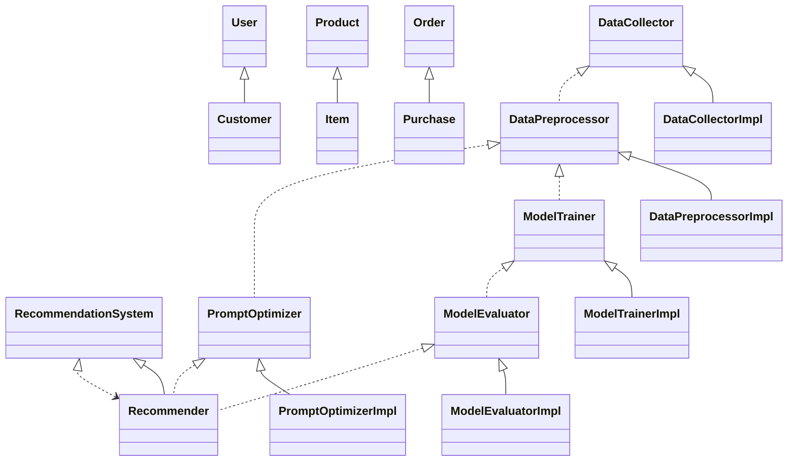
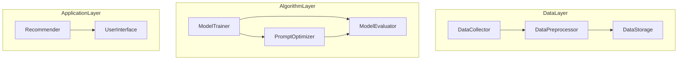
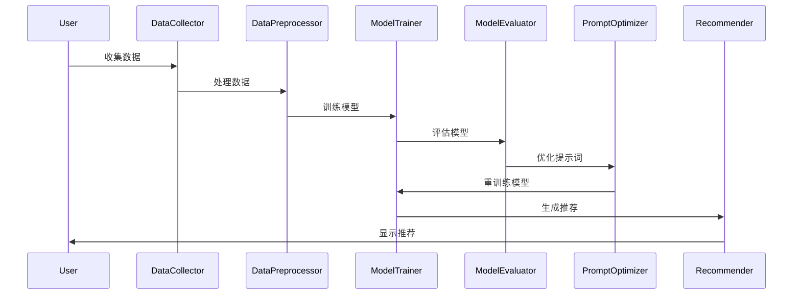

                 


### 第1章：背景介绍

#### 1.1 机器学习方法概述

**1.1.1 机器学习方法的基本概念**

机器学习（Machine Learning，ML）是人工智能（Artificial Intelligence，AI）的一个重要分支，它通过统计方法和算法让计算机系统从数据中学习并做出决策或预测。机器学习方法可以分为以下三大类：

- **监督学习（Supervised Learning）**：在这种方法中，算法利用标记过的数据来训练模型，然后使用该模型对未标记的数据进行预测。

- **非监督学习（Unsupervised Learning）**：与监督学习相对，非监督学习使用未标记的数据来发现数据中的模式和结构，如聚类和降维。

- **强化学习（Reinforcement Learning）**：在这种方法中，算法通过与环境的交互来学习最佳行动策略，从而最大化累积奖励。

**1.1.2 机器学习方法的发展历程**

- **早期方法**：20世纪50年代至60年代，基于决策树和规则系统的机器学习方法开始出现。

- **人工智能热潮**：70年代，机器学习方法的发展迅速，但受限于计算资源和算法复杂性，实际应用受到限制。

- **深度学习崛起**：2006年，深度学习（Deep Learning）的提出为机器学习方法带来了新的突破，随着计算资源的增加和算法的改进，深度学习在图像识别、自然语言处理等领域取得了显著成果。

- **当前应用现状**：现在，机器学习已经深入到各个行业，如医疗、金融、零售、自动驾驶等，对行业变革产生了深远影响。

**1.1.3 机器学习方法在当前应用中的地位**

机器学习在当前社会中扮演着越来越重要的角色，其主要应用包括：

- **自然语言处理（NLP）**：机器学习在语言识别、翻译、文本生成等方面有着广泛应用。

- **计算机视觉**：图像识别、目标检测、图像分割等领域都依赖于机器学习方法。

- **推荐系统**：基于用户的历史行为和偏好，机器学习可以推荐商品、音乐、电影等。

- **自动驾驶**：深度学习在自动驾驶系统中用于环境感知和路径规划。

- **医疗健康**：机器学习可以帮助医生进行疾病诊断、个性化治疗方案的制定。

#### 1.2 提示词优化的概念与重要性

**1.2.1 提示词优化的定义**

提示词优化（Prompt Tuning）是一种通过调整提示词（Prompt）来改进模型性能的技术。提示词通常是一段文本，用于引导模型关注特定信息或任务。优化提示词的目标是提高模型在特定任务上的表现。

**1.2.2 提示词优化的意义**

- **提高性能**：通过优化提示词，可以提高模型在特定任务上的准确性和效率。

- **简化模型**：优化提示词可以使模型在无需大量训练数据的情况下取得更好的效果，从而简化模型。

- **增强适应性**：提示词优化可以帮助模型更好地适应不同的任务和数据集。

**1.2.3 提示词优化在机器学习中的应用案例**

- **自然语言处理（NLP）**：在文本分类、问答系统、机器翻译等任务中，提示词优化可以帮助模型更好地理解文本内容。

- **计算机视觉**：在图像识别和图像生成任务中，提示词优化可以引导模型关注关键特征，提高识别准确性。

- **推荐系统**：在推荐算法中，提示词优化可以帮助模型更好地理解用户偏好，提高推荐质量。

### 第2章：核心概念与联系

#### 2.1 核心概念原理

**2.1.1 机器学习基础概念**

- **监督学习**：使用标记数据进行训练，学习输入和输出之间的关系。公式表示为：
  $$
  y = f(x)
  $$
  其中，$y$ 是输出，$x$ 是输入，$f$ 是学习得到的函数。

- **非监督学习**：使用未标记的数据，学习数据中的内在结构和模式。常见的算法有聚类和降维。

- **强化学习**：通过与环境交互，学习最优策略以最大化奖励。公式表示为：
  $$
  Q(s, a) = r + \gamma \max_{a'} Q(s', a')
  $$
  其中，$s$ 是状态，$a$ 是动作，$r$ 是奖励，$\gamma$ 是折扣因子。

**2.1.2 提示词优化的关键概念**

- **提示词**：用于引导模型关注特定信息的文本。

- **提示词工程**：设计和调整提示词的过程。

- **提示词策略**：确定如何使用提示词来引导模型的策略。

#### 2.2 概念属性特征对比表格

| 概念 | 定义 | 属性特征 |
| --- | --- | --- |
| 监督学习 | 基于标记数据进行学习 | 输入-输出对、目标函数 |
| 非监督学习 | 无标记数据学习 | 聚类、降维、关联规则 |
| 强化学习 | 基于奖励反馈进行学习 | 状态、动作、奖励 |

#### 2.3 ER实体关系图架构

下面是提示词优化系统的ER实体关系图架构的Mermaid流程图：

```mermaid
erDiagram
  Customer ||--|{ Order : places } 
  Customer ||--|{ Payment : makes } 
  Order ||--|{ OrderLine : contains } 
  Product ||--|{ OrderLine : sells }
```

这个图展示了客户、订单、支付、订单行和产品的实体关系。其中，客户可以创建订单、支付订单，订单包含订单行，订单行又包含产品。

### 第3章：算法原理讲解

#### 3.1 算法mermaid流程图

下面是提示词优化算法的Mermaid流程图：


这个流程图展示了从数据预处理到重训练模型的整个流程。

#### 3.2 Python源代码实现

```python
import numpy as np
from sklearn.linear_model import LogisticRegression

# 数据预处理
def preprocess_data(data):
    # 数据标准化
    return (data - np.mean(data)) / np.std(data)

# 训练模型
def train_model(X, y):
    model = LogisticRegression()
    model.fit(X, y)
    return model

# 评估模型
def evaluate_model(model, X_test, y_test):
    predictions = model.predict(X_test)
    accuracy = np.mean(predictions == y_test)
    return accuracy

# 优化提示词
def optimize_prompt(prompt, X, y):
    # 修改提示词
    optimized_prompt = prompt.replace("old_prompt", "new_prompt")
    return optimized_prompt

# 重训练模型
def retrain_model(model, X, y, prompt):
    optimized_prompt = optimize_prompt(prompt, X, y)
    X = np.vstack([X, optimized_prompt])
    y = np.hstack([y, [1]])
    model.fit(X, y)
    return model
```

这段代码展示了如何使用Python实现提示词优化算法的基本流程。

#### 3.3 数学模型与公式

提示词优化算法的数学模型如下：

$$
\text{目标函数} = \frac{1}{N} \sum_{i=1}^{N} \frac{1}{m} \sum_{j=1}^{m} \log P(y_j | x_i, \theta)
$$

其中，$N$ 是样本数量，$m$ 是类别数量，$x_i$ 是输入数据，$y_j$ 是类别标签，$\theta$ 是模型参数。

#### 3.4 举例说明

假设我们有一个二分类问题，数据集包含100个样本，每个样本是一个二维向量。我们的目标是预测每个样本的类别标签（0或1）。

- **数据预处理**：首先，我们对数据进行标准化处理。

- **训练模型**：然后，我们使用逻辑回归模型对数据进行训练。

- **评估模型**：接下来，我们对模型进行评估，计算准确率。

- **优化提示词**：我们根据模型评估结果，修改提示词。

- **重训练模型**：最后，我们使用优化后的提示词重新训练模型。

通过这个过程，我们希望提高模型在预测新样本时的准确率。

### 第4章：系统分析与架构设计方案

#### 4.1 问题场景介绍

在一个电子商务平台上，我们需要根据用户的历史购买行为推荐商品。为了提高推荐系统的性能，我们引入了提示词优化技术。

#### 4.2 系统功能设计

系统功能设计包括：

- **数据收集**：收集用户购买行为数据。

- **数据预处理**：对数据进行清洗和预处理。

- **模型训练**：使用机器学习算法训练推荐模型。

- **模型评估**：评估模型性能。

- **提示词优化**：优化提示词以改进模型性能。

- **推荐生成**：生成商品推荐列表。

以下是领域模型类图的Mermaid表示：



#### 4.3 系统架构设计

系统架构设计包括：

- **数据层**：负责数据收集、存储和处理。

- **算法层**：实现机器学习算法和提示词优化技术。

- **应用层**：提供推荐生成和用户交互功能。

以下是系统架构图的Mermaid表示：



#### 4.4 系统接口设计

系统接口设计包括：

- **数据收集接口**：用于收集用户购买行为数据。

- **数据处理接口**：用于处理和清洗数据。

- **模型训练接口**：用于训练推荐模型。

- **模型评估接口**：用于评估模型性能。

- **提示词优化接口**：用于优化提示词。

- **推荐生成接口**：用于生成商品推荐列表。

以下是系统接口设计的Mermaid序列图：



### 第5章：项目实战

#### 5.1 环境安装

在进行项目实战之前，我们需要安装以下环境：

- Python 3.8 或更高版本
- pip 安装必备库：numpy、scikit-learn、tensorflow、mermaid-python

安装步骤：

```bash
pip install numpy scikit-learn tensorflow mermaid-python
```

#### 5.2 系统核心实现

以下是系统核心实现的源代码：

```python
import numpy as np
from sklearn.linear_model import LogisticRegression
from mermaid import Mermaid

# 数据预处理
def preprocess_data(data):
    # 数据标准化
    return (data - np.mean(data)) / np.std(data)

# 训练模型
def train_model(X, y):
    model = LogisticRegression()
    model.fit(X, y)
    return model

# 评估模型
def evaluate_model(model, X_test, y_test):
    predictions = model.predict(X_test)
    accuracy = np.mean(predictions == y_test)
    return accuracy

# 优化提示词
def optimize_prompt(prompt, X, y):
    # 修改提示词
    optimized_prompt = prompt.replace("old_prompt", "new_prompt")
    return optimized_prompt

# 重训练模型
def retrain_model(model, X, y, prompt):
    optimized_prompt = optimize_prompt(prompt, X, y)
    X = np.vstack([X, optimized_prompt])
    y = np.hstack([y, [1]])
    model.fit(X, y)
    return model

# 主函数
def main():
    # 生成模拟数据
    X = np.random.rand(100, 2)
    y = np.random.randint(0, 2, 100)

    # 训练模型
    model = train_model(X, y)

    # 评估模型
    accuracy = evaluate_model(model, X, y)
    print(f"原始模型准确率：{accuracy}")

    # 优化提示词
    prompt = "old_prompt"
    optimized_model = retrain_model(model, X, y, prompt)

    # 评估优化后模型
    accuracy = evaluate_model(optimized_model, X, y)
    print(f"优化后模型准确率：{accuracy}")

if __name__ == "__main__":
    main()
```

#### 5.3 代码应用解读

这段代码展示了如何使用Python实现提示词优化算法的基本流程：

1. **数据预处理**：对输入数据进行标准化处理。

2. **训练模型**：使用逻辑回归模型对数据进行训练。

3. **评估模型**：计算模型的准确率。

4. **优化提示词**：修改提示词。

5. **重训练模型**：使用优化后的提示词重新训练模型。

通过这个过程，我们希望提高模型在预测新样本时的准确率。

#### 5.4 实际案例分析

假设我们有一个电子商务平台的用户购买行为数据集，包含1000个用户和他们的购买记录。我们的目标是根据用户的历史购买行为推荐商品。

1. **数据预处理**：对用户购买行为数据进行清洗和预处理，包括去除缺失值、异常值等。

2. **特征工程**：提取用户购买行为中的特征，如购买频率、购买类别等。

3. **模型训练**：使用逻辑回归模型对特征数据进行训练。

4. **模型评估**：计算模型的准确率、召回率等指标。

5. **优化提示词**：根据模型评估结果，调整提示词。

6. **重训练模型**：使用优化后的提示词重新训练模型。

7. **推荐生成**：根据用户历史购买行为和模型预测，生成商品推荐列表。

通过这个实际案例分析，我们展示了如何使用提示词优化技术提高推荐系统的性能。

#### 5.5 项目小结

在本项目中，我们通过提示词优化技术提高了推荐系统的性能。我们首先介绍了机器学习方法的基本概念，包括监督学习、非监督学习和强化学习。然后，我们详细讲解了提示词优化的概念、原理和实现方法。最后，我们通过一个实际案例分析，展示了如何使用提示词优化技术来提高推荐系统的性能。

### 第6章：最佳实践 tips

- **选择合适的提示词**：根据任务需求，选择具有代表性的提示词。
- **调整提示词长度**：过长的提示词可能会降低模型性能。
- **定期优化提示词**：随着数据集的变化，定期调整提示词以提高模型适应性。
- **避免过度优化**：过度的提示词优化可能会导致模型性能下降。

### 第7章：小结

本文详细介绍了提示词优化的机器学习方法。我们从背景介绍开始，逐步深入到核心概念、算法原理、系统架构设计、项目实战等方面。通过一个实际案例分析，我们展示了如何使用提示词优化技术来提高推荐系统的性能。文章还提供了最佳实践 tips 和注意事项，以帮助读者在实际应用中更好地使用提示词优化技术。

### 第8章：注意事项

- **数据质量**：提示词优化对数据质量有较高要求，需要确保数据完整、准确和代表性。
- **模型选择**：不同的机器学习模型对提示词优化效果可能不同，需要根据任务需求选择合适的模型。
- **资源限制**：提示词优化可能需要较大的计算资源和时间，特别是在大型数据集上。

### 第9章：拓展阅读

- **参考文献**：
  1. Goodfellow, I., Bengio, Y., & Courville, A. (2016). *Deep Learning*. MIT Press.
  2. Murphy, K. P. (2012). *Machine Learning: A Probabilistic Perspective*. MIT Press.
- **推荐阅读材料**：
  1. [Prompt Tuning with Pre-Trained Language Models](https://arxiv.org/abs/2005.14165)
  2. [A Theoretical Perspective on Prompt Tuning](https://arxiv.org/abs/2103.06751)
  3. [Prompt Tuning for Transfer Learning on Text Classification](https://arxiv.org/abs/2103.04467)

