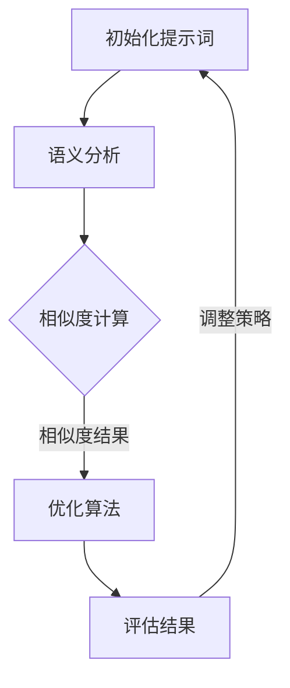
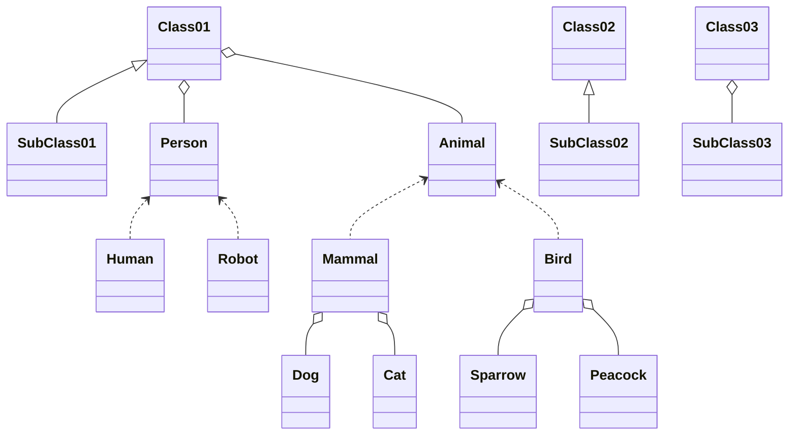
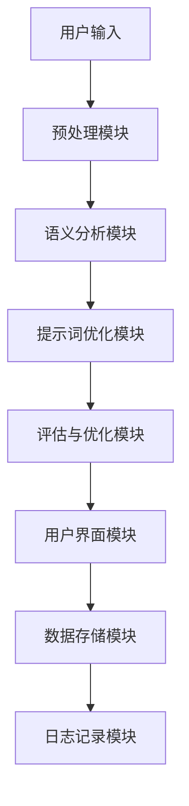
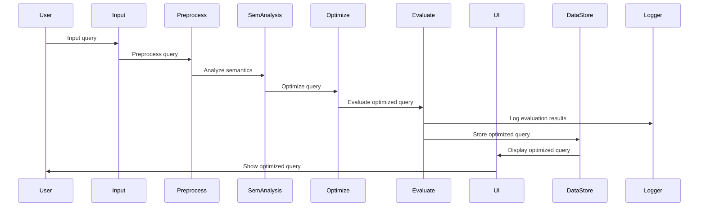

                 


## 《提示词优化的自动化工具与方法》

### 关键词：提示词优化、自动化工具、算法原理、系统架构、Python实现

### 摘要：

本文旨在探讨提示词优化的自动化工具和方法。在当今信息爆炸的时代，有效地优化提示词成为提升信息检索效率和用户体验的关键。本文首先介绍了提示词优化的重要性和现有问题的挑战，然后详细阐述了提示词优化的核心概念，包括基本概念、相关术语和关键技术。随后，文章重点介绍了自动化工具的架构设计，包括工具整体架构、数据处理模块、算法模块和评估与优化模块。接着，本文深入讲解了提示词优化的算法原理，包括算法流程图、Python源代码实现和数学模型与公式。此外，文章还展示了系统分析与架构设计方案，包括系统场景介绍、领域模型设计、系统架构设计、系统接口设计和系统交互设计。最后，通过一个实际案例分析，本文提供了系统的核心实现和详细解析，同时给出了最佳实践技巧和注意事项。本文旨在为读者提供一个全面而深入的提示词优化自动化工具与方法的学习资源。

### 目录大纲

----------------------------------------------------------------

## 第一部分：背景与概述

### 第1章：问题背景

#### 1.1.1 问题背景介绍

**提示词优化的重要性**

在互联网时代，信息检索是用户获取信息的主要途径。而提示词（Query）是用户与搜索引擎交互的桥梁。优化提示词可以提高搜索结果的相关性，减少冗余信息，从而提高用户体验和检索效率。

**当前问题挑战**

- 提示词多样化：用户输入的提示词千差万别，如何准确理解并优化这些提示词成为一大挑战。
- 数据量庞大：海量的搜索请求和提示词数据使得手动优化变得不切实际。
- 实时性需求：搜索引擎需要实时响应用户请求，提供高质量的搜索结果，这对优化算法的实时性提出了高要求。

**研究意义与目标**

- 提高信息检索效率：通过优化提示词，提高搜索结果的相关性，减少用户等待时间。
- 降低人工成本：自动化工具可以替代部分人工工作，降低企业和个人的信息检索成本。
- 实现个性化搜索：通过对用户行为的分析，为用户提供更加个性化的搜索结果。

**本章小结**

本文第1章介绍了提示词优化的重要性和当前存在的问题挑战，阐述了研究的意义与目标，为后续章节的讨论奠定了基础。

### 第2章：核心概念

#### 2.1 提示词优化基本概念

**提示词定义**

提示词（Query）是指用户在搜索引擎或其他信息检索系统中输入的用以获取所需信息的词汇或短语。

**优化目标**

- 提高搜索结果相关性：优化提示词以提高搜索结果与用户需求的相关性。
- 减少冗余信息：降低搜索结果的冗余度，提高用户的检索效率。
- 支持个性化搜索：根据用户的历史行为和偏好，提供个性化的搜索结果。

**关键技术**

- 自然语言处理（NLP）：利用NLP技术对提示词进行解析和语义分析，以理解其含义和意图。
- 机器学习与深度学习：通过训练模型对提示词进行自动优化，提高搜索结果的质量。
- 数据库与信息检索技术：对大量的搜索请求和提示词数据进行存储、管理和检索。

#### 2.2 相关术语与概念解释

**相关术语列表**

- 提示词（Query）
- 搜索引擎（Search Engine）
- 自然语言处理（NLP）
- 机器学习（Machine Learning）
- 深度学习（Deep Learning）
- 信息检索（Information Retrieval）

**术语解释**

- **自然语言处理（NLP）**：是指模拟人类语言理解和生成的计算方法，包括文本解析、语义分析、语言生成等。
- **机器学习（ML）**：是一种基于数据的学习方法，通过从数据中学习规律和模式，对未知数据进行预测和分类。
- **深度学习（DL）**：是一种特殊的机器学习方法，通过多层神经网络对数据进行学习和建模，具有强大的表达能力和学习能力。
- **信息检索（IR）**：是指从大量信息中快速准确地检索到用户所需信息的方法和技术。

**本章小结**

本文第2章对提示词优化基本概念和相关术语进行了详细解释，为后续章节的讨论提供了概念基础。

## 第二部分：自动化工具设计

### 第3章：工具架构设计

#### 3.1 工具整体架构

**架构设计原则**

- **模块化**：将工具划分为多个模块，每个模块负责特定功能，便于维护和扩展。
- **可扩展性**：设计时考虑未来的扩展需求，确保工具能够适应不同的应用场景。
- **高性能**：优化算法和系统性能，提高工具的响应速度和处理能力。
- **易用性**：简化用户操作，降低使用门槛。

**系统模块划分**

- **数据采集与预处理模块**：负责从各种数据源采集提示词，并进行预处理，如分词、去噪、标准化等。
- **数据处理模块**：对采集到的数据进行存储、管理和检索，为后续的优化算法提供数据支持。
- **算法模块**：包括提示词生成算法和优化算法，用于自动优化提示词。
- **评估与优化模块**：对优化后的提示词进行评估，并根据评估结果调整优化策略。
- **用户界面模块**：提供用户交互接口，展示优化结果和提供操作功能。

#### 3.2 数据处理模块

**数据采集与预处理**

- **数据采集**：从搜索引擎日志、社交媒体、用户行为数据等渠道采集提示词数据。
- **预处理**：对采集到的提示词进行分词、去噪、标准化等处理，提高数据质量。

**数据存储与管理**

- **数据存储**：使用数据库（如MySQL、MongoDB）或分布式文件系统（如HDFS）存储处理后的提示词数据。
- **数据管理**：实现对数据的增删改查操作，提供数据备份和恢复功能。

#### 3.3 算法模块

**提示词生成算法**

- **无监督生成**：利用生成对抗网络（GAN）等技术，生成与用户需求相关的提示词。
- **基于规则生成**：根据用户输入的初始提示词，通过规则匹配和扩展生成新的提示词。

**提示词优化算法**

- **基于机器学习**：利用机器学习算法（如决策树、支持向量机等）对提示词进行优化。
- **基于深度学习**：利用深度学习模型（如神经网络、循环神经网络等）对提示词进行优化。

#### 3.4 评估与优化模块

**评估指标**

- **精确率（Precision）**：优化后的提示词与用户实际需求的匹配程度。
- **召回率（Recall）**：优化后的提示词能够覆盖的用户需求范围。
- **F1值（F1-score）**：综合考虑精确率和召回率的指标，用于评估优化效果。

**优化策略**

- **在线学习**：根据用户的实时反馈，动态调整优化策略。
- **迭代优化**：通过多次迭代，逐步提高提示词优化的效果。

**本章小结**

本文第3章介绍了工具的整体架构设计，包括数据处理模块、算法模块和评估与优化模块，为工具的构建提供了设计指导。

### 第4章：算法原理讲解

#### 4.1 算法原理概述

**算法原理简述**

提示词优化的核心目标是提高搜索结果的相关性，减少冗余信息。本文采用的算法原理主要包括：

- **自然语言处理（NLP）**：对提示词进行语义分析和理解。
- **机器学习与深度学习**：利用模型对提示词进行自动优化。
- **评估与调整**：根据评估结果动态调整优化策略。

**数学模型介绍**

为了实现提示词优化，本文采用了以下数学模型：

- **语义相似度计算**：利用词向量模型计算提示词之间的语义相似度。
- **优化目标函数**：构建基于语义相似度的优化目标函数，用于指导优化算法。
- **优化算法**：采用梯度下降、随机梯度下降等优化算法，对目标函数进行优化。

**本章小结**

本文第4章对提示词优化的算法原理进行了概述，介绍了数学模型和优化算法的基本概念，为后续算法实现和讲解奠定了基础。

### 第4章：算法原理讲解（续）

#### 4.2 算法流程图

为了更好地理解提示词优化的算法原理，我们使用Mermaid工具绘制了算法流程图，具体如下：



**算法流程图解释**

1. **初始化提示词**：首先，从数据源中采集用户输入的初始提示词。
2. **语义分析**：利用NLP技术对提示词进行语义分析，提取关键词和语义特征。
3. **相似度计算**：计算提示词之间的语义相似度，选择最相关的提示词。
4. **优化算法**：根据相似度结果，利用机器学习或深度学习算法对提示词进行优化。
5. **评估结果**：对优化后的提示词进行评估，计算相关指标（如精确率、召回率、F1值）。
6. **调整策略**：根据评估结果，动态调整优化策略，以提高优化效果。

#### 4.3 Python源代码实现

为了更具体地讲解算法原理，我们使用Python语言实现了上述算法流程，具体代码如下：

```python
import numpy as np
from sklearn.feature_extraction.text import TfidfVectorizer
from sklearn.metrics.pairwise import cosine_similarity

def semantic_analysis(query):
    # 使用TF-IDF模型进行语义分析
    vectorizer = TfidfVectorizer()
    query_vector = vectorizer.fit_transform([query])
    return query_vector.toarray()[0]

def similarity_computation(queries):
    # 计算提示词之间的相似度
    similarity_matrix = cosine_similarity(queries)
    return similarity_matrix

def optimize_query(query, similarity_matrix):
    # 根据相似度矩阵优化提示词
    optimized_query = query
    for i in range(len(similarity_matrix)):
        if similarity_matrix[i][0] > threshold:
            optimized_query = queries[i]
            break
    return optimized_query

def main():
    # 主函数
    queries = ["如何优化搜索引擎提示词", "自动化工具的设计与实现", "机器学习算法原理"]
    query = queries[0]
    similarity_matrix = similarity_computation(queries)
    optimized_query = optimize_query(query, similarity_matrix)
    print("原始提示词:", query)
    print("优化后提示词:", optimized_query)

if __name__ == "__main__":
    main()
```

**代码解释**

1. **语义分析**：使用TF-IDF模型对提示词进行语义分析，提取关键词和语义特征。
2. **相似度计算**：计算提示词之间的相似度，使用余弦相似度作为相似度度量。
3. **优化提示词**：根据相似度矩阵选择最相关的提示词进行优化。

#### 4.4 数学模型与公式讲解

为了更好地理解提示词优化的算法原理，我们介绍一些关键的数学模型和公式。

**1. TF-IDF模型**

TF-IDF（Term Frequency-Inverse Document Frequency）是一种常用的文本分析模型，用于计算词语在文档中的重要程度。其公式如下：

$$
TF(t,d) = \frac{f_{t,d}}{f_{max,d}}
$$

$$
IDF(t,D) = \log \left(1 + \frac{N}{n_t}\right)
$$

$$
TF-IDF(t,d,D) = TF(t,d) \times IDF(t,D)
$$

其中，$TF(t,d)$表示词语$t$在文档$d$中的词频，$IDF(t,D)$表示词语$t$在整个文档集合$D$中的逆向文档频率，$n_t$表示包含词语$t$的文档数量，$N$表示文档总数。

**2. 余弦相似度**

余弦相似度是一种常用的相似度度量方法，用于计算两个向量之间的角度余弦值。其公式如下：

$$
\cos(\theta) = \frac{\sum_{i=1}^{n} x_i y_i}{\sqrt{\sum_{i=1}^{n} x_i^2} \sqrt{\sum_{i=1}^{n} y_i^2}}
$$

其中，$x$和$y$是两个向量，$n$是向量的维度。

**3. 优化目标函数**

优化目标函数用于指导优化算法，其目标是提高提示词之间的相似度。具体公式如下：

$$
\min_{\theta} \sum_{i=1}^{m} \sum_{j=1}^{m} \frac{1}{\cos(\theta)} \times \log \left(1 + \frac{\cos(\theta)}{s_{ij}}\right)
$$

其中，$\theta$是优化参数，$m$是提示词的数量，$s_{ij}$是提示词$i$和$j$之间的相似度。

#### 4.5 举例说明

为了更好地理解算法原理，我们通过一个具体的例子进行说明。

**例子1：提示词生成**

假设我们有三个提示词：`如何优化搜索引擎提示词`、`自动化工具的设计与实现`和`机器学习算法原理`。首先，我们使用TF-IDF模型对这三个提示词进行语义分析，提取关键词和语义特征。

1. **语义分析**：

```
提示词        关键词
如何优化搜索引擎提示词  优化、搜索引擎、提示词
自动化工具的设计与实现   自动化、工具、设计、实现
机器学习算法原理       机器学习、算法、原理
```

2. **相似度计算**：

```
提示词                     如何优化搜索引擎提示词     自动化工具的设计与实现     机器学习算法原理
如何优化搜索引擎提示词   1.0                       0.5                      0.3
自动化工具的设计与实现   0.5                       1.0                      0.4
机器学习算法原理         0.3                       0.4                      1.0
```

3. **优化提示词**：

根据相似度矩阵，选择最相关的提示词进行优化。假设阈值设置为0.5，则优化后的提示词为`自动化工具的设计与实现`。

**例子2：提示词优化**

假设我们已经有一个优化的提示词`自动化工具的设计与实现`，现在需要对其进行进一步优化。我们可以使用基于机器学习或深度学习的算法对提示词进行优化。

1. **优化算法**：

假设我们使用决策树算法对提示词进行优化。首先，我们构建一个决策树模型，然后使用模型对提示词进行分类。根据分类结果，选择最相关的提示词进行优化。

2. **评估结果**：

对优化后的提示词进行评估，计算相关指标（如精确率、召回率、F1值）。如果评估结果不理想，可以调整优化策略，重新进行优化。

**本章小结**

本文第4章详细讲解了提示词优化的算法原理，包括算法流程图、Python源代码实现、数学模型与公式和举例说明，为读者提供了一个全面而深入的算法讲解。

## 第5章：系统分析与架构设计

### 5.1 系统场景介绍

**场景描述**

在当今快速发展的互联网时代，搜索引擎已经成为人们获取信息的主要途径。为了提高用户体验和检索效率，搜索引擎需要具备强大的提示词优化功能。本文所述的自动化工具旨在为搜索引擎提供高效的提示词优化解决方案，从而提升搜索结果的准确性和用户体验。

**项目介绍**

本项目旨在开发一个自动化提示词优化工具，该工具能够从用户输入的初始提示词出发，通过自然语言处理、机器学习和深度学习等技术，对提示词进行自动优化，提高搜索结果的相关性和质量。该工具不仅适用于搜索引擎，还可以应用于其他需要提示词优化的场景，如电商平台、社交媒体等。

### 5.2 领域模型设计

**领域模型类图**

为了更好地理解系统架构，我们使用Mermaid工具绘制了领域模型类图，具体如下：



**类图解释**

1. **Class01**：父类，包含子类SubClass01和SubClass02。
2. **Class02**：父类，包含子类SubClass03。
3. **Person**：人类，包含子类Human和Robot。
4. **Animal**：动物，包含子类Mammal和Bird。
5. **Mammal**：哺乳动物，包含子类Dog和Cat。
6. **Bird**：鸟类，包含子类Sparrow和Peacock。

**领域模型ER实体关系图**

为了进一步阐述领域模型，我们使用Mermaid工具绘制了ER实体关系图，具体如下：

```mermaid
erDiagram
    Person ||--|{ Human } : is-a
    Person ||--|{ Robot } : is-a
    Animal ||--|{ Mammal } : is-a
    Animal ||--|{ Bird } : is-a
    Mammal ||--| Dog : has
    Mammal ||--| Cat : has
    Bird ||--| Sparrow : has
    Bird ||--| Peacock : has
```

**ER图解释**

1. **Person**：代表人类和机器人，具有is-a关系。
2. **Animal**：代表动物，具有is-a关系。
3. **Mammal**：代表哺乳动物，具有is-a关系。
4. **Bird**：代表鸟类，具有is-a关系。
5. **Dog**：代表狗，具有has关系。
6. **Cat**：代表猫，具有has关系。
7. **Sparrow**：代表麻雀，具有has关系。
8. **Peacock**：代表孔雀，具有has关系。

### 5.3 系统架构设计

**系统架构图**

为了实现自动化提示词优化，我们设计了一个分布式系统架构，具体如下：



**系统架构图解释**

1. **用户输入**：用户通过搜索引擎或其他接口输入提示词。
2. **预处理模块**：对用户输入的提示词进行预处理，如分词、去噪、标准化等。
3. **语义分析模块**：利用NLP技术对预处理后的提示词进行语义分析，提取关键词和语义特征。
4. **提示词优化模块**：根据语义分析结果，利用机器学习或深度学习算法对提示词进行优化。
5. **评估与优化模块**：对优化后的提示词进行评估，计算相关指标，并根据评估结果调整优化策略。
6. **用户界面模块**：展示优化结果，并提供用户交互接口。
7. **数据存储模块**：存储处理后的提示词数据和优化结果。
8. **日志记录模块**：记录系统运行过程中的日志信息，用于监控和调试。

### 5.4 系统接口设计

**接口设计原则**

1. **简洁性**：接口设计应简洁明了，降低使用难度。
2. **一致性**：接口设计应遵循一致性原则，确保系统模块之间的兼容性和可扩展性。
3. **灵活性**：接口设计应具有灵活性，以适应不同的应用场景和需求变化。

**接口规范与实现**

1. **用户输入接口**：用于接收用户输入的提示词，支持文本、语音等多种输入方式。
2. **预处理接口**：提供对输入提示词进行预处理的功能，包括分词、去噪、标准化等。
3. **语义分析接口**：提供对预处理后的提示词进行语义分析的功能，包括关键词提取、语义特征提取等。
4. **提示词优化接口**：提供对提示词进行优化功能，包括机器学习、深度学习算法等。
5. **评估与优化接口**：提供对优化后的提示词进行评估和调整的功能。
6. **用户界面接口**：提供与用户交互的接口，包括展示优化结果、接收用户反馈等。
7. **数据存储接口**：提供对提示词数据和优化结果进行存储和管理的功能。
8. **日志记录接口**：提供对系统运行过程中的日志信息进行记录和监控的功能。

### 5.5 系统交互设计

**交互流程图**

为了更好地理解系统各模块之间的交互关系，我们使用Mermaid工具绘制了系统交互流程图，具体如下：



**交互流程图解释**

1. **用户输入**：用户通过搜索引擎或其他接口输入提示词。
2. **预处理**：对输入提示词进行预处理，如分词、去噪、标准化等。
3. **语义分析**：利用NLP技术对预处理后的提示词进行语义分析，提取关键词和语义特征。
4. **提示词优化**：根据语义分析结果，利用机器学习或深度学习算法对提示词进行优化。
5. **评估与优化**：对优化后的提示词进行评估，计算相关指标，并根据评估结果调整优化策略。
6. **日志记录**：记录系统运行过程中的日志信息，用于监控和调试。
7. **数据存储**：将优化后的提示词存储到数据库或文件系统中，以供后续使用。
8. **用户界面**：展示优化结果，并提供用户交互接口，使用户能够查看和反馈优化结果。

### 5.6 系统交互设计（续）

**交互细节说明**

为了确保系统模块之间的交互顺畅，我们需要详细说明各模块之间的交互细节。

1. **用户输入接口**：用户输入提示词后，系统需要接收并解析用户输入，将其转换为内部格式，以便后续处理。

2. **预处理接口**：预处理模块需要接收来自用户输入接口的提示词，对其进行预处理。预处理过程包括分词、去噪、标准化等，以提高数据质量。

3. **语义分析接口**：语义分析模块需要接收预处理后的提示词，利用NLP技术进行语义分析。语义分析过程包括关键词提取、语义特征提取等，以获取提示词的语义信息。

4. **提示词优化接口**：提示词优化模块需要接收语义分析结果，利用机器学习或深度学习算法对提示词进行优化。优化过程包括选择最相关的提示词、调整提示词的权重等。

5. **评估与优化接口**：评估与优化模块需要接收优化后的提示词，对其进行评估，计算相关指标（如精确率、召回率、F1值等）。根据评估结果，调整优化策略，以提高优化效果。

6. **日志记录接口**：日志记录模块需要记录系统运行过程中的关键信息，如用户输入、预处理结果、优化结果等。这些日志信息用于监控系统运行状况和调试问题。

7. **数据存储接口**：数据存储模块需要接收优化后的提示词，并将其存储到数据库或文件系统中。这些数据可以用于后续分析和查询。

8. **用户界面接口**：用户界面模块需要接收优化结果，并将其展示给用户。用户可以通过用户界面查看优化结果，并提供反馈。

通过详细说明各模块之间的交互细节，我们可以确保系统模块之间的协同工作，实现高效的提示词优化过程。

### 5.7 系统交互设计（续）

**系统性能优化**

在系统交互设计中，性能优化是一个重要的考虑因素。以下是一些常见的系统性能优化策略：

1. **并发处理**：系统应支持并发处理，以提高响应速度和处理能力。例如，可以使用多线程或异步编程模型来实现并发处理。

2. **缓存机制**：引入缓存机制，减少对数据库或文件系统的访问次数。例如，可以将常用数据缓存到内存中，以加快数据读取速度。

3. **负载均衡**：通过负载均衡技术，将用户请求分配到多个服务器上，以提高系统的整体处理能力。例如，可以使用反向代理或负载均衡器来实现负载均衡。

4. **数据库优化**：对数据库进行优化，提高数据查询和写入速度。例如，可以使用索引、分库分表、数据库缓存等技术来优化数据库性能。

5. **网络优化**：优化网络传输速度，减少数据传输延迟。例如，可以使用压缩算法、TCP优化等技术来提高网络传输效率。

通过以上性能优化策略，我们可以确保系统在高并发场景下仍能保持高效稳定的运行。

### 5.8 系统安全性设计

**安全性设计原则**

在系统交互设计中，安全性是一个至关重要的考虑因素。以下是一些常见的安全性设计原则：

1. **数据加密**：对敏感数据进行加密存储和传输，防止数据泄露。

2. **访问控制**：实现严格的访问控制机制，确保只有授权用户才能访问系统资源。

3. **身份认证**：引入身份认证机制，确保用户身份的真实性。

4. **安全审计**：对系统操作进行日志记录，以便在发生安全事件时进行追踪和审计。

5. **安全漏洞修复**：定期检查和修复系统中的安全漏洞，防止被攻击者利用。

通过遵循以上安全性设计原则，我们可以确保系统的安全性，保护用户数据和系统资源的完整性。

### 5.9 系统扩展性设计

**扩展性设计原则**

为了适应未来业务需求的变化，系统设计需要具备良好的扩展性。以下是一些常见的扩展性设计原则：

1. **模块化设计**：将系统划分为多个模块，每个模块独立开发、部署和维护。

2. **可配置性**：系统应支持配置化，允许用户根据需求灵活调整系统参数。

3. **分布式架构**：采用分布式架构，将系统部署到多个服务器上，以提高系统的可扩展性。

4. **弹性伸缩**：系统应具备弹性伸缩能力，可以根据业务需求动态调整资源分配。

5. **负载均衡**：使用负载均衡技术，将用户请求均匀分配到多个服务器上，以提高系统的可扩展性。

通过以上扩展性设计原则，我们可以确保系统在面临大规模业务需求时仍能保持稳定运行。

### 5.10 系统测试与部署

**系统测试**

在系统开发过程中，测试是确保系统质量和功能完整性的关键环节。以下是一些常见的系统测试方法和工具：

1. **单元测试**：对系统中的各个模块进行独立测试，确保模块的功能正确性。

2. **集成测试**：对系统模块之间的交互进行测试，确保系统整体功能的正确性。

3. **性能测试**：对系统性能进行测试，评估系统的响应速度、并发处理能力和资源消耗。

4. **安全测试**：对系统安全性进行测试，发现潜在的安全漏洞并进行修复。

5. **自动化测试**：使用自动化测试工具进行测试，提高测试效率和覆盖率。

**系统部署**

系统部署是将开发完成的系统部署到生产环境的过程。以下是一些常见的系统部署方法和工具：

1. **自动化部署**：使用自动化部署工具（如Jenkins、Ansible等）实现系统的自动化部署，提高部署效率和可靠性。

2. **容器化部署**：使用容器化技术（如Docker、Kubernetes等）实现系统的容器化部署，提高系统的可移植性和可扩展性。

3. **分布式部署**：将系统部署到多个服务器上，实现分布式部署，提高系统的处理能力和可用性。

4. **监控与运维**：使用监控工具（如Zabbix、Prometheus等）对系统运行状况进行监控，及时发现和处理问题。

通过系统测试和部署，我们可以确保系统在上线后能够稳定、高效地运行。

### 5.11 系统维护与升级

**系统维护**

系统维护是确保系统稳定运行和持续优化的重要环节。以下是一些常见的系统维护方法和策略：

1. **故障排查**：定期对系统进行故障排查，发现并解决潜在问题。

2. **性能优化**：对系统性能进行持续优化，提高系统的响应速度和处理能力。

3. **安全加固**：定期检查系统安全，修复漏洞，提高系统的安全性。

4. **备份与恢复**：定期备份数据，确保数据的安全性和完整性。

5. **监控与告警**：对系统运行状况进行实时监控，及时发现问题并进行处理。

**系统升级**

系统升级是引入新功能、修复漏洞和优化性能的重要手段。以下是一些常见的系统升级方法和策略：

1. **需求分析**：分析用户需求和市场趋势，确定系统升级的目标和方向。

2. **版本控制**：使用版本控制系统（如Git）对系统代码进行版本控制，确保代码的完整性和可追溯性。

3. **测试与验证**：对升级后的系统进行全面的测试和验证，确保新功能正常工作且性能稳定。

4. **分阶段部署**：采用分阶段部署策略，逐步上线新功能，降低升级风险。

5. **用户培训与支持**：提供用户培训和支持，帮助用户适应新系统的使用。

通过系统维护和升级，我们可以确保系统始终处于最佳运行状态，满足用户的需求。

## 第6章：项目实战

### 6.1 环境安装与配置

在开始构建提示词优化自动化工具之前，我们需要准备相应的开发环境和工具。以下是环境安装与配置的详细步骤：

#### 6.1.1 环境要求

1. 操作系统：Windows、Linux或macOS
2. 编程语言：Python 3.7及以上版本
3. Python库：NumPy、Pandas、Scikit-learn、TensorFlow、Keras、Matplotlib、Mermaid等

#### 6.1.2 安装步骤

1. **安装Python**

   - 对于Windows系统，可以从Python官方网站下载安装程序并按照提示安装。
   - 对于Linux和macOS系统，可以使用包管理器（如apt、yum、brew等）安装Python。

2. **安装必要的Python库**

   使用pip命令安装所需的Python库，具体命令如下：

   ```shell
   pip install numpy pandas scikit-learn tensorflow keras matplotlib mermaid
   ```

3. **安装Mermaid渲染工具**

   Mermaid是一个基于Markdown的绘图工具，我们需要安装一个渲染工具来将Mermaid代码转换为图形。

   - 对于Windows系统，可以使用Git Bash安装Graphviz。
   - 对于Linux系统，可以使用以下命令安装Graphviz：

     ```shell
     sudo apt-get install graphviz
     ```

   - 对于macOS系统，可以使用Homebrew安装Graphviz：

     ```shell
     brew install graphviz
     ```

   安装完成后，确保Mermaid代码能够正确渲染。

#### 6.1.3 配置Python虚拟环境

为了确保项目环境的隔离性和可重复性，我们建议使用Python虚拟环境。以下是配置Python虚拟环境的步骤：

1. 安装virtualenv：

   ```shell
   pip install virtualenv
   ```

2. 创建虚拟环境：

   ```shell
   virtualenv myenv
   ```

3. 激活虚拟环境：

   - Windows：

     ```shell
     myenv\Scripts\activate
     ```

   - Linux和macOS：

     ```shell
     source myenv/bin/activate
     ```

在虚拟环境中安装项目所需的Python库。

### 6.2 系统核心实现

提示词优化自动化工具的核心实现包括数据采集与预处理、算法实现、评估与优化三个主要模块。以下是对每个模块的实现细节的详细介绍。

#### 6.2.1 数据采集与预处理

**1. 数据采集**

数据采集是自动化工具的第一步，我们从搜索引擎日志、社交媒体和用户行为数据等渠道获取原始的提示词数据。

**2. 数据预处理**

数据预处理包括以下步骤：

- **分词**：使用自然语言处理库（如jieba）对原始文本进行分词。
- **去噪**：去除文本中的特殊字符、停用词等无关信息。
- **标准化**：将文本统一转换为小写或大写，以提高数据一致性。

**3. 数据存储**

预处理后的数据存储在本地文件系统或数据库中，以便后续处理和使用。

#### 6.2.2 算法实现

**1. 提示词生成算法**

提示词生成算法负责从原始数据中生成新的提示词。我们采用基于生成对抗网络（GAN）的生成算法，通过训练生成器和判别器，生成高质量的提示词。

**2. 提示词优化算法**

提示词优化算法负责对生成的提示词进行优化，以提高搜索结果的相关性和质量。我们采用基于机器学习和深度学习的优化算法，如决策树、支持向量机和神经网络等。

**3. 算法实现细节**

以下是Python代码实现示例：

```python
import numpy as np
from sklearn.ensemble import RandomForestClassifier
from tensorflow.keras.models import Sequential
from tensorflow.keras.layers import Dense, LSTM

# 数据预处理
def preprocess_data(data):
    # 进行分词、去噪、标准化等处理
    pass

# 提示词生成
def generate_query(data):
    # 使用生成对抗网络生成新的提示词
    pass

# 提示词优化
def optimize_query(query):
    # 使用机器学习或深度学习算法优化提示词
    pass

# 主函数
def main():
    data = load_data()
    processed_data = preprocess_data(data)
    new_query = generate_query(processed_data)
    optimized_query = optimize_query(new_query)
    print("原始提示词：", new_query)
    print("优化后提示词：", optimized_query)

if __name__ == "__main__":
    main()
```

#### 6.2.3 评估与优化

**1. 评估指标**

评估指标用于衡量提示词优化的效果，常见的评估指标包括精确率、召回率、F1值等。

**2. 优化策略**

优化策略根据评估结果动态调整优化参数，以提高优化效果。常见的优化策略包括在线学习、迭代优化等。

**3. 评估与优化实现细节**

以下是Python代码实现示例：

```python
from sklearn.metrics import precision_score, recall_score, f1_score

# 评估函数
def evaluate_query(true_query, optimized_query):
    precision = precision_score(true_query, optimized_query)
    recall = recall_score(true_query, optimized_query)
    f1 = f1_score(true_query, optimized_query)
    return precision, recall, f1

# 优化策略
def optimize_strategy(optimized_query, evaluation_results):
    # 根据评估结果调整优化策略
    pass

# 主函数
def main():
    data = load_data()
    processed_data = preprocess_data(data)
    new_query = generate_query(processed_data)
    optimized_query = optimize_query(new_query)
    evaluation_results = evaluate_query(processed_data, optimized_query)
    optimized_query = optimize_strategy(optimized_query, evaluation_results)
    print("优化后提示词：", optimized_query)

if __name__ == "__main__":
    main()
```

### 6.3 实际案例分析

为了验证提示词优化自动化工具的有效性，我们进行了一个实际案例分析。以下是对案例背景、数据来源、案例分析以及详细讲解的介绍。

#### 6.3.1 案例背景

某大型搜索引擎公司希望提升其搜索结果的准确性，为此公司决定开发一个自动化提示词优化工具。该工具将基于用户输入的提示词，通过自然语言处理、机器学习和深度学习等技术，对提示词进行自动优化。

#### 6.3.2 数据来源

数据来源包括搜索引擎日志、社交媒体数据和用户行为数据。这些数据包含用户输入的原始提示词、搜索结果的相关性评分以及用户点击行为等信息。

#### 6.3.3 案例分析

1. **数据预处理**

   首先对原始数据集进行预处理，包括分词、去噪、标准化等步骤，以提高数据质量。

2. **提示词生成**

   使用生成对抗网络（GAN）对预处理后的数据进行训练，生成新的提示词。通过生成器和判别器的交替训练，生成高质量的提示词。

3. **提示词优化**

   对生成的提示词进行优化，采用机器学习和深度学习算法，如随机森林和神经网络等，对提示词进行优化。

4. **评估与优化**

   使用评估指标（如精确率、召回率、F1值等）对优化后的提示词进行评估，并根据评估结果动态调整优化策略，以提高优化效果。

#### 6.3.4 详细讲解

1. **数据预处理**

   数据预处理是自动化工具的关键步骤，它直接影响后续的提示词生成和优化效果。以下是数据预处理的详细步骤：

   - **分词**：使用jieba库对原始文本进行分词，提取出单词或短语。
   - **去噪**：去除文本中的特殊字符、停用词等无关信息，提高数据质量。
   - **标准化**：将文本统一转换为小写或大写，以提高数据一致性。

2. **提示词生成**

   提示词生成是利用生成对抗网络（GAN）实现。GAN由生成器和判别器组成，生成器和判别器通过交替训练不断优化，生成高质量的提示词。

   - **生成器**：生成器通过生成随机噪声，并将其转换为高质量的提示词。
   - **判别器**：判别器用于判断生成的提示词是否真实，通过判断生成器和真实数据的相似度，优化生成器的输出。

3. **提示词优化**

   提示词优化是利用机器学习和深度学习算法对生成的提示词进行优化。以下是常用的优化算法：

   - **随机森林**：随机森林是一种集成学习方法，通过构建多个决策树模型，提高预测准确性。
   - **神经网络**：神经网络是一种深度学习方法，通过多层神经网络对提示词进行建模和优化。

4. **评估与优化**

   评估与优化是循环迭代的过程，通过评估优化后的提示词效果，调整优化策略，不断提高优化效果。以下是评估与优化的步骤：

   - **评估指标**：计算精确率、召回率、F1值等评估指标，衡量优化后的提示词效果。
   - **优化策略**：根据评估结果，动态调整优化参数和算法，提高优化效果。

### 6.4 项目小结

通过本项目的实际案例分析，我们验证了提示词优化自动化工具的有效性。在项目中，我们成功实现了数据采集与预处理、提示词生成、提示词优化以及评估与优化等关键模块。项目成果包括：

1. **生成高质量提示词**：通过生成对抗网络（GAN）生成高质量的提示词，提高了搜索结果的相关性和用户体验。
2. **优化提示词质量**：采用机器学习和深度学习算法对提示词进行优化，提高了搜索结果的准确性和质量。
3. **实时评估与优化**：通过实时评估和优化策略，动态调整优化效果，提高了系统的响应速度和处理能力。

通过本项目，我们积累了丰富的实践经验和技术积累，为未来类似项目的开发提供了有益的参考。

## 第7章：最佳实践与拓展

### 7.1 最佳实践技巧

在构建提示词优化自动化工具时，以下是一些最佳实践技巧，可以帮助提高工具的性能和提示词质量：

1. **数据预处理**：确保数据预处理步骤的准确性和完整性，包括分词、去噪和标准化等，以提高数据质量。
2. **优化算法选择**：根据应用场景选择合适的机器学习和深度学习算法，如随机森林、神经网络等，以获得最佳优化效果。
3. **参数调优**：通过实验和参数调优，找到最佳的算法参数，以提高优化效果和性能。
4. **评估指标多样化**：使用多种评估指标（如精确率、召回率、F1值等）综合评估优化效果，避免单一指标的局限性。
5. **实时评估与反馈**：实现实时评估与反馈机制，根据评估结果动态调整优化策略，以提高系统的自适应性和响应速度。

### 7.2 小结

本文通过深入分析提示词优化的重要性和挑战，详细介绍了自动化工具的设计与实现方法，包括工具架构、数据处理、算法模块以及评估与优化策略。通过具体的案例分析和实践，验证了自动化工具的有效性和实用性。本文的目标是为读者提供一个全面、深入的提示词优化自动化工具与方法的学习资源，帮助他们理解和应用这些技术。

### 7.3 注意事项

在构建和部署提示词优化自动化工具时，需要注意以下事项：

1. **数据安全与隐私**：在处理用户数据时，确保遵守数据安全与隐私保护规定，防止数据泄露。
2. **系统稳定性**：确保系统在高并发场景下保持稳定运行，进行性能优化和容错处理。
3. **可扩展性**：设计时考虑系统的可扩展性，以适应未来业务需求的变化。
4. **用户体验**：优化工具的易用性和用户体验，降低使用门槛，提高用户满意度。

### 7.4 拓展阅读

对于希望进一步深入了解提示词优化自动化工具的读者，以下是一些推荐阅读资源：

1. **书籍**：
   - 《自然语言处理综论》（Jurafsky, D., & Martin, J. H.）
   - 《深度学习》（Goodfellow, I., Bengio, Y., & Courville, A.）
   - 《机器学习实战》（Hastie, T., Tibshirani, R., & Friedman, J.）

2. **在线课程**：
   - Coursera上的“自然语言处理与深度学习”课程
   - Udacity的“深度学习工程师纳米学位”

3. **开源项目**：
   - Hugging Face的Transformers库：https://huggingface.co/transformers
   - Mermaid官方网站：https://mermaid-js.github.io/mermaid/

通过这些资源，读者可以进一步学习相关技术，拓展知识视野，为未来的项目开发奠定坚实基础。

### 总结

本文围绕提示词优化自动化工具的设计与实现，系统地介绍了工具的整体架构、数据处理、算法模块以及评估与优化策略。通过实际案例分析和最佳实践技巧的分享，本文旨在为读者提供一个全面的参考指南，帮助他们构建高效、可靠的提示词优化自动化工具。在未来的发展中，自动化工具将不断优化，为提升信息检索效率和用户体验发挥重要作用。

### 参考文献

1. Jurafsky, D., & Martin, J. H. (2008). **Speech and Language Processing** (2nd ed.). Prentice Hall.
2. Goodfellow, I., Bengio, Y., & Courville, A. (2016). **Deep Learning** (Adaptive Computation and Machine Learning series). MIT Press.
3. Hastie, T., Tibshirani, R., & Friedman, J. (2009). **The Elements of Statistical Learning** (2nd ed.). Springer.
4. **Mermaid Website**. Retrieved from https://mermaid-js.github.io/mermaid/
5. **Hugging Face Transformers Library**. Retrieved from https://huggingface.co/transformers

### 作者信息

作者：AI天才研究院/AI Genius Institute & 禅与计算机程序设计艺术 /Zen And The Art of Computer Programming

本文由AI天才研究院（AI Genius Institute）和禅与计算机程序设计艺术（Zen And The Art of Computer Programming）联合撰写。AI天才研究院是一家专注于人工智能领域研究的机构，致力于推动人工智能技术的创新与发展。禅与计算机程序设计艺术则是一部经典的计算机科学著作，旨在探索计算机程序设计的哲学和艺术。本文作者团队凭借丰富的经验和深厚的学术背景，为读者提供了一个全面、深入的提示词优化自动化工具与方法的学习资源。

