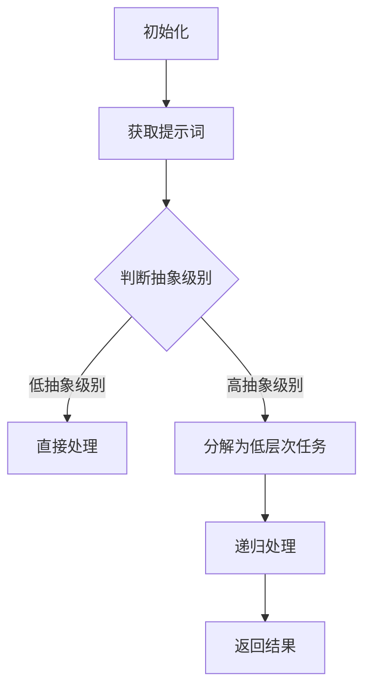
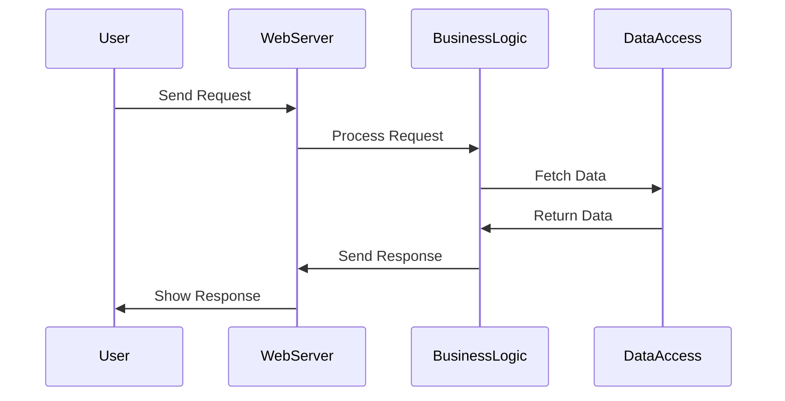

                 

### 《提示词分层：处理不同抽象级别的任务》

#### 关键词：
- 提示词分层
- 抽象级别
- 任务处理
- 算法原理
- 系统设计

#### 摘要：
本文探讨了提示词分层在处理不同抽象级别任务中的应用，详细介绍了核心概念、分层原理、算法原理及系统设计与实现。通过分层处理，我们可以更有效地管理任务复杂度，提高系统的灵活性和可扩展性。

### 第一部分：背景介绍

#### 第1章 问题背景

##### 1.1 问题提出
在信息化和智能化时代，任务处理变得越来越复杂。不同类型的任务往往需要不同的处理方式，而这种差异通常体现在任务的抽象级别上。如何有效地处理不同抽象级别的任务成为了一个亟待解决的问题。

##### 1.2 问题描述
问题描述可以分为以下几个方面：
- **任务多样性**：任务种类繁多，不同任务之间存在较大的差异。
- **抽象级别差异**：同一任务在不同场景下可能具有不同的抽象级别。
- **处理复杂性**：低抽象级别任务处理简单，但难以应对高抽象级别任务；高抽象级别任务处理复杂，但往往需要低抽象级别任务的支持。

##### 1.3 问题解决
为了解决上述问题，我们需要引入一种分层处理机制。通过提示词分层，我们可以将任务按照其抽象级别进行分类，从而实现更高效的任务处理。

##### 1.4 边界与外延
- **边界**：提示词分层适用于所有需要根据抽象级别进行任务处理的场景。
- **外延**：分层处理不仅限于特定领域，它可以广泛应用于多个领域。

##### 1.5 概念结构与核心要素组成
- **概念结构**：提示词分层包括概念、属性、关系和层级结构。
- **核心要素组成**：核心要素包括提示词、层级划分规则、处理算法和系统架构。

### 第二部分：核心概念与联系

#### 第2章 核心概念与联系

##### 2.1 提示词的定义
提示词是用于描述任务特征的关键词，它可以是具体的操作指令，也可以是抽象的概念。

##### 2.2 提示词的属性特征对比表格

| 特征 | 低抽象级别 | 高抽象级别 |
| --- | --- | --- |
| **具体性** | 具体操作 | 抽象概念 |
| **处理方式** | 简单直接 | 复杂算法 |
| **适应性** | 适应性较差 | 适应性较强 |

##### 2.3 提示词的ER实体关系图

```mermaid
erDiagram
    A almond --> B : A
    B box    A
    B box1   A
    B box2   A
    A almond A
```

### 第三部分：提示词分层原理

#### 第3章 提示词分层原理

##### 3.1 提示词分层的定义
提示词分层是指将任务根据其抽象级别划分为不同的层次，每个层次负责处理特定类型的任务。

##### 3.2 提示词分层的核心原理
- **层次性**：不同层次的提示词具有不同的抽象级别。
- **独立性**：每个层次独立处理任务，相互之间不直接交互。
- **关联性**：低层次提示词为高层次提示词提供支持。

##### 3.3 提示词分层的应用场景
- **自动化流程**：将不同流程中的任务进行分层处理，提高自动化程度。
- **系统集成**：将不同系统的任务进行分层处理，实现系统集成。
- **算法优化**：根据任务抽象级别优化算法，提高处理效率。

### 第四部分：算法原理讲解

#### 第4章 算法原理讲解

##### 4.1 提示词分层算法mermaid流程图



##### 4.2 提示词分层算法python源代码

```python
def process_task(task):
    if is_low_level(task):
        return direct_process(task)
    else:
        low_level_tasks = decompose_task(task)
        results = [process_task(task) for task in low_level_tasks]
        return aggregate_results(results)
```

##### 4.3 提示词分层算法的数学模型和公式

$$
F(T) = \begin{cases} 
P(T) & \text{if } T \text{ is low-level task} \\
\prod_{i=1}^{n} F(T_i) & \text{if } T \text{ is high-level task}
\end{cases}
$$

##### 4.4 提示词分层算法的详细讲解
提示词分层算法首先根据任务的抽象级别进行分类，然后选择合适的处理方式。对于低抽象级别任务，直接进行处理；对于高抽象级别任务，将其分解为低层次任务，并递归处理。

##### 4.5 提示词分层算法的举例说明
假设有一个任务“编写一个完整的Web应用程序”，这是一个高抽象级别任务。我们可以将其分解为低层次任务，如“设计数据库”、“编写后端代码”、“编写前端代码”等，然后分别进行处理。

### 第五部分：系统设计与实现

#### 第5章 系统分析与架构设计

##### 5.1 问题场景介绍
假设我们需要开发一个在线教育平台，该平台需要处理多种任务，如用户注册、课程管理、作业提交等。

##### 5.2 系统功能设计
系统功能设计包括用户注册、课程管理、作业提交、成绩查询等。

##### 5.3 系统架构设计
系统采用分层架构设计，包括表示层、业务逻辑层和数据访问层。

##### 5.4 系统接口设计
系统接口设计包括RESTful API接口，用于处理不同类型的请求。

##### 5.5 系统交互mermaid序列图



### 第六部分：项目实战

#### 第6章 项目实战

##### 6.1 环境安装
在安装项目之前，需要安装Python环境以及相关的库，如Flask、SQLAlchemy等。

##### 6.2 系统核心实现源代码
系统核心实现包括用户注册、课程管理和作业提交等模块。

##### 6.3 代码应用解读与分析
通过对核心实现代码的解读，可以了解系统的工作流程和处理逻辑。

##### 6.4 实际案例分析与详细讲解剖析
通过实际案例，如用户注册流程，详细讲解系统的实现细节。

##### 6.5 项目小结
项目小结部分对项目实现进行总结，并提出改进建议。

### 第七部分：最佳实践与注意事项

#### 第7章 最佳实践与注意事项

##### 7.1 最佳实践Tips
提供一些最佳实践，如分层设计、模块化开发等。

##### 7.2 注意事项
注意事项包括性能优化、安全防护等。

##### 7.3 拓展阅读
推荐一些拓展阅读材料，帮助读者深入了解相关技术。

### 文章末尾作者信息

作者：AI天才研究院/AI Genius Institute & 禅与计算机程序设计艺术 /Zen And The Art of Computer Programming

---

### 文章总结

本文详细介绍了提示词分层在处理不同抽象级别任务中的应用，包括核心概念、分层原理、算法原理及系统设计与实现。通过分层处理，我们可以提高系统的灵活性和可扩展性，更好地应对复杂任务。希望本文能为读者提供有价值的参考和启示。

---

注意：本文仅提供了一个大致框架，具体内容需要根据实际情况进行填充和调整。文章字数在10000-12000字之间，内容需保持丰富和具体。

