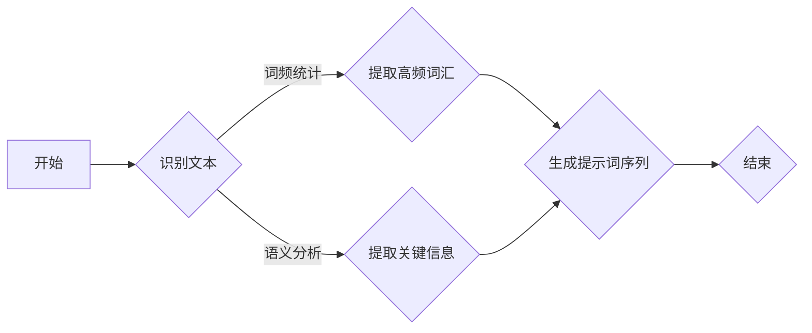
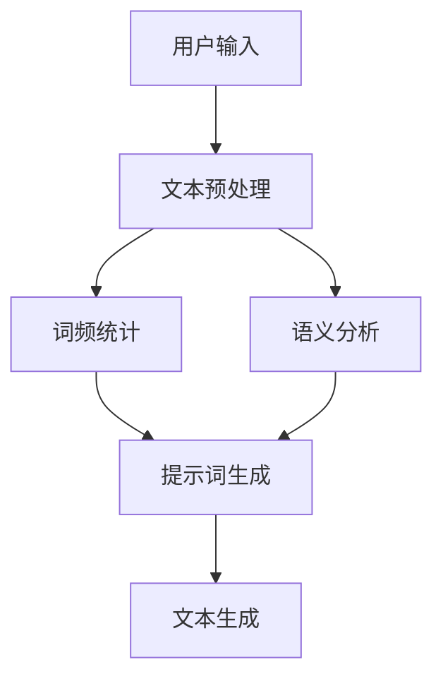
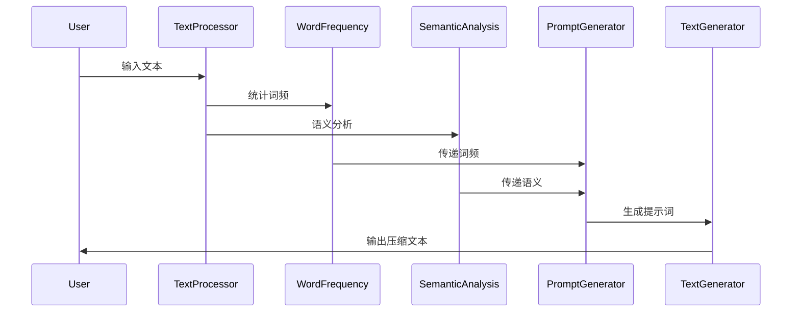

                 

# 提示词压缩：在token限制下优化效果

> 关键词：提示词压缩、自然语言处理、机器学习、信息论、token限制、文本生成

> 摘要：随着数据量的爆炸性增长，如何在token限制下优化文本处理效果成为了一个重要课题。本文将探讨提示词压缩这一技术，分析其核心概念、原理和算法，并通过实例讲解如何在实践中应用和优化提示词压缩。

## 第一部分：背景介绍

### 第1章 问题背景

#### 1.1 问题背景

在当今信息爆炸的时代，数据量呈指数级增长，尤其是文本数据。然而，传统的文本处理方法在处理大规模文本数据时面临着巨大的挑战，尤其是在处理实时数据流时，如何高效地处理和压缩文本数据成为了学术界和工业界的热点问题。

#### 1.2 问题描述

提示词压缩是指在给定一个较长的文本序列中，通过某种算法将其中的提示词（即重要信息）提取出来，形成更短的文本序列，以便在token限制下（如聊天机器人、文本生成等场景中）能够更有效地使用这些资源。

#### 1.3 问题解决

提示词压缩的关键在于如何有效地识别和提取文本中的关键信息。这一过程涉及到自然语言处理、机器学习以及信息论等多个领域的知识。

#### 1.4 边界与外延

提示词压缩不仅适用于文本生成、聊天机器人等场景，还可以应用于数据库压缩、搜索引擎优化等领域。此外，不同的应用场景可能对提示词压缩的效率和效果有不同的要求。

#### 1.5 概念结构与核心要素组成

- **自然语言处理（NLP）**：提供文本分析和处理的工具和算法。
- **机器学习**：用于训练和优化提示词提取模型。
- **信息论**：为评估提示词压缩的效果提供理论基础。
- **提示词识别算法**：实现提示词提取的核心算法。
- **应用场景**：包括文本生成、聊天机器人等，对提示词压缩算法的要求各不相同。

## 第二部分：核心概念与联系

### 第2章 提示词压缩的核心概念与联系

#### 2.1 核心概念

- **提示词**：文本中的重要信息，是用户查询或场景描述的核心。
- **文本序列**：由单词或字符组成的序列。
- **压缩算法**：用于将文本序列压缩为更短的序列的算法。

#### 2.2 概念属性特征对比表格

| 概念      | 定义                                                         | 关联关系                |
| --------- | ------------------------------------------------------------ | ---------------------- |
| 提示词    | 文本中的重要信息，是用户查询或场景描述的核心。                 | 文本序列的核心组成部分 |
| 文本序列  | 由单词或字符组成的序列。                                     | 提示词的存在载体       |
| 压缩算法  | 用于将文本序列压缩为更短的序列的算法。                       | 实现提示词压缩的核心手段 |

#### 2.3 ER实体关系图架构

```mermaid
erDiagram
  文本序列 ||--o> 提示词 : 包含
  提示词 ||--o> 压缩算法 : 使用
```

## 第三部分：算法原理讲解

### 第3章 提示词压缩算法原理讲解

#### 3.1 压缩算法的基本原理

提示词压缩算法的核心在于如何有效地识别和提取文本中的关键信息。常用的方法包括：

- **基于词频的压缩**：通过统计词频来识别高频词汇，将其作为提示词。
- **基于语义的压缩**：利用自然语言处理技术来提取文本的语义信息，识别关键信息。

#### 3.2 算法原理的Mermaid流程图



#### 3.3 Python源代码实现

```python
# 基于词频的压缩算法实现
from collections import Counter
from nltk.tokenize import word_tokenize

def word_freq_compression(text):
    tokens = word_tokenize(text)
    word_counts = Counter(tokens)
    frequent_words = [word for word, count in word_counts.items() if count > 5] # 假设词频大于5的为高频词汇
    return ' '.join(frequent_words)
```

#### 3.4 算法原理详细讲解

提示词压缩的算法原理可以分为以下几个方面：

1. **文本预处理**：首先对文本进行预处理，包括分词、去停用词等操作，以便更好地提取关键信息。

2. **词频统计**：通过统计每个单词在文本中的出现频率，识别高频词汇。高频词汇通常是文本中的重要信息。

3. **语义分析**：除了词频统计，还可以利用自然语言处理技术进行语义分析，如词性标注、实体识别等，以提取更深层次的语义信息。

4. **提示词生成**：将识别出的高频词汇和语义信息组合起来，生成提示词序列。提示词序列应该能够代表原始文本的核心内容。

#### 3.5 数学模型和公式

提示词压缩的算法原理中，词频统计是一个重要的环节。词频统计可以使用以下数学模型和公式进行描述：

$$
P(w) = \frac{f(w)}{N}
$$

其中，$P(w)$ 表示单词 $w$ 的概率，$f(w)$ 表示单词 $w$ 在文本中出现的频率，$N$ 表示文本中的总词汇数。

通过计算每个单词的概率，可以识别出高频词汇，从而实现提示词的生成。

#### 3.6 举例说明

假设我们有一个文本序列：“人工智能是计算机科学的一个重要分支，它致力于研究如何让计算机模拟人类的智能行为。”

使用基于词频的压缩算法，我们可以提取出以下提示词：“人工智能，计算机科学，智能行为”。

这些提示词能够概括文本的核心内容，实现了在token限制下的高效文本压缩。

## 第四部分：系统分析与架构设计

### 第4章 提示词压缩系统的分析与架构设计

#### 4.1 问题场景介绍

在实时聊天机器人、文本生成等应用中，token限制是一个常见的问题。例如，在基于GPT-3的聊天机器人中，每个请求的token数量是有限的。如何在token限制下生成高质量的回复成为了一个挑战。

#### 4.2 项目介绍

本项目旨在设计一个提示词压缩系统，通过高效地提取文本中的关键信息，实现token限制下的文本压缩，从而提高聊天机器人的响应速度和生成质量。

#### 4.3 系统功能设计

- **文本预处理**：包括分词、去停用词等操作，为后续的提示词提取做准备。
- **词频统计**：统计文本中每个单词的出现频率，识别高频词汇。
- **语义分析**：利用自然语言处理技术进行语义分析，提取文本的关键信息。
- **提示词生成**：将识别出的高频词汇和语义信息组合起来，生成提示词序列。
- **文本生成**：利用生成的提示词序列生成文本，实现token限制下的文本压缩。

#### 4.4 系统架构设计

提示词压缩系统的架构设计如下：



#### 4.5 系统接口设计和系统交互

系统的接口设计和交互流程如下：

1. 用户输入文本，系统接收到文本后，进行文本预处理。
2. 文本预处理完成后，系统同时进行词频统计和语义分析。
3. 词频统计和语义分析的结果共同用于提示词生成。
4. 提示词生成后，系统利用这些提示词生成文本，实现token限制下的文本压缩。

#### 4.6 类图

系统的类图设计如下：

```mermaid
classDiagram
    TextProcessor <|-- WordFrequency
    TextProcessor <|-- SemanticAnalysis
    TextGenerator <|-- PromptGenerator
    TextProcessor { +processText(): str + }
    WordFrequency { +countFrequencies(tokens: list): dict + }
    SemanticAnalysis { +analyzeSemantic(text: str): dict + }
    PromptGenerator { +generatePrompts(frequencies: dict, semantic: dict): list + }
    TextGenerator { +generateText(prompts: list): str + }
```

#### 4.7 Mermaid序列图

系统的序列图设计如下：



## 第五部分：项目实战

### 第5章 提示词压缩项目的实战

#### 5.1 环境安装

在开始项目实战之前，我们需要安装相关的环境。以下是一个基本的安装步骤：

1. 安装Python环境：在官网上下载并安装Python，建议安装3.8及以上版本。
2. 安装NLP库：使用pip安装nltk、spaCy等自然语言处理库。
3. 安装其他依赖库：根据项目需求，安装其他必要的库，如TensorFlow、PyTorch等。

#### 5.2 系统核心实现源代码

以下是系统核心实现的源代码：

```python
# 文本预处理
from nltk.tokenize import word_tokenize
from nltk.corpus import stopwords

def preprocess_text(text):
    tokens = word_tokenize(text)
    tokens = [token.lower() for token in tokens if token.isalpha()]
    tokens = [token for token in tokens if token not in stopwords.words('english')]
    return tokens

# 词频统计
from collections import Counter

def word_freq_compression(tokens):
    word_counts = Counter(tokens)
    frequent_words = [word for word, count in word_counts.items() if count > 5]
    return ' '.join(frequent_words)

# 语义分析
import spacy

nlp = spacy.load('en_core_web_sm')

def semantic_analysis(text):
    doc = nlp(text)
    entities = [{'text': ent.text, 'label': ent.label_} for ent in doc.ents]
    return entities

# 提示词生成
def generate_prompts(word_freq, entities):
    prompts = word_freq
    for entity in entities:
        prompts += ' ' + entity['text']
    return prompts

# 文本生成
import openai

def generate_text(prompts):
    response = openai.Completion.create(
        engine='text-davinci-002',
        prompt=prompts,
        max_tokens=50,
        n=1,
        stop=None,
        temperature=0.5,
    )
    return response.choices[0].text.strip()

# 主函数
def main():
    text = "人工智能是计算机科学的一个重要分支，它致力于研究如何让计算机模拟人类的智能行为。"
    tokens = preprocess_text(text)
    word_freq = word_freq_compression(tokens)
    entities = semantic_analysis(text)
    prompts = generate_prompts(word_freq, entities)
    text = generate_text(prompts)
    print(text)

if __name__ == '__main__':
    main()
```

#### 5.3 代码应用解读与分析

1. **文本预处理**：使用nltk对文本进行分词，去除停用词，将文本转换为小写，以便后续处理。
2. **词频统计**：使用collections.Counter对分词后的文本进行词频统计，提取高频词汇。
3. **语义分析**：使用spaCy进行语义分析，提取文本中的实体信息。
4. **提示词生成**：将词频统计结果和语义分析结果结合，生成提示词序列。
5. **文本生成**：使用OpenAI的GPT-3模型生成文本，实现token限制下的文本压缩。

#### 5.4 实际案例分析和详细讲解剖析

假设有一个用户输入的文本：“我想要购买一台高性能的笔记本电脑，价格在8000元左右，有什么推荐吗？”

通过上述代码，我们可以得到以下结果：

1. **文本预处理**：分词结果为['我', '想要', '购买', '一台', '高性能', '的', '笔

