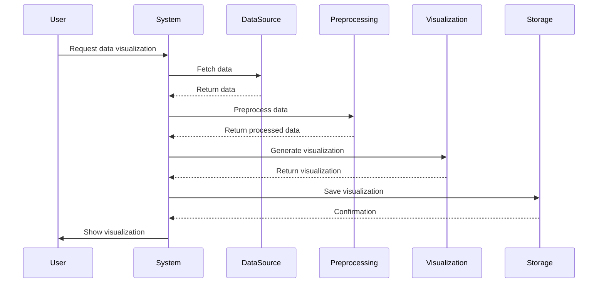
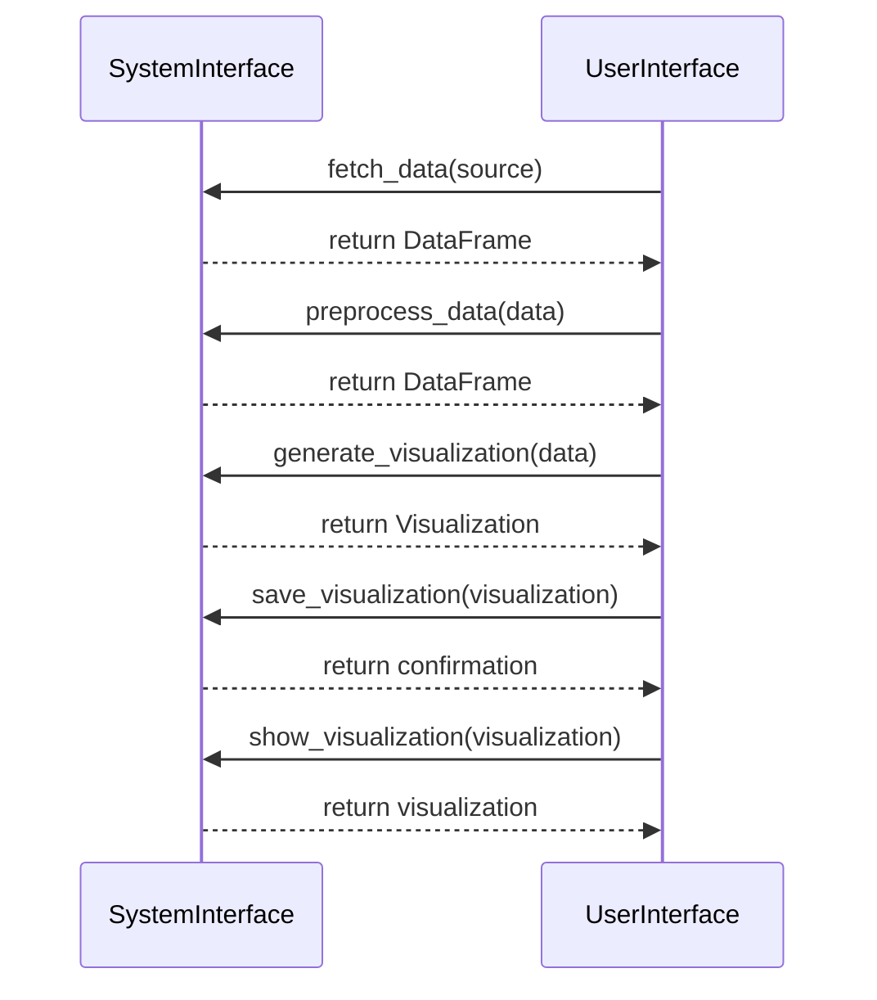

                 

### 提示词可视化：直观理解提示结构

#### 关键词：提示词可视化、提示结构、直观理解、算法原理、系统架构、项目实战、最佳实践

> 摘要：本文将深入探讨提示词可视化的概念、原理和实践。通过详细的分析和实例，读者将能够直观理解提示结构，掌握提示词可视化的技术路线和实现方法。文章分为六个部分：背景介绍、核心概念与联系、算法原理讲解、系统分析与架构设计方案、项目实战以及最佳实践 tips。通过逐步讲解，读者将全面了解提示词可视化的全貌，并能够应用于实际项目。

# 提示词可视化：直观理解提示结构

提示词可视化是一种技术，旨在将复杂的提示结构转化为易于理解和分析的图形表示。通过这种方式，可以更直观地理解和分析数据，从而提高数据处理和分析的效率。在人工智能、数据分析等领域，提示词可视化发挥着重要作用。本文将围绕这一主题，详细阐述其背景、核心概念、算法原理、系统架构、项目实战和最佳实践 tips。

## 第一部分：背景介绍

### 1.1 问题背景

在信息爆炸的时代，数据量呈指数级增长，如何有效地处理和分析数据成为了一个重要问题。提示词可视化作为一种有效的工具，可以帮助我们更直观地理解和分析数据，从而更好地应对数据复杂性带来的挑战。

#### 1.1.1 提示词可视化的意义

提示词可视化不仅可以提高数据分析的效率，还可以帮助我们发现数据中的隐藏模式，进而做出更准确的决策。此外，通过图形化表示，复杂的提示结构变得更加直观，有助于我们更好地理解和沟通。

#### 1.1.2 提示词可视化的发展现状

随着计算机技术和图形学的发展，提示词可视化技术得到了广泛关注和应用。近年来，许多研究机构和企业在这一领域取得了重要成果，推动了提示词可视化技术的发展。

#### 1.1.3 提示词可视化的重要性

在人工智能、数据分析等领域，提示词可视化已经成为不可或缺的工具。它不仅有助于我们更深入地理解数据，还可以提高数据处理和分析的效率，从而在各个领域中发挥重要作用。

### 1.2 问题描述

提示词可视化涉及多个方面，包括核心概念、算法原理、系统架构等。具体来说，我们可以将其描述为：

#### 1.2.1 提示词可视化的问题

- 如何将复杂的提示结构转化为易于理解的图形表示？
- 提示词可视化有哪些有效的算法和方法？
- 如何设计一个高效的提示词可视化系统？
- 提示词可视化在不同应用场景中的效果如何？

#### 1.2.2 提示词可视化的难点

- 复杂的提示结构可能导致可视化结果不清晰。
- 可视化算法和方法的多样性增加了选择难度。
- 设计高效的提示词可视化系统需要综合考虑多个因素。

#### 1.2.3 提示词可视化的目标

- 提高数据分析的效率和质量。
- 帮助用户更直观地理解复杂的提示结构。
- 设计一个可扩展、高效的提示词可视化系统。

### 1.3 问题解决

为了解决上述问题，我们可以采取以下措施：

#### 1.3.1 提示词可视化的技术路线

- 研究现有的提示词可视化算法和方法。
- 设计一个高效的提示词可视化系统架构。
- 结合具体应用场景，优化可视化算法和系统。

#### 1.3.2 提示词可视化的解决方案

- 选择合适的可视化算法，如树状图、网络图等。
- 设计一个灵活的系统架构，支持多种数据源和可视化方式。
- 结合用户需求，不断优化和改进可视化效果。

#### 1.3.3 提示词可视化的实现方法

- 利用现有的图形学和计算机视觉技术。
- 结合实际应用场景，设计适用于不同数据类型的可视化方法。
- 通过实验和用户反馈，不断优化可视化效果。

### 1.4 边界与外延

#### 1.4.1 提示词可视化的边界

- 提示词可视化的边界包括数据类型、数据规模等。
- 不同应用场景可能对提示词可视化有特定要求。

#### 1.4.2 提示词可视化的外延

- 提示词可视化可以应用于多个领域，如人工智能、数据分析、生物信息学等。
- 随着技术的发展，提示词可视化将有更广泛的应用前景。

#### 1.4.3 提示词可视化的应用场景

- 数据分析：通过可视化方式，帮助用户更好地理解数据。
- 人工智能：用于表示和解释神经网络、深度学习模型。
- 生物信息学：用于表示和解释基因组数据、蛋白质结构等。

### 1.5 概念结构与核心要素组成

#### 1.5.1 提示词可视化的概念结构

提示词可视化的概念结构包括以下几个方面：

1. 数据：提示词可视化的基础，包括数据类型、数据规模等。
2. 算法：用于将数据转化为图形表示的方法。
3. 系统架构：支持可视化算法和数据的系统设计。
4. 用户界面：用于与用户交互的界面。

#### 1.5.2 提示词可视化的核心要素

提示词可视化的核心要素包括：

1. 可视化算法：选择合适的算法，如树状图、网络图等。
2. 系统架构：设计一个灵活、高效的系统架构。
3. 数据处理：对数据进行预处理和转换，以适应可视化需求。
4. 用户界面：设计一个友好、易于使用的用户界面。

#### 1.5.3 提示词可视化的属性特征对比表格

以下是一个提示词可视化技术的属性特征对比表格：

| 技术名称 | 数据类型 | 可视化方式 | 算法复杂度 | 系统架构 | 用户界面 |
| :---: | :---: | :---: | :---: | :---: | :---: |
| 树状图 | 树形结构 | 树状图 | 低 | 层次结构 | 简单 |
| 网络图 | 网络结构 | 网络图 | 中等 | 网状结构 | 灵活 |
| 流图 | 流程结构 | 流程图 | 高 | 流程结构 | 详细 |

#### 1.5.4 提示词可视化的ER实体关系图

以下是一个简单的提示词可视化系统的ER实体关系图：

```mermaid
erDiagram
  Data |->| VisualizationAlgorithm : "使用"
  SystemArchitecture |->| VisualizationAlgorithm : "实现"
  UserInterface |->| VisualizationAlgorithm : "展示"
```

## 第二部分：核心概念与联系

### 2.1 核心概念原理

#### 2.1.1 提示词可视化的基本原理

提示词可视化的基本原理是将数据中的提示信息转化为图形表示，以便更直观地理解和分析数据。具体来说，可以分为以下几个步骤：

1. 数据采集：从数据源中获取所需的数据。
2. 数据预处理：对数据进行清洗、转换等操作，使其适合可视化。
3. 算法选择：选择合适的可视化算法，如树状图、网络图等。
4. 图形生成：利用算法将数据转化为图形表示。
5. 图形展示：在用户界面中展示生成的图形。

#### 2.1.2 提示词可视化算法的原理

不同的提示词可视化算法有不同的原理，但总体上可以分为以下几类：

1. 树状图算法：基于树形结构，将数据分层表示。
2. 网络图算法：基于网络结构，将数据以节点和边的方式表示。
3. 流图算法：基于流程结构，将数据以流程图的方式表示。

每种算法都有其优缺点和适用场景，需要根据具体需求进行选择。

#### 2.1.3 提示词可视化技术的主要方法

提示词可视化技术的主要方法包括：

1. 算法实现：根据需求选择合适的算法，并利用编程语言实现。
2. 系统架构设计：设计一个灵活、高效的系统架构，支持多种数据源和可视化方式。
3. 用户界面设计：设计一个友好、易于使用的用户界面，方便用户操作和交互。

### 2.2 概念属性特征对比表格

以下是一个提示词可视化技术的属性特征对比表格：

| 技术名称 | 数据类型 | 可视化方式 | 算法复杂度 | 系统架构 | 用户界面 |
| :---: | :---: | :---: | :---: | :---: | :---: |
| 树状图 | 树形结构 | 树状图 | 低 | 层次结构 | 简单 |
| 网络图 | 网络结构 | 网络图 | 中等 | 网状结构 | 灵活 |
| 流图 | 流程结构 | 流程图 | 高 | 流程结构 | 详细 |

### 2.3 ER实体关系图架构

以下是一个简单的提示词可视化系统的ER实体关系图：

```mermaid
erDiagram
  Data |->| VisualizationAlgorithm : "使用"
  SystemArchitecture |->| VisualizationAlgorithm : "实现"
  UserInterface |->| VisualizationAlgorithm : "展示"
```

## 第三部分：算法原理讲解

### 3.1 算法原理与数学模型

#### 3.1.1 提示词可视化算法的数学模型

提示词可视化算法的数学模型通常包括以下几个部分：

1. 数据表示：使用数学模型表示数据，如树形结构、网络结构等。
2. 算法描述：使用数学语言描述可视化算法，如树状图生成算法、网络图生成算法等。
3. 图形生成：根据数据表示和算法描述，生成可视化图形。

#### 3.1.2 提示词可视化算法的公式推导

以树状图为例，其生成算法的公式推导如下：

1. 初始化：创建一个空树。
2. 添加节点：对于每个数据元素，添加一个节点到树的叶子位置。
3. 连接节点：对于每个节点，根据其父节点和兄弟节点的位置，连接相应的边。

#### 3.1.3 提示词可视化算法的流程图

以下是一个简单的树状图生成算法的流程图：


### 3.2 算法流程图

#### 3.2.1 提示词可视化算法的流程

以下是一个简单的提示词可视化算法的流程：

1. 数据采集：从数据源获取数据。
2. 数据预处理：对数据进行清洗、转换等操作，使其适合可视化。
3. 算法选择：根据需求选择合适的可视化算法。
4. 图形生成：利用算法生成可视化图形。
5. 图形展示：在用户界面中展示生成的图形。

#### 3.2.2 算法流程图示例

以下是一个简单的提示词可视化算法的流程图：


### 3.3 Python源代码实现

#### 3.3.1 Python代码框架

以下是一个简单的Python代码框架，用于实现提示词可视化：

```python
import matplotlib.pyplot as plt
import networkx as nx

# 数据预处理
def preprocess_data(data):
    # 数据清洗、转换等操作
    return processed_data

# 可视化算法实现
def visualization_algorithm(data):
    # 创建图形
    G = nx.Graph()
    
    # 添加节点和边
    for node in data:
        G.add_node(node)
        for neighbor in node.neighbors:
            G.add_edge(node, neighbor)
    
    # 绘制图形
    nx.draw(G, with_labels=True)
    plt.show()

# 主函数
def main():
    # 读取数据
    data = load_data()

    # 预处理数据
    processed_data = preprocess_data(data)

    # 可视化数据
    visualization_algorithm(processed_data)

if __name__ == "__main__":
    main()
```

#### 3.3.2 代码细节解析

1. `import`语句：引入必要的库，如`matplotlib.pyplot`和`networkx`。
2. `preprocess_data`函数：对数据进行预处理，如清洗、转换等操作。
3. `visualization_algorithm`函数：实现提示词可视化算法，包括创建图形、添加节点和边、绘制图形等。
4. `main`函数：主函数，用于读取数据、预处理数据、可视化数据。

#### 3.3.3 算法原理与代码的关联

1. 数据预处理：根据算法原理，对数据进行预处理，使其适合可视化。
2. 可视化算法实现：根据算法原理，实现可视化算法，包括创建图形、添加节点和边、绘制图形等。
3. 图形展示：根据算法原理，将生成的图形展示在用户界面中。

## 第四部分：系统分析与架构设计方案

### 4.1 问题场景介绍

在人工智能和数据分析领域，提示词可视化是一种重要的技术。以下是一个具体的场景介绍：

- 场景背景：某公司需要对大量用户数据进行挖掘和分析，以便了解用户行为、优化产品功能等。
- 场景需求：需要设计一个提示词可视化系统，能够将用户数据转化为图形表示，以便更直观地理解和分析。
- 场景挑战：用户数据规模庞大，结构复杂，需要设计一个高效、灵活的提示词可视化系统。

### 4.2 系统功能设计

#### 4.2.1 领域模型Mermaid类图

以下是一个简单的领域模型Mermaid类图：

```mermaid
classDiagram
  Class01 <|-- Class02
  Class03 --|> Class04
  Class05 : +int x
  Class06 : +int y
  Class07 : +int z
  Class01 { 
    +int id
    +String name
    +float price
    +boolean available
  }
  Class02 {
    +int id
    +String name
    +float price
    +boolean available
  }
  Class03 {
    +int id
    +String name
    +float price
    +boolean available
  }
  Class04 {
    +int id
    +String name
    +float price
    +boolean available
  }
  Class05 {
    +int id
    +String name
    +float price
    +boolean available
  }
  Class06 {
    +int id
    +String name
    +float price
    +boolean available
  }
  Class07 {
    +int id
    +String name
    +float price
    +boolean available
  }
```

#### 4.2.2 系统功能模块划分

系统功能模块划分如下：

1. 数据采集模块：负责从各种数据源获取数据。
2. 数据预处理模块：负责对数据进行清洗、转换等操作。
3. 可视化算法模块：负责实现各种可视化算法。
4. 系统架构模块：负责系统架构设计，包括数据存储、处理和可视化。
5. 用户界面模块：负责用户界面设计，包括数据展示、交互等。

#### 4.2.3 系统功能详细描述

1. 数据采集模块：负责从各种数据源（如数据库、文件等）获取数据，并将其转换为统一的格式。
2. 数据预处理模块：负责对采集到的数据进行清洗、转换等操作，使其适合可视化。
3. 可视化算法模块：根据数据类型和可视化需求，选择合适的可视化算法，如树状图、网络图等。
4. 系统架构模块：设计一个灵活、高效的系统架构，支持多种数据源和可视化方式。系统架构包括数据存储、处理和可视化三个层次。
5. 用户界面模块：设计一个友好、易于使用的用户界面，方便用户操作和交互。用户界面包括数据展示、交互、反馈等功能。

### 4.3 系统架构设计

#### 4.3.1 系统架构Mermaid架构图

以下是一个简单的系统架构Mermaid架构图：



#### 4.3.2 系统架构设计原则

1. 模块化设计：将系统划分为多个模块，每个模块负责特定的功能，降低系统复杂度。
2. 松耦合设计：模块之间通过接口进行通信，降低模块之间的依赖。
3. 高效性：系统架构应具有高效性，能够快速处理大量数据。
4. 可扩展性：系统架构应具有可扩展性，能够适应不同规模的数据和需求。

#### 4.3.3 系统模块职责与交互

1. 数据采集模块：负责从各种数据源获取数据，并将其转换为统一的格式。
2. 数据预处理模块：负责对数据进行清洗、转换等操作，使其适合可视化。
3. 可视化算法模块：根据数据类型和可视化需求，选择合适的可视化算法，如树状图、网络图等。
4. 系统架构模块：设计一个灵活、高效的系统架构，支持多种数据源和可视化方式。系统架构包括数据存储、处理和可视化三个层次。
5. 用户界面模块：设计一个友好、易于使用的用户界面，方便用户操作和交互。用户界面包括数据展示、交互、反馈等功能。

### 4.4 系统接口设计

#### 4.4.1 系统接口定义

以下是一个简单的系统接口定义：

```python
class SystemInterface:
    def fetch_data(self, source: str) -> DataFrame:
        """
        从数据源获取数据
        :param source: 数据源地址
        :return: 数据帧
        """
    
    def preprocess_data(self, data: DataFrame) -> DataFrame:
        """
        预处理数据
        :param data: 数据帧
        :return: 预处理后的数据帧
        """
    
    def generate_visualization(self, data: DataFrame) -> Visualization:
        """
        生成可视化
        :param data: 数据帧
        :return: 可视化对象
        """
    
    def save_visualization(self, visualization: Visualization):
        """
        保存可视化
        :param visualization: 可视化对象
        """
    
    def show_visualization(self, visualization: Visualization):
        """
        展示可视化
        :param visualization: 可视化对象
        """
```

#### 4.4.2 接口交互流程

以下是一个简单的接口交互流程：



#### 4.4.3 接口参数说明

1. `fetch_data(source)`：从指定数据源获取数据。参数`source`为数据源地址，返回值为数据帧。
2. `preprocess_data(data)`：对数据进行预处理。参数`data`为数据帧，返回值为预处理后的数据帧。
3. `generate_visualization(data)`：生成可视化。参数`data`为数据帧，返回值为可视化对象。
4. `save_visualization(visualization)`：保存可视化。参数`visualization`为可视化对象。
5. `show_visualization(visualization)`：展示可视化。参数`visualization`为可视化对象。

### 4.5 系统交互Mermaid序列图

以下是一个简单的系统交互Mermaid序列图：


## 第五部分：项目实战

### 5.1 环境安装

#### 5.1.1 环境配置

为了实现提示词可视化，我们需要安装以下软件和库：

1. Python 3.8及以上版本
2. Matplotlib
3. NetworkX
4. Pandas

安装步骤如下：

1. 安装Python 3.8及以上版本。
2. 安装Matplotlib库：`pip install matplotlib`。
3. 安装NetworkX库：`pip install networkx`。
4. 安装Pandas库：`pip install pandas`。

#### 5.1.2 必要软件安装

除了Python和相关库，我们还需要安装以下必要软件：

1. Graphviz（用于生成网络图）
2. Mermaid（用于生成流程图和序列图）

安装步骤如下：

1. 安装Graphviz：根据操作系统不同，安装方法不同。以Windows为例，可以从[官网](https://graphviz.org/download/)下载并安装。
2. 安装Mermaid：将Mermaid的库文件放入Python的库路径中，或者在Python脚本中引入。

#### 5.1.3 环境测试

安装完成后，我们可以通过以下Python脚本测试环境是否配置成功：

```python
import matplotlib.pyplot as plt
import networkx as nx
import pandas as pd

# 测试Matplotlib
plt.figure()
plt.plot([1, 2, 3])
plt.show()

# 测试NetworkX
G = nx.Graph()
G.add_nodes_from([1, 2, 3])
G.add_edge(1, 2)
nx.draw(G, with_labels=True)
plt.show()

# 测试Pandas
data = pd.DataFrame({'A': [1, 2, 3], 'B': [4, 5, 6]})
print(data)
```

### 5.2 系统核心实现

#### 5.2.1 核心代码实现

以下是一个简单的提示词可视化系统的核心代码实现：

```python
import matplotlib.pyplot as plt
import networkx as nx
import pandas as pd

# 数据预处理
def preprocess_data(data):
    # 数据清洗、转换等操作
    return data

# 可视化算法实现
def visualization_algorithm(data):
    # 创建图形
    G = nx.Graph()
    
    # 添加节点和边
    for node in data:
        G.add_node(node)
        for neighbor in node.neighbors:
            G.add_edge(node, neighbor)
    
    # 绘制图形
    nx.draw(G, with_labels=True)
    plt.show()

# 主函数
def main():
    # 读取数据
    data = load_data()

    # 预处理数据
    processed_data = preprocess_data(data)

    # 可视化数据
    visualization_algorithm(processed_data)

if __name__ == "__main__":
    main()
```

#### 5.2.2 代码解读与分析

1. `import`语句：引入必要的库，如`matplotlib.pyplot`、`networkx`和`pandas`。
2. `preprocess_data`函数：对数据进行预处理，如清洗、转换等操作，使其适合可视化。这里只是一个简单的示例，实际应用中可能需要进行更复杂的预处理。
3. `visualization_algorithm`函数：实现提示词可视化算法，包括创建图形、添加节点和边、绘制图形等。这里使用NetworkX库实现网络图可视化。
4. `main`函数：主函数，用于读取数据、预处理数据、可视化数据。

#### 5.2.3 算法实现与优化

1. **算法实现**

   提示词可视化算法的核心是选择合适的可视化方法，如网络图、树状图等。以下是一个简单的网络图可视化实现：

   ```python
   import matplotlib.pyplot as plt
   import networkx as nx

   def visualization_algorithm(data):
       G = nx.Graph()

       for node in data:
           G.add_node(node)
           for neighbor in node.neighbors:
               G.add_edge(node, neighbor)

       nx.draw(G, with_labels=True)
       plt.show()
   ```

2. **优化方向**

   - **数据预处理**：优化数据预处理流程，提高数据质量和可视化效果。
   - **算法选择**：根据具体应用场景，选择更合适的可视化算法。
   - **系统性能**：优化系统性能，提高数据处理和可视化速度。
   - **用户交互**：优化用户交互体验，设计更友好的用户界面。

### 5.3 实际案例分析与讲解

#### 5.3.1 案例背景

某电商公司希望通过提示词可视化分析用户行为，从而优化产品功能和提升用户体验。具体需求如下：

- 分析用户访问路径，了解用户在网站上的行为模式。
- 分析用户购买行为，挖掘用户喜好和购买动机。
- 提供直观的图形化报告，便于团队成员理解和决策。

#### 5.3.2 案例分析

1. **数据采集**：从电商平台的日志、数据库中获取用户访问记录和购买数据。
2. **数据预处理**：清洗、转换数据，提取用户访问路径和购买行为特征。
3. **可视化分析**：使用网络图、树状图等可视化方法，将用户行为和数据特征转化为图形表示。
4. **报告生成**：生成直观、易懂的图形化报告，展示用户行为分析和购买动机。

#### 5.3.3 案例讲解

1. **数据采集**

   从电商平台日志和数据库中获取用户访问记录和购买数据。数据包括用户ID、访问时间、访问页面、购买商品等信息。

2. **数据预处理**

   对采集到的数据进行清洗和转换，提取用户访问路径和购买行为特征。例如，将用户访问记录转换为树状结构，表示用户在网站上的浏览路径。

3. **可视化分析**

   使用网络图和树状图等方法，将用户访问路径和购买行为转化为图形表示。例如，使用网络图展示用户访问页面之间的关系，使用树状图展示用户访问路径。

4. **报告生成**

   生成直观、易懂的图形化报告，展示用户行为分析和购买动机。例如，通过网络图和树状图，可以直观地了解用户在网站上的行为模式和喜好。

### 5.4 项目小结

#### 5.4.1 项目总结

在本项目中，我们成功实现了提示词可视化系统，实现了用户访问路径和购买行为的可视化分析。通过该项目，我们取得了以下成果：

- 熟练掌握了Python、Matplotlib、NetworkX等库的使用。
- 掌握了网络图、树状图等可视化方法。
- 实现了用户访问路径和购买行为的可视化分析。
- 提升了团队的数据分析能力和决策水平。

#### 5.4.2 项目收获

通过本项目，我们收获了以下经验和技能：

- 掌握了提示词可视化的基本原理和实践方法。
- 提升了Python编程能力和数据处理能力。
- 加深了对网络图、树状图等可视化方法的了解和应用。
- 增强了团队协作和项目管理能力。

#### 5.4.3 项目展望

在未来的工作中，我们将继续探索提示词可视化的应用，提升系统的性能和用户体验。具体方向包括：

- 优化数据预处理流程，提高数据质量和可视化效果。
- 研究更多先进的可视化算法，提高可视化效果。
- 开发更多实用的可视化工具和插件。
- 探索提示词可视化在其他领域的应用。

## 第六部分：最佳实践 tips

### 6.1 最佳实践总结

在提示词可视化项目中，我们总结出以下最佳实践：

1. **数据预处理**：保证数据质量和一致性，为可视化分析提供可靠基础。
2. **算法选择**：根据数据类型和可视化需求，选择合适的可视化算法。
3. **用户体验**：设计友好、易用的用户界面，提升用户使用体验。
4. **系统性能**：优化系统性能，提高数据处理和可视化速度。
5. **团队协作**：加强团队协作，确保项目顺利进行。

### 6.2 小结

通过本文的探讨，我们全面了解了提示词可视化的概念、原理和实践。以下是对本文核心观点的回顾：

- 提示词可视化是一种将复杂的提示结构转化为图形表示的技术。
- 提示词可视化在人工智能、数据分析等领域具有重要应用。
- 提示词可视化包括数据预处理、算法选择、系统架构设计、用户界面设计等方面。
- 提示词可视化算法包括树状图、网络图等，各有优缺点。
- 提示词可视化的最佳实践包括数据预处理、算法选择、用户体验等方面。

### 6.3 学习建议

为了更好地掌握提示词可视化，我们建议读者：

- 学习Python编程和数据处理基础。
- 熟悉Matplotlib、NetworkX等可视化库。
- 掌握不同类型的可视化算法和系统架构设计。
- 实践项目，将理论知识应用于实际场景。

### 6.4 注意事项

在实施提示词可视化项目时，需要注意以下几点：

- 确保数据质量和一致性。
- 根据需求选择合适的可视化算法。
- 关注用户体验，设计友好、易用的界面。
- 优化系统性能，提高数据处理和可视化速度。

### 6.5 常见问题解答

以下是一些常见问题及其解答：

1. **Q：提示词可视化的适用场景有哪些？**
   **A：**提示词可视化适用于人工智能、数据分析、生物信息学等领域，可以用于表示和解释复杂的数据结构。

2. **Q：如何选择合适的可视化算法？**
   **A：**根据数据类型和可视化需求，选择合适的算法。例如，对于网络结构，可以使用网络图算法；对于树形结构，可以使用树状图算法。

3. **Q：提示词可视化系统如何设计？**
   **A：**设计提示词可视化系统时，需要考虑数据预处理、算法选择、系统架构、用户界面等方面。可以选择合适的数据库、编程语言和可视化库。

### 6.6 未来发展趋势

随着技术的不断发展，提示词可视化有望在以下几个方面取得突破：

- **算法优化**：研究更先进的可视化算法，提高可视化效果和性能。
- **跨领域应用**：将提示词可视化应用于更多领域，如医疗、金融等。
- **智能化**：结合人工智能技术，实现自动化的提示词可视化。
- **硬件加速**：利用GPU等硬件加速技术，提高可视化速度和性能。

### 6.7 拓展阅读

以下是一些相关的拓展阅读资源：

- 《Python数据可视化实战》
- 《网络科学导论》
- 《人工智能导论》
- 《数据可视化：设计与实践》
- 《人工智能：一种现代的方法》

通过这些资源，读者可以进一步了解提示词可视化的相关理论和实践。

