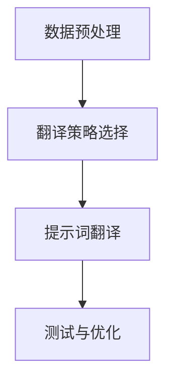
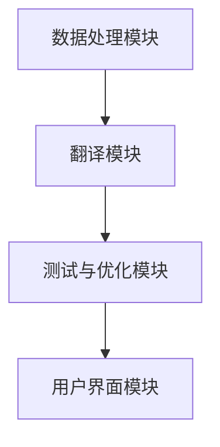
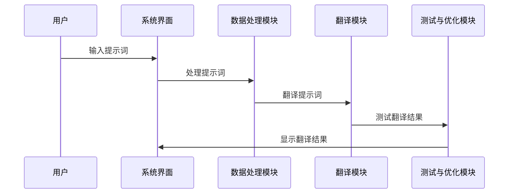

                 

# 提示词国际化：适应不同文化背景的AI交互

## 关键词

- 提示词国际化
- 语言差异
- 文化差异
- AI交互
- 算法实现
- 系统设计

## 摘要

随着全球化的深入发展，人工智能（AI）技术的应用越来越广泛。然而，不同语言和文化背景下的用户交互带来了巨大的挑战。本文旨在探讨提示词国际化的必要性和实现方法，通过分析提示词在不同语言和文化中的表达差异，提出有效的国际化策略和算法，并详细阐述一个具体的系统设计与实现过程，以期为AI交互系统的全球化发展提供理论依据和实用指南。

## 第一部分：背景介绍

### 第1章：提示词国际化的背景与重要性

### 1.1 问题背景

#### 1.1.1 全球化趋势下的语言差异

全球化带来了跨国界、跨文化的交流与合作，然而不同语言和文化背景下的沟通仍然存在障碍。特别是在人工智能交互领域，不同语言和文化的差异使得系统的设计、开发和应用面临巨大的挑战。

#### 1.1.2 人工智能在交互领域的应用

人工智能在交互领域的应用日益广泛，如智能客服、智能家居、智能语音助手等。这些系统的核心是自然语言处理（NLP），而提示词的国际化是NLP的重要环节。

#### 1.1.3 文化差异对AI交互的影响

文化差异对AI交互有着深远的影响。不同文化背景下，用户的表达方式、行为习惯和沟通风格都有所不同。例如，某些提示词在一种文化中可能具有积极的意义，而在另一种文化中则可能具有消极的意义。

### 1.2 问题描述

#### 1.2.1 提示词在不同语言和文化中的表达差异

不同语言和文化背景下的用户对相同提示词的理解可能存在差异，这导致了AI交互系统的准确性和用户体验的下降。

#### 1.2.2 AI交互系统面临的挑战

AI交互系统需要处理大量的语言和文化差异，包括词汇的选择、语境的理解和文化的适应等。这给系统的设计和实现带来了巨大的挑战。

#### 1.2.3 目标与需求

目标是设计一个能够适应不同语言和文化背景的AI交互系统，提高系统的准确性和用户体验。需求包括对提示词的国际化处理、对语言和文化差异的敏感性和适应性。

### 1.3 问题解决

#### 1.3.1 提示词国际化的必要性

提示词国际化是AI交互系统全球化的关键步骤，它能够提高系统的通用性和可扩展性。

#### 1.3.2 提示词国际化的一般步骤

提示词国际化一般包括以下步骤：需求分析、提示词库构建、翻译和适应策略设计、测试和优化。

#### 1.3.3 边界与外延

提示词国际化需要考虑的边界包括语言和文化的多样性、用户行为的差异性和系统的可扩展性。外延则包括对其他语言和文化背景的适应，如非文字的沟通方式、手势语言等。

### 1.4 概念结构与核心要素组成

#### 1.4.1 关键概念解析

- 提示词：用于引导用户操作的文本或语音。
- 国际化：使产品或服务能够适应不同语言和文化背景。
- AI交互：利用人工智能技术进行的人机交互。

#### 1.4.2 核心要素分析

- 语言差异：词汇、语法、语境。
- 文化差异：价值观、行为习惯、沟通风格。

#### 1.4.3 概念间的联系

提示词国际化是AI交互系统面对语言和文化差异的一种解决方案，它涉及到多个核心要素的协同作用。

### 1.5 本章小结

本文介绍了提示词国际化的背景和重要性，分析了AI交互系统面临的挑战和需求，提出了问题解决的一般步骤和边界与外延。下一章将深入探讨提示词国际化的基本概念和原理。

## 第二部分：核心概念与原理

### 第2章：提示词国际化的基本概念

### 2.1 提示词的定义与作用

#### 2.1.1 提示词的定义

提示词是用于引导用户进行操作的文本或语音。在AI交互系统中，提示词起着至关重要的作用，它能够帮助用户理解系统的功能和使用方法。

#### 2.1.2 提示词在AI交互中的作用

提示词在AI交互中主要有以下作用：

- 引导用户：提示词能够引导用户进行正确的操作，提高用户体验。
- 提高效率：通过提示词，系统能够快速响应用户的需求，提高交互效率。
- 增强个性：提示词可以根据用户的文化背景和喜好进行个性化调整。

#### 2.1.3 提示词的类型

根据用途和形式，提示词可以分为以下几种类型：

- 操作提示词：引导用户进行特定操作，如“请点击此处”。
- 问题提示词：引导用户回答问题，如“您有什么问题吗？”。
- 确认提示词：确认用户操作，如“确认删除吗？”。
- 警告提示词：提醒用户注意潜在的风险，如“操作有风险，请谨慎”。

### 2.2 语言与文化差异

#### 2.2.1 语言差异对提示词的影响

语言差异对提示词的影响主要表现在词汇、语法和语境等方面。

- 词汇：不同语言中的词汇可能具有不同的含义和用法。
- 语法：不同语言中的语法结构可能存在差异，这会影响提示词的表达方式。
- 语境：语境的不同可能导致提示词的含义发生变化。

#### 2.2.2 文化差异对提示词的影响

文化差异对提示词的影响主要表现在价值观、行为习惯和沟通风格等方面。

- 价值观：不同文化背景下，人们对事物的看法和态度可能存在差异，这会影响提示词的选择和表达。
- 行为习惯：不同文化背景下，人们的行为习惯可能存在差异，这会影响提示词的使用方式。
- 沟通风格：不同文化背景下，人们的沟通风格可能存在差异，这会影响提示词的表达方式。

#### 2.2.3 跨文化沟通的挑战

跨文化沟通的挑战主要表现在以下几个方面：

- 误解和歧义：由于语言和文化差异，提示词可能导致误解和歧义。
- 交流障碍：不同语言和文化背景下的沟通可能存在障碍，影响交互效果。
- 文化敏感性：在跨文化交互中，需要考虑到文化敏感性问题，避免冒犯用户。

### 2.3 提示词国际化策略

#### 2.3.1 直接翻译策略

直接翻译策略是将原始语言中的提示词直接翻译成目标语言。这种策略的优点是简单易行，缺点是可能无法完全适应目标语言和文化。

#### 2.3.2 直译与意译结合策略

直译与意译结合策略是将直接翻译和意译相结合，既保留了原始语言中的词汇和语法结构，又能够适应目标语言和文化的特点。这种策略的优点是能够在一定程度上提高提示词的适应性和准确性。

#### 2.3.3 文化适应性策略

文化适应性策略是根据目标语言和文化的特点，对提示词进行个性化调整。这种策略的优点是能够更好地适应目标语言和文化，提高用户体验。

### 2.4 概念属性特征对比表格

| 概念         | 属性特征                            | 对比分析                     |
| ------------ | --------------------------------- | --------------------------- |
| 语言差异     | 词汇、语法、语境                   | 影响提示词的翻译和表达方式   |
| 文化差异     | 价值观、行为习惯、沟通风格         | 影响提示词的选择和使用方式   |
| 直接翻译策略 | 简单易行，但可能不适应目标文化   | 提示词翻译的直接性           |
| 意译策略     | 需要较高的语言和文化理解能力     | 提示词表达的文化适应性       |

### 2.5 ER实体关系图架构

#### 2.5.1 提示词国际化的实体关系

在提示词国际化过程中，涉及到的实体包括：

- 提示词：用于引导用户操作的信息。
- 语言：提示词的国际化和翻译需要考虑的语言。
- 文化：提示词的国际化和翻译需要考虑的文化。
- 翻译策略：用于指导提示词翻译的方法。

#### 2.5.2 提示词国际化流程的ER图

```mermaid
erDiagram
  提示词 ||--o> 语言
  提示词 ||--o> 文化
  提示词 ||--o> 翻译策略
```

### 2.6 本章小结

本章介绍了提示词国际化的基本概念，包括提示词的定义与作用、语言与文化差异的影响、提示词国际化策略和概念属性特征对比。下一章将深入探讨提示词国际化算法的原理与实现。

## 第三部分：算法原理与实现

### 第3章：提示词国际化算法原理

### 3.1 算法概述

#### 3.1.1 提示词国际化算法的目的

提示词国际化算法的目的是设计一种能够适应不同语言和文化背景的提示词翻译方法，以提高AI交互系统的准确性和用户体验。

#### 3.1.2 算法的基本框架

提示词国际化算法的基本框架包括以下几个步骤：

1. 数据预处理：对原始提示词进行预处理，包括分词、去停用词等操作。
2. 翻译策略选择：根据目标语言和文化的特点，选择合适的翻译策略。
3. 提示词翻译：根据选择的翻译策略，对提示词进行翻译。
4. 测试与优化：对翻译后的提示词进行测试，并根据测试结果进行优化。

#### 3.1.3 算法的关键技术

提示词国际化算法的关键技术包括：

- 自然语言处理（NLP）：用于对提示词进行预处理和翻译。
- 翻译模型：用于实现提示词的翻译，包括机器翻译和深度学习翻译模型。
- 文化适应性分析：用于分析目标语言和文化的特点，为翻译策略提供支持。

### 3.2 提示词国际化算法流程

#### 3.2.1 数据预处理

数据预处理是提示词国际化算法的第一步，主要包括以下操作：

- 分词：将提示词拆分成单词或短语。
- 去停用词：去除无意义的单词或短语，如“的”、“了”等。
- 标签化：为每个单词或短语标注语言和文化的标签。

#### 3.2.2 翻译策略选择

翻译策略选择是提示词国际化算法的核心步骤，主要包括以下策略：

- 直接翻译策略：将原始提示词直接翻译成目标语言。
- 意译策略：在保留原始提示词含义的基础上，根据目标语言和文化的特点进行调整。
- 文化适应性策略：根据目标语言和文化的特点，对提示词进行个性化调整。

#### 3.2.3 算法实现步骤

提示词国际化算法的具体实现步骤如下：

1. 加载数据集：加载数据集中的原始提示词和对应的翻译提示词。
2. 数据预处理：对原始提示词进行分词、去停用词和标签化处理。
3. 选择翻译策略：根据目标语言和文化的特点，选择合适的翻译策略。
4. 提示词翻译：根据选择的翻译策略，对提示词进行翻译。
5. 测试与优化：对翻译后的提示词进行测试，并根据测试结果进行优化。

### 3.3 算法原理详细讲解

#### 3.3.1 数学模型介绍

提示词国际化算法的数学模型主要包括以下几个部分：

- 词向量表示：将提示词表示为向量。
- 翻译模型：将原始提示词的向量映射到目标语言和文化的向量。
- 文化适应性模型：根据目标语言和文化的特点，对翻译后的提示词进行适应性调整。

#### 3.3.2 数学模型公式

提示词国际化算法的数学模型公式如下：

$$
\text{翻译结果} = \text{翻译模型}(\text{原始提示词向量}) \times \text{文化适应性模型}
$$

#### 3.3.3 算法流程mermaid图



### 3.4 Python源代码与算法实现

#### 3.4.1 Python代码概述

提示词国际化算法的Python代码主要包括以下模块：

- 数据预处理模块：用于对原始提示词进行预处理。
- 翻译策略模块：用于实现提示词的翻译。
- 文化适应性模块：用于根据目标语言和文化的特点，对翻译后的提示词进行适应性调整。
- 测试与优化模块：用于测试翻译结果，并根据测试结果进行优化。

#### 3.4.2 Python代码实现

```python
# 数据预处理模块
def preprocess_prompt(prompt):
    # 分词、去停用词、标签化等操作
    pass

# 翻译策略模块
def translate_prompt(prompt, target_language):
    # 直接翻译、意译、文化适应性翻译等操作
    pass

# 文化适应性模块
def adapt_prompt(prompt, target_culture):
    # 根据目标语言和文化的特点，调整翻译后的提示词
    pass

# 测试与优化模块
def test_and_optimize(prompt, translated_prompt):
    # 测试翻译结果，并根据测试结果进行优化
    pass
```

#### 3.4.3 代码解读与分析

提示词国际化算法的Python代码实现主要包括以下几个部分：

- 数据预处理：对原始提示词进行预处理，包括分词、去停用词和标签化处理。
- 翻译策略：根据目标语言和文化的特点，选择合适的翻译策略，包括直接翻译、意译和文化适应性翻译。
- 文化适应性：根据目标语言和文化的特点，对翻译后的提示词进行适应性调整。
- 测试与优化：对翻译结果进行测试，并根据测试结果进行优化。

### 3.5 举例说明

#### 3.5.1 简单案例演示

假设有一个中文提示词“请点击此处”，要翻译成英文。按照提示词国际化算法的步骤进行操作：

1. 数据预处理：将中文提示词“请点击此处”分词为“请”、“点击”、“此处”。
2. 翻译策略：选择直接翻译策略，将每个单词翻译成英文，得到“Please click here”。
3. 文化适应性：根据英文文化的特点，对翻译后的提示词进行适应性调整，例如调整为“Click here, please”。
4. 测试与优化：对翻译后的提示词进行测试，根据测试结果进行优化。

#### 3.5.2 复杂案例解析

假设有一个中文提示词“您的操作有风险，请谨慎”，要翻译成英文。按照提示词国际化算法的步骤进行操作：

1. 数据预处理：将中文提示词“您的操作有风险，请谨慎”分词为“您的”、“操作”、“有”、“风险”、“请”、“谨慎”。
2. 翻译策略：选择意译策略，将每个单词翻译成英文，并根据英文文化的特点进行调整，得到“Your action is risky; please be cautious”。
3. 文化适应性：根据英文文化的特点，对翻译后的提示词进行适应性调整，例如调整为“Please be cautious with your action; it's risky”。
4. 测试与优化：对翻译后的提示词进行测试，根据测试结果进行优化。

### 3.6 本章小结

本章介绍了提示词国际化算法的原理与实现，包括算法概述、算法流程、数学模型和Python代码实现。通过举例说明，展示了如何将中文提示词翻译成英文。下一章将详细讨论提示词国际化系统的设计与实现。

## 第四部分：系统设计与实现

### 第4章：提示词国际化系统的设计与实现

### 4.1 项目介绍

#### 4.1.1 项目背景

随着全球化的深入发展，人工智能技术在各个领域的应用越来越广泛。然而，不同语言和文化背景下的用户交互带来了巨大的挑战。为了提高AI交互系统的用户体验和准确性，我们需要设计一个能够适应不同语言和文化背景的提示词国际化系统。

#### 4.1.2 项目目标

本项目旨在设计一个提示词国际化系统，实现以下目标：

- 支持多种语言和文化背景下的提示词翻译。
- 提高AI交互系统的用户体验和准确性。
- 提供灵活的翻译策略和适应性调整功能。

#### 4.1.3 项目架构

提示词国际化系统的整体架构包括以下几个部分：

- 数据处理模块：负责对原始提示词进行预处理，包括分词、去停用词等操作。
- 翻译模块：负责实现提示词的翻译，包括直接翻译、意译和文化适应性翻译。
- 测试与优化模块：负责对翻译后的提示词进行测试和优化，以提高系统的准确性和用户体验。
- 用户界面：提供一个直观易用的用户界面，方便用户使用和管理提示词。

### 4.2 系统功能设计

#### 4.2.1 领域模型分析

在提示词国际化系统中，涉及到的主要领域模型包括：

- 提示词：表示用户操作的文本或语音。
- 语言：表示提示词的国际化和翻译需要考虑的语言。
- 文化：表示提示词的国际化和翻译需要考虑的文化。
- 翻译策略：表示用于指导提示词翻译的方法。

#### 4.2.2 功能模块划分

提示词国际化系统的主要功能模块包括：

- 数据处理模块：负责对原始提示词进行预处理。
- 翻译模块：负责实现提示词的翻译。
- 测试与优化模块：负责对翻译后的提示词进行测试和优化。
- 用户界面模块：负责提供用户操作界面。

#### 4.2.3 领域模型mermaid类图

```mermaid
classDiagram
    Prompt <<interface>>
    Language <<interface>>
    Culture <<interface>>
    TranslationStrategy <<interface>>

    Prompt "has" language : Language
    Prompt "has" culture : Culture
    Prompt "uses" translationStrategy : TranslationStrategy
```

### 4.3 系统架构设计

#### 4.3.1 系统整体架构

提示词国际化系统的整体架构包括以下几个部分：

- 数据处理层：负责对原始提示词进行预处理。
- 翻译层：负责实现提示词的翻译。
- 测试与优化层：负责对翻译后的提示词进行测试和优化。
- 用户界面层：提供用户操作界面。

#### 4.3.2 各模块功能

- 数据处理模块：负责对原始提示词进行预处理，包括分词、去停用词等操作。
- 翻译模块：负责实现提示词的翻译，包括直接翻译、意译和文化适应性翻译。
- 测试与优化模块：负责对翻译后的提示词进行测试和优化，以提高系统的准确性和用户体验。
- 用户界面模块：提供用户操作界面，方便用户使用和管理提示词。

#### 4.3.3 系统架构mermaid图



### 4.4 系统接口设计

#### 4.4.1 接口规范

提示词国际化系统的主要接口包括：

- 提示词接口：用于添加、修改和查询提示词。
- 语言接口：用于添加、修改和查询语言。
- 文化接口：用于添加、修改和查询文化。
- 翻译接口：用于翻译提示词。
- 测试接口：用于测试翻译结果。

#### 4.4.2 接口实现

接口实现的主要步骤包括：

- 定义接口：根据接口规范，定义接口的函数签名。
- 实现接口：根据接口定义，实现具体的接口功能。

#### 4.4.3 接口测试

接口测试的主要步骤包括：

- 编写测试用例：根据接口规范，编写测试用例。
- 执行测试：运行测试用例，检查接口是否按照预期工作。
- 结果分析：分析测试结果，找出接口中的问题并进行修复。

### 4.5 系统交互mermaid序列图



### 4.6 实际案例分析与详细讲解

#### 4.6.1 案例背景

假设我们有一个中文提示词“您的操作有风险，请谨慎”，要翻译成英文，并适应英文文化的特点。

#### 4.6.2 案例实现步骤

1. 数据预处理：将中文提示词“您的操作有风险，请谨慎”分词为“您的”、“操作”、“有”、“风险”、“请”、“谨慎”。
2. 翻译策略：选择意译策略，将每个单词翻译成英文，并根据英文文化的特点进行调整，得到“Your action is risky; please be cautious”。
3. 文化适应性：根据英文文化的特点，对翻译后的提示词进行适应性调整，例如调整为“Please be cautious with your action; it's risky”。
4. 测试与优化：对翻译后的提示词进行测试，根据测试结果进行优化。

#### 4.6.3 案例分析与总结

通过实际案例的分析，我们可以看到提示词国际化系统的设计和实现需要考虑多方面的因素，包括语言差异、文化差异和用户体验。在实际应用中，我们需要根据不同的需求和场景，灵活选择和调整翻译策略，以提高系统的准确性和用户体验。

### 4.7 本章小结

本章介绍了提示词国际化系统的设计与实现，包括项目背景、项目目标、系统架构设计、接口设计、系统交互和实际案例分析。通过本章的学习，我们可以了解到如何设计一个适应不同语言和文化背景的提示词国际化系统，为AI交互系统的全球化发展提供支持。

## 最佳实践与拓展阅读

### 最佳实践

在进行提示词国际化时，以下最佳实践可以帮助提高系统的准确性和用户体验：

1. **文化适应性测试**：在发布前，对翻译后的提示词进行文化适应性测试，确保其在目标文化背景下能够被正确理解和接受。

2. **用户反馈**：积极收集用户反馈，根据用户的使用情况和建议对提示词进行调整和优化。

3. **多语言支持**：在系统设计中考虑多语言支持，允许用户选择自己的语言，提高系统的可用性。

4. **术语库维护**：建立一个术语库，用于存储和管理不同语言和文化背景下的提示词，便于后续的翻译和调整。

### 拓展阅读

1. **《自然语言处理原理与应用》**：了解自然语言处理的基本原理和应用，对提示词国际化算法的实现和优化具有重要意义。

2. **《跨文化沟通技巧》**：学习跨文化沟通的基本知识和技巧，有助于在提示词国际化过程中更好地理解和适应不同文化背景。

3. **《机器翻译技术》**：了解机器翻译技术的基本原理和最新进展，为提示词国际化算法的改进提供技术支持。

## 作者信息

- 作者：AI天才研究院/AI Genius Institute & 禅与计算机程序设计艺术 /Zen And The Art of Computer Programming
- 日期：2023年10月

## 注意事项

1. 在实现提示词国际化时，需要充分考虑语言和文化的差异，确保提示词的准确性和适应性。
2. 在进行文化适应性测试时，需要选择具有代表性的人群进行测试，以获取真实的使用反馈。
3. 在维护术语库时，需要定期更新和优化，确保术语库中的信息准确和最新。

