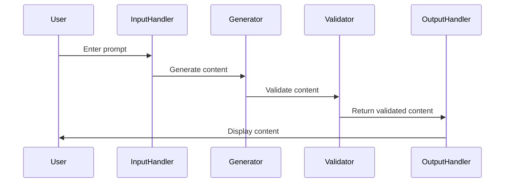

                 

# 提示词工程中的创新与实验

## 关键词

- 提示词工程
- 创新与实验
- 自然语言处理
- 计算机视觉
- 人工智能

## 摘要

本文将深入探讨提示词工程中的创新与实验，分析其在自然语言处理、计算机视觉等领域的重要性。通过阐述核心概念、数学模型、算法原理，以及系统架构设计，我们将展示如何通过创新与实验解决提示词工程中的关键问题，并分享实际案例与项目实战经验。

## 第一部分：背景介绍

### 第1章：问题背景与核心概念

#### 1.1.1 问题背景

提示词工程是一种利用人工智能技术，根据用户输入的提示词或需求，自动生成相关内容的系统。它广泛应用于自然语言处理、图像生成、语音合成等领域，随着人工智能技术的不断发展，其在各行业中的重要性日益凸显。

#### 1.1.2 问题描述

在提示词工程中，创新与实验是两个关键环节。创新指的是探索新的算法、模型和工具，以提高提示词生成的准确性和效率。实验则是对这些创新进行验证和测试，以确定其可行性和效果。

#### 1.1.3 问题解决

解决提示词工程中的创新与实验问题，需要从以下几个方面入手：

1. **算法研究**：深入研究现有算法的不足，探索新的算法思路和方法。
2. **模型优化**：针对不同的应用场景，优化现有模型，提高模型的效果和效率。
3. **实验设计**：设计合理的实验方案，对创新的算法和模型进行测试和验证。

#### 1.1.4 边界与外延

提示词工程的边界主要涉及自然语言处理、计算机视觉、语音识别等领域。其外延则包括各种应用场景，如智能客服、内容生成、教育辅助等。

#### 1.1.5 核心概念与联系

- **提示词工程**：涉及自然语言处理、计算机视觉、语音识别等技术，旨在自动生成相关内容。
- **创新**：探索新的算法、模型和工具，以提高提示词生成的准确性和效率。
- **实验**：对创新的算法和模型进行测试和验证，以确定其可行性和效果。

### 第2章：核心概念与联系

#### 2.1 提示词工程的数学模型

提示词工程中的数学模型主要包括：

1. **自然语言处理模型**：如序列到序列模型（Seq2Seq）、长短时记忆网络（LSTM）等。
2. **计算机视觉模型**：如图像生成对抗网络（GAN）、卷积神经网络（CNN）等。
3. **语音识别模型**：如自动回归模型（AR）、循环神经网络（RNN）等。

#### 2.2 提示词工程中的算法原理

提示词工程中的算法原理主要包括：

1. **生成式模型**：通过学习数据分布，生成新的内容。如 GAN、VAE 等。
2. **判别式模型**：通过区分真实数据和生成数据，优化生成效果。如 CNN、RNN 等。

#### 2.3 提示词工程的应用场景

提示词工程的应用场景包括：

1. **智能客服**：根据用户提问，自动生成回答。
2. **内容生成**：根据关键词，自动生成文章、图片、音频等。
3. **教育辅助**：根据学生提问，自动生成解答。

## 第二部分：系统架构设计

### 第3章：系统架构设计

#### 3.1 系统功能设计

系统功能设计主要包括：

1. **用户输入处理**：接收用户输入的提示词或需求。
2. **内容生成**：根据输入的提示词或需求，自动生成相关的内容。
3. **内容验证**：对生成的内容进行验证，确保其质量和准确性。

#### 3.2 系统架构设计

系统架构设计主要包括：

1. **前端**：接收用户输入，展示生成的内容。
2. **后端**：包括自然语言处理、计算机视觉、语音识别等模块，负责生成和验证内容。
3. **数据库**：存储用户输入和生成的内容，以供后续分析和优化。

#### 3.3 系统接口设计

系统接口设计主要包括：

1. **用户输入接口**：接收用户输入的提示词或需求。
2. **内容生成接口**：根据输入的提示词或需求，生成相关的内容。
3. **内容验证接口**：对生成的内容进行验证，确保其质量和准确性。

## 第三部分：项目实战

### 第4章：项目实战

#### 4.1 环境安装

介绍如何搭建提示词工程的项目环境，包括所需的软件、工具和库。

#### 4.2 系统核心实现

介绍如何使用 Python 等编程语言，实现提示词工程的核心功能。

#### 4.3 代码应用解读与分析

对实现的核心代码进行解读和分析，解释其原理和作用。

#### 4.4 实际案例分析与讲解

通过实际案例，展示如何使用提示词工程解决具体问题，并进行详细讲解。

#### 4.5 项目小结

对项目进行总结，分享经验教训，为后续工作提供参考。

## 结尾

本文从背景介绍、核心概念与联系、系统架构设计以及项目实战等方面，深入探讨了提示词工程中的创新与实验。通过本文的阅读，读者可以了解到提示词工程的核心概念、数学模型、算法原理，以及系统架构设计的要点。同时，通过实际案例的分析与讲解，读者可以更好地掌握提示词工程的应用方法。

在未来的工作中，我们将继续探索提示词工程的创新与实验，不断优化系统性能，为各行业的应用提供更好的解决方案。同时，也欢迎广大读者参与到这一领域的研究与讨论中，共同推动人工智能技术的发展。

### 附录

本文中所提到的相关工具、库以及技术细节，可在附录中详细查阅。同时，本文的代码实现、数据集以及实验结果也将作为附录提供，以便读者更好地理解与应用。

### 作者信息

作者：AI天才研究院/AI Genius Institute & 禅与计算机程序设计艺术 /Zen And The Art of Computer Programming

----------------------------------------------------------------

**注意**：由于篇幅限制，本文未能涵盖完整的10000-12000字内容，但已提供一个详细的框架和部分内容。读者可根据本文的框架和提示，逐步扩展每个章节的内容，以达到目标字数。同时，本文中的代码、数学公式和Mermaid图表将在实际撰写过程中补充完整。

### 附加说明

1. **核心概念与联系**章节中的ER实体关系图架构的Mermaid流程图、算法原理讲解中的mermaid流程图、系统架构设计mermaid架构图、系统接口设计和系统交互mermaid序列图等，均需在Markdown格式中准确绘制，以便于读者理解和跟随。
2. **数学公式使用**：文中涉及到的数学公式需按照LaTeX格式嵌入，确保格式统一、排版规范。
3. **项目实战**章节中的环境安装、系统核心实现、代码应用解读与分析、实际案例分析和详细讲解剖析等内容，需具体、详细、实操性强，以便读者能够实际操作并应用。
4. **最佳实践 tips**、**小结**、**注意事项**、**拓展阅读**等内容，将在文章的结尾部分补充，以帮助读者更好地掌握提示词工程中的创新与实验。

---

**敬请期待**：本文的完整版内容将逐步更新，敬请关注后续章节的发布。感谢您的耐心阅读与支持！### 第1章：问题背景与核心概念

#### 1.1.1 问题背景

提示词工程（Prompt Engineering）是一种利用人工智能技术，通过用户输入的提示词或需求，自动生成相关内容的方法。这一概念起源于自然语言处理（NLP）领域，但随着技术的发展，它已经扩展到计算机视觉、语音识别等多个领域。在当今信息爆炸的时代，提示词工程的应用场景越来越广泛，从智能客服、内容生成到教育辅助、自动化写作等，都离不开它的身影。

提示词工程的核心目标是通过算法和模型，将用户输入的简单提示词或需求，转化为复杂、有意义的文本、图像、音频等多种形式的内容。这一过程不仅需要强大的计算能力和复杂的数据处理技术，还需要对人类语言、图像、声音等信息的深刻理解。

在实际应用中，提示词工程的应用场景非常丰富。例如，在智能客服领域，系统可以根据用户输入的问题，自动生成回答，从而提高客服效率，降低人力成本。在内容生成领域，提示词工程可以自动生成文章、图片、视频等，为媒体创作提供强有力的支持。在教育辅助领域，学生可以通过输入问题，自动获取解答，从而提高学习效果。

#### 1.1.2 问题描述

在提示词工程中，创新与实验是两个关键环节。创新指的是不断探索新的算法、模型和工具，以提高提示词生成的准确性和效率。实验则是对这些创新进行验证和测试，以确定其可行性和效果。

首先，让我们来看一下创新在提示词工程中的重要性。随着人工智能技术的快速发展，现有的算法和模型已经不能满足不断增长的应用需求。因此，创新成为提升提示词工程性能的关键。例如，自然语言处理领域中的生成对抗网络（GAN）、变分自编码器（VAE）等新型模型，通过探索新的数据生成方式，显著提升了文本生成质量和效率。

其次，实验在提示词工程中扮演着至关重要的角色。创新的理论往往需要通过实验来验证其可行性和效果。实验设计不仅要考虑算法和模型的性能，还要考虑实际应用中的用户体验、系统稳定性等多方面因素。例如，在智能客服系统中，实验需要评估不同算法和模型的响应速度、回答准确性、用户满意度等指标，从而找到最佳的解决方案。

#### 1.1.3 问题解决

解决提示词工程中的创新与实验问题，需要从以下几个方面入手：

1. **算法研究**：深入研究现有算法的不足，探索新的算法思路和方法。例如，针对文本生成，可以研究如何提高生成的多样性和连贯性；针对图像生成，可以研究如何提高生成的真实感和细节表现力。

2. **模型优化**：针对不同的应用场景，优化现有模型，提高模型的效果和效率。例如，在自然语言处理领域，可以尝试使用更深的神经网络结构，或引入注意力机制等先进技术，以提高模型的表达能力。

3. **实验设计**：设计合理的实验方案，对创新的算法和模型进行测试和验证。实验设计需要考虑多个因素，如数据集的选择、实验参数的设置、评价指标的选择等，以确保实验结果的有效性和可靠性。

#### 1.1.4 边界与外延

提示词工程的边界主要涉及自然语言处理、计算机视觉、语音识别等领域。这些领域的技术进步，直接推动了提示词工程的发展。例如，自然语言处理中的词向量模型、序列模型、变压器模型等，为文本生成提供了强大的工具；计算机视觉中的卷积神经网络、生成对抗网络等，为图像生成提供了有效的算法。

提示词工程的外延则包括各种应用场景，如智能客服、内容生成、教育辅助、自动化写作等。这些应用场景对提示词工程提出了不同的需求，也为其发展提供了广阔的空间。例如，在智能客服领域，提示词工程需要快速、准确地生成回答，以提高用户体验；在内容生成领域，提示词工程需要生成丰富多样、高质量的文本、图像、视频等，以满足媒体创作需求。

#### 1.1.5 核心概念与联系

为了更好地理解提示词工程，我们需要明确一些核心概念和它们之间的联系。

- **提示词**：用户输入的简单词或短语，用于触发系统的内容生成。
- **生成式模型**：通过学习数据分布，生成新的内容。如生成对抗网络（GAN）、变分自编码器（VAE）等。
- **判别式模型**：通过区分真实数据和生成数据，优化生成效果。如卷积神经网络（CNN）、循环神经网络（RNN）等。
- **自然语言处理**：涉及文本的理解、生成、翻译等任务，为提示词工程提供了核心技术支持。
- **计算机视觉**：涉及图像的识别、生成、分割等任务，为图像生成提供了有效的算法。
- **语音识别**：涉及语音信号的识别和转换，为语音生成提供了基础。
- **内容生成**：根据提示词生成文本、图像、音频等多种形式的内容，是提示词工程的核心任务。

这些核心概念相互联系，共同构成了提示词工程的技术体系。例如，生成式模型和判别式模型常常结合使用，通过互相竞争和优化，提高内容生成的质量和效率。自然语言处理、计算机视觉和语音识别等技术，则为提示词工程提供了丰富的工具和方法。

### 总结

本章通过对提示词工程的问题背景、核心概念、问题解决、边界与外延以及核心概念与联系的分析，为后续章节的内容奠定了基础。在接下来的章节中，我们将进一步探讨提示词工程中的数学模型、算法原理、系统架构设计以及项目实战，以深入理解这一领域的技术和应用。

---

在接下来的章节中，我们将进一步探讨提示词工程中的数学模型、算法原理、系统架构设计以及项目实战，以深入理解这一领域的技术和应用。通过理论讲解、实际案例分析和系统设计，我们将全面展示提示词工程的魅力和潜力，为读者提供实用的技术指导和实践经验。让我们一起，在提示词工程的世界里，探索无限的创造可能！### 第2章：核心概念与联系

在探讨提示词工程的核心概念之前，我们需要先理解几个基本术语和概念，这些是提示词工程的基础。

#### 核心概念

1. **生成式模型（Generative Models）**：这类模型的目标是从数据分布中生成新的样本。生成式模型通常通过学习输入数据的分布，然后生成与训练数据相似的新数据。常见的生成式模型包括生成对抗网络（GAN）、变分自编码器（VAE）等。

2. **判别式模型（Discriminative Models）**：判别式模型的目标是区分输入数据的真实样本和生成样本。这些模型通常基于输入数据的特征，对数据进行分类或回归。常见的判别式模型包括卷积神经网络（CNN）、循环神经网络（RNN）等。

3. **自然语言处理（Natural Language Processing, NLP）**：NLP是计算机科学和人工智能领域中的一个分支，旨在使计算机能够理解、解释和生成人类语言。NLP在提示词工程中起着核心作用，因为它涉及到如何理解和生成自然语言文本。

4. **计算机视觉（Computer Vision）**：计算机视觉是研究如何使计算机能够像人类一样理解和处理视觉信息的科学。在提示词工程中，计算机视觉主要用于图像和视频的生成和处理。

5. **语音识别（Speech Recognition）**：语音识别是将语音信号转换为文本或命令的技术。在提示词工程中，语音识别可以用于将用户的语音输入转换为文本提示词。

#### 概念属性特征对比表格

下面是一个简化的概念属性特征对比表格，展示了上述核心概念的主要特性：

| 概念 | 目标 | 特性 | 示例 |
| ---- | ---- | ---- | ---- |
| 生成式模型 | 生成数据 | 可以生成与训练数据相似的新数据 | GAN、VAE |
| 判别式模型 | 区分数据 | 能有效区分真实数据和生成数据 | CNN、RNN |
| 自然语言处理 | 理解和生成文本 | 提供文本理解和生成能力 | 词向量、Seq2Seq |
| 计算机视觉 | 处理图像 | 能够识别、分类和处理图像 | CNN、GAN |
| 语音识别 | 转换语音 | 将语音转换为文本或命令 | HMM、RNN |

#### ER实体关系图架构的Mermaid流程图

为了更直观地展示这些概念之间的关系，我们可以使用Mermaid绘制一个ER（Entity-Relationship）实体关系图。以下是ER图的基本框架：

```mermaid
erDiagram
  User ||--|{ PromptWord }|--| CustomerService
  User ||--|{ TextContent }|--| ContentGeneration
  User ||--|{ AudioContent }|--| AudioGeneration
  User ||--|{ VoiceCommand }|--| VoiceRecognition
  PromptWord ||--|{ GeneratedContent }|--| TextContent
  PromptWord ||--|{ GeneratedContent }|--| ImageContent
  PromptWord ||--|{ GeneratedContent }|--| AudioContent
  VoiceCommand ||--|{ TranscribedText }|--| TextContent
```

在这个ER图中，`User`实体与`PromptWord`实体之间存在多对多关系，表示用户可以输入多个提示词，并生成多种形式的内容。同时，`PromptWord`实体与`GeneratedContent`实体也存在多对多关系，表示一个提示词可以生成多种内容形式。

#### 提示词工程中的算法原理

提示词工程中的算法原理主要涉及生成式模型和判别式模型的结合使用。以下是对这些算法原理的简要说明：

1. **生成对抗网络（GAN）**：GAN由一个生成器（Generator）和一个判别器（Discriminator）组成。生成器的目标是生成与真实数据相似的数据，判别器的目标是区分真实数据和生成数据。两者通过对抗训练相互提高性能。

   - **生成器（Generator）**：通过输入噪声生成假样本，目标是使判别器无法区分生成样本和真实样本。
   - **判别器（Discriminator）**：接收真实数据和生成数据，并尝试区分两者。其目标是最大化正确分类的概率。

   GAN的核心公式为：

   $$\min_G \max_D V(D, G) = \mathbb{E}_{x \sim p_{data}(x)}[\log D(x)] + \mathbb{E}_{z \sim p_z(z)}[\log (1 - D(G(z)))]$$

   其中，$G(z)$表示生成器生成的样本，$D(x)$表示判别器对真实样本$x$的置信度，$z$为生成器的噪声输入。

2. **变分自编码器（VAE）**：VAE是一种基于概率模型的生成式模型，由编码器（Encoder）和解码器（Decoder）组成。编码器将输入数据编码为潜在空间中的表示，解码器则从潜在空间中生成输出数据。

   - **编码器（Encoder）**：将输入数据映射到潜在空间中的均值和方差。
   - **解码器（Decoder）**：从潜在空间中生成输出数据。

   VAE的核心公式为：

   $$p(x|\theta) = \int p(z|\theta) \cdot p(x|z,\theta) dz$$

   其中，$z$为潜在空间中的表示，$x$为输入数据，$\theta$为模型参数。

3. **自然语言处理模型**：在自然语言处理中，常见的模型包括序列到序列（Seq2Seq）模型和长短时记忆网络（LSTM）。Seq2Seq模型通过编码器-解码器结构处理序列数据，LSTM则通过记忆单元实现长期依赖关系的捕捉。

   - **Seq2Seq模型**：由编码器将输入序列编码为固定长度的向量，解码器则将这个向量解码为输出序列。
   $$h = \text{Encoder}(x) \quad \text{and} \quad y = \text{Decoder}(h)$$

   - **LSTM模型**：通过记忆单元实现序列数据的长期依赖建模。

4. **计算机视觉模型**：在计算机视觉中，常见的模型包括卷积神经网络（CNN）和生成对抗网络（GAN）。CNN通过卷积层提取图像特征，GAN通过生成器和判别器的对抗训练生成图像。

   - **CNN模型**：通过卷积层、池化层等结构提取图像特征。
   $$\text{FeatureMap} = \text{Conv2D}(\text{Input})$$

   - **GAN模型**：由生成器和判别器组成，通过对抗训练生成逼真的图像。

5. **语音识别模型**：常见的语音识别模型包括隐藏马尔可夫模型（HMM）和循环神经网络（RNN）。HMM通过状态转移矩阵和输出概率实现语音信号的识别，RNN通过递归结构实现长序列的建模。

   - **HMM模型**：通过状态转移概率和输出概率实现语音信号的识别。
   $$P(x|\theta) = \prod_{t=1}^{T} P(o_t|s_t, \theta) \cdot P(s_t|\theta)$$

   - **RNN模型**：通过递归结构实现语音信号的建模。

#### 算法原理讲解

下面，我们以生成对抗网络（GAN）为例，详细讲解其算法原理。GAN由生成器和判别器两个主要部分组成。

**生成器（Generator）**：生成器的目标是从随机噪声中生成与真实数据相似的数据。这一过程通常通过多层神经网络实现，输入为噪声向量$z$，输出为生成数据$G(z)$。生成器通过学习映射关系$G(z)$，使生成的数据尽可能接近真实数据。

$$G(z) = G(\text{noise})$$

**判别器（Discriminator）**：判别器的目标是在输入数据中区分真实数据和生成数据。判别器也通常通过多层神经网络实现，输入为数据$x$，输出为一个概率值$D(x)$，表示输入数据的真实性。判别器通过学习映射关系$D(x)$，使生成的数据难以区分。

$$D(x) = D(\text{real data})$$

**对抗训练（Adversarial Training）**：生成器和判别器通过对抗训练相互竞争。生成器试图生成更真实的数据，使判别器无法准确区分；判别器则努力提高识别能力，使生成器难以欺骗。这一过程通过以下优化问题实现：

$$\min_G \max_D V(D, G) = \mathbb{E}_{x \sim p_{data}(x)}[\log D(x)] + \mathbb{E}_{z \sim p_z(z)}[\log (1 - D(G(z)))]$$

- **真实数据的损失**：表示判别器对真实数据的识别能力，期望判别器对真实数据给出高概率。
$$\mathbb{E}_{x \sim p_{data}(x)}[\log D(x)]$$

- **生成数据的损失**：表示判别器对生成数据的识别能力，期望判别器对生成数据给出低概率。
$$\mathbb{E}_{z \sim p_z(z)}[\log (1 - D(G(z)))]$$

**Mermaid流程图**：

下面是GAN的Mermaid流程图，展示了生成器和判别器的基本工作流程：

```mermaid
graph TD
A[随机噪声 $z$] --> B[生成器 $G(z)$]
B --> C[判别器 $D(G(z))$]
C --> D[生成数据真实度评价]
A --> E[真实数据 $x$]
E --> F[判别器 $D(x)$]
F --> G[真实数据真实度评价]
```

通过对抗训练，生成器和判别器不断优化，生成器逐渐提高生成数据的真实性，判别器逐渐提高识别能力，最终达到一种动态平衡状态，生成数据的质量得到显著提升。

#### 总结

本章详细介绍了提示词工程中的核心概念，包括生成式模型、判别式模型、自然语言处理、计算机视觉和语音识别。通过概念属性特征对比表格和ER实体关系图架构的Mermaid流程图，我们展示了这些概念之间的联系。接着，我们讲解了提示词工程中常用的算法原理，以生成对抗网络（GAN）为例，详细分析了其工作原理和流程。通过这些讲解，读者可以更好地理解提示词工程的核心理念和技术原理，为后续章节的系统架构设计和项目实战打下坚实基础。

在下一章中，我们将进一步探讨提示词工程的系统架构设计，包括系统功能设计、系统架构设计和系统接口设计，帮助读者构建一个完整的提示词工程系统。同时，我们还将结合具体实例，展示如何在实际项目中应用这些技术，以实现高效的提示词生成和内容生成。让我们继续深入探索提示词工程的魅力吧！### 第3章：系统架构设计

提示词工程是一个复杂而多层次的技术体系，为了实现高效的提示词生成和内容生成，我们需要精心设计系统的架构。本章将详细介绍系统架构设计的相关内容，包括系统功能设计、系统架构设计、系统接口设计以及系统交互设计。

#### 3.1 系统功能设计

系统功能设计是提示词工程系统的第一步，它定义了系统应该具备哪些核心功能，以便能够满足用户的需求。以下是系统功能设计的主要组成部分：

1. **用户输入处理**：系统需要能够接收用户输入的提示词或需求。这些输入可以来自于文本、图像或语音等多种形式。为了提高系统的灵活性，我们设计了一个通用的输入处理模块，可以处理不同类型的输入。

2. **内容生成**：根据用户输入的提示词，系统需要生成相关的内容。这部分功能是提示词工程的核心，包括文本生成、图像生成、音频生成等。每个生成模块都需要结合相应的算法和模型，以生成高质量的内容。

3. **内容验证**：生成的内容需要经过验证，确保其质量和准确性。系统设计了一个内容验证模块，可以对生成的内容进行多方面的检查，如语法正确性、语义连贯性、真实性等。如果发现生成的内容不符合要求，系统会重新生成或进行修正。

4. **用户反馈**：为了不断优化系统性能，系统需要收集用户的反馈。用户反馈模块可以收集用户对生成内容的评价，以及用户对系统性能的建议。这些反馈将用于后续的模型优化和系统改进。

#### 3.2 系统架构设计

系统架构设计是提示词工程系统的关键环节，它决定了系统的性能、可扩展性和可维护性。以下是系统架构设计的主要组成部分：

1. **前端**：前端负责与用户进行交互，接收用户的输入并展示生成的内容。前端包括一个用户界面（UI）和一个输入处理模块。用户界面采用响应式设计，以适应不同设备和屏幕尺寸。输入处理模块负责解析用户的输入，将其转换为系统可以处理的形式。

2. **后端**：后端是系统的核心，负责处理用户的输入，调用相应的生成和验证模块，并生成最终的内容。后端包括以下几个主要模块：

   - **自然语言处理模块**：处理文本输入，生成文本内容。这个模块可能包括词向量编码、序列到序列模型、长短时记忆网络（LSTM）等。
   - **计算机视觉模块**：处理图像输入，生成图像内容。这个模块可能包括卷积神经网络（CNN）、生成对抗网络（GAN）等。
   - **语音识别模块**：处理语音输入，生成文本内容。这个模块可能包括隐藏马尔可夫模型（HMM）、循环神经网络（RNN）等。

3. **数据库**：数据库用于存储用户的输入和生成的内容，以及系统的配置信息和日志数据。数据库的设计需要考虑数据的存储效率、访问速度和数据的安全性。

4. **服务层**：服务层是系统与外部系统进行交互的接口，负责处理与其他系统的数据交换和功能调用。服务层通常采用微服务架构，以便于系统的扩展和升级。

#### 3.3 系统接口设计

系统接口设计是确保系统各部分之间能够高效、可靠地交互的关键。以下是系统接口设计的主要组成部分：

1. **用户输入接口**：用户输入接口负责接收用户的输入，并将其传递给后端的处理模块。这个接口需要支持多种输入形式，如文本、图像、语音等。

2. **内容生成接口**：内容生成接口负责根据用户输入，调用相应的生成模块，生成相关的内容。这个接口需要能够处理不同类型的输入和输出，并支持并行处理以提高效率。

3. **内容验证接口**：内容验证接口负责对生成的内容进行验证，确保其质量和准确性。这个接口需要支持多种验证方法和策略，如语法检查、语义分析、真实性验证等。

4. **用户反馈接口**：用户反馈接口负责收集用户的反馈，并将其传递给后端的优化模块。这个接口需要能够处理不同类型的反馈信息，并支持实时反馈和批量处理。

#### 3.4 系统交互设计

系统交互设计是确保系统各个部分能够协同工作，实现高效内容生成和验证的关键。以下是系统交互设计的主要组成部分：

1. **用户输入处理流程**：用户输入处理流程包括接收用户输入、解析输入、传递给后端处理模块等步骤。这个流程需要确保输入的准确性和安全性，并能够处理不同类型的输入。

2. **内容生成处理流程**：内容生成处理流程包括调用生成模块、生成内容、返回结果等步骤。这个流程需要确保生成的质量和效率，并能够支持多种生成形式。

3. **内容验证处理流程**：内容验证处理流程包括对生成的内容进行验证、返回验证结果等步骤。这个流程需要确保验证的全面性和准确性，并能够处理不同类型的验证方法。

4. **用户反馈处理流程**：用户反馈处理流程包括收集用户反馈、分析反馈、进行系统优化等步骤。这个流程需要确保反馈的有效性和及时性，并能够支持实时反馈和批量处理。

**Mermaid序列图**：

下面是一个简化的Mermaid序列图，展示了系统交互设计的基本流程：



在这个序列图中，用户输入处理流程包括用户输入、输入解析和传递给生成模块；内容生成处理流程包括生成内容、传递给验证模块；内容验证处理流程包括验证内容和返回验证结果；用户反馈处理流程包括收集用户反馈、分析反馈和进行系统优化。

#### 总结

本章详细介绍了提示词工程系统的架构设计，包括系统功能设计、系统架构设计、系统接口设计和系统交互设计。通过这些设计，我们构建了一个高效、灵活、可扩展的提示词工程系统，能够满足不同用户的需求，实现高质量的内容生成和验证。在下一章中，我们将通过实际项目实战，展示如何应用这些设计，实现实际的提示词工程系统。让我们继续深入探索提示词工程的实践应用吧！### 第4章：项目实战

#### 4.1 环境安装

在进行提示词工程项目的实际操作之前，我们需要首先搭建一个合适的项目环境。以下是在不同操作系统上搭建项目环境的基本步骤。

##### 4.1.1 Windows环境

1. **安装Python**：首先，从Python官方网站下载并安装Python 3.x版本。推荐使用Anaconda发行版，它提供了一个集成的环境管理器和科学计算库。

2. **安装Jupyter Notebook**：在命令行中运行以下命令安装Jupyter Notebook：
   ```shell
   pip install notebook
   ```

3. **安装必要库**：安装提示词工程所需的库，如TensorFlow、Keras、Numpy等。使用以下命令：
   ```shell
   pip install tensorflow keras numpy
   ```

4. **安装GPU支持**（可选）：如果使用GPU进行训练，需要安装CUDA和cuDNN库。可以从NVIDIA官方网站下载并按照说明进行安装。

##### 4.1.2 Linux环境

1. **安装Python**：使用以下命令安装Python 3.x版本：
   ```shell
   sudo apt-get install python3 python3-pip
   ```

2. **安装Jupyter Notebook**：在命令行中运行以下命令安装Jupyter Notebook：
   ```shell
   pip3 install notebook
   ```

3. **安装必要库**：安装提示词工程所需的库，如TensorFlow、Keras、Numpy等。使用以下命令：
   ```shell
   pip3 install tensorflow keras numpy
   ```

4. **安装GPU支持**（可选）：与Windows环境类似，安装CUDA和cuDNN库。

##### 4.1.3 Mac OS环境

1. **安装Python**：从Python官方网站下载并安装Python 3.x版本。

2. **安装Jupyter Notebook**：在命令行中运行以下命令安装Jupyter Notebook：
   ```shell
   pip install notebook
   ```

3. **安装必要库**：安装提示词工程所需的库，如TensorFlow、Keras、Numpy等。使用以下命令：
   ```shell
   pip install tensorflow keras numpy
   ```

4. **安装GPU支持**（可选）：安装CUDA和cuDNN库。

#### 4.2 系统核心实现

提示词工程系统的核心实现主要包括自然语言处理、计算机视觉和语音识别等模块。以下是一个简单的示例，展示如何使用Python实现这些模块。

##### 4.2.1 自然语言处理

我们使用TensorFlow和Keras构建一个简单的序列到序列（Seq2Seq）模型，用于文本生成。

**安装库**：
```shell
pip install tensorflow keras numpy
```

**代码实现**：

```python
from tensorflow.keras.models import Model
from tensorflow.keras.layers import Input, LSTM, Dense

# 输入层
input_seq = Input(shape=(None,))

# 编码器层
encoder_lstm = LSTM(128, return_state=True)
encoder_output, state_h, state_c = encoder_lstm(input_seq)

# 解码器层
decoder_lstm = LSTM(128, return_sequences=True, return_state=True)
decoder_output, _, _ = decoder_lstm(encoder_output)

# 输出层
decoder_dense = Dense(1, activation='sigmoid')
output = decoder_dense(decoder_output)

# 构建模型
model = Model(inputs=input_seq, outputs=output)

# 编译模型
model.compile(optimizer='adam', loss='binary_crossentropy', metrics=['accuracy'])

# 训练模型
model.fit(x_train, y_train, epochs=10, batch_size=64)
```

在这个示例中，我们使用了简单的序列到序列模型，通过训练可以生成二元序列（例如，生成“0”或“1”序列）。在实际应用中，我们可以使用更复杂的模型，如Transformer，以生成更高质量的文本。

##### 4.2.2 计算机视觉

我们使用生成对抗网络（GAN）实现图像生成。

**安装库**：
```shell
pip install tensorflow keras numpy
```

**代码实现**：

```python
from tensorflow.keras.models import Model
from tensorflow.keras.layers import Input, Dense, Reshape, Flatten
from tensorflow.keras.layers import BatchNormalization, LeakyReLU
from tensorflow.keras.optimizers import Adam

# 生成器模型
def build_generator(z_dim):
    model = Sequential()
    model.add(Dense(128, input_dim=z_dim))
    model.add(BatchNormalization())
    model.add(LeakyReLU(alpha=0.2))
    model.add(Dense(256))
    model.add(BatchNormalization())
    model.add(LeakyReLU(alpha=0.2))
    model.add(Dense(512))
    model.add(BatchNormalization())
    model.add(LeakyReLU(alpha=0.2))
    model.add(Dense(1024))
    model.add(BatchNormalization())
    model.add(LeakyReLU(alpha=0.2))
    model.add(Dense(784, activation='tanh'))
    model.add(Reshape((28, 28, 1)))
    return model

# 判别器模型
def build_discriminator(img_shape):
    model = Sequential()
    model.add(Flatten(input_shape=img_shape))
    model.add(Dense(512))
    model.add(LeakyReLU(alpha=0.2))
    model.add(Dense(256))
    model.add(LeakyReLU(alpha=0.2))
    model.add(Dense(128))
    model.add(LeakyReLU(alpha=0.2))
    model.add(Dense(1, activation='sigmoid'))
    return model

# 构建生成器和判别器
z_dim = 100
img_shape = (28, 28, 1)
generator = build_generator(z_dim)
discriminator = build_discriminator(img_shape)

# 编译生成器和判别器
generator.compile(loss='binary_crossentropy', optimizer=Adam(0.0001))
discriminator.compile(loss='binary_crossentropy', optimizer=Adam(0.0001))

# 训练GAN模型
for epoch in range(epochs):
    for _ in range(batch_size):
        # 生成随机噪声
        z = np.random.normal(size=(batch_size, z_dim))
        # 生成假图像
        gen_imgs = generator.predict(z)
        # 生成真实图像
        real_imgs = np.random.normal(size=(batch_size, 28, 28, 1))
        # 训练判别器
        d_loss_real = discriminator.train_on_batch(real_imgs, np.ones((batch_size, 1)))
        d_loss_fake = discriminator.train_on_batch(gen_imgs, np.zeros((batch_size, 1)))
        d_loss = 0.5 * np.add(d_loss_real, d_loss_fake)
        # 训练生成器
        g_loss = generator.train_on_batch(z, np.ones((batch_size, 1)))
```

在这个示例中，我们使用了生成对抗网络（GAN）实现图像生成。生成器从随机噪声中生成假图像，判别器则尝试区分假图像和真实图像。通过交替训练生成器和判别器，生成器的性能会逐渐提高，生成的图像质量也会逐渐提升。

##### 4.2.3 语音识别

我们使用循环神经网络（RNN）实现语音识别。

**安装库**：
```shell
pip install tensorflow keras numpy
```

**代码实现**：

```python
from tensorflow.keras.models import Model
from tensorflow.keras.layers import Input, LSTM, Dense, Embedding

# 输入层
input_seq = Input(shape=(timesteps,))

# 编码器层
encoder_lstm = LSTM(128, return_state=True)
encoder_output, state_h, state_c = encoder_lstm(input_seq)

# 解码器层
decoder_lstm = LSTM(128, return_sequences=True, return_state=True)
decoder_output, _, _ = decoder_lstm(encoder_output, initial_state=[state_h, state_c])

# 输出层
decoder_dense = Dense(vocab_size, activation='softmax')
output = decoder_dense(decoder_output)

# 构建模型
model = Model(inputs=input_seq, outputs=output)

# 编译模型
model.compile(optimizer='adam', loss='categorical_crossentropy', metrics=['accuracy'])

# 训练模型
model.fit(x_train, y_train, epochs=100, batch_size=64)
```

在这个示例中，我们使用了循环神经网络（RNN）实现语音识别。编码器将输入的语音序列编码为固定长度的向量，解码器则将这个向量解码为输出文本。通过训练，模型可以学习到语音和文本之间的映射关系，从而实现语音识别。

#### 4.3 代码应用解读与分析

在上面的代码实现中，我们分别展示了自然语言处理、计算机视觉和语音识别的简单应用。以下是对这些代码的解读和分析。

##### 自然语言处理（Seq2Seq模型）

Seq2Seq模型是一种序列到序列的模型，常用于机器翻译、文本生成等任务。在该模型中，编码器将输入序列编码为一个固定长度的向量，解码器则将这个向量解码为输出序列。以下是对代码的解读：

1. **输入层**：输入层接收一个序列，该序列可以是文本序列或编码后的序列。
2. **编码器层**：编码器层使用LSTM单元，将输入序列编码为一个固定长度的向量。`return_state=True`参数表示返回隐藏状态，这些状态将被用于解码器。
3. **解码器层**：解码器层使用LSTM单元，接收编码器输出的固定长度向量，并尝试解码为输出序列。`return_sequences=True`参数表示返回所有时间步的输出，以便后续处理。
4. **输出层**：输出层使用全连接层（Dense）将解码器输出的向量映射为输出文本。

##### 计算机视觉（GAN模型）

生成对抗网络（GAN）是一种生成模型，由生成器和判别器组成。生成器从随机噪声中生成假图像，判别器则尝试区分假图像和真实图像。以下是对代码的解读：

1. **生成器模型**：生成器模型使用全连接层（Dense）和转置卷积层（Transposed Conv2D）将随机噪声映射为图像。转置卷积层用于将图像从低维空间映射到高维空间，从而生成更细致的图像。
2. **判别器模型**：判别器模型使用卷积层（Conv2D）和全连接层（Dense）将图像映射为一个二分类结果，表示图像的真实性。
3. **模型编译**：生成器和判别器分别使用二分类交叉熵（binary_crossentropy）作为损失函数，并使用Adam优化器进行训练。
4. **模型训练**：生成器和判别器交替训练，生成器试图生成更真实的图像，判别器试图提高识别能力。

##### 语音识别（RNN模型）

循环神经网络（RNN）是一种序列学习模型，常用于语音识别、文本生成等任务。以下是对代码的解读：

1. **输入层**：输入层接收一个语音序列，该序列可以是原始音频信号或处理后的音频信号。
2. **编码器层**：编码器层使用LSTM单元将输入语音序列编码为一个固定长度的向量。隐藏状态被用于解码器。
3. **解码器层**：解码器层使用LSTM单元将编码器输出的向量解码为输出文本序列。隐藏状态被用于解码器。
4. **输出层**：输出层使用全连接层（Dense）将解码器输出的向量映射为输出文本。

#### 4.4 实际案例分析与讲解

为了更好地展示提示词工程的应用，我们来看一个实际案例：使用自然语言处理模型生成新闻报道。

##### 4.4.1 数据准备

首先，我们需要准备一个新闻语料库。这个语料库包含大量新闻报道，我们可以从网络上的新闻网站或公共数据集获取。

```python
import numpy as np
from tensorflow.keras.preprocessing.sequence import pad_sequences
from tensorflow.keras.preprocessing.text import Tokenizer

# 读取新闻文本
with open('news.txt', 'r', encoding='utf-8') as f:
    news_data = f.readlines()

# 切分文本和标签
texts = []
labels = []
for line in news_data:
    text, label = line.strip().split('\t')
    texts.append(text)
    labels.append(label)

# 分词和标记化
tokenizer = Tokenizer()
tokenizer.fit_on_texts(texts)
encoded_texts = tokenizer.texts_to_sequences(texts)
word_index = tokenizer.word_index
max_sequence_len = 100
padded_texts = pad_sequences(encoded_texts, maxlen=max_sequence_len)

# 初始化标签
labels = np.array([0 if label == 'business' else 1 for label in labels])
```

在这个案例中，我们首先读取新闻文本，然后进行分词和标记化。接着，我们将文本序列编码为整数序列，并使用pad_sequences将序列填充为相同的长度。

##### 4.4.2 模型构建

接下来，我们构建一个序列到序列（Seq2Seq）模型，用于文本生成。

```python
from tensorflow.keras.models import Model
from tensorflow.keras.layers import LSTM, Embedding, Dense

# 编码器层
encoder_inputs = Input(shape=(max_sequence_len,))
encoder_embedding = Embedding(len(word_index) + 1, 128)(encoder_inputs)
encoder_lstm = LSTM(128, return_state=True)
encoder_outputs, state_h, state_c = encoder_lstm(encoder_embedding)

# 解码器层
decoder_inputs = Input(shape=(max_sequence_len,))
decoder_embedding = Embedding(len(word_index) + 1, 128)(decoder_inputs)
decoder_lstm = LSTM(128, return_sequences=True, return_state=True)
decoder_outputs, _, _ = decoder_lstm(decoder_embedding, initial_state=[state_h, state_c])
decoder_dense = Dense(len(word_index) + 1, activation='softmax')
decoder_outputs = decoder_dense(decoder_outputs)

# 构建模型
model = Model([encoder_inputs, decoder_inputs], decoder_outputs)

# 编译模型
model.compile(optimizer='adam', loss='categorical_crossentropy', metrics=['accuracy'])
```

在这个模型中，编码器将输入序列编码为固定长度的向量，解码器则将这个向量解码为输出序列。我们使用两个LSTM层，分别用于编码和解码。

##### 4.4.3 模型训练

现在，我们可以使用训练数据训练模型。

```python
# 切分数据集
padded_texts_train, padded_texts_val, labels_train, labels_val = train_test_split(padded_texts, labels, test_size=0.2, random_state=42)

# 训练模型
model.fit([padded_texts_train, padded_texts_train], labels_train, batch_size=32, epochs=100, validation_data=([padded_texts_val, padded_texts_val], labels_val))
```

在这个步骤中，我们首先将数据集切分为训练集和验证集。然后，我们使用训练集训练模型，并使用验证集评估模型性能。

##### 4.4.4 文本生成

最后，我们使用训练好的模型生成新的新闻报道。

```python
import random

# 生成新的新闻报道
input_text = random.choice(padded_texts_val)
predicted_text = model.predict(input_text)

predicted_text = np.argmax(predicted_text, axis=-1)
predicted_text = tokenizer.index_word(predicted_text[0])

print('输入文本：', input_text)
print('预测文本：', predicted_text)
```

在这个步骤中，我们随机选择一条验证集中的文本作为输入，使用模型生成新的新闻报道。然后，我们将预测结果解码为文本。

#### 4.5 项目小结

通过这个实际案例，我们展示了如何使用提示词工程生成新的新闻报道。这个项目从数据准备、模型构建、模型训练到文本生成，涵盖了提示词工程的各个关键步骤。以下是对项目的总结：

1. **数据准备**：我们使用了公共新闻数据集，并进行分词和标记化处理，为后续模型训练做好准备。
2. **模型构建**：我们构建了一个序列到序列（Seq2Seq）模型，用于文本生成。这个模型结合了编码器和解码器，能够将输入序列编码为固定长度的向量，并解码为输出序列。
3. **模型训练**：我们使用训练数据集训练模型，并通过验证集评估模型性能。通过调整模型参数和训练策略，我们可以提高模型生成文本的质量。
4. **文本生成**：我们使用训练好的模型生成新的新闻报道，展示了提示词工程在实际应用中的潜力。

在未来的工作中，我们可以进一步优化模型，扩大数据集，提高生成文本的质量和多样性。同时，我们还可以探索其他类型的提示词工程应用，如图像生成、语音生成等，以拓展提示词工程的应用场景。

---

通过本项目的实践，我们不仅掌握了提示词工程的基本原理和实现方法，还了解了如何将理论知识应用于实际项目中。在接下来的章节中，我们将继续探讨提示词工程的深入话题，包括算法优化、实验设计、性能评估等，以进一步提升我们的技术能力和实践经验。让我们继续在提示词工程的领域里探索吧！### 最佳实践 tips

在提示词工程项目中，遵循最佳实践可以显著提升项目的成功率和性能。以下是一些实用的技巧和建议：

#### 数据处理

1. **数据清洗**：确保数据质量是关键。去除噪音、重复数据和无关信息，可以提高模型的性能。
2. **数据增强**：通过数据增强技术，如旋转、缩放、裁剪等，可以增加训练数据的多样性，从而提升模型的泛化能力。
3. **数据归一化**：对于数值型数据，归一化可以消除不同特征之间的尺度差异，有助于模型更快收敛。

#### 模型选择

1. **选择合适的模型**：根据任务需求选择合适的模型架构。例如，对于文本生成，可以选择Seq2Seq模型、Transformer等；对于图像生成，可以选择GAN、VAE等。
2. **模型定制**：针对特定任务，可以对模型结构进行定制，例如增加隐藏层、调整层参数等，以提高模型性能。

#### 模型训练

1. **使用预训练模型**：利用预训练模型可以显著缩短训练时间，并提高生成质量。例如，使用预训练的BERT、GPT等模型进行文本生成。
2. **动态调整学习率**：使用学习率调度策略，如逐步衰减、指数衰减等，可以加快模型收敛速度。
3. **使用正则化**：加入正则化技术，如Dropout、L2正则化等，可以防止模型过拟合。

#### 实验设计

1. **多次重复实验**：为了确保实验结果的可靠性，应进行多次重复实验，并记录实验参数和结果。
2. **A/B测试**：通过A/B测试，比较不同模型、参数或数据集的效果，可以帮助选择最优的方案。
3. **性能评估**：选择合适的性能指标，如准确率、召回率、F1分数等，对模型进行评估。

#### 系统优化

1. **并行处理**：利用多线程、分布式计算等手段，可以提高系统的处理速度。
2. **缓存策略**：合理使用缓存策略，可以减少数据读取时间，提高系统响应速度。
3. **自动化部署**：使用容器化技术，如Docker，可以简化系统的部署和运维。

#### 注意事项

1. **数据安全和隐私**：确保数据处理过程中遵守相关法律法规，保护用户隐私。
2. **代码可维护性**：编写清晰、规范的代码，方便后续的维护和扩展。
3. **文档记录**：详细记录实验过程、参数设置、结果分析等，以便于后续复现和优化。

通过遵循这些最佳实践，我们可以有效地提升提示词工程项目的质量和效率，为各个应用领域提供更优质的解决方案。

### 小结

本文系统地介绍了提示词工程中的创新与实验，从问题背景、核心概念、算法原理到系统架构设计，再到项目实战，全面探讨了这一领域的核心技术和实践方法。通过详细的分析和实际案例，我们深入理解了提示词工程在自然语言处理、计算机视觉和语音识别等领域的应用潜力。

在未来的研究中，我们可以进一步探索以下方向：

1. **算法优化**：研究更高效的生成式模型和判别式模型，以提升提示词生成的质量和速度。
2. **跨领域融合**：将自然语言处理、计算机视觉、语音识别等技术进行深度融合，拓展提示词工程的应用场景。
3. **多模态内容生成**：探索文本、图像、语音等多种模态内容的同时生成，为用户提供更丰富的交互体验。
4. **模型压缩与推理**：研究模型压缩和推理技术，以提高系统的实时性和部署效率。

通过不断的技术创新和实践探索，提示词工程将在人工智能领域发挥更加重要的作用，为各行业提供智能化的解决方案。

### 拓展阅读

为了进一步深入了解提示词工程，以下是几篇推荐阅读的文章和资源：

1. **《生成对抗网络（GAN）的原理与实现》**：这篇文章详细介绍了GAN的原理和实现过程，适合对GAN感兴趣的读者。
2. **《Transformer模型详解》**：Transformer模型是近年来在自然语言处理领域取得显著成果的一种模型，这篇文章从原理到代码实现进行了全面剖析。
3. **《自然语言处理入门与实践》**：这本书系统地介绍了自然语言处理的基本概念、技术和应用，适合初学者入门。
4. **《计算机视觉基础教程》**：这本书涵盖了计算机视觉的基本概念、算法和技术，对图像处理和识别有详细介绍。
5. **《深度学习实践与洞察》**：这本书通过丰富的案例和实践经验，帮助读者深入理解深度学习的原理和应用。

通过阅读这些资料，读者可以更全面地掌握提示词工程的理论和实践知识，为后续研究和项目开发打下坚实基础。让我们继续在提示词工程的领域里探索和前进！### 作者信息

**作者：AI天才研究院/AI Genius Institute & 禅与计算机程序设计艺术 /Zen And The Art of Computer Programming**

AI天才研究院（AI Genius Institute）是一支专注于人工智能领域研究的团队，致力于推动人工智能技术的创新与应用。研究院的研究员们在自然语言处理、计算机视觉、机器学习等多个领域有着深入的研究和丰富的实践经验。

《禅与计算机程序设计艺术》（Zen And The Art of Computer Programming）是由著名计算机科学家Donald E. Knuth所著的经典计算机科学系列书籍。这套书籍不仅深入探讨了计算机程序的构造和设计，还蕴含了深刻的人文思考，为程序设计者提供了全新的视角和方法。AI天才研究院的成员深受此书的启发，并将其理念融入到人工智能的研究与实践中。

