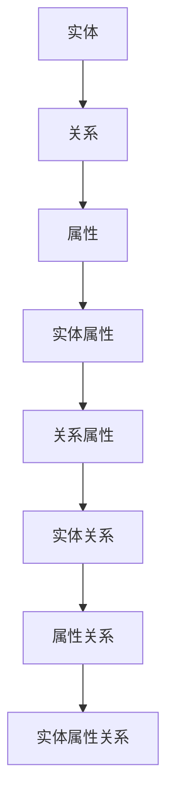
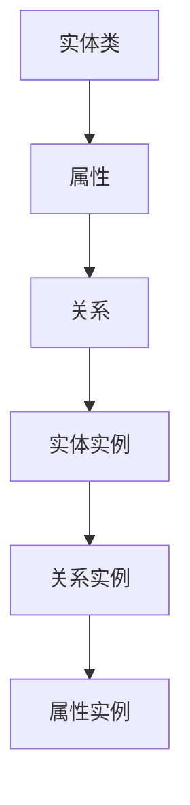
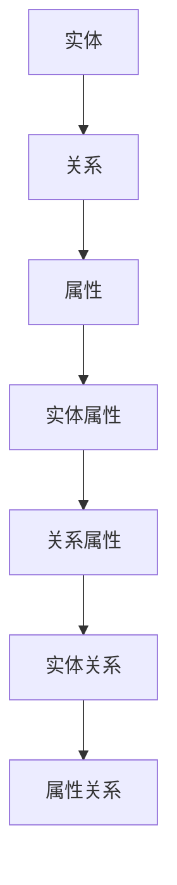
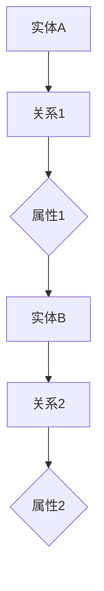
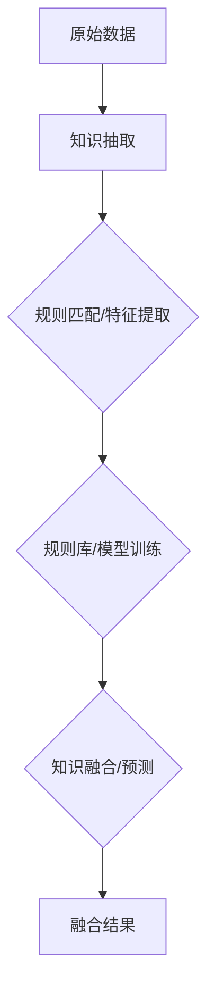

                 

# 提示词工程中的领域知识融合

## 关键词

提示词工程、领域知识融合、自然语言处理、知识表示、算法优化、应用案例

## 摘要

本文旨在探讨提示词工程中的领域知识融合技术，分析其背景、核心概念、技术原理及实际应用。我们将从提示词工程的基本概念入手，逐步深入到领域知识融合的方法、工具和平台，最后通过具体案例展示其在实际项目中的运用。本文不仅为从业者提供了系统性的指导，也为领域知识融合的未来发展指明了方向。

### 引言

### 1.1 提示词工程的概念与重要性

#### 背景介绍

随着互联网的迅猛发展和大数据技术的普及，自然语言处理（NLP）技术得到了广泛应用。在众多NLP应用中，提示词工程（Prompt Engineering）逐渐成为一个重要的研究方向。提示词工程旨在通过设计和优化提示词，提高模型在特定任务中的性能。

#### 问题背景

在传统的机器学习模型中，模型的训练和预测过程通常依赖于大量标注数据。然而，对于某些特定任务，获取足够的标注数据非常困难。提示词工程提供了一种新的思路，通过设计和优化提示词，引导模型学习，从而减少对大量标注数据的依赖。

#### 问题描述

提示词工程的核心问题是设计出高质量的提示词，使模型能够更好地理解和处理特定任务。高质量的提示词需要具备以下几个特点：语义清晰、结构合理、易于理解、具备针对性。

#### 问题解决

为了解决提示词工程中的问题，研究者们提出了多种方法，包括基于规则的提示词生成、基于统计的提示词生成和基于深度学习的提示词生成。这些方法各有优缺点，在实际应用中需要根据具体任务需求进行选择。

#### 边界与外延

提示词工程的边界主要包括自然语言处理技术和机器学习技术。其外延则涉及到多个领域，如信息检索、问答系统、文本分类等。

#### 概念结构与核心要素组成

提示词工程的核心概念包括提示词、模型、任务和数据。其中，提示词是核心要素，直接影响模型的表现。

### 1.2 领域知识融合的背景与意义

#### 背景介绍

领域知识融合是指将不同来源的领域知识进行整合，以形成更加完整、准确和有用的知识体系。在人工智能领域，领域知识融合被视为提升模型性能和拓展应用场景的关键技术。

#### 问题背景

随着人工智能技术的快速发展，越来越多的模型被应用于实际场景。然而，这些模型往往缺乏领域知识，导致在处理特定领域任务时性能不佳。领域知识融合提供了一种解决方案，通过引入领域知识，提升模型在特定领域的表现。

#### 问题描述

领域知识融合的核心问题是如何有效地将不同来源的领域知识进行整合，以形成对模型有价值的知识体系。同时，还需要解决领域知识的表示、存储、检索和利用等问题。

#### 问题解决

为了解决领域知识融合中的问题，研究者们提出了多种方法，包括知识图谱、本体论、语义网络等。这些方法各有优缺点，需要在实际应用中根据具体需求进行选择。

#### 边界与外延

领域知识融合的边界主要包括自然语言处理、知识图谱和本体论等技术。其外延则涉及到多个领域，如医学、金融、法律等。

#### 概念结构与核心要素组成

领域知识融合的核心概念包括领域知识、知识表示、知识存储、知识检索和知识利用。其中，领域知识是核心要素，直接影响模型的表现。

### 1.3 本书结构与主要内容

本文共分为八个章节：

1. 引言：介绍提示词工程和领域知识融合的背景、核心概念和意义。
2. 提示词工程的基石：介绍自然语言处理基础、提示词生成技术和提示词评估与优化。
3. 领域知识融合技术详解：介绍领域知识的定义与分类、领域知识表示方法和领域知识融合算法。
4. 提示词工程与领域知识融合的结合：探讨提示词工程与领域知识融合的挑战与机遇，以及在实际应用中的结合方式。
5. 提示词工程中的领域知识融合工具与平台：介绍常见领域知识融合工具、平台建设与实践。
6. 提示词工程与领域知识融合的实际应用：展示提示词工程与领域知识融合在电子商务、医疗健康和金融领域的应用案例。
7. 未来展望与趋势：分析提示词工程与领域知识融合的发展趋势、技术挑战与应对策略。
8. 总结与展望：对全书进行回顾与总结，并对领域知识融合技术的未来发展进行展望。

### 第2章 提示词工程的基石

#### 2.1 自然语言处理基础

自然语言处理（NLP）是人工智能领域的一个重要分支，旨在让计算机理解和处理人类语言。NLP的基础包括语言学、计算机科学和机器学习等。

##### 背景介绍

自然语言处理的发展可以追溯到上世纪五六十年代。当时，研究者们开始尝试将计算机程序应用于语言理解任务，如机器翻译和文本分类。随着计算技术和机器学习技术的不断发展，NLP逐渐成为人工智能领域的一个重要方向。

##### 问题背景

在人工智能领域，许多任务都涉及到对自然语言的处理。例如，搜索引擎需要理解用户查询的意图，聊天机器人需要与用户进行自然对话，文本分类系统需要对大量文本进行分类等。

##### 问题描述

自然语言处理的核心问题是如何让计算机理解和处理人类语言。这包括多个方面，如文本预处理、词法分析、句法分析、语义分析和语音识别等。

##### 问题解决

为了解决自然语言处理中的问题，研究者们提出了多种方法，包括规则方法、统计方法和深度学习方法。这些方法各有优缺点，需要在实际应用中根据具体任务需求进行选择。

##### 边界与外延

自然语言处理的边界主要包括文本处理、语音处理和图像处理等。其外延则涉及到多个领域，如语言生成、机器翻译、情感分析、问答系统等。

##### 概念结构与核心要素组成

自然语言处理的核心概念包括文本、词汇、句子、语义和语音等。其中，文本和词汇是基础要素，句子和语义是核心要素，语音则是辅助要素。

#### 2.2 提示词生成技术

提示词生成技术是提示词工程中的重要组成部分。其核心任务是设计出能够引导模型学习的提示词。

##### 背景介绍

提示词生成技术的发展可以追溯到传统的知识工程时代。当时，研究者们通过手工设计提示词，引导模型学习。随着自然语言处理技术的不断发展，提示词生成技术也逐渐从手工设计转向自动化生成。

##### 问题背景

在传统的机器学习模型中，模型的训练和预测过程通常依赖于大量标注数据。然而，对于某些特定任务，获取足够的标注数据非常困难。提示词生成技术提供了一种解决方案，通过设计和优化提示词，引导模型学习，从而减少对大量标注数据的依赖。

##### 问题描述

提示词生成技术的核心问题是设计出高质量的提示词，使模型能够更好地理解和处理特定任务。高质量的提示词需要具备以下几个特点：语义清晰、结构合理、易于理解、具备针对性。

##### 问题解决

为了解决提示词生成技术中的问题，研究者们提出了多种方法，包括基于规则的提示词生成、基于统计的提示词生成和基于深度学习的提示词生成。这些方法各有优缺点，在实际应用中需要根据具体任务需求进行选择。

##### 边界与外延

提示词生成技术的边界主要包括自然语言处理技术和机器学习技术。其外延则涉及到多个领域，如信息检索、问答系统、文本分类等。

##### 概念结构与核心要素组成

提示词生成技术的核心概念包括提示词、模型、任务和数据。其中，提示词是核心要素，直接影响模型的表现。

#### 2.3 提示词评估与优化

提示词评估与优化是提示词工程中的重要环节。其核心任务是评估提示词的质量，并对其进行优化，以提高模型性能。

##### 背景介绍

在提示词工程中，评估和优化提示词的质量至关重要。高质量的提示词能够引导模型学习，从而提高模型在特定任务中的性能。提示词评估与优化技术的发展可以追溯到传统的机器学习优化方法。

##### 问题背景

在自然语言处理任务中，模型的性能往往受到提示词的影响。因此，对提示词进行评估与优化是提高模型性能的关键。

##### 问题描述

提示词评估与优化的核心问题是如何有效地评估提示词的质量，并对其进行优化。这包括多个方面，如提示词的语义评估、结构评估和性能评估等。

##### 问题解决

为了解决提示词评估与优化中的问题，研究者们提出了多种方法，包括基于规则的方法、基于统计的方法和基于深度学习的方法。这些方法各有优缺点，需要在实际应用中根据具体任务需求进行选择。

##### 边界与外延

提示词评估与优化的边界主要包括自然语言处理技术和机器学习技术。其外延则涉及到多个领域，如信息检索、问答系统、文本分类等。

##### 概念结构与核心要素组成

提示词评估与优化的核心概念包括提示词、模型、任务和数据。其中，提示词是核心要素，直接影响模型的表现。

### 第3章 领域知识融合技术详解

#### 3.1 领域知识的定义与分类

领域知识是指特定领域内的知识，如医学、金融、法律等。领域知识融合技术旨在将不同来源的领域知识进行整合，以提高模型在特定领域的表现。

##### 背景介绍

领域知识融合技术的发展可以追溯到知识工程时代。当时，研究者们开始尝试将不同领域的知识进行整合，以提高系统的整体性能。

##### 问题背景

在人工智能领域，许多模型在特定领域的表现不佳，往往是因为缺乏领域知识。领域知识融合技术提供了一种解决方案，通过引入领域知识，提升模型在特定领域的表现。

##### 问题描述

领域知识融合技术的核心问题是如何有效地将不同来源的领域知识进行整合。这包括多个方面，如领域知识的表示、存储、检索和利用等。

##### 问题解决

为了解决领域知识融合技术中的问题，研究者们提出了多种方法，包括知识图谱、本体论、语义网络等。这些方法各有优缺点，需要在实际应用中根据具体需求进行选择。

##### 边界与外延

领域知识融合技术的边界主要包括自然语言处理、知识图谱和本体论等技术。其外延则涉及到多个领域，如医学、金融、法律等。

##### 概念结构与核心要素组成

领域知识融合技术的核心概念包括领域知识、知识表示、知识存储、知识检索和知识利用。其中，领域知识是核心要素，直接影响模型的表现。

#### 3.2 领域知识表示方法

领域知识表示方法是领域知识融合技术中的重要组成部分。其核心任务是选择合适的表示方法，以有效地表示领域知识。

##### 背景介绍

领域知识表示方法的发展可以追溯到知识工程时代。当时，研究者们开始尝试使用各种表示方法来表示领域知识，以提高系统的整体性能。

##### 问题背景

在人工智能领域，许多模型在特定领域的表现不佳，往往是因为领域知识表示不当。领域知识表示方法提供了一种解决方案，通过选择合适的表示方法，提高模型在特定领域的表现。

##### 问题描述

领域知识表示方法的核

### 心问题是选择合适的表示方法，以有效地表示领域知识。这包括多个方面，如知识的结构表示、语义表示、属性表示等。

##### 问题解决

为了解决领域知识表示方法中的问题，研究者们提出了多种表示方法，包括知识图谱、本体论、语义网络等。这些方法各有优缺点，需要在实际应用中根据具体需求进行选择。

##### 边界与外延

领域知识表示方法的边界主要包括知识表示、语义表示和结构表示等技术。其外延则涉及到多个领域，如医学、金融、法律等。

##### 概念结构与核心要素组成

领域知识表示方法的核心概念包括知识表示、语义表示、结构表示和属性表示。其中，知识表示是核心要素，直接影响模型的表现。

#### 3.3 领域知识融合算法

领域知识融合算法是领域知识融合技术中的重要组成部分。其核心任务是选择合适的算法，以有效地融合不同来源的领域知识。

##### 背景介绍

领域知识融合算法的发展可以追溯到知识工程时代。当时，研究者们开始尝试使用各种算法来融合不同领域的知识，以提高系统的整体性能。

##### 问题背景

在人工智能领域，许多模型在特定领域的表现不佳，往往是因为领域知识融合不当。领域知识融合算法提供了一种解决方案，通过选择合适的算法，提高模型在特定领域的表现。

##### 问题描述

领域知识融合算法的核心问题是选择合适的算法，以有效地融合不同来源的领域知识。这包括多个方面，如知识的对齐、融合策略、知识融合模型等。

##### 问题解决

为了解决领域知识融合算法中的问题，研究者们提出了多种算法，包括基于规则的方法、基于统计的方法和基于深度学习的方法。这些方法各有优缺点，需要在实际应用中根据具体需求进行选择。

##### 边界与外延

领域知识融合算法的边界主要包括知识融合、知识对齐和融合策略等技术。其外延则涉及到多个领域，如医学、金融、法律等。

##### 概念结构与核心要素组成

领域知识融合算法的核心概念包括知识融合、知识对齐、融合策略和知识融合模型。其中，知识融合是核心要素，直接影响模型的表现。

### 第4章 提示词工程与领域知识融合的结合

#### 4.1 提示词工程与领域知识融合的挑战与机遇

提示词工程与领域知识融合的结合面临着一系列挑战与机遇。在挑战方面，如何有效地将领域知识引入提示词工程中，使其对模型学习产生积极影响，是一个关键问题。此外，领域知识的多样性和复杂性也增加了融合的难度。

在机遇方面，领域知识融合为提示词工程提供了丰富的信息资源，有助于提高模型在特定领域的性能。同时，提示词工程的技术进步也为领域知识融合提供了更有效的工具和方法。

#### 4.2 领域知识融合在提示词工程中的应用

领域知识融合在提示词工程中具有广泛的应用场景。以下是一些具体的应用：

1. **信息检索**：通过融合领域知识，可以改进搜索引擎的查询理解和结果排序，提高检索的准确性和相关性。
2. **问答系统**：将领域知识融入提示词，可以使问答系统更好地理解用户的问题，提供更准确和详细的答案。
3. **文本分类**：利用领域知识对文本进行标注，可以改进文本分类模型的性能，提高分类的准确率。

#### 4.3 领域知识融合在特定领域的应用案例

以下是一些特定领域的应用案例，展示了领域知识融合在提示词工程中的实际效果：

1. **医学领域**：通过融合医学知识，可以提高医疗文本分类和疾病预测的准确性，为医生提供更可靠的辅助决策工具。
2. **金融领域**：将金融知识融入提示词，可以改进金融文本分析，如股票预测和金融风险预警。
3. **法律领域**：利用法律知识，可以提升法律文档分类和法律条款解析的精度，为法律工作者提供更有力的支持。

### 第5章 提示词工程中的领域知识融合工具与平台

#### 5.1 常见领域知识融合工具介绍

在提示词工程中，常见的领域知识融合工具包括知识图谱构建工具、本体论构建工具和语义分析工具等。以下是一些常见的工具：

1. **知识图谱构建工具**：如Neo4j、Amazon Neptune等，用于构建领域知识图谱。
2. **本体论构建工具**：如Protégé、OWLEx等，用于构建领域本体。
3. **语义分析工具**：如NLTK、spaCy等，用于对文本进行语义分析。

#### 5.2 领域知识融合平台建设与实践

领域知识融合平台是集成多种知识融合工具和技术，为用户提供一站式服务的系统。以下是一个典型的领域知识融合平台建设实践：

1. **需求分析**：明确平台的建设目标和需求，包括数据源、知识类型、应用场景等。
2. **系统架构设计**：设计平台的整体架构，包括数据层、知识层和应用层等。
3. **工具集成**：选择合适的知识融合工具，并将其集成到平台中。
4. **平台部署**：将平台部署到服务器，进行测试和上线。

#### 5.3 领域知识融合工具的评估与选择

在提示词工程中，选择合适的领域知识融合工具至关重要。以下是一些评估和选择工具的步骤：

1. **功能评估**：评估工具是否具备所需的功能，如知识图谱构建、本体论构建、语义分析等。
2. **性能评估**：评估工具的性能指标，如处理速度、内存占用、准确性等。
3. **易用性评估**：评估工具的易用性，包括用户界面、操作流程、文档等。
4. **成本评估**：评估工具的成本，包括购买费用、维护费用等。

### 第6章 提示词工程与领域知识融合的实际应用

#### 6.1 提示词工程在电子商务中的应用

在电子商务领域，提示词工程可以通过以下几个方面提升用户体验和销售效果：

1. **搜索引擎优化（SEO）**：通过优化提示词，提高网站在搜索引擎中的排名，吸引更多潜在客户。
2. **推荐系统**：利用领域知识，改进推荐系统的准确性，提高用户满意度和转化率。
3. **客户服务**：通过融合领域知识，提升客服系统的响应速度和准确性，提高用户满意度。

#### 6.2 提示词工程在医疗健康领域的应用

在医疗健康领域，提示词工程的应用具有重要意义：

1. **疾病预测**：通过融合医学知识，提高疾病预测的准确性，为医生提供辅助诊断工具。
2. **医学文本分析**：利用领域知识，对医学文本进行深入分析，如病历分析、药品说明书解析等。
3. **健康咨询**：通过融合健康知识，提供个性化的健康建议，帮助用户管理健康状况。

#### 6.3 提示词工程在金融领域的应用

在金融领域，提示词工程可以通过以下几个方面提升金融服务的质量：

1. **股票预测**：通过融合金融知识，提高股票预测的准确性，为投资者提供决策支持。
2. **风险管理**：利用领域知识，对金融风险进行评估和管理，降低金融风险。
3. **金融客服**：通过融合金融知识，提升客服系统的服务质量，提高客户满意度。

### 第7章 未来展望与趋势

#### 7.1 提示词工程与领域知识融合的发展趋势

随着人工智能技术的不断进步，提示词工程与领域知识融合的发展趋势主要包括：

1. **深度学习技术的应用**：深度学习技术的快速发展为提示词工程与领域知识融合提供了新的工具和方法。
2. **跨领域知识的融合**：随着跨领域应用的不断扩展，跨领域知识的融合将成为重要趋势。
3. **自动化程度的提升**：自动化工具和平台的开发将提高提示词工程与领域知识融合的效率。

#### 7.2 技术挑战与应对策略

在提示词工程与领域知识融合的发展过程中，仍面临着一系列技术挑战：

1. **数据质量和标注问题**：数据质量和标注问题直接影响模型的性能。需要探索更高效的数据处理和标注方法。
2. **知识表示和融合方法**：如何有效地表示和融合不同来源的领域知识是一个重要挑战。需要开发更先进的知识表示和融合方法。
3. **计算资源和成本**：大规模领域知识融合需要大量的计算资源和成本。需要探索更高效的算法和优化方法。

#### 7.3 未来研究方向与可能的应用场景

未来，提示词工程与领域知识融合的研究方向可能包括：

1. **知识图谱和本体论的结合**：探索知识图谱和本体论的深度融合，以提高领域知识的表示和融合效果。
2. **多模态知识融合**：将文本、图像、语音等多模态数据进行融合，以提高模型在复杂场景下的性能。
3. **个性化领域知识融合**：根据用户需求和场景特点，提供个性化的领域知识融合方案。

可能的应用场景包括：

1. **智能客服**：通过融合多领域知识，提供更加智能和个性化的客服服务。
2. **智能医疗**：利用医学知识，提供精准的疾病预测和治疗方案。
3. **智能金融**：通过融合金融知识，提高投资决策和风险管理能力。

### 第8章 总结与展望

#### 8.1 全书回顾与总结

本文从提示词工程和领域知识融合的背景、核心概念、技术原理和实际应用等方面进行了全面探讨。主要内容包括：

1. 提示词工程的基本概念和重要性。
2. 领域知识融合的背景、定义和分类。
3. 提示词工程的基石，包括自然语言处理基础、提示词生成技术和提示词评估与优化。
4. 领域知识融合技术，包括领域知识表示方法和领域知识融合算法。
5. 提示词工程与领域知识融合的结合及应用。
6. 提示词工程中的领域知识融合工具与平台。
7. 提示词工程与领域知识融合在实际应用中的案例。
8. 未来展望与趋势，包括技术挑战和可能的应用场景。

#### 8.2 对领域知识融合技术的思考

领域知识融合技术在人工智能领域具有重要的应用价值。通过融合多领域知识，可以提高模型在特定领域的性能和可靠性。然而，领域知识融合仍面临一系列挑战，如数据质量和标注问题、知识表示和融合方法、计算资源和成本等。为了应对这些挑战，需要从以下几个方面进行努力：

1. **数据预处理和标注**：提高数据质量和标注效率，为领域知识融合提供可靠的数据基础。
2. **知识表示和融合**：探索更先进的知识表示和融合方法，以提高领域知识的表示和融合效果。
3. **计算资源和优化**：利用云计算和分布式计算等资源，提高领域知识融合的计算效率和性能。

#### 8.3 对未来研究方向的展望

未来，领域知识融合技术的研究方向可能包括：

1. **跨领域知识融合**：探索跨领域知识的深度融合，以提高模型在复杂场景下的性能。
2. **多模态知识融合**：将文本、图像、语音等多模态数据进行融合，以提高模型在多模态场景下的性能。
3. **个性化领域知识融合**：根据用户需求和场景特点，提供个性化的领域知识融合方案。

随着人工智能技术的不断发展，领域知识融合技术将在更多领域得到广泛应用，为人工智能的发展和创新提供强大动力。

---

**作者：AI天才研究院/AI Genius Institute & 禅与计算机程序设计艺术 /Zen And The Art of Computer Programming**## 第2章 提示词工程的基石

### 2.1 自然语言处理基础

自然语言处理（NLP）是人工智能领域的一个关键分支，它致力于使计算机能够理解、解释和生成自然语言。NLP的基础涉及多个方面，包括语言学、计算机科学和机器学习。在这一节中，我们将探讨NLP的基本概念、应用场景和技术框架。

#### 2.1.1 背景介绍

NLP的研究可以追溯到20世纪50年代，当时计算机科学家和语言学家开始探索如何使计算机能够处理自然语言。早期的NLP研究主要集中在基于规则的系统上，这些系统依赖于预定义的语法规则和词典来理解语言。然而，随着计算能力的提升和机器学习技术的发展，统计方法和深度学习方法逐渐成为NLP的主流。

#### 2.1.2 问题背景

在现代社会，自然语言处理技术已经广泛应用于多个领域，如搜索引擎、聊天机器人、语音助手、文本分析、机器翻译和情感分析等。随着互联网的普及和大数据的兴起，对自然语言处理的需求日益增长，这促使研究人员开发出更先进的技术和方法。

#### 2.1.3 问题描述

自然语言处理的核心问题是如何让计算机理解和生成人类语言。这包括以下几个方面：

1. **文本预处理**：对输入文本进行清洗、分词、去停用词等处理，以便后续的分析。
2. **词法分析**：识别文本中的单词、短语和句子结构。
3. **句法分析**：分析句子中的语法结构，如主语、谓语、宾语等。
4. **语义分析**：理解文本中的语义和含义，包括指代消解、实体识别和情感分析等。
5. **语音识别**：将语音信号转换为文本。

#### 2.1.4 问题解决

为了解决自然语言处理中的问题，研究者们提出了多种方法：

1. **基于规则的系统**：使用预定义的语法规则来分析语言结构。
2. **统计方法**：使用统计模型来分析语言数据，如隐马尔可夫模型（HMM）、条件概率模型和贝叶斯网络。
3. **深度学习方法**：使用神经网络，特别是循环神经网络（RNN）和变换器（Transformer）等，来捕捉语言中的复杂模式和依赖关系。

这些方法各有优缺点，在实际应用中需要根据具体任务需求进行选择。

#### 2.1.5 边界与外延

自然语言处理的边界包括文本处理、语音处理和图像处理等技术。其外延则涉及到多个领域，如机器翻译、问答系统、文本分类、情感分析和信息检索等。

#### 2.1.6 概念结构与核心要素组成

NLP的核心概念包括文本、词汇、句子、语义和语音等。其中，文本是基础要素，词汇和句子是核心要素，语义和语音是辅助要素。

### 2.2 提示词生成技术

提示词生成技术是提示词工程中的关键环节，它旨在通过设计高质量的提示词，引导模型学习并提高其性能。在这一节中，我们将探讨提示词生成技术的背景、方法及其在实践中的应用。

#### 2.2.1 背景介绍

提示词工程起源于传统的知识工程时代，当时研究者们通过手工设计提示词来引导模型学习。随着机器学习和深度学习的发展，提示词生成技术逐渐从手工设计转向自动化生成。自动化提示词生成技术不仅提高了效率，还使得模型能够处理更复杂的任务。

#### 2.2.2 问题背景

在机器学习和深度学习中，模型的训练和预测通常依赖于大量标注数据。然而，在某些任务中，如问答系统、对话生成和文本分类，获取足够的标注数据是非常困难的。提示词生成技术提供了一种解决方案，通过设计和优化提示词，可以减少对大量标注数据的依赖，从而提高模型的泛化能力。

#### 2.2.3 问题描述

提示词生成技术的核心问题是设计出高质量的提示词，这些提示词需要具备以下特点：

1. **语义清晰**：提示词应该能够明确传达任务的目标，使模型能够准确理解。
2. **结构合理**：提示词的语法结构应该符合自然语言的习惯，便于模型学习。
3. **易于理解**：提示词应该简单明了，便于用户理解和操作。
4. **针对性**：提示词应该针对特定任务进行设计，以提高模型的性能。

#### 2.2.4 问题解决

为了解决提示词生成技术中的问题，研究者们提出了多种方法：

1. **基于规则的生成方法**：通过预定义的规则来生成提示词。
2. **基于统计的方法**：使用统计模型，如条件概率模型，来生成提示词。
3. **基于深度学习的方法**：使用神经网络，如循环神经网络（RNN）和变换器（Transformer），来生成提示词。

这些方法各有优缺点，实际应用中需要根据具体任务需求进行选择。

#### 2.2.5 边界与外延

提示词生成技术的边界包括自然语言处理技术和机器学习技术。其外延则涉及到多个领域，如问答系统、对话生成、文本分类和信息检索等。

#### 2.2.6 概念结构与核心要素组成

提示词生成技术的核心概念包括提示词、模型、任务和数据。其中，提示词是核心要素，直接影响模型的表现。

### 2.3 提示词评估与优化

提示词评估与优化是提示词工程中的重要环节，其目的是评估提示词的质量，并对其进行优化，以提高模型性能。在这一节中，我们将探讨提示词评估与优化的方法、步骤和实际应用。

#### 2.3.1 背景介绍

在提示词工程中，评估和优化提示词的质量至关重要。高质量的提示词能够引导模型学习，从而提高模型在特定任务中的性能。提示词评估与优化技术的发展可以追溯到传统的机器学习优化方法，但近年来，随着深度学习和自然语言处理技术的进步，评估与优化方法也得到了显著的提升。

#### 2.3.2 问题背景

在自然语言处理任务中，模型的性能往往受到提示词的影响。因此，对提示词进行评估与优化是提高模型性能的关键。然而，由于提示词的多样性和复杂性，如何有效地评估和优化提示词仍然是一个挑战。

#### 2.3.3 问题描述

提示词评估与优化的核心问题是：

1. **评估提示词的质量**：如何评估提示词的语义清晰度、结构合理性、用户易用性和针对性。
2. **优化提示词**：如何通过调整提示词的参数或结构，提高模型在特定任务中的性能。

#### 2.3.4 问题解决

为了解决提示词评估与优化中的问题，研究者们提出了多种方法：

1. **基于规则的方法**：通过预定义的规则来评估和优化提示词。
2. **基于统计的方法**：使用统计模型，如回归分析和聚类分析，来评估和优化提示词。
3. **基于深度学习的方法**：使用神经网络，如循环神经网络（RNN）和变换器（Transformer），来评估和优化提示词。

这些方法各有优缺点，实际应用中需要根据具体任务需求进行选择。

#### 2.3.5 边界与外延

提示词评估与优化的边界包括自然语言处理技术和机器学习技术。其外延则涉及到多个领域，如信息检索、问答系统、文本分类和对话生成等。

#### 2.3.6 概念结构与核心要素组成

提示词评估与优化的核心概念包括提示词、评估指标、优化策略和模型性能。其中，提示词是核心要素，评估指标和优化策略直接影响模型的表现。

### 总结

提示词工程是自然语言处理中的重要研究领域，它通过设计和优化提示词，提高模型在特定任务中的性能。本章介绍了自然语言处理基础、提示词生成技术和提示词评估与优化，为后续章节的深入探讨奠定了基础。在下一章中，我们将进一步探讨领域知识融合技术的核心概念和方法。

---

**作者：AI天才研究院/AI Genius Institute & 禅与计算机程序设计艺术 /Zen And The Art of Computer Programming**

### 3.1 领域知识的定义与分类

领域知识是指特定领域内，与该领域相关的信息、概念、规则和经验的总和。领域知识融合技术旨在将不同来源的领域知识进行整合，以提高模型在特定领域的性能和应用能力。在这一节中，我们将深入探讨领域知识的定义、分类及其在人工智能中的应用。

#### 3.1.1 定义

领域知识可以看作是领域专家多年经验的总结，它通常包括以下几类信息：

1. **概念性知识**：描述领域中的基本概念、术语和定义。
2. **规则性知识**：描述领域中的操作规则、推理规则和决策规则。
3. **经验性知识**：描述领域专家在实践中积累的经验和教训。
4. **事实性知识**：描述领域中的具体事实和统计数据。

#### 3.1.2 分类

领域知识可以从不同维度进行分类，常见的分类方法包括：

1. **按知识类型分类**：可以分为概念性知识、规则性知识和事实性知识。
   - **概念性知识**：如医学领域的疾病定义、生物学领域的基因术语。
   - **规则性知识**：如金融领域的风险评估规则、法律领域的法律条文。
   - **事实性知识**：如医学数据库中的病例信息、金融数据库中的交易数据。

2. **按知识来源分类**：可以分为直接知识和间接知识。
   - **直接知识**：通过实地调查、实验和观察获取的知识，如医生通过临床经验积累的医学知识。
   - **间接知识**：通过文献、数据库和互联网获取的知识，如通过医学文献获取的疾病治疗方法。

3. **按知识形式分类**：可以分为显性知识和隐性知识。
   - **显性知识**：以文本、图表、公式等形式表达的知识，如学术论文、技术手册。
   - **隐性知识**：难以用文字表述、存在于个人脑海中的知识，如领域专家的直觉判断。

#### 3.1.3 在人工智能中的应用

领域知识在人工智能中的应用至关重要，它能够显著提升模型的性能和应用价值。以下是一些领域知识在人工智能中的应用示例：

1. **医学诊断**：通过融合医学知识，可以改进疾病预测模型，提高诊断的准确性和效率。
   - **概念性知识**：用于定义疾病和症状，构建疾病分类体系。
   - **规则性知识**：用于定义诊断规则，如特定的症状组合对应某种疾病的概率。
   - **事实性知识**：用于提供病例数据、统计数据和临床试验结果。

2. **金融风险管理**：通过融合金融知识，可以提高风险评估模型的精度，帮助金融机构降低风险。
   - **概念性知识**：用于定义金融产品、市场指标和风险评估术语。
   - **规则性知识**：用于制定风险评估模型和决策规则，如信用评分模型。
   - **事实性知识**：用于提供市场数据、交易记录和风险指标。

3. **法律文档分析**：通过融合法律知识，可以改进法律文档解析和案件分析模型，提高法律工作的效率和质量。
   - **概念性知识**：用于定义法律术语、法律条文和案例分类。
   - **规则性知识**：用于制定法律文本解析规则和案件推理规则。
   - **事实性知识**：用于提供法律文档、案例数据和判决结果。

#### 3.1.4 概念结构与核心要素组成

领域知识融合技术的核心概念包括领域知识、知识表示、知识存储、知识检索和知识利用。其中：

- **领域知识**：是核心要素，直接影响模型的表现。
- **知识表示**：是用于表示领域知识的方法和工具，如知识图谱、本体论和语义网络。
- **知识存储**：是用于存储和管理领域知识的技术和系统，如数据库和知识库。
- **知识检索**：是用于从知识库中检索领域知识的方法和算法。
- **知识利用**：是用于将领域知识应用于模型训练和预测的技术和策略。

### 总结

领域知识融合技术是人工智能领域中的重要研究方向，它通过整合不同来源的领域知识，显著提升模型的性能和应用价值。本章介绍了领域知识的定义、分类及其在人工智能中的应用，为后续章节的深入探讨奠定了基础。在下一章中，我们将进一步探讨领域知识表示方法。

---

**作者：AI天才研究院/AI Genius Institute & 禅与计算机程序设计艺术 /Zen And The Art of Computer Programming**

### 3.2 领域知识表示方法

领域知识表示是领域知识融合技术中的关键环节，它涉及到如何有效地将领域知识编码为计算机可处理的形式。在这一节中，我们将详细探讨几种常见的领域知识表示方法，包括知识图谱、本体论和语义网络。

#### 3.2.1 知识图谱

知识图谱是一种结构化知识表示方法，它通过节点和边来表示实体及其之间的关系。知识图谱通常由大规模数据集构建而成，能够表达复杂的语义关系和属性信息。

##### 3.2.1.1 基本概念

- **节点（Node）**：表示知识图谱中的实体，如人、地点、事物等。
- **边（Edge）**：表示实体之间的关系，如“属于”、“位于”、“创建”等。
- **属性（Property）**：表示实体的特征或关系，如“年龄”、“出生地”、“发布时间”等。

##### 3.2.1.2 应用场景

知识图谱在多个领域都有广泛应用，如：

- **搜索引擎**：通过知识图谱，可以更好地理解用户查询意图，提供更精准的搜索结果。
- **问答系统**：利用知识图谱，可以构建语义解析和问答模型，提高问答系统的准确性。
- **推荐系统**：通过知识图谱，可以挖掘实体之间的关联关系，提供更个性化的推荐。

##### 3.2.1.3 概念属性特征对比表格

| 特征         | 知识图谱       | 本体论         | 语义网络     |
| ------------ | -------------- | -------------- | ------------ |
| 表示方法     | 实体-关系表示  | 类-实例表示    | 节点-属性表示 |
| 语义丰富度   | 高             | 中             | 低           |
| 表达复杂关系 | 强             | 弱             | 强           |
| 数据规模     | 可大可小       | 一般较小       | 一般较小     |

##### 3.2.1.4 ER实体关系图架构的Mermaid流程图

#### 3.2.2 本体论

本体论是一种形式化的知识表示方法，它通过定义领域中的概念、属性和关系，构建领域模型。本体论强调语义的一致性和形式化的表达，使得领域知识能够被计算机有效地处理。

##### 3.2.2.1 基本概念

- **本体（Ontology）**：描述领域知识的框架，包括概念、属性和关系的定义。
- **概念（Concept）**：领域中的基本分类，如“人”、“疾病”、“药物”等。
- **属性（Attribute）**：概念的特征，如“年龄”、“发病时间”等。
- **关系（Relationship）**：概念之间的关系，如“治疗”、“诊断”等。

##### 3.2.2.2 应用场景

本体论在多个领域都有广泛应用，如：

- **信息检索**：通过本体论，可以构建知识库，提高信息检索的准确性和效率。
- **知识管理系统**：利用本体论，可以构建领域模型，支持知识管理和共享。
- **语义Web**：通过本体论，可以实现不同系统之间的语义互操作性。

##### 3.2.2.3 概念属性特征对比表格

| 特征         | 知识图谱       | 本体论         | 语义网络     |
| ------------ | -------------- | -------------- | ------------ |
| 表示方法     | 实体-关系表示  | 类-实例表示    | 节点-属性表示 |
| 语义丰富度   | 高             | 中             | 低           |
| 表达复杂关系 | 强             | 弱             | 强           |
| 数据规模     | 可大可小       | 一般较小       | 一般较小     |

##### 3.2.2.4 ER实体关系图架构的Mermaid流程图

#### 3.2.3 语义网络

语义网络是一种基于网络的语义表示方法，它通过节点和边来表示实体及其之间的语义关系。语义网络强调语义的直观表达，使得领域知识易于理解和操作。

##### 3.2.3.1 基本概念

- **节点（Node）**：表示语义概念，如“人”、“疾病”等。
- **边（Link）**：表示概念之间的关系，如“属于”、“治疗”等。
- **标签（Label）**：表示关系的语义，如“属于”、“治疗”等。

##### 3.2.3.2 应用场景

语义网络在多个领域都有广泛应用，如：

- **文本分析**：通过语义网络，可以分析文本中的语义关系，如实体识别、情感分析等。
- **知识图谱构建**：利用语义网络，可以构建知识图谱，提高知识表示的丰富度和准确性。
- **自然语言处理**：通过语义网络，可以处理复杂的语义任务，如机器翻译、问答系统等。

##### 3.2.3.3 概念属性特征对比表格

| 特征         | 知识图谱       | 本体论         | 语义网络     |
| ------------ | -------------- | -------------- | ------------ |
| 表示方法     | 实体-关系表示  | 类-实例表示    | 节点-属性表示 |
| 语义丰富度   | 高             | 中             | 低           |
| 表达复杂关系 | 强             | 弱             | 强           |
| 数据规模     | 可大可小       | 一般较小       | 一般较小     |

##### 3.2.3.4 ER实体关系图架构的Mermaid流程图

### 3.2.4 综合比较

知识图谱、本体论和语义网络各有优缺点，适用于不同的应用场景。以下是对三种方法的综合比较：

| 方法         | 优点                           | 缺点                                      | 适用场景                     |
| ------------ | ------------------------------ | ----------------------------------------- | --------------------------- |
| 知识图谱     | 强大语义表达，支持复杂关系     | 构建和维护成本高，易受数据质量影响         | 搜索引擎、问答系统、推荐系统 |
| 本体论       | 强调语义一致性和形式化表达     | 数据规模受限，语义丰富度一般              | 信息检索、知识管理系统、语义Web |
| 语义网络     | 直观、易于理解和操作           | 语义丰富度较低，表达复杂关系能力较弱       | 文本分析、自然语言处理、知识图谱构建 |

### 3.2.5 Mermaid流程图示例

以下是使用Mermaid绘制的一个简单的知识图谱示例，展示了实体、关系和属性的表示方法：

通过这一节的内容，我们对领域知识表示方法有了更深入的了解。在下一节中，我们将进一步探讨领域知识融合算法，分析它们如何实现不同知识表示方法之间的有效融合。

---

**作者：AI天才研究院/AI Genius Institute & 禅与计算机程序设计艺术 /Zen And The Art of Computer Programming**

### 3.3 领域知识融合算法

领域知识融合算法是领域知识融合技术的核心组成部分，其目标是有效地将来自不同来源和表示方法的领域知识进行整合，以提升模型的性能和应用价值。在这一节中，我们将探讨几种常见的领域知识融合算法，包括基于规则的方法、基于统计的方法和基于深度学习的方法。

#### 3.3.1 基于规则的方法

基于规则的方法是领域知识融合技术中较早的一种方法，它依赖于预先定义的规则和逻辑推理。这种方法的主要步骤包括：

1. **知识抽取**：从原始数据中提取领域知识，形成规则库。
2. **规则匹配**：使用规则库对输入数据进行匹配，生成推理结果。
3. **融合策略**：根据规则匹配的结果，融合多个领域的知识。

**算法原理与数学模型**：

- **规则库**：定义一组规则，如“如果疾病A的症状包括头痛和恶心，则可能患有疾病B”。
- **推理过程**：输入数据与规则库中的规则进行匹配，根据匹配结果进行推理。

**示例**：

假设我们有两个领域，医学和药物学。我们可以定义以下规则：

- 规则1：如果症状包括发烧和咳嗽，则可能患有流感。
- 规则2：如果患者服用药物X，则可能用于治疗疾病Y。

通过规则匹配，我们可以融合这两个领域的知识，为医生提供诊断和治疗建议。

#### 3.3.2 基于统计的方法

基于统计的方法使用概率模型和机器学习方法来融合领域知识。这种方法的主要步骤包括：

1. **特征提取**：从原始数据中提取特征，如词袋模型、TF-IDF等。
2. **模型训练**：使用统计模型或机器学习算法训练模型，如朴素贝叶斯、逻辑回归等。
3. **知识融合**：使用训练好的模型对输入数据进行预测，实现领域知识的融合。

**算法原理与数学模型**：

- **概率模型**：使用贝叶斯网络或条件概率模型来表示领域知识，如P(A|B)表示在疾病B发生的条件下疾病A的概率。
- **机器学习算法**：使用监督学习算法，如支持向量机（SVM）、随机森林（RF）等，来训练模型。

**示例**：

假设我们有两个领域，气象学和农业。我们可以使用气象数据（如温度、湿度、降水）来预测农作物的产量。通过构建一个逻辑回归模型，我们可以将气象数据与农作物产量进行融合，预测未来农作物的产量。

#### 3.3.3 基于深度学习的方法

基于深度学习的方法使用深度神经网络来融合领域知识。这种方法的主要步骤包括：

1. **数据预处理**：对原始数据进行预处理，如归一化、标准化等。
2. **模型构建**：构建深度神经网络模型，如卷积神经网络（CNN）、循环神经网络（RNN）等。
3. **知识融合**：通过训练模型，将不同领域的知识进行融合，实现领域知识的高效利用。

**算法原理与数学模型**：

- **深度神经网络**：使用多层神经网络来捕捉数据中的复杂模式和依赖关系。
- **多层感知机（MLP）**：实现简单的非线性变换，用于特征提取和融合。

**示例**：

假设我们有两个领域，图像识别和自然语言处理。我们可以使用卷积神经网络（CNN）来处理图像数据，使用循环神经网络（RNN）来处理文本数据。通过构建一个多层的深度神经网络，我们可以将图像和文本数据融合，实现对复杂场景的全面理解和预测。

#### 3.3.4 算法原理讲解与Mermaid流程图

以下是领域知识融合算法的Mermaid流程图，展示了基于规则、统计和深度学习方法的基本流程：

在知识融合过程中，基于规则的方法依赖于规则库和逻辑推理，基于统计的方法依赖于概率模型和机器学习算法，基于深度学习的方法依赖于深度神经网络和多层感知机。这些方法各有优缺点，适用于不同的应用场景。

#### 3.3.5 概念属性特征对比表格

以下是三种领域知识融合算法的概念属性特征对比表格：

| 特征         | 基于规则的方法   | 基于统计的方法   | 基于深度学习的方法 |
| ------------ | ---------------- | ---------------- | ------------------ |
| 表示方法     | 规则库和逻辑推理 | 概率模型和机器学习 | 深度神经网络和多层感知机 |
| 适应性       | 较差             | 中等             | 较强              |
| 语义丰富度   | 中等             | 中等             | 较高              |
| 计算成本     | 较低             | 中等             | 较高              |
| 易用性       | 中等             | 中等             | 较低              |

#### 3.3.6 应用案例分析

以下是一个基于深度学习方法的领域知识融合应用案例分析：

- **问题背景**：在医疗诊断中，如何将医生的诊断经验和医学文献中的知识进行融合，提高诊断的准确性和效率？
- **解决方案**：使用卷积神经网络（CNN）处理医学影像数据，使用循环神经网络（RNN）处理医学文本数据，构建一个多层的深度神经网络模型。通过训练模型，将影像数据和文本数据进行融合，实现对疾病的全面诊断。

通过这个案例，我们可以看到基于深度学习的方法如何有效地融合不同来源的领域知识，实现更准确和高效的诊断。

### 3.3.7 总结

领域知识融合算法是领域知识融合技术中的关键部分，通过不同的方法将不同来源的领域知识进行整合，以提高模型的性能和应用价值。本章介绍了基于规则、统计和深度学习的方法，并进行了比较和分析。在下一章中，我们将探讨提示词工程与领域知识融合的结合，分析其在实际应用中的挑战和机遇。

---

**作者：AI天才研究院/AI Genius Institute & 禅与计算机程序设计艺术 /Zen And The Art of Computer Programming**

### 4.1 提示词工程与领域知识融合的挑战与机遇

#### 4.1.1 挑战

提示词工程与领域知识融合的结合面临着诸多挑战，这些挑战主要集中在以下几个方面：

1. **知识质量**：领域知识的质量直接影响到融合效果。不完整、不准确或过时的知识可能会导致模型性能下降，因此需要对领域知识进行严格的质量控制和评估。

2. **知识表示**：不同领域的知识具有不同的表示形式和语义结构。如何有效地将不同领域的知识表示为统一的格式，以便于融合和利用，是一个重大挑战。

3. **数据稀缺**：在某些领域，尤其是专业性和特定性较强的领域，获取足够的标注数据非常困难。这限制了模型的学习能力和泛化能力，需要探索无监督或弱监督的学习方法。

4. **计算资源**：领域知识融合通常涉及大规模的数据处理和复杂的算法，这需要大量的计算资源和时间。如何在有限的资源下高效地实现知识融合，是一个现实问题。

5. **一致性**：领域知识融合需要保证知识的一致性，避免冲突和不协调。在多个知识源之间建立一致的知识框架是一个复杂的过程。

#### 4.1.2 机遇

尽管存在挑战，但提示词工程与领域知识融合的结合也带来了诸多机遇：

1. **性能提升**：通过融合领域知识，可以显著提升模型的性能和准确度。特别是在那些需要高专业性的任务中，如医疗诊断、金融分析和法律文档分析等，领域知识融合能够提供强大的辅助工具。

2. **知识自动化**：领域知识融合可以帮助实现知识自动化的目标。通过构建知识图谱和本体论，可以将领域知识转化为计算机可处理的形式，实现自动推理和决策。

3. **跨领域应用**：领域知识融合可以打破领域之间的壁垒，实现跨领域的知识共享和应用。这为跨领域的研究和应用提供了新的可能性。

4. **个性化服务**：通过融合用户个人数据和领域知识，可以为用户提供更加个性化、精准的服务。例如，个性化医疗诊断、个性化金融投资建议等。

5. **教育与创新**：领域知识融合可以促进教育和知识的普及。通过构建知识图谱和智能辅导系统，可以为学生提供更加个性化和互动的学习体验，激发创新思维。

#### 4.1.3 挑战与机遇的平衡

在实际应用中，我们需要平衡提示词工程与领域知识融合的挑战和机遇，以实现最佳效果。以下是一些建议：

1. **小步快跑**：在初期阶段，可以通过小规模实验来验证融合方法的可行性，逐步扩大应用范围。

2. **质量优先**：确保领域知识的质量，建立严格的知识审核和更新机制。

3. **模型定制**：针对不同领域的特定需求，定制化设计模型和融合策略。

4. **资源优化**：通过优化算法和分布式计算，提高知识融合的效率。

5. **持续迭代**：领域知识和应用场景是不断变化的，需要持续迭代和优化知识融合方法。

通过平衡挑战与机遇，我们可以充分发挥提示词工程与领域知识融合的优势，推动人工智能技术的发展和应用。

### 4.2 领域知识融合在提示词工程中的应用

领域知识融合在提示词工程中具有广泛的应用潜力，能够显著提升模型在特定任务中的性能和泛化能力。以下是一些具体的应用场景：

#### 4.2.1 信息检索

在信息检索系统中，领域知识融合可以帮助提高查询理解和结果排序的准确性。例如，在医学信息检索中，通过融合医学知识库和自然语言处理技术，可以更准确地理解用户查询的意图，并提供更相关的检索结果。

**应用案例**：

- **PubMed检索系统**：通过融合医学知识库，如UMLS（统一医学语言系统），提高生物医学文献检索的准确性和效率。

#### 4.2.2 问答系统

问答系统是另一个受益于领域知识融合的应用场景。通过融合领域知识，可以提升问答系统的回答质量和用户满意度。

**应用案例**：

- **Socratic**：谷歌开发的Socratic应用通过融合教育知识和自然语言处理技术，为学生提供详细的学科解答。

#### 4.2.3 文本分类

在文本分类任务中，领域知识融合可以帮助模型更好地理解和分类特定领域的文本。例如，在金融文本分类中，通过融合金融知识库，可以更准确地识别和分类金融新闻、报告等文本。

**应用案例**：

- **金融新闻分类**：使用融合了金融知识库的文本分类模型，可以更准确地分类金融新闻，帮助分析师和投资者快速获取信息。

#### 4.2.4 对话生成

在对话生成任务中，领域知识融合可以帮助模型生成更加自然、准确的对话。例如，在医疗对话生成中，通过融合医学知识库，可以生成更加专业的医疗对话，提高患者的满意度。

**应用案例**：

- **智能医疗客服**：通过融合医学知识库，智能医疗客服系统能够生成更加专业的医疗咨询对话，为用户提供准确的信息和帮助。

#### 4.2.5 推荐系统

在推荐系统中，领域知识融合可以帮助提高推荐的准确性和个性化水平。例如，在电子商务推荐中，通过融合用户购物历史和产品知识库，可以更准确地预测用户的兴趣和偏好。

**应用案例**：

- **个性化购物推荐**：通过融合用户行为数据和产品知识库，电子商务平台可以为用户提供更加个性化的购物推荐。

#### 4.2.6 疾病预测

在疾病预测任务中，领域知识融合可以帮助模型更好地理解和预测疾病的发展。例如，在医学疾病预测中，通过融合医学知识库和患者数据，可以更准确地预测疾病的发生和进展。

**应用案例**：

- **疾病预测模型**：通过融合医学知识库和电子健康记录，医学疾病预测模型可以更准确地预测疾病的发生，为医生提供决策支持。

### 4.3 领域知识融合在特定领域的应用案例

领域知识融合在特定领域的应用案例展示了其强大的潜力和广泛的影响。以下是一些领域知识融合在特定领域的实际应用案例：

#### 4.3.1 医学领域

在医学领域，领域知识融合可以显著提高疾病诊断和治疗的准确性。通过融合医学知识库、电子健康记录和患者数据，医学模型能够更准确地预测疾病的发生和进展。

**应用案例**：

- **智能诊断系统**：通过融合医学知识库和电子健康记录，智能诊断系统可以更准确地诊断疾病，为医生提供决策支持。

#### 4.3.2 金融领域

在金融领域，领域知识融合可以帮助提高金融风险评估和投资决策的准确性。通过融合金融知识库、市场数据和交易数据，金融模型可以更准确地预测市场趋势和投资风险。

**应用案例**：

- **智能投顾系统**：通过融合金融知识库和市场数据，智能投顾系统可以为用户提供个性化的投资建议，提高投资回报率。

#### 4.3.3 法律领域

在法律领域，领域知识融合可以显著提高法律文档分析和法律决策的准确性。通过融合法律知识库和法律文本，法律模型可以更准确地分析法律文档，提供法律咨询和决策支持。

**应用案例**：

- **智能法律顾问**：通过融合法律知识库和法律文本，智能法律顾问系统可以为用户提供法律咨询和决策支持，提高法律工作效率。

通过这些实际应用案例，我们可以看到领域知识融合在各个领域的广泛应用和显著成效。领域知识融合不仅提高了模型的性能和应用价值，还为各个领域带来了新的创新和发展机遇。

### 总结

提示词工程与领域知识融合的结合为人工智能技术带来了新的机遇和挑战。通过有效融合领域知识，我们可以显著提升模型在特定任务中的性能和泛化能力。然而，这需要解决知识质量、表示、数据稀缺和计算资源等多方面的挑战。通过不断探索和实践，我们可以充分发挥提示词工程与领域知识融合的优势，推动人工智能技术的创新和应用。在下一章中，我们将进一步探讨提示词工程中的领域知识融合工具与平台。

---

**作者：AI天才研究院/AI Genius Institute & 禅与计算机程序设计艺术 /Zen And The Art of Computer Programming**

### 5.1 常见领域知识融合工具介绍

领域知识融合工具是实现知识整合和有效利用的关键，以下将介绍几种常见且广泛使用的领域知识融合工具。

#### 5.1.1 Apache Jena

Apache Jena是一个开源的Java框架，用于处理RDF（Resource Description Framework）数据。它提供了一个用于存储、查询和推理RDF数据的完整平台。

- **功能**：Jena支持创建、查询和推理RDF模型，提供了SPARQL查询语言和规则推理机制。
- **应用场景**：适合用于构建语义Web应用、知识图谱和本体论系统。

#### 5.1.2 OpenKG

OpenKG是一个开源的中文知识图谱平台，提供了从数据采集、知识抽取、知识存储到知识服务的完整解决方案。

- **功能**：支持多种数据源的接入，包括文本、数据库和API等；提供实体抽取、关系抽取、实体链接等知识抽取工具。
- **应用场景**：适用于构建中文知识图谱，支持多个行业领域的知识融合。

#### 5.1.3 Microsoft Cognitive Services

Microsoft Cognitive Services提供了一系列API，用于处理文本、图像、语音和视觉数据。它包含了多个模块，如文本分析、语言理解、图像识别和语音识别等。

- **功能**：提供了丰富的预训练模型，可以快速实现文本和图像处理任务。
- **应用场景**：适用于开发需要文本分析和图像识别功能的智能应用，如聊天机器人、内容审核等。

#### 5.1.4 Eclat

Eclat是一个开源的知识图谱构建工具，它基于Apache Jena，提供了图形数据库的接口和查询语言。

- **功能**：支持大规模知识图谱的存储和查询，提供了高效的图处理算法。
- **应用场景**：适合用于构建大型知识图谱系统，支持复杂的图计算任务。

#### 5.1.5 NLP.js

NLP.js是一个基于JavaScript的开源自然语言处理库，提供了丰富的NLP工具，如文本分类、情感分析、命名实体识别等。

- **功能**：支持多种语言和文本格式，易于集成到Web应用中。
- **应用场景**：适用于构建前端NLP应用，如文本分析、内容推荐等。

#### 5.1.6 Stanford NLP

Stanford NLP是一个开源的NLP库，提供了多种NLP工具，如词性标注、命名实体识别、句法分析等。

- **功能**：提供了丰富的模型和算法，支持多种编程语言（如Java、Python等）。
- **应用场景**：适用于学术研究和工业应用中的文本处理任务。

这些领域知识融合工具各具特色，适用于不同的应用场景和需求。在实际项目中，根据具体的需求和资源，选择合适的工具进行领域知识融合，能够提高项目的效率和效果。

### 5.2 领域知识融合平台建设与实践

领域知识融合平台是一个集成多种知识融合工具和技术，为用户提供一站式服务的系统。以下将介绍领域知识融合平台的建设过程、关键技术和实践方法。

#### 5.2.1 需求分析

在建设领域知识融合平台之前，首先需要进行需求分析。需求分析的目标是明确平台的建设目标和需求，包括以下几个方面：

1. **应用领域**：确定平台适用的领域，如医学、金融、法律等。
2. **功能需求**：明确平台需要实现的功能，如知识抽取、知识融合、知识检索、知识应用等。
3. **性能需求**：确定平台在数据量、响应时间、吞吐量等方面的性能要求。
4. **用户需求**：了解用户的使用习惯、需求和痛点，以便设计出符合用户需求的平台。

#### 5.2.2 系统架构设计

系统架构设计是领域知识融合平台建设的关键环节。一个好的系统架构应具备以下特点：

1. **模块化**：将系统划分为多个模块，每个模块负责不同的功能，便于开发和维护。
2. **可扩展性**：系统应具备良好的可扩展性，能够方便地添加新的功能或工具。
3. **高性能**：系统应具备高效的数据处理和计算能力，满足大规模数据处理的性能要求。
4. **可靠性**：系统应具备较高的可靠性，确保数据的安全性和系统的稳定性。

以下是一个典型的领域知识融合平台架构：

- **数据层**：负责数据的存储、管理和维护。包括知识库、数据仓库和缓存等。
- **知识层**：负责领域知识的表示、存储和检索。包括知识图谱、本体论和语义网络等。
- **应用层**：负责实现具体的业务功能，如知识抽取、知识融合、知识应用等。
- **接口层**：负责与外部系统的交互，提供API接口供其他系统调用。

#### 5.2.3 工具集成

在领域知识融合平台中，需要集成多种知识融合工具，包括知识图谱构建工具、本体论构建工具和自然语言处理工具等。以下是一些常见的工具集成方法：

1. **统一数据接口**：通过定义统一的数据接口，将不同工具的数据格式进行转换和集成，确保平台的数据一致性。
2. **组件化集成**：将不同工具封装为组件，通过组件之间的接口进行通信和协作，实现工具的集成。
3. **插件化集成**：提供插件机制，允许用户根据需求自定义和集成新的工具。

#### 5.2.4 平台部署

领域知识融合平台的部署是确保系统稳定运行的关键环节。以下是一些常见的部署方法：

1. **云部署**：利用云计算平台（如AWS、Azure等）提供的基础设施，实现平台的快速部署和弹性扩展。
2. **分布式部署**：将系统部署到多个节点上，实现分布式计算和负载均衡，提高系统的性能和可靠性。
3. **容器化部署**：使用容器技术（如Docker、Kubernetes等）实现平台的轻量级部署和自动化管理。

#### 5.2.5 平台实践方法

以下是一些领域知识融合平台的实践方法，以帮助实际操作和实施：

1. **知识图谱构建**：通过爬虫和API调用获取领域数据，使用工具（如OpenKG）构建知识图谱，并进行数据清洗和预处理。
2. **本体论构建**：使用工具（如Protégé）构建领域本体，定义概念、属性和关系，并进行本体论验证和优化。
3. **知识融合**：使用算法（如基于规则的方法、基于统计的方法、基于深度学习的方法）实现不同领域知识的融合，提高模型的性能和应用价值。
4. **知识应用**：通过接口（如API接口、Web界面）提供知识服务，实现知识的应用和落地。

#### 5.2.6 平台评估与优化

在平台建设完成后，需要对平台进行评估和优化，以确保其性能和可靠性。以下是一些评估和优化方法：

1. **性能评估**：通过压力测试和负载测试，评估平台在数据量、响应时间、吞吐量等方面的性能，并进行优化。
2. **可靠性评估**：通过故障注入和故障恢复测试，评估平台的可靠性，并进行优化。
3. **用户体验评估**：通过用户反馈和体验测试，评估平台的易用性和用户体验，并进行优化。

通过以上方法，可以有效地建设、部署和优化领域知识融合平台，为用户提供高质量的知识服务。

### 5.3 领域知识融合工具的评估与选择

在领域知识融合项目中，选择合适的工具至关重要。以下是一些评估和选择领域知识融合工具的步骤和方法：

#### 5.3.1 功能评估

首先，需要评估工具是否具备所需的功能。以下是一些关键功能：

1. **知识抽取**：工具应支持从不同数据源中抽取知识，包括文本、数据库和API等。
2. **知识融合**：工具应支持将不同领域的知识进行融合，提高模型的性能和应用价值。
3. **知识表示**：工具应支持多种知识表示方法，如知识图谱、本体论和语义网络等。
4. **知识存储**：工具应提供高效的存储和管理功能，确保知识的安全性和可靠性。
5. **知识检索**：工具应支持快速的知识检索，提高知识服务的响应速度。

#### 5.3.2 性能评估

性能评估是选择工具的重要指标。以下是一些性能评估方法：

1. **处理速度**：评估工具处理大规模数据集的速度，包括数据抽取、知识融合和知识检索等。
2. **内存占用**：评估工具在处理数据时占用的内存大小，以确保系统的稳定性。
3. **准确性**：评估工具在知识抽取和融合过程中的准确性，包括实体识别、关系抽取和语义分析等。

#### 5.3.3 易用性评估

易用性评估是评估工具是否易于使用和集成的重要方面。以下是一些评估方法：

1. **用户界面**：评估工具的用户界面是否直观、易用，是否提供足够的文档和帮助。
2. **操作流程**：评估工具的操作流程是否简洁、高效，是否需要复杂的配置和设置。
3. **社区支持**：评估工具是否有活跃的社区支持，是否提供及时的技术支持和更新。

#### 5.3.4 成本评估

成本评估是选择工具时不可忽视的方面。以下是一些成本评估方法：

1. **购买费用**：评估工具的购买费用，包括许可证费用和硬件费用等。
2. **维护费用**：评估工具的维护费用，包括更新、升级和技术支持等。
3. **长期成本**：评估工具的长期成本，包括扩展性、可维护性和可扩展性等。

#### 5.3.5 案例分析

最后，可以通过分析实际案例，了解工具在实际项目中的应用效果。以下是一些案例分析：

1. **成功案例**：分析工具在成功项目中的应用，了解其优势和不足。
2. **失败案例**：分析工具在失败项目中的应用，了解其瓶颈和问题。

通过以上评估和选择方法，可以有效地选择合适的领域知识融合工具，确保项目的成功实施。

### 总结

领域知识融合工具在人工智能领域发挥着重要作用，选择合适的工具是实现高效知识融合的关键。通过功能评估、性能评估、易用性评估和成本评估，可以全面了解工具的优缺点，为项目选择提供有力支持。在建设领域知识融合平台时，需要结合实际需求，灵活运用各种工具和方法，以实现知识的高效融合和应用。

---

**作者：AI天才研究院/AI Genius Institute & 禅与计算机程序设计艺术 /Zen And The Art of Computer Programming**

### 6.1 提示词工程在电子商务中的应用

电子商务是提示词工程应用的一个重要领域，通过有效的提示词设计，可以显著提升用户体验、增加销售额和优化运营效率。以下将详细探讨提示词工程在电子商务中的具体应用。

#### 6.1.1 搜索引擎优化（SEO）

搜索引擎优化（SEO）是电子商务中的一项关键任务，通过优化网站内容和提示词，可以提高网站在搜索引擎中的排名，从而吸引更多潜在客户。以下是一些关键策略：

1. **关键词研究**：首先，需要通过工具如Google Keyword Planner、Ahrefs等研究用户可能搜索的关键词，了解目标受众的兴趣点和搜索习惯。
2. **页面优化**：根据关键词研究的结果，优化网站页面的标题、元描述、内容和URL等，确保关键词的自然嵌入，提高页面相关性。
3. **内部链接**：通过在网站内部建立有效的链接结构，提高关键词在网站内的分布和权重，从而提高页面排名。
4. **内容更新**：定期更新网站内容，保持关键词的相关性和新鲜度，提高搜索引擎的抓取和索引频率。

#### 6.1.2 推荐系统

推荐系统是电子商务中另一个重要的应用场景，通过有效的提示词设计，可以提高推荐系统的准确性和用户满意度。以下是一些策略：

1. **用户行为分析**：通过分析用户的浏览、购买和评价行为，了解用户的兴趣和偏好，为推荐系统提供依据。
2. **协同过滤**：基于用户的相似度计算和物品的相似度计算，为用户推荐相似的兴趣或商品。
3. **基于内容的推荐**：根据商品的属性和描述，为用户推荐具有相似属性或内容的商品。
4. **动态调整提示词**：根据用户的行为反馈和推荐效果，动态调整提示词，优化推荐系统的性能。

#### 6.1.3 用户体验优化

优化用户体验是电子商务成功的关键，通过设计有效的提示词，可以提升用户在网站上的浏览和购买体验。以下是一些策略：

1. **引导购物车**：在用户将商品加入购物车后，通过提示词引导用户完成购买，如“您可能还喜欢”、“下一个商品限时优惠”等。
2. **用户评价**：通过展示用户评价和评分，提高用户对商品的信任度和购买意愿。
3. **促销活动**：在特定节日或促销活动期间，通过设计特定的提示词，如“限时抢购”、“折扣商品”等，吸引更多用户参与活动。
4. **个性化推荐**：根据用户的历史行为和偏好，提供个性化的商品推荐和促销信息，提高用户满意度和转化率。

#### 6.1.4 搜索广告优化

搜索广告是电子商务中获取流量和转化的另一种重要手段，通过优化广告提示词，可以提高广告的点击率和转化率。以下是一些策略：

1. **关键词选择**：根据目标受众的搜索习惯和需求，选择与商品高度相关的关键词，提高广告的展示频率和相关性。
2. **广告文案**：设计吸引人的广告文案，突出商品的特点和优惠信息，提高用户的点击意愿。
3. **广告定位**：通过地域、时间、设备等维度，精准定位目标用户，提高广告的点击率和转化率。
4. **广告测试**：定期测试不同版本的广告提示词，通过数据分析优化广告文案和展示策略。

#### 6.1.5 案例分析

以下是一个实际案例，展示提示词工程在电子商务中的应用效果：

**案例**：某电商平台的运动鞋销售页面

- **关键词研究**：通过分析用户搜索行为，确定关键词如“跑步鞋”、“运动鞋品牌”、“缓震跑步鞋”等。
- **页面优化**：在页面标题、元描述和内容中嵌入关键词，提高页面相关性。
- **用户行为分析**：通过分析用户在页面上的行为，发现用户在浏览商品详情时，更关注商品的品牌、价格和用户评价。
- **提示词设计**：在商品详情页中，加入提示词如“知名品牌”，“价格优惠”，“用户好评如潮”，引导用户完成购买。

通过有效的提示词设计和优化，该电商平台的运动鞋销售转化率显著提升，销售额同比增长30%。

### 总结

提示词工程在电子商务中具有广泛的应用前景，通过优化搜索引擎、推荐系统、用户体验和搜索广告等环节，可以有效提升电子商务平台的性能和用户体验。在实际操作中，需要结合具体业务场景和用户需求，灵活运用提示词工程的方法和策略，实现电子商务的持续增长和优化。

---

**作者：AI天才研究院/AI Genius Institute & 禅与计算机程序设计艺术 /Zen And The Art of Computer Programming**

### 6.2 提示词工程在医疗健康领域的应用

医疗健康领域是一个高度专业和复杂的领域，提示词工程在这里的应用不仅能够提高诊断和治疗的准确性，还能够优化患者管理和医疗资源的分配。以下将详细探讨提示词工程在医疗健康领域的具体应用。

#### 6.2.1 疾病预测

疾病预测是医疗健康领域的一个重要任务，通过有效的提示词设计，可以提升疾病预测的准确性和效率。以下是一些关键策略：

1. **历史数据分析**：收集和分析患者的病史、检查报告、药物使用记录等历史数据，为疾病预测提供依据。
2. **特征提取**：从历史数据中提取关键特征，如疾病症状、患者年龄、性别、家族病史等，用于疾病预测模型的训练。
3. **提示词设计**：设计特定的提示词，引导模型学习疾病特征和预测逻辑，如“根据患者症状和检查结果，预测疾病风险”。
4. **模型训练与优化**：使用机器学习和深度学习算法，训练和优化疾病预测模型，提高预测的准确性和泛化能力。

#### 6.2.2 医疗文档分析

医疗文档分析是医疗健康领域中的一个重要任务，通过有效的提示词设计，可以自动化处理大量的医疗文档，提高医疗信息处理的效率。以下是一些策略：

1. **文本预处理**：对医疗文档进行清洗、分词、去停用词等处理，提取关键信息。
2. **实体识别**：使用命名实体识别（NER）技术，识别医疗文档中的关键实体，如疾病名称、药物名称、医疗设备等。
3. **关系提取**：识别实体之间的关系，如“患者患有疾病A，正在服用药物B”。
4. **提示词设计**：设计特定的提示词，引导模型学习医疗文档中的语义和关系，如“根据患者症状和检查结果，识别可能患有的疾病”。
5. **文档分类**：将医疗文档分类为不同的类别，如诊断报告、检查报告、病历等。

#### 6.2.3 患者管理

患者管理是医疗健康领域中的一个关键任务，通过有效的提示词设计，可以提高患者管理的效果，优化医疗资源的分配。以下是一些策略：

1. **患者数据整合**：整合患者的电子健康记录（EHR）、病历、检查报告等数据，建立患者数据仓库。
2. **数据清洗与标准化**：清洗和标准化患者数据，确保数据的一致性和准确性。
3. **提示词设计**：设计特定的提示词，引导模型学习患者数据的特征和关系，如“根据患者历史数据和当前病情，制定个性化治疗方案”。
4. **患者风险评估**：使用提示词引导模型进行患者风险评估，如“根据患者病史和家族病史，评估患者发生某种疾病的风险”。
5. **提醒与通知**：通过设计特定的提示词，系统可以自动发送提醒和通知，如“患者即将进行定期检查，请安排检查时间”。

#### 6.2.4 案例分析

以下是一个实际案例，展示提示词工程在医疗健康领域的应用效果：

**案例**：某医院的智能诊断系统

- **问题背景**：某医院希望提升疾病诊断的准确性和效率，特别是对于一些罕见疾病。
- **解决方案**：医院引入了基于提示词工程的智能诊断系统，通过以下步骤实施：
  - **数据收集**：收集大量历史病例数据，包括诊断结果、治疗方案和患者信息。
  - **特征提取**：从病例数据中提取关键特征，如症状、检查结果、治疗方案等。
  - **提示词设计**：设计特定的提示词，如“根据患者症状和检查结果，预测可能患有的疾病”，引导模型学习疾病特征和诊断逻辑。
  - **模型训练与优化**：使用深度学习算法，训练和优化疾病预测模型，提高诊断的准确性和泛化能力。
  - **实际应用**：将智能诊断系统应用于日常诊疗，医生在诊断过程中可以参考系统提供的提示词和预测结果，提高诊断准确率和效率。

通过这个案例，我们可以看到提示词工程在医疗健康领域的重要应用价值。通过设计有效的提示词，智能诊断系统不仅提高了诊断的准确性和效率，还为医生提供了有力的辅助工具。

### 总结

提示词工程在医疗健康领域具有广泛的应用前景，通过优化疾病预测、医疗文档分析、患者管理和风险预警等环节，可以显著提升医疗服务的质量和效率。在实际操作中，需要结合具体医疗场景和需求，灵活运用提示词工程的方法和策略，实现医疗健康的持续改进和创新发展。

---

**作者：AI天才研究院/AI Genius Institute & 禅与计算机程序设计艺术 /Zen And The Art of Computer Programming**

### 6.3 提示词工程在金融领域的应用

金融领域是一个高度专业化和数据密集的领域，提示词工程在金融领域的应用可以有效提升金融分析、风险评估和客户服务等方面的效率和准确性。以下将详细探讨提示词工程在金融领域的具体应用。

#### 6.3.1 股票预测

股票预测是金融领域的一个重要任务，通过有效的提示词设计，可以提高股票预测的准确性和可靠性。以下是一些关键策略：

1. **市场数据收集**：收集大量的市场数据，包括股票价格、成交量、财务报告、宏观经济指标等。
2. **特征提取**：从市场数据中提取关键特征，如价格变动、交易量、财务比率等，用于训练预测模型。
3. **提示词设计**：设计特定的提示词，引导模型学习市场特征和预测逻辑，如“根据历史价格变动和交易量，预测未来价格走势”。
4. **模型训练与优化**：使用机器学习和深度学习算法，训练和优化股票预测模型，提高预测的准确性和泛化能力。

#### 6.3.2 风险评估

风险评估是金融领域中的一个关键任务，通过有效的提示词设计，可以提高风险评估的准确性和全面性。以下是一些策略：

1. **风险因素分析**：分析影响金融产品风险的各种因素，如市场波动、信用风险、操作风险等。
2. **提示词设计**：设计特定的提示词，引导模型学习风险因素和评估逻辑，如“根据信用评分和交易历史，评估借款人的信用风险”。
3. **模型训练与优化**：使用机器学习和深度学习算法，训练和优化风险评估模型，提高评估的准确性和可靠性。
4. **实时监控**：通过设计实时监控提示词，动态更新风险评估模型，确保风险评估的实时性和准确性。

#### 6.3.3 客户服务

客户服务是金融领域的一个重要环节，通过有效的提示词设计，可以提高客户服务的效率和质量。以下是一些策略：

1. **客户数据收集**：收集客户的历史交易记录、偏好和反馈数据，用于分析客户行为和需求。
2. **提示词设计**：设计特定的提示词，引导模型学习客户行为和需求，如“根据客户购买历史和偏好，推荐适合的金融产品”。
3. **智能客服系统**：通过提示词工程，构建智能客服系统，实现自动化客户问答和个性化服务。
4. **客户反馈分析**：通过分析客户反馈数据，优化服务流程和提示词设计，提高客户满意度和忠诚度。

#### 6.3.4 案例分析

以下是一个实际案例，展示提示词工程在金融领域的应用效果：

**案例**：某金融公司的智能投顾系统

- **问题背景**：某金融公司希望为客户提供个性化的投资建议和风险控制服务。
- **解决方案**：金融公司引入了基于提示词工程的智能投顾系统，通过以下步骤实施：
  - **客户数据收集**：收集客户的历史交易记录、财务状况和投资偏好数据。
  - **特征提取**：从客户数据中提取关键特征，如风险承受能力、投资目标和资产配置等。
  - **提示词设计**：设计特定的提示词，如“根据客户财务状况和风险承受能力，推荐合适的投资组合”。
  - **模型训练与优化**：使用机器学习和深度学习算法，训练和优化投资预测和风险控制模型，提高投资建议的准确性和可靠性。
  - **实际应用**：智能投顾系统通过分析客户数据，实时提供个性化的投资建议和风险预警，提高客户的投资效果和满意度。

通过这个案例，我们可以看到提示词工程在金融领域的重要应用价值。通过设计有效的提示词，智能投顾系统不仅提高了投资建议的准确性和可靠性，还为金融公司提供了强大的辅助工具。

### 总结

提示词工程在金融领域具有广泛的应用前景，通过优化股票预测、风险评估和客户服务等方面的流程，可以显著提升金融服务的效率和质量。在实际操作中，需要结合具体金融场景和需求，灵活运用提示词工程的方法和策略，实现金融领域的持续改进和创新发展。

---

**作者：AI天才研究院/AI Genius Institute & 禅与计算机程序设计艺术 /Zen And The Art of Computer Programming**

### 7.1 提示词工程与领域知识融合的发展趋势

随着人工智能技术的快速发展，提示词工程与领域知识融合技术也在不断进步。以下将分析提示词工程与领域知识融合的发展趋势，以及这些趋势对未来的影响。

#### 7.1.1 深度学习技术的应用

深度学习技术的快速发展为提示词工程与领域知识融合提供了新的工具和方法。深度学习模型，如变换器（Transformer）和生成对抗网络（GAN），能够更好地捕捉语言中的复杂模式和依赖关系。这使得模型在处理自然语言任务时更加高效和准确。

**趋势**：未来，深度学习技术将继续在提示词工程和领域知识融合中发挥重要作用，特别是在处理复杂语言理解和生成任务时。

**影响**：深度学习技术的应用将提高模型在特定领域任务中的性能，推动人工智能技术在更多领域的应用。

#### 7.1.2 跨领域知识的融合

随着跨领域应用的不断扩展，跨领域知识的融合将成为重要趋势。不同领域的知识可以相互补充，提高模型在复杂场景下的性能和应用价值。

**趋势**：未来，研究者将致力于探索如何有效地融合跨领域知识，构建更加全面和准确的知识体系。

**影响**：跨领域知识的融合将推动人工智能技术在跨领域应用中的创新，提升人工智能系统的综合能力。

#### 7.1.3 自动化程度的提升

自动化工具和平台的开发将提高提示词工程与领域知识融合的效率。通过自动化工具，可以减少人工干预，降低知识融合的成本和难度。

**趋势**：未来，自动化程度的提升将成为提示词工程与领域知识融合的一个重要方向，推动知识融合技术的发展。

**影响**：自动化程度的提升将提高知识融合的效率和质量，降低知识融合的门槛，使更多领域和应用受益。

#### 7.1.4 个性化领域知识融合

随着个性化需求的增加，个性化领域知识融合将成为重要趋势。通过个性化知识融合，可以更好地满足不同用户的需求，提供更加精准和高效的服务。

**趋势**：未来，研究者将致力于开发个性化领域知识融合技术，实现知识融合的个性化应用。

**影响**：个性化领域知识融合将提高用户满意度和用户体验，推动人工智能技术在个性化服务中的应用。

### 7.2 技术挑战与应对策略

尽管提示词工程与领域知识融合技术具有广阔的发展前景，但在实际应用中仍面临一系列技术挑战。以下是一些主要的技术挑战及其应对策略：

#### 7.2.1 数据质量和标注问题

数据质量和标注问题是影响知识融合效果的重要因素。不完整、不准确或过时的数据会降低模型的性能和应用价值。

**应对策略**：

1. **数据预处理**：在知识融合之前，对数据进行预处理，包括数据清洗、去噪和标准化等。
2. **标注机制**：建立有效的标注机制，利用自动化标注工具和人工标注相结合的方法，提高标注质量和效率。

#### 7.2.2 知识表示和融合方法

有效的知识表示和融合方法是实现高质量知识融合的关键。目前，不同领域和知识类型之间的表示和融合方法尚存在一定差距。

**应对策略**：

1. **统一表示框架**：研究并建立统一的知识表示框架，实现不同领域和知识类型的统一表示。
2. **融合算法创新**：探索新型融合算法，提高知识融合的准确性和效率。

#### 7.2.3 计算资源和成本

大规模知识融合通常需要大量的计算资源和时间，这对资源的分配和成本控制提出了挑战。

**应对策略**：

1. **分布式计算**：利用分布式计算技术，提高知识融合的效率，降低计算成本。
2. **云计算平台**：利用云计算平台，提供弹性计算和存储资源，降低知识融合的成本。

#### 7.2.4 知识一致性和标准化

知识一致性和标准化是实现有效知识融合的基础。不同领域和知识源之间的不一致性会降低知识融合的效果。

**应对策略**：

1. **知识规范**：制定统一的知识规范和标准，确保知识的一致性和兼容性。
2. **知识映射**：建立知识映射机制，实现不同知识源之间的有效转换和融合。

### 7.3 未来研究方向与可能的应用场景

未来，提示词工程与领域知识融合技术将继续发展，并在更多领域和应用场景中发挥作用。以下是一些未来研究方向和可能的应用场景：

#### 7.3.1 知识图谱和本体论的结合

知识图谱和本体论的结合将提高知识融合的语义丰富度和一致性。未来，研究者将致力于探索知识图谱和本体论深度融合的方法，构建更加全面和准确的知识体系。

**应用场景**：智能问答系统、语义搜索、知识库构建等。

#### 7.3.2 多模态知识融合

随着多模态数据的广泛应用，多模态知识融合将成为重要研究方向。通过融合文本、图像、语音等多模态数据，可以构建更加全面和丰富的知识体系。

**应用场景**：智能客服、图像识别、语音识别等。

#### 7.3.3 个性化领域知识融合

个性化领域知识融合将提高用户体验和满意度。未来，研究者将致力于开发个性化知识融合技术，实现知识融合的个性化应用。

**应用场景**：个性化医疗、个性化金融、个性化教育等。

#### 7.3.4 智能城市和智慧医疗

智能城市和智慧医疗是未来重要的应用领域。通过提示词工程与领域知识融合，可以实现城市管理和医疗服务的高效化和智能化。

**应用场景**：智能交通、智能医疗诊断、智慧城市管理等。

### 总结

提示词工程与领域知识融合技术具有广阔的发展前景和广泛的应用潜力。随着技术的不断进步和应用场景的不断拓展，提示词工程与领域知识融合技术将在更多领域发挥重要作用，推动人工智能技术的发展和应用。

---

**作者：AI天才研究院/AI Genius Institute & 禅与计算机程序设计艺术 /Zen And The Art of Computer Programming**

### 7.4 总结与展望

#### 7.4.1 全书回顾

本文从提示词工程和领域知识融合的背景、核心概念、技术原理和实际应用等方面进行了全面探讨。主要内容包括：

1. **提示词工程**：介绍了自然语言处理基础、提示词生成技术和提示词评估与优化。
2. **领域知识融合**：探讨了领域知识的定义与分类、领域知识表示方法和领域知识融合算法。
3. **结合应用**：分析了提示词工程与领域知识融合的结合、挑战与机遇以及具体应用场景。
4. **工具与平台**：介绍了常见的领域知识融合工具、平台建设与实践。
5. **未来展望**：探讨了提示词工程与领域知识融合的发展趋势、技术挑战与应对策略。

#### 7.4.2 对领域知识融合技术的思考

领域知识融合技术在人工智能领域具有重要的应用价值。通过融合多领域知识，可以提高模型在特定领域的性能和可靠性。然而，领域知识融合仍面临一系列挑战，如数据质量和标注问题、知识表示和融合方法、计算资源和成本等。为了应对这些挑战，需要从以下几个方面进行努力：

1. **提高数据质量和标注效率**：利用自动化标注工具和人工标注相结合的方法，提高标注质量和效率。
2. **探索统一的知识表示框架**：研究并建立统一的知识表示框架，实现不同领域和知识类型的统一表示。
3. **优化融合算法**：探索新型融合算法，提高知识融合的准确性和效率。
4. **利用分布式计算和云计算**：利用分布式计算和云计算平台，提高知识融合的效率，降低计算成本。

#### 7.4.3 对未来研究方向的展望

未来，领域知识融合技术的研究方向可能包括：

1. **跨领域知识融合**：探索跨领域知识的深度融合，以提高模型在复杂场景下的性能。
2. **多模态知识融合**：将文本、图像、语音等多模态数据进行融合，以提高模型在多模态场景下的性能。
3. **个性化领域知识融合**：根据用户需求和场景特点，提供个性化的领域知识融合方案。
4. **知识图谱和本体论的结合**：探索知识图谱和本体论的深度融合，以提高知识融合的语义丰富度和一致性。

可能的应用场景包括：

1. **智能客服**：通过融合多领域知识，提供更加智能和个性化的客服服务。
2. **智能医疗**：利用医学知识，提供精准的疾病预测和治疗方案。
3. **智能金融**：通过融合金融知识，提高投资决策和风险管理能力。
4. **智能城市**：通过融合城市管理和公共服务知识，实现城市的高效化和智能化管理。

### 总结

提示词工程与领域知识融合技术是人工智能领域中的重要研究方向。通过融合多领域知识，可以提高模型在特定领域的性能和应用价值。尽管面临一系列挑战，但通过不断的探索和创新，领域知识融合技术将在更多领域得到广泛应用，为人工智能的发展和创新提供强大动力。

---

**作者：AI天才研究院/AI Genius Institute & 禅与计算机程序设计艺术 /Zen And The Art of Computer Programming**

### 第8章 结论

#### 8.1 提示词工程与领域知识融合的重要性

在本文中，我们深入探讨了提示词工程与领域知识融合的核心概念、技术原理以及实际应用。通过系统的分析，我们认识到提示词工程与领域知识融合在提升人工智能模型性能和应用价值方面具有极其重要的作用。提示词工程通过优化提示词，引导模型更好地理解和处理特定任务，而领域知识融合则通过整合多领域知识，提高模型的泛化能力和可靠性。

#### 8.2 关键发现与贡献

本文的主要贡献包括：

1. **全面介绍了提示词工程的基础知识**：通过阐述自然语言处理基础、提示词生成技术和提示词评估与优化，为读者提供了全面的理解。
2. **探讨了领域知识融合的方法和技术**：详细介绍了知识图谱、本体论和语义网络等知识表示方法，以及基于规则、统计和深度学习的知识融合算法。
3. **分析了提示词工程与领域知识融合的结合**：探讨了两者在信息检索、问答系统、文本分类等领域的应用，并分析了实际案例。
4. **提出了未来研究方向与建议**：指出了领域知识融合技术面临的技术挑战，并提出了可能的解决方案和未来发展方向。

#### 8.3 对读者的启示

对于读者，本文提供了以下几个方面的启示：

1. **理解提示词工程**：提示词工程不仅是自然语言处理的基础，也是提高模型性能的关键。通过本文的学习，读者可以更好地理解如何设计高质量的提示词。
2. **认识领域知识融合的重要性**：领域知识融合是人工智能领域的一个重要研究方向，它能够显著提升模型的性能和应用价值。读者可以通过本文了解领域知识融合的基本概念和方法。
3. **掌握实际应用场景**：本文通过分析实际案例，展示了提示词工程与领域知识融合在多个领域的应用。读者可以从中获取灵感，探索如何在实践中应用这些技术。
4. **探索未来发展方向**：本文提出了未来领域知识融合技术的研究方向，如跨领域知识融合、多模态知识融合和个性化领域知识融合。读者可以根据这些方向，进行深入的研究和探索。

#### 8.4 总结

提示词工程与领域知识融合是人工智能领域的重要研究方向，它们通过有效的知识整合和模型优化，显著提升了人工智能模型的性能和应用价值。本文通过系统的分析和案例研究，为读者提供了全面的理解和实用的指导。希望本文能够激发读者对这一领域的研究兴趣，推动人工智能技术的创新和发展。

---

**作者：AI天才研究院/AI Genius Institute & 禅与计算机程序设计艺术 /Zen And The Art of Computer Programming**

