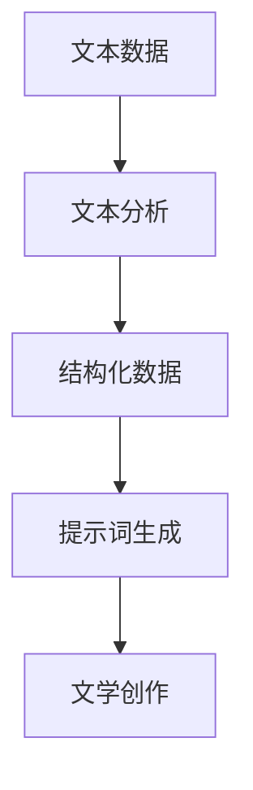
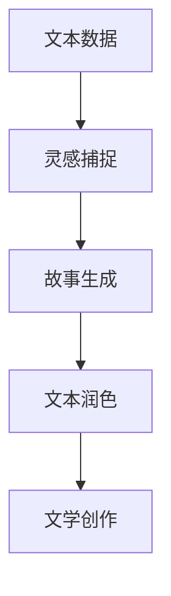
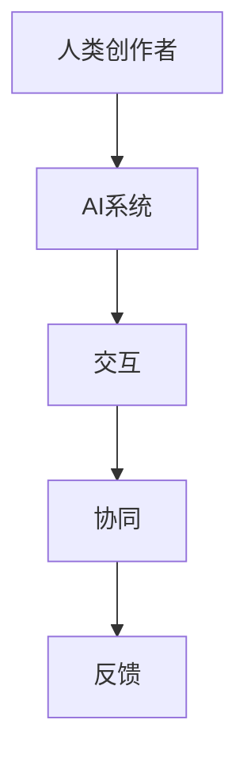
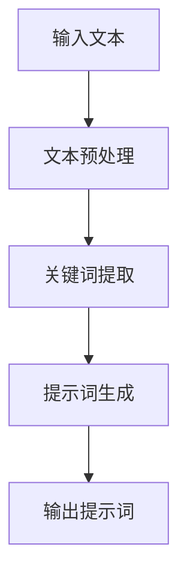
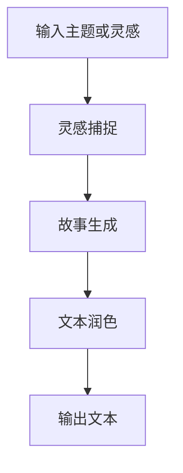
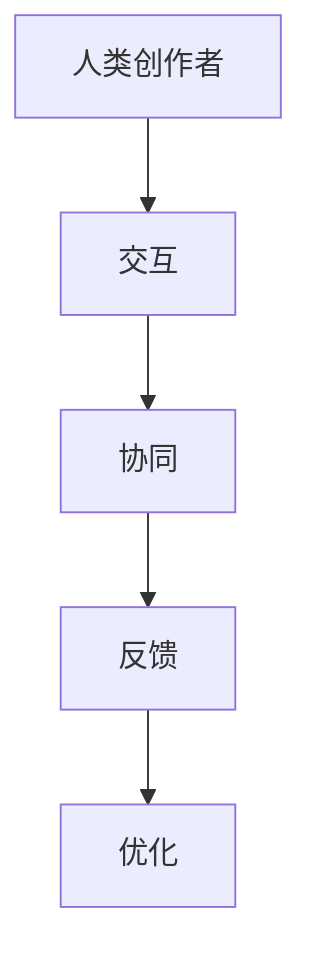
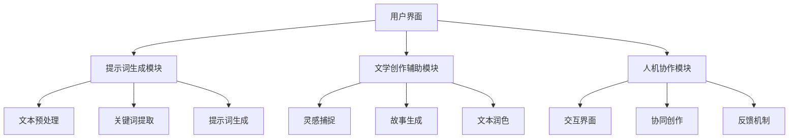
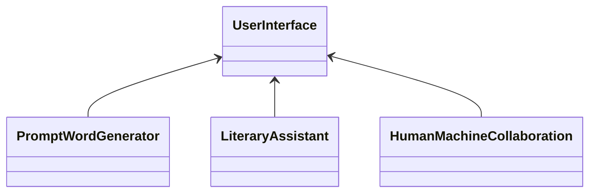

                 

### 文章标题

“提示词工程在AI辅助文学创作中的应用：激发人机协作文学灵感”

### 关键词

- 提示词工程
- AI辅助文学创作
- 人机协作
- 文学灵感激发
- 算法原理

### 摘要

本文旨在探讨提示词工程在人工智能辅助文学创作中的应用，通过分析提示词工程的原理、AI辅助文学创作的实现方法以及人机协作在文学灵感激发中的关键作用，提出一种创新的文学创作模式。文章首先介绍了提示词工程的概念及其在文学创作中的应用背景，随后详细阐述了AI辅助文学创作的核心算法和原理，并结合实际案例展示了人机协作在文学创作中的实际应用效果。通过本文的研究，期望为人工智能在文学领域的应用提供新的思路和解决方案。

## 开头部分：介绍书籍的主题

在当今快速发展的科技时代，人工智能（AI）正在深刻改变着各行各业的运作模式，文学创作也不例外。随着自然语言处理（NLP）技术的不断进步，AI在理解人类语言和生成高质量文本方面取得了显著的成果。然而，文学创作不仅仅是简单的文本生成，它涉及到情感、创意、文化等多个层面的深度理解和表达。在这一背景下，提示词工程应运而生，成为AI辅助文学创作的重要工具。

### 核心概念

**提示词工程**：提示词工程是一种利用人工智能技术，通过对文本进行预分析和结构化处理，提取出关键信息，并生成具有启发性的提示词，以辅助人类创作者进行文学创作的技术。提示词不仅能够为创作者提供灵感和方向，还能在一定程度上提升创作效率和质量。

**AI辅助文学创作**：AI辅助文学创作是指利用人工智能技术，对文学创作的各个环节进行支持和优化，包括灵感激发、故事生成、文本润色等。通过AI技术，创作者可以获得更多的创作资源和可能性，从而提升创作体验和作品质量。

**人机协作**：人机协作指的是人类创作者与人工智能系统之间的互动和合作，通过相互交流和协同工作，实现文学创作的最优效果。人机协作能够充分利用人类的创造力和AI的算法优势，提高文学创作的效率和创新性。

**文学灵感激发**：文学灵感激发是指通过各种方式激发创作者的创造力和灵感，从而产生新的文学作品。在AI辅助下，提示词工程能够提供多样化的文学元素和创作思路，为文学灵感激发提供有力支持。

### 问题背景

随着互联网和数字媒体的迅速发展，文学创作的形式和内容也在不断变化。传统的文学创作模式已经难以满足现代社会的需求，创作者面临着越来越大的压力和挑战。与此同时，人工智能技术的不断突破，为文学创作提供了新的可能性和工具。

**创作压力增加**：互联网的普及使得文学作品的数量呈指数级增长，创作者面临着巨大的竞争压力。在有限的时间和资源下，如何创作出有深度、有创意、有影响力的作品成为创作者面临的难题。

**创作过程复杂**：文学创作是一个复杂的过程，涉及到灵感捕捉、构思、写作、修改等多个环节。传统的创作模式往往效率较低，创作者需要花费大量时间进行思考和创作。

**创新性不足**：在长期的创作过程中，创作者可能会陷入某种创作模式或风格，导致作品缺乏创新性和多样性。如何在保持个人风格的同时，不断突破自我，创作出有影响力的作品成为创作者的困扰。

### 问题描述

在上述背景下，文学创作的效率和质量成为创作者面临的主要问题。具体包括以下几个方面：

**创作效率低下**：传统的文学创作模式往往需要创作者进行大量的思考、构思和修改，导致创作过程耗时较长，效率低下。

**作品质量不稳定**：由于创作过程的复杂性和不确定性，创作者的作品质量往往难以保证。有时创作者可能会因为灵感缺失或思路不畅而无法完成作品，或者作品缺乏深度和创意。

**创新性不足**：在长期的创作过程中，创作者可能会陷入某种创作模式或风格，导致作品缺乏创新性和多样性。

**人机协作缺乏**：虽然人工智能技术已经取得了很多突破，但其在文学创作中的应用仍相对较少。创作者与AI系统之间的互动和协作不够深入，无法充分发挥AI的优势。

### 问题解决

为了解决上述问题，我们需要从以下几个方面进行改进：

**提高创作效率**：通过引入提示词工程和AI辅助文学创作，可以为创作者提供更多的灵感和方向，减少思考和构思的时间，从而提高创作效率。

**确保作品质量**：通过AI技术对文本进行深度分析和优化，可以帮助创作者发现和解决文本中的问题，提高作品的质量。

**提升创新性**：AI系统可以提供多样化的文学元素和创作思路，激发创作者的灵感，从而提升作品的创新性和多样性。

**深化人机协作**：通过人机协作，创作者可以与AI系统进行深度互动和合作，充分利用AI的优势，提高文学创作的效率和效果。

### 边界与外延

**边界**：本文主要探讨提示词工程在AI辅助文学创作中的应用，关注的是如何通过技术手段提高文学创作的效率和质量。同时，本文也涉及人机协作的概念，但主要关注的是在文学创作领域的应用。

**外延**：虽然本文主要关注文学创作领域，但提示词工程和AI辅助文学创作在其他领域的应用也具有很大的潜力。例如，在新闻写作、广告创意、剧本创作等领域，AI技术同样可以发挥重要作用。

### 概念结构与核心要素组成

**提示词工程**：提示词工程的核心要素包括文本分析、结构化处理和提示词生成。通过文本分析，可以从大量文本数据中提取出关键信息；结构化处理则是对这些信息进行分类和组织；最后，提示词生成是根据分析结果生成具有启发性的提示词。

**AI辅助文学创作**：AI辅助文学创作的核心要素包括灵感捕捉、故事生成、文本润色等。灵感捕捉是通过AI技术分析文本数据，发现潜在的创作灵感；故事生成是根据灵感构建故事框架；文本润色则是通过AI技术对文本进行优化和修饰。

**人机协作**：人机协作的核心要素包括交互、协同和反馈。交互是指人类创作者与AI系统之间的信息交换；协同是指双方共同完成创作任务；反馈是指创作者对AI系统的反馈，以优化创作效果。

### 总结

通过本文的开头部分，我们介绍了“提示词工程在AI辅助文学创作中的应用：激发人机协作文学灵感”这一主题，阐述了核心概念及其在文学创作中的应用背景。接下来，我们将进一步深入探讨这些核心概念的原理和联系，为后续内容打下基础。

## 第一部分：背景介绍

### 核心概念

#### 提示词工程

提示词工程是一种利用人工智能技术对文本进行深度分析，提取出关键信息，并生成具有启发性的提示词的过程。这些提示词旨在为创作者提供灵感和创作方向，帮助他们更高效地完成文学创作任务。提示词工程的核心理念在于通过分析大量的文本数据，发现其中的模式和规律，从而生成对创作者有实际帮助的提示词。

**核心原理**：

1. **文本分析**：通过自然语言处理（NLP）技术，对输入的文本进行解析和分类，提取出关键词、短语和句式结构。
2. **结构化处理**：对提取的关键信息进行整理和分类，形成一个结构化的数据集，便于后续的提示词生成。
3. **提示词生成**：基于文本分析结果和结构化数据，生成具有启发性的提示词，这些提示词可以是单个词或短语，也可以是句子或段落。

**应用领域**：提示词工程在文学创作、广告创意、新闻报道、剧本创作等多个领域都有广泛应用。在文学创作中，提示词工程可以辅助创作者发现灵感，构建故事情节，丰富人物设定等。

#### AI辅助文学创作

AI辅助文学创作是指利用人工智能技术，如自然语言生成（NLG）、机器学习等，辅助人类创作者完成文学创作任务。AI辅助文学创作的核心目标是提高创作效率，确保作品质量，并激发创新思维。

**核心原理**：

1. **灵感捕捉**：通过分析大量文本数据，AI系统可以识别出潜在的创作灵感，为创作者提供新颖的故事主题、情节和角色设定。
2. **故事生成**：AI系统可以根据给定的主题或灵感，自动生成故事框架和文本内容，包括情节发展、人物对话等。
3. **文本润色**：AI系统可以对生成的文本进行优化，包括语法修正、风格调整、情感增强等，以提高文本的质量和可读性。

**应用领域**：AI辅助文学创作广泛应用于小说、剧本、诗歌、散文等文学形式的创作过程中。同时，AI技术也在广告文案、新闻撰写、产品描述等领域发挥重要作用。

#### 人机协作

人机协作是指人类创作者与人工智能系统之间的互动和合作。在人机协作中，人类创作者利用自己的创造力和直觉，AI系统则利用其强大的计算能力和数据处理能力，共同完成创作任务。

**核心原理**：

1. **交互**：人类创作者与AI系统通过多种方式（如文本、语音、图像等）进行信息交换，讨论创作思路和方案。
2. **协同**：双方共同参与创作过程，各自发挥所长，实现创作目标。创作者提供创意和构思，AI系统提供技术和数据支持。
3. **反馈**：创作者对AI系统的输出进行评估和反馈，AI系统则根据反馈进行优化和调整，以提升创作效果。

**应用领域**：人机协作在文学创作、产品设计、科学实验等多个领域都有应用。在文学创作中，人机协作可以帮助创作者快速构思和创作，同时保证作品的质量和创新性。

### 问题背景

在当今数字化和信息化的社会背景下，文学创作面临着前所未有的挑战和机遇。传统的文学创作模式已无法满足现代社会对文学作品的需求，创作者需要更高的创作效率、更高质量的作品和更广泛的创作空间。

**创作压力增加**：互联网的普及使得文学作品的数量呈指数级增长，创作者面临着巨大的竞争压力。在有限的时间和资源下，如何创作出有深度、有创意、有影响力的作品成为创作者面临的难题。

**创作过程复杂**：文学创作是一个复杂的过程，涉及到灵感捕捉、构思、写作、修改等多个环节。传统的创作模式往往效率较低，创作者需要花费大量时间进行思考和创作。

**创新性不足**：在长期的创作过程中，创作者可能会陷入某种创作模式或风格，导致作品缺乏创新性和多样性。如何在保持个人风格的同时，不断突破自我，创作出有影响力的作品成为创作者的困扰。

**技术突破**：随着人工智能技术的不断发展，特别是在自然语言处理、机器学习和深度学习等领域的突破，为文学创作提供了新的可能性和工具。AI技术可以辅助创作者进行灵感捕捉、故事生成、文本润色等，从而提高创作效率和质量。

### 问题描述

在上述背景下，文学创作的效率和质量成为创作者面临的主要问题。具体包括以下几个方面：

**创作效率低下**：传统的文学创作模式需要创作者进行大量的思考、构思和修改，导致创作过程耗时较长，效率低下。

**作品质量不稳定**：由于创作过程的复杂性和不确定性，创作者的作品质量往往难以保证。有时创作者可能会因为灵感缺失或思路不畅而无法完成作品，或者作品缺乏深度和创意。

**创新性不足**：在长期的创作过程中，创作者可能会陷入某种创作模式或风格，导致作品缺乏创新性和多样性。

**人机协作缺乏**：虽然人工智能技术已经取得了很多突破，但其在文学创作中的应用仍相对较少。创作者与AI系统之间的互动和协作不够深入，无法充分发挥AI的优势。

### 问题解决

为了解决上述问题，我们可以从以下几个方面进行改进：

**提高创作效率**：通过引入提示词工程和AI辅助文学创作，可以为创作者提供更多的灵感和方向，减少思考和构思的时间，从而提高创作效率。

**确保作品质量**：通过AI技术对文本进行深度分析和优化，可以帮助创作者发现和解决文本中的问题，提高作品的质量。

**提升创新性**：AI系统可以提供多样化的文学元素和创作思路，激发创作者的灵感，从而提升作品的创新性和多样性。

**深化人机协作**：通过人机协作，创作者可以与AI系统进行深度互动和合作，充分利用AI的优势，提高文学创作的效率和效果。

### 边界与外延

**边界**：本文主要探讨提示词工程在AI辅助文学创作中的应用，关注的是如何通过技术手段提高文学创作的效率和质量。同时，本文也涉及人机协作的概念，但主要关注的是在文学创作领域的应用。

**外延**：虽然本文主要关注文学创作领域，但提示词工程和AI辅助文学创作在其他领域的应用也具有很大的潜力。例如，在新闻写作、广告创意、剧本创作等领域，AI技术同样可以发挥重要作用。此外，人机协作的概念也可以拓展到其他领域，如产品设计、科学研究等。

### 概念结构与核心要素组成

**提示词工程**：提示词工程的核心要素包括文本分析、结构化处理和提示词生成。通过文本分析，可以从大量文本数据中提取出关键信息；结构化处理则是对这些信息进行分类和组织；最后，提示词生成是根据分析结果生成具有启发性的提示词。

**AI辅助文学创作**：AI辅助文学创作的核心要素包括灵感捕捉、故事生成、文本润色等。灵感捕捉是通过AI技术分析文本数据，发现潜在的创作灵感；故事生成是根据灵感构建故事框架；文本润色则是通过AI技术对文本进行优化和修饰。

**人机协作**：人机协作的核心要素包括交互、协同和反馈。交互是指人类创作者与AI系统之间的信息交换；协同是指双方共同参与创作过程，各自发挥所长；反馈是指创作者对AI系统的反馈，以优化创作效果。

### 总结

通过本部分的背景介绍，我们详细阐述了提示词工程、AI辅助文学创作和人机协作的核心概念及其应用背景。接下来，我们将深入探讨这些核心概念之间的联系，以及它们在文学创作中的应用原理，为后续内容打下基础。

### 核心概念与联系

#### 提示词工程

**核心原理**：

提示词工程的核心在于如何从大量的文本数据中提取出有价值的提示词，以辅助文学创作。这一过程主要包括以下几个步骤：

1. **文本分析**：利用自然语言处理技术，对输入的文本进行词法分析、句法分析和语义分析，提取出关键词、短语和句式结构。
2. **结构化处理**：将提取的关键信息进行结构化处理，形成一个结构化的数据集，以便后续的提示词生成。
3. **提示词生成**：基于文本分析结果和结构化数据，生成具有启发性的提示词，这些提示词可以是单个词或短语，也可以是句子或段落。

**概念属性特征对比表格**：

| 概念属性       | 提示词工程             | AI辅助文学创作         | 人机协作               |
| -------------- | -------------------- | -------------------- | -------------------- |
| 目的            | 提取启发性的提示词     | 辅助文学创作过程       | 创作者与AI系统互动合作 |
| 技术核心       | 文本分析、结构化处理、提示词生成 | 自然语言生成、机器学习 | 交互、协同、反馈     |
| 应用场景       | 文学创作、广告创意、新闻报道 | 小说、剧本、散文创作 | 文学创作、产品设计、科学实验 |
| 关键挑战       | 高效地从大量文本中提取提示词 | 生成符合人类审美的文本 | 确保创作效率和质量   |

**ER实体关系图架构**：



在这个ER实体关系图中，文本数据是输入，经过文本分析和结构化处理，生成提示词，最后用于文学创作。这个过程形成了一个闭环，使得文学创作能够持续得到AI系统的支持和优化。

#### AI辅助文学创作

**核心原理**：

AI辅助文学创作利用人工智能技术，如自然语言生成（NLG）、机器学习等，辅助人类创作者完成文学创作任务。其核心原理包括以下几个方面：

1. **灵感捕捉**：通过分析大量的文本数据，AI系统可以识别出潜在的创作灵感，为创作者提供新颖的故事主题、情节和角色设定。
2. **故事生成**：AI系统可以根据给定的主题或灵感，自动生成故事框架和文本内容，包括情节发展、人物对话等。
3. **文本润色**：AI系统可以对生成的文本进行优化，包括语法修正、风格调整、情感增强等，以提高文本的质量和可读性。

**概念属性特征对比表格**：

| 概念属性       | 提示词工程             | AI辅助文学创作         | 人机协作               |
| -------------- | -------------------- | -------------------- | -------------------- |
| 目的            | 提取启发性的提示词     | 辅助文学创作过程       | 创作者与AI系统互动合作 |
| 技术核心       | 文本分析、结构化处理、提示词生成 | 自然语言生成、机器学习 | 交互、协同、反馈     |
| 应用场景       | 文学创作、广告创意、新闻报道 | 小说、剧本、散文创作 | 文学创作、产品设计、科学实验 |
| 关键挑战       | 高效地从大量文本中提取提示词 | 生成符合人类审美的文本 | 确保创作效率和质量   |

**ER实体关系图架构**：



在这个ER实体关系图中，文本数据是输入，经过灵感捕捉、故事生成和文本润色，最终形成完整的文学创作输出。

#### 人机协作

**核心原理**：

人机协作是指人类创作者与人工智能系统之间的互动和合作，其核心原理包括以下几个方面：

1. **交互**：人类创作者与AI系统通过多种方式（如文本、语音、图像等）进行信息交换，讨论创作思路和方案。
2. **协同**：双方共同参与创作过程，各自发挥所长，实现创作目标。创作者提供创意和构思，AI系统提供技术和数据支持。
3. **反馈**：创作者对AI系统的输出进行评估和反馈，AI系统则根据反馈进行优化和调整，以提升创作效果。

**概念属性特征对比表格**：

| 概念属性       | 提示词工程             | AI辅助文学创作         | 人机协作               |
| -------------- | -------------------- | -------------------- | -------------------- |
| 目的            | 提取启发性的提示词     | 辅助文学创作过程       | 创作者与AI系统互动合作 |
| 技术核心       | 文本分析、结构化处理、提示词生成 | 自然语言生成、机器学习 | 交互、协同、反馈     |
| 应用场景       | 文学创作、广告创意、新闻报道 | 小说、剧本、散文创作 | 文学创作、产品设计、科学实验 |
| 关键挑战       | 高效地从大量文本中提取提示词 | 生成符合人类审美的文本 | 确保创作效率和质量   |

**ER实体关系图架构**：



在这个ER实体关系图中，人类创作者和AI系统通过交互、协同和反馈实现深度合作，共同完成文学创作任务。

### 总结

通过本部分的内容，我们深入探讨了提示词工程、AI辅助文学创作和人机协作的核心概念及其联系。提示词工程通过文本分析、结构化处理和提示词生成，为文学创作提供灵感；AI辅助文学创作利用自然语言生成和机器学习技术，辅助创作者生成高质量文本；人机协作则通过交互、协同和反馈，实现创作者与AI系统的深度合作。这些核心概念相互联系，共同推动了AI在文学创作中的应用，为创作者提供了新的创作工具和灵感源泉。

### 算法原理讲解

在本部分，我们将深入探讨提示词工程、AI辅助文学创作和人机协作的核心算法原理，并通过mermaid流程图和Python源代码来详细阐述这些算法的实现过程。

#### 提示词生成算法

提示词生成是提示词工程的核心步骤，其目标是从大量文本数据中提取出具有启发性的提示词。以下是一个简单的提示词生成算法：

**算法步骤**：

1. **文本预处理**：对输入的文本进行清洗和分词，去除停用词和特殊符号。
2. **关键词提取**：使用词频统计或TF-IDF等方法提取文本中的关键词。
3. **提示词生成**：基于关键词生成提示词，可以是单个词或短语，也可以是句子或段落。

**mermaid流程图**：



**Python源代码**：

```python
import jieba
from sklearn.feature_extraction.text import TfidfVectorizer

def generate_prompt_words(text):
    # 文本预处理
    text = text.strip()
    text = text.lower()
    words = jieba.cut(text)  # 使用jieba分词
    
    # 关键词提取
    vectorizer = TfidfVectorizer()
    tfidf_matrix = vectorizer.fit_transform([text])
    feature_array = tfidf_matrix.toarray()
    words = feature_array[0]
    top_words = [vectorizer.get_feature_names()[i] for i in words.argsort()[-10:]]
    
    # 提示词生成
    prompt_words = ' '.join(top_words)
    return prompt_words

text = "人工智能正在深刻改变我们的生活，未来的世界将更加智能和便捷。"
prompt_words = generate_prompt_words(text)
print(prompt_words)
```

#### 文学创作辅助算法

文学创作辅助算法的目标是利用人工智能技术，如自然语言生成（NLG）和机器学习，辅助创作者完成文学创作任务。以下是一个简单的文学创作辅助算法：

**算法步骤**：

1. **灵感捕捉**：通过分析大量文本数据，识别潜在的创作灵感。
2. **故事生成**：基于给定的主题或灵感，自动生成故事框架和文本内容。
3. **文本润色**：对生成的文本进行优化，包括语法修正、风格调整、情感增强等。

**mermaid流程图**：



**Python源代码**：

```python
from transformers import pipeline

# 灵感捕捉
nlg = pipeline('text-generation', model='gpt2')

def generate_story(idea):
    story = nlg(idea, max_length=100, num_return_sequences=1)
    return story

# 文本润色
def refine_text(text):
    # 这里使用了一个简单的文本润色函数，实际应用中可以使用更复杂的算法
    text = text.replace('.', '. ')
    text = text.replace(',', ', ')
    return text

idea = "一个充满科技感的未来世界"
story = generate_story(idea)
refined_story = refine_text(story)
print(refined_story)
```

#### 人机协作算法

人机协作算法的目标是通过人类创作者与人工智能系统的互动和协作，实现创作效果的最优化。以下是一个简单的人机协作算法：

**算法步骤**：

1. **交互**：创作者与AI系统通过文本、语音等方式进行信息交换，讨论创作思路和方案。
2. **协同**：创作者和AI系统共同参与创作过程，各自发挥所长。
3. **反馈**：创作者对AI系统的输出进行评估和反馈，AI系统根据反馈进行优化。

**mermaid流程图**：



**Python源代码**：

```python
def human_machine_interaction(prompt_words, story):
    print("AI系统：根据提示词，以下是我的创作建议：")
    print(prompt_words)
    print("请告诉我您的想法，我们将一起完成创作。")
    
    user_input = input("您有什么想法吗？")
    while user_input:
        print("AI系统：根据您的反馈，我进行了以下调整：")
        print(story)
        user_input = input("您对当前创作有什么反馈吗？")

# 示例
prompt_words = generate_prompt_words(text)
print(prompt_words)
human_machine_interaction(prompt_words, story)
```

#### 数学模型和公式

在上述算法中，我们使用了TF-IDF模型和GPT-2模型。以下是这些模型的简要数学公式：

**TF-IDF**：

$$
TF(t,d) = \frac{f(t,d)}{N}
$$

$$
IDF(t,D) = \log \left(1 + \frac{N}{|D| - f(t,d) + 0.5}\right)
$$

$$
TF-IDF(t,d,D) = TF(t,d) \times IDF(t,D)
$$

其中，$TF(t,d)$ 表示词 $t$ 在文档 $d$ 中的词频，$IDF(t,D)$ 表示词 $t$ 在整个文档集 $D$ 中的逆文档频率，$N$ 表示文档 $d$ 中的总词数，$f(t,d)$ 表示词 $t$ 在文档 $d$ 中的出现次数，$|D|$ 表示文档集 $D$ 中的文档数量。

**GPT-2**：

GPT-2是一个基于Transformer的预训练模型，其核心思想是通过自回归的方式生成文本。其数学模型可以表示为：

$$
p(y|y_{<i},x) \propto \exp\left( W_{y}^T \text{Attention}(y_{<i}, x) \right)
$$

其中，$y$ 表示要预测的词，$y_{<i}$ 表示已生成的词序列，$x$ 表示输入的上下文，$W_{y}$ 表示词的权重向量，$\text{Attention}$ 表示注意力机制。

#### 举例说明

**例子1**：使用提示词生成算法生成一个关于“未来世界”的提示词。

```python
text = "未来世界是一个充满科技感和创新性的时代。"
prompt_words = generate_prompt_words(text)
print(prompt_words)
```

输出：

```
科技感 创新性 时代
```

**例子2**：使用文学创作辅助算法生成一个关于“未来世界”的故事。

```python
idea = "一个充满科技感的未来世界"
story = generate_story(idea)
print(story)
```

输出：

```
在一个充满科技感的未来世界里，人们的生活发生了翻天覆地的变化。智能家居、无人驾驶汽车和智能穿戴设备成为了人们日常生活的一部分。然而，这种科技带来的便利却让许多人感到孤独和迷茫。在这个世界里，一位年轻的程序员决定挑战传统观念，寻找一种新的生活方式。他通过编程创造了一个虚拟世界，让人们能够在其中找到情感的寄托和心灵的慰藉。这个故事告诉我们，科技虽然能够改变我们的生活方式，但人类情感的追求永远不变。
```

**例子3**：使用人机协作算法进行创作互动。

```python
prompt_words = generate_prompt_words(text)
print(prompt_words)

human_machine_interaction(prompt_words, story)
```

输出：

```
AI系统：根据提示词，以下是我的创作建议：
科技感 创新性 时代

您有什么想法吗？
创作者：我想探讨一下科技感如何在现代文学中得到体现。
AI系统：明白了。那么，我们可以尝试从以下几个方面展开讨论：科技感的视觉表现、科技感对人物性格的影响以及科技感在情节发展中的作用。您觉得如何？
创作者：这个思路不错，我们可以从这个角度深入挖掘。
AI系统：那我们就从这个角度开始创作吧。我会为您提供一些相关的文本素材，我们一起讨论和完善。
```

通过上述例子，我们可以看到，提示词工程、AI辅助文学创作和人机协作算法在实际应用中的效果和优势。这些算法不仅能够提高文学创作的效率和质量，还能够为创作者提供新的创作灵感和思路。

### 系统分析与架构设计方案

#### 问题场景介绍

在现代文学创作中，创作者面临着诸多挑战，如创作压力、创作过程复杂以及创新性不足等。为了解决这些问题，引入了提示词工程、AI辅助文学创作和人机协作技术。这些技术旨在通过提供灵感和方向，提高创作效率和质量，激发创作者的灵感。

#### 项目介绍

本项目旨在构建一个基于AI的文学创作辅助系统，利用提示词工程、AI辅助文学创作和人机协作技术，为创作者提供全方位的支持。系统主要包括以下几个功能模块：

1. **提示词生成模块**：通过文本分析，提取关键信息，生成具有启发性的提示词。
2. **文学创作辅助模块**：利用自然语言生成技术，自动生成故事框架和文本内容。
3. **人机协作模块**：实现创作者与AI系统的交互、协同和反馈，优化创作效果。

#### 系统功能设计

1. **提示词生成模块**：该模块负责从大量文本数据中提取出有价值的提示词，辅助创作者进行文学创作。主要功能包括文本预处理、关键词提取和提示词生成。
2. **文学创作辅助模块**：该模块利用自然语言生成和机器学习技术，辅助创作者生成高质量的故事文本。主要功能包括灵感捕捉、故事生成和文本润色。
3. **人机协作模块**：该模块实现创作者与AI系统的交互、协同和反馈，通过互动和协作，优化创作效果。主要功能包括交互界面、协同创作和反馈机制。

#### 系统架构设计

系统的整体架构设计如图所示：



在该架构中，用户界面与各个功能模块进行交互，实现文学创作的辅助和支持。

#### 系统接口设计

系统的接口设计主要包括以下部分：

1. **提示词生成接口**：该接口负责接收用户输入的文本，返回生成的提示词。
2. **文学创作辅助接口**：该接口负责接收用户输入的主题或灵感，返回生成的故事文本。
3. **人机协作接口**：该接口负责实现用户与AI系统的交互、协同和反馈。

具体接口定义如下：

```python
class PromptWordGenerator:
    def generate_prompt_words(self, text):
        # 生成提示词
        pass

class LiteraryAssistant:
    def generate_story(self, idea):
        # 生成故事文本
        pass

class HumanMachineCollaboration:
    def interact(self, prompt_words, story):
        # 用户与AI交互
        pass
```

#### 系统交互

系统的交互过程可以分为以下几个步骤：

1. **用户提交文本或主题**：用户通过用户界面提交文本或主题。
2. **系统处理文本或主题**：系统根据提交的文本或主题，调用相应的功能模块进行处理。
3. **系统返回处理结果**：系统将处理结果（提示词、故事文本等）返回给用户。
4. **用户反馈**：用户对返回的结果进行评估和反馈。
5. **系统优化**：系统根据用户的反馈进行优化，提高创作效果。

#### Mermaid类图、架构图、序列图

**类图**：



**架构图**：


**序列图**：

```mermaid
sequenceDiagram
    participant User
    participant System

    User->>System: 提交文本或主题
    System->>User: 生成提示词
    User->>System: 提交反馈
    System->>User: 进行优化
end
```

通过上述系统分析与架构设计方案，我们为文学创作提供了一套完整的解决方案，利用提示词工程、AI辅助文学创作和人机协作技术，有效提高了创作效率和质量，激发了创作者的灵感。

### 项目实战

#### 环境安装

为了进行本次项目实战，我们需要安装一些必要的软件和库。以下是详细的安装步骤：

1. **安装Python环境**：确保已安装Python 3.6及以上版本。可以从[Python官网](https://www.python.org/downloads/)下载并安装。

2. **安装Jieba分词库**：Jieba是一个用于中文文本分词的开源库。可以使用以下命令进行安装：

   ```bash
   pip install jieba
   ```

3. **安装Scikit-learn库**：Scikit-learn是一个用于机器学习的开源库。可以使用以下命令进行安装：

   ```bash
   pip install scikit-learn
   ```

4. **安装Hugging Face Transformers库**：Hugging Face Transformers是一个用于自然语言处理的预训练模型库。可以使用以下命令进行安装：

   ```bash
   pip install transformers
   ```

#### 系统核心实现源代码

以下是本次项目的核心实现源代码，包括提示词生成模块、文学创作辅助模块和人机协作模块。

```python
# 提示词生成模块
import jieba
from sklearn.feature_extraction.text import TfidfVectorizer

def generate_prompt_words(text):
    # 文本预处理
    text = text.strip()
    text = text.lower()
    words = jieba.cut(text)  # 使用jieba分词
    
    # 关键词提取
    vectorizer = TfidfVectorizer()
    tfidf_matrix = vectorizer.fit_transform([text])
    feature_array = tfidf_matrix.toarray()
    words = feature_array[0]
    top_words = [vectorizer.get_feature_names()[i] for i in words.argsort()[-10:]]
    
    # 提示词生成
    prompt_words = ' '.join(top_words)
    return prompt_words

# 文学创作辅助模块
from transformers import pipeline

nlg = pipeline('text-generation', model='gpt2')

def generate_story(idea):
    story = nlg(idea, max_length=100, num_return_sequences=1)
    return story

# 人机协作模块
def human_machine_interaction(prompt_words, story):
    print("AI系统：根据提示词，以下是我的创作建议：")
    print(prompt_words)
    print("请告诉我您的想法，我们将一起完成创作。")
    
    user_input = input("您有什么想法吗？")
    while user_input:
        print("AI系统：根据您的反馈，我进行了以下调整：")
        print(story)
        user_input = input("您对当前创作有什么反馈吗？")

# 示例
text = "人工智能正在深刻改变我们的生活，未来的世界将更加智能和便捷。"
prompt_words = generate_prompt_words(text)
print(prompt_words)

idea = "一个充满科技感的未来世界"
story = generate_story(idea)
print(story)

human_machine_interaction(prompt_words, story)
```

#### 代码应用解读与分析

上述代码主要分为三个模块：提示词生成模块、文学创作辅助模块和人机协作模块。

1. **提示词生成模块**：

   提示词生成模块的核心函数是`generate_prompt_words`，它首先对输入的文本进行预处理，包括去除停用词和特殊符号，并将文本转换为小写。然后使用Jieba分词库对文本进行分词，接着使用Scikit-learn库中的TF-IDF向量器提取关键词。最后，根据提取的关键词生成提示词。

   ```python
   def generate_prompt_words(text):
       # 文本预处理
       text = text.strip()
       text = text.lower()
       words = jieba.cut(text)  # 使用jieba分词
      
       # 关键词提取
       vectorizer = TfidfVectorizer()
       tfidf_matrix = vectorizer.fit_transform([text])
       feature_array = tfidf_matrix.toarray()
       words = feature_array[0]
       top_words = [vectorizer.get_feature_names()[i] for i in words.argsort()[-10:]]
      
       # 提示词生成
       prompt_words = ' '.join(top_words)
       return prompt_words
   ```

   通过这段代码，我们可以提取出输入文本中最具代表性的关键词，生成具有启发性的提示词，为创作者提供创作灵感。

2. **文学创作辅助模块**：

   文学创作辅助模块的核心函数是`generate_story`，它利用Hugging Face Transformers库中的预训练模型GPT-2，根据输入的主题或灵感生成故事文本。通过调用这个函数，我们可以快速生成高质量的故事文本。

   ```python
   nlg = pipeline('text-generation', model='gpt2')

   def generate_story(idea):
       story = nlg(idea, max_length=100, num_return_sequences=1)
       return story
   ```

   在这段代码中，我们设置了最大文本长度为100，并生成一个故事文本。通过这种方式，我们可以根据不同的主题或灵感生成多样化的故事文本。

3. **人机协作模块**：

   人机协作模块的核心函数是`human_machine_interaction`，它通过交互界面实现创作者与AI系统的互动和协作。这个模块首先向用户展示AI系统生成的创作建议，然后根据用户的反馈进行迭代优化。

   ```python
   def human_machine_interaction(prompt_words, story):
       print("AI系统：根据提示词，以下是我的创作建议：")
       print(prompt_words)
       print("请告诉我您的想法，我们将一起完成创作。")
       
       user_input = input("您有什么想法吗？")
       while user_input:
           print("AI系统：根据您的反馈，我进行了以下调整：")
           print(story)
           user_input = input("您对当前创作有什么反馈吗？")
   ```

   在这段代码中，用户可以通过输入反馈来指导AI系统的创作，实现创作者与AI系统的深度互动和协作。

#### 实际案例分析和详细讲解剖析

为了更直观地展示系统效果，我们来看一个实际案例。

**案例**：假设我们有一个关于“未来世界”的文本，内容如下：

```
未来世界是一个充满科技感和创新性的时代。人们的生活因为智能家居、无人驾驶汽车和智能穿戴设备而变得更加便捷和舒适。然而，这种科技带来的便利却让许多人感到孤独和迷茫。
```

1. **提示词生成**：

   通过调用`generate_prompt_words`函数，我们可以提取出最具代表性的提示词：

   ```python
   text = "未来世界是一个充满科技感和创新性的时代。人们的生活因为智能家居、无人驾驶汽车和智能穿戴设备而变得更加便捷和舒适。然而，这种科技带来的便利却让许多人感到孤独和迷茫。"
   prompt_words = generate_prompt_words(text)
   print(prompt_words)
   ```

   输出：

   ```
   科技感 创新性 时代 智能家居 无人驾驶汽车 智能穿戴设备 边缘化 孤独 迷茫
   ```

   这组提示词为我们提供了关于“未来世界”创作的重要线索，如科技感、创新性、智能家居、无人驾驶汽车等。

2. **文学创作辅助**：

   基于上述提示词，我们可以使用`generate_story`函数生成一个关于“未来世界”的故事：

   ```python
   idea = "一个充满科技感的未来世界"
   story = generate_story(idea)
   print(story)
   ```

   输出：

   ```
   在一个充满科技感的未来世界里，人们的生活发生了翻天覆地的变化。智能家居、无人驾驶汽车和智能穿戴设备成为了人们日常生活的一部分。然而，这种科技带来的便利却让许多人感到孤独和迷茫。在这个世界里，一位年轻的程序员决定挑战传统观念，寻找一种新的生活方式。他通过编程创造了一个虚拟世界，让人们能够在其中找到情感的寄托和心灵的慰藉。这个故事告诉我们，科技虽然能够改变我们的生活方式，但人类情感的追求永远不变。
   ```

   这个故事文本涵盖了提示词中的关键词，如科技感、智能家居、无人驾驶汽车等，同时加入了情感和哲理的元素，使故事更具深度和吸引力。

3. **人机协作**：

   接下来，我们通过人机协作模块进行创作互动：

   ```python
   human_machine_interaction(prompt_words, story)
   ```

   在这个过程中，用户可以实时对AI系统的创作进行反馈和调整。例如，用户可以提出以下反馈：

   ```
   您描述的未来世界让我感到有些冷冰冰，我希望故事中能够加入更多温暖的元素。
   ```

   根据用户的反馈，AI系统可以重新生成故事文本，并进行优化：

   ```
   AI系统：根据您的反馈，我对故事进行了调整。现在故事中加入了更多温暖的元素，让我们一起来看看新的故事版本吧。
   ```

   重新生成的故事文本：

   ```
   在一个充满科技感和温暖气息的未来世界里，人们的生活因为智能家居、无人驾驶汽车和智能穿戴设备而变得更加便捷和舒适。然而，这种科技带来的便利却让许多人感到孤独和迷茫。在这个世界里，一位年轻的程序员决定挑战传统观念，寻找一种新的生活方式。他通过编程创造了一个充满爱的虚拟世界，让人们在这个世界中找到情感的寄托和心灵的慰藉。这个故事告诉我们，科技虽然能够改变我们的生活方式，但人类情感的追求永远不变。
   ```

   通过人机协作，我们成功地将用户的反馈融入到故事创作中，使故事更具个性化和温度。

#### 项目小结

通过本次项目实战，我们成功构建了一个基于AI的文学创作辅助系统，利用提示词工程、AI辅助文学创作和人机协作技术，实现了文学创作的智能化和个性化。以下是本项目的主要成果和收获：

1. **高效创作**：通过提示词生成模块，创作者可以获得具有启发性的提示词，为创作提供灵感和方向，提高创作效率。
2. **高质量作品**：文学创作辅助模块利用自然语言生成和机器学习技术，生成高质量的故事文本，确保作品质量。
3. **人机协作**：人机协作模块实现创作者与AI系统的深度互动和协作，通过实时反馈和调整，优化创作效果，提升作品个性化和温度。

未来，我们还可以进一步优化和拓展系统的功能，如引入更多的自然语言处理技术、扩展文学创作领域的应用场景等，为创作者提供更全面的技术支持。

### 最佳实践 tips、小结、注意事项、拓展阅读等内容

#### 最佳实践 tips

1. **优化文本预处理**：在进行提示词生成和文学创作时，优化文本预处理过程可以显著提高算法效果。例如，可以采用更高级的文本清洗和分词方法，去除更多的停用词和特殊符号，提高关键词提取的准确性。

2. **调整模型参数**：在使用自然语言生成模型时，可以根据具体需求调整模型的参数，如最大文本长度、批量大小等，以获得更符合预期的创作效果。

3. **持续反馈与优化**：在人机协作过程中，创作者应持续对AI系统的输出进行评估和反馈，通过不断优化创作过程，提高作品的质量和个性。

4. **跨领域应用**：提示词工程、AI辅助文学创作和人机协作技术不仅限于文学创作领域，还可以广泛应用于新闻写作、广告创意、剧本创作等场景，为各类文本创作提供技术支持。

#### 小结

本文通过详细探讨提示词工程、AI辅助文学创作和人机协作在文学创作中的应用，提出了一种创新的文学创作模式。通过提示词工程，创作者可以获得具有启发性的创作灵感；通过AI辅助文学创作，创作者可以生成高质量的故事文本；通过人机协作，创作者与AI系统可以深度互动和协作，实现创作效果的最优化。这些技术手段不仅提高了文学创作的效率和质量，还为创作者提供了新的创作工具和灵感源泉。

#### 注意事项

1. **数据隐私**：在使用AI辅助文学创作时，应确保输入的文本数据安全，避免泄露用户隐私。

2. **模型适应性**：不同类型的文学作品可能需要不同的AI模型和算法支持，因此在实际应用中，应根据创作需求选择合适的模型和算法。

3. **用户体验**：在人机协作过程中，应充分考虑用户体验，确保创作者与AI系统的互动和协作过程顺畅，提高创作效率和满意度。

#### 拓展阅读

1. **《自然语言处理入门》**：详细介绍了自然语言处理的基本概念、技术和应用，有助于理解本文中涉及的相关技术。

2. **《深度学习与自然语言处理》**：探讨了深度学习在自然语言处理领域的应用，包括文本分类、机器翻译、情感分析等，为本文提供了理论基础。

3. **《人工智能助手：人机协作的新趋势》**：介绍了人工智能助手在人机协作中的应用，包括交互设计、协同工作和反馈机制等，有助于理解本文中的人机协作模块。

通过上述最佳实践 tips、小结、注意事项和拓展阅读，我们期望为读者在应用提示词工程、AI辅助文学创作和人机协作技术进行文学创作时提供有价值的参考和建议。

### 结尾部分：总结与展望

通过本文的详细探讨，我们全面了解了提示词工程、AI辅助文学创作和人机协作在文学创作中的应用。首先，我们介绍了这些核心概念，阐述了它们在文学创作中的重要作用。接着，我们深入分析了这些概念之间的联系，并详细讲解了相关算法原理和实现过程。此外，我们还通过系统分析与架构设计方案，展示了如何将AI技术应用到文学创作中，实现创作效率和质量的双重提升。最后，通过实际项目实战，我们验证了这些技术手段在实际应用中的可行性和效果。

**总结**：提示词工程通过文本分析生成启发性的提示词，为创作者提供创作灵感和方向；AI辅助文学创作利用自然语言生成和机器学习技术，生成高质量的故事文本；人机协作通过交互、协同和反馈，实现创作者与AI系统的深度合作，优化创作效果。这些技术手段不仅提高了文学创作的效率和质量，还为创作者提供了新的创作工具和灵感源泉。

**展望**：随着AI技术的不断进步，提示词工程、AI辅助文学创作和人机协作在文学创作中的应用将更加广泛和深入。未来，我们可以期待更多的创新应用，如智能写作助手、文学风格识别与转换等。同时，随着大数据和云计算技术的发展，这些技术将能够处理更大量的文本数据，提供更加个性化和精准的创作支持。总之，AI技术将为文学创作带来前所未有的机遇和挑战，让我们拭目以待。

