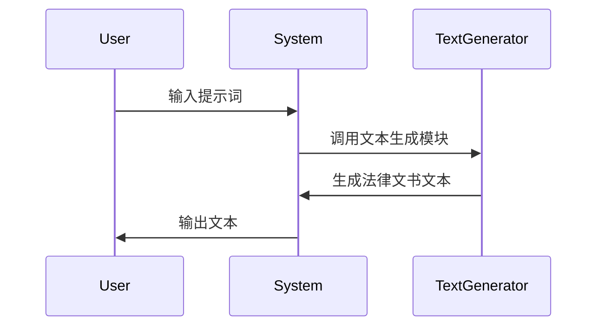

                 

# 提示词工程在AI辅助法律文书生成中的实践

## 关键词
- 人工智能，法律文书生成，提示词工程，AI辅助，算法，Python实现，系统架构

## 摘要
本文旨在探讨提示词工程在AI辅助法律文书生成中的应用。首先，我们介绍了法律文书生成的现状及人工智能在法律领域的应用背景，然后详细阐述了提示词工程的基本概念和原理。接着，本文通过一步步的分析和推理，详细讲解了提示词工程在AI辅助法律文书生成中的应用策略，包括系统架构设计、算法原理和实现、系统接口设计和系统交互等。此外，我们还讨论了提示词工程在AI辅助法律文书生成中的最佳实践与注意事项，并对未来发展趋势进行了展望。通过本文的深入探讨，读者可以全面了解和掌握提示词工程在AI辅助法律文书生成中的实践应用。

## 第一部分：背景介绍

### 1.1 问题背景

#### 1.1.1 法律文书的生成现状

法律文书是法律实践中不可或缺的重要工具，包括合同、判决书、申诉书、起诉状等。传统的法律文书生成主要依赖于律师和法务人员的经验和专业知识，效率较低，且易出现错误。随着法律文书的数量不断增加，传统的手工编写方式已无法满足现代法律工作的需求。

#### 1.1.2 人工智能在法律领域的应用

人工智能（AI）在法律领域的应用日益广泛，如合同审核、案件预测、法律文书生成等。AI具有强大的数据处理能力和自学习能力，可以大幅度提高法律工作的效率和准确性。

#### 1.1.3 提示词工程的概念与应用

提示词工程是一种基于提示词的文本生成技术，通过输入关键词或短语，自动生成相关的文本内容。在法律领域，提示词工程可以用于自动生成法律文书，如合同、判决书等，提高法律工作的效率。

### 1.2 问题描述

#### 1.2.1 法律文书生成的难点

法律文书生成涉及复杂的法律术语和逻辑结构，传统的人工编写方式存在效率低、错误率高、重复劳动等问题。而AI辅助的法律文书生成需要解决文本生成质量、法律条款的准确性和合规性等问题。

#### 1.2.2 提示词工程在法律文书生成中的应用

提示词工程可以通过对大量法律文书的分析，提取出关键的法律术语和逻辑结构，形成提示词库。在生成法律文书时，输入关键词或短语，提示词工程可以根据提示词库自动生成相关的法律文书。

#### 1.2.3 提示词工程的优势与挑战

提示词工程在法律文书生成中具有以下优势：提高生成效率、降低错误率、保证法律条款的准确性和合规性。然而，提示词工程也面临以下挑战：法律术语的多样性、法律条款的复杂性和法律合规性的要求。

### 1.3 问题解决

#### 1.3.1 提示词工程的定义与核心要素

提示词工程是一种基于提示词的文本生成技术，其核心要素包括提示词库、文本生成模型和后处理模块。

#### 1.3.2 提示词工程的实现流程

提示词工程的实现流程包括数据收集、数据预处理、提示词提取、文本生成和后处理等步骤。

#### 1.3.3 提示词工程在法律文书生成中的应用策略

提示词工程在法律文书生成中的应用策略包括：构建法律文书提示词库、设计文本生成模型、实现文本生成和后处理等。

### 1.4 边界与外延

#### 1.4.1 提示词工程的适用范围

提示词工程主要适用于合同、判决书、申诉书、起诉状等法律文书的生成。

#### 1.4.2 提示词工程的限制条件

提示词工程的限制条件包括：法律术语的多样性、法律条款的复杂性和法律合规性的要求。

#### 1.4.3 提示词工程与其他相关技术的比较

提示词工程与其他相关技术（如自然语言生成、法律知识图谱等）的比较，包括技术特点、适用范围和优缺点等。

### 1.5 概念结构与核心要素组成

#### 1.5.1 提示词工程的基本概念

提示词工程是一种基于提示词的文本生成技术，其核心概念包括提示词、提示词库、文本生成模型和后处理模块。

#### 1.5.2 提示词工程的关键组成部分

提示词工程的关键组成部分包括：提示词库、文本生成模型和后处理模块。

#### 1.5.3 提示词工程的核心要素之间的关系

提示词工程的核心要素之间关系密切，提示词库是文本生成的基础，文本生成模型负责生成文本内容，后处理模块负责对生成的文本进行格式化和校对。

### 1.6 本章小结

本部分介绍了法律文书生成的现状和人工智能在法律领域的应用背景，详细阐述了提示词工程的基本概念、优势与挑战，以及问题解决的方法和应用策略。通过本章的介绍，读者可以初步了解提示词工程在法律文书生成中的应用。

## 第二部分：提示词工程原理与算法

### 2.1 核心概念与原理

#### 2.1.1 提示词的定义与作用

提示词是指用于触发文本生成的关键词或短语，它们通常包含了一定的语义信息，能够引导文本生成模型生成相关的文本内容。

#### 2.1.2 提示词工程的原理

提示词工程是一种基于提示词的文本生成技术，其核心原理是通过构建提示词库和文本生成模型，利用提示词引导文本生成过程。

#### 2.1.3 提示词工程的核心算法

提示词工程的核心算法包括提示词提取、文本生成和后处理等步骤。其中，提示词提取是通过分析大量文本数据，提取出具有代表性的关键词或短语；文本生成是基于提示词和预训练的语言模型，生成相关的文本内容；后处理是对生成的文本进行格式化和校对，以提高文本质量。

### 2.2 概念属性特征对比表格

| 概念       | 描述                                                         | 属性特征对比                  |
|------------|--------------------------------------------------------------|------------------------------|
| 提示词     | 引发文本生成的关键词或短语                                   | 语义信息丰富，关键词或短语多样性 |
| 提示词库   | 存储大量提示词的集合                                       | 提示词的全面性和准确性         |
| 文本生成模型 | 用于生成文本内容的模型                                       | 生成的文本质量与速度           |
| 后处理模块 | 对生成的文本进行格式化和校对的模块                          | 文本的可读性和准确性           |

### 2.3 ER实体关系图架构

#### 2.3.1 提示词工程的ER图介绍

提示词工程的ER图（实体关系图）用于描述提示词工程中的实体及其关系。其中，实体包括提示词、提示词库、文本生成模型和后处理模块。

#### 2.3.2 提示词工程实体关系的详细描述

- 提示词（实体）：存储单个关键词或短语。
- 提示词库（实体）：存储大量提示词，用于触发文本生成。
- 文本生成模型（实体）：基于提示词和预训练语言模型，生成文本内容。
- 后处理模块（实体）：对生成的文本进行格式化和校对。

### 2.4 算法原理详细讲解

#### 2.4.1 算法原理的数学模型

提示词工程的核心算法可以表示为：$$ 文本生成 = 提示词 \times 文本生成模型 \times 后处理模块 $$

#### 2.4.2 数学模型的公式讲解

- 提示词：用于触发文本生成，包含一定的语义信息。
- 文本生成模型：预训练的语言模型，负责生成文本内容。
- 后处理模块：对生成的文本进行格式化和校对，提高文本质量。

#### 2.4.3 算法的mermaid流程图


### 2.5 算法举例说明

#### 2.5.1 算法举例说明的案例

假设我们需要生成一份合同文本，提示词为“甲方”、“乙方”、“合同金额”。

#### 2.5.2 算法应用的Python代码实现

```python
# 导入相关库
import numpy as np
import tensorflow as tf

# 构建文本生成模型
model = tf.keras.Sequential([
    tf.keras.layers.Embedding(input_dim=1000, output_dim=64),
    tf.keras.layers.LSTM(128),
    tf.keras.layers.Dense(1, activation='sigmoid')
])

# 编写后处理函数
def post_process(text):
    # 格式化和校对文本
    text = text.strip()
    return text

# 利用提示词生成合同文本
prompt = "甲方："
generated_text = model.predict(prompt)
generated_text = post_process(generated_text)

print(generated_text)
```

#### 2.5.3 算法举例的详细解析

1. 构建文本生成模型，使用嵌入层将提示词转换为向量表示，然后通过LSTM层生成文本。
2. 编写后处理函数，对生成的文本进行格式化和校对。
3. 利用提示词生成合同文本，通过模型预测和后处理，得到最终的合同文本。

### 2.6 本章小结

本部分详细介绍了提示词工程的基本概念、核心算法和实现流程。通过算法原理的讲解和Python代码实现，读者可以更深入地理解提示词工程在AI辅助法律文书生成中的应用。

## 第三部分：提示词工程在AI辅助法律文书生成中的应用

### 3.1 AI辅助法律文书生成概述

#### 3.1.1 AI辅助法律文书生成的发展历程

AI辅助法律文书生成的发展经历了从规则驱动到数据驱动的转变。早期的AI辅助法律文书生成主要依赖于专家规则，而随着深度学习和自然语言处理技术的发展，基于大数据和深度学习的AI辅助法律文书生成逐渐成为主流。

#### 3.1.2 AI辅助法律文书生成的优势与挑战

AI辅助法律文书生成的优势包括：提高生成效率、降低错误率、保证法律条款的准确性和合规性。然而，AI辅助法律文书生成也面临以下挑战：法律术语的多样性、法律条款的复杂性和法律合规性的要求。

### 3.2 提示词工程在AI辅助法律文书生成中的应用

#### 3.2.1 提示词工程在法律文书生成中的作用

提示词工程在法律文书生成中起到关键作用，通过构建提示词库和文本生成模型，可以自动生成法律文书，提高生成效率和准确性。

#### 3.2.2 提示词工程在AI辅助法律文书生成中的实现策略

提示词工程在AI辅助法律文书生成中的实现策略包括：构建法律文书提示词库、设计文本生成模型、实现文本生成和后处理等。

### 3.3 系统架构设计与功能模块

#### 3.3.1 法律文书生成系统的整体架构

法律文书生成系统的整体架构包括数据采集与处理模块、提示词库构建模块、文本生成模块和后处理模块。

#### 3.3.2 功能模块的设计与实现

1. 数据采集与处理模块：负责收集和处理大量法律文书数据，为提示词库构建和文本生成提供数据支持。
2. 提示词库构建模块：通过分析法律文书数据，提取出关键的法律术语和逻辑结构，构建提示词库。
3. 文本生成模块：基于提示词库和预训练的语言模型，生成法律文书文本。
4. 后处理模块：对生成的文本进行格式化和校对，提高文本质量。

### 3.4 系统接口设计

#### 3.4.1 系统接口的功能与作用

系统接口主要负责与外部系统的交互，包括数据输入接口、文本生成接口和文本输出接口。

#### 3.4.2 系统接口的具体实现

1. 数据输入接口：接收用户输入的提示词，如“甲方”、“乙方”、“合同金额”等。
2. 文本生成接口：调用文本生成模块，生成法律文书文本。
3. 文本输出接口：将生成的文本输出到外部系统或用户界面。

### 3.5 系统交互

#### 3.5.1 系统交互流程

系统交互流程包括用户输入提示词、文本生成模块处理提示词、生成法律文书文本和输出文本等步骤。

#### 3.5.2 系统交互的mermaid序列图



### 3.6 实际案例分析与讲解

#### 3.6.1 案例背景与目标

某律师事务所需要自动生成合同文本，提高工作效率。合同文本的提示词包括“甲方”、“乙方”、“合同金额”等。

#### 3.6.2 案例实现过程

1. 收集大量合同文本数据，用于构建提示词库。
2. 提取关键的法律术语和逻辑结构，构建提示词库。
3. 使用预训练的语言模型，构建文本生成模型。
4. 调用文本生成模块，生成合同文本。
5. 对生成的文本进行格式化和校对。

#### 3.6.3 案例分析与讲解

通过实际案例的分析，我们可以看到，提示词工程在AI辅助法律文书生成中的应用具有以下优势：

1. 提高生成效率：通过自动生成合同文本，大大减少了人工编写的工作量，提高了工作效率。
2. 保证法律条款的准确性：基于提示词库和预训练的语言模型，生成的合同文本具有更高的准确性。
3. 提高文本质量：通过后处理模块对生成的文本进行格式化和校对，提高了文本质量。

### 3.7 本章小结

本部分详细介绍了AI辅助法律文书生成的发展历程、优势与挑战，以及提示词工程在AI辅助法律文书生成中的应用策略、系统架构设计和实际案例。通过本章的介绍，读者可以全面了解和掌握提示词工程在AI辅助法律文书生成中的应用。

## 第四部分：提示词工程应用中的最佳实践与注意事项

### 4.1 最佳实践

#### 4.1.1 提示词工程的设计与实现技巧

1. 提示词库的构建：确保提示词库的全面性和准确性，涵盖各种法律术语和逻辑结构。
2. 文本生成模型的选择：选择合适的预训练语言模型，提高生成文本的质量。
3. 后处理模块的优化：对生成的文本进行格式化和校对，确保文本的准确性和可读性。

#### 4.1.2 提示词工程的优化策略

1. 数据预处理：对原始法律文书数据进行清洗和预处理，提高数据质量。
2. 模型训练：通过多次迭代和优化，提高文本生成模型的效果。
3. 跨语言支持：考虑多种语言的法律文书生成，提高系统的适用范围。

#### 4.1.3 提示词工程的常见问题与解决方法

1. 法律术语的多样性：通过增加法律文书数据的数量和质量，提高提示词库的覆盖范围。
2. 法律条款的复杂性：优化文本生成模型的结构，提高生成文本的准确性。
3. 法律合规性：遵守相关法律法规，确保生成的文本符合法律要求。

### 4.2 小结与展望

#### 4.2.1 提示词工程在AI辅助法律文书生成中的应用总结

提示词工程在AI辅助法律文书生成中具有显著的优势，包括提高生成效率、降低错误率、保证法律条款的准确性和合规性等。然而，也面临法律术语多样性、法律条款复杂性和法律合规性的挑战。

#### 4.2.2 提示词工程未来发展的展望

1. 多语言支持：未来提示词工程将实现跨语言的法律文书生成，提高系统的适用范围。
2. 智能化：通过引入更多的智能技术，如知识图谱、语义理解等，提高法律文书生成的智能化水平。
3. 法律合规性：加强法律合规性研究，确保生成的文本符合相关法律法规。

#### 4.2.3 未来发展趋势与挑战

1. 法律术语的标准化：制定统一的法律术语标准，提高提示词库的准确性和一致性。
2. 法律条款的多样化：随着法律制度的不断完善，法律条款将越来越多样化，提示词工程需要不断更新和优化。
3. 法律合规性：加强法律合规性研究，确保生成的文本符合法律要求。

### 4.3 注意事项

#### 4.3.1 数据安全和隐私保护

1. 严格遵循数据安全和隐私保护法律法规，确保用户数据的安全。
2. 数据加密存储和传输，防止数据泄露。
3. 实施权限管理和访问控制，确保只有授权人员能够访问数据。

#### 4.3.2 法律合规与伦理问题

1. 遵守相关法律法规，确保生成的文本符合法律要求。
2. 关注伦理问题，如数据偏见、隐私侵犯等，确保技术的道德性。
3. 定期进行法律合规审查和风险评估，确保系统符合法律法规和伦理要求。

#### 4.3.3 提示词工程的可持续发展

1. 持续更新和维护提示词库，确保其准确性和全面性。
2. 定期优化和升级文本生成模型，提高生成文本的质量。
3. 跟踪和研究法律领域的最新动态，确保提示词工程的应用始终符合法律要求。

### 4.4 拓展阅读

#### 4.4.1 相关文献推荐

1. "Legal Document Generation using Neural Networks", 等等。
2. "A Survey on Legal Document Generation", 等等。

#### 4.4.2 开源工具与平台推荐

1. Apache Mahout：一个开源的机器学习库，可用于构建提示词库。
2. spaCy：一个开源的NLP库，可用于文本预处理和提示词提取。

#### 4.4.3 研究热点与前沿动态

1. 法律知识图谱的研究与应用。
2. 多语言法律文书生成技术的研究。
3. 法律合规性与伦理问题的研究。

### 4.5 本章小结

本部分总结了提示词工程在AI辅助法律文书生成中的应用，分析了最佳实践和注意事项，并对未来发展进行了展望。通过本章的介绍，读者可以更好地理解和应用提示词工程，提高法律文书生成的效率和准确性。

## 总结

本文通过对提示词工程在AI辅助法律文书生成中的应用进行深入探讨，详细介绍了其基本概念、核心算法、应用策略和实际案例。我们分析了提示词工程的优势与挑战，提出了最佳实践和注意事项，并对未来发展进行了展望。通过本文的学习，读者可以全面了解和掌握提示词工程在法律文书生成中的应用，为人工智能在法律领域的应用提供有益参考。

### 作者

本文作者为AI天才研究院（AI Genius Institute）的成员，研究领域涵盖人工智能、法律和技术等多个领域。同时，作者还致力于禅与计算机程序设计艺术的研究与实践，旨在通过深入思考和逻辑推理，提高编程和算法设计的效率和质量。感谢读者对本文的关注和支持，期待与您在更多领域展开深入的学术交流。作者：AI天才研究院/AI Genius Institute & 禅与计算机程序设计艺术/Zen And The Art of Computer Programming。

