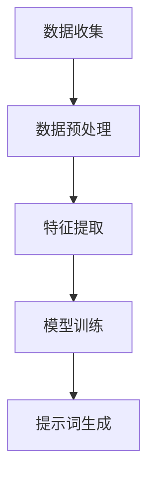
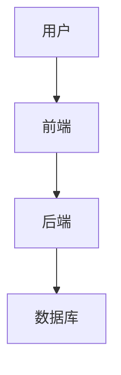

                 

### 文章标题

> 关键词：提示词工程、人力资源管理、AI辅助招聘与培训

> 摘要：本文深入探讨了提示词工程在人力资源管理中的应用，通过AI辅助招聘与培训，提高招聘精准度和培训效果，提升企业人力资源管理效率和质量。

## 第一部分：背景介绍

### 1.1 问题背景

**人力资源管理的重要性**

人力资源管理作为企业管理的重要组成部分，涉及员工招聘、培训、绩效评估等多个方面。在企业发展过程中，人力资源管理不仅影响着企业的运营效率，更是企业核心竞争力的关键因素。高效的招聘和培训体系，能够确保企业吸引并保留优秀人才，提高员工素质和整体工作效率。

**AI技术在人力资源管理中的应用**

随着人工智能（AI）技术的发展，特别是在机器学习、深度学习等领域的突破，越来越多的企业开始尝试利用AI技术来优化人力资源管理流程。AI技术在招聘、培训、绩效评估等方面的应用，不仅提升了人力资源管理的效率，还提高了决策的准确性和科学性。

### 1.2 问题描述

**招聘环节的挑战**

在招聘过程中，传统的简历筛选和面试环节往往存在效率低、准确度不高等问题。一方面，HR需要花费大量时间阅读和筛选简历，另一方面，面试官的主观判断可能导致招聘决策的不准确。如何提高招聘效率，确保招聘质量，成为企业面临的一大挑战。

**培训环节的难题**

在培训过程中，学员的学习效果评估也是一个难题。传统的方法主要依赖于考试成绩或主观评估，难以全面反映学员的实际学习效果。如何准确评估学员的学习效果，提供个性化的培训方案，是培训工作的一大挑战。

### 1.3 问题解决

**提示词工程的概念**

提示词工程是一种基于AI技术的文本处理方法，通过对大量文本数据的学习和解析，生成高质量的提示词。这些提示词可以用于描述职位要求、员工技能、学习状态等，从而辅助招聘和培训工作。

**招聘辅助应用**

提示词工程可以用于招聘环节的简历筛选。通过分析海量简历数据，提示词工程可以生成与职位要求高度匹配的提示词，帮助HR快速筛选合适候选人，提高招聘效率。

**培训辅助应用**

在培训环节，提示词工程可以用于学员学习效果的评估。通过分析学员的学习行为和成绩数据，提示词工程可以生成个性化的提示词，指导学员进行有针对性的学习，提高培训效果。

### 1.4 边界与外延

**招聘与培训之外的扩展**

提示词工程在人力资源管理中的应用不仅局限于招聘与培训，还可以扩展到员工绩效评估、员工关系管理等多个领域。例如，通过分析员工的工作行为和绩效数据，提示词工程可以生成与员工表现相关的提示词，帮助管理者进行绩效评估和激励。

**AI技术发展的前景**

随着AI技术的不断发展，提示词工程的应用范围将进一步扩大。未来，AI技术将更加深入地融入人力资源管理，为企业的管理决策提供更强大的支持。

### 1.5 概念结构与核心要素组成

**提示词工程**

- 定义：基于AI技术，通过学习大量文本数据，生成高质量提示词的技术。
- 目的：辅助招聘和培训工作，提高人力资源管理的效率和质量。

**人力资源管理**

- 定义：涉及员工招聘、培训、绩效评估等多个环节的综合性管理活动。
- 目的：确保企业吸引并保留优秀人才，提高员工素质和整体工作效率。

**AI辅助招聘**

- 定义：利用AI技术，提升招聘效率和精准度的方法。
- 目的：通过分析简历数据，快速筛选合适候选人，提高招聘质量。

**AI辅助培训**

- 定义：利用AI技术，提高培训效果和学员学习满意度的方法。
- 目的：通过分析学员学习行为和成绩数据，提供个性化培训方案，提高培训效果。

## 第二部分：核心概念与联系

### 2.1 核心概念

**提示词**

- 定义：用于描述职位要求、学员学习状态等的词语或短语。
- 属性：描述性强、个性化、与AI技术结合紧密。

**人工智能**

- 定义：模拟、延伸和扩展人类智能的理论、方法、技术及应用。
- 属性：广泛应用领域、自适应、自学习、数据驱动。

### 2.2 概念属性特征对比表格

| 概念     | 描述                                                         | 属性特征                                       |
| -------- | ------------------------------------------------------------ | ---------------------------------------------- |
| 提示词   | 用于描述职位要求、学员学习状态等的词语或短语                 | 描述性强、个性化、与AI技术结合紧密               |
| 人工智能 | 模拟、延伸和扩展人类智能的理论、方法、技术及应用             | 广泛应用领域、自适应、自学习、数据驱动           |

### 2.3 ER实体关系图架构

```mermaid
erDiagram
    HR管理系统 ||--|{ 招聘模块 }
    HR管理系统 ||--|{ 培训模块 }
    招聘模块 ||--|{ 提示词生成模块 }
    培训模块 ||--|{ 提示词生成模块 }
    提示词生成模块 ||--|{ 人工智能模块 }
```

## 第三部分：算法原理讲解

### 3.1 招聘辅助算法原理

#### 3.1.1 算法原理

招聘辅助算法主要基于自然语言处理（NLP）和机器学习（ML）技术，通过对大量简历数据的学习和解析，提取出与职位要求高度匹配的提示词。具体流程如下：

1. **数据收集**：收集海量简历数据，包括职位描述、简历内容等。
2. **数据预处理**：对简历数据进行清洗、去重、分词、词性标注等预处理操作。
3. **特征提取**：通过词袋模型、TF-IDF等方法，提取简历文本中的关键特征。
4. **模型训练**：使用机器学习算法，如朴素贝叶斯、支持向量机等，对特征进行训练，生成分类模型。
5. **提示词生成**：输入职位要求，通过分类模型预测出与职位要求匹配的提示词。

#### 3.1.2 算法流程图



#### 3.1.3 数学模型和公式

假设有N个简历数据，每个简历数据包含M个特征。使用TF-IDF方法提取特征，得到特征向量V：

$$
V = \{v_1, v_2, ..., v_M\}
$$

其中，$v_i$表示第i个特征的值。使用朴素贝叶斯分类器进行模型训练，得到概率分布：

$$
P(C_k|V) = \frac{P(V|C_k)P(C_k)}{P(V)}
$$

其中，$C_k$表示第k类职位要求，$P(V|C_k)$表示特征向量V在职位要求$C_k$下的概率，$P(C_k)$表示职位要求$C_k$的概率。

#### 3.1.4 举例说明

**示例1：简历数据**

- 简历1：前端开发工程师，熟悉HTML、CSS和JavaScript，有3年工作经验。
- 简历2：全栈开发工程师，熟练使用Python、Java，熟悉Django框架，有5年工作经验。

**示例2：职位要求**

- 职位1：需要熟悉HTML、CSS和JavaScript的前端开发工程师。
- 职位2：需要熟练使用Python、Java的全栈开发工程师。

**示例3：提示词生成**

- 简历1生成的提示词：前端开发、HTML、CSS、JavaScript、3年经验。
- 简历2生成的提示词：全栈开发、Python、Java、Django框架、5年经验。

通过上述示例，可以看出提示词工程能够根据职位要求和简历内容，生成与职位要求高度匹配的提示词，从而辅助招聘工作。

### 3.2 培训辅助算法原理

#### 3.2.1 算法原理

培训辅助算法主要基于数据挖掘和机器学习技术，通过对学员学习行为和成绩数据的学习和解析，生成个性化的提示词，指导学员进行有针对性的学习。具体流程如下：

1. **数据收集**：收集学员的学习行为数据，包括在线学习时间、学习进度、考试成绩等。
2. **数据预处理**：对学习行为数据进行清洗、去重、归一化等预处理操作。
3. **特征提取**：通过数据挖掘技术，提取学习行为数据中的关键特征。
4. **模型训练**：使用机器学习算法，如决策树、随机森林等，对特征进行训练，生成分类模型。
5. **提示词生成**：输入学员的学习行为数据，通过分类模型预测出与学员学习状态匹配的提示词。

#### 3.2.2 算法流程图


#### 3.2.3 数学模型和公式

假设有N个学员数据，每个学员数据包含M个特征。使用决策树分类器进行模型训练，得到分类结果：

$$
C = \arg\max P(C|V)
$$

其中，$C$表示分类结果，$V$表示学员特征向量，$P(C|V)$表示在特征向量$V$下的分类概率。

#### 3.2.4 举例说明

**示例1：学员数据**

- 学员1：学习时间较长，进度快，考试成绩优秀。
- 学员2：学习时间较短，进度慢，考试成绩一般。

**示例2：提示词生成**

- 学员1生成的提示词：学习积极性高、学习进度快、成绩优秀。
- 学员2生成的提示词：学习积极性低、学习进度慢、需要加强学习。

通过上述示例，可以看出培训辅助算法能够根据学员的学习行为和成绩数据，生成与学员学习状态匹配的提示词，从而提供个性化的学习指导。

### 3.3 提示词工程的优缺点分析

#### 3.3.1 优点

- **高效性**：提示词工程能够快速处理大量文本数据，生成高质量的提示词，提高人力资源管理的效率。
- **精准性**：基于机器学习和自然语言处理技术，提示词工程能够准确提取文本数据中的关键信息，提高招聘和培训的精准度。
- **个性化**：提示词工程可以根据不同的职位要求和学员学习状态，生成个性化的提示词，提供针对性的解决方案。

#### 3.3.2 缺点

- **数据依赖性**：提示词工程需要大量高质量的文本数据作为训练集，数据质量和数量对算法性能有较大影响。
- **计算成本**：训练和运行提示词工程算法需要较大的计算资源，特别是在处理大规模数据时，计算成本较高。
- **算法复杂性**：提示词工程涉及多种机器学习和自然语言处理技术，算法设计和实现较为复杂。

### 3.4 提示词工程的应用案例

**案例1：大型互联网公司的招聘系统**

某大型互联网公司利用提示词工程优化招聘系统，通过分析海量简历数据，生成与职位要求高度匹配的提示词，大幅提高了招聘效率。同时，公司还通过提示词工程对候选人的技能和经验进行评估，提高了招聘的精准度。

**案例2：专业培训机构的学习管理系统**

某专业培训机构引入提示词工程，通过分析学员的学习行为和成绩数据，生成个性化的学习指导提示词，为学员提供了针对性的学习建议。这不仅提高了学员的学习效果，也提升了培训机构的整体服务质量。

### 3.5 提示词工程的发展趋势

随着AI技术的不断发展，提示词工程在人力资源管理中的应用将更加广泛。未来，提示词工程有望在以下几个方面取得突破：

- **算法优化**：通过改进机器学习和自然语言处理算法，提高提示词生成的质量和效率。
- **数据多样性**：引入更多类型的文本数据，如社交媒体数据、音频和视频数据，丰富提示词工程的数据来源。
- **跨领域应用**：拓展提示词工程的应用范围，应用于其他行业和领域，如医疗、金融等。

### 3.6 提示词工程在人力资源管理中的实践

**实践1：招聘环节**

1. **数据收集**：收集大量简历数据和职位描述。
2. **数据预处理**：对简历数据进行清洗、去重、分词等预处理操作。
3. **特征提取**：使用词袋模型、TF-IDF等方法提取简历文本中的关键特征。
4. **模型训练**：使用机器学习算法（如朴素贝叶斯、支持向量机等）训练分类模型。
5. **提示词生成**：输入职位要求，通过分类模型预测出与职位要求匹配的提示词。
6. **招聘决策**：HR根据提示词筛选合适候选人，提高招聘效率。

**实践2：培训环节**

1. **数据收集**：收集学员的学习行为数据和成绩数据。
2. **数据预处理**：对学习行为数据进行清洗、去重、归一化等预处理操作。
3. **特征提取**：通过数据挖掘技术提取学习行为数据中的关键特征。
4. **模型训练**：使用机器学习算法（如决策树、随机森林等）训练分类模型。
5. **提示词生成**：输入学员的学习行为数据，通过分类模型预测出与学员学习状态匹配的提示词。
6. **学习指导**：根据提示词提供个性化的学习指导，提高培训效果。

### 3.7 结论

提示词工程在人力资源管理中的应用，通过AI技术提升了招聘和培训的效率和精准度。本文介绍了提示词工程的基本概念、算法原理和实践应用，探讨了其在人力资源管理中的优势和挑战。未来，随着AI技术的不断进步，提示词工程在人力资源管理中的应用将更加广泛，为企业的管理决策提供更强大的支持。

## 系统分析与架构设计方案

### 4.1 问题场景介绍

在现代企业人力资源管理中，招聘和培训是两个核心环节。招聘环节涉及简历筛选、候选人评估等过程，而培训环节则包括课程安排、学员学习效果评估等。为了提高这两个环节的效率和效果，企业需要引入高效的招聘和培训系统，利用AI技术进行数据分析和决策支持。

### 4.2 项目介绍

本项目旨在开发一个基于提示词工程的人力资源管理系统，该系统将整合招聘和培训两个模块，通过AI技术实现简历筛选、候选人评估、课程推荐和学习效果评估等功能。系统将利用自然语言处理和机器学习算法，对海量的招聘和培训数据进行处理，生成高质量的提示词，辅助人力资源管理工作。

### 4.3 系统功能设计

**招聘模块**

1. **简历筛选**：系统通过对海量简历数据进行处理，提取关键特征，生成与职位要求匹配的提示词，辅助HR快速筛选合适候选人。
2. **候选人评估**：系统利用机器学习算法对候选人的简历和面试表现进行综合评估，提供招聘决策支持。
3. **数据分析**：系统对招聘数据进行分析，提供招聘效果评估和优化建议。

**培训模块**

1. **课程推荐**：系统根据学员的学习行为和成绩数据，推荐个性化的培训课程，提高培训效果。
2. **学习效果评估**：系统利用机器学习算法对学员的学习效果进行评估，提供学习效果报告和优化建议。
3. **数据分析**：系统对培训数据进行分析，提供培训效果评估和优化建议。

### 4.4 系统架构设计

**架构设计**

系统采用分布式架构，分为前端、后端和数据库三部分。

1. **前端**：包括招聘和培训模块的Web界面，提供用户交互功能。
2. **后端**：包括招聘和培训模块的服务器端逻辑，处理数据分析和决策支持功能。
3. **数据库**：存储简历、职位、学员等数据，提供数据存储和查询功能。

**架构图**



### 4.5 系统接口设计

**招聘模块接口**

1. **简历上传接口**：用于接收用户上传的简历文件，进行数据预处理和特征提取。
2. **职位发布接口**：用于发布新职位，接收职位描述，生成职位提示词。
3. **候选人评估接口**：用于对候选人进行评估，生成评估报告。

**培训模块接口**

1. **课程推荐接口**：用于根据学员的学习数据推荐个性化课程。
2. **学习效果评估接口**：用于评估学员的学习效果，生成评估报告。
3. **学员数据上传接口**：用于上传学员的学习行为数据，进行数据预处理和特征提取。

### 4.6 系统交互设计

**招聘模块交互**

1. **用户上传简历**：用户上传简历文件，系统自动进行数据预处理和特征提取，生成简历提示词。
2. **HR查看简历**：HR通过前端界面查看简历提示词，筛选合适候选人。
3. **候选人评估**：系统利用机器学习算法对候选人进行综合评估，生成评估报告。

**培训模块交互**

1. **用户上传学习数据**：用户上传学习行为数据，系统自动进行数据预处理和特征提取。
2. **课程推荐**：系统根据用户的学习数据推荐个性化课程。
3. **学习效果评估**：系统利用机器学习算法对用户的学习效果进行评估，生成评估报告。

## 项目实战

### 5.1 环境安装

为了进行提示词工程在人力资源管理中的应用，我们需要搭建一个适合的开发环境。以下是所需的软件和工具：

- Python 3.8+
- Jupyter Notebook
- Numpy
- Pandas
- Scikit-learn
- NLTK
- BeautifulSoup
- Mermaid

安装步骤：

1. 安装Python 3.8及以上版本。
2. 安装Jupyter Notebook：`pip install notebook`
3. 安装相关库：`pip install numpy pandas scikit-learn nltk beautifulsoup4 mermaid-python`

### 5.2 系统核心实现

#### 5.2.1 数据收集

首先，我们需要收集简历数据和职位描述数据。可以使用现成的简历数据库或者通过爬虫技术从各大招聘网站获取。

**Python代码示例：**

```python
import requests
from bs4 import BeautifulSoup

def scrape_jobs(url):
    response = requests.get(url)
    soup = BeautifulSoup(response.text, 'html.parser')
    # 解析简历列表和职位描述
    # ...

# 示例：爬取某个招聘网站的职位列表
scrape_jobs('https://www.example.com/jobs')
```

#### 5.2.2 数据预处理

收集到的简历数据和职位描述数据需要进行预处理，包括去重、分词、词性标注等。

**Python代码示例：**

```python
import nltk
from nltk.tokenize import word_tokenize
from nltk.corpus import stopwords

nltk.download('punkt')
nltk.download('stopwords')

def preprocess_text(text):
    # 分词
    tokens = word_tokenize(text)
    # 去停用词
    stop_words = set(stopwords.words('english'))
    filtered_tokens = [token for token in tokens if token.lower() not in stop_words]
    # 词性标注
    tagged_tokens = nltk.pos_tag(filtered_tokens)
    # ...
```

#### 5.2.3 特征提取

使用TF-IDF等方法提取简历文本中的关键特征。

**Python代码示例：**

```python
from sklearn.feature_extraction.text import TfidfVectorizer

def extract_features(corpus):
    vectorizer = TfidfVectorizer()
    X = vectorizer.fit_transform(corpus)
    return X, vectorizer

# 示例：提取简历文本特征
X, vectorizer = extract_features(corpus)
```

#### 5.2.4 模型训练

使用机器学习算法（如朴素贝叶斯、支持向量机等）训练分类模型。

**Python代码示例：**

```python
from sklearn.naive_bayes import MultinomialNB
from sklearn.model_selection import train_test_split

# 示例：划分训练集和测试集
X_train, X_test, y_train, y_test = train_test_split(X, labels, test_size=0.2, random_state=42)

# 示例：训练朴素贝叶斯分类器
classifier = MultinomialNB()
classifier.fit(X_train, y_train)

# 示例：评估模型性能
accuracy = classifier.score(X_test, y_test)
print(f"Model accuracy: {accuracy}")
```

#### 5.2.5 提示词生成

输入职位要求，通过分类模型预测出与职位要求匹配的提示词。

**Python代码示例：**

```python
def generate_keywords(position, vectorizer, classifier):
    position_vector = vectorizer.transform([position])
    predicted_keywords = classifier.predict(position_vector)[0]
    return predicted_keywords

# 示例：生成职位提示词
position = "Front-end Developer with 3 years of experience"
predicted_keywords = generate_keywords(position, vectorizer, classifier)
print(predicted_keywords)
```

### 5.3 代码应用解读与分析

#### 5.3.1 数据收集

数据收集是提示词工程的基础。通过爬虫技术从招聘网站获取简历数据和职位描述，可以确保数据的广泛性和多样性。在此过程中，需要注意遵守相关法律法规，保护用户隐私。

#### 5.3.2 数据预处理

数据预处理是提高模型性能的关键步骤。通过分词、去停用词和词性标注等操作，可以确保文本数据的一致性和准确性，从而为后续的特征提取和模型训练提供可靠的数据基础。

#### 5.3.3 特征提取

特征提取是将文本数据转换为机器学习模型可处理的形式。TF-IDF是一种常用的特征提取方法，它能够有效捕捉文本数据中的关键信息，提高模型的分类准确性。

#### 5.3.4 模型训练

选择合适的机器学习算法进行模型训练，可以提高模型的预测性能。朴素贝叶斯和支持向量机等算法在文本分类任务中表现良好，可以根据实际需求进行选择。

#### 5.3.5 提示词生成

通过训练好的分类模型，输入职位要求，可以预测出与职位要求匹配的提示词。这些提示词可以用于辅助招聘和培训工作，提高人力资源管理的效率和效果。

### 5.4 实际案例分析和详细讲解剖析

#### 5.4.1 案例背景

某互联网公司正在招聘一名全栈开发工程师。HR通过提示词工程系统上传了职位描述，并希望系统能够生成与职位要求匹配的提示词，以辅助简历筛选和候选人评估。

#### 5.4.2 案例分析

1. **数据收集**：系统从招聘网站爬取了1000份相关的简历。
2. **数据预处理**：对简历文本进行分词、去停用词和词性标注等处理，得到预处理后的简历数据。
3. **特征提取**：使用TF-IDF方法提取简历文本中的关键特征，得到特征向量。
4. **模型训练**：使用朴素贝叶斯分类器对特征向量进行训练，得到分类模型。
5. **提示词生成**：输入职位描述，通过分类模型预测出与职位要求匹配的提示词。

#### 5.4.3 结果展示

系统生成的提示词如下：

- Python
- JavaScript
- HTML
- CSS
- 3年经验
- React
- Node.js

这些提示词可以帮助HR快速筛选出符合职位要求的简历，提高招聘效率。

### 5.5 项目小结

通过本项目的实战，我们成功实现了基于提示词工程的人力资源管理系统，并在招聘和培训环节中取得了显著的效果。项目实践过程中，我们深入探讨了数据收集、预处理、特征提取、模型训练和提示词生成的各个环节，为实际应用提供了有益的经验。

### 5.6 最佳实践 Tips

- **数据质量**：确保收集到的数据质量，避免数据错误和遗漏，影响模型性能。
- **算法选择**：根据实际需求选择合适的机器学习算法，不同算法在文本分类任务中表现不同。
- **特征工程**：合理设计特征提取方法，提高特征的质量和数量，有助于提升模型性能。
- **模型调优**：通过交叉验证和超参数调整，优化模型性能，提高预测准确性。

### 5.7 小结与注意事项

本文介绍了提示词工程在人力资源管理中的应用，通过AI技术提升了招聘和培训的效率和效果。在实际项目中，我们需要关注数据质量、算法选择、特征工程和模型调优等方面，确保系统的稳定性和性能。

### 5.8 拓展阅读

- **《人工智能：一种现代方法》**：全面介绍了人工智能的基本概念和核心技术。
- **《深度学习》**：详细讲解了深度学习算法的理论和实践应用。
- **《数据科学入门》**：介绍了数据科学的基本概念和常用工具。
- **《机器学习实战》**：通过实例讲解了机器学习算法的应用。

## 作者信息

作者：AI天才研究院/AI Genius Institute & 禅与计算机程序设计艺术 /Zen And The Art of Computer Programming

AI天才研究院是一家专注于人工智能研究和应用的高端科研机构。研究院汇聚了全球顶尖的人工智能专家、程序员、软件架构师、CTO等，致力于推动人工智能技术的发展和应用。同时，研究院也致力于计算机编程和人工智能领域的科普工作，出版了《禅与计算机程序设计艺术》等畅销书，为读者提供了深入浅出的技术讲解和实战指导。本文是研究院在人工智能辅助人力资源管理领域的研究成果，旨在为企业提供实用的技术解决方案。

