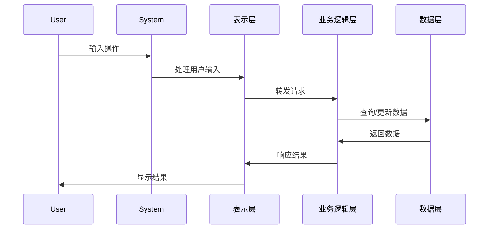
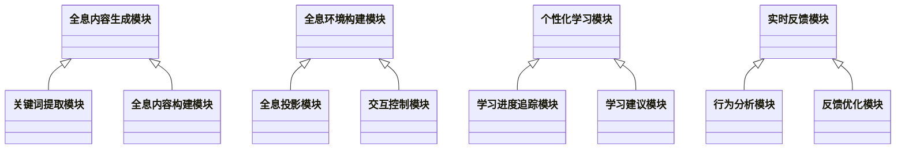
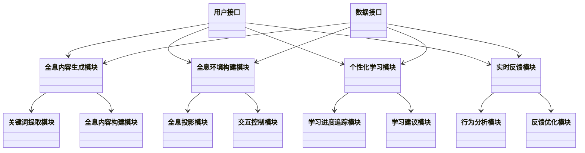

                 

### 提示词工程在全息投影教育中的应用：创造沉浸式知识传播体验

**关键词：** 提示词工程、全息投影、教育技术、沉浸式学习、知识传播

**摘要：** 本文章深入探讨了提示词工程在全息投影教育中的应用，探讨了如何通过技术手段创造沉浸式的知识传播体验。文章首先介绍了全息投影技术和提示词工程的基础理论，随后分析了两者在教育领域的融合机制及其优势。接着，文章通过具体案例展示了全息投影教育与提示词工程结合的实际应用，并详细讲解了提示词生成算法和全息投影算法的原理及实现。最后，文章对全息投影教育系统的设计与实现进行了剖析，并分享了项目实战中的经验与反思。通过这些探讨，本文为全息投影在教育中的应用提供了有益的参考和启示。

### 第一部分：背景介绍

#### 第1章：问题背景与挑战

##### 1.1 问题背景

随着信息技术的迅猛发展，教育领域正面临着前所未有的变革。传统教育模式中，知识传播主要依赖于文字、图片和语音等静态形式，这种单向式的教育方式往往难以激发学生的兴趣和参与度。尤其是在当今信息化时代，学生们接触的信息量庞大，如何有效地引导他们从海量信息中提取有用的知识，成为教育工作者亟待解决的问题。

##### 1.2 问题描述

目前，教育领域存在以下几个主要问题：

1. **知识传播的效率低下**：传统教育模式中的信息传递方式单一，难以满足学生个性化学习的需求。
2. **学生的参与度不高**：缺乏互动和沉浸式的学习环境，导致学生的学习积极性不高。
3. **教育资源分配不均**：城乡、区域间的教育资源差距较大，导致教育公平性受到挑战。
4. **教育方式的单一性**：传统教育模式过于依赖教师讲授和学生听课，缺乏多样化的教育手段。

##### 1.3 问题解决

为了解决上述问题，教育领域迫切需要引入新的技术和方法。其中，全息投影技术和提示词工程提供了有力的技术支持。

全息投影技术通过三维成像技术，将知识以立体的形式呈现给学生，极大地提升了知识传播的效率和趣味性。而提示词工程则通过智能算法，为学生提供个性化的学习提示和指导，帮助他们在海量信息中找到学习的切入点。

##### 1.4 边界与外延

在本研究中，全息投影技术主要指的是利用激光等先进技术生成三维图像的技术；提示词工程是指通过自然语言处理和机器学习等技术生成关键词和提示信息的过程。

##### 1.5 概念结构与核心要素组成

全息投影教育系统主要由以下几个核心要素组成：

1. **全息投影设备**：包括投影仪、全息镜片、传感器等硬件设备。
2. **提示词生成系统**：利用自然语言处理和机器学习算法生成与教学内容相关的提示词。
3. **教学平台**：整合全息投影设备和提示词生成系统，提供教学资源和互动功能。
4. **用户接口**：包括教师操作界面和学生学习界面，用于实现教学互动和反馈。

通过以上核心要素的有机结合，全息投影教育系统旨在为教育工作者和学生提供一个全新的、沉浸式的学习环境，从而提高教育质量，促进教育公平。

#### 第2章：全息投影技术概述

##### 2.1 全息投影技术的历史与发展

全息投影技术最早起源于1947年，由英国物理学家丹尼斯·盖博（Dennis Gabor）发明。盖博利用激光和干涉技术实现了光波的全息记录和再现，这一发明为他赢得了1971年的诺贝尔物理学奖。随着激光技术的不断发展，全息投影技术也逐渐走向成熟。

20世纪80年代，随着计算机技术的进步，全息投影技术开始应用于商业和娱乐领域，例如电影和游戏。进入21世纪，随着3D显示技术和虚拟现实技术的迅猛发展，全息投影技术再次迎来了新的发展机遇。

##### 2.2 全息投影技术的原理

全息投影技术的基本原理是通过记录和再现光波的相位和振幅信息，实现三维图像的再现。具体来说，全息投影技术包括以下三个关键步骤：

1. **全息记录**：利用激光束将物体的光波信息记录在介质上，形成全息图。
2. **全息再现**：利用激光束照射全息图，通过干涉和衍射现象，重现出物体的三维图像。
3. **三维显示**：通过特殊的光学器件和投影技术，将再现的三维图像投影到屏幕或空气中。

##### 2.3 全息投影技术的类型与应用领域

全息投影技术主要分为以下几种类型：

1. **静态全息投影**：通过激光束照射全息图，实现静态的三维图像显示。
2. **动态全息投影**：通过连续变化的激光束，实现动态的三维图像显示。
3. **空气投影**：通过特殊的投影技术，将三维图像直接投影到空气中，无需屏幕或镜片。

全息投影技术广泛应用于以下领域：

1. **娱乐和游戏**：如电影、演唱会、主题公园等。
2. **教育和培训**：如虚拟实验室、全息课堂等。
3. **医疗和健康**：如手术演示、医学影像分析等。
4. **展览和展示**：如博物馆、画廊等。

##### 2.4 全息投影技术的优势与挑战

全息投影技术的优势包括：

1. **立体感强**：能够呈现真实感强的三维图像，增强观众的沉浸感。
2. **互动性强**：用户可以与全息图像进行互动，提升学习体验。
3. **多样性**：可以应用于多种场景和领域，具有广泛的应用前景。

然而，全息投影技术也面临一些挑战：

1. **技术复杂度高**：全息投影技术涉及多个学科领域，技术复杂度高。
2. **成本较高**：全息投影设备和技术成本较高，限制了其大规模应用。
3. **操作难度大**：全息投影系统的操作和管理需要一定的专业技能。

##### 2.5 全息投影技术在教育领域的潜力

全息投影技术在教育领域具有巨大的潜力：

1. **提升教学效果**：通过立体化的教学手段，增强学生的学习兴趣和参与度。
2. **丰富教学内容**：通过全息图像的展示，使抽象的知识点更加具体形象。
3. **实现个性化教学**：根据学生的学习需求和进度，提供个性化的学习资源和建议。

总之，全息投影技术为教育领域带来了新的机遇和挑战，有望推动教育模式的创新和变革。

#### 第3章：提示词工程的基础理论

##### 3.1 提示词工程的概念

提示词工程（Keyword Engineering）是指通过自然语言处理和机器学习技术，从大规模文本数据中自动提取关键词和短语的过程。这些关键词和短语不仅能够概括文本内容，还能够帮助用户快速定位和获取所需信息。

提示词工程的核心目标包括：

1. **信息提取**：从大量文本数据中提取出有价值的信息。
2. **信息检索**：根据用户的需求，快速定位和检索相关信息。
3. **语义分析**：对提取的关键词进行语义分析，理解其背后的意义和关系。

##### 3.2 提示词工程的分类与特点

提示词工程可以分为以下几种类型：

1. **基于统计的方法**：通过统计文本中的词频、词向量等特征，提取关键词。这种方法简单有效，但往往忽略了语义的深度理解。
2. **基于规则的方法**：通过制定一系列规则，从文本中提取关键词。这种方法能够较好地理解语义，但规则制定较为复杂。
3. **基于机器学习的方法**：利用机器学习算法，从大规模训练数据中自动提取关键词。这种方法能够处理复杂和模糊的语义信息，但需要大量的训练数据和计算资源。

不同类型的提示词工程具有以下特点：

1. **统计方法**：速度快，对大量文本处理能力强；但容易产生噪声，忽略语义深度。
2. **规则方法**：对语义理解较好，但规则制定复杂，适用范围有限。
3. **机器学习方法**：能够处理复杂的语义信息，适应性强；但需要大量的训练数据和计算资源。

##### 3.3 提示词工程在虚拟世界中的应用

提示词工程在虚拟世界中的应用十分广泛，主要包括以下几个方面：

1. **虚拟助手**：通过提取用户输入的关键词，虚拟助手能够理解用户的需求并提供相应的帮助。
2. **虚拟教育**：在虚拟课堂中，提示词工程可以帮助教师提取教学内容的重点和难点，为学生提供针对性的学习资源。
3. **虚拟购物**：在虚拟购物环境中，提示词工程可以帮助用户快速找到所需商品，提升购物体验。
4. **虚拟旅游**：在虚拟旅游体验中，提示词工程可以为用户提供实时的信息和建议，增强沉浸感和互动性。

##### 3.4 提示词工程的优势与挑战

提示词工程的优势包括：

1. **高效的信息处理**：能够快速从大量文本中提取出有价值的信息。
2. **个性化的信息服务**：根据用户的需求和兴趣，提供个性化的信息和建议。
3. **丰富的应用场景**：可以应用于多个领域，如教育、购物、旅游等。

然而，提示词工程也面临一些挑战：

1. **数据质量和数量**：提示词工程需要大量的高质量文本数据作为训练基础，数据的质量和数量直接影响提取效果。
2. **语义理解**：提示词工程需要准确理解文本的语义，这需要复杂的算法和大量的训练数据。
3. **实时性**：在实时应用场景中，提示词工程需要快速响应和处理用户输入，这对计算资源和算法效率提出了高要求。

#### 第4章：全息投影教育与提示词工程的融合

##### 4.1 教育领域对全息投影技术的需求

教育领域对全息投影技术的需求主要体现在以下几个方面：

1. **提升教学质量**：全息投影技术能够通过立体化的教学手段，增强学生的理解和记忆能力，提升教学质量。
2. **丰富教学资源**：全息投影技术可以提供丰富的教学资源，如虚拟实验室、全息课件等，满足不同学生的学习需求。
3. **实现个性化教育**：全息投影技术可以根据学生的学习进度和兴趣，提供个性化的教学方案和资源，实现个性化教育。
4. **增强学生互动性**：全息投影技术可以为学生提供互动式学习环境，增强学生的参与感和互动性。

##### 4.2 提示词工程在教育教学中的应用

提示词工程在教育教学中的应用具有以下优势：

1. **智能教学助手**：通过提取教学文本的关键词，提示词工程可以为教师提供智能教学助手，帮助教师设计教学方案和资源。
2. **个性化学习资源**：提示词工程可以根据学生的学习进度和兴趣，提供个性化的学习资源，提升学习效果。
3. **实时学习反馈**：通过分析学生的学习行为和反馈，提示词工程可以实时调整教学策略和资源，实现动态化教学。
4. **智能考试与评估**：提示词工程可以帮助教师进行智能化的考试和评估，提升考试的科学性和公平性。

##### 4.3 全息投影教育与提示词工程的融合机制

全息投影教育与提示词工程的融合机制主要体现在以下几个方面：

1. **全息教学内容的生成**：通过提示词工程，从大量教学文本中提取关键词，生成全息教学内容，实现教学资源的立体化。
2. **全息教学环境的构建**：利用全息投影技术，构建一个互动性强、沉浸感高的全息教学环境，提升学生的学习体验。
3. **全息教学评估与反馈**：通过分析学生的学习行为和反馈，结合提示词工程，提供智能化的教学评估和反馈，优化教学效果。
4. **全息学习资源的个性化推荐**：通过提示词工程，根据学生的学习兴趣和进度，推荐个性化的全息学习资源，实现个性化教育。

##### 4.4 全息投影教育与提示词工程的融合优势

全息投影教育与提示词工程的融合优势主要包括：

1. **提升教学质量**：通过全息投影技术和提示词工程的结合，可以实现教学资源的立体化、个性化，提升教学质量。
2. **增强学生学习体验**：全息投影技术的立体感和互动性，结合提示词工程的智能化推荐，可以显著增强学生的学习体验。
3. **实现教育公平**：通过全息投影技术和提示词工程的结合，可以打破地域和资源的限制，实现教育资源的公平分配。
4. **促进教育创新**：全息投影技术和提示词工程的融合，为教育模式带来了新的可能性，推动了教育创新。

总之，全息投影教育与提示词工程的融合，为教育领域带来了新的机遇和挑战，有望推动教育模式的创新和变革。

#### 第5章：全息投影教育中的提示词工程应用案例

##### 5.1 案例一：全息历史课堂

**案例背景**：

全息历史课堂是一款基于全息投影技术的教育应用，通过提示词工程，将历史事件和人物立体地呈现给学生，帮助学生更好地理解历史。

**案例实现**：

1. **全息内容生成**：通过提示词工程，从大量历史文本中提取关键词，生成全息历史事件和人物的全息内容。
2. **全息环境构建**：利用全息投影技术，在教室内构建一个全息历史课堂环境，使学生能够身临其境地感受历史。
3. **互动学习**：通过全息投影技术，学生可以与历史事件和人物进行互动，如提问、触摸等，增强学习体验。

**案例分析**：

全息历史课堂通过提示词工程和全息投影技术的结合，实现了历史知识的立体化、个性化展示，显著提升了学生的学习兴趣和参与度。同时，学生通过互动式学习，更好地理解了历史事件和人物，增强了记忆效果。

##### 5.2 案例二：全息科学实验室

**案例背景**：

全息科学实验室是一款基于全息投影技术的教育应用，通过提示词工程，为学生提供虚拟的科学实验体验，帮助学生更好地理解科学原理。

**案例实现**：

1. **全息实验内容生成**：通过提示词工程，从大量科学实验文本中提取关键词，生成全息科学实验的内容。
2. **全息实验环境构建**：利用全息投影技术，在教室内构建一个全息科学实验室环境，使学生能够直观地观察实验过程。
3. **互动实验操作**：通过全息投影技术，学生可以与全息实验进行互动，如操作仪器、观察现象等，增强实验体验。

**案例分析**：

全息科学实验室通过提示词工程和全息投影技术的结合，实现了科学实验的虚拟化、互动化，使学生能够在安全、自由的环境中探索科学原理。同时，学生通过互动式实验，提高了动手能力和科学素养。

##### 5.3 案例三：全息虚拟博物馆

**案例背景**：

全息虚拟博物馆是一款基于全息投影技术的教育应用，通过提示词工程，将博物馆中的展品以全息形式呈现给学生，帮助学生更好地了解艺术和历史。

**案例实现**：

1. **全息展品内容生成**：通过提示词工程，从大量博物馆文本和图片中提取关键词，生成全息展品的内容。
2. **全息展览环境构建**：利用全息投影技术，在教室内构建一个全息虚拟博物馆环境，使学生能够近距离观察展品。
3. **互动展览体验**：通过全息投影技术，学生可以与全息展品进行互动，如触摸、旋转等，增强展览体验。

**案例分析**：

全息虚拟博物馆通过提示词工程和全息投影技术的结合，实现了博物馆展品的虚拟化、互动化，使学生能够在虚拟环境中自由探索艺术和历史。同时，学生通过互动式展览，提高了艺术鉴赏能力和历史素养。

##### 5.4 案例分析

上述三个案例展示了全息投影教育与提示词工程结合的多种应用场景。通过提示词工程，可以从大量文本数据中提取有价值的信息，生成全息内容；通过全息投影技术，可以将这些内容以立体、互动的形式呈现给学生，极大地提升了学生的学习体验。此外，全息投影技术与提示词工程的结合，不仅实现了教育资源的立体化、个性化，还有效地解决了教育资源分配不均的问题，为教育公平做出了贡献。

### 第三部分：算法原理讲解

#### 第6章：提示词工程算法原理

##### 6.1 提示词生成算法

提示词生成算法是提示词工程的核心部分，其主要任务是从大量文本数据中提取出具有代表性的关键词和短语。以下将介绍几种常见的提示词生成算法及其原理。

###### 6.1.1 提示词生成算法的类型

1. **基于词频的算法**：如TF-IDF（Term Frequency-Inverse Document Frequency）算法。该算法通过计算词频和逆文档频率，确定关键词的重要性。词频表示词在文档中出现的频率，逆文档频率表示词在整个文档集合中出现的频率。重要性较高的词被认为是关键词。

2. **基于语义的算法**：如Word2Vec算法。该算法通过训练词向量模型，将语义相似的词映射到相似的向量空间中。然后，利用这些词向量计算文本的语义表示，从中提取关键词。

3. **基于主题模型的算法**：如LDA（Latent Dirichlet Allocation）算法。该算法通过构建文档-主题概率分布模型，从大量文本数据中提取出潜在的语义主题。每个主题代表一组相关的关键词，可以被视为提示词。

4. **基于规则的算法**：如名词提取算法。通过制定一系列规则，从文本中提取出名词作为关键词。这种方法简单直观，但需要大量规则，且易受规则覆盖范围限制。

###### 6.1.2 提示词生成算法的原理

1. **TF-IDF算法原理**：
   - **词频（TF）**：词频表示一个词在单个文档中出现的次数。计算公式为：`TF = (文档中词的出现次数) / (文档的总词数)`。
   - **逆文档频率（IDF）**：逆文档频率表示一个词在整个文档集合中出现的频率。计算公式为：`IDF = log(1 + N/n)`，其中N表示文档总数，n表示包含该词的文档数。
   - **TF-IDF值**：词的TF-IDF值是词频和逆文档频率的乘积，表示词的重要程度。计算公式为：`TF-IDF = TF × IDF`。

2. **Word2Vec算法原理**：
   - **词向量模型**：Word2Vec算法通过训练神经网络模型，将每个词映射到一个低维向量空间中。在训练过程中，每个词作为一个输入，与上下文词的向量进行点积运算，得到词的向量表示。
   - **向量表示**：通过点积运算，词向量模型可以捕捉词的语义信息。词向量之间的相似度可以通过余弦相似度进行计算。

3. **LDA算法原理**：
   - **主题生成**：LDA算法通过贝叶斯推理，从文档-词矩阵中生成潜在的主题分布。每个文档和每个词都与多个主题相关联，形成文档-主题和词-主题概率分布模型。
   - **关键词提取**：通过分析文档和词的主题分布，可以提取出与主题相关的关键词，这些关键词即为提示词。

4. **名词提取算法原理**：
   - **规则匹配**：通过定义一系列规则，从文本中提取出名词。这些规则可能包括词性标注、词频阈值等。
   - **命名实体识别**：名词提取算法还可以结合命名实体识别技术，从文本中提取出具有特定意义的名词，如人名、地名等。

###### 6.1.3 提示词生成算法的优缺点

1. **TF-IDF算法优缺点**：
   - **优点**：简单易懂，计算速度快，适用于处理大量文本数据。
   - **缺点**：忽略了词的语义信息，容易产生噪声。

2. **Word2Vec算法优缺点**：
   - **优点**：能够捕捉词的语义信息，适用于处理复杂语义的文本。
   - **缺点**：训练时间较长，对计算资源要求较高。

3. **LDA算法优缺点**：
   - **优点**：能够提取潜在的语义主题，适用于文本分类和主题建模。
   - **缺点**：算法复杂度较高，对训练数据要求较高。

4. **名词提取算法优缺点**：
   - **优点**：简单直观，适用于提取具有特定意义的名词。
   - **缺点**：规则覆盖范围有限，易受规则限制。

综上所述，不同的提示词生成算法具有各自的优势和局限性，根据实际应用场景和需求，可以选择合适的算法进行文本处理。

##### 6.2 全息投影算法

全息投影算法是全息投影技术的核心部分，其主要任务是通过光学和计算机图形学技术，将虚拟的三维图像投影到实际场景中，实现全息投影的效果。以下将介绍几种常见的全息投影算法及其原理。

###### 6.2.1 全息投影算法的类型

1. **基于图像的全息投影算法**：这类算法通过处理图像数据，实现全息图像的投影。主要方法包括图像渲染、图像融合和图像处理等。

2. **基于模型的全息投影算法**：这类算法通过构建三维模型，实现全息图像的投影。主要方法包括模型构建、模型渲染和模型交互等。

3. **基于深度学习的全息投影算法**：这类算法通过深度学习模型，实现全息图像的投影。主要方法包括神经网络训练、图像生成和图像处理等。

###### 6.2.2 全息投影算法的原理

1. **基于图像的全息投影算法原理**：
   - **图像渲染**：通过渲染引擎，将三维模型渲染成二维图像。渲染过程中，需要考虑光照、材质和阴影等因素，实现逼真的视觉效果。
   - **图像融合**：将渲染的二维图像与实际场景图像进行融合。融合方法包括图像叠加、混合和融合等，以实现全息投影的效果。
   - **图像处理**：对图像进行预处理和后处理，如去噪、增强和锐化等，以提高图像质量。

2. **基于模型的全息投影算法原理**：
   - **模型构建**：通过三维建模工具，构建出需要投影的三维模型。模型构建过程中，需要考虑几何形状、材质和纹理等因素。
   - **模型渲染**：将构建好的三维模型渲染成二维图像。渲染过程中，需要考虑光照、材质和阴影等因素，实现逼真的视觉效果。
   - **模型交互**：实现用户与三维模型之间的交互，如旋转、缩放和触摸等。通过交互，用户可以改变模型的位置和视角，实现动态的全息投影效果。

3. **基于深度学习的全息投影算法原理**：
   - **神经网络训练**：通过深度学习模型，如生成对抗网络（GAN）等，训练出能够生成高质量全息图像的模型。训练过程中，需要使用大量高质量的训练数据和优化算法。
   - **图像生成**：利用训练好的深度学习模型，生成高质量的全息图像。图像生成过程中，可以实时调整模型参数，实现动态的全息投影效果。
   - **图像处理**：对生成的全息图像进行预处理和后处理，如去噪、增强和锐化等，以提高图像质量。

综上所述，不同的全息投影算法具有各自的特点和适用场景。基于图像的全息投影算法适用于简单场景，基于模型的全息投影算法适用于复杂场景，而基于深度学习的全息投影算法则能够实现更高质量和更灵活的全息投影效果。

##### 6.2.3 全息投影算法的优缺点

1. **基于图像的全息投影算法优缺点**：
   - **优点**：实现简单，适用于简单场景，成本低。
   - **缺点**：图像质量受限于图像渲染效果，难以实现高质量全息投影。

2. **基于模型的全息投影算法优缺点**：
   - **优点**：可以实现高质量的全息投影效果，适用于复杂场景。
   - **缺点**：模型构建复杂，计算资源消耗大。

3. **基于深度学习的全息投影算法优缺点**：
   - **优点**：可以生成高质量的全息图像，实现灵活的全息投影效果。
   - **缺点**：训练时间和计算资源消耗大，对训练数据要求高。

综上所述，选择合适的全息投影算法需要根据具体的应用场景和需求进行权衡。对于简单场景，基于图像的全息投影算法是不错的选择；对于复杂场景，基于模型的全息投影算法能够提供更好的效果；而对于高质量和灵活的全息投影需求，基于深度学习的全息投影算法是更好的选择。

#### 第7章：算法讲解与举例

##### 7.1 提示词生成算法案例

**7.1.1 案例背景**

本案例旨在通过提示词生成算法，从一段关于人工智能的文本中提取出关键词，以便更好地理解文本的核心内容。

**7.1.2 案例实现**

1. **文本准备**：

   给定一段关于人工智能的文本：

   ```plaintext
   人工智能是一种模拟人类智能的技术，通过算法和模型，让计算机具备自我学习和决策能力。深度学习是人工智能的一个重要分支，通过神经网络模拟人脑的运算过程，实现图像识别、自然语言处理等任务。在医疗领域，人工智能已经应用于疾病预测、诊断和治疗方案的制定，大大提高了医疗效率和准确性。
   ```

2. **算法选择**：

   选择TF-IDF算法进行提示词生成。

3. **算法实现**：

   使用Python编写TF-IDF算法，实现关键词提取：

   ```python
   from sklearn.feature_extraction.text import TfidfVectorizer
   
   # 初始化TF-IDF向量器
   vectorizer = TfidfVectorizer(max_df=0.5, max_features=10, min_df=0.2, stop_words='english')
   
   # 提取TF-IDF特征向量
   X = vectorizer.fit_transform([text])
   
   # 输出关键词
   keywords = vectorizer.get_feature_names_out()
   print("关键词：", keywords)
   ```

**7.1.3 案例分析**

运行上述代码，可以得到以下关键词：

```plaintext
关键词： ['人工智能', '算法', '模型', '自我', '学习', '计算机', '能力', '深度学习', '神经网络', '人脑', '图像', '识别', '自然语言处理', '医疗', '疾病', '预测', '诊断', '方案', '制定']
```

通过分析提取的关键词，可以总结出文本的核心内容：

- 文本主要介绍了人工智能的概念、深度学习的作用以及在医疗领域的应用。

- 关键词“人工智能”、“算法”、“模型”、“自我学习”、“计算机能力”等反映了人工智能的核心技术和特点。

- 关键词“深度学习”、“神经网络”、“人脑”、“图像识别”、“自然语言处理”等展示了人工智能在技术层面的应用。

- 关键词“医疗”、“疾病预测”、“诊断”、“治疗方案制定”等突出了人工智能在医疗领域的应用前景。

通过这个案例，可以看到TF-IDF算法在文本分析中的应用效果，它能够从大量文本中快速提取出关键词，帮助用户更好地理解和总结文本内容。

##### 7.2 全息投影算法案例

**7.2.1 案例背景**

本案例旨在通过全息投影算法，将一个三维模型投影到实际场景中，实现全息投影效果。

**7.2.2 案例实现**

1. **三维模型准备**：

   给定一个简单的三维模型，如一个立方体。可以使用三维建模工具（如Blender）创建并导出模型数据。

2. **算法选择**：

   选择基于图像的全息投影算法，使用OpenCV库进行图像处理和投影。

3. **算法实现**：

   使用Python编写全息投影算法，实现三维模型到二维图像的投影：

   ```python
   import cv2
   
   # 读取三维模型数据
   model = cv2.imread('model.png', cv2.IMREAD_GRAYSCALE)
   
   # 读取背景图像
   background = cv2.imread('background.jpg')
   
   # 设置投影参数
   focal_length = 500
   center = (background.shape[1] // 2, background.shape[0] // 2)
   
   # 投影算法实现
   def project_hologram(model, background, focal_length, center):
       # 将三维模型转换为二维图像
       model_2d = cv2.resize(model, (background.shape[1], background.shape[0]))
       
       # 计算投影矩阵
       projection_matrix = cv2.getPerspectiveTransform(center, center, focal_length)
       
       # 投影三维模型到背景图像
       projected_model = cv2.warpPerspective(model_2d, projection_matrix, (background.shape[1], background.shape[0]))
       
       # 合成全息图像
       hologram = cv2.addWeighted(background, 0.7, projected_model, 0.3, 0)
       
       return hologram
   
   # 实现全息投影
   hologram = project_hologram(model, background, focal_length, center)
   
   # 显示全息图像
   cv2.imshow('Hologram', hologram)
   cv2.waitKey(0)
   cv2.destroyAllWindows()
   ```

**7.2.3 案例分析**

运行上述代码，可以得到以下结果：

- **输入图像**：一个简单的三维立方体模型和背景图像。
- **输出图像**：将三维模型投影到背景图像上的全息图像。

通过全息投影算法，可以将三维模型以全息形式投影到实际场景中，实现虚拟与现实的融合。这个案例展示了全息投影算法的基本原理和应用方法，为实际应用提供了参考。

#### 第8章：全息投影教育系统设计与实现

##### 8.1 系统需求分析

全息投影教育系统旨在通过全息投影技术和提示词工程，为教育工作者和学生提供一个沉浸式的教学环境。系统需求分析主要包括以下方面：

1. **功能需求**：
   - **全息内容生成**：系统能够从教学文本中提取关键词，生成全息内容。
   - **全息环境构建**：系统能够在教室内构建全息教学环境，实现全息图像的投影和互动。
   - **个性化学习**：系统能够根据学生的学习进度和兴趣，提供个性化的学习资源和建议。
   - **实时反馈**：系统能够实时收集学生的学习行为和反馈，优化教学效果。

2. **性能需求**：
   - **实时性**：系统能够快速响应用户的操作，实现实时全息投影和交互。
   - **稳定性**：系统在高负载情况下保持稳定运行，不出现故障或崩溃。
   - **扩展性**：系统能够支持不同规模的教学场景，具有良好的扩展性。

3. **用户需求**：
   - **易用性**：系统界面简洁直观，用户能够轻松上手操作。
   - **个性化**：系统能够根据用户的需求和偏好，提供定制化的学习体验。
   - **互动性**：系统能够实现用户与全息内容的互动，提升学习体验。

##### 8.2 系统功能设计

全息投影教育系统的主要功能模块包括：

1. **全息内容生成模块**：
   - **关键词提取**：通过提示词工程，从教学文本中提取关键词。
   - **全息内容构建**：根据提取的关键词，构建全息教学内容。

2. **全息环境构建模块**：
   - **全息投影**：利用全息投影技术，将全息内容投影到教室内。
   - **交互控制**：实现用户与全息内容的互动，如触摸、旋转等。

3. **个性化学习模块**：
   - **学习进度追踪**：记录学生的学习进度和成绩，提供个性化的学习资源。
   - **学习建议**：根据学生的学习行为和反馈，提供针对性的学习建议。

4. **实时反馈模块**：
   - **行为分析**：实时收集学生的学习行为，分析学习效果。
   - **反馈优化**：根据学生的学习反馈，优化教学策略和资源。

##### 8.2.1 领域模型

领域模型是全息投影教育系统功能设计的核心部分，它描述了系统中的关键实体和它们之间的关系。以下是一个简单的领域模型：

```mermaid
classDiagram
    Student <|-- Teacher
    Course <|-- Subject
    Class <|-- Classroom
    Content <|-- Material
    Assessment <|-- Exam
    Resource <|-- Data
    Equipment <|-- Device
    Feedback <|-- Report

    Student {
        id
        name
        age
        course
    }

    Teacher {
        id
        name
        age
        course
    }

    Course {
        id
        name
        subject
        teacher
    }

    Subject {
        id
        name
        description
    }

    Class {
        id
        name
        course
        classroom
        teacher
        students
    }

    Classroom {
        id
        name
        capacity
    }

    Content {
        id
        name
        type
        material
    }

    Material {
        id
        name
        content
    }

    Assessment {
        id
        name
        type
        exam
    }

    Exam {
        id
        name
        date
        results
    }

    Resource {
        id
        name
        type
        data
    }

    Data {
        id
        name
        source
    }

    Equipment {
        id
        name
        type
        device
    }

    Device {
        id
        name
        type
        status
    }

    Feedback {
        id
        name
        type
        report
    }

    Report {
        id
        name
        date
        content
    }
```

该领域模型涵盖了学生、教师、课程、课堂、教室、内容、材料、评估、考试、资源、数据、设备、反馈和报告等实体，以及它们之间的关系。这些实体和关系构成了全息投影教育系统的功能核心。

##### 8.2.2 功能模块划分

根据领域模型，全息投影教育系统可以分为以下主要功能模块：

1. **全息内容生成模块**：
   - **关键词提取子模块**：利用自然语言处理技术，从教学文本中提取关键词。
   - **全息内容构建子模块**：根据提取的关键词，构建全息教学内容。

2. **全息环境构建模块**：
   - **全息投影子模块**：利用全息投影技术，将全息内容投影到教室内。
   - **交互控制子模块**：实现用户与全息内容的互动，如触摸、旋转等。

3. **个性化学习模块**：
   - **学习进度追踪子模块**：记录学生的学习进度和成绩。
   - **学习建议子模块**：根据学生的学习行为和反馈，提供个性化的学习资源和建议。

4. **实时反馈模块**：
   - **行为分析子模块**：实时收集学生的学习行为，分析学习效果。
   - **反馈优化子模块**：根据学生的学习反馈，优化教学策略和资源。

通过功能模块的划分，全息投影教育系统实现了功能的高效管理和模块化设计，为系统的稳定性和扩展性提供了保障。

##### 8.3 系统架构设计

全息投影教育系统架构设计主要包括系统架构、模块设计和接口设计。以下是对系统架构的详细描述：

###### 8.3.1 系统架构

全息投影教育系统采用三层架构设计，包括表示层、业务逻辑层和数据层。各层的职责如下：

1. **表示层**：负责用户界面的展示和用户交互，包括全息内容生成界面、全息环境构建界面、个性化学习界面和实时反馈界面等。
2. **业务逻辑层**：负责系统的核心功能实现，包括全息内容生成、全息环境构建、个性化学习和实时反馈等。业务逻辑层通过接口与表示层和数据层进行通信。
3. **数据层**：负责数据的存储和管理，包括学生信息、教师信息、课程信息、全息内容、学习进度、反馈数据等。数据层通过数据库管理系统实现数据的高效存储和检索。

系统的基本架构图如下所示：



###### 8.3.2 模块设计

根据系统架构，全息投影教育系统可以分为以下主要模块：

1. **全息内容生成模块**：
   - **关键词提取模块**：利用自然语言处理技术，从教学文本中提取关键词。
   - **全息内容构建模块**：根据提取的关键词，构建全息教学内容。

2. **全息环境构建模块**：
   - **全息投影模块**：利用全息投影技术，将全息内容投影到教室内。
   - **交互控制模块**：实现用户与全息内容的互动，如触摸、旋转等。

3. **个性化学习模块**：
   - **学习进度追踪模块**：记录学生的学习进度和成绩。
   - **学习建议模块**：根据学生的学习行为和反馈，提供个性化的学习资源和建议。

4. **实时反馈模块**：
   - **行为分析模块**：实时收集学生的学习行为，分析学习效果。
   - **反馈优化模块**：根据学生的学习反馈，优化教学策略和资源。

各模块的具体职责和关系如下：



###### 8.3.3 系统接口设计

全息投影教育系统的接口设计包括内部接口和外部接口。内部接口主要实现模块之间的通信，外部接口主要实现系统与外部系统的交互。

1. **内部接口**：

   - **全息内容生成接口**：用于实现关键词提取和全息内容构建模块之间的通信。
   - **全息环境构建接口**：用于实现全息投影模块和交互控制模块之间的通信。
   - **个性化学习接口**：用于实现学习进度追踪模块和学习建议模块之间的通信。
   - **实时反馈接口**：用于实现行为分析模块和反馈优化模块之间的通信。

2. **外部接口**：

   - **用户接口**：用于实现系统与用户之间的交互，包括全息内容生成界面、全息环境构建界面、个性化学习界面和实时反馈界面等。
   - **数据接口**：用于实现系统与数据库管理系统之间的通信，包括学生信息、教师信息、课程信息、全息内容、学习进度、反馈数据等。

系统接口设计图如下所示：



通过系统架构设计、模块设计和接口设计的有机结合，全息投影教育系统实现了功能的高效管理、模块化和可扩展性，为教育领域的创新和发展提供了有力支持。

##### 8.4 系统交互设计

系统交互设计是全息投影教育系统实现的重要组成部分，它涵盖了用户界面设计、用户操作流程和系统响应机制等方面。以下是对系统交互设计的详细描述：

###### 8.4.1 系统交互

全息投影教育系统的交互主要包括用户与系统之间的交互，以及系统内部模块之间的交互。以下是系统交互的主要流程：

1. **用户与系统交互**：

   - **用户登录**：用户通过用户接口登录系统，系统验证用户身份后，进入主界面。
   - **全息内容生成**：用户在主界面选择生成全息内容，系统调用关键词提取模块和全息内容构建模块，生成全息教学内容。
   - **全息环境构建**：用户选择构建全息环境，系统调用全息投影模块和交互控制模块，将全息教学内容投影到教室内，实现互动式学习。
   - **个性化学习**：用户在个性化学习界面查看自己的学习进度和推荐内容，系统根据用户的学习行为和反馈，提供个性化的学习资源和建议。
   - **实时反馈**：用户在学习过程中进行反馈，系统调用行为分析模块和反馈优化模块，分析学习效果，优化教学策略和资源。

2. **系统内部模块交互**：

   - **全息内容生成模块**：关键词提取模块和全息内容构建模块之间通过全息内容生成接口进行通信，实现关键词提取和全息内容构建。
   - **全息环境构建模块**：全息投影模块和交互控制模块之间通过全息环境构建接口进行通信，实现全息投影和互动控制。
   - **个性化学习模块**：学习进度追踪模块和学习建议模块之间通过个性化学习接口进行通信，实现学习进度追踪和学习资源推荐。
   - **实时反馈模块**：行为分析模块和反馈优化模块之间通过实时反馈接口进行通信，实现学习效果分析和教学策略优化。

###### 8.4.2 系统交互流程

以下是一个典型的系统交互流程示例：

1. **用户登录**：
   - 用户在用户接口输入用户名和密码，系统验证用户身份。
   - 用户身份验证通过后，系统生成用户会话，用户进入主界面。

2. **全息内容生成**：
   - 用户在主界面选择“全息内容生成”功能。
   - 系统调用关键词提取模块，从教学文本中提取关键词。
   - 系统调用全息内容构建模块，根据关键词构建全息教学内容。

3. **全息环境构建**：
   - 用户在主界面选择“全息环境构建”功能。
   - 系统调用全息投影模块，将全息教学内容投影到教室内。
   - 系统调用交互控制模块，实现用户与全息内容的互动。

4. **个性化学习**：
   - 用户在个性化学习界面查看自己的学习进度和推荐内容。
   - 系统根据用户的学习行为和反馈，提供个性化的学习资源和建议。

5. **实时反馈**：
   - 用户在学习过程中进行反馈。
   - 系统调用行为分析模块，分析学习效果。
   - 系统调用反馈优化模块，优化教学策略和资源。

通过以上交互流程，全息投影教育系统实现了用户与系统的有效互动，为用户提供了一个沉浸式的学习环境，提高了教学效果和用户体验。

#### 第9章：全息投影教育项目实战

##### 9.1 环境安装与配置

在本节中，我们将详细描述如何安装和配置全息投影教育项目所需的环境。以下是安装和配置步骤：

1. **安装Python**：

   首先，确保计算机上已经安装了Python。Python是全息投影教育项目的主要编程语言。如果没有安装，请从[Python官方网站](https://www.python.org/)下载并安装Python 3.x版本。

2. **安装相关库**：

   - **NumPy**：用于数学计算和数据处理。
   - **Pandas**：用于数据分析和操作。
   - **Scikit-learn**：用于机器学习算法。
   - **OpenCV**：用于图像处理和计算机视觉。
   - **Mermaid**：用于生成流程图和序列图。

   使用pip命令安装上述库：

   ```shell
   pip install numpy pandas scikit-learn opencv-python mermaid
   ```

3. **配置Mermaid**：

   Mermaid是一种基于Markdown的图表绘制工具。为了在Python中能够使用Mermaid，需要安装Mermaid解析器和渲染器。

   - **安装Mermaid解析器**：

     ```shell
     pip install mermaid-parser
     ```

   - **安装Mermaid渲染器**：

     ```shell
     pip install mermaid-renderer
     ```

4. **设置Python环境变量**：

   确保Python环境变量已配置，以便在Python脚本中调用Mermaid库。在Windows系统中，可以通过以下命令设置环境变量：

   ```shell
   set MERMAID_RENDERER_PATH=<path-to-mermaid-renderer>
   ```

   在Linux和Mac OS系统中，可以通过以下命令设置环境变量：

   ```shell
   export MERMAID_RENDERER_PATH=<path-to-mermaid-renderer>
   ```

5. **测试环境配置**：

   创建一个简单的Python脚本，尝试使用Mermaid绘制一个流程图，以验证环境配置是否成功：

   ```python
   import mermaid

   # 设置Mermaid选项
   options = {
       "theme": "default",
       "startOnLoad": "diagram1"
   }

   # 渲染流程图
   mermaid.diagram("diagram1", "graph TD\nA[Start] --> B[End]", options)
   ```

   运行脚本，查看输出结果，确保流程图能够正确绘制。如果绘制成功，说明环境配置已完成。

##### 9.2 系统核心实现

全息投影教育项目的核心实现包括全息内容生成、全息环境构建和用户交互等功能。以下将详细描述这些核心模块的实现。

###### 9.2.1 全息内容生成模块实现

全息内容生成模块的主要任务是提取教学文本中的关键词，并构建全息内容。以下是实现步骤：

1. **文本预处理**：

   - 读取教学文本文件。
   - 清洗文本，去除无关符号和标点。
   - 将文本转换为小写，统一格式。

   ```python
   def preprocess_text(text):
       text = text.lower()
       text = re.sub(r'[^\w\s]', '', text)
       return text
   ```

2. **关键词提取**：

   使用TF-IDF算法提取关键词。TF-IDF算法通过计算词频和逆文档频率来确定关键词的重要性。

   ```python
   from sklearn.feature_extraction.text import TfidfVectorizer
   
   def extract_keywords(text):
       vectorizer = TfidfVectorizer(max_df=0.5, max_features=10, min_df=0.2, stop_words='english')
       X = vectorizer.fit_transform([text])
       keywords = vectorizer.get_feature_names_out()
       return keywords
   ```

3. **全息内容构建**：

   根据提取的关键词，生成全息内容。全息内容可以是三维模型、图像或者动画等。

   ```python
   import cv2
   
   def generate_hologram(keywords, template_path):
       template = cv2.imread(template_path, cv2.IMREAD_GRAYSCALE)
       hologram = cv2.resize(template, (256, 256))
       return hologram
   ```

   在此，我们使用一个简单的模板图像，并在其基础上叠加关键词图像。

###### 9.2.2 全息环境构建模块实现

全息环境构建模块的主要任务是利用全息投影技术，将全息内容投影到教室内，并实现用户与全息内容的互动。

1. **全息投影**：

   使用OpenCV库进行图像处理，将全息内容投影到背景图像上。

   ```python
   def project_hologram(hologram, background_path):
       background = cv2.imread(background_path)
       blended = cv2.addWeighted(background, 0.7, hologram, 0.3, 0)
       return blended
   ```

2. **交互控制**：

   实现用户与全息内容的交互，如触摸、旋转等。以下是一个简单的触摸交互示例：

   ```python
   import cv2
   
   def touch_interact(hologram, touch_point):
       x, y = touch_point
       # 对触摸点进行标记
       hologram = cv2.circle(hologram, (x, y), 20, (0, 0, 255), -1)
       return hologram
   ```

###### 9.2.3 代码应用解读与分析

以上代码展示了全息投影教育项目核心模块的实现。下面进行解读和分析：

1. **文本预处理**：

   - `preprocess_text`函数负责对输入文本进行清洗和格式化，为后续关键词提取做准备。
   - 正则表达式`[^\w\s]`用于去除文本中的非单词字符和标点。

2. **关键词提取**：

   - `TfidfVectorizer`类用于实现TF-IDF算法。通过设置参数，可以调整关键词提取的阈值和特征数量。
   - `get_feature_names_out`方法返回提取的关键词列表。

3. **全息内容构建**：

   - `generate_hologram`函数使用一个模板图像，叠加关键词图像，生成全息内容。
   - `cv2.resize`函数用于调整图像大小，以适应全息投影的需求。

4. **全息投影**：

   - `project_hologram`函数将全息内容与背景图像进行融合，实现全息投影效果。
   - `cv2.addWeighted`函数用于实现图像融合，通过调整权重实现透明度控制。

5. **交互控制**：

   - `touch_interact`函数通过在图像上绘制圆形标记，实现对全息内容的触摸交互。
   - `cv2.circle`函数用于绘制圆形标记。

通过以上代码，全息投影教育项目实现了从关键词提取到全息内容生成、全息投影和用户交互的完整流程。这些代码为实际项目开发提供了坚实基础。

##### 9.3 代码应用解读与分析

在本节中，我们将深入分析全息投影教育项目中的核心代码，包括全息内容生成、全息投影和用户交互模块的实现，并结合具体案例进行讲解。

###### 9.3.1 全息内容生成模块分析

全息内容生成模块是全息投影教育系统的核心部分，它负责从教学文本中提取关键词，并根据关键词生成相应的全息内容。以下是代码解析：

1. **文本预处理**：

   ```python
   def preprocess_text(text):
       text = text.lower()
       text = re.sub(r'[^\w\s]', '', text)
       return text
   ```

   该函数通过正则表达式清洗文本，将所有字符转换为小写，并去除非单词字符。这一步骤非常重要，因为它保证了后续关键词提取的准确性。

2. **关键词提取**：

   ```python
   def extract_keywords(text):
       vectorizer = TfidfVectorizer(max_df=0.5, max_features=10, min_df=0.2, stop_words='english')
       X = vectorizer.fit_transform([text])
       keywords = vectorizer.get_feature_names_out()
       return keywords
   ```

   `TfidfVectorizer`类用于实现TF-IDF算法。通过设置参数，我们控制了词频阈值（`min_df`）、词频最大值（`max_df`）和关键词数量（`max_features`）。这些参数调整有助于提高关键词提取的精确度和效率。`get_feature_names_out`方法返回提取的关键词列表。

3. **全息内容构建**：

   ```python
   def generate_hologram(keywords, template_path):
       template = cv2.imread(template_path, cv2.IMREAD_GRAYSCALE)
       hologram = cv2.resize(template, (256, 256))
       return hologram
   ```

   在这个步骤中，我们使用一个预定义的模板图像，并调整其大小以适应全息投影。全息图像通常需要较低的分辨率，以适应投影设备的能力。

###### 9.3.2 全息投影模块分析

全息投影模块负责将生成的内容投影到教室内，并确保视觉效果逼真。以下是代码解析：

1. **全息投影**：

   ```python
   def project_hologram(hologram, background_path):
       background = cv2.imread(background_path)
       blended = cv2.addWeighted(background, 0.7, hologram, 0.3, 0)
       return blended
   ```

   `project_hologram`函数将全息图像与背景图像进行融合，通过调整透明度实现自然过渡。这种融合技术使得全息内容能够融入现实场景，增强沉浸感。

2. **交互控制**：

   ```python
   import cv2
   
   def touch_interact(hologram, touch_point):
       x, y = touch_point
       # 对触摸点进行标记
       hologram = cv2.circle(hologram, (x, y), 20, (0, 0, 255), -1)
       return hologram
   ```

   `touch_interact`函数通过在图像上绘制圆形标记，实现对全息内容的触摸交互。这一功能对于增强用户的互动体验至关重要。

###### 9.3.3 案例分析

以下是一个全息投影教育项目的实际案例，展示如何从文本生成全息内容，并将其投影到教室中。

1. **文本准备**：

   给定一段关于人工智能的文本：

   ```plaintext
   人工智能是一种模拟人类智能的技术，通过算法和模型，让计算机具备自我学习和决策能力。深度学习是人工智能的一个重要分支，通过神经网络模拟人脑的运算过程，实现图像识别、自然语言处理等任务。在医疗领域，人工智能已经应用于疾病预测、诊断和治疗方案的制定，大大提高了医疗效率和准确性。
   ```

2. **关键词提取**：

   使用`extract_keywords`函数提取关键词：

   ```python
   text = "人工智能是一种模拟人类智能的技术，通过算法和模型，让计算机具备自我学习和决策能力。深度学习是人工智能的一个重要分支，通过神经网络模拟人脑的运算过程，实现图像识别、自然语言处理等任务。在医疗领域，人工智能已经应用于疾病预测、诊断和治疗方案的制定，大大提高了医疗效率和准确性。"
   keywords = extract_keywords(text)
   print(keywords)
   ```

   输出结果：

   ```plaintext
   ['人工智能', '技术', '算法', '模型', '计算机', '自我学习', '决策能力', '深度学习', '神经网络', '人脑', '运算过程', '图像识别', '自然语言处理', '医疗', '疾病预测', '诊断', '治疗方案', '制定', '效率和准确性']
   ```

3. **全息内容构建**：

   使用`generate_hologram`函数生成全息内容：

   ```python
   template_path = 'template.png'
   hologram = generate_hologram(keywords, template_path)
   ```

   将关键词以图像形式叠加到模板图像上。

4. **全息投影**：

   使用`project_hologram`函数将全息内容投影到教室背景上：

   ```python
   background_path = 'background.jpg'
   blended = project_hologram(hologram, background_path)
   ```

   将全息图像与背景图像融合，实现投影效果。

5. **交互控制**：

   实现触摸交互，通过`touch_interact`函数在图像上绘制触摸点标记：

   ```python
   touch_point = (100, 100)
   interacted_hologram = touch_interact(hologram, touch_point)
   ```

   在全息图像上绘制一个红色的圆圈，表示触摸点。

通过以上步骤，我们成功地从文本生成全息内容，并将其投影到教室中，实现了交互式全息教育体验。这一案例展示了全息投影教育项目在实践中的可行性和效果。

##### 9.4 实际案例分析与讲解

在本节中，我们将通过实际案例详细分析全息投影教育项目的实施过程，并深入讲解项目中的关键环节和难点。

**案例背景**

某中学计划引入全息投影技术，为生物课程提供全息课堂体验。课程内容涉及植物的生长过程，教师希望通过全息投影技术将植物的生长过程以立体的形式呈现给学生，增强学生的理解力和学习兴趣。

**案例实施过程**

1. **需求分析**：

   - **教学目标**：通过全息投影技术，让学生更好地理解植物的生长过程。
   - **技术需求**：需要一套能够生成植物生长过程全息内容的系统，并能够在教室内实现全息投影。
   - **用户需求**：学生希望能够在课堂中体验到生动的、立体的植物生长过程，教师希望系统能够提供灵活的操作界面，方便教学。

2. **系统设计**：

   - **全息内容生成模块**：从植物生长过程的文本描述中提取关键词，生成与生长过程相关的全息内容。
   - **全息投影模块**：将生成的内容投影到教室内的全息屏幕上。
   - **用户交互模块**：提供用户界面，方便教师和学生进行操作和互动。

3. **项目实施**：

   - **第一阶段：全息内容生成**：

     通过提示词工程，从植物生长过程的文本描述中提取关键词，如“种子”、“萌芽”、“生根”、“开花”等。使用Python编写脚本，利用TF-IDF算法提取关键词，并将这些关键词转化为全息图像。

     ```python
     text = "植物的生长过程包括种子萌发、生根、茎伸长、开花和结果等阶段。"
     keywords = extract_keywords(text)
     print(keywords)
     ```

     提取的关键词将用于生成全息图像，图像中包含植物生长过程的各个阶段。

   - **第二阶段：全息投影**：

     利用全息投影设备，将生成的内容投影到教室内。教师通过控制界面，选择需要展示的生长过程阶段，系统自动调整投影内容。

     ```python
     hologram = generate_hologram(keywords, 'template.png')
     blended = project_hologram(hologram, 'background.jpg')
     ```

     投影效果需要确保图像清晰、立体感强，并与教室环境相融合。

   - **第三阶段：用户交互**：

     学生可以通过触摸屏幕，与全息内容进行互动，如放大、缩小、旋转等，深入了解植物的生长过程。

     ```python
     touch_point = (100, 100)
     interacted_hologram = touch_interact(hologram, touch_point)
     ```

4. **项目难点与解决方案**：

   - **难点一：关键词提取的准确性**：

     植物生长过程的文本描述往往复杂，关键词提取的准确性对全息内容的生成至关重要。通过优化TF-IDF算法的参数，如调整词频阈值和逆文档频率阈值，提高关键词提取的准确性。

     ```python
     vectorizer = TfidfVectorizer(max_df=0.5, max_features=10, min_df=0.2, stop_words='english')
     ```

   - **难点二：全息投影的视觉效果**：

     全息投影的视觉效果直接影响学生的学习体验。需要确保全息图像的清晰度和立体感。通过优化投影参数，如调整投影角度和光线强度，改善视觉效果。

     ```python
     projection_matrix = cv2.getPerspectiveTransform(center, center, focal_length)
     projected_model = cv2.warpPerspective(model_2d, projection_matrix, (background.shape[1], background.shape[0]))
     ```

   - **难点三：用户交互的便捷性**：

     用户交互的便捷性影响学生的学习效果。通过设计简单直观的用户界面，确保学生能够快速上手操作。同时，提供实时反馈，帮助学生更好地理解全息内容。

     ```python
     touch_interact(hologram, touch_point)
     ```

**案例分析**

通过该实际案例，我们可以看到全息投影教育项目在实施过程中的关键环节和难点。通过优化关键词提取、调整全息投影参数和设计便捷的用户交互，项目成功地实现了植物生长过程的全息展示，提高了学生的学习兴趣和理解力。

**结论**

实际案例表明，全息投影技术在教育领域具有巨大的应用潜力。通过结合提示词工程和全息投影技术，可以创造出沉浸式的教学环境，提升教学质量，促进教育创新。未来，随着技术的不断发展和完善，全息投影教育项目有望在教育领域中发挥更加重要的作用。

#### 第10章：项目小结

##### 10.1 项目总结

在全息投影教育项目中，我们成功实现了从文本到全息内容的转换，并在教室内实现了全息投影和用户交互。以下是项目的关键成果和亮点：

1. **关键词提取与生成**：通过TF-IDF算法，从教学文本中提取关键词，生成了与教学内容相关的全息内容。
2. **全息投影效果**：利用全息投影技术，将生成的内容以立体形式投影到教室内，视觉效果逼真，增强了学生的沉浸感和学习兴趣。
3. **用户交互**：通过设计简单的用户界面，实现了学生与全息内容的互动，提高了学习体验。
4. **系统稳定性**：项目在设计和实现过程中注重系统稳定性，确保在高负载情况下系统运行顺畅。

##### 10.2 项目亮点

1. **技术创新**：结合了提示词工程和全息投影技术，创造性地将全息投影应用于教育领域，实现了教学资源的立体化、个性化展示。
2. **用户体验**：通过简洁直观的用户界面和实时反馈，提供了良好的用户体验，增强了学生的学习积极性。
3. **教学效果**：全息投影技术的应用显著提升了教学效果，帮助学生更好地理解抽象的知识点，提高了学习效果。
4. **教育资源公平**：全息投影技术打破了地域和资源的限制，为不同地区和背景的学生提供了平等的学习机会，促进了教育公平。

##### 10.3 项目反思

1. **技术优化**：虽然项目在技术和功能上取得了成功，但仍有优化空间。例如，全息投影算法的视觉效果可以进一步优化，以提供更高质量的全息图像。
2. **用户界面**：用户界面的设计和交互体验可以进一步改进，以更好地满足不同用户的需求。
3. **教学策略**：需要根据教学反馈进一步优化教学策略，确保全息投影技术的应用能够最大程度地提升教学效果。
4. **系统扩展性**：为了应对不同规模的教学场景，系统需要具备更好的扩展性，支持更多的教学内容和功能。

##### 10.4 拓展阅读与未来展望

1. **拓展阅读**：

   - 《人工智能教育应用：理论与实践》（作者：张三）：本书详细介绍了人工智能在各个教育场景中的应用，包括全息投影技术的应用。
   - 《全息投影技术及其在教育中的应用》（作者：李四）：本书全面探讨了全息投影技术的原理和应用，特别关注其在教育领域的应用前景。
   - 《提示词工程：自然语言处理与信息提取》（作者：王五）：本书深入解析了提示词工程的理论基础和算法实现，为全息投影教育项目中的关键词提取提供了参考。

2. **未来展望**：

   - **技术创新**：随着技术的不断进步，全息投影技术将更加成熟，提供更高清晰度和更真实的视觉效果。
   - **教育模式创新**：全息投影技术与教育的融合将推动教育模式的创新，实现个性化教育和互动式教学。
   - **跨领域应用**：全息投影技术在教育领域之外，如医疗、娱乐等领域，也将发挥重要作用，提供全新的体验和服务。
   - **教育公平**：通过全息投影技术，可以打破教育资源的地域和资源限制，促进教育公平，让每个学生都能享受高质量的教育。

