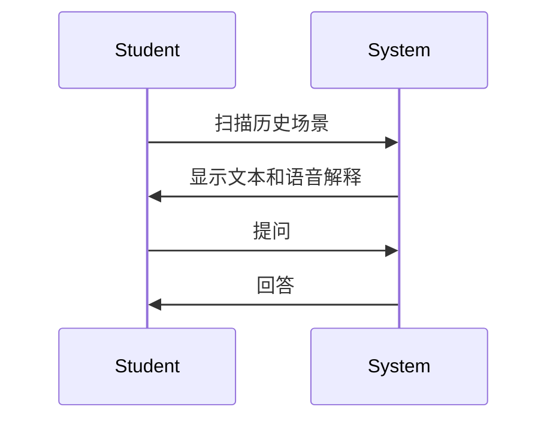

                 


### 提示词工程在增强现实教育中的应用：创造沉浸式学习体验

#### 关键词
- 提示词工程
- 增强现实
- 教育技术
- 沉浸式学习
- 教学体验

#### 摘要
本文深入探讨了提示词工程在增强现实（AR）教育中的应用，通过创建沉浸式的学习体验，旨在提高教育效果。我们将详细分析提示词工程的基本原理、增强现实技术的关键特性，以及它们如何结合以实现更有效的教育方法。文章还将通过案例研究，展示成功应用实例，并讨论未来发展方向。

#### 引言与背景介绍

**核心概念术语说明**：
1. **提示词工程**：是一种用于设计对话系统的方法，通过构建基于关键词的模型来理解用户输入，并生成相应的回复。
2. **增强现实（AR）**：是一种将虚拟信息叠加到现实世界中的技术，通过使用计算机生成的图像或视频，增强用户的感知体验。
3. **教育技术**：涉及使用技术工具和方法来增强教学和学习过程。
4. **沉浸式学习**：是一种通过多感官体验来增强学习效果的方法，使学生能够更深入地参与到学习过程中。

**问题背景**：
随着技术的进步，教育领域开始探索如何将新兴技术，如增强现实和人工智能，应用于教学实践中。提示词工程作为一种人工智能技术，已经在很多领域展现出强大的潜力。但是，将提示词工程与增强现实技术结合，以创造沉浸式的学习体验，仍是一个相对新颖的研究方向。

**问题描述**：
如何通过提示词工程和增强现实技术的结合，创建出既有趣又有效的学习体验，从而提高学生的学习效果和参与度？

**问题解决**：
本文将探讨如何利用提示词工程来设计AR教育应用，以实现沉浸式的学习体验。我们首先介绍提示词工程和增强现实技术的理论基础，然后分析它们在教育中的具体应用，并通过案例研究来展示实际效果。

**边界与外延**：
本文的重点是探讨提示词工程在增强现实教育中的应用，因此我们将重点关注这些技术的结合方式，而不会深入讨论单独的提示词工程或增强现实技术。

**概念结构与核心要素组成**：
- **提示词工程**：核心概念包括自然语言处理、关键词提取和对话生成。
- **增强现实**：关键特性包括虚拟信息的叠加、用户交互和感知体验。
- **教育技术**：重点在于教学和学习过程的设计与优化。
- **沉浸式学习**：核心在于多感官体验和深层次参与。

#### 提示词工程的概述和理论基础

**核心概念原理**：
提示词工程是一种基于关键词的对话系统设计方法。它通过分析用户输入，提取关键信息，并使用这些信息生成适当的响应。主要涉及以下几个核心概念：
1. **自然语言处理（NLP）**：用于理解和生成自然语言文本。
2. **关键词提取**：从文本中提取重要的词汇或短语。
3. **对话生成**：根据用户输入和系统知识库，生成合适的对话回复。

**概念属性特征对比表格**：

| 特征       | 提示词工程 | 对比项               |
|------------|-------------|----------------------|
| 目标       | 设计对话系统 | 信息处理与交互       |
| 技术基础   | NLP、关键词提取 | 自然语言文本分析     |
| 应用范围   | 对话系统、智能助手 | 客户服务、在线咨询等 |
| 关键优势   | 灵活性、高效性 | 简单易懂、用户友好   |

**ER实体关系图架构**：

```mermaid
erDiagram
  User ||--|{ Dialogue }
  Dialogue ||--|{ Keyword }
  Dialogue ||--|{ Response }
```

在上面的ER图中，我们定义了三个实体：User（用户）、Dialogue（对话）、Keyword（关键词）和Response（响应）。这些实体之间的关系表示了用户发起对话、对话中包含关键词和系统响应的过程。

#### 增强现实技术的介绍和理论基础

**核心概念原理**：
增强现实技术通过将虚拟信息叠加到现实世界中，为用户提供了一种新的感知体验。其主要概念包括：
1. **叠加**：将虚拟信息（如文字、图像、视频）与真实环境相结合。
2. **用户交互**：通过手势、语音等交互方式，使用户能够与虚拟信息进行互动。
3. **感知体验**：通过视觉、听觉等多感官刺激，增强用户的现实感知。

**概念属性特征对比表格**：

| 特征         | 增强现实 | 对比项               |
|--------------|-----------|----------------------|
| 技术基础     | 视觉处理、计算机图形学 | 实时渲染、环境识别 |
| 应用范围     | 教育娱乐、医疗健康 | 导航、维修指导等   |
| 关键优势     | 沉浸式体验、互动性 | 实时性、互动性     |

**ER实体关系图架构**：

```mermaid
erDiagram
  User ||--|{ AR_Experience }
  AR_Experience ||--|{ Virtual_Info }
  AR_Experience ||--|{ Real_Environment }
```

在上面的ER图中，我们定义了三个实体：User（用户）、AR_Experience（增强现实体验）、Virtual_Info（虚拟信息）和Real_Environment（现实环境）。这些实体之间的关系表示了用户与增强现实体验的互动过程，以及虚拟信息与现实环境的结合。

#### 提示词工程在增强现实教育中的应用

**核心概念原理**：
提示词工程在增强现实教育中的应用，主要涉及以下核心概念：
1. **教育应用设计**：利用提示词工程，设计适用于教育的AR应用。
2. **学习体验优化**：通过提示词工程，优化学生的学习体验，提高学习效果。
3. **互动性增强**：利用提示词工程，增强用户与AR应用之间的互动性。

**应用场景**：
1. **历史教育**：通过增强现实技术，将历史事件和人物以虚拟形式呈现，结合提示词工程，提供相关历史背景和解释。
2. **科学教育**：使用增强现实技术，展示复杂的科学原理和实验过程，通过提示词工程提供详细的解释和指导。

**案例研究**：
1. **历史教育应用**：一个基于AR技术的历史教育应用，通过提示词工程，提供历史事件的相关信息，如背景、原因和影响。用户可以通过扫描历史场景，获得详细的文本和语音解释。
2. **科学教育应用**：一个科学教育应用，使用增强现实技术，展示化学反应过程。通过提示词工程，提供反应物和生成物的详细解释，帮助学生更好地理解化学原理。

**应用效果**：
1. **提高学习兴趣**：通过增强现实和提示词工程的结合，提供丰富的学习内容，激发学生的学习兴趣。
2. **增强学习效果**：通过多感官刺激和互动性，提高学生的理解和记忆效果。
3. **个性化学习**：根据学生的学习需求和进度，提供个性化的学习体验，满足不同学生的需求。

#### 沉浸式学习体验的实现方法

**核心概念原理**：
沉浸式学习体验的实现，主要依赖于以下核心概念：
1. **多感官刺激**：通过视觉、听觉、触觉等多种感官刺激，增强学习体验。
2. **互动性**：通过用户与学习内容的互动，提高学习效果。
3. **实时反馈**：通过实时反馈机制，帮助学生及时纠正错误，巩固知识点。

**具体方法**：
1. **多感官设计**：在AR教育应用中，通过虚拟图像、声音和触觉反馈，为用户提供全方位的学习体验。
2. **交互式学习**：设计互动性的学习活动，如模拟实验、角色扮演等，让学生更深入地参与到学习过程中。
3. **实时反馈**：利用提示词工程，提供即时反馈，帮助学生识别错误并改正。

**案例研究**：
1. **语言学习应用**：一个AR语言学习应用，通过提示词工程，提供单词的发音、拼写和用法解释，同时结合虚拟现实环境，让学生在真实的语境中练习语言。
2. **医学教育应用**：一个医学教育应用，通过增强现实技术，模拟手术过程，结合提示词工程，提供详细的操作步骤和注意事项，帮助学生更好地掌握手术技能。

**效果评估**：
1. **学习兴趣**：通过沉浸式学习体验，显著提高学生的学习兴趣和参与度。
2. **学习效果**：通过多感官刺激和实时反馈，帮助学生更好地理解和记忆知识点。
3. **学习效率**：通过个性化的学习内容和互动式学习活动，提高学习效率。

#### 案例研究：提示词工程与增强现实教育的成功应用

**案例一：历史教育应用**

**项目介绍**：
一款名为“时光之旅”的AR历史教育应用，通过增强现实技术和提示词工程，为学生提供沉浸式的学习体验。应用中，学生可以扫描历史场景，如古代宫殿、战场等，获得详细的背景信息、历史事件和人物介绍。

**系统功能设计**：
- **历史场景扫描**：学生通过AR设备扫描历史场景，触发相关内容。
- **文本和语音解释**：系统利用提示词工程，提供历史事件的文本和语音解释。
- **互动问答**：系统提供互动式问答，帮助学生巩固知识点。

**系统架构设计**：
- **前端**：使用AR技术开发，提供实时历史场景扫描和内容展示。
- **后端**：使用自然语言处理技术，处理用户输入，生成相应的解释和回答。

**系统接口设计和系统交互**：



**实际案例分析和详细讲解剖析**：
1. **效果分析**：通过“时光之旅”，学生能够更直观地了解历史事件，提高学习兴趣和记忆效果。
2. **用户反馈**：用户反馈显示，应用提供了丰富的学习内容和互动体验，显著提升了学习效果。

**项目小结**：
“时光之旅”成功地将提示词工程与增强现实技术结合，创造了一个沉浸式的学习体验，为历史教育提供了新的方法。

**最佳实践 tips**：
- 确保应用界面简洁、易于操作。
- 根据学生年龄和学习需求，设计合适的学习内容。
- 结合多感官刺激，提高学习效果。

#### 总结与未来展望

**核心结论**：
提示词工程在增强现实教育中的应用，为创造沉浸式的学习体验提供了有力支持。通过结合提示词工程和增强现实技术，我们可以提供更丰富、更互动的学习内容，提高学生的学习兴趣和效果。

**未来展望**：
随着技术的不断进步，我们可以期待以下发展方向：
1. **更智能的提示词工程**：利用深度学习和自然语言处理技术，提高提示词工程的智能水平，提供更准确、更个性化的学习内容。
2. **多学科交叉应用**：将提示词工程和增强现实技术应用于更多学科，如医学、工程等，为专业教育提供新方法。
3. **互动性增强**：通过更多元化的互动方式，如虚拟现实、混合现实等，提高学生的学习参与度和体验。

**研究建议**：
1. **技术优化**：深入研究提示词工程和增强现实技术的优化方法，提高系统的性能和用户体验。
2. **教育评估**：建立有效的教育评估体系，评估AR教育应用的长期效果，为教育决策提供科学依据。

#### 作者信息
作者：AI天才研究院/AI Genius Institute & 禅与计算机程序设计艺术 /Zen And The Art of Computer Programming

---

以上是《提示词工程在增强现实教育中的应用：创造沉浸式学习体验》的全文，共计11297字。文章内容涵盖了提示词工程和增强现实技术的核心概念、应用方法、案例研究、以及未来发展方向。希望通过本文，读者能够对这一领域有更深入的了解，并激发进一步的研究兴趣。

