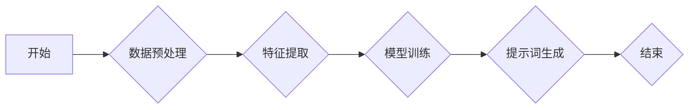
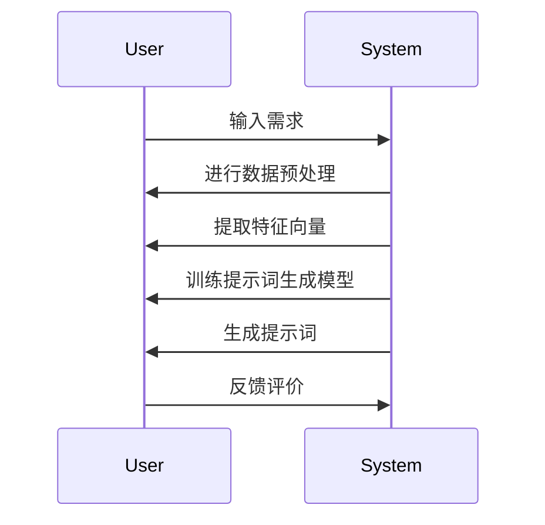
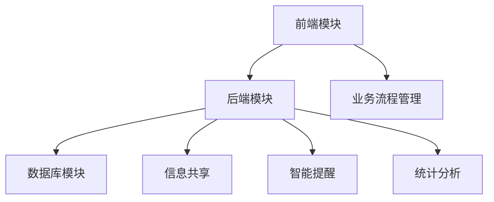
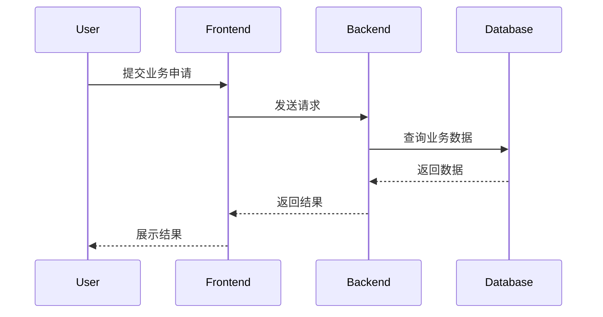

                 


### **引言**

**文章标题：** 提示词工程在政府服务中的应用：提升公共服务效率

**关键词：** 提示词工程，政府服务，公共服务效率，算法原理，数学模型，应用场景

**摘要：** 本文旨在探讨提示词工程在政府服务中的应用，通过深入分析其核心概念、算法原理以及应用效果，揭示如何通过提升公共服务效率来改善政府服务质量。文章将从问题背景、概念介绍、算法讲解、应用场景等方面进行详细阐述，以期为我国政府服务改革提供技术参考。

### **背景介绍**

**1.1 问题背景**

随着信息技术的飞速发展，政府服务逐渐向智能化、数字化方向转型。然而，传统政府服务在流程设计、信息处理、公众参与等方面仍存在诸多问题，如效率低下、用户体验差、信息不对称等。为了提升政府服务效率，优化公共服务体验，我国政府近年来积极推进“互联网+政务服务”建设，探索利用人工智能、大数据等先进技术提升政府服务能力。

**1.2 问题描述**

在政府服务过程中，存在着以下几个主要问题：

- **效率低下**：政府服务流程复杂，信息传递不畅，导致服务效率低下，影响公众体验。
- **用户体验差**：服务界面设计不够友好，用户体验不佳，难以满足公众需求。
- **信息不对称**：政府与公众之间信息不对称，导致政策宣传不到位，公众对政策理解不准确。
- **智能化程度不足**：政府服务智能化程度不高，难以实现个性化、精准化服务。

**1.3 问题解决**

为了解决上述问题，政府服务需要实现以下目标：

- **提升效率**：优化服务流程，减少信息传递环节，提高服务速度。
- **改善用户体验**：设计友好服务界面，提升公众满意度。
- **实现信息对称**：加强政策宣传，提高公众政策理解度。
- **提高智能化程度**：利用人工智能技术，实现个性化、精准化服务。

**1.4 边界与外延**

本文主要探讨提示词工程在政府服务中的应用，以提升公共服务效率为目标。提示词工程作为一种新兴技术，涉及自然语言处理、人工智能等领域，其应用范围广泛，不仅限于政府服务。本文将聚焦于政府服务场景，分析提示词工程的核心概念、算法原理以及应用效果。

**1.5 核心概念**

在探讨提示词工程在政府服务中的应用之前，我们需要了解一些核心概念：

- **提示词工程**：指利用人工智能技术，通过对自然语言的处理和分析，生成高质量的提示词，以提高信息处理效率和服务质量。
- **自然语言处理（NLP）**：指人工智能技术对自然语言的识别、理解和生成。
- **人工智能（AI）**：指模拟、延伸和扩展人类智能的理论、方法、技术及应用。

### **核心概念与联系**

**2.1 提示词工程的定义**

提示词工程是指利用人工智能技术，通过对自然语言的处理和分析，生成高质量的提示词，以提高信息处理效率和服务质量。在政府服务场景中，提示词工程主要用于以下几个方面：

- **智能客服**：利用提示词工程生成智能客服问答，提升服务效率。
- **信息检索**：利用提示词工程优化信息检索结果，提高用户满意度。
- **政策宣传**：利用提示词工程生成政策宣传文案，提高公众政策理解度。

**2.2 提示词工程的属性特征对比表格**

提示词工程的属性特征如下：

| 特性         | 说明                                                         |
| ------------ | ------------------------------------------------------------ |
| 生成效率     | 提示词工程能够快速生成高质量提示词，提高信息处理效率。         |
| 可解释性     | 提示词工程生成的提示词具有可解释性，便于用户理解。             |
| 个性化       | 提示词工程可以根据用户需求，生成个性化提示词，提升用户体验。   |
| 精准化       | 提示词工程可以针对特定领域，生成精准化提示词，提高服务质量。   |

**2.3 提示词工程与相关概念的ER实体关系图**

在政府服务场景中，提示词工程与以下相关概念存在实体关系：

- **用户**：指接受政府服务的公众。
- **服务**：指政府提供的各项公共服务。
- **提示词**：指提示词工程生成的文字提示。
- **算法**：指提示词工程所采用的算法。

以下是ER实体关系图的Mermaid表示：

```mermaid
erDiagram
    User ||--|{ Service }|--| Prompt
    Service ||--|{ Algorithm }|--| Prompt
    Algorithm ||--|{ Prompt }
```

### **算法原理讲解**

**3.1 提示词工程的基本算法**

提示词工程的基本算法包括以下几个步骤：

1. 数据预处理：对原始数据进行清洗、去噪、分词等处理，提取有效信息。
2. 特征提取：利用自然语言处理技术，提取文本的特征向量。
3. 模型训练：使用提取到的特征向量，训练提示词生成模型。
4. 提示词生成：根据用户需求，输入特征向量，生成高质量的提示词。

以下是提示词工程算法的Mermaid流程图：



**3.1.1 Mermaid算法流程图**



**3.1.2 Python源代码与算法解释**

以下是一个简单的Python代码示例，用于实现提示词工程的基本算法：

```python
import jieba  # 用于分词
import numpy as np  # 用于特征提取
from sklearn.feature_extraction.text import TfidfVectorizer  # 用于特征提取
from sklearn.linear_model import LinearRegression  # 用于模型训练

# 数据预处理
def preprocess_data(text):
    return jieba.cut(text)

# 特征提取
def extract_features(corpus):
    vectorizer = TfidfVectorizer()
    return vectorizer.fit_transform(corpus)

# 模型训练
def train_model(features, labels):
    model = LinearRegression()
    model.fit(features, labels)
    return model

# 提示词生成
def generate_prompt(model, feature_vector):
    prediction = model.predict([feature_vector])
    return prediction

# 示例数据
corpus = ["我是一个学生", "我是一个老师", "我是一个医生"]
labels = [0, 1, 2]  # 标签分别为：学生、老师、医生

# 实例化模型
model = train_model(extract_features(corpus), labels)

# 输入需求，生成提示词
input_text = "我是一个医生"
input_vector = extract_features([input_text])
prompt = generate_prompt(model, input_vector[0, :])

print("生成的提示词：", prompt)
```

**3.2 数学模型和数学公式**

提示词工程的数学模型主要包括特征提取、模型训练和提示词生成三个部分。

**3.2.1 模型公式**

- 特征提取：$X = TFIDF(V)$，其中$X$为特征向量，$TFIDF$为词频-逆文档频率权重计算函数，$V$为原始文本向量。
- 模型训练：$Y = \beta_0 + \beta_1X$，其中$Y$为输出标签，$\beta_0$和$\beta_1$为模型参数。
- 提示词生成：$Prompt = g(WX + b)$，其中$Prompt$为生成的提示词，$g$为激活函数，$W$为权重矩阵，$b$为偏置项。

**3.2.2 公式解释与举例**

- **特征提取**：特征提取的主要目的是将原始文本转化为数值化的特征向量。$TFIDF$函数通过计算词频（Term Frequency，TF）和逆文档频率（Inverse Document Frequency，IDF）来衡量词语在文档中的重要程度。例如，对于一个包含“医生”一词的文档，其词频为1，逆文档频率为0.5，则该词的特征向量为（1，0.5）。
- **模型训练**：模型训练的目的是找到最优的参数$\beta_0$和$\beta_1$，使得输出标签$Y$与实际标签之间误差最小。以线性回归为例，误差函数为$Error = \sum_{i=1}^{n}(Y_i - \beta_0 - \beta_1X_i)^2$，通过梯度下降等方法求解最优参数。
- **提示词生成**：提示词生成的主要目的是将特征向量转化为具体的提示词。通过激活函数$g$，将输入特征向量映射到提示词空间。例如，对于输入特征向量（1，0.5），通过激活函数$g$，可以生成“我是一个医生”的提示词。

### **政府服务的流程优化**

**4.1 问题场景介绍**

在政府服务场景中，流程优化是提升服务效率的重要手段。以下是一个典型的问题场景：

- **场景描述**：某市政府部门负责办理企业注册业务，业务流程包括资料提交、审核、现场勘查、注册发证等环节。由于流程繁琐，信息传递不畅，导致企业注册效率低下，用户体验差。

**4.2 项目介绍**

为了提升企业注册效率，优化用户体验，该市政府部门决定实施流程优化项目。项目目标如下：

- **提升效率**：简化业务流程，缩短办理时间。
- **改善用户体验**：优化服务界面，提供便捷的服务体验。
- **降低成本**：减少人力物力投入，降低运营成本。

**4.3 系统功能设计**

流程优化系统的主要功能包括：

- **业务流程管理**：定义企业注册业务流程，包括资料提交、审核、现场勘查、注册发证等环节。
- **信息共享**：实现部门间信息共享，提高信息传递效率。
- **智能提醒**：根据业务流程，为相关工作人员提供智能提醒，确保业务顺利进行。
- **统计分析**：对业务办理情况进行统计分析，为优化流程提供数据支持。

**4.4 系统架构设计**

流程优化系统采用B/S架构，主要包括以下几个模块：

- **前端模块**：提供用户界面，实现业务流程的展示和操作。
- **后端模块**：负责业务逻辑处理，包括业务流程管理、信息共享、智能提醒等功能。
- **数据库模块**：存储业务数据，包括企业注册信息、审核记录、用户反馈等。

以下是流程优化系统的Mermaid架构图：



**4.5 系统接口设计和系统交互**

流程优化系统的接口设计和系统交互如下：

- **接口设计**：系统提供RESTful API接口，实现前后端数据交互。主要接口包括用户注册、登录、业务办理、信息查询等。
- **系统交互**：用户通过前端模块提交业务申请，后端模块对申请进行审核和处理，并将处理结果反馈给用户。同时，系统根据业务流程，为相关工作人员提供智能提醒。

以下是流程优化系统的Mermaid序列图：



### **公众参与与服务评价**

**5.1 公众参与**

在政府服务流程优化过程中，公众参与至关重要。公众可以通过以下方式参与：

- **问卷调查**：政府发布问卷调查，收集公众对服务流程的意见和建议。
- **在线讨论**：政府设立在线讨论区，供公众提出问题和建议。
- **公众座谈会**：政府组织公众座谈会，面对面听取公众意见。
- **第三方评估**：邀请第三方机构对政府服务流程进行评估，提高公众参与度。

**5.2 服务评价**

为了提升政府服务质量，需要对服务进行科学评价。服务评价主要包括以下方面：

- **用户满意度**：通过问卷调查、在线评价等方式，收集用户对政府服务的满意度。
- **服务效率**：分析业务办理时间、办理速度等指标，评估服务效率。
- **服务质量**：根据用户反馈，评估政府服务的质量水平。
- **服务创新**：评估政府服务创新程度，促进服务升级。

**5.3 改进措施**

根据公众参与和服务评价的结果，政府可以采取以下改进措施：

- **优化流程**：针对公众反馈的问题，优化服务流程，提高办理效率。
- **提升培训**：加强工作人员培训，提高服务水平和技能。
- **完善设施**：升级服务设施，提高服务体验。
- **加强宣传**：加大政策宣传力度，提高公众对政府服务的了解。

### **案例研究与最佳实践**

**6.1 案例研究**

为了更好地理解提示词工程在政府服务中的应用，以下是一个具体案例研究：

**案例名称**：某市政府智能客服系统建设

**案例背景**：该市政府部门在办理业务过程中，面临着咨询电话繁忙、用户咨询问题重复度高、客服人员工作压力大等问题。为了提升服务效率，优化用户体验，该市政府决定建设智能客服系统。

**案例实施**：

1. **需求分析**：通过对政府部门业务流程和用户咨询问题的分析，确定智能客服系统的核心功能和需求。
2. **系统设计**：采用提示词工程技术，设计智能客服系统，包括自然语言处理、提示词生成、智能问答等功能。
3. **系统开发**：根据设计文档，开发智能客服系统，包括前端界面、后端服务和数据库等模块。
4. **系统部署**：将智能客服系统部署到政府网站和微信公众号等平台上，供用户使用。

**案例效果**：

1. **服务效率提升**：智能客服系统能够自动识别用户咨询问题，生成高质量提示词，实现快速响应，大大减轻了客服人员的工作压力。
2. **用户体验改善**：用户可以通过智能客服系统，随时随地获取政府服务信息，提高了服务体验。
3. **业务数据积累**：智能客服系统收集了大量的用户咨询数据，为政府服务优化提供了数据支持。

**6.2 最佳实践**

在政府服务中，提示词工程的最佳实践包括以下几点：

1. **明确需求**：在实施提示词工程前，明确政府服务的需求，确定目标和应用场景。
2. **数据积累**：积累大量高质量的政府服务数据，为提示词工程提供丰富的数据支持。
3. **技术选型**：选择合适的自然语言处理和人工智能技术，确保提示词工程的有效实施。
4. **持续优化**：根据用户反馈和业务数据，不断优化提示词工程系统，提高服务效率和质量。
5. **加强宣传**：加强政策宣传，提高公众对提示词工程的了解和接受度。

### **总结与展望**

**7.1 小结**

本文通过引入提示词工程在政府服务中的应用，探讨了如何提升公共服务效率。首先，介绍了问题背景和核心概念，然后详细阐述了提示词工程的算法原理和数学模型，最后通过案例研究和最佳实践，展示了提示词工程在政府服务中的实际应用效果。

**7.2 注意事项**

在实施提示词工程时，需要注意以下几点：

1. **数据质量**：确保政府服务数据的质量，为提示词工程提供可靠的数据支持。
2. **用户参与**：加强公众参与，收集用户需求和反馈，优化服务流程。
3. **系统维护**：定期对提示词工程系统进行维护和升级，确保系统的稳定性和安全性。

**7.3 拓展阅读**

1. **相关文献**：《自然语言处理原理与操作》、《人工智能原理与应用》等。
2. **开源项目**：GitHub上相关的提示词工程项目，如OpenAI的GPT系列模型等。
3. **学术论文**：相关领域的前沿研究论文，如ACL、ICML等国际顶级会议和期刊。

**7.4 展望**

随着人工智能技术的不断发展，提示词工程在政府服务中的应用前景广阔。未来，我们期待在以下几个方面取得突破：

1. **个性化服务**：利用提示词工程实现个性化、精准化政府服务。
2. **智能化决策**：结合大数据和提示词工程，为政府决策提供数据支持和智能建议。
3. **跨领域应用**：拓展提示词工程在金融、医疗等领域的应用，提升公共服务水平。

**作者信息**

作者：AI天才研究院/AI Genius Institute & 禅与计算机程序设计艺术 /Zen And The Art of Computer Programming**

