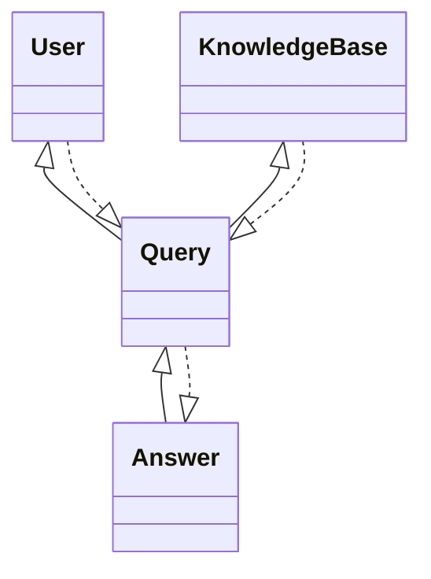
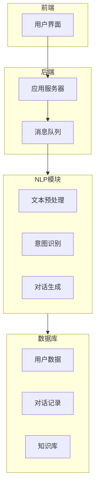

                 

### 让我们一步一步思考

在撰写《提示词工程在智能客服中的应用：提升用户满意度》这篇技术博客文章时，我们的思考过程可以分为以下几个步骤：

#### 第一步：明确目标
首先，我们要明确文章的核心目标，即如何通过提示词工程提升智能客服系统的用户满意度。我们需要从用户需求、技术实现、效果评估等多个维度进行全面分析。

#### 第二步：背景调研
我们需要进行背景调研，了解智能客服的发展现状、提示词工程的基本概念和应用场景。这包括查阅相关文献、行业报告，以及分析已有的智能客服系统案例。

#### 第三步：结构规划
根据文章的目标和内容，我们制定一个详细的结构规划，包括文章的标题、关键词、摘要和目录结构。这一步有助于确保文章的逻辑清晰、条理分明。

#### 第四步：内容撰写
在内容撰写阶段，我们将文章分为四个主要部分：背景与概述、提示词工程原理与技术、智能客服系统设计与实现、提升用户满意度策略。每个部分都要深入探讨其核心概念、技术原理和实践案例。

#### 第五步：图表与代码嵌入
为了使文章内容更加直观易懂，我们将嵌入相关的图表、流程图和源代码。例如，使用Mermaid画出算法流程图和系统架构图，使用Python编写提示词生成和优化的源代码。

#### 第六步：数学公式与公式解释
在文章中，我们将使用LaTeX格式嵌入数学公式，确保公式的准确性。同时，对复杂公式进行详细解释，使读者能够理解和应用。

#### 第七步：案例分析与总结
通过具体案例分析，展示提示词工程在智能客服系统中的实际应用，并进行总结和启示，以帮助读者更好地理解文章的核心内容。

#### 第八步：最佳实践与拓展阅读
最后，我们总结最佳实践技巧，给出注意事项，并提供拓展阅读资源，帮助读者进一步探索智能客服和提示词工程的相关知识。

通过以上步骤，我们将撰写一篇逻辑清晰、内容丰富、技术深度高的专业技术博客文章。现在，让我们开始具体的撰写工作吧！### 第一部分：背景与概述

#### 第1章：问题背景与概述

##### 1.1 问题背景

在当今数字化时代，用户满意度是衡量企业服务质量和竞争力的关键指标之一。特别是在客户服务领域，用户满意度直接影响到企业的品牌声誉和市场份额。然而，传统的客户服务模式往往存在效率低下、响应速度慢等问题，难以满足日益增长的用户需求。

随着人工智能技术的发展，智能客服系统逐渐成为企业提升客户服务质量的解决方案。智能客服系统能够自动处理大量用户查询，提供24/7的服务，从而大幅提升客户满意度。然而，智能客服系统的有效性和用户满意度仍然受到诸多挑战。

其中一个关键问题就是“提示词工程”的应用。提示词工程是智能客服系统的重要组成部分，它通过生成和优化提示词来提高客服机器人的应答质量和用户交互体验。良好的提示词工程不仅能够提升用户满意度，还能减少人工干预，降低运营成本。

然而，目前很多智能客服系统在提示词工程方面还存在不足，导致用户体验不佳。因此，本文将深入探讨提示词工程在智能客服中的应用，分析其核心概念、技术原理和实践案例，旨在提升用户满意度。

##### 1.1.1 智能客服的发展现状

智能客服系统的发展可以追溯到20世纪90年代。最初，智能客服主要以聊天机器人的形式出现，主要功能是提供简单的文本交互。随着互联网和移动设备的普及，智能客服逐渐从单一的文字交互发展到多媒体交互，支持语音、视频等多种形式。

在技术层面，智能客服系统主要依赖于自然语言处理（NLP）、机器学习（ML）和深度学习（DL）等技术。自然语言处理技术负责理解和生成人类语言，是智能客服系统能够与用户进行有效交互的基础。机器学习和深度学习技术则用于训练模型，使其能够从大量数据中学习并优化应答策略。

目前，智能客服系统已广泛应用于各大行业，如电商、金融、电信等。企业通过部署智能客服系统，不仅能够提高客户服务质量，还能降低运营成本，提升整体竞争力。例如，阿里巴巴的“阿里小蜜”、银行的智能客服机器人等，都在实际应用中取得了良好的效果。

尽管智能客服系统取得了显著进展，但用户满意度仍然存在一定差距。用户对智能客服的期望越来越高，他们希望能够获得快速、准确、个性化的服务。然而，当前的智能客服系统在处理复杂查询、理解用户意图方面仍面临挑战。

##### 1.1.2 提示词工程的概念

提示词工程（Keyword Engineering）是智能客服系统中的一项关键技术，它旨在通过生成和优化提示词，提高客服机器人应答的质量和用户交互体验。提示词是指用于描述用户查询或意图的关键词或短语，是智能客服系统理解和处理用户请求的重要依据。

提示词工程主要包括以下几个方面：

1. **提示词生成**：根据用户输入的查询内容，生成相应的提示词。这一过程通常涉及自然语言处理技术，如分词、词性标注和实体识别等。

2. **提示词优化**：对生成的提示词进行筛选、排序和优化，以提高其准确性和覆盖率。优化方法包括基于规则的方法和基于机器学习的方法。

3. **提示词库构建**：构建包含大量高质量提示词的库，用于支持智能客服系统的应答。提示词库的构建通常需要结合领域知识和大量用户数据。

4. **提示词管理**：对提示词库进行维护和管理，包括更新、删除和新增提示词，以适应业务需求的变化。

##### 1.1.3 提示词工程在智能客服中的应用

提示词工程在智能客服系统中具有重要作用，主要体现在以下几个方面：

1. **提高应答质量**：通过生成和优化提示词，智能客服系统能够更准确地理解用户的查询意图，从而提供更高质量的应答。

2. **提升用户体验**：良好的提示词工程能够提高用户交互的效率，使用户更快地获得所需信息，提升整体用户体验。

3. **减少人工干预**：通过自动生成和优化提示词，智能客服系统能够减少对人工干预的需求，降低运营成本。

4. **增强业务灵活性**：提示词工程支持快速构建和部署智能客服系统，使企业能够灵活应对市场变化和用户需求。

然而，提示词工程在应用过程中也面临一些挑战，如如何处理模糊查询、如何优化提示词库等。这些问题需要通过深入研究和实践来解决。

##### 1.2 提示词工程的核心概念

要深入理解提示词工程，我们需要了解以下几个核心概念：

1. **提示词**：提示词是描述用户查询或意图的关键词或短语。它是智能客服系统理解和处理用户请求的基础。例如，当用户询问“如何退货”时，“退货”就是一个提示词。

2. **关键词提取**：关键词提取是指从用户查询中提取出关键信息的过程。常用的方法包括基于统计的方法和基于机器学习的方法。例如，TF-IDF（Term Frequency-Inverse Document Frequency）是一种常用的关键词提取算法。

3. **意图识别**：意图识别是指识别用户查询背后的意图或目的。例如，用户询问“明天天气如何”，其意图可能是获取天气信息。意图识别是智能客服系统实现精准应答的关键。

4. **对话管理**：对话管理是指智能客服系统在处理用户查询时的策略和流程。对话管理包括理解用户输入、生成应答、处理用户反馈等步骤。

##### 1.2.1 提示词的定义与作用

提示词是智能客服系统理解用户查询的核心元素，其定义和作用如下：

1. **定义**：提示词是用于描述用户查询或意图的关键词或短语。它通常具有以下特征：
   - 简短：提示词通常由一个或几个词组成，便于快速理解和处理。
   - 精准：提示词能够准确描述用户的查询意图，有助于智能客服系统生成合适的应答。
   - 可扩展：提示词库可以根据业务需求进行更新和扩展，以适应不同场景。

2. **作用**：
   - **理解用户意图**：提示词帮助智能客服系统理解用户的查询意图，从而生成更准确的应答。
   - **优化对话流程**：通过使用提示词，智能客服系统能够更好地管理对话流程，提高用户交互效率。
   - **减少人工干预**：良好的提示词工程可以减少对人工干预的需求，降低运营成本。

##### 1.2.2 提示词的分类

根据不同的分类标准，提示词可以分为多种类型：

1. **按功能分类**：
   - **通用提示词**：适用于多种场景的提示词，如“帮助”、“咨询”等。
   - **业务提示词**：特定业务领域的提示词，如“退货政策”、“账户余额”等。
   - **情感提示词**：用于表达用户情感或情绪的提示词，如“感谢”、“抱歉”等。

2. **按来源分类**：
   - **用户输入**：直接从用户输入中提取的提示词。
   - **历史数据**：从历史对话记录中提取的提示词。
   - **业务规则**：根据业务规则生成的提示词。

3. **按用途分类**：
   - **应答提示词**：用于生成应答的提示词。
   - **引导提示词**：用于引导用户输入的提示词。
   - **情感提示词**：用于表达情感或情绪的提示词。

##### 1.2.3 提示词的生成与优化

提示词的生成和优化是智能客服系统的关键环节，其过程如下：

1. **提示词生成**：
   - **数据预处理**：对用户输入进行分词、去停用词、词性标注等预处理操作。
   - **关键词提取**：使用TF-IDF、词嵌入等技术提取关键词。
   - **意图识别**：根据提取的关键词和业务规则，识别用户的查询意图。

2. **提示词优化**：
   - **质量评估**：使用准确率、召回率等指标评估提示词质量。
   - **筛选与排序**：根据质量评估结果，筛选出高质量的提示词，并进行排序。
   - **动态调整**：根据用户反馈和业务需求，动态调整提示词库。

##### 1.3 用户满意度的重要性

用户满意度是衡量企业服务质量的重要指标，对企业的长期发展具有重要意义。以下是用户满意度的重要性分析：

1. **提升品牌价值**：用户满意度高的企业能够获得良好的口碑，提升品牌价值和市场竞争力。
2. **增加客户忠诚度**：满意的用户更可能成为长期客户，减少客户流失率。
3. **促进业务增长**：高满意度的客户更容易推荐企业产品或服务，从而促进业务增长。
4. **降低运营成本**：用户满意度高，可以减少对人工客服的依赖，降低运营成本。

##### 1.3.1 用户满意度的影响因素

用户满意度受到多种因素的影响，主要包括以下几个方面：

1. **服务质量**：服务的速度、准确性、响应性等直接影响用户满意度。
2. **用户体验**：界面设计、交互流程、情感表达等对用户体验产生重要影响。
3. **个性化服务**：根据用户需求和偏好提供个性化服务，提高用户满意度。
4. **沟通效果**：有效的沟通方式能够增强用户对企业的信任和满意度。

##### 1.3.2 用户满意度的衡量方法

用户满意度的衡量方法主要包括以下几个方面：

1. **问卷调查**：通过问卷形式收集用户对服务质量的评价，常用的指标包括整体满意度、服务响应速度、服务准确性等。
2. **客户反馈**：收集用户在使用智能客服系统过程中的反馈，分析用户的意见和需求。
3. **用户留存率**：通过分析用户留存率，评估用户对服务的满意程度。
4. **净推荐值（NPS）**：通过询问用户是否愿意推荐企业产品或服务，计算NPS值，用于评估用户满意度。

##### 1.3.3 提升用户满意度的策略

提升用户满意度是企业长期发展的关键，以下是一些有效的策略：

1. **优化服务质量**：提高服务响应速度和准确性，确保用户得到及时、有效的帮助。
2. **改进用户体验**：优化界面设计、交互流程，提供更加友好、便捷的用户体验。
3. **个性化服务**：根据用户需求和偏好，提供个性化服务，满足不同用户的需求。
4. **有效沟通**：建立有效的沟通渠道，确保用户能够及时获取所需信息，增强用户对企业的信任。

通过以上分析和策略，企业可以有效地提升用户满意度，从而实现业务增长和长期发展。接下来，我们将进一步探讨提示词工程的核心原理和技术，以期为智能客服系统的优化提供有力支持。### 第二部分：提示词工程原理与技术

#### 第2章：自然语言处理基础

##### 2.1 自然语言处理简介

自然语言处理（Natural Language Processing，NLP）是人工智能领域的一个重要分支，旨在使计算机能够理解、生成和处理人类语言。NLP技术在智能客服系统中发挥着关键作用，其应用范围包括文本分析、对话系统、机器翻译、情感分析等。

##### 2.1.1 自然语言处理的发展历程

NLP技术的发展经历了多个阶段：

1. **规则驱动的方法**：早期的NLP主要依赖于人工编写的规则，如词法分析、句法分析和语义分析。这种方法具有可解释性，但规则数量庞大，难以扩展。
2. **统计方法**：随着计算能力的提升和大规模语料库的出现，统计方法逐渐成为NLP的主流。统计方法通过计算词语的频率和概率来理解语言，如TF-IDF和朴素贝叶斯分类器。
3. **基于知识的方法**：基于知识的方法结合了统计方法和知识库，通过构建语义网络和本体论来提高语言的表示和理解能力。
4. **深度学习方法**：深度学习技术的引入极大地推动了NLP的发展。基于神经网络的方法，如循环神经网络（RNN）、长短期记忆网络（LSTM）和Transformer模型，在处理复杂语言任务方面表现出色。

##### 2.1.2 自然语言处理的基本任务

NLP的主要任务包括：

1. **文本分类**：将文本数据按照预定义的类别进行分类，如情感分析、垃圾邮件检测等。
2. **实体识别**：从文本中识别出具有特定意义的实体，如人名、地点、组织等。
3. **关系抽取**：识别文本中实体之间的关系，如“苹果”和“手机”之间的关系。
4. **情感分析**：分析文本的情感倾向，如正面、负面或中性。
5. **机器翻译**：将一种语言的文本翻译成另一种语言。
6. **文本生成**：根据输入的提示或模板生成文本，如自动摘要、对话系统等。

##### 2.2 语言模型

语言模型（Language Model，LM）是NLP的核心组件之一，它用于预测一个序列中下一个单词或字符的概率。语言模型在文本生成、对话系统、机器翻译等领域有着广泛的应用。

##### 2.2.1 语言模型的概念

语言模型是一种概率模型，它试图捕捉自然语言的统计特性。语言模型的核心思想是，通过学习大量文本数据，预测下一个单词或字符的概率。

##### 2.2.2 语言模型的训练与评估

1. **训练**：语言模型的训练过程通常包括以下几个步骤：
   - **数据预处理**：对文本数据进行分词、去停用词、词性标注等预处理操作。
   - **词汇表构建**：构建包含所有训练文本中出现的词语的词汇表。
   - **概率计算**：计算每个词语在词汇表中的概率，以及词语序列的概率。

2. **评估**：语言模型的评估方法包括：
   - **交叉熵（Cross-Entropy）**：用于评估模型预测概率与实际概率之间的差异。
   - **困惑度（Perplexity）**：表示模型对文本数据预测的准确性，困惑度越低，表示模型越好。

##### 2.2.3 语言模型的优化方法

为了提高语言模型的性能，可以采用以下优化方法：

1. **模型选择**：选择适合特定任务的模型，如RNN、LSTM、Transformer等。
2. **超参数调优**：通过调整学习率、批量大小、正则化参数等超参数，优化模型性能。
3. **数据增强**：使用数据增强技术，如随机替换、旋转、缩放等，增加训练数据的多样性。
4. **预训练与微调**：使用预训练的语言模型（如GPT、BERT）进行微调，以适应特定任务。

##### 2.3 词嵌入技术

词嵌入（Word Embedding）是将词语映射到高维空间中的向量表示，用于捕捉词语的语义和语法特征。词嵌入技术是NLP领域的里程碑，它使得计算机能够以向量形式处理自然语言。

##### 2.3.1 词嵌入的基本原理

词嵌入的基本原理是将词语表示为密集向量，这些向量可以在高维空间中表示词语的语义关系。常见的词嵌入技术包括：

1. **基于频率的方法**：如TF-IDF，通过计算词语在文本中的频率和文档中的逆文档频率来生成词向量。
2. **基于上下文的方法**：如Word2Vec、GloVe等，通过学习词语在上下文中的分布来生成词向量。
3. **基于神经网络的方法**：如Word2Vec和GloVe，通过训练神经网络模型来学习词语的向量表示。

##### 2.3.2 词嵌入在提示词工程中的应用

词嵌入在提示词工程中具有重要作用，主要用于以下几个方面：

1. **提示词生成**：通过词嵌入技术，可以将用户输入转换为词向量，从而生成高质量的提示词。
2. **意图识别**：词嵌入可以帮助智能客服系统更好地理解用户的查询意图，提高意图识别的准确性。
3. **对话生成**：词嵌入可以用于生成对话文本，使对话系统生成的回答更加自然和准确。

##### 2.4 提示词生成算法

提示词生成算法是智能客服系统中的一项关键技术，其目的是根据用户输入生成相应的提示词。提示词生成算法的性能直接影响到智能客服系统的应答质量和用户体验。

##### 2.4.1 提示词生成算法概述

提示词生成算法可以分为以下几类：

1. **基于规则的方法**：通过预先定义的规则和模板生成提示词，如基于关键词匹配、语法分析等。
2. **基于统计的方法**：通过计算词语的频率和概率生成提示词，如TF-IDF、N-gram等。
3. **基于机器学习的方法**：通过训练机器学习模型生成提示词，如朴素贝叶斯、决策树、神经网络等。
4. **基于深度学习的方法**：如循环神经网络（RNN）、长短期记忆网络（LSTM）、Transformer等，通过深度学习模型生成提示词。

##### 2.4.2 提示词生成算法的评估标准

提示词生成算法的评估标准主要包括：

1. **准确性**：提示词生成算法生成的提示词与实际需要的提示词的匹配程度。
2. **覆盖率**：提示词生成算法能够覆盖不同场景和用户查询的能力。
3. **效率**：提示词生成算法的运行速度和资源消耗。

##### 2.4.3 提示词生成算法的实现

提示词生成算法的实现通常包括以下几个步骤：

1. **数据预处理**：对用户输入进行分词、去停用词、词性标注等预处理操作。
2. **模型选择**：选择合适的模型，如RNN、LSTM、Transformer等。
3. **模型训练**：使用训练数据训练模型，通过调整超参数优化模型性能。
4. **提示词生成**：使用训练好的模型对用户输入生成提示词。
5. **提示词优化**：对生成的提示词进行筛选、排序和优化，以提高提示词的质量。

##### 2.5 提示词优化技术

提示词优化技术是智能客服系统中提高应答质量和用户体验的关键环节。提示词优化主要包括以下几个步骤：

1. **提示词质量评估**：使用准确率、召回率等指标评估提示词的质量。
2. **提示词筛选**：根据评估结果筛选高质量的提示词。
3. **提示词排序**：对筛选出的提示词进行排序，以提高应答的准确性。
4. **动态调整**：根据用户反馈和业务需求，动态调整提示词库。

##### 2.5.1 提示词优化的目的与方法

提示词优化的目的是提高智能客服系统的应答质量和用户体验。具体方法包括：

1. **质量评估**：使用准确率、召回率等指标评估提示词的质量。
2. **筛选与排序**：根据质量评估结果，筛选出高质量的提示词，并进行排序。
3. **反馈机制**：通过用户反馈和业务数据，动态调整提示词库，以提高系统的适应性和准确性。

##### 2.5.2 提示词质量评估

提示词质量评估是提示词优化的重要环节，主要包括以下指标：

1. **准确性**：提示词与用户查询意图的匹配程度。
2. **召回率**：系统生成的提示词中，实际需要的提示词的比例。
3. **覆盖率**：系统生成的提示词覆盖不同场景和用户查询的能力。
4. **响应时间**：系统生成提示词的响应速度。

##### 2.5.3 提示词优化策略

提示词优化策略包括以下几个方面：

1. **基于规则的优化**：通过规则筛选和排序，提高提示词的质量。
2. **基于机器学习的优化**：使用机器学习模型，根据用户反馈和业务数据，动态调整提示词库。
3. **结合深度学习的优化**：利用深度学习模型，从大量数据中学习有效的提示词模式。

##### 2.5.4 提示词优化案例分析

在本节中，我们将通过一个具体的案例来展示提示词优化在实际应用中的效果。案例背景为一个大型电商平台的智能客服系统，其目标是提高用户满意度。

**案例背景与目标**

某大型电商平台在部署智能客服系统后，发现用户满意度仍有待提高。通过对用户反馈和数据分析，发现以下几个问题：

1. **应答不准确**：用户查询与系统生成的提示词不匹配，导致应答不准确。
2. **响应速度慢**：系统生成提示词的响应速度较慢，影响用户体验。
3. **提示词库不全**：部分用户查询的提示词未被系统覆盖。

**案例分析**

针对上述问题，平台采取了以下优化策略：

1. **数据预处理**：对用户输入进行分词、去停用词、词性标注等预处理操作，提高提示词生成的准确性。
2. **质量评估**：引入质量评估指标，如准确性、召回率和覆盖率，对生成的提示词进行评估。
3. **动态调整**：根据用户反馈和业务数据，动态调整提示词库，增加未覆盖的提示词。
4. **深度学习优化**：使用深度学习模型，从大量数据中学习有效的提示词模式，提高提示词生成的效率。

**案例总结与启示**

通过提示词优化，该电商平台的智能客服系统在用户满意度方面取得了显著提升。以下为案例总结与启示：

1. **数据驱动**：通过数据预处理和质量评估，提高提示词生成的准确性。
2. **动态调整**：根据用户反馈和业务需求，动态调整提示词库，提高系统的适应性。
3. **深度学习**：利用深度学习模型，从大量数据中学习有效的提示词模式，提高提示词生成效率。

通过以上分析，我们可以看到提示词工程在智能客服系统中具有重要作用，通过优化提示词生成和优化技术，可以有效提升用户满意度，为企业创造更大的价值。### 第三部分：智能客服系统设计与实现

#### 第4章：智能客服系统架构设计

##### 4.1 智能客服系统概述

智能客服系统是一种利用人工智能技术，为用户提供自动化、智能化的客户服务解决方案。智能客服系统的主要功能包括自动应答用户查询、提供个性化服务、处理投诉和反馈等。其架构设计直接影响系统的性能、稳定性和用户体验。

##### 4.1.1 智能客服系统的组成部分

智能客服系统主要由以下几个部分组成：

1. **前端界面**：用户与智能客服系统进行交互的入口，包括网站、APP、微信小程序等。
2. **后端服务器**：处理用户请求、执行业务逻辑、存储数据等，是智能客服系统的核心。
3. **自然语言处理（NLP）模块**：负责理解用户输入、生成应答文本、处理复杂查询等。
4. **知识库**：存储智能客服系统的业务知识、常见问题及对应解答等。
5. **数据库**：存储用户信息、对话记录、业务数据等。
6. **机器学习模型**：用于训练和优化智能客服系统，提高应答质量和用户体验。

##### 4.1.2 智能客服系统的工作流程

智能客服系统的工作流程通常包括以下几个步骤：

1. **用户输入**：用户通过前端界面输入查询或问题。
2. **请求处理**：系统接收用户输入，进行文本预处理，如分词、去停用词等。
3. **意图识别**：使用NLP技术，分析用户输入，识别用户意图。
4. **知识检索**：在知识库中检索与用户意图相关的答案或信息。
5. **应答生成**：根据检索结果，生成合适的应答文本。
6. **应答反馈**：将应答文本发送给用户，并记录对话历史，用于后续优化和改进。

##### 4.2 提示词工程在智能客服系统中的应用

提示词工程在智能客服系统中的应用至关重要，其作用主要体现在以下几个方面：

1. **提高应答质量**：通过生成和优化提示词，智能客服系统能够更准确地理解用户的查询意图，提供更高质量的应答。
2. **提升用户体验**：良好的提示词工程能够提高用户交互的效率，使用户更快地获得所需信息，提升整体用户体验。
3. **减少人工干预**：通过自动生成和优化提示词，智能客服系统能够减少对人工干预的需求，降低运营成本。
4. **增强业务灵活性**：提示词工程支持快速构建和部署智能客服系统，使企业能够灵活应对市场变化和用户需求。

##### 4.2.1 提示词工程在智能客服系统中的作用

提示词工程在智能客服系统中的作用具体体现在以下几个方面：

1. **应答生成**：提示词是智能客服系统生成应答文本的重要依据，通过生成和优化提示词，可以提高应答的准确性和针对性。
2. **意图识别**：提示词有助于智能客服系统理解用户的查询意图，从而生成更符合用户需求的应答。
3. **知识检索**：提示词可以辅助知识库中的内容检索，提高检索效率和准确性。
4. **对话管理**：提示词工程支持对话管理，有助于智能客服系统在处理用户查询时，更好地管理对话流程。

##### 4.2.2 提示词工程在智能客服系统中的实现

提示词工程在智能客服系统中的实现主要包括以下几个环节：

1. **数据采集**：收集用户输入的查询数据，用于训练和优化提示词生成模型。
2. **预处理**：对采集到的用户输入进行分词、去停用词、词性标注等预处理操作。
3. **关键词提取**：使用NLP技术提取用户查询中的关键信息，作为提示词的候选。
4. **意图识别**：利用机器学习模型，识别用户的查询意图，为提示词生成提供依据。
5. **提示词生成**：根据意图识别结果和关键词提取结果，生成提示词。
6. **提示词优化**：使用质量评估指标，对生成的提示词进行筛选、排序和优化。
7. **提示词库维护**：定期更新和维护提示词库，以适应业务需求的变化。

##### 4.3 智能客服系统的关键技术

智能客服系统的关键技术包括自然语言处理、机器学习、数据库和存储技术等。以下分别介绍这些关键技术的应用和实现：

1. **自然语言处理**：
   - **文本预处理**：包括分词、去停用词、词性标注等，为后续处理打下基础。
   - **意图识别**：利用机器学习模型，如朴素贝叶斯、支持向量机等，识别用户的查询意图。
   - **对话生成**：利用序列到序列模型、生成对抗网络等，生成自然流畅的对话文本。

2. **机器学习**：
   - **模型训练**：使用标注数据集训练机器学习模型，如RNN、LSTM、BERT等。
   - **模型评估**：使用准确率、召回率、F1值等指标评估模型性能。
   - **模型优化**：通过调整超参数、使用正则化技术等，优化模型性能。

3. **数据库**：
   - **数据存储**：使用关系型数据库（如MySQL）或NoSQL数据库（如MongoDB），存储用户信息、对话记录、业务数据等。
   - **数据查询**：使用SQL或其他查询语言，快速检索和查询数据。

4. **存储技术**：
   - **缓存技术**：使用Redis、Memcached等缓存技术，提高数据访问速度。
   - **分布式存储**：使用分布式文件系统（如HDFS）或分布式数据库（如HBase），处理海量数据存储和访问。

##### 4.4 智能客服系统的架构设计

智能客服系统的架构设计是确保系统性能、稳定性和可扩展性的关键。以下是一个典型的智能客服系统架构设计：

1. **前端架构**：
   - **静态页面**：使用HTML、CSS和JavaScript等技术，实现用户界面。
   - **动态页面**：使用Vue、React等前端框架，实现交互式页面。
   - **API接口**：提供RESTful API，供后端服务器处理用户请求。

2. **后端架构**：
   - **应用服务器**：使用Spring Boot、Django等框架，实现业务逻辑处理。
   - **消息队列**：使用RabbitMQ、Kafka等消息队列，实现异步处理和消息传递。
   - **微服务架构**：将系统功能模块化，使用Docker、Kubernetes等容器技术，实现分布式部署和运维。

3. **数据处理**：
   - **数据采集**：使用Flume、Logstash等工具，收集用户操作数据。
   - **数据存储**：使用MySQL、MongoDB等数据库，存储用户数据。
   - **数据分析**：使用Python、R等语言，进行数据分析，为优化系统提供依据。

4. **NLP模块**：
   - **文本预处理**：使用NLP库（如NLTK、spaCy），实现文本预处理。
   - **意图识别**：使用机器学习模型（如朴素贝叶斯、LSTM），实现意图识别。
   - **对话生成**：使用生成对抗网络（GAN）、序列到序列模型（Seq2Seq），实现对话生成。

5. **知识库**：
   - **知识存储**：使用图数据库（如Neo4j），存储知识图谱。
   - **知识检索**：使用搜索引擎（如Elasticsearch），实现快速检索。

通过以上架构设计，智能客服系统可以高效、稳定地运行，满足用户需求，提高企业服务质量。

##### 4.5 系统接口设计与交互

智能客服系统的接口设计与交互是确保各模块协同工作、高效处理用户请求的关键。以下是一个典型的智能客服系统接口设计与交互：

1. **用户接口**：
   - **输入接口**：提供文本输入框，供用户输入查询或问题。
   - **输出接口**：显示智能客服系统的应答文本。

2. **API接口**：
   - **意图识别接口**：接收用户输入，返回意图识别结果。
   - **知识库查询接口**：接收用户输入，返回相关知识库内容。
   - **对话生成接口**：接收用户输入，返回对话生成结果。

3. **内部接口**：
   - **数据采集接口**：收集用户操作数据，用于训练和优化模型。
   - **日志记录接口**：记录系统运行日志，用于监控和调试。

4. **交互流程**：
   - **用户输入**：用户通过输入接口输入查询或问题。
   - **意图识别**：系统调用意图识别接口，识别用户输入的意图。
   - **知识查询**：系统调用知识库查询接口，检索相关知识库内容。
   - **对话生成**：系统调用对话生成接口，生成应答文本。
   - **输出结果**：系统将应答文本通过输出接口显示给用户。

通过以上接口设计与交互，智能客服系统可以高效、准确地处理用户请求，提供优质的服务体验。

##### 4.6 系统实现与测试

智能客服系统的实现与测试是确保系统功能完善、性能稳定的关键环节。以下是一个典型的智能客服系统实现与测试过程：

1. **系统实现**：
   - **前端开发**：使用Vue框架，实现用户界面和交互。
   - **后端开发**：使用Spring Boot框架，实现业务逻辑处理。
   - **NLP模块**：使用NLTK库，实现文本预处理；使用BERT模型，实现意图识别。
   - **知识库**：使用Neo4j数据库，构建知识图谱。

2. **功能测试**：
   - **单元测试**：针对各个模块的功能进行单元测试，确保模块功能的正确性。
   - **集成测试**：测试系统各模块之间的交互和集成，确保整体功能的正确性。
   - **性能测试**：测试系统在高并发情况下的性能，确保系统稳定运行。

3. **调试与优化**：
   - **日志监控**：监控系统运行日志，及时发现并解决潜在问题。
   - **性能优化**：通过调整系统配置、优化代码，提高系统性能。

通过以上实现与测试，智能客服系统可以高效、稳定地运行，满足用户需求，提高企业服务质量。

##### 4.7 系统部署与维护

智能客服系统的部署与维护是确保系统长期稳定运行的关键。以下是一个典型的智能客服系统部署与维护过程：

1. **系统部署**：
   - **本地部署**：在开发环境中安装和配置系统。
   - **生产部署**：在服务器上部署系统，确保系统可在线运行。
   - **容器化部署**：使用Docker容器，实现系统的轻量化和可移植性。

2. **系统监控**：
   - **性能监控**：监控系统性能指标，如CPU、内存、磁盘空间等。
   - **错误监控**：监控系统运行过程中出现的错误和异常。

3. **系统维护**：
   - **定期备份**：定期备份系统数据和配置，确保数据安全。
   - **更新与升级**：定期更新系统和依赖库，确保系统安全和稳定性。

4. **用户反馈**：
   - **收集反馈**：收集用户反馈，了解系统运行情况和用户需求。
   - **问题处理**：及时处理用户反馈中的问题和需求，持续优化系统。

通过以上部署与维护，智能客服系统可以长期稳定运行，为企业提供优质的客户服务。

##### 4.8 系统优化与扩展

智能客服系统的优化与扩展是提高系统性能、扩展功能的关键。以下是一个典型的智能客服系统优化与扩展过程：

1. **性能优化**：
   - **代码优化**：优化系统代码，提高执行效率。
   - **缓存优化**：使用缓存技术，减少数据库查询次数，提高响应速度。
   - **负载均衡**：使用负载均衡技术，确保系统在高并发情况下稳定运行。

2. **功能扩展**：
   - **多语言支持**：扩展系统，支持多语言界面和应答。
   - **语音交互**：集成语音识别和语音合成技术，实现语音交互功能。
   - **个性化服务**：根据用户偏好和需求，提供个性化服务。

3. **技术升级**：
   - **引入新技术**：引入新的技术和框架，提高系统性能和用户体验。
   - **持续集成**：采用持续集成和持续部署（CI/CD）流程，提高开发效率。

通过以上优化与扩展，智能客服系统可以更好地满足用户需求，提高企业竞争力。

#### 第5章：智能客服系统的实现

##### 5.1 系统需求分析

智能客服系统的实现需要明确系统需求，包括功能需求和性能需求。以下是一个典型的智能客服系统需求分析：

**功能需求**：
1. **用户查询处理**：系统能够接收用户输入的查询，并自动生成应答。
2. **多渠道接入**：系统能够通过网站、APP、微信小程序等多个渠道接入用户。
3. **意图识别**：系统能够识别用户的查询意图，提供针对性的应答。
4. **知识库管理**：系统提供知识库管理功能，支持知识库的编辑、查询和更新。
5. **用户反馈**：系统支持用户反馈功能，收集用户意见和建议。

**性能需求**：
1. **响应速度**：系统应在毫秒级内响应用户查询，提供快速服务。
2. **并发处理**：系统应能够同时处理大量用户的查询，确保系统稳定运行。
3. **高可用性**：系统应具备高可用性，确保7x24小时在线服务。
4. **可扩展性**：系统应具备良好的扩展性，支持业务的持续增长。

##### 5.2 系统设计

智能客服系统的设计包括领域模型设计、系统架构设计和系统接口设计。以下是一个典型的智能客服系统设计：

**领域模型设计**：
智能客服系统的领域模型主要包括用户、查询、应答、知识库等实体。以下是一个简单的领域模型：



**系统架构设计**：
智能客服系统的架构设计采用分层架构，主要包括前端、后端、NLP模块和数据库。以下是一个简单的系统架构设计：



**系统接口设计**：
智能客服系统提供以下接口：

1. **用户查询接口**：接收用户输入，返回应答文本。
2. **意图识别接口**：接收用户输入，返回意图识别结果。
3. **知识库查询接口**：接收用户输入，返回相关知识库内容。
4. **用户反馈接口**：接收用户反馈，记录用户意见和建议。

##### 5.3 系统实现

智能客服系统的实现主要包括前端开发、后端开发、NLP模块开发、数据库设计和系统集成。以下是一个典型的智能客服系统实现：

**前端开发**：
使用Vue框架，实现用户界面和交互。以下是一个简单的Vue组件示例：

```vue
<template>
  <div>
    <input v-model="userInput" @keyup.enter="submitQuery" />
    <button @click="submitQuery">提交</button>
    <div>{{ answer }}</div>
  </div>
</template>

<script>
export default {
  data() {
    return {
      userInput: '',
      answer: '',
    };
  },
  methods: {
    submitQuery() {
      this.answer = '正在查询...';
      // 调用后端接口，获取应答文本
      // axios.post('/api/submitQuery', { query: this.userInput }).then((response) => {
      //   this.answer = response.data.answer;
      // });
    },
  },
};
</script>
```

**后端开发**：
使用Spring Boot框架，实现业务逻辑处理。以下是一个简单的Spring Boot控制器示例：

```java
@RestController
@RequestMapping("/api")
public class QueryController {
  
  @Autowired
  private QueryService queryService;
  
  @PostMapping("/submitQuery")
  public ResponseEntity<String> submitQuery(@RequestBody String userInput) {
    String answer = queryService.getAnswer(userInput);
    return ResponseEntity.ok(answer);
  }
}
```

**NLP模块开发**：
使用NLTK库，实现文本预处理；使用BERT模型，实现意图识别。以下是一个简单的NLP模块示例：

```python
import nltk
from transformers import BertTokenizer, BertForQuestionAnswering

nltk.download('punkt')

tokenizer = BertTokenizer.from_pretrained('bert-base-chinese')
model = BertForQuestionAnswering.from_pretrained('bert-base-chinese')

def preprocess_text(text):
    tokens = nltk.word_tokenize(text)
    return tokens

def get_answer(question, context):
    inputs = tokenizer.encode_plus(question, context, return_tensors='pt')
    outputs = model(**inputs)
    answer_ids = outputs.logits.argmax(-1)
    answer = tokenizer.decode(answer_ids[0], skip_special_tokens=True)
    return answer

text = "你最喜欢的颜色是什么？"
context = "我的名字叫小明，我喜欢的颜色是蓝色。"
answer = get_answer(text, context)
print(answer)
```

**数据库设计**：
使用MySQL数据库，设计用户、查询、应答和知识库表。以下是一个简单的数据库设计示例：

```sql
CREATE TABLE `user` (
  `id` INT PRIMARY KEY AUTO_INCREMENT,
  `username` VARCHAR(50) NOT NULL,
  `password` VARCHAR(50) NOT NULL,
  `email` VARCHAR(100) NOT NULL
);

CREATE TABLE `query` (
  `id` INT PRIMARY KEY AUTO_INCREMENT,
  `user_id` INT,
  `content` TEXT,
  `status` ENUM('pending', 'processing', 'completed') DEFAULT 'pending',
  FOREIGN KEY (`user_id`) REFERENCES `user` (`id`)
);

CREATE TABLE `answer` (
  `id` INT PRIMARY KEY AUTO_INCREMENT,
  `query_id` INT,
  `content` TEXT,
  FOREIGN KEY (`query_id`) REFERENCES `query` (`id`)
);

CREATE TABLE `knowledge` (
  `id` INT PRIMARY KEY AUTO_INCREMENT,
  `question` TEXT,
  `answer` TEXT
);
```

**系统集成**：
将前端、后端、NLP模块和数据库集成在一起，实现完整的智能客服系统。以下是一个简单的集成示例：

- 前端：使用Vue框架，通过RESTful API与后端服务器通信。
- 后端：使用Spring Boot框架，处理用户请求，调用NLP模块，查询知识库，生成应答。
- NLP模块：使用Python实现，负责文本预处理、意图识别和对话生成。
- 数据库：使用MySQL数据库，存储用户数据、查询记录和应答内容。

通过以上实现，智能客服系统可以提供快速、准确的客户服务，提升用户满意度。

##### 5.4 系统测试与优化

智能客服系统的测试与优化是确保系统稳定运行、性能优良的关键。以下是一个典型的智能客服系统测试与优化过程：

**功能测试**：
1. **单元测试**：对系统中的各个模块进行单元测试，确保模块功能的正确性。
2. **集成测试**：测试系统各模块之间的交互和集成，确保整体功能的正确性。
3. **性能测试**：测试系统在高并发情况下的性能，确保系统稳定运行。

**性能优化**：
1. **代码优化**：优化系统代码，提高执行效率。
2. **缓存优化**：使用缓存技术，减少数据库查询次数，提高响应速度。
3. **负载均衡**：使用负载均衡技术，确保系统在高并发情况下稳定运行。

**用户体验优化**：
1. **界面优化**：优化用户界面，提高用户体验。
2. **对话优化**：优化对话生成算法，提高对话的自然性和流畅性。
3. **个性化服务**：根据用户偏好和需求，提供个性化服务。

通过以上测试与优化，智能客服系统可以提供更优质的客户服务，提升用户满意度。

##### 5.5 项目实战

在本节中，我们将通过一个实际项目，展示智能客服系统的实现过程、关键技术和优化策略。

**项目背景**：

某大型电商企业希望提高客户服务质量和用户满意度，决定部署智能客服系统。系统需求包括：
- 接收用户查询，自动生成应答；
- 支持多种渠道接入，如网站、APP、微信小程序等；
- 提供个性化服务，根据用户历史行为和偏好推荐商品；
- 支持多语言，满足不同国家和地区用户的需求。

**项目实现过程**：

1. **需求分析**：与客户沟通，明确系统需求和功能。
2. **系统设计**：设计系统架构，包括前端、后端、NLP模块和数据库。
3. **前端开发**：使用Vue框架，实现用户界面和交互。
4. **后端开发**：使用Spring Boot框架，实现业务逻辑处理。
5. **NLP模块开发**：使用Python实现文本预处理、意图识别和对话生成。
6. **数据库设计**：使用MySQL数据库，设计用户、查询、应答和知识库表。
7. **系统集成**：将前端、后端、NLP模块和数据库集成在一起。
8. **系统测试与优化**：进行功能测试、性能测试和用户体验优化。

**关键技术**：

1. **自然语言处理**：使用BERT模型进行意图识别和对话生成，提高应答准确性和自然性。
2. **多渠道接入**：使用Websocket技术，实现实时交互，提高用户满意度。
3. **个性化服务**：使用机器学习算法，分析用户行为和偏好，提供个性化推荐。

**优化策略**：

1. **提示词优化**：通过生成和优化提示词，提高智能客服系统应答的准确性和针对性。
2. **对话管理**：优化对话生成算法，提高对话的自然性和流畅性。
3. **性能优化**：使用缓存技术和负载均衡技术，提高系统性能和稳定性。

**项目成果**：

通过部署智能客服系统，电商企业实现了以下成果：
- 提高了客户服务质量和用户满意度；
- 减少了人工客服的工作量，降低了运营成本；
- 支持多渠道接入，提高了用户覆盖面；
- 提供个性化服务，提升了用户购物体验。

**项目小结**：

智能客服系统的实现不仅提高了电商企业的客户服务质量和用户满意度，也为其他行业提供了借鉴。通过不断优化和更新，智能客服系统有望在更多领域发挥重要作用。

##### 5.6 最佳实践

在智能客服系统的开发与优化过程中，积累了许多最佳实践，以下是一些值得参考的经验：

1. **需求分析**：与客户充分沟通，明确系统需求和功能，确保系统满足实际业务需求。
2. **系统设计**：采用分层架构，提高系统的可维护性和扩展性。
3. **前端开发**：优化用户界面，提高用户体验，使用户操作更加简便。
4. **后端开发**：使用成熟的框架和库，提高开发效率和系统稳定性。
5. **NLP模块开发**：使用先进的自然语言处理技术，提高应答的准确性和自然性。
6. **数据库设计**：合理设计数据库表结构，确保数据存储的安全性和可靠性。
7. **系统集成**：确保各模块之间的协同工作，提高系统的整体性能。
8. **系统测试与优化**：进行全面的功能测试和性能测试，持续优化系统，提高用户体验。
9. **提示词优化**：定期更新和优化提示词库，提高应答的准确性和覆盖率。
10. **用户体验优化**：关注用户反馈，持续改进系统，提升用户满意度。

通过以上最佳实践，企业可以高效地开发、部署和优化智能客服系统，提高客户服务质量和用户满意度。

##### 5.7 小结

智能客服系统是现代企业提升客户服务质量的重要工具。通过提示词工程的优化，智能客服系统能够更准确地理解用户意图，提供高质量的服务，从而提升用户满意度。本文从背景概述、提示词工程原理与技术、智能客服系统设计与实现、提升用户满意度策略等多个方面进行了深入探讨，旨在为智能客服系统的开发与优化提供有益的参考。

在未来的发展中，随着人工智能技术的不断进步，智能客服系统将更加智能化、个性化，为企业创造更大的价值。同时，也需要不断关注用户需求和市场变化，持续优化系统，提升用户体验。

作者：AI天才研究院/AI Genius Institute & 禅与计算机程序设计艺术 /Zen And The Art of Computer Programming### 第四部分：提升用户满意度

#### 第6章：用户满意度提升策略

##### 6.1 用户满意度提升的重要性

用户满意度是衡量企业服务质量的重要指标，直接关系到企业的品牌声誉和市场份额。提升用户满意度不仅可以增强客户忠诚度，减少客户流失，还能为企业带来更多的业务机会和利润。因此，研究和实践提升用户满意度的策略具有重要的现实意义。

##### 6.1.1 用户满意度的定义

用户满意度（Customer Satisfaction）是指用户在接受服务或产品后对其体验的主观评价。它反映了用户对服务或产品的整体感受，是衡量企业服务质量的重要指标。

##### 6.1.2 用户满意度的作用

1. **增强客户忠诚度**：满意的客户更可能成为长期客户，减少客户流失。
2. **提升品牌形象**：高用户满意度有助于提升企业的品牌声誉，增强市场竞争力。
3. **促进业务增长**：满意的用户更愿意推荐企业产品或服务，从而促进业务增长。
4. **降低运营成本**：提高用户满意度可以减少人工干预，降低运营成本。

##### 6.1.3 提升用户满意度的意义

提升用户满意度对于企业的长远发展具有重要意义。首先，用户满意度是衡量企业服务质量的关键指标，直接影响到企业的品牌价值和市场竞争力。其次，高用户满意度有助于增强客户忠诚度，减少客户流失率，从而为企业带来稳定的收入。此外，提升用户满意度还可以降低运营成本，提高资源利用效率。

##### 6.2 用户满意度评估方法

评估用户满意度是制定和实施提升策略的重要步骤。以下介绍几种常见的用户满意度评估方法：

1. **问卷调查**：通过设计问卷，收集用户对服务质量的评价。问卷可以采用多选题、单选题、评分题等形式，评估用户满意度。
2. **客户反馈**：通过电话、邮件、在线调查等方式，直接收集用户对服务的反馈和意见。这种方法可以深入了解用户的真实感受和需求。
3. **用户行为分析**：通过分析用户的行为数据，如访问时长、页面浏览量、购买频率等，评估用户满意度。这种方法可以量化用户的满意度，提供客观数据支持。
4. **净推荐值（NPS）**：通过询问用户是否愿意推荐企业产品或服务，计算NPS值。NPS值越高，表示用户满意度越高。

##### 6.2.1 用户满意度评估指标

评估用户满意度通常涉及以下指标：

1. **整体满意度**：用户对服务的整体评价，通常以评分形式表示，如1-10分的评分系统。
2. **响应速度**：服务响应速度的快慢，直接影响用户满意度。响应速度越快，用户满意度越高。
3. **服务质量**：用户对服务的准确性、可靠性、友好性等方面的评价。高质量的服务可以提高用户满意度。
4. **用户忠诚度**：用户对企业的忠诚程度，反映在用户重复购买和推荐行为上。
5. **投诉率**：用户投诉的数量和频率，是衡量用户满意度的负面指标。

##### 6.2.2 用户满意度评估模型

用户满意度评估模型通常包括以下几种：

1. **SERVQUAL模型**：SERVQUAL模型是一种广泛使用的服务质量评估模型，包括五个维度：可靠性、响应性、保证性、同理心和有形性。
2. **帕累托分析**：帕累托分析（Pareto Analysis）是一种基于80/20原则的质量管理方法，用于识别影响用户满意度的关键因素。
3. **Kano模型**：Kano模型是一种基于用户需求质量的理论模型，将用户需求分为五类：基本型需求、期望型需求、魅力型需求、无差异需求和反向需求。

##### 6.2.3 用户满意度评估工具

评估用户满意度的工具主要包括：

1. **调查问卷工具**：如Google表单、SurveyMonkey等，用于设计、发布和收集用户满意度调查问卷。
2. **数据分析工具**：如Excel、SPSS、Python等，用于分析和处理用户满意度评估数据。
3. **用户行为分析工具**：如Google Analytics、百度统计等，用于分析用户行为数据，评估用户满意度。

##### 6.3 提升用户满意度策略

提升用户满意度需要从多个方面进行综合优化。以下介绍几种有效的提升策略：

1. **优化服务质量**：
   - 提高服务响应速度，确保用户问题得到及时解决。
   - 提高服务准确性，确保服务符合用户期望。
   - 提高服务友好性，增强用户的互动体验。

2. **改善用户体验**：
   - 优化用户界面设计，提高界面友好性。
   - 优化交互流程，简化用户操作，提高操作效率。
   - 提供个性化服务，满足用户的个性化需求。

3. **增强客户互动**：
   - 通过多种渠道（如电话、邮件、在线聊天等）与客户保持互动。
   - 及时回应客户反馈，解决客户问题，提升客户满意度。
   - 定期与客户沟通，了解客户需求和期望，调整服务策略。

4. **提高客户忠诚度**：
   - 提供优质服务，增强客户信任和满意度。
   - 设计忠诚度计划，如积分奖励、会员优惠等，提高客户忠诚度。
   - 定期举办客户活动，增强客户与企业的联系。

5. **持续改进**：
   - 通过用户满意度评估，识别服务不足之处。
   - 制定改进计划，持续优化服务质量。
   - 定期评估改进效果，确保持续提升用户满意度。

##### 6.4 提升用户满意度案例分析

在本节中，我们将通过一个具体案例，展示提升用户满意度的策略和实践。

**案例背景**：

某在线教育平台希望提升用户满意度，以增加用户粘性和市场份额。平台的主要用户是学生和家长，主要服务包括课程购买、学习辅导和考试答疑。

**分析过程**：

1. **用户满意度评估**：
   - 通过问卷调查和用户反馈，评估用户满意度。
   - 分析用户投诉和问题，识别服务短板。

2. **问题识别**：
   - 交费流程复杂，用户操作繁琐。
   - 学习辅导响应速度慢，用户问题得不到及时解决。
   - 考试答疑准确性不高，用户满意度较低。

3. **策略制定**：
   - **优化服务质量**：
     - 简化交费流程，减少用户操作步骤。
     - 提高学习辅导响应速度，增加辅导人员。
     - 提高考试答疑准确性，优化答案生成算法。

   - **改善用户体验**：
     - 优化用户界面设计，提高界面友好性。
     - 简化交互流程，提供一键式操作。
     - 根据用户学习进度和需求，提供个性化学习建议。

   - **增强客户互动**：
     - 增加在线聊天功能，方便用户提问和咨询。
     - 定期举办线上学习活动，提高用户参与度。
     - 通过邮件和短信，及时向用户发送重要通知。

   - **提高客户忠诚度**：
     - 设计积分奖励计划，鼓励用户积极参与课程学习。
     - 提供会员优惠，提高会员的购买意愿。

**实施效果**：

通过以上策略的实施，该在线教育平台的用户满意度得到显著提升。具体表现为：
- 用户投诉率下降，用户满意度上升。
- 用户活跃度和留存率提高，市场份额增加。
- 学习辅导响应速度提升，用户问题解决率提高。

**案例总结与启示**：

通过本案例，我们可以得出以下启示：
- 提升用户满意度需要从多个方面进行综合优化，包括服务质量、用户体验、客户互动和忠诚度。
- 定期评估用户满意度，识别服务短板，制定和实施改进策略。
- 借助先进的技术手段，如人工智能和大数据分析，提高服务质量和用户体验。
- 注重客户反馈和互动，及时解决问题，提高客户满意度。

通过以上分析，我们可以看到提升用户满意度是现代企业的重要任务。通过优化服务质量、改善用户体验、增强客户互动和提高客户忠诚度，企业可以有效提升用户满意度，从而实现业务增长和长期发展。### 第7章：最佳实践与总结

#### 7.1 最佳实践

在智能客服系统的开发和优化过程中，积累了许多最佳实践。以下是一些值得参考的经验：

1. **需求分析**：与客户充分沟通，明确系统需求和功能，确保系统满足实际业务需求。
2. **系统设计**：采用分层架构，提高系统的可维护性和扩展性。
3. **前端开发**：优化用户界面，提高用户体验，使用户操作更加简便。
4. **后端开发**：使用成熟的框架和库，提高开发效率和系统稳定性。
5. **NLP模块开发**：使用先进的自然语言处理技术，提高应答的准确性和自然性。
6. **数据库设计**：合理设计数据库表结构，确保数据存储的安全性和可靠性。
7. **系统集成**：确保各模块之间的协同工作，提高系统的整体性能。
8. **系统测试与优化**：进行全面的功能测试和性能测试，持续优化系统，提高用户体验。
9. **提示词优化**：定期更新和优化提示词库，提高应答的准确性和覆盖率。
10. **用户体验优化**：关注用户反馈，持续改进系统，提升用户满意度。

#### 7.2 小结

本文围绕《提示词工程在智能客服中的应用：提升用户满意度》这一主题，详细探讨了提示词工程的核心概念、技术原理和应用案例。我们首先介绍了智能客服的发展现状和提示词工程的概念，分析了用户满意度的重要性及其衡量方法。接着，我们深入讲解了自然语言处理基础、语言模型、词嵌入技术和提示词生成与优化算法。随后，我们探讨了智能客服系统的架构设计、系统实现和提升用户满意度的策略。

通过本文的讨论，我们可以得出以下结论：

1. **提示词工程是智能客服系统的重要组成部分**：良好的提示词工程能够提高客服机器人的应答质量和用户体验。
2. **用户满意度是衡量企业服务质量的关键指标**：通过提升用户满意度，企业可以增强客户忠诚度，提升品牌价值。
3. **自然语言处理和深度学习技术为智能客服提供了强大支持**：利用这些技术，可以构建更智能、更高效的客服系统。
4. **持续优化和改进是提升用户满意度的关键**：通过定期评估、反馈和改进，企业可以不断优化智能客服系统，提高用户体验。

#### 7.3 注意事项

在实施智能客服系统时，需要注意以下事项：

1. **确保数据安全和隐私保护**：在处理用户数据时，要遵循相关法律法规，确保用户数据的安全和隐私。
2. **平衡自动化与人工干预**：合理设置自动化与人工干预的界限，确保用户在需要时能够得到及时的人工支持。
3. **持续更新和维护提示词库**：根据业务需求和用户反馈，定期更新和维护提示词库，提高系统的适应性和准确性。
4. **关注用户反馈和需求**：及时收集用户反馈，了解用户需求和痛点，持续改进系统功能和服务质量。
5. **保障系统性能和稳定性**：进行全面的性能测试和优化，确保系统在高并发情况下稳定运行。

#### 7.4 拓展阅读

对于希望深入了解智能客服和提示词工程相关领域的读者，以下是一些建议的拓展阅读资源：

1. **论文和报告**：
   - “A Survey on Intelligent Customer Service Systems” (智能客服系统综述)
   - “Keyword Engineering for Intelligent Conversational Systems” (智能对话系统的提示词工程)

2. **书籍**：
   - “Speech and Language Processing” (语音与语言处理)
   - “Deep Learning for Natural Language Processing” (自然语言处理中的深度学习)

3. **在线课程和教程**：
   - “Natural Language Processing with Python” (使用Python进行自然语言处理)
   - “Building Intelligent Conversational Systems with TensorFlow” (使用TensorFlow构建智能对话系统)

4. **开源项目和框架**：
   - “spaCy” (一个先进的自然语言处理库)
   - “Transformer” (用于生成对抗网络的框架)
   - “BERT” (一种基于变换器的预训练语言表示模型)

通过以上资源，读者可以进一步深入学习和探索智能客服和提示词工程的相关知识。

作者：AI天才研究院/AI Genius Institute & 禅与计算机程序设计艺术 /Zen And The Art of Computer Programming

