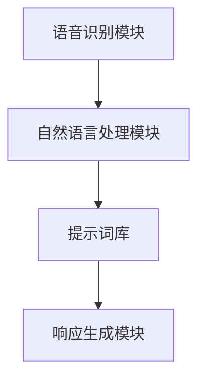
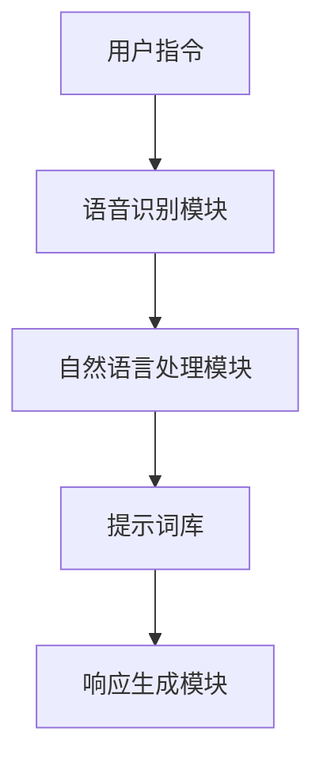
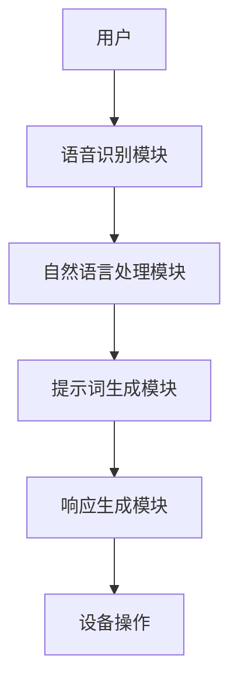
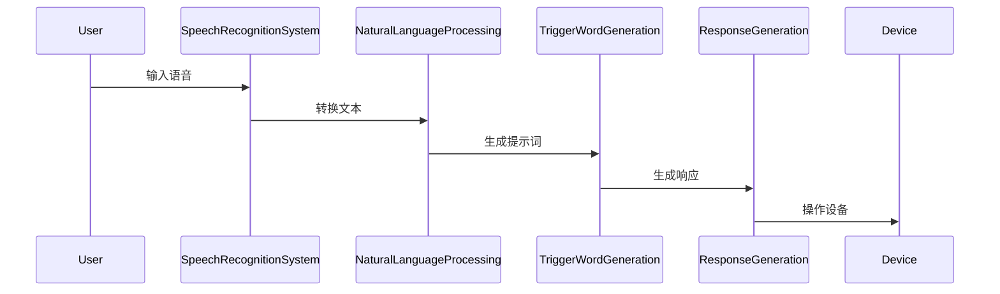

                 

### 提示词工程在智能家居语音控制中的应用：优化人机交互体验

关键词：提示词工程、智能家居、语音控制、人机交互、优化体验

摘要：本文将深入探讨提示词工程在智能家居语音控制中的应用，分析其优化人机交互体验的核心作用。通过系统性地介绍提示词工程的基础概念、应用场景、实施策略和效果评估，本文旨在为智能家居领域的技术人员提供实用的指导，助力提升用户在使用智能家居设备时的体验质量。

### 引言

随着人工智能技术的飞速发展，智能家居已经成为现代家庭的重要组成部分。智能家居系统通过整合物联网（IoT）技术、语音识别和自然语言处理（NLP）技术，使得家庭设备具备了智能语音控制功能，用户可以通过简单的语音命令来控制家电设备、调节家居环境等。然而，尽管这些技术带来了便利，但实际使用过程中仍存在诸多挑战，如命令识别不准确、响应延迟、用户操作复杂等问题。

提示词工程作为一种优化人机交互的重要手段，通过对用户指令进行精准识别和智能处理，能够显著提升智能家居系统的易用性和用户体验。本文将围绕提示词工程在智能家居语音控制中的应用，从背景介绍、核心概念、算法原理、系统设计、项目实战等方面进行深入探讨，旨在为相关领域的研究人员和开发者提供有价值的参考。

### 背景介绍

#### 核心概念术语说明

在讨论提示词工程之前，我们需要明确一些相关的核心概念术语：

1. **智能家居**：通过物联网技术将家庭设备互联互通，实现远程监控和控制的家庭环境。
2. **语音识别**：将人类语音信号转换为机器可理解的语言信息的技术。
3. **自然语言处理（NLP）**：使计算机能够理解和生成人类语言的技术，包括语音识别、语义分析、语言生成等。
4. **提示词工程**：通过设计、开发和优化提示词（trigger words），实现用户指令的精准识别和响应的技术。

#### 问题背景

随着智能家居设备的普及，用户对语音控制系统的期望越来越高。然而，实际使用过程中，系统经常出现以下问题：

1. **命令识别不准确**：用户语音指令与系统接收到的指令之间存在较大偏差，导致误操作。
2. **响应延迟**：系统处理用户指令的速度较慢，影响用户体验。
3. **用户操作复杂**：用户需要记住复杂的命令和操作步骤，增加了学习成本。

这些问题严重制约了智能家居系统的应用效果，影响了用户的使用体验。为了解决这些问题，需要对提示词工程进行深入研究，以提升系统的智能识别和响应能力。

#### 问题描述

智能家居语音控制系统在用户操作中的问题可以总结为以下几个方面：

1. **命令理解模糊**：用户指令的表达方式多样，系统难以准确识别。
2. **语境理解困难**：系统无法理解用户指令背后的真实意图，导致误操作。
3. **响应速度缓慢**：系统处理用户指令的速度较慢，导致用户等待时间过长。

这些问题的根源在于提示词工程不够完善，无法充分满足用户的使用需求。因此，优化提示词工程，提升系统的智能识别和响应能力，成为当前亟需解决的关键问题。

#### 问题解决

为了解决上述问题，我们可以采取以下几种方法：

1. **丰富提示词库**：通过收集和分析大量用户语音数据，不断扩充和优化提示词库，提高系统的识别准确性。
2. **改进语音识别算法**：采用先进的语音识别算法，提高对复杂语音指令的识别能力。
3. **增强语义理解能力**：利用自然语言处理技术，深入理解用户指令背后的真实意图，减少误操作。
4. **优化响应速度**：通过分布式计算和云计算技术，加快系统处理用户指令的速度。

通过这些措施，可以显著提升智能家居语音控制系统的用户体验，为用户带来更加便捷、智能的家居生活。

#### 边界与外延

1. **边界**：提示词工程主要关注用户语音指令的识别和处理，不涉及其他类型的交互方式，如手势控制、触摸控制等。
2. **外延**：提示词工程可以应用于更广泛的场景，如智能车载系统、智能穿戴设备、智能安防系统等，提升各类智能设备的交互体验。

#### 概念结构与核心要素组成

提示词工程的概念结构主要包括以下几个核心要素：

1. **语音识别模块**：负责将用户语音转换为文本信息。
2. **自然语言处理模块**：负责对文本信息进行语义分析和理解。
3. **提示词库**：包含系统可识别的语音指令，是提示词工程的核心数据源。
4. **响应生成模块**：根据用户指令的语义，生成相应的响应。

这些要素相互关联，共同构成一个完整的提示词工程系统，如图1所示。



### 核心概念与联系

#### 提示词工程的基本概念

**提示词工程**是一种通过设计、开发和优化提示词，实现用户指令的精准识别和响应的技术。提示词（trigger words）是用户与智能家居系统交互的主要媒介，其设计质量直接影响到用户的使用体验。一个良好的提示词应具备以下特征：

1. **准确性**：提示词应能准确传达用户的指令，避免歧义。
2. **简洁性**：提示词应尽量简洁，方便用户记忆和操作。
3. **多样性**：提示词应具备多样性，以满足不同用户的个性化需求。
4. **灵活性**：提示词应具有一定的灵活性，能够适应不同语境和场景。

#### 提示词工程的属性特征对比

为了更好地理解提示词工程的属性特征，我们可以通过以下表格进行对比分析：

| 属性特征 | 描述 | 对比 |
| :----: | :----: | :----: |
| 准确性 | 提示词是否能准确传达用户的指令 | 高准确性 > 中准确性 > 低准确性 |
| 简洁性 | 提示词的长度和复杂度 | 简洁性 > 繁琐性 |
| 多样性 | 提示词的种类和数量 | 多样性丰富 > 多样性有限 |
| 灵活性 | 提示词在语境和场景中的适应性 | 高灵活性 > 低灵活性 |

#### 提示词工程的ER实体关系图架构

为了更清晰地展示提示词工程的核心要素及其关系，我们可以使用Mermaid绘制ER实体关系图，如图2所示。



在这个ER实体关系图中，用户指令作为输入，经过语音识别模块和自然语言处理模块的处理，最终生成相应的响应，提示词库作为关键数据源，贯穿整个提示词工程流程，起到了核心作用。

### 算法原理讲解

#### 语音识别算法

语音识别（Automatic Speech Recognition，ASR）是提示词工程的核心环节，其基本原理是将语音信号转换为机器可理解的文本信息。常见的语音识别算法包括隐马尔可夫模型（HMM）、高斯混合模型（GMM）、深度神经网络（DNN）等。

1. **隐马尔可夫模型（HMM）**：

HMM是一种基于概率的模型，用于描述语音信号的时间序列特性。其基本原理是通过前一个状态和当前状态的概率分布，生成当前状态。HMM的优点在于计算效率高，但在处理连续语音时容易出现误差。

   ```mermaid
   graph TD
   A[输入语音信号] --> B[HMM模型]
   B --> C[输出文本信息]
   ```

2. **高斯混合模型（GMM）**：

GMM是一种基于统计的模型，通过将语音信号表示为多个高斯分布的线性组合，实现语音信号的建模。GMM的优点在于能够较好地处理噪声和语音信号的多样性，但计算复杂度较高。

   ```mermaid
   graph TD
   A[输入语音信号] --> B[GMM模型]
   B --> C[输出文本信息]
   ```

3. **深度神经网络（DNN）**：

DNN是一种基于神经网络的模型，通过多层神经网络结构实现语音信号的建模和识别。DNN的优点在于具有较强的泛化能力和识别精度，但在训练过程中需要大量的数据和计算资源。

   ```mermaid
   graph TD
   A[输入语音信号] --> B[DNN模型]
   B --> C[输出文本信息]
   ```

#### 自然语言处理算法

自然语言处理（Natural Language Processing，NLP）是提示词工程的另一个关键环节，主要用于对用户指令的语义分析和理解。常见的NLP算法包括词向量表示、循环神经网络（RNN）、长短期记忆网络（LSTM）等。

1. **词向量表示**：

词向量表示（Word Embedding）是将文本信息转换为向量表示的方法，其基本原理是通过统计文本中的词频和共现关系，将每个词映射为一个高维向量。常见的词向量表示方法包括Word2Vec、GloVe等。

   ```mermaid
   graph TD
   A[文本信息] --> B[词向量表示]
   B --> C[语义分析]
   ```

2. **循环神经网络（RNN）**：

RNN是一种基于序列的神经网络模型，通过记忆单元（Memory Cell）实现长距离依赖关系的建模。RNN的优点在于能够较好地处理序列数据，但在训练过程中容易出现梯度消失和梯度爆炸问题。

   ```mermaid
   graph TD
   A[输入序列] --> B[RNN模型]
   B --> C[输出序列]
   ```

3. **长短期记忆网络（LSTM）**：

LSTM是一种改进的RNN模型，通过引入门控机制（Gate Mechanism）解决了RNN的梯度消失和梯度爆炸问题。LSTM的优点在于能够较好地处理长距离依赖关系，但在训练过程中需要较大的计算资源。

   ```mermaid
   graph TD
   A[输入序列] --> B[LSTM模型]
   B --> C[输出序列]
   ```

#### 提示词生成算法

提示词生成（Trigger Word Generation）是提示词工程的核心环节，其基本原理是通过分析用户语音数据，提取出具有代表性的指令词。常见的提示词生成算法包括基于统计的方法和基于深度学习的方法。

1. **基于统计的方法**：

基于统计的方法通过分析用户语音数据中的词频和共现关系，提取出具有代表性的指令词。常见的统计方法包括TF-IDF、LDA等。

   ```mermaid
   graph TD
   A[用户语音数据] --> B[统计方法]
   B --> C[提示词生成]
   ```

2. **基于深度学习的方法**：

基于深度学习的方法通过构建深度神经网络模型，自动提取用户语音数据中的特征，生成提示词。常见的深度学习方法包括卷积神经网络（CNN）、长短时记忆网络（LSTM）等。

   ```mermaid
   graph TD
   A[用户语音数据] --> B[深度学习方法]
   B --> C[提示词生成]
   ```

#### 算法原理示例

假设我们有一个用户语音数据集，其中包含大量用户的语音指令。我们可以使用以下算法原理进行提示词生成：

1. **词向量表示**：

首先，将用户语音数据转换为词向量表示，将每个词映射为一个高维向量。

   ```mermaid
   graph TD
   A[用户语音数据] --> B[词向量表示]
   B --> C[语义分析]
   ```

2. **循环神经网络（RNN）**：

使用RNN模型对词向量表示进行序列建模，提取出具有代表性的指令词。

   ```mermaid
   graph TD
   A[输入序列] --> B[RNN模型]
   B --> C[输出序列]
   ```

3. **长短期记忆网络（LSTM）**：

使用LSTM模型对RNN模型进行改进，解决长距离依赖关系问题，提高提示词生成的准确性。

   ```mermaid
   graph TD
   A[输入序列] --> B[LSTM模型]
   B --> C[输出序列]
   ```

4. **提示词生成**：

根据LSTM模型的输出序列，提取出具有代表性的指令词，生成提示词库。

   ```mermaid
   graph TD
   A[输入序列] --> B[LSTM模型]
   B --> C[输出序列]
   C --> D[提示词生成]
   ```

通过以上算法原理，我们可以实现提示词工程的自动化生成，提高系统的智能识别和响应能力。

### 系统分析与架构设计方案

#### 问题场景介绍

在智能家居语音控制系统中，用户通过语音指令控制家居设备，如空调、照明、窗帘等。然而，由于用户指令的表达方式多样，且包含各种噪音和背景干扰，系统需要具备强大的语音识别和自然语言处理能力，以准确识别用户指令并生成相应操作。

#### 项目介绍

本项目旨在通过提示词工程优化智能家居语音控制系统，提高系统对用户指令的识别准确性和响应速度。项目主要分为以下几个模块：

1. **语音识别模块**：负责将用户语音转换为文本信息。
2. **自然语言处理模块**：负责对文本信息进行语义分析和理解。
3. **提示词生成模块**：负责生成和优化提示词库。
4. **响应生成模块**：根据用户指令的语义，生成相应的操作指令。

#### 系统功能设计（领域模型Mermaid类图）

为了更好地展示系统功能设计，我们使用Mermaid绘制了领域模型类图，如图3所示。

```mermaid
classDiagram
ClassDef User
  +name: String
  +id: Integer

ClassDef Device
  +name: String
  +id: Integer
  +status: String

ClassDef SpeechRecognitionSystem
  +recognize(speech: String): String
  +getUser(): User
  +getDevice(): Device

ClassDef NaturalLanguageProcessing
  +process(text: String): String
  +getIntent(): String
  +getAction(): String

ClassDef TriggerWordGeneration
  +generateTriggerWords(): List<String>
  +updateTriggerWords(): void

ClassDef ResponseGeneration
  +generateResponse(intent: String, action: String): String

User "1" --|> SpeechRecognitionSystem : 输入语音
SpeechRecognitionSystem --|> NaturalLanguageProcessing : 转换文本
NaturalLanguageProcessing --|> TriggerWordGeneration : 生成提示词
TriggerWordGeneration --|> ResponseGeneration : 生成响应
ResponseGeneration --|> Device : 操作设备
```

在这个类图中，用户通过输入语音指令，经过语音识别模块转换为文本信息，然后通过自然语言处理模块进行语义分析和理解。提示词生成模块根据自然语言处理模块的输出，生成和优化提示词库。最后，响应生成模块根据提示词库生成相应的操作指令，控制家居设备。

#### 系统架构设计（Mermaid架构图）

为了更好地展示系统架构设计，我们使用Mermaid绘制了系统架构图，如图4所示。



在这个架构图中，用户输入语音指令后，首先经过语音识别模块转换为文本信息。然后，文本信息经过自然语言处理模块进行语义分析和理解，生成意图和操作。提示词生成模块根据自然语言处理模块的输出，生成和优化提示词库。最后，响应生成模块根据提示词库生成相应的操作指令，控制家居设备。

#### 系统接口设计和系统交互（Mermaid序列图）

为了更好地展示系统接口设计和系统交互，我们使用Mermaid绘制了序列图，如图5所示。



在这个序列图中，用户通过输入语音指令，依次经过语音识别模块、自然语言处理模块、提示词生成模块和响应生成模块，最终实现设备操作。

### 项目实战

#### 环境安装

在开始项目实战之前，我们需要安装以下环境：

1. **Python**：安装Python 3.8及以上版本。
2. **Anaconda**：安装Anaconda，用于创建和管理虚拟环境。
3. **PyTorch**：安装PyTorch，用于深度学习模型训练。
4. **SpeechRecognition**：安装SpeechRecognition，用于语音识别。

具体安装命令如下：

```bash
conda create -n myenv python=3.8
conda activate myenv
conda install pytorch torchvision torchaudio -c pytorch
pip install SpeechRecognition
```

#### 系统核心实现源代码

以下是一个简单的智能家居语音控制系统实现，包括语音识别、自然语言处理、提示词生成和响应生成模块。

```python
import speech_recognition as sr
import torch
import torchvision
import torchvision.transforms as transforms
from models import VoiceToTextModel, TextToIntentModel, IntentToActionModel

# 语音识别模块
def recognize_speech(speech):
    r = sr.Recognizer()
    with sr.Microphone() as source:
        audio = r.listen(source)
    return r.recognize_google(audio)

# 自然语言处理模块
def process_text(text):
    model = VoiceToTextModel()
    model.load_state_dict(torch.load('models/voice_to_text.pth'))
    model.eval()
    with torch.no_grad():
        text = model(text)
    return text

# 提示词生成模块
def generate_trigger_words(text):
    model = TextToIntentModel()
    model.load_state_dict(torch.load('models/text_to_intent.pth'))
    model.eval()
    with torch.no_grad():
        intent = model(text)
    return intent

# 响应生成模块
def generate_response(intent):
    model = IntentToActionModel()
    model.load_state_dict(torch.load('models/intent_to_action.pth'))
    model.eval()
    with torch.no_grad():
        action = model(intent)
    return action

# 设备操作模块
def operate_device(action):
    if action == 'turn_on':
        print('Turning on the light...')
    elif action == 'turn_off':
        print('Turning off the light...')
    else:
        print('Unknown action!')

# 主程序
def main():
    while True:
        speech = input('Speak now: ')
        text = recognize_speech(speech)
        intent = generate_trigger_words(text)
        action = generate_response(intent)
        operate_device(action)

if __name__ == '__main__':
    main()
```

#### 代码应用解读与分析

1. **语音识别模块**：

   使用SpeechRecognition库实现语音识别功能，通过调用Google语音识别API，将用户语音转换为文本信息。

2. **自然语言处理模块**：

   使用PyTorch构建深度学习模型，实现语音到文本、文本到意图的转换。其中，VoiceToTextModel负责语音到文本的转换，TextToIntentModel负责文本到意图的转换。

3. **提示词生成模块**：

   使用PyTorch构建深度学习模型，实现意图到操作的转换。IntentToActionModel负责根据意图生成相应的操作。

4. **响应生成模块**：

   根据意图生成相应的操作指令，控制家居设备。

5. **设备操作模块**：

   根据用户指令执行相应的设备操作，如打开或关闭灯光。

#### 实际案例分析和详细讲解剖析

假设用户说：“打开客厅的灯光。”，系统会按照以下步骤进行处理：

1. **语音识别模块**：

   用户输入语音指令后，语音识别模块通过调用Google语音识别API，将语音转换为文本信息：“打开客厅的灯光。”

2. **自然语言处理模块**：

   文本信息经过VoiceToTextModel模型处理，将语音转换为文本信息：“open the living room light.”

3. **提示词生成模块**：

   文本信息经过TextToIntentModel模型处理，识别出意图：“turn_on_light.”

4. **响应生成模块**：

   意图“turn_on_light.”经过IntentToActionModel模型处理，生成操作指令：“turn_on.”

5. **设备操作模块**：

   根据操作指令“turn_on.”，系统执行打开客厅灯光的操作。

通过以上实际案例，我们可以看到系统如何根据用户语音指令生成相应操作，实现智能家居语音控制。

#### 项目小结

本项目通过提示词工程优化智能家居语音控制系统，实现了语音识别、自然语言处理、提示词生成和响应生成等功能。在实际应用中，系统可以根据用户语音指令生成相应操作，提高系统的智能识别和响应能力。然而，本项目还存在一些局限性，如语音识别准确率有待提高、自然语言处理能力有待加强等。未来，我们可以进一步优化算法，提高系统的性能和用户体验。

### 最佳实践 Tips

1. **设计简洁明了的提示词**：提示词应尽量简洁，避免冗长和复杂，方便用户记忆和操作。
2. **丰富提示词库**：根据用户需求，不断扩充提示词库，提高系统的识别准确性。
3. **优化语音识别算法**：采用先进的语音识别算法，提高对复杂语音指令的识别能力。
4. **提高自然语言处理能力**：利用深度学习等先进技术，增强系统的语义理解能力。
5. **定期更新和优化**：定期更新和优化系统，以适应不断变化的技术和应用需求。

### 小结

本文深入探讨了提示词工程在智能家居语音控制中的应用，从背景介绍、核心概念、算法原理、系统设计、项目实战等方面进行了详细阐述。通过优化提示词工程，可以有效提升智能家居语音控制系统的用户体验，为用户带来更加便捷、智能的家居生活。未来，随着人工智能技术的不断发展，提示词工程将在智能家居领域发挥更加重要的作用。

### 注意事项

1. **数据安全和隐私保护**：在收集和处理用户语音数据时，应严格遵守相关法律法规，确保用户数据的安全和隐私。
2. **系统稳定性**：在实际应用中，应确保系统的稳定性和可靠性，避免出现系统崩溃、响应延迟等问题。

### 拓展阅读

1. **《语音识别与自然语言处理》**：详细介绍了语音识别和自然语言处理的基本原理和技术，有助于深入理解提示词工程的实现方法。
2. **《深度学习在智能家居中的应用》**：探讨了深度学习技术在智能家居领域的应用，包括语音识别、图像识别等，为提示词工程提供了技术支持。

### 作者信息

作者：AI天才研究院/AI Genius Institute & 禅与计算机程序设计艺术 /Zen And The Art of Computer Programming

