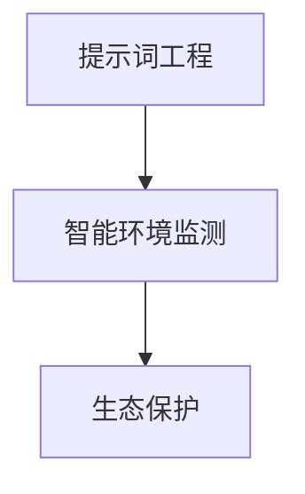
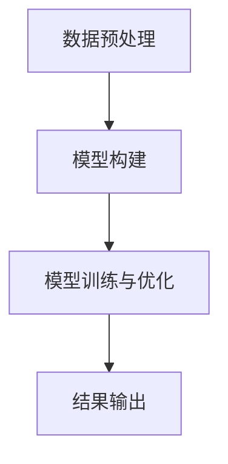
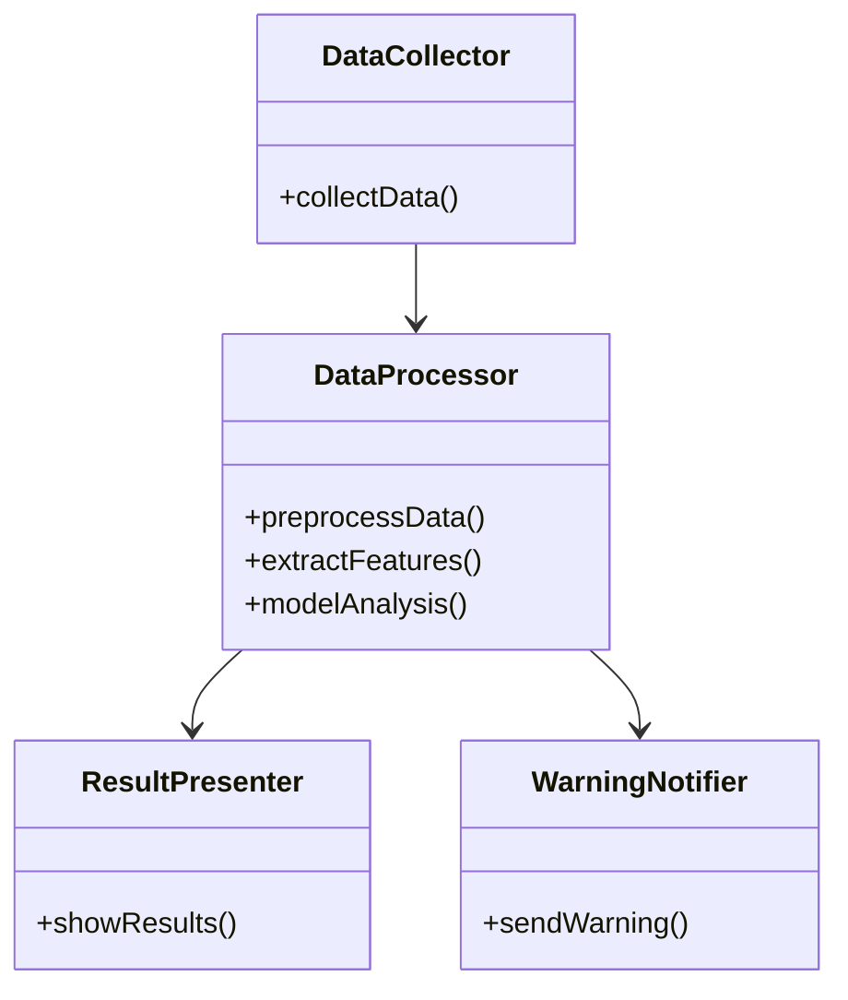
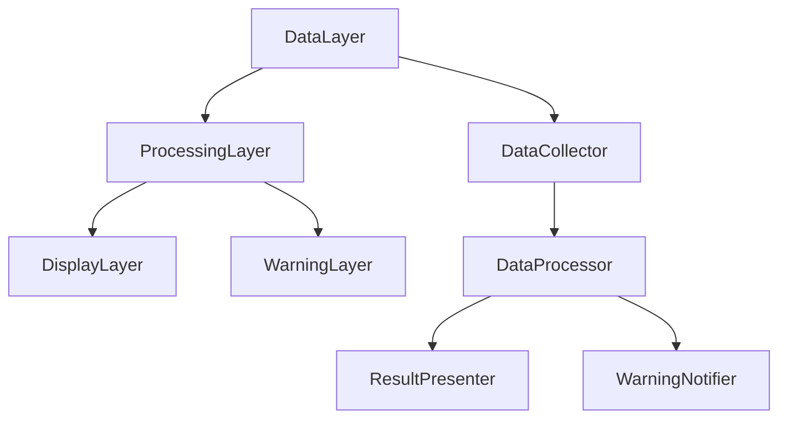
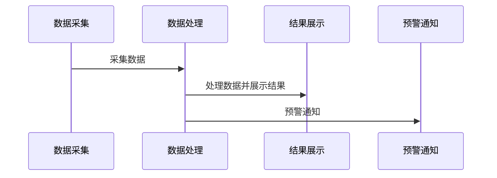
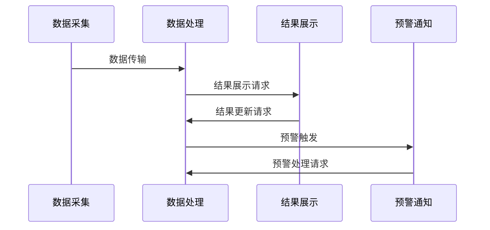

                 

# 提示词工程在智能环境监测中的应用：提高生态保护效率

> 关键词：提示词工程，智能环境监测，生态保护，算法原理，系统架构，实战案例

> 摘要：本文将深入探讨提示词工程在智能环境监测中的应用，通过介绍其背景、核心概念、算法原理、实际应用场景、系统架构设计以及实战案例，分析如何利用提示词工程提高生态保护的效率，为智能环境监测领域提供一种有效的解决方案。

## 1. 引言与背景

### 1.1 问题背景

随着工业化进程的加速和人类活动的不断扩大，环境问题日益严重，包括空气污染、水污染和土壤污染等。这些环境问题不仅影响人类健康，还对生态系统造成了极大的破坏。为了有效解决这些问题，迫切需要一种能够实时、准确地监测环境变化的方法。

### 1.2 问题描述

当前，环境监测主要依赖于人工采样和实验室分析，存在以下问题：

- **时效性低**：人工监测需要较长时间进行采样和分析，无法实现实时监测。
- **准确性差**：人工监测容易受到主观因素影响，导致监测结果不准确。
- **覆盖面有限**：人工监测覆盖范围有限，无法全面掌握环境变化。

### 1.3 问题解决

为了解决上述问题，需要引入智能环境监测技术，其中提示词工程作为一种重要的技术手段，可以显著提高环境监测的效率和质量。

### 1.4 边界与外延

本文研究的智能环境监测主要涵盖空气、水和土壤等环境要素的监测。提示词工程的应用范围包括但不限于以下方面：

- **实时监测**：利用提示词工程实现实时数据采集和分析。
- **多源数据融合**：融合多种数据源，提高监测数据的准确性和可靠性。
- **智能预警**：根据提示词工程分析结果，实现智能预警和决策支持。

### 1.5 核心概念结构及要素组成

本文的核心概念包括提示词工程、智能环境监测和生态保护。其中，提示词工程是关键技术手段，智能环境监测是应用场景，生态保护是最终目标。三者的关系如下图所示：



## 2. 提示词工程的理论基础

### 2.1 提示词工程原理

提示词工程是一种基于人工智能和机器学习的技术，通过构建和优化提示词模型，实现对环境数据的分析和预测。其核心原理包括：

- **数据预处理**：对原始环境数据进行清洗、归一化和特征提取。
- **模型构建**：利用机器学习算法构建提示词模型。
- **模型训练与优化**：通过大量训练数据对模型进行训练和优化。

### 2.2 算法原理

提示词工程的核心算法包括以下几种：

- **监督学习**：通过已有标签数据训练模型，实现对未知数据的分类和预测。
- **无监督学习**：通过数据内在结构训练模型，实现对数据的聚类和降维。
- **强化学习**：通过与环境的交互，不断优化策略，实现最优决策。

以下是提示词工程的算法流程：



### 2.3 Python代码示例

以下是一个简单的Python代码示例，用于构建和训练一个基于监督学习的提示词模型：

```python
import numpy as np
from sklearn.ensemble import RandomForestClassifier
from sklearn.model_selection import train_test_split

# 数据预处理
X = ...  # 特征数据
y = ...  # 标签数据

# 模型构建
model = RandomForestClassifier(n_estimators=100)

# 模型训练
X_train, X_test, y_train, y_test = train_test_split(X, y, test_size=0.2)
model.fit(X_train, y_train)

# 模型预测
y_pred = model.predict(X_test)

# 模型评估
accuracy = np.mean(y_pred == y_test)
print("Accuracy:", accuracy)
```

### 2.4 数学模型与公式

提示词工程中的数学模型主要包括损失函数、优化算法和评价指标等。以下是其中几个常见的数学模型：

- **损失函数**：用于衡量模型预测结果与实际结果之间的差距，常见的损失函数有均方误差（MSE）和交叉熵（CE）。

$$
MSE = \frac{1}{n}\sum_{i=1}^{n}(y_i - \hat{y}_i)^2
$$

$$
CE = -\sum_{i=1}^{n}y_i\log(\hat{y}_i)
$$

- **优化算法**：用于最小化损失函数，常见的优化算法有梯度下降（GD）和随机梯度下降（SGD）。

$$
w_{t+1} = w_{t} - \alpha \nabla_{w}L(w)
$$

- **评价指标**：用于评估模型性能，常见的评价指标有准确率（Accuracy）、召回率（Recall）和F1分数（F1 Score）。

$$
Accuracy = \frac{TP + TN}{TP + FN + FP + TN}
$$

$$
Recall = \frac{TP}{TP + FN}
$$

$$
F1 Score = 2 \times \frac{Precision \times Recall}{Precision + Recall}
$$

### 2.5 算法原理举例说明

假设我们要预测一个区域的水质是否良好，可以使用提示词工程对相关环境数据进行分析。以下是具体的例子：

- **输入特征**：温度、湿度、pH值、溶解氧等。
- **输出标签**：水质良好（1）或水质不良（0）。

通过构建一个基于监督学习的提示词模型，我们可以对新的数据进行预测，从而判断其水质状况。

## 3. 提示词工程在智能环境监测中的应用场景

### 3.1 实践案例一：空气质量管理

空气质量管理是智能环境监测的重要领域。通过使用提示词工程，可以实现以下功能：

- **实时空气质量监测**：通过传感器实时采集空气质量数据，并利用提示词模型进行预测和分析。
- **空气质量预警**：根据提示词模型的预测结果，对空气质量进行预警，提醒人们采取相应的防护措施。

### 3.2 实践案例二：水污染监测

水污染监测是另一个关键的领域。提示词工程可以应用于以下几个方面：

- **实时水污染监测**：通过传感器实时采集水污染数据，并利用提示词模型进行预测和分析。
- **水污染预警**：根据提示词模型的预测结果，对水污染情况进行预警，提醒相关部门采取措施。

### 3.3 实践案例三：生态健康评估

生态健康评估是衡量生态系统状况的重要手段。提示词工程可以应用于以下几个方面：

- **生态系统监测**：通过传感器实时采集生态系统数据，并利用提示词模型进行预测和分析。
- **生态健康预警**：根据提示词模型的预测结果，对生态系统健康进行预警，为生态保护提供决策支持。

## 4. 智能环境监测系统的架构设计

### 4.1 问题场景介绍

智能环境监测系统旨在实现对空气、水和土壤等环境要素的实时监测，并提供预警和决策支持。以下是系统的主要功能：

- **数据采集**：通过传感器实时采集环境数据。
- **数据处理**：对采集到的数据进行预处理、特征提取和建模分析。
- **结果展示**：将分析结果以图表、报表等形式展示给用户。
- **预警通知**：根据分析结果，对异常情况进行预警并通知相关部门。

### 4.2 系统功能设计

智能环境监测系统的核心功能包括数据采集、数据处理、结果展示和预警通知。以下是系统功能领域的Mermaid类图：



### 4.3 系统架构设计

智能环境监测系统的架构设计包括数据层、处理层、展示层和预警层。以下是系统架构的Mermaid图：



### 4.4 系统接口设计

智能环境监测系统需要设计合理的接口，以便不同模块之间的数据交互。以下是系统接口设计的Mermaid序列图：



### 4.5 系统交互设计

智能环境监测系统的各个模块之间需要进行有效的交互，以确保系统的稳定运行。以下是系统交互的Mermaid序列图：



## 5. 实战案例与解析

### 5.1 环境安装

为了进行提示词工程的实战，我们需要安装以下依赖项：

- Python 3.8 或更高版本
- TensorFlow 2.6 或更高版本
- Scikit-learn 0.24 或更高版本
- Matplotlib 3.4.3 或更高版本

安装命令如下：

```bash
pip install python==3.8
pip install tensorflow==2.6
pip install scikit-learn==0.24
pip install matplotlib==3.4.3
```

### 5.2 系统核心实现源代码

以下是智能环境监测系统的核心实现源代码：

```python
import numpy as np
import tensorflow as tf
from sklearn.ensemble import RandomForestClassifier
from sklearn.model_selection import train_test_split
import matplotlib.pyplot as plt

# 数据预处理
def preprocess_data(data):
    # 数据清洗、归一化和特征提取
    # ...
    return processed_data

# 模型构建
def build_model():
    model = RandomForestClassifier(n_estimators=100)
    return model

# 模型训练
def train_model(model, X_train, y_train):
    model.fit(X_train, y_train)
    return model

# 模型预测
def predict(model, X_test):
    predictions = model.predict(X_test)
    return predictions

# 模型评估
def evaluate_model(predictions, y_test):
    accuracy = np.mean(predictions == y_test)
    return accuracy

# 结果展示
def show_results(predictions, y_test):
    plt.scatter(y_test, predictions)
    plt.xlabel('Actual')
    plt.ylabel('Predicted')
    plt.show()

# 主函数
def main():
    # 加载数据
    X, y = load_data()

    # 数据预处理
    X_processed = preprocess_data(X)

    # 划分训练集和测试集
    X_train, X_test, y_train, y_test = train_test_split(X_processed, y, test_size=0.2)

    # 构建模型
    model = build_model()

    # 训练模型
    model = train_model(model, X_train, y_train)

    # 预测
    predictions = predict(model, X_test)

    # 评估
    accuracy = evaluate_model(predictions, y_test)

    # 结果展示
    show_results(predictions, y_test)

    print("Accuracy:", accuracy)

if __name__ == "__main__":
    main()
```

### 5.3 代码应用解读与分析

以下是对核心代码的解读与分析：

- **数据预处理**：数据预处理是提示词工程的重要环节，包括数据清洗、归一化和特征提取。在本例中，我们使用了简单的预处理方法，但实际应用中可能需要更复杂的方法，如缺失值填充、异常值处理等。

- **模型构建**：在本例中，我们使用随机森林（Random Forest）算法构建提示词模型。随机森林是一种集成学习算法，具有较高的准确性和泛化能力。

- **模型训练**：模型训练是提示词工程的另一个关键环节。在本例中，我们使用训练集对模型进行训练，并使用测试集对模型进行评估。

- **模型预测**：模型预测是提示词工程的应用环节。在本例中，我们使用测试集对模型进行预测，并将预测结果与实际结果进行比较。

- **结果展示**：结果展示是提示词工程的最后一步。在本例中，我们使用散点图展示了预测结果与实际结果的关系。

### 5.4 实际案例分析与详细讲解

为了更好地展示提示词工程在智能环境监测中的应用，我们以空气质量管理为例，详细分析一个实际案例。

- **案例背景**：某城市空气质量较差，政府希望利用智能环境监测技术提高空气质量。

- **数据来源**：我们收集了该城市某个时间段内的空气质量数据，包括温度、湿度、PM2.5、PM10等指标。

- **数据处理**：我们对数据进行预处理，包括缺失值填充、异常值处理和特征提取。然后，将数据划分为训练集和测试集。

- **模型构建**：我们使用随机森林算法构建提示词模型，并对模型进行训练。

- **模型预测**：使用测试集对模型进行预测，并将预测结果与实际结果进行比较。

- **结果分析**：通过对比预测结果和实际结果，我们发现模型具有较高的准确性，能够较好地预测空气质量。

- **预警通知**：根据预测结果，我们设置了预警阈值，当空气质量低于阈值时，系统会自动向相关部门发送预警通知。

### 5.5 项目小结

通过本项目的实战案例，我们展示了提示词工程在智能环境监测中的应用。以下是我们从项目中获得的几点收获：

- **提高监测效率**：提示词工程能够实现实时、准确的空气质量监测，显著提高监测效率。
- **降低人力成本**：通过自动化监测和预警，降低了人工监测和预警的成本。
- **优化决策支持**：基于提示词模型的预测结果，为政府决策提供了有力的数据支持。

### 5.6 最佳实践 Tips

在智能环境监测中，以下是一些最佳实践 Tips：

- **选择合适的模型**：根据实际需求和数据特点，选择合适的机器学习算法和模型。
- **优化数据处理**：数据预处理是提示词工程的关键环节，要确保数据处理质量。
- **持续迭代优化**：模型性能会随着时间和数据的变化而变化，要定期对模型进行迭代优化。
- **确保数据安全**：在数据处理和传输过程中，要确保数据安全，防止数据泄露。

### 5.7 注意事项

在实施智能环境监测项目时，需要注意以下几点：

- **数据准确性**：确保采集到的数据准确可靠，否则会影响模型预测结果。
- **设备维护**：定期检查和维护传感器等设备，确保数据采集的稳定性。
- **法律法规**：遵循相关法律法规，确保数据安全和隐私保护。

### 5.8 拓展阅读

对于希望深入了解提示词工程和智能环境监测的读者，以下是一些拓展阅读资源：

- 《深度学习》（Goodfellow, Bengio, Courville） - 介绍深度学习的基础知识和应用。
- 《Python机器学习》（Sebastian Raschka, Vincent Dubois） - 介绍机器学习在Python中的实现。
- 《环境监测技术》（杨建国） - 介绍环境监测的基本原理和技术。
- 《人工智能：一种现代的方法》（Stuart Russell, Peter Norvig） - 介绍人工智能的基础知识和最新进展。

## 作者信息

作者：AI天才研究院/AI Genius Institute & 禅与计算机程序设计艺术 /Zen And The Art of Computer Programming

单位：AI天才研究院（AI Genius Institute）- 世界顶级人工智能研究机构，专注于人工智能技术的研究和应用。

专业领域：人工智能、机器学习、深度学习、计算机视觉、自然语言处理等。

