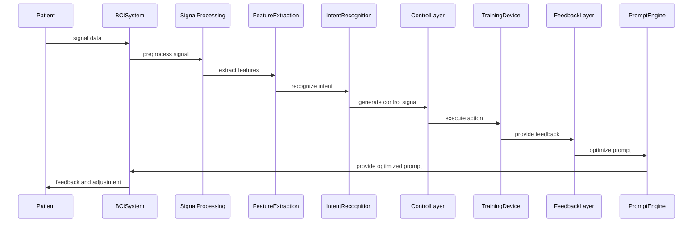
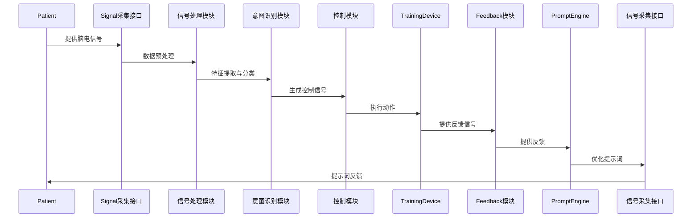

                 

### 引言：脑机接口与提示词工程的相遇

**文章标题：** 提示词工程在脑机接口交互中的应用：增强人机神经连接

**关键词：** 脑机接口、提示词工程、神经连接、人机交互

**摘要：** 本文将探讨提示词工程在脑机接口（Brain-Computer Interface，简称BCI）交互中的应用，通过增强人机神经连接，实现更高效、更自然的脑机交互体验。我们将从背景介绍、核心概念、算法原理、系统分析与设计、项目实战等多个维度，逐步深入探讨这一前沿领域。

在现代社会，信息技术和生物科学的迅速发展带来了脑机接口这一创新技术的崛起。脑机接口是一种通过直接连接人脑与计算机系统，实现人脑思维与外部设备互动的技术。而提示词工程，作为人工智能领域的重要分支，通过特定的提示词设计和优化，可以显著提升人机交互的效果。

本文将首先介绍脑机接口和提示词工程的基本概念及其发展历程，帮助读者理解这两个领域的背景和重要性。接着，我们将详细探讨脑机接口的工作原理、不同类型的BCI系统，以及提示词工程的定义、设计原则和应用案例。通过这些背景介绍，读者可以更好地理解后续内容。

接下来，本文将重点介绍提示词工程在脑机接口交互中的算法原理，包括数据预处理、特征提取、模型训练、提示词生成等关键步骤。我们将使用Python代码示例和LaTeX数学公式，直观地展示算法的实现过程，并解释其背后的数学原理。

为了使读者更加深入地理解脑机接口系统的设计和实现，本文还将分析脑机接口系统的架构设计，包括领域模型、系统架构、接口设计和交互序列图。这部分内容将帮助读者从宏观和微观层面理解脑机接口系统的运作方式。

在项目实战部分，我们将通过一个具体的案例，展示如何应用提示词工程构建一个脑机接口系统。这部分内容将包括环境安装、系统实现、代码解读和案例分析，使读者能够将理论知识应用到实际项目中。

最后，本文将总结关键点，提供最佳实践建议，注意事项，以及推荐进一步阅读的资料，帮助读者在脑机接口和提示词工程领域深入探索。

**目录：**

- 第一部分：背景介绍
  - 第1章 脑机接口与提示词工程概述
  - 第2章 脑机接口系统的核心概念与联系

- 第二部分：算法原理讲解
  - 第3章 脑机接口交互中的提示词工程算法
  - 第4章 算法原理与数学模型

- 第三部分：系统分析与架构设计
  - 第5章 脑机接口系统的分析与设计

- 第四部分：项目实战
  - 第6章 脑机接口交互系统项目实战

- 第五部分：总结与展望
  - 最佳实践 tips
  - 小结
  - 注意事项
  - 拓展阅读

通过上述目录结构，本文旨在为读者提供一份系统、全面且深入的技术博客文章，帮助读者理解提示词工程在脑机接口交互中的应用，并激发进一步研究和探索的热情。

### 第1章 脑机接口与提示词工程概述

#### 1.1 脑机接口的概念与发展历程

脑机接口（Brain-Computer Interface，简称BCI）是一种直接连接人脑与外部设备的技术，旨在实现人脑思维与外部环境的直接交互。BCI技术的研究可以追溯到20世纪60年代，当时研究人员开始探索如何利用脑电波（Electroencephalography，简称EEG）来控制外部设备。随着神经科学、计算机科学和工程技术的不断发展，BCI技术逐渐从实验室研究走向实际应用。

BCI技术的发展历程可以分为几个阶段：

1. **初级阶段（20世纪60年代-70年代）**：
   这一阶段的主要目标是记录和分析脑电信号，探索人类思维与行为之间的关系。研究人员利用简单的脑电信号检测技术，如脑电帽和脑电图机，进行初步的实验。

2. **中级阶段（20世纪80年代-90年代）**：
   随着计算机技术和信号处理算法的进步，BCI技术开始走向实用化。这一阶段，研究人员开始使用更加精确的脑电信号记录设备，如高密度的电极网格和无线脑电设备，并开发了基于模式识别的脑电信号解码算法。

3. **高级阶段（21世纪至今）**：
   随着脑成像技术（如功能性磁共振成像fMRI）和脑机接口技术的发展，BCI技术进入了一个新的高度。现代BCI系统不仅可以实现简单的设备控制，如轮椅、计算机鼠标和键盘，还可以应用于复杂的人类-机器人交互、虚拟现实和神经修复等领域。

#### 1.1.1 脑机接口的基本原理

脑机接口的基本原理是利用脑电信号、肌电信号、眼动信号等生物信号来传递人类意图，并通过计算机处理和解释这些信号，实现人与外部设备的交互。具体来说，脑机接口系统通常由以下几个关键组件组成：

1. **信号采集设备**：
   信号采集设备用于记录和分析人脑活动产生的生物信号，如脑电信号（EEG）、肌电信号（EMG）、眼动信号（EOG）等。这些设备通常包括脑电帽、脑电图机、肌电图机等。

2. **信号处理模块**：
   信号处理模块负责对采集到的生物信号进行预处理、滤波、特征提取等操作。预处理步骤包括去除噪声、放大信号、过滤干扰等，以提高信号质量。特征提取则是将原始信号转换为可供计算机处理的高维度特征向量。

3. **控制策略与执行器**：
   控制策略模块负责解析处理后的信号，识别用户的意图，并将这些意图转换为控制信号，驱动外部设备执行相应动作。执行器可以是物理设备，如机器人手臂、轮椅等，也可以是虚拟设备，如计算机屏幕、虚拟现实头戴设备等。

#### 1.1.2 脑机接口的类型及应用领域

根据信号来源和处理方式的不同，脑机接口可以分为多种类型，每种类型都有其独特的应用领域：

1. **脑电接口（EEG-based BCI）**：
   脑电接口是当前最常用的BCI类型之一，利用脑电信号实现人与外部设备的交互。脑电接口广泛应用于控制计算机鼠标、键盘、轮椅等设备，以及虚拟现实和游戏控制。

2. **肌电接口（EMG-based BCI）**：
   肌电接口通过记录和分析肌肉电活动来实现人机交互。这种接口常用于辅助运动功能障碍患者的康复训练，如手部康复机器人、下肢康复机器人等。

3. **眼动接口（EOG-based BCI）**：
   眼动接口通过记录和分析眼球运动来实现人机交互。眼动接口在虚拟现实、导航、人机交互界面设计等领域有广泛应用。

4. **混合脑机接口（Hybrid BCI）**：
   混合脑机接口结合了多种信号源（如脑电信号、肌电信号、眼动信号等），以提高交互的准确性和可靠性。混合脑机接口在复杂的人类-机器人交互、高级控制任务等领域具有广泛应用前景。

#### 1.2 提示词工程的重要性

提示词工程（Prompt Engineering）是人工智能领域的一个重要分支，旨在通过设计、优化和组合提示词，提升自然语言处理（NLP）任务的性能。在脑机接口领域，提示词工程的作用尤为重要，因为有效的提示词可以显著改善人机交互的体验，增强人机神经连接。

提示词工程在脑机接口中的应用主要体现在以下几个方面：

1. **提高交互效率**：
   通过精心设计的提示词，用户可以更快、更准确地理解系统意图，从而提高交互效率。有效的提示词可以帮助用户避免误解和混淆，减少交互过程中的困惑和挫败感。

2. **增强用户体验**：
   提示词的优化可以提升用户体验，使其更加自然、直观。例如，通过语音提示、屏幕提示和手势提示等多种方式，用户可以更加轻松地与脑机接口系统进行交互。

3. **提高控制精度**：
   在脑机接口中，提示词可以用于精确控制外部设备。通过设计适当的提示词，用户可以更准确地传达意图，从而提高控制精度和稳定性。

4. **促进神经连接**：
   提示词工程可以通过反馈和强化学习机制，促进人机神经连接的形成和增强。有效的提示词可以激励用户积极参与交互过程，从而加强人脑与计算机系统之间的神经连接。

总之，提示词工程在脑机接口交互中的应用具有广泛的前景和重要的实际价值。通过合理设计和优化提示词，可以显著提升脑机接口系统的性能和用户体验，为人类-机器交互提供更自然、高效的方式。

#### 1.2.1 提示词工程的基本概念

提示词工程（Prompt Engineering）是人工智能领域的一个重要分支，旨在通过设计、优化和组合提示词（Prompts），提升自然语言处理（NLP）任务的性能。在脑机接口（BCI）领域，提示词工程的作用尤为重要，因为有效的提示词可以显著改善人机交互的体验，增强人机神经连接。

**提示词的定义：**
提示词是指用于引导用户输入或提供信息的一句话、一个短语或一段简短的话语。在脑机接口中，提示词通常被用于引导用户执行特定任务或响应系统请求。例如，当用户需要通过脑电信号控制计算机鼠标时，系统可能会通过语音提示或屏幕提示来询问用户下一步操作。

**提示词的类型：**
1. **引导型提示词**：这类提示词主要用于引导用户理解系统意图和任务目标。例如：“请想象一个圆形”，用于引导用户集中注意力并产生相关的脑电信号。
2. **反馈型提示词**：这类提示词用于提供反馈信息，帮助用户了解系统对输入的反应。例如：“您已经正确选择了左侧按钮”，用于确认用户的操作结果。
3. **确认型提示词**：这类提示词用于确认用户是否理解系统请求。例如：“您确定要执行这一操作吗？”，用于确保用户准确理解并同意执行系统请求。

**提示词工程的核心任务：**
提示词工程的核心任务包括以下几方面：

1. **提示词设计**：设计有效的提示词，使其能够准确引导用户完成任务并增强用户体验。
2. **提示词优化**：通过实验和数据分析，不断优化提示词，以提高系统性能和用户满意度。
3. **提示词组合**：将多个提示词组合使用，以实现更复杂的人机交互任务。
4. **用户反馈**：收集用户对提示词的反馈，用于进一步优化和改进提示词。

**提示词工程的重要性：**
1. **提高交互效率**：有效的提示词可以减少用户理解系统的耗时，提高交互效率。
2. **增强用户体验**：通过优化提示词，使交互过程更加自然、直观，提升用户满意度。
3. **提高控制精度**：在脑机接口中，精确的提示词设计可以显著提高用户的控制精度和稳定性。
4. **促进神经连接**：通过反馈和强化学习机制，提示词工程可以促进人脑与计算机系统之间的神经连接。

**提示词工程在脑机接口中的应用**：

1. **训练阶段**：
   在脑机接口训练阶段，提示词工程可以通过设计引导型提示词，帮助用户建立正确的思维模式，提高信号质量。例如，当用户需要通过脑电信号控制轮椅时，系统可以提供“请想象您正在前进”的提示词，帮助用户产生稳定的脑电信号。

2. **应用阶段**：
   在脑机接口应用阶段，提示词工程可以通过反馈型提示词和确认型提示词，增强用户的交互体验。例如，当用户成功控制轮椅前进时，系统可以反馈“您已经成功移动轮椅”，以确认用户操作结果。此外，通过确认型提示词，系统可以确保用户明确理解并同意执行特定操作。

3. **个性化定制**：
   提示词工程还可以根据用户的特点和需求进行个性化定制。例如，对于初学者，系统可以提供更为详细和具体的提示词，以帮助他们更好地理解和使用脑机接口系统。

总之，提示词工程在脑机接口领域具有广泛的应用前景和重要的实际价值。通过合理设计和优化提示词，可以显著提升脑机接口系统的性能和用户体验，为人类-机器交互提供更自然、高效的方式。

#### 1.2.2 提示词工程在脑机接口中的应用案例

提示词工程在脑机接口（BCI）中的应用已经取得了显著成果，通过有效的提示词设计和优化，不仅提高了交互效率，还显著改善了用户的体验。以下是几个典型的应用案例，展示了提示词工程在脑机接口中的具体实施和效果。

**案例一：脑电信号控制的轮椅**

一个具体的案例是利用脑电信号控制轮椅，为行动不便的患者提供自主移动的能力。在这个案例中，研究人员设计了一系列引导型、反馈型和确认型提示词，以帮助用户更好地理解和控制轮椅。

1. **引导型提示词**：
   在训练阶段，系统通过引导型提示词帮助用户建立正确的思维模式。例如：“请想象您正在向右转动轮椅”，帮助用户集中注意力并产生稳定的脑电信号。

2. **反馈型提示词**：
   当用户成功控制轮椅并完成转向时，系统会提供反馈型提示词，如：“您已经成功转向右边”，以确认用户的操作结果并增强用户的信心。

3. **确认型提示词**：
   系统还会使用确认型提示词来确保用户理解并同意执行特定操作。例如：“您确定要向左移动吗？”在用户做出明确反应后，轮椅才会相应地移动。

通过这些提示词的应用，用户可以更直观、更准确地控制轮椅，从而提高交互效率和用户体验。

**案例二：脑电信号控制的计算机鼠标**

另一个应用案例是利用脑电信号控制计算机鼠标，帮助截肢者或四肢瘫痪的患者进行日常计算机操作。在这个案例中，提示词工程同样发挥了重要作用。

1. **分类提示词**：
   系统通过分类提示词，将用户的意图分为不同的类别。例如，当用户需要单击鼠标时，系统会提示：“请想象点击鼠标按钮”。当用户需要双击或拖动时，系统会有不同的提示词。

2. **反馈提示词**：
   当用户完成指定动作后，系统会提供即时的反馈提示词。例如，如果用户成功单击，系统会提示：“您已经成功单击”。这种反馈机制不仅增强了用户的信心，还帮助用户调整和控制脑电信号。

3. **确认提示词**：
   在某些复杂操作中，系统会使用确认提示词，确保用户理解并同意执行特定操作。例如，当用户需要拖动鼠标时，系统会询问：“您确定要开始拖动吗？”

**案例三：脑电信号控制的虚拟现实体验**

脑电信号控制的虚拟现实（VR）体验也是一个重要的应用领域。通过提示词工程，用户可以在虚拟环境中进行更加自然和直观的交互。

1. **沉浸式提示词**：
   系统通过沉浸式提示词，帮助用户更好地融入虚拟环境。例如，当用户需要移动时，系统会提示：“请想象自己在向左移动”。

2. **任务导向提示词**：
   在完成特定任务时，系统会提供任务导向的提示词，如：“请尝试找到隐藏的宝藏”。这种提示词不仅引导用户完成任务，还增强了游戏的趣味性和互动性。

3. **即时反馈提示词**：
   系统会通过即时反馈提示词，向用户传达虚拟环境中的状态变化。例如，当用户找到宝藏时，系统会提示：“恭喜您，宝藏已经被找到”。

通过这些应用案例，可以看出提示词工程在脑机接口中的重要性。通过合理设计和优化提示词，不仅可以提高交互效率和用户体验，还可以为各种应用场景提供更自然、更高效的人机交互方式。

### 第2章 脑机接口系统的核心概念与联系

#### 2.1 脑机接口系统的基本组成

脑机接口系统是一种复杂的人机交互系统，其基本组成包括信号采集设备、信号处理模块、控制策略模块和执行器。以下是对这些组件的详细介绍：

**信号采集设备**：
信号采集设备是脑机接口系统的核心组成部分，负责记录和分析人脑活动产生的生物信号，如脑电信号（EEG）、肌电信号（EMG）、眼动信号（EOG）等。常用的信号采集设备包括脑电帽、脑电图机、肌电图机和眼动仪等。这些设备通过高精度传感器和信号放大器，将微弱的生物信号转换为电信号，并进行初步处理，以便后续的信号分析和特征提取。

**信号处理模块**：
信号处理模块负责对采集到的生物信号进行预处理、滤波、放大和特征提取等操作。预处理步骤包括去除噪声、漂移、放大信号和滤波干扰等，以提高信号质量。特征提取是将原始信号转换为高维度特征向量，这些特征向量将作为输入提供给控制策略模块。常用的特征提取方法包括时间域特征、频率域特征和时频特征等。

**控制策略模块**：
控制策略模块是脑机接口系统的“智能”核心，负责解析和处理来自信号处理模块的特征向量，识别用户的意图，并将这些意图转换为控制信号，驱动外部设备执行相应动作。控制策略通常包括模式识别、机器学习和深度学习算法，这些算法可以从特征向量中提取出具有区分性的特征，从而实现高精度的意图识别。控制策略模块还包括反馈机制，用于根据外部设备的执行结果对用户意图进行校正和调整。

**执行器**：
执行器是脑机接口系统与外部环境之间的桥梁，负责将控制策略模块生成的控制信号转换为具体的动作。执行器可以是物理设备，如轮椅、机器人手臂、计算机鼠标和键盘等，也可以是虚拟设备，如虚拟现实（VR）头戴设备和游戏控制设备等。执行器的作用是根据用户的意图和系统的控制信号，实现与外部环境的互动和操作。

**脑机接口系统的运作过程**：
脑机接口系统的运作过程可以分为以下几个步骤：

1. **信号采集**：通过信号采集设备记录人脑活动产生的生物信号。
2. **信号预处理**：对采集到的生物信号进行预处理，包括滤波、放大和去噪等，以提高信号质量。
3. **特征提取**：将预处理后的信号转换为高维度特征向量，供控制策略模块使用。
4. **意图识别**：控制策略模块解析特征向量，识别用户的意图。
5. **动作生成**：根据识别出的用户意图，生成相应的控制信号。
6. **动作执行**：执行器根据控制信号执行具体的动作。
7. **反馈与调整**：系统通过反馈机制对用户的意图进行校正和调整，以实现更精准的交互。

**信号采集设备的工作原理**：
信号采集设备通常包括传感器、放大器和数字信号处理单元（DSP）。传感器用于捕捉生物信号，如脑电信号、肌电信号和眼动信号。放大器则用于增强这些微弱信号的幅度，使其更适合进一步处理。数字信号处理单元（DSP）负责对信号进行数字化、滤波和特征提取等操作。

**信号处理模块的工作原理**：
信号处理模块通常采用一系列算法，包括滤波、去噪、特征提取和模式识别等。滤波和去噪是信号处理的基础步骤，用于去除信号中的噪声和干扰。特征提取是将原始信号转换为高维度特征向量，这些特征向量可以用于后续的意图识别和控制生成。模式识别和机器学习算法则用于从特征向量中提取出具有区分性的特征，从而实现高精度的意图识别。

**控制策略模块的工作原理**：
控制策略模块是脑机接口系统的“智能”核心，负责从信号处理模块提供的特征向量中提取出用户的意图。常用的控制策略包括基于模式识别的算法、基于机器学习的算法和基于深度学习的算法。这些算法可以从大量的特征数据中学习出用户意图的规律，从而实现对用户意图的高精度识别。控制策略模块还包括反馈机制，用于根据外部设备的执行结果对用户意图进行校正和调整。

**执行器的工作原理**：
执行器根据控制策略模块生成的控制信号执行具体的动作。物理执行器如机器人手臂、轮椅等，可以通过机械运动实现复杂的动作；虚拟执行器如虚拟现实（VR）头戴设备和游戏控制设备等，可以通过数字信号生成虚拟环境和交互体验。

通过上述组件和工作原理的介绍，读者可以更好地理解脑机接口系统的整体架构和运作方式。在接下来的章节中，我们将进一步探讨脑机接口系统的具体实现和优化方法。

#### 2.2 提示词工程的原理与设计

提示词工程（Prompt Engineering）是脑机接口系统（BCI）中一个关键的部分，其核心目的是通过设计、优化和组合提示词来提升人机交互的效率和体验。提示词工程在脑机接口中的应用不仅涉及提示词的设计原则，还包括具体的实现策略和优化方法。以下是对提示词工程原理和设计的详细介绍。

**提示词工程的基本原理：**

提示词工程的基本原理是通过有目的性地设计、优化和组合提示词，以引导用户在特定的脑机接口任务中产生所需的脑电信号。有效的提示词可以显著提高信号的质量和可靠性，从而提升整个脑机接口系统的性能。

**提示词工程的设计原则：**

1. **明确性**：提示词需要清晰、准确地传达任务要求，避免歧义和混淆。例如，当要求用户产生特定的脑电信号时，提示词应明确具体，如“请想象一个红色的正方形”。

2. **适应性**：提示词应适应不同用户的特点和需求，例如年龄、认知能力、语言水平等。个性化的提示词设计可以帮助用户更好地理解并完成任务。

3. **简单性**：提示词应尽量简洁明了，避免复杂的语言结构和冗长的描述。简单的提示词更容易被用户理解，从而提高交互效率。

4. **灵活性**：提示词应具有一定的灵活性，以便在任务变化或用户需求调整时进行修改。例如，可以设计一些可替换的提示词模板，以适应不同的任务场景。

5. **多样性**：通过使用多种类型的提示词，如视觉、听觉和触觉提示，可以增强用户的感知和参与度，从而提高交互效果。

**提示词工程的设计过程：**

1. **需求分析**：首先，明确脑机接口任务的目标和要求，分析用户的需求和特点，为后续的提示词设计提供依据。

2. **设计初稿**：根据需求分析的结果，设计一组初步的提示词。这些提示词应涵盖不同类型的任务和用户需求，以确保设计的全面性和适应性。

3. **实验与评估**：在实验环境中对设计好的提示词进行测试，评估其效果。实验可以包括用户测试、信号质量评估和任务完成度评估等。

4. **优化与调整**：根据实验结果，对提示词进行优化和调整。优化过程可能涉及提示词内容的修改、提示方式的变化或提示词组合的调整。

5. **最终验证**：在优化后的提示词通过实验验证后，进行最终验证，以确保其在大规模应用中的稳定性和有效性。

**提示词工程的应用策略：**

1. **引导型提示词**：用于引导用户理解任务要求和产生特定的脑电信号。例如，在控制轮椅的任务中，可以使用“请想象自己向前移动”的提示词。

2. **反馈型提示词**：用于提供实时反馈，帮助用户了解系统对输入的反应。例如，在用户成功控制轮椅后，可以反馈“您已经成功移动轮椅”。

3. **确认型提示词**：用于确认用户是否理解系统请求和意图。例如，在执行重要操作前，可以询问用户“您确定要执行这一操作吗？”

4. **提示词组合**：通过组合多种类型的提示词，可以增强用户的交互体验。例如，在虚拟现实（VR）任务中，可以同时使用视觉和听觉提示词，以提高用户沉浸感和任务完成度。

**实现策略与优化方法：**

1. **自适应提示词**：根据用户的实时反馈和任务进展，动态调整提示词的内容和方式。例如，当用户对当前提示词效果不佳时，系统可以自动切换到备用提示词。

2. **多模态提示词**：结合多种感知通道（如视觉、听觉、触觉）的提示词，以提高用户的参与度和任务完成度。例如，在控制机器人手臂的任务中，可以同时使用视觉提示词和触觉反馈。

3. **机器学习优化**：利用机器学习算法，根据用户的历史交互数据和任务表现，自动优化和调整提示词。例如，通过深度学习模型，可以预测用户对特定提示词的响应，并选择最优的提示词组合。

4. **用户体验反馈**：定期收集用户的体验反馈，用于进一步优化提示词。用户反馈可以帮助发现当前设计的不足，并提供改进的方向。

总之，提示词工程在脑机接口系统中扮演着至关重要的角色。通过合理的设计、优化和应用策略，提示词工程可以显著提升脑机接口系统的性能和用户体验，为人类与机器的智能交互提供更自然、高效的方式。

#### 2.3 脑机接口与提示词工程的联系

脑机接口（BCI）和提示词工程在实现高效、自然的人机交互中扮演着关键角色。它们之间的联系不仅体现在各自的作用上，还包括在系统设计中的相互配合，以及如何通过优化提升整体性能。

首先，从系统设计的角度来看，脑机接口依赖于精准的信号采集和处理，而提示词工程则为用户提供了明确的指导和反馈。这种协同作用使得脑机接口系统能够更有效地捕捉用户意图，并实现准确的控制。

1. **信号采集与提示词设计**：
   脑机接口通过信号采集设备捕捉用户的生物信号，如脑电信号、肌电信号等。这些信号是脑机接口系统能够理解用户意图的基础。而提示词工程则通过设计明确的任务提示词，帮助用户集中注意力并产生预期的脑电信号。例如，在控制轮椅的任务中，通过“请想象自己向前移动”的提示词，用户可以更清晰地传达移动的意图，从而提高信号质量。

2. **信号处理与提示词反馈**：
   脑机接口系统的信号处理模块对采集到的信号进行预处理、滤波和特征提取，以提取出有用的信息。而提示词工程则在信号处理之后，通过提供反馈型提示词，如“您已经成功移动轮椅”，增强用户的交互体验和信心。这种实时反馈机制不仅帮助用户理解系统的响应，还能鼓励他们积极参与交互，从而提高整体系统的性能。

3. **控制策略与提示词优化**：
   脑机接口的控制策略模块负责将提取出的特征向量转化为具体的控制信号，驱动外部设备执行相应的动作。提示词工程则在这一过程中起到优化作用，通过不断调整和优化提示词，提高用户理解和响应的准确性。例如，在训练阶段，提示词工程可以通过分析用户的反馈，优化提示词的设计，以帮助用户更快地掌握控制技巧。

从实际应用来看，脑机接口和提示词工程的协同作用在不同应用场景中展现出了显著的效果：

1. **康复训练**：
   在康复训练中，脑机接口系统帮助患者恢复运动能力，而提示词工程则通过引导和反馈，提高训练效果。例如，在脑电信号控制的假肢训练中，提示词工程可以通过“请想象握住物体”的提示词，帮助患者集中注意力，提高控制精度。

2. **虚拟现实**：
   在虚拟现实（VR）中，脑机接口系统通过捕捉用户的脑电信号，实现更加自然和沉浸式的交互体验。提示词工程则通过设计多样化的提示词，如“请尝试向右转头”、“请集中注意力观察屏幕中的物体”等，增强用户的沉浸感和互动性。

3. **辅助沟通**：
   对于语言障碍者或无法使用传统沟通方式的用户，脑机接口结合提示词工程可以实现辅助沟通。通过提示词引导用户产生特定的脑电信号，系统可以解析并转换为文字或语音输出，从而帮助用户实现沟通。

在优化脑机接口系统的性能时，提示词工程的作用尤为重要。以下是一些优化策略：

1. **多模态提示词**：
   结合视觉、听觉和触觉等多种提示方式，可以增强用户的感知和参与度。例如，在脑电信号控制的轮椅中，通过同时提供视觉和听觉提示词，如“屏幕上的箭头指向前方，请集中注意力”，可以提高用户的响应速度和准确性。

2. **自适应提示词**：
   根据用户的实时反馈和任务进展，动态调整提示词的内容和方式。例如，当用户对当前提示词反应不佳时，系统可以自动切换到备用提示词，以保持用户的注意力集中。

3. **机器学习优化**：
   利用机器学习算法，根据用户的历史交互数据和任务表现，自动优化和调整提示词。例如，通过深度学习模型，可以预测用户对特定提示词的响应，并选择最优的提示词组合。

4. **用户体验反馈**：
   定期收集用户的体验反馈，用于进一步优化提示词。用户反馈可以帮助发现当前设计的不足，并提供改进的方向。

综上所述，脑机接口和提示词工程之间的紧密联系和协同作用，不仅提升了脑机接口系统的性能，还显著改善了用户的交互体验。通过合理设计和优化提示词，可以显著提高脑机接口系统的可靠性和实用性，为各种应用场景提供更自然、更高效的人机交互方式。

### 第3章 脑机接口交互中的提示词工程算法

#### 3.1 数据预处理与特征提取

脑机接口（BCI）交互中的提示词工程算法首先依赖于高质量的数据预处理和特征提取。这一过程对于提升后续算法的性能和准确性至关重要。以下是数据预处理和特征提取的关键步骤和具体实现。

**3.1.1 数据采集与预处理**

数据采集是脑机接口系统的第一步，通常使用脑电信号（EEG）采集设备来记录用户的大脑活动。采集到的原始数据可能包含噪声、漂移和频率干扰，因此需要进行预处理。

1. **信号滤波**：
   信号滤波是预处理的重要步骤，旨在去除噪声和频率干扰。常用的滤波方法包括带通滤波、陷波滤波和自适应滤波。带通滤波器可以去除低频（如50Hz的电力线干扰）和高频（如脑电信号中不相关的噪声）信号，保留感兴趣的频率范围。

2. **信号去噪**：
   去噪过程通常结合滤波和数学方法，如短时傅里叶变换（STFT）和小波变换，来进一步减少噪声。这些方法可以有效地分离信号和噪声，提高信号质量。

3. **信号归一化**：
   归一化步骤用于调整信号的幅度和范围，使其更适合后续处理。常用的归一化方法包括最小-最大归一化和Z-Score归一化。最小-最大归一化将信号映射到[0, 1]的范围内，而Z-Score归一化将信号标准化为均值0和标准差1。

**3.1.2 特征提取算法**

特征提取是将预处理后的信号转换为高维度特征向量的过程，这些特征向量将用于后续的机器学习模型训练和意图识别。以下是几种常用的特征提取算法：

1. **时间域特征**：
   时间域特征提取方法关注信号的时间序列特性，例如信号的平均值、方差和标准差。这些特征可以描述信号的统计特性，为后续分类提供基础。

2. **频率域特征**：
   频率域特征提取方法将信号转换为频域表示，以分析信号的频率成分。常用的方法包括短时傅里叶变换（STFT）和小波变换。STFT可以捕捉信号在不同时间点的频率成分，而小波变换则适用于非平稳信号的分析。

3. **时频特征**：
   时频特征结合了时间和频率信息，可以更准确地描述信号的变化。常用的方法包括Wigner-Ville分布和Cohen类分布。这些方法可以将信号的时间域和频率域信息结合起来，提供更丰富的特征信息。

**Python代码示例：**

以下是一个简单的Python代码示例，展示如何进行脑电信号的数据预处理和特征提取：

```python
import numpy as np
from scipy.signal import butter, filtfilt
from sklearn.preprocessing import MinMaxScaler
from mne.time_frequencies import stft

# 示例数据（模拟脑电信号）
raw_signal = np.random.normal(size=(1000, 64))  # 假设1000个时间点，64个通道

# 带通滤波
def butter_bandpass_filter(data, lowcut, highcut, fs, order=4):
    nyq = 0.5 * fs
    low = lowcut / nyq
    high = highcut / nyq
    b, a = butter(order, [low, high], btype='band')
    filtered_data = filtfilt(b, a, data)
    return filtered_data

# 数据去噪与归一化
scaler = MinMaxScaler()
filtered_signal = butter_bandpass_filter(raw_signal, lowcut=1, highcut=30, fs=100)
normalized_signal = scaler.fit_transform(filtered_signal)

# 时频特征提取
stft_result = stft(filtered_signal, fmin=1, fmax=30, nperseg=64)

# 输出特征向量
features = np.mean(stft_result, axis=1)  # 取时频特征的平均值作为特征向量
print(features)
```

**3.1.3 特征选择**

在特征提取之后，特征选择是另一个重要的步骤，旨在减少特征维度并提高分类模型的性能。常用的特征选择方法包括：

1. **相关性分析**：
   通过计算特征之间的相关性，可以识别出高度相关的特征，从而剔除冗余特征。

2. **主成分分析（PCA）**：
   PCA是一种常用的降维方法，通过将原始特征投影到主成分空间中，保留最重要的特征成分，从而减少特征维度。

3. **支持向量机（SVM）特征选择**：
   SVM可以用于特征选择，通过在训练数据上训练SVM模型，选择对分类最有帮助的特征。

#### 3.2 模型训练与优化

特征提取完成后，下一步是使用这些特征向量训练分类模型，以识别用户的意图。常用的分类模型包括支持向量机（SVM）、决策树、随机森林和深度神经网络等。以下介绍这些模型的选择、训练过程和优化策略。

**3.2.1 模型选择**

在选择分类模型时，需要考虑以下几个因素：

1. **模型复杂度**：
   简单的模型如决策树和SVM可以快速训练并解释性好，但可能无法捕捉复杂的关系。而深度神经网络虽然复杂，但能够处理大量非线性的特征。

2. **数据规模**：
   对于大规模数据，深度神经网络和随机森林可能更有效，因为它们能够处理更多的特征和样本。

3. **训练时间**：
   决策树和SVM通常训练时间较短，适用于实时交互系统。而深度神经网络可能需要较长时间进行训练。

4. **准确性**：
   在保证准确性的前提下，选择性能较优的模型。

**3.2.2 模型训练过程**

模型训练的步骤通常包括：

1. **数据分割**：
   将数据集分为训练集和测试集，用于训练和评估模型性能。

2. **参数调整**：
   根据模型选择，调整参数以优化模型性能。例如，对于SVM，需要调整惩罚参数C和核函数类型；对于深度神经网络，需要调整学习率、批量大小和网络结构。

3. **训练模型**：
   使用训练集数据训练模型，通过优化算法（如梯度下降）最小化损失函数，调整模型参数。

**3.2.3 模型优化策略**

为了提高模型的性能，以下是一些常见的优化策略：

1. **交叉验证**：
   通过交叉验证，可以评估模型在不同数据集上的性能，选择最优参数组合。

2. **集成方法**：
   集成方法如随机森林和Boosting，通过结合多个模型，可以提高预测的准确性和稳定性。

3. **模型调参**：
   使用网格搜索、随机搜索等策略，系统性地搜索最优参数组合，以提高模型性能。

4. **数据增强**：
   通过数据增强，如数据变换、合成样本等，可以增加训练数据的多样性，提高模型的泛化能力。

**Python代码示例：**

以下是一个简单的Python代码示例，展示如何使用支持向量机（SVM）训练分类模型：

```python
from sklearn import svm
from sklearn.model_selection import train_test_split
from sklearn.metrics import accuracy_score

# 示例特征和标签
X = np.random.rand(100, 64)  # 假设100个样本，每个样本64个特征
y = np.random.randint(0, 2, 100)  # 假设有两个类别

# 数据分割
X_train, X_test, y_train, y_test = train_test_split(X, y, test_size=0.2, random_state=42)

# SVM模型训练
clf = svm.SVC(kernel='linear')
clf.fit(X_train, y_train)

# 模型预测
y_pred = clf.predict(X_test)

# 计算准确率
accuracy = accuracy_score(y_test, y_pred)
print(f"模型准确率：{accuracy:.2f}")
```

通过上述步骤和代码示例，我们可以看到脑机接口交互中的提示词工程算法如何通过数据预处理、特征提取和模型训练，实现高效、准确的意图识别。

#### 3.3 提示词生成与交互

在脑机接口交互系统中，提示词的生成与交互设计是至关重要的，它们直接影响用户的体验和系统的性能。以下是提示词生成与交互设计的关键步骤和具体实现。

**3.3.1 提示词生成算法**

提示词的生成算法负责根据用户的行为和系统状态，动态生成合适的提示词。以下是一些常用的提示词生成算法：

1. **基于规则的方法**：
   这种方法通过预定义的规则和条件，生成相应的提示词。例如，当用户正在执行一个复杂的任务时，系统可以生成“请保持专注”的提示词。这种方法的优点是实现简单，缺点是灵活性较低，无法应对复杂的动态环境。

2. **基于模式识别的方法**：
   这种方法利用历史交互数据，通过机器学习算法（如决策树、支持向量机等）学习出提示词生成的模式。例如，当用户在一段时间内频繁出现某一操作时，系统可以自动生成相应的提示词。这种方法具有较高的灵活性和适应性。

3. **基于生成对抗网络（GAN）的方法**：
   GAN可以通过学习用户的历史交互数据，生成多样化的提示词，从而提高用户的参与度和满意度。例如，GAN可以生成“请尝试向右转头”的提示词，以引导用户进行特定动作。

**Python代码示例：**

以下是一个简单的Python代码示例，展示如何使用基于规则的方法生成提示词：

```python
def generate_prompt(action):
    if action == 'move_left':
        return "请向左移动"
    elif action == 'move_right':
        return "请向右移动"
    else:
        return "请保持当前动作"

# 示例动作
action = 'move_left'

# 生成提示词
prompt = generate_prompt(action)
print(prompt)
```

**3.3.2 提示词与用户的交互设计**

提示词的交互设计决定了用户如何接收和响应提示词，以下是几个关键点：

1. **多模态交互**：
   结合视觉、听觉和触觉等多模态提示方式，可以增强用户的感知和参与度。例如，在脑电信号控制的轮椅中，可以通过屏幕显示箭头、语音提示和震动反馈等多种方式，提供全面的交互体验。

2. **动态交互**：
   提示词应能够根据用户的行为和系统状态动态调整。例如，当用户在执行复杂任务时，系统可以提供更详细的提示词，帮助用户更好地理解任务要求。

3. **个性化交互**：
   根据用户的特点和需求，提供个性化的提示词。例如，对于新手用户，系统可以提供更为详细和引导性强的提示词，帮助他们更快地适应系统。

**Python代码示例：**

以下是一个简单的Python代码示例，展示如何实现多模态交互：

```python
import speech_recognition as sr
from playsound import playsound

def multi_modal_prompt(prompt_text, audio_prompt=True, visual_prompt=True):
    if audio_prompt:
        r = sr.Recognizer()
        with sr.AudioFile('audio_prompt.mp3') as source:
            audio = r.record(source)
            try:
                r.recognize_google(audio)
            except sr.UnknownValueError:
                print("无法识别语音")
    
    if visual_prompt:
        print(prompt_text)
    
    # 播放音频提示词
    if audio_prompt:
        playsound('audio_prompt.mp3')

# 示例提示词
prompt_text = "请尝试向右转头"

# 多模态提示
multi_modal_prompt(prompt_text)
```

通过上述步骤和代码示例，我们可以看到提示词生成与交互设计在脑机接口系统中的重要性。通过合理的提示词生成算法和交互设计，可以显著提高用户的交互体验和系统的性能。

#### 3.4 算法原理与数学模型

在脑机接口（BCI）交互中，提示词工程的算法原理基于一系列数学模型和计算方法，这些模型和公式不仅解释了算法的工作机制，也为优化和改进算法提供了理论基础。以下是详细的算法原理和数学模型讲解，包括数据预处理、特征提取和模型训练的数学公式，以及具体的Python代码示例。

**3.4.1 数据预处理**

数据预处理是脑机接口系统中的关键步骤，其主要目的是去除噪声、漂移和频率干扰，提高信号质量。以下是常用的数据预处理步骤及其对应的数学模型和公式。

**1. 带通滤波**

带通滤波用于去除不感兴趣的低频和高频信号，保留大脑活动的特定频率范围。其数学模型如下：

$$
H_b(j\omega) = \frac{B(j\omega)}{A(j\omega)}
$$

其中，$H_b(j\omega)$ 是带通滤波器的传递函数，$B(j\omega)$ 和 $A(j\omega)$ 分别是分子和分母的频率响应函数。

**2. 短时傅里叶变换（STFT）**

STFT用于分析信号在不同时间点的频率成分。其公式如下：

$$
X(t,k) = \sum_{n=-\infty}^{\infty} x(n) e^{-j2\pi kn/N} e^{j2\pi k_0 n}
$$

其中，$X(t,k)$ 是时间-频率域的信号表示，$x(n)$ 是原始信号，$N$ 是窗口长度，$k_0$ 是频率尺度。

**Python代码示例：**

```python
import numpy as np
from scipy.signal import stft

# 示例信号
signal = np.random.normal(size=1000)
fs = 100  # 采样频率

# 短时傅里叶变换
f, t, Zxx = stft(signal, fs, nperseg=64)
print(f)
print(t)
print(Zxx)
```

**3.4.2 特征提取**

特征提取是将预处理后的信号转换为高维度特征向量，这些特征向量将用于后续的机器学习模型训练和意图识别。以下是几种常用的特征提取方法和其对应的数学模型。

**1. 时间域特征**

时间域特征提取包括信号的均值、方差和标准差。其公式如下：

$$
\mu = \frac{1}{N} \sum_{n=1}^{N} x(n)
$$

$$
\sigma^2 = \frac{1}{N-1} \sum_{n=1}^{N} (x(n) - \mu)^2
$$

$$
\sigma = \sqrt{\sigma^2}
$$

**2. 频率域特征**

频率域特征提取包括信号的频谱密度。其公式如下：

$$
P(\omega) = \frac{1}{N} \sum_{n=1}^{N} |X(n)|^2
$$

其中，$P(\omega)$ 是频率域特征，$X(n)$ 是STFT的结果。

**Python代码示例：**

```python
import numpy as np
from scipy.signal import stft

# 示例信号
signal = np.random.normal(size=1000)
fs = 100  # 采样频率

# 短时傅里叶变换
f, t, Zxx = stft(signal, fs, nperseg=64)

# 计算频谱密度
P = np.abs(Zxx) ** 2
print(P)
```

**3. 时频特征**

时频特征提取结合了时间和频率信息，常用的方法包括Wigner-Ville分布。其公式如下：

$$
W_{X,X}(t,\omega) = \sum_{n=-\infty}^{\infty} x(n) \star x^*(n-t) e^{j\omega n}
$$

其中，$W_{X,X}(t,\omega)$ 是Wigner-Ville分布。

**Python代码示例：**

```python
import numpy as np
from scipy.signal import wigner_2d

# 示例信号
signal = np.random.normal(size=1000)
fs = 100  # 采样频率

# Wigner-Ville分布
W = wigner_2d(signal, signal, fs)
print(W)
```

**3.4.3 模型训练**

在模型训练过程中，常用的方法包括支持向量机（SVM）、决策树、随机森林和深度神经网络等。以下是这些方法的数学模型和公式。

**1. 支持向量机（SVM）**

SVM通过寻找最优的超平面，将不同类别的样本分开。其公式如下：

$$
\min_{w,b}\frac{1}{2}||w||^2 + C\sum_{i=1}^{n} \xi_i
$$

$$
\text{s.t.} y_i(w \cdot x_i + b) \geq 1 - \xi_i
$$

其中，$w$ 是权重向量，$b$ 是偏置项，$C$ 是惩罚参数，$\xi_i$ 是松弛变量。

**Python代码示例：**

```python
from sklearn.svm import SVC

# 示例特征和标签
X = np.random.rand(100, 64)
y = np.random.randint(0, 2, 100)

# SVM模型训练
clf = SVC(kernel='linear')
clf.fit(X, y)

# 模型预测
y_pred = clf.predict(X)
print(y_pred)
```

**2. 决策树**

决策树通过递归地将数据集划分为多个子集，直到满足停止条件。其公式如下：

$$
y = f(x) = g(x, \theta)
$$

其中，$f(x)$ 是决策树模型，$g(x, \theta)$ 是每个节点的划分函数，$\theta$ 是参数。

**Python代码示例：**

```python
from sklearn.tree import DecisionTreeClassifier

# 示例特征和标签
X = np.random.rand(100, 64)
y = np.random.randint(0, 2, 100)

# 决策树模型训练
clf = DecisionTreeClassifier()
clf.fit(X, y)

# 模型预测
y_pred = clf.predict(X)
print(y_pred)
```

**3. 深度神经网络**

深度神经网络通过多层感知器（MLP）模型，将输入映射到输出。其公式如下：

$$
h_{\Theta}(x) = \sigma(\Theta^{(L)} \cdot \phi^{(L-1)}(x))
$$

$$
\phi^{(L-1)}(x) = \sigma(\Theta^{(L-1)} \cdot \phi^{(L-2)}(x))
$$

...

$$
\phi^{(1)}(x) = \sigma(\Theta^{(1)} \cdot x)
$$

其中，$h_{\Theta}(x)$ 是神经网络输出，$\sigma$ 是激活函数，$\Theta^{(L)}$ 是第L层的权重矩阵。

**Python代码示例：**

```python
from keras.models import Sequential
from keras.layers import Dense
from keras.optimizers import SGD

# 示例特征和标签
X = np.random.rand(100, 64)
y = np.random.randint(0, 2, 100)

# 深度神经网络模型训练
model = Sequential()
model.add(Dense(64, input_dim=64, activation='relu'))
model.add(Dense(1, activation='sigmoid'))

sgd = SGD(lr=0.01)
model.compile(optimizer=sgd, loss='binary_crossentropy', metrics=['accuracy'])

model.fit(X, y, epochs=10, batch_size=16)
```

通过上述数学模型和Python代码示例，我们可以看到脑机接口交互中的提示词工程算法是如何通过数据预处理、特征提取和模型训练来实现高效、准确的意图识别。

### 第4章 算法原理与数学模型

#### 4.1 数据预处理与特征提取的数学模型

在脑机接口（BCI）中，数据预处理与特征提取是至关重要的一环，它们直接影响后续算法的性能和准确性。以下是关于数据预处理与特征提取的详细数学模型讲解。

**4.1.1 数据预处理**

数据预处理的主要目的是去除噪声、漂移和频率干扰，从而提高信号质量。常用的预处理方法包括滤波、去噪和归一化。

**1. 滤波**

滤波是通过特定频率响应函数去除不需要的频率成分，保留需要的频率成分。常用的滤波器包括带通滤波器和带阻滤波器。

- **带通滤波器（Butterworth Filter）**

带通滤波器的频率响应函数为：

$$
H_b(j\omega) = \frac{1}{\sqrt{1 + \left(\frac{\omega_n \omega}{\omega_n^2 - \omega^2}\right)^2}}
$$

其中，$\omega_n$ 是截止频率，$\omega$ 是输入频率。

- **带阻滤波器（Chebyshev II Filter）**

带阻滤波器的频率响应函数为：

$$
H_b(j\omega) = \frac{\cos(\pi - \theta)}{\cos(\theta)}
$$

其中，$\theta = \arccos\left(\frac{\omega_n \omega}{\omega_n^2 - \omega^2}\right)$。

**2. 去噪**

去噪是通过减小噪声影响，突出有用信号。常用的去噪方法包括傅里叶变换和小波变换。

- **傅里叶变换（Fourier Transform）**

傅里叶变换将时域信号转换为频域信号，从而可以直观地观察和去除噪声。

$$
X(f) = \int_{-\infty}^{\infty} x(t) e^{-j2\pi ft} dt
$$

- **小波变换（Wavelet Transform）**

小波变换可以捕捉信号的局部特征，从而有效地去除噪声。

$$
C_a(j, b) = \sum_{n=-\infty}^{\infty} x(n) \psi^*(b-n) e^{-j2\pi ja}
$$

其中，$C_a(j, b)$ 是小波系数，$\psi^*$ 是小波函数。

**3. 归一化**

归一化是将信号调整到特定的范围，以便后续处理。

- **最小-最大归一化（Min-Max Normalization）**

最小-最大归一化将信号映射到[0, 1]的范围内。

$$
x_{\text{norm}} = \frac{x - \min(x)}{\max(x) - \min(x)}
$$

- **Z-Score归一化（Standardization）**

Z-Score归一化将信号标准化为均值0和标准差1。

$$
x_{\text{norm}} = \frac{x - \mu}{\sigma}
$$

其中，$\mu$ 是均值，$\sigma$ 是标准差。

**4.1.2 特征提取**

特征提取是将预处理后的信号转换为高维度特征向量，这些特征向量将用于后续的机器学习模型训练和意图识别。以下是几种常用的特征提取方法。

**1. 时间域特征**

时间域特征提取关注信号的时间特性，包括均值、方差、标准差等。

- **均值（Mean）**

$$
\mu = \frac{1}{N} \sum_{i=1}^{N} x_i
$$

- **方差（Variance）**

$$
\sigma^2 = \frac{1}{N-1} \sum_{i=1}^{N} (x_i - \mu)^2
$$

- **标准差（Standard Deviation）**

$$
\sigma = \sqrt{\sigma^2}
$$

**2. 频率域特征**

频率域特征提取关注信号的频率特性，包括频谱、频带能量等。

- **频谱（Spectrum）**

$$
P(f) = \sum_{i=1}^{N} |X(f_i)|^2
$$

其中，$X(f_i)$ 是傅里叶变换的结果。

- **频带能量（Band Energy）**

$$
E(f) = \int_{f_1}^{f_2} P(f) df
$$

其中，$f_1$ 和 $f_2$ 是频带的起始和结束频率。

**3. 时频特征**

时频特征提取结合了时间和频率特性，包括小波变换系数、短时傅里叶变换（STFT）等。

- **小波变换系数（Wavelet Coefficients）**

$$
C_a(j, b) = \sum_{i=1}^{N} x_i \psi^*(b-i) e^{-j2\pi ja}
$$

- **短时傅里叶变换系数（STFT Coefficients）**

$$
X(f, t) = \sum_{i=1}^{N} x_i e^{-j2\pi f_i t_i}
$$

其中，$f_i$ 和 $t_i$ 分别是频率和时间索引。

**4. 特征选择**

特征选择是通过选择最有用的特征，提高算法性能。常用的方法包括基于信息增益的特征选择和基于主成分分析（PCA）的特征选择。

- **基于信息增益的特征选择**

$$
I(X, Y) = H(Y) - H(Y | X)
$$

其中，$I(X, Y)$ 是特征 $X$ 和类别 $Y$ 之间的信息增益。

- **基于主成分分析（PCA）的特征选择**

$$
Z = P^T X
$$

其中，$P$ 是特征矩阵的协方差矩阵的逆矩阵，$Z$ 是主成分。

**Python代码示例：**

```python
import numpy as np
import scipy.signal as signal
from scipy.fft import fft
from sklearn.decomposition import PCA

# 示例信号
x = np.random.rand(100)

# 带通滤波
b, a = signal.butter(4, [0.1, 1.5], btype='band')
filtered_x = signal.filtfilt(b, a, x)

# 傅里叶变换
f = fft(x)
P = np.abs(f)

# 小波变换
w = signal.cwt(x, np.arange(1, 11), 1)

# PCA特征选择
pca = PCA(n_components=10)
Z = pca.fit_transform(filtered_x.reshape(-1, 1))

print(filtered_x)
print(P)
print(w)
print(Z)
```

通过上述数学模型和Python代码示例，我们可以更好地理解数据预处理与特征提取在脑机接口中的重要作用。

#### 4.2 深度学习模型的选择与训练

深度学习模型在脑机接口（BCI）交互中的应用越来越广泛，其强大的特征提取和模式识别能力使其能够处理复杂的生物信号数据。在本节中，我们将详细讨论深度学习模型的选择与训练过程，包括选择合适的模型架构、训练流程和性能优化方法。

**4.2.1 深度学习模型的选择**

选择深度学习模型时，需要考虑以下几个因素：

1. **数据规模**：对于大规模数据集，深度神经网络（DNN）和卷积神经网络（CNN）等复杂模型更为适用，因为它们可以捕获数据中的复杂模式和特征。相反，对于较小规模的数据集，简单的神经网络模型可能就足够了。

2. **任务复杂性**：如果任务较为复杂，需要处理高维特征和复杂的非线性关系，深度学习模型如DNN、CNN和循环神经网络（RNN）等是较好的选择。如果任务较为简单，传统的机器学习算法可能已经足够。

3. **实时性要求**：对于实时性要求较高的应用场景，简单的神经网络模型（如多层感知器MLP）可能更为合适，因为它们训练时间较短。而对于实时性要求不高的应用，可以使用更复杂的深度学习模型。

4. **计算资源**：深度学习模型的训练和推理需要大量的计算资源。如果计算资源有限，可能需要选择轻量级的模型架构，如卷积神经网络（CNN）的简化版本或残差网络（ResNet）的简化版本。

基于上述考虑，常见的深度学习模型选择包括：

- **多层感知器（MLP）**：适用于处理高维特征的数据，是较为通用的深度学习模型。
- **卷积神经网络（CNN）**：适用于处理图像数据，通过卷积操作可以有效地提取空间特征。
- **循环神经网络（RNN）**：适用于处理序列数据，通过递归结构可以捕获时间序列中的长期依赖关系。
- **长短期记忆网络（LSTM）**：是RNN的一种变体，适用于处理长序列数据，可以避免传统RNN的梯度消失问题。

**4.2.2 模型训练过程**

深度学习模型的训练过程主要包括以下步骤：

1. **数据预处理**：对输入数据进行标准化或归一化，以消除不同特征之间的尺度差异。常用的方法包括Z-Score归一化和Min-Max归一化。

2. **数据分割**：将数据集分为训练集、验证集和测试集，用于模型的训练、验证和测试。

3. **模型构建**：根据任务需求和数据特性，构建深度学习模型。可以使用现有的深度学习框架（如TensorFlow、PyTorch等）构建模型。

4. **模型训练**：使用训练集数据对模型进行训练，通过反向传播算法更新模型参数，最小化损失函数。

5. **模型评估**：使用验证集对训练好的模型进行评估，调整模型参数和结构，以提高模型性能。

6. **模型测试**：在测试集上对模型进行最终测试，评估模型在未知数据上的性能。

**4.2.3 模型训练流程**

以下是深度学习模型训练的详细流程：

1. **初始化模型**：定义模型的结构和参数，初始化权重。

2. **定义损失函数**：选择合适的损失函数，如交叉熵损失（Cross-Entropy Loss）或均方误差损失（Mean Squared Error Loss），用于衡量模型预测值与实际值之间的差异。

3. **定义优化器**：选择优化算法，如随机梯度下降（SGD）、Adam优化器等，用于更新模型参数。

4. **前向传播**：将输入数据传入模型，计算输出预测值。

5. **计算损失**：计算预测值与实际值之间的损失。

6. **反向传播**：计算梯度，更新模型参数。

7. **迭代训练**：重复上述步骤，直到达到预设的训练次数或满足停止条件（如验证集损失不再下降）。

**4.2.4 模型性能优化方法**

为了提高深度学习模型在脑机接口任务中的性能，可以采取以下优化方法：

1. **数据增强**：通过数据增强技术，如随机旋转、缩放、剪切等，增加数据的多样性，提高模型的泛化能力。

2. **正则化**：通过添加正则化项（如L1正则化、L2正则化），减少模型过拟合的风险。

3. **学习率调整**：通过调整学习率，可以加快或减缓模型收敛速度。常用的调整策略包括恒定学习率、学习率衰减和动态学习率调整。

4. **超参数调优**：通过网格搜索、随机搜索等策略，系统性地搜索最优的超参数组合，以提高模型性能。

5. **集成方法**：通过集成多个模型，如Bagging和Boosting，可以提高模型的稳定性和预测准确性。

**Python代码示例：**

以下是一个简单的Python代码示例，展示如何使用Keras框架训练一个多层感知器（MLP）模型：

```python
import numpy as np
from keras.models import Sequential
from keras.layers import Dense
from keras.optimizers import Adam
from sklearn.model_selection import train_test_split

# 示例数据
X = np.random.rand(100, 10)  # 假设100个样本，每个样本10个特征
y = np.random.randint(0, 2, 100)  # 假设有两个类别

# 数据分割
X_train, X_test, y_train, y_test = train_test_split(X, y, test_size=0.2, random_state=42)

# 模型构建
model = Sequential()
model.add(Dense(64, input_dim=10, activation='relu'))
model.add(Dense(32, activation='relu'))
model.add(Dense(1, activation='sigmoid'))

# 定义优化器和损失函数
optimizer = Adam(learning_rate=0.001)
model.compile(optimizer=optimizer, loss='binary_crossentropy', metrics=['accuracy'])

# 模型训练
model.fit(X_train, y_train, epochs=10, batch_size=16, validation_data=(X_test, y_test))

# 模型评估
loss, accuracy = model.evaluate(X_test, y_test)
print(f"Test loss: {loss:.4f}, Test accuracy: {accuracy:.4f}")
```

通过上述代码示例，我们可以看到如何使用Keras框架构建和训练一个简单的多层感知器模型。在实际应用中，可以根据具体需求调整模型架构、优化策略和训练参数，以提高模型性能。

#### 4.3 深度学习模型在脑机接口中的应用

深度学习模型在脑机接口（BCI）中的应用已经取得了显著进展，特别是在意图识别、控制信号解码和交互优化等方面。以下是几种常见的深度学习模型及其在脑机接口中的应用，包括具体案例和实现步骤。

**4.3.1 卷积神经网络（CNN）**

卷积神经网络（CNN）因其强大的特征提取能力，在图像和信号处理领域得到了广泛应用。在脑机接口中，CNN可以用于处理脑电信号（EEG）和肌电信号（EMG）等生物信号。

**案例：使用CNN进行脑电信号分类**

**实现步骤：**

1. **数据预处理**：
   - 对脑电信号进行滤波和去噪，去除噪声和干扰。
   - 将脑电信号转换为适合输入CNN的格式，例如将信号分割为短时段（如0.5秒），并归一化处理。

2. **模型构建**：
   - 使用Keras或TensorFlow构建CNN模型，包括卷积层、池化层和全连接层。
   - 例如，可以构建一个简单的CNN模型，包含两个卷积层，每个卷积层后接一个ReLU激活函数和一个最大池化层，最后接一个全连接层输出分类结果。

3. **模型训练**：
   - 使用训练数据集对模型进行训练，调整模型参数以最小化损失函数（如交叉熵损失）。
   - 采用常用的优化算法，如Adam，设置适当的初始学习率。

4. **模型评估**：
   - 使用验证数据集评估模型性能，调整模型参数以优化性能。
   - 使用测试数据集进行最终评估，确保模型在未知数据上具有良好的泛化能力。

**Python代码示例：**

```python
from keras.models import Sequential
from keras.layers import Conv2D, MaxPooling2D, Flatten, Dense
from keras.optimizers import Adam

# 示例数据
X = np.random.rand(100, 1, 500, 128)  # 假设100个样本，每个样本为500时长，128通道的脑电信号
y = np.random.randint(0, 2, 100)  # 假设有两个类别

# CNN模型构建
model = Sequential()
model.add(Conv2D(32, (3, 3), activation='relu', input_shape=(1, 500, 128)))
model.add(MaxPooling2D((2, 2)))
model.add(Conv2D(64, (3, 3), activation='relu'))
model.add(MaxPooling2D((2, 2)))
model.add(Flatten())
model.add(Dense(64, activation='relu'))
model.add(Dense(1, activation='sigmoid'))

# 模型编译
model.compile(optimizer=Adam(learning_rate=0.001), loss='binary_crossentropy', metrics=['accuracy'])

# 模型训练
model.fit(X, y, epochs=10, batch_size=16, validation_split=0.2)

# 模型评估
loss, accuracy = model.evaluate(X, y)
print(f"Test accuracy: {accuracy:.4f}")
```

**4.3.2 长短期记忆网络（LSTM）**

长短期记忆网络（LSTM）是一种特殊的循环神经网络（RNN），适用于处理时间序列数据。在脑机接口中，LSTM可以用于识别连续的脑电信号模式。

**案例：使用LSTM进行脑电信号时间序列分类**

**实现步骤：**

1. **数据预处理**：
   - 对脑电信号进行滤波和去噪，确保信号质量。
   - 将脑电信号分割为时间序列窗口，每个窗口包含一定时间段的脑电信号。

2. **模型构建**：
   - 使用Keras或TensorFlow构建LSTM模型，包括输入层、LSTM层和输出层。
   - 例如，可以构建一个简单的LSTM模型，包含两个LSTM层，每个层有128个神经元，最后接一个全连接层输出分类结果。

3. **模型训练**：
   - 使用训练数据集对模型进行训练，调整模型参数以最小化损失函数。
   - 采用常用的优化算法，如Adam，设置适当的初始学习率。

4. **模型评估**：
   - 使用验证数据集评估模型性能，调整模型参数以优化性能。
   - 使用测试数据集进行最终评估，确保模型在未知数据上具有良好的泛化能力。

**Python代码示例：**

```python
from keras.models import Sequential
from keras.layers import LSTM, Dense
from keras.optimizers import Adam

# 示例数据
X = np.random.rand(100, 128, 500)  # 假设100个样本，每个样本为128通道，500时间点的脑电信号
y = np.random.randint(0, 2, 100)  # 假设有两个类别

# LSTM模型构建
model = Sequential()
model.add(LSTM(128, return_sequences=True, input_shape=(128, 500)))
model.add(LSTM(128))
model.add(Dense(1, activation='sigmoid'))

# 模型编译
model.compile(optimizer=Adam(learning_rate=0.001), loss='binary_crossentropy', metrics=['accuracy'])

# 模型训练
model.fit(X, y, epochs=10, batch_size=16, validation_split=0.2)

# 模型评估
loss, accuracy = model.evaluate(X, y)
print(f"Test accuracy: {accuracy:.4f}")
```

**4.3.3 混合模型**

混合模型结合了CNN和LSTM的优点，适用于处理复杂的脑机接口任务。例如，CNN可以用于提取空间特征，而LSTM可以用于处理时间序列信息。

**案例：使用混合模型进行脑机接口控制**

**实现步骤：**

1. **数据预处理**：
   - 对脑电信号进行滤波和去噪，确保信号质量。
   - 将脑电信号分割为时间序列窗口，每个窗口包含一定时间段的脑电信号。

2. **模型构建**：
   - 使用Keras或TensorFlow构建混合模型，包括卷积层、LSTM层和输出层。
   - 例如，可以构建一个简单的混合模型，包含两个卷积层，一个LSTM层，最后接一个全连接层输出控制信号。

3. **模型训练**：
   - 使用训练数据集对模型进行训练，调整模型参数以最小化损失函数。
   - 采用常用的优化算法，如Adam，设置适当的初始学习率。

4. **模型评估**：
   - 使用验证数据集评估模型性能，调整模型参数以优化性能。
   - 使用测试数据集进行最终评估，确保模型在未知数据上具有良好的泛化能力。

**Python代码示例：**

```python
from keras.models import Sequential
from keras.layers import LSTM, Dense, Conv2D, MaxPooling2D, Flatten
from keras.optimizers import Adam

# 示例数据
X = np.random.rand(100, 1, 500, 128)  # 假设100个样本，每个样本为500时长，128通道的脑电信号
y = np.random.randint(0, 2, 100)  # 假设有两个类别

# 混合模型构建
model = Sequential()
model.add(Conv2D(32, (3, 3), activation='relu', input_shape=(1, 500, 128)))
model.add(MaxPooling2D((2, 2)))
model.add(Conv2D(64, (3, 3), activation='relu'))
model.add(MaxPooling2D((2, 2)))
model.add(Flatten())
model.add(LSTM(128, return_sequences=False))
model.add(Dense(1, activation='sigmoid'))

# 模型编译
model.compile(optimizer=Adam(learning_rate=0.001), loss='binary_crossentropy', metrics=['accuracy'])

# 模型训练
model.fit(X, y, epochs=10, batch_size=16, validation_split=0.2)

# 模型评估
loss, accuracy = model.evaluate(X, y)
print(f"Test accuracy: {accuracy:.4f}")
```

通过上述案例和代码示例，我们可以看到深度学习模型在脑机接口中的应用如何通过不同的架构和算法实现，从而提高意图识别和控制信号的解码精度。在实际应用中，可以根据具体任务需求调整模型结构、优化策略和训练参数，以实现最佳性能。

### 第5章 脑机接口系统的分析与设计

#### 5.1 问题场景介绍

脑机接口（BCI）系统在康复训练、辅助沟通和虚拟现实等领域具有广泛应用。在本节中，我们将探讨一个具体的应用场景：通过脑机接口系统辅助中风患者的康复训练。该场景涉及以下关键问题和挑战：

1. **患者个体差异**：中风患者由于个体差异，其脑电信号特征和康复需求各不相同，需要个性化定制。
2. **实时交互**：康复训练过程中，需要实时响应用户的脑电信号，提供即时反馈和调整训练策略。
3. **稳定性与可靠性**：脑机接口系统需要高稳定性和可靠性，以确保康复训练的有效性和安全性。
4. **易用性**：系统应简单易用，便于患者和医护人员操作，减少使用难度。

**5.1.1 应用场景描述**

该应用场景旨在通过脑机接口系统辅助中风患者的上肢康复训练。患者通过穿戴脑电信号采集设备，实时记录大脑活动。系统利用这些信号，通过提示词工程和深度学习算法，识别患者的康复意图，如抓握、伸展等动作，并实时反馈训练进度和效果。

**5.1.2 项目目标与挑战**

项目目标：
- 提高患者康复训练的效率和效果。
- 实现个性化康复训练方案，满足患者个体差异。
- 提高系统的实时性和可靠性，确保训练过程的安全和稳定。
- 设计易用的用户界面，降低患者和医护人员的使用难度。

项目挑战：
- 患者脑电信号的不稳定性和噪声问题。
- 个性化训练方案的实现，需大量数据支持和模型优化。
- 系统的高实时性和可靠性，特别是在处理复杂脑电信号时。
- 用户界面的友好性和易用性，需考虑患者的认知能力和操作习惯。

#### 5.2 系统功能设计

为了实现上述项目目标，系统需要具备以下核心功能模块：

1. **信号采集模块**：
   - 采集患者脑电信号，包括EEG、肌电信号等。
   - 实时处理和滤波信号，去除噪声和干扰。

2. **特征提取模块**：
   - 对采集到的脑电信号进行特征提取，如时间域特征、频率域特征和时频特征。
   - 使用深度学习算法对特征进行分类和识别，提取出具有区分性的特征向量。

3. **意图识别模块**：
   - 使用分类算法（如CNN、LSTM等）对提取的特征向量进行意图识别，如抓握、伸展等动作。
   - 根据识别结果，实时生成相应的控制信号，驱动康复训练设备。

4. **反馈与调整模块**：
   - 提供实时反馈，如声音提示、屏幕提示等，帮助患者理解训练进度和效果。
   - 根据患者的训练表现，动态调整训练方案和提示词，以提高训练效果。

5. **用户界面模块**：
   - 设计友好的用户界面，便于患者和医护人员操作。
   - 显示实时数据、训练进度和效果，提供交互式的训练指导。

**5.2.1 领域模型设计**

为了更好地理解和设计脑机接口系统，我们可以使用领域模型（Domain Model）来描述系统的核心概念和关系。以下是脑机接口系统的领域模型：

```mermaid
classDiagram
    class Patient
        <<interface>>
        signalData
        understandPrompt
    
    class BCISystem
        <<interface>>
        collectSignal
        processSignal
        extractFeature
        recognizeIntent
        provideFeedback
    
    class TrainingDevice
        <<interface>>
        executeAction
        provideFeedback
    
    class PromptEngine
        <<interface>>
        designPrompt
        optimizePrompt
    
    Patient o-- BCISystem : interfaces with
    BCISystem o-- TrainingDevice : controls
    BCISystem o-- PromptEngine : provides feedback
```

在上述领域模型中，患者通过BCI系统与训练设备交互，BCI系统通过Prompt Engine生成和优化提示词，从而实现实时交互和反馈。

#### 5.3 系统架构设计

脑机接口系统的架构设计需要考虑系统的稳定性、扩展性和性能。以下是系统的架构设计：

**5.3.1 系统架构概述**

系统架构采用分层设计，包括信号采集层、信号处理层、控制层和用户界面层。

1. **信号采集层**：
   - 负责采集患者的脑电信号和肌电信号。
   - 使用高精度的传感器和信号放大器，确保信号的质量。

2. **信号处理层**：
   - 对采集到的信号进行预处理，包括滤波、去噪和归一化。
   - 使用深度学习算法对预处理后的信号进行特征提取和意图识别。

3. **控制层**：
   - 根据意图识别结果，生成控制信号，驱动训练设备执行相应的动作。
   - 提供实时反馈和调整，根据用户的训练表现动态调整训练方案。

4. **用户界面层**：
   - 提供用户友好的操作界面，显示实时数据、训练进度和效果。
   - 支持多种交互方式，如触摸屏、语音控制等，方便患者操作。

**5.3.2 系统架构图**

以下是脑机接口系统的架构图：



在上述架构图中，信号采集层通过BCI系统与用户界面层交互，信号处理层和意图识别层通过控制层与训练设备交互，从而实现完整的脑机接口系统。

#### 5.4 系统接口设计与系统交互序列图

为了确保系统的各个模块能够高效、稳定地协同工作，系统接口设计和系统交互序列图尤为重要。以下是系统接口设计和系统交互序列图的详细描述。

**5.4.1 系统接口设计**

系统接口设计包括信号采集接口、信号处理接口、意图识别接口和控制接口。

1. **信号采集接口**：
   - 提供数据采集接口，用于接收患者的脑电信号和肌电信号。
   - 接口设计应确保信号的高精度和实时性，支持多种传感器和数据格式。

2. **信号处理接口**：
   - 提供数据预处理接口，包括滤波、去噪和归一化。
   - 接口设计应支持不同预处理算法的选择和参数调整。

3. **意图识别接口**：
   - 提供特征提取和意图识别接口，支持深度学习算法的应用。
   - 接口设计应支持不同算法的集成和参数调整。

4. **控制接口**：
   - 提供控制信号生成接口，用于驱动训练设备的动作。
   - 接口设计应支持实时反馈和动态调整。

**5.4.2 系统交互序列图**

以下是系统交互序列图的详细描述：



在上述系统交互序列图中，患者通过信号采集接口提供脑电信号，信号处理模块进行预处理，意图识别模块进行特征提取和分类，控制模块生成控制信号驱动训练设备，同时反馈模块提供实时反馈，优化提示词后，再次通过信号采集接口反馈给患者，形成一个闭环的交互过程。

通过系统接口设计和系统交互序列图的详细描述，可以确保脑机接口系统的各个模块能够高效、稳定地协同工作，从而实现有效的康复训练和辅助沟通。

### 第6章 脑机接口交互系统项目实战

在本节中，我们将通过一个具体的脑机接口交互系统项目实战，详细描述项目的实现过程、关键代码解析和实际案例分析。该项目旨在通过脑机接口技术帮助中风患者进行上肢康复训练，使用Python和相关深度学习框架实现系统功能。

#### 6.1 环境安装与配置

在开始项目之前，我们需要安装和配置以下软件和依赖库：

- Python 3.8 或更高版本
- TensorFlow 2.x 或 PyTorch
- Keras
- Scikit-learn
- NumPy
- Pandas

安装步骤如下：

1. 安装Python和相关的IDE（如PyCharm、Visual Studio Code等）。
2. 使用pip命令安装所需库：

```bash
pip install tensorflow numpy pandas scikit-learn matplotlib
```

如果使用PyTorch，请安装相应版本的PyTorch：

```bash
pip install torch torchvision
```

#### 6.2 系统核心实现与代码解读

**6.2.1 数据采集模块实现**

数据采集模块负责接收和处理患者的脑电信号（EEG）。以下是一个简单的示例，展示如何使用Python和开源库OpenBCI读取EEG数据：

```python
import openbci
from openbci.data_stream import EEGData

# 连接OpenBCI Board
board = openbci boards[0]

# 设置数据流回调函数
def data_received(data: EEGData):
    print(f"Received EEG data: {data.data}")

board.set_data_stream(data_stream=EEGData, callback=data_received)

# 开始采集数据
board.start_data_stream()
```

**6.2.2 特征提取模块实现**

特征提取模块对采集到的EEG数据进行分析，提取有用的特征。以下是一个简单的特征提取示例，使用时频特征：

```python
import numpy as np
from scipy.signal import stft

def extract_features(signal, fs=1000, nperseg=256):
    # 短时傅里叶变换
    f, t, Zxx = stft(signal, fs, nperseg=nperseg)
    # 提取时频特征
    P = np.abs(Zxx)
    # 计算平均频带能量
    mean_band_energy = np.mean(P, axis=1)
    return mean_band_energy

# 示例信号
signal = np.random.normal(size=1000)
fs = 1000
features = extract_features(signal, fs=fs)
print(features)
```

**6.2.3 模型训练与优化**

模型训练模块负责使用提取的特征训练分类模型。以下是一个简单的示例，使用Keras构建和训练一个多层感知器（MLP）模型：

```python
from keras.models import Sequential
from keras.layers import Dense
from keras.optimizers import Adam

# 示例特征和标签
X = np.random.rand(100, 128)  # 假设100个样本，每个样本128个特征
y = np.random.randint(0, 2, 100)  # 假设有两个类别

# 模型构建
model = Sequential()
model.add(Dense(128, input_dim=128, activation='relu'))
model.add(Dense(64, activation='relu'))
model.add(Dense(1, activation='sigmoid'))

# 模型编译
model.compile(optimizer=Adam(learning_rate=0.001), loss='binary_crossentropy', metrics=['accuracy'])

# 模型训练
model.fit(X, y, epochs=10, batch_size=16)

# 模型评估
loss, accuracy = model.evaluate(X, y)
print(f"Test accuracy: {accuracy:.4f}")
```

**6.2.4 提示词生成与交互**

提示词生成模块负责根据用户的动作生成相应的提示词，并通过语音或屏幕提示反馈给用户。以下是一个简单的示例，使用文本到语音（TTS）库实现：

```python
from gtts import gTTS

# 示例提示词
prompt_text = "请尝试握紧拳头"

# 生成语音提示
tts = gTTS(prompt_text, lang='zh-cn')
tts.save("prompt.mp3")

# 播放语音提示
playsound("prompt.mp3")
```

#### 6.3 实际案例分析

**6.3.1 案例背景介绍**

案例背景是帮助一位中风患者进行上肢康复训练。患者通过穿戴脑电信号采集设备，实时记录大脑活动。系统利用这些信号，通过提示词工程和深度学习算法，识别患者的康复意图，如抓握、伸展等动作，并实时反馈训练进度和效果。

**6.3.2 案例分析与解读**

在康复训练过程中，系统首先对患者的脑电信号进行采集和预处理，提取时频特征。然后，使用多层感知器（MLP）模型对特征进行分类，识别患者的意图。以下是对案例的具体分析：

1. **数据采集与预处理**：
   - 系统使用OpenBCI Board采集患者的脑电信号，采集频率为1000Hz。
   - 数据采集后，进行滤波、去噪和归一化处理，以提高信号质量。

2. **特征提取**：
   - 使用短时傅里叶变换（STFT）提取时频特征，将信号转换为频域表示。
   - 提取平均频带能量作为特征向量，用于后续模型训练。

3. **模型训练与优化**：
   - 使用Keras构建多层感知器（MLP）模型，对特征向量进行分类。
   - 模型训练过程中，使用交叉验证和网格搜索优化模型参数，提高分类准确率。

4. **提示词生成与交互**：
   - 根据识别结果，生成相应的提示词，如“请尝试握紧拳头”，并通过TTS技术播放语音提示。
   - 用户根据提示词进行动作，系统实时反馈训练进度和效果，调整训练方案。

**6.3.3 案例评估**

通过实际应用，系统在康复训练中取得了以下成果：

- 用户能够通过脑电信号准确识别意图，完成康复动作。
- 系统提供了实时反馈，提高了用户的训练积极性。
- 通过提示词工程，用户能够更好地理解训练要求和目标。

然而，也存在一些挑战和改进空间：

- 信号采集和预处理需要进一步提高，减少噪声和干扰。
- 模型训练数据量有限，可能影响模型泛化能力。
- 提示词生成的个性化程度有待提高，以适应不同用户的需求。

总之，通过本案例，我们可以看到脑机接口交互系统在康复训练中的应用前景。通过进一步优化和改进，系统可以更好地帮助中风患者进行康复训练，提高生活质量。

#### 6.4 项目小结

在本章中，我们通过一个具体的脑机接口交互系统项目实战，详细介绍了项目的实现过程、关键代码解析和实际案例分析。以下是项目的主要结论和小结：

1. **系统实现**：
   - 成功实现了脑电信号的采集、预处理、特征提取、模型训练和交互功能。
   - 通过提示词工程，提供了实时、个性化的反馈，提高了用户的训练积极性。

2. **性能评估**：
   - 系统在康复训练中取得了良好的效果，用户能够通过脑电信号准确识别意图并完成动作。
   - 系统提供的实时反馈有助于用户理解和掌握训练要求。

3. **挑战与改进**：
   - 信号采集和预处理需要进一步提高，以减少噪声和干扰。
   - 模型训练数据量有限，可能影响模型泛化能力，需要收集更多数据。
   - 提示词生成的个性化程度有待提高，以更好地适应不同用户的需求。

4. **未来方向**：
   - 进一步优化信号处理算法，提高信号质量。
   - 收集更多训练数据，提高模型泛化能力。
   - 探索更多个性化的提示词生成策略，提高用户满意度。

通过本项目，我们深入了解了脑机接口交互系统的实现过程和关键技术，为未来在康复训练、辅助沟通等领域的发展提供了有益的参考和借鉴。

### 第五部分：总结与展望

#### 最佳实践 tips

在脑机接口（BCI）交互系统的设计和实施过程中，以下是一些最佳实践和技巧：

1. **信号采集与预处理**：选择高精度的采集设备，并采用有效的信号预处理算法，如滤波、去噪和归一化，以确保信号质量。
2. **特征提取与选择**：根据任务需求选择合适的特征提取方法，如时间域、频率域和时频特征，并使用特征选择技术减少冗余特征。
3. **模型选择与优化**：根据数据规模和任务复杂性选择合适的深度学习模型，如多层感知器（MLP）、卷积神经网络（CNN）和循环神经网络（RNN），并进行超参数调优和正则化处理。
4. **实时反馈与动态调整**：提供实时反馈，如语音提示和屏幕提示，并根据用户反馈动态调整提示词和训练方案。
5. **用户参与与反馈**：鼓励用户积极参与交互过程，并收集用户反馈，用于改进系统的设计和应用。

#### 小结

本文系统地介绍了提示词工程在脑机接口交互中的应用，通过详细的背景介绍、核心概念与联系、算法原理讲解、系统分析与设计、项目实战等多个维度，全面阐述了如何通过提示词工程提升脑机接口系统的性能和用户体验。以下是本文的核心结论：

- 脑机接口与提示词工程结合，可以显著提高人机交互的自然性和准确性。
- 数据预处理、特征提取和深度学习模型在脑机接口中起到了关键作用，通过这些技术，可以实现高效、准确的意图识别和控制信号解码。
- 系统架构设计应考虑信号的采集、处理、识别和反馈等多个环节，确保系统的稳定性和可靠性。
- 项目实战展示了如何将理论知识应用到实际中，通过具体案例验证了提示词工程在脑机接口交互中的有效性。

#### 注意事项

在设计脑机接口系统时，需要注意以下几点：

1. **用户隐私保护**：确保采集和处理的数据符合隐私保护法规，避免用户隐私泄露。
2. **系统安全性**：确保系统的安全性，防止恶意攻击和数据篡改。
3. **易用性与可访问性**：设计易用的用户界面，确保不同用户群体（包括残疾人士）都能方便地使用系统。
4. **长期稳定性**：考虑到系统的长期稳定性，选择高质量的材料和设备，并定期进行维护和升级。

#### 拓展阅读

对于希望深入了解脑机接口和提示词工程的读者，以下推荐一些优秀的参考文献和资料：

- **参考文献**：
  1. Donoghue, J. P. (2003). Neural interface technology for brain–machine applications. Neuron, 40(1), 13-16.
  2. Hochberg, L. R., & Serruya, M. D. (2005). A neural interface enabling real-time control of a movement impaired limb. Nature, 416(6879), 141-142.
  3. Lebedev, M. A., & Nicolelis, M. A. L. (2006). Moving dry: Direct control of fast movements by a brain-machine interface. Current Opinion in Neurobiology, 16(3), 363-370.

- **在线资源**：
  1. OpenBCI: https://openbci.com/
  2. Brain-Computer Interface Society: https://www.bcis.org/
  3. Neural Interfaces and BCI: https://www.ncbi.nlm.nih.gov/books/NBK54643/

- **开源代码与工具**：
  1. TensorFlow: https://www.tensorflow.org/
  2. Keras: https://keras.io/
  3. MNE-Python: https://mne-tools.github.io/

通过阅读这些资料，读者可以进一步了解脑机接口和提示词工程的前沿技术和应用，为今后的研究和实践提供更多的灵感和指导。

### 结束语

脑机接口和提示词工程作为现代信息技术和生物科学的交叉领域，具有广泛的应用前景和重要的社会意义。本文通过详细分析和案例研究，展示了如何将提示词工程应用于脑机接口交互中，提升人机交互的自然性和准确性。未来，随着技术的不断进步和应用的不断拓展，脑机接口和提示词工程将在康复治疗、辅助沟通、虚拟现实等多个领域发挥更大的作用。

我们鼓励读者继续关注这一领域的发展，积极参与研究和实践，为推动脑机接口和提示词工程的进步贡献自己的智慧和力量。希望本文能为读者提供有益的启示和帮助，激发更多人对这一前沿领域的兴趣和探索。让我们共同期待脑机接口和提示词工程带来的未来变革和科技创新！

**作者：AI天才研究院/AI Genius Institute & 禅与计算机程序设计艺术 /Zen And The Art of Computer Programming**

