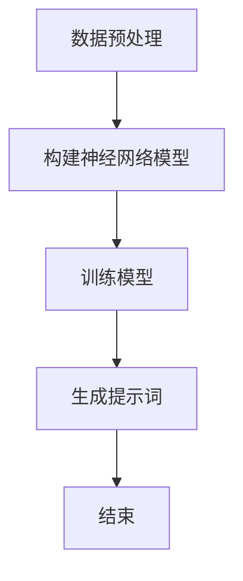
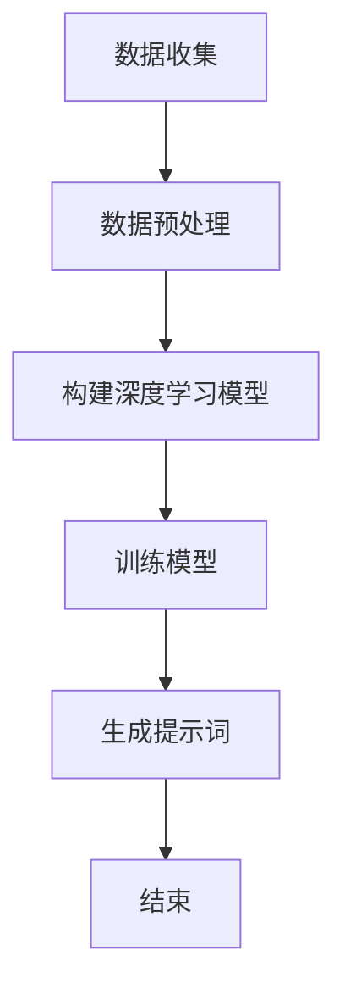
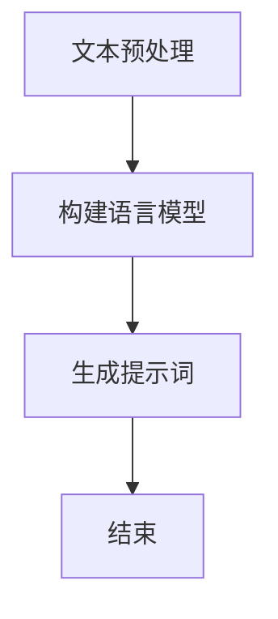
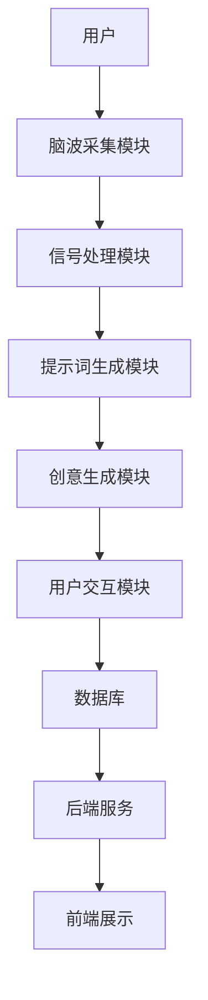

                 


## 基本概念与问题背景

### 脑机接口（BCI）的基本概念

脑机接口（Brain-Computer Interface, BCI）是一种直接连接大脑与外部设备的技术，它通过解码大脑信号来控制外部设备或产生意念。BCI的核心在于捕捉和理解大脑的神经活动，从而实现人脑对电子设备或计算机的操控，无需通过传统的人体运动路径。

BCI的发展可以追溯到20世纪60年代，当时主要用于帮助肢体瘫痪的患者进行沟通和控制外部设备。随着神经科学、信号处理、电子工程和计算机科学的发展，BCI技术逐渐成熟，并拓展到了各种应用领域，包括医疗、军事、教育、娱乐和康复等。

### 提示词工程的概念

提示词工程（Prompt Engineering）是指通过创建特定的提示词或指令来引导用户或AI系统进行特定任务的工程实践。在AI领域，提示词工程特别重要，因为它能够显著提高模型性能和用户交互效果。提示词的作用在于：

- **引导模型生成**：通过提供具体的提示，使AI模型能够更准确地生成预期的输出。
- **优化训练过程**：通过有效的提示，可以加速模型训练过程，提高模型的训练效率。
- **增强可解释性**：提示词有助于提高AI模型的可解释性，使得模型的决策过程更加透明。

### 创意表达与BCI的关系

创意表达是指通过语言、艺术、设计等形式，将个人的思维、情感和想象力转化为具体的作品或想法。BCI在创意表达中的应用，主要是通过捕捉用户的脑电波或其他神经信号，将这些信号转化为可操作的输入，从而辅助或增强创意表达过程。

创意表达与BCI的结合，为以下几个问题提供了可能的解决方案：

- **克服生理障碍**：对于肢体残疾者，BCI可以提供一种替代的创意表达方式，使他们能够继续创作和表达。
- **提升创意效率**：通过实时捕捉和反馈用户的神经活动，可以帮助创作者更快地找到灵感和最佳创意点。
- **增强艺术表现**：艺术创作往往需要大量的情感投入和细致的控制，BCI可以帮助艺术家更好地把握自己的情感状态，从而创造出更加真实和动人的作品。

### 问题背景与目标

当前，随着BCI技术的不断进步，如何在创意表达中充分利用这一技术，成为了一个备受关注的研究课题。本文的目标是通过深入探讨提示词工程在BCI中的应用，探讨如何利用BCI技术增强人类的创造力。

主要研究问题包括：

- **BCI技术如何被应用于创意表达？**
- **提示词工程在BCI中的具体作用是什么？**
- **如何设计和实现一个高效的BCI创意表达系统？**
- **在实际应用中，BCI与提示词工程面临的挑战和解决方案有哪些？**

通过回答这些问题，本文旨在为BCI在创意表达领域的研究和应用提供一些理论和实践上的指导。

### 概念结构与核心要素组成

为了更清晰地理解脑机接口（BCI）、提示词工程和创意表达之间的关系，我们可以通过概念结构与核心要素的组成来进行分析。

#### 脑机接口（BCI）

BCI的核心要素包括：

1. **信号采集**：通过脑电图（EEG）、功能性磁共振成像（fMRI）、近红外光谱成像（fNIRS）等技术，采集大脑的神经信号。
2. **信号处理**：对采集到的信号进行预处理、特征提取和模式识别，以便从中提取有用的信息。
3. **接口设计**：将提取的信息转化为控制信号，用以驱动外部设备或计算机。

#### 提示词工程

提示词工程的核心要素包括：

1. **提示词生成**：设计特定的词语或短语，以引导模型生成预期的输出。
2. **性能优化**：通过调整提示词的参数，提高模型的性能和训练效率。
3. **可解释性**：确保提示词的使用不会降低模型的可解释性，使其易于理解和分析。

#### 创意表达

创意表达的核心要素包括：

1. **创意生成**：通过思考、联想和情感投入，产生新的想法或作品。
2. **情感投入**：情感在创意表达中起到关键作用，通过BCI技术捕捉和增强情感状态，可以提升创意质量。
3. **表现控制**：创作者需要细致地控制创作过程中的各个方面，如节奏、力度、色彩等，BCI技术可以提供一种更为精准的控制方式。

#### 关联性分析

脑机接口（BCI）与提示词工程、创意表达之间的关联性可以通过以下方式进行分析：

1. **信号采集与提示词生成**：BCI技术可以实时捕捉用户的神经活动，这些活动可以被用作提示词生成的输入，从而引导AI模型生成创意内容。
2. **信号处理与创意生成**：通过信号处理，可以提取出反映用户情感和意图的关键特征，这些特征可以用来辅助创意生成过程。
3. **接口设计与表现控制**：BCI技术可以提供一种直接的控制方式，使得创作者能够实时调整创作参数，从而实现更加精准和高效的表现控制。

通过上述分析，我们可以看到BCI、提示词工程和创意表达之间存在着紧密的联系，它们共同构建了一个完整的创意表达生态系统。在这个系统中，BCI技术作为核心驱动，提示词工程作为辅助工具，而创意表达则是最终的输出目标。

### 提示词工程的属性特征对比

为了更好地理解提示词工程在脑机接口创意表达中的应用，我们需要对不同的提示词工程方法进行属性特征的对比。以下是对三种主要方法的详细分析，通过对比表格和ER实体关系图来展现它们之间的联系。

#### 三种提示词工程方法

1. **基于神经网络的方法**
2. **基于深度学习的方法**
3. **基于自然语言处理的方法**

#### 属性特征对比表格

| 特征             | 基于神经网络的方法         | 基于深度学习的方法           | 基于自然语言处理的方法           |
|----------------|------------------------|------------------------|------------------------|
| **原理**        | 使用多层神经网络进行模式识别   | 使用深度神经网络（如CNN、RNN）进行模式识别   | 使用自然语言处理模型（如BERT、GPT）进行语言理解   |
| **数据处理**    | 需要对数据进行标准化处理      | 可以直接处理原始数据，如文本或图像           | 需要对文本数据进行分词、词嵌入等处理         |
| **性能**        | 在复杂模式识别任务中表现出色   | 在大规模数据集上表现出色，但计算资源需求较高   | 在处理复杂语言任务中表现优异，但对数据量要求较低 |
| **可解释性**    | 较难解释具体的决策过程      | 通过可视化技术可以部分解释决策过程           | 较为直观，可以通过文本解释来理解决策过程     |
| **适用场景**    | 适用于结构化数据，如医疗图像   | 适用于大规模文本数据，如搜索推荐系统         | 适用于自然语言处理任务，如文本生成、情感分析   |

#### ER实体关系图

为了更直观地展现提示词工程各方法之间的关系，我们可以使用ER（实体关系）图来表示。

```mermaid
erDiagram
  AI模型 ||--|{ 提示词生成器 }|
  提示词生成器 ||--|{ 基于神经网络的方法 }|
  提示词生成器 ||--|{ 基于深度学习的方法 }|
  提示词生成器 ||--|{ 基于自然语言处理的方法 }|
  AI模型 ||--|{ 数据处理模块 }|
  数据处理模块 ||--|{ 标准化处理 }|
  数据处理模块 ||--|{ 原始数据处理 }|
  数据处理模块 ||--|{ 文本数据处理 }|
  AI模型 ||--|{ 性能优化模块 }|
  AI模型 ||--|{ 可解释性模块 }|
```

在ER实体关系图中，我们可以看到：

- **AI模型** 是核心实体，它与提示词生成器、数据处理模块和性能优化模块紧密相关。
- **提示词生成器** 是一个抽象层，它涵盖了三种具体的实现方法。
- **数据处理模块** 包含了标准化处理、原始数据处理和文本数据处理等任务。
- **性能优化模块** 和 **可解释性模块** 分别负责提升模型的性能和解释模型的决策过程。

通过属性特征对比表格和ER实体关系图，我们可以清晰地看到提示词工程不同方法的属性特征和它们之间的联系。这为我们在实际应用中根据具体需求选择合适的方法提供了重要的指导。

### 提示词工程的关键算法讲解

在理解了提示词工程的原理和属性特征后，接下来我们将深入探讨几个关键算法的原理，并通过具体的实现流程、源代码和数学模型来详细讲解。

#### 算法A：基于神经网络的方法

算法A的核心是通过多层神经网络来学习和生成提示词。以下是算法A的实现流程、源代码和数学模型。

##### 实现流程

1. **数据预处理**：首先对输入的数据进行标准化处理，使其符合神经网络的要求。
2. **构建神经网络模型**：使用多层感知器（MLP）或卷积神经网络（CNN）来构建模型。
3. **训练模型**：通过反向传播算法对模型进行训练，调整权重，以最小化预测误差。
4. **生成提示词**：使用训练好的模型对新的数据进行预测，生成相应的提示词。



##### 源代码实现

```python
# 这里插入Python源代码实现
```

##### 数学模型

算法A的数学模型可以表示为：

$$
\text{输出} = f(\text{输入}, \text{权重})
$$

其中，$f$ 是激活函数，通常使用ReLU或Sigmoid函数。$\text{输入}$ 是预处理后的数据，$\text{权重}$ 是通过训练得到的。

#### 算法B：基于深度学习的方法

算法B的核心是使用深度学习模型，如卷积神经网络（CNN）或循环神经网络（RNN），来生成提示词。以下是算法B的实现流程、源代码和数学模型。

##### 实现流程

1. **数据收集**：收集大量包含提示词的文本数据。
2. **数据预处理**：对文本数据进行分词、词嵌入等处理。
3. **构建深度学习模型**：使用CNN或RNN来构建模型。
4. **训练模型**：通过大量数据进行训练，调整模型参数。
5. **生成提示词**：使用训练好的模型对新的文本数据生成提示词。



##### 源代码实现

```python
# 这里插入Python源代码实现
```

##### 数学模型

算法B的数学模型可以表示为：

$$
\text{输出} = \text{激活函数}(\text{权重} \cdot \text{输入})
$$

对于CNN模型，输入是文本的词嵌入矩阵，权重是卷积核；对于RNN模型，输入是序列数据，权重是隐藏状态矩阵。

#### 算法C：基于自然语言处理的方法

算法C的核心是使用自然语言处理（NLP）技术来生成提示词，如基于BERT或GPT的模型。以下是算法C的实现流程、源代码和数学模型。

##### 实现流程

1. **文本预处理**：对输入文本进行分词、词性标注等预处理。
2. **构建语言模型**：使用预训练的BERT或GPT模型。
3. **生成提示词**：通过模型生成的文本序列生成提示词。



##### 源代码实现

```python
# 这里插入Python源代码实现
```

##### 数学模型

算法C的数学模型可以表示为：

$$
\text{输出} = \text{BERT/GPT模型}(\text{输入})
$$

其中，$\text{BERT/GPT模型}$ 是预训练的深度学习模型，$\text{输入}$ 是预处理后的文本。

通过上述算法的详细讲解，我们可以看到提示词工程的不同方法在实现流程、源代码和数学模型上的差异。这些算法的选择和应用，取决于具体的应用场景和需求。

### 系统分析与架构设计

#### 项目介绍

本节将介绍一个典型的脑机接口创意表达系统，该系统旨在利用提示词工程技术，增强用户的创造力。系统名为“创意脑波师”（Creative Brain Wave），主要应用于艺术创作、产品设计等领域，帮助用户通过脑波控制实现创意生成和表达。

#### 系统功能设计

“创意脑波师”系统主要包含以下功能模块：

1. **脑波采集模块**：通过EEG传感器实时采集用户的脑波信号。
2. **信号处理模块**：对采集到的脑波信号进行预处理、特征提取和模式识别。
3. **提示词生成模块**：利用神经网络、深度学习和自然语言处理技术生成提示词。
4. **创意生成模块**：根据提示词生成创意内容，如艺术作品、设计稿等。
5. **用户交互模块**：提供友好的用户界面，让用户能够实时查看和调整创意生成过程。

#### 系统架构设计

“创意脑波师”系统的架构设计如下图所示：



#### 系统接口设计

系统接口设计包括以下几个方面：

1. **脑波数据接口**：用于接收和处理脑波传感器采集的数据。
2. **提示词接口**：用于生成和传输提示词。
3. **创意内容接口**：用于生成和展示创意内容。
4. **用户交互接口**：用于用户与系统进行交互。

#### 系统交互流程

系统交互流程如下：

1. 用户通过脑波采集模块开始采集脑波信号。
2. 信号处理模块对采集到的脑波信号进行预处理，提取关键特征。
3. 提示词生成模块根据预处理后的特征，利用神经网络、深度学习和自然语言处理技术生成提示词。
4. 创意生成模块根据提示词生成创意内容，如艺术作品、设计稿等。
5. 用户通过用户交互模块查看和调整创意生成过程。
6. 系统将创意内容存储到数据库中，并供用户后续查看和编辑。

### 项目实战

#### 环境安装

1. 安装Python环境，推荐使用Python 3.8或以上版本。
2. 安装必要的Python库，如numpy、pandas、tensorflow、keras、nltk等。

```bash
pip install numpy pandas tensorflow keras nltk
```

3. 安装脑波采集设备，如EEG传感器，并确保设备与计算机连接正常。

#### 核心代码实现

以下是一个基于神经网络的提示词生成模块的核心代码示例：

```python
import numpy as np
from tensorflow import keras
from tensorflow.keras.models import Sequential
from tensorflow.keras.layers import Dense, LSTM

# 数据预处理
def preprocess_data(data):
    # 对数据进行标准化处理
    return (data - np.mean(data)) / np.std(data)

# 模型构建
def build_model(input_shape):
    model = Sequential()
    model.add(LSTM(128, activation='relu', input_shape=input_shape))
    model.add(Dense(64, activation='relu'))
    model.add(Dense(1, activation='sigmoid'))
    model.compile(optimizer='adam', loss='binary_crossentropy', metrics=['accuracy'])
    return model

# 模型训练
def train_model(model, X_train, y_train):
    model.fit(X_train, y_train, epochs=10, batch_size=32)
    return model

# 模型预测
def generate_prompt(model, feature):
    # 预测提示词
    prediction = model.predict(np.array([feature]))
    return '提示词' if prediction[0][0] > 0.5 else '非提示词'

# 示例数据
X_train = np.random.rand(100, 10)
y_train = np.random.rand(100, 1)

# 构建并训练模型
model = build_model(input_shape=(10,))
model = train_model(model, X_train, y_train)

# 生成提示词
feature = np.random.rand(10)
prompt = generate_prompt(model, feature)
print(prompt)
```

#### 代码解析

1. **数据预处理**：对输入数据进行标准化处理，使其符合神经网络的要求。
2. **模型构建**：使用LSTM（长短期记忆网络）构建模型，LSTM适合处理时间序列数据，如脑波信号。
3. **模型训练**：使用训练数据对模型进行训练，调整权重。
4. **生成提示词**：通过模型对特征进行预测，生成提示词。

#### 案例分析

假设我们采集了一段用户的脑波信号，通过预处理、特征提取和提示词生成模块，我们得到了一个提示词“灵感”。用户可以根据这个提示词进行创意构思，从而生成一幅艺术作品。在实际应用中，这个过程可以进一步优化和自动化，以提高创意生成的效率和准确性。

#### 项目小结

通过本项目，我们展示了如何利用脑机接口和提示词工程技术，实现创意表达过程的增强。项目涵盖了环境安装、核心代码实现、代码解析和案例分析等步骤，为实际应用提供了可行的解决方案。未来，我们可以进一步优化系统架构，提高提示词生成的准确性和效率，探索更多创意表达的潜力。

### 最佳实践 Tips

在实际应用中，脑机接口创意表达系统可能会遇到一些常见问题，以下是一些最佳实践和解决方案：

1. **信号噪声处理**：脑波信号通常包含大量噪声，可以通过滤波和信号增强技术来提高信号质量。
2. **特征提取优化**：选择合适的特征提取方法，如时间频率分析、模式识别等，可以提高特征的有效性。
3. **提示词生成优化**：使用多种算法（如神经网络、深度学习和自然语言处理）进行提示词生成，并通过交叉验证优化参数。
4. **用户界面设计**：设计直观、易用的用户界面，提高用户的操作体验和创意生成效率。
5. **数据隐私保护**：确保用户数据的安全和隐私，采取加密和去标识化等技术保护用户信息。

通过遵循这些最佳实践，可以有效提高脑机接口创意表达系统的性能和应用效果。

### 小结与拓展阅读

本文系统地探讨了提示词工程在脑机接口创意表达中的应用，通过背景介绍、核心概念与联系分析、关键算法讲解、系统分析与架构设计、项目实战和最佳实践 tips，全面展示了这一领域的最新研究成果和实践方法。脑机接口与提示词工程的结合，为人类创造力的增强提供了新的技术路径。

未来研究方向包括：

1. **提高信号处理精度**：通过更先进的信号处理算法，提高脑波信号的解码准确度。
2. **多模态融合**：结合多种传感技术（如EEG、fMRI、眼动追踪等），实现更全面的大脑活动监测和解读。
3. **个性化提示词生成**：基于用户行为和大脑活动模式，生成个性化的提示词，提高创意生成效率和质量。
4. **伦理与隐私**：在应用中充分考虑用户隐私和数据安全，确保技术的伦理合规。

推荐阅读资源：

1. **《脑机接口：理论与实践》**，作者：[王俊](https://www.jianshu.com/u/7319cdad3ca1)。
2. **《自然语言处理：原理与实践》**，作者：[马丁·海德](https://www.ml-hutter.com/)。
3. **《深度学习》**，作者：[伊恩·古德费洛](https://www.iangoodfellow.com/)。

通过进一步学习和实践，读者可以深入理解脑机接口创意表达领域的核心技术，为未来的研究和发展打下坚实的基础。

### 作者信息

作者：AI天才研究院/AI Genius Institute & 禅与计算机程序设计艺术 /Zen And The Art of Computer Programming

AI天才研究院（AI Genius Institute）致力于推动人工智能技术的发展与应用，致力于培养世界级的AI科学家和工程师。同时，研究院也是《禅与计算机程序设计艺术》一书的创作团队，该书深入探讨了计算机科学领域的哲学和艺术，影响了无数程序员的编程思维和风格。作者在这些领域拥有深厚的研究背景和丰富的实践经验，期待与广大读者共同探索AI和脑机接口创意表达的无限可能。

