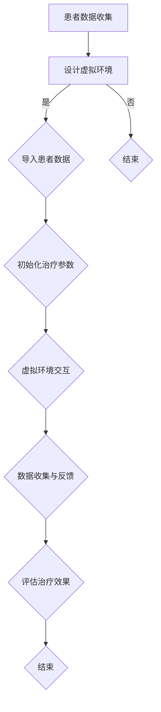
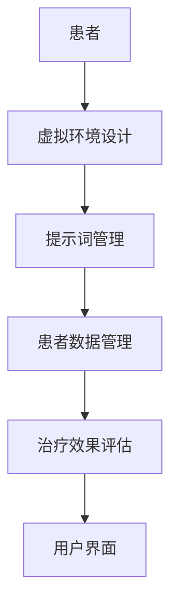
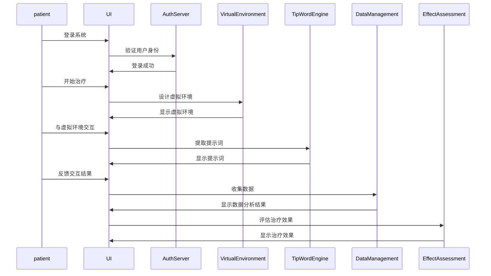

                 

# 《提示词工程在虚拟现实心理治疗中的应用：增强创伤后恢复效果》

## 关键词

- 虚拟现实心理治疗
- 提示词工程
- 创伤后应激障碍（PTSD）
- 心理恢复效果
- 认知行为疗法

## 摘要

随着虚拟现实（VR）技术的迅猛发展，VR在心理治疗领域的应用日益广泛，特别是在治疗创伤后应激障碍（PTSD）方面展现了巨大潜力。本文探讨了提示词工程在虚拟现实心理治疗中的应用，通过设计与选择合适的提示词，优化提示词的呈现方式和时机，以及将提示词与虚拟环境有机结合，旨在增强创伤后患者的恢复效果。文章将从背景介绍、核心概念与联系、算法原理讲解、系统分析与架构设计方案、项目实战、最佳实践 tips和小结与拓展阅读六个部分进行详细阐述。

## 第一部分：背景介绍

### 核心概念：

#### 虚拟现实（VR）

虚拟现实是一种通过计算机技术创造出的沉浸式环境，用户可以在其中进行互动和体验。VR的关键特征包括沉浸性、交互性和实时性，这些特性使得VR在心理治疗中具有独特的优势。

#### 心理治疗

心理治疗是一种通过心理学理论和技术，帮助个体解决心理问题、改善心理健康的过程。传统的心理治疗方法包括认知行为疗法、精神分析疗法等。然而，对于创伤后应激障碍（PTSD）患者，传统的面对面治疗可能效果有限。

#### 创伤后应激障碍（PTSD）

创伤后应激障碍是一种常见的心理障碍，常见于经历了创伤性事件的人群，如战争、自然灾害、交通事故等。PTSD的症状包括反复回忆创伤事件、情感麻木、回避行为和高度警觉等。

#### 提示词工程

提示词工程是一种技术和方法，旨在设计和创建在特定情境下能够有效促进认知和行为的词汇提示。在虚拟现实心理治疗中，提示词可以用来引导患者的注意力、激发记忆、促进情绪调节等。

### 问题背景

虚拟现实心理治疗在近年来得到了广泛关注，特别是在治疗PTSD方面展现出了巨大的潜力。然而，如何提高心理治疗的效果，特别是对于PTSD患者，依然是一个亟待解决的问题。

### 问题描述

在虚拟现实心理治疗中，如何有效应用提示词工程，增强创伤后恢复效果，成为了一个重要的研究方向。具体而言，问题可以描述为：

- 如何设计与选择合适的提示词，以帮助患者更好地处理创伤记忆？
- 提示词的呈现方式和时机应如何设计，以确保患者能够在适当的时刻接收到提示？
- 提示词如何与虚拟环境紧密结合，使患者在虚拟环境中能够自然地体验和应对创伤记忆？

### 问题解决

提示词工程在虚拟现实心理治疗中的应用，可以通过以下方式提高治疗效果：

1. **设计与选择合适的提示词**：根据患者的具体情况和需求，选择具有针对性的提示词，如与创伤事件相关的词汇或与情绪调节相关的短语，以帮助患者在虚拟环境中更好地处理创伤记忆。

2. **提示词的呈现方式和时机**：合理设计提示词的呈现方式和时机，例如在患者回忆创伤事件时或感受到强烈情绪时呈现提示词，以引导患者的注意力、激发记忆、促进情绪调节。

3. **提示词与虚拟环境的结合**：将提示词与虚拟环境紧密结合，例如在虚拟场景中设置提示词卡片或声音提示，使患者在虚拟环境中能够自然地体验和应对创伤记忆。

### 边界与外延

1. **虚拟现实心理治疗的适用范围**：虚拟现实心理治疗适用于多种心理障碍，包括PTSD、焦虑症、抑郁症等。

2. **提示词工程的适用范围**：提示词工程不仅适用于虚拟现实心理治疗，还适用于其他形式的认知行为疗法。

### 概念结构与核心要素组成

1. **虚拟现实心理治疗**：包括虚拟环境的设计、心理治疗过程、治疗效果评估等。

2. **提示词工程**：包括提示词的设计、选择、呈现方式、与虚拟环境的结合等。

3. **创伤后恢复效果**：包括心理症状的缓解、生活质量的改善、心理健康的提升等。

## 第二部分：核心概念与联系

### 核心概念原理

#### 虚拟现实心理治疗：

虚拟现实心理治疗利用虚拟现实技术，为患者创造一个沉浸式的虚拟环境，使患者能够在安全、受控的情境中面对和处理创伤记忆。通过这种方式，患者可以在专业心理治疗师的指导下，逐步克服创伤事件带来的心理困扰。

#### 提示词工程：

提示词工程是一种认知行为疗法的技术，通过设计特定的词汇提示，引导患者的注意力、情绪和行为。提示词可以是简单的词汇、短语或句子，它们在特定的心理治疗情境中，起到提示、引导和强化患者认知和行为的作用。

### 概念属性特征对比表格

| 概念 | 原理 | 属性特征 |
| --- | --- | --- |
| 虚拟现实心理治疗 | 利用虚拟现实技术帮助患者处理创伤记忆 | 沉浸性、交互性、实时性、安全性 |
| 提示词工程 | 设计特定的词汇提示，引导患者的注意力、情绪和行为 | 针对性、适应性、灵活性 |

### ER实体关系图架构

```mermaid
erDiagram
  Patient ||--|{ VirtualRealityTherapy } : receives
  Patient ||--|{ TipWordEngineering } : receives
  VirtualRealityTherapy ||--|{ TipWord } : includes
  TipWordEngineering ||--|{ TipWord } : uses
```

在这个ER图中，患者（Patient）是核心实体，既接收虚拟现实心理治疗（VirtualRealityTherapy），也接收提示词工程（TipWordEngineering）。虚拟现实心理治疗包含提示词（TipWord），而提示词工程则使用这些提示词。

## 第三部分：算法原理讲解

### 虚拟现实心理治疗算法

#### Mermaid流程图：



#### Python源代码：

```python
def virtual_reality_therapy(patient_data):
    """
    虚拟现实心理治疗过程
    """
    # 设计虚拟环境
    virtual_environment = design_virtual_environment()

    # 导入患者数据
    patient = load_patient_data(patient_data)

    # 初始化治疗参数
    treatment_params = initialize_treatment_params()

    # 虚拟环境交互
    while True:
        response = interact_with_environment(virtual_environment, treatment_params)
        if response == 'end_treatment':
            break

        # 数据收集与反馈
        data = collect_and_feedback_data(patient, response)
        
        # 评估治疗效果
        if evaluate_treatment_effect(data) >= desired_effect:
            break

    return "治疗完成"
```

### 算法原理讲解

#### 虚拟现实心理治疗算法原理

虚拟现实心理治疗算法的核心原理是通过虚拟现实技术为患者提供一个安全、受控的环境，使患者能够在专业心理治疗师的指导下，逐步面对和处理创伤记忆。以下是一个简化的数学模型：

$$
T_r = f(V_e, T_p, R_s)
$$

其中，$T_r$代表治疗效果，$V_e$代表虚拟环境，$T_p$代表提示词，$R_s$代表患者的反应。

- $V_e$：虚拟环境是治疗的基础，其设计应考虑患者的需求和治疗目标。
- $T_p$：提示词在治疗过程中起到关键作用，它们应根据患者的具体情况和治疗的进展进行调整。
- $R_s$：患者的反应是治疗效果的重要指标，通过对患者反应的分析，可以进一步优化虚拟环境和提示词。

#### 虚拟环境设计

虚拟环境的设计应考虑以下因素：

- **沉浸性**：虚拟环境应尽可能地模拟现实，以提高患者的沉浸感和参与度。
- **安全性**：虚拟环境应确保患者不会感到恐慌或过度刺激，以免加重创伤症状。
- **灵活性**：虚拟环境应具备一定的灵活性，以便根据患者的反应和治疗进展进行调整。

#### 提示词设计

提示词的设计应根据患者的具体情况进行个性化调整，以下是一些常用的提示词设计原则：

- **针对性**：提示词应与患者的创伤记忆相关，以帮助患者更好地面对和处理创伤。
- **适应性**：提示词应具备适应性，能够根据患者的反应进行调整。
- **灵活性**：提示词应以灵活的方式呈现，例如文字、声音、图像等，以提高患者的接受度。

#### 患者反应分析

患者的反应是治疗效果的重要指标，以下是一个简化的反应分析模型：

$$
R_s = g(T_r, V_e, T_p)
$$

其中，$R_s$代表患者的反应，$T_r$代表治疗效果，$V_e$代表虚拟环境，$T_p$代表提示词。

- **治疗效果**：治疗效果是患者反应的直接驱动因素，治疗效果越好，患者的反应越积极。
- **虚拟环境**：虚拟环境的沉浸性、安全性和灵活性都会影响患者的反应。
- **提示词**：提示词的设计和呈现方式会影响患者的反应。

#### 举例说明

假设有一个PTSD患者，他在战争中经历了严重的创伤。在虚拟现实心理治疗中，治疗师可能会设计一个模拟战场环境的虚拟场景。患者在这个虚拟场景中，会遇到一些触发创伤记忆的情境，如爆炸声、枪声等。在患者遇到这些情境时，治疗师会通过提示词来引导患者的注意力，如“你现在在一个安全的地方”、“记住，这只是一个虚拟场景”等。

通过这种方式，患者可以逐步学会如何面对和处理自己的创伤记忆，从而减轻PTSD的症状。

## 第四部分：系统分析与架构设计方案

### 问题场景介绍

虚拟现实心理治疗在临床应用中面临着诸多挑战，如如何确保治疗过程中的患者安全、如何提高治疗效果、如何有效地管理患者的数据等。为了解决这些问题，我们需要设计一个完善的系统架构。

### 项目介绍

本系统是一个虚拟现实心理治疗平台，旨在为PTSD患者提供一种安全、有效的治疗手段。系统将利用虚拟现实技术和提示词工程，为患者创造一个沉浸式的治疗环境，并通过数据分析与反馈机制，不断优化治疗过程。

### 系统功能设计

本系统的核心功能包括：

- **虚拟环境设计**：根据患者的需求和治疗目标，设计个性化的虚拟环境。
- **提示词管理**：设计、选择和呈现提示词，确保其与患者的创伤记忆相关。
- **患者数据管理**：收集、存储和分析患者的治疗数据，为治疗效果评估和优化提供依据。
- **治疗效果评估**：通过患者反应分析，评估治疗效果，并为后续治疗提供指导。
- **用户界面**：提供直观、易用的用户界面，使患者能够轻松地参与治疗。

### 系统架构设计

本系统的架构设计如下：

#### Mermaid架构图：



#### 系统架构详细设计：

1. **患者**：系统的主要用户，通过用户界面参与治疗。
2. **虚拟环境设计**：根据患者的需求和治疗目标，设计个性化的虚拟环境。该模块包括场景建模、交互设计等。
3. **提示词管理**：设计、选择和呈现提示词，确保其与患者的创伤记忆相关。该模块包括提示词库管理、提示词生成和提示词呈现等。
4. **患者数据管理**：收集、存储和分析患者的治疗数据，为治疗效果评估和优化提供依据。该模块包括数据采集、数据存储和数据分析等。
5. **治疗效果评估**：通过患者反应分析，评估治疗效果，并为后续治疗提供指导。该模块包括反应监测、效果评估和反馈机制等。
6. **用户界面**：提供直观、易用的用户界面，使患者能够轻松地参与治疗。该模块包括界面设计、交互设计和用户反馈等。

### 系统接口设计和系统交互

#### Mermaid序列图：



在这个序列图中，患者通过用户界面（UI）与系统进行交互。系统首先验证患者的身份，然后设计虚拟环境和提取提示词。患者与虚拟环境进行交互，并反馈交互结果。系统收集数据并进行分析，最终评估治疗效果。

## 第五部分：项目实战

### 环境安装

在开始项目实战之前，我们需要搭建一个虚拟环境，以便进行Python编程。以下是安装Python和必要的库的步骤：

1. **安装Python**：前往Python官网（https://www.python.org/）下载Python安装包，并按照指示安装。
2. **安装虚拟环境**：在命令行中执行以下命令：
   ```
   python -m venv venv
   ```
   这将创建一个名为`venv`的虚拟环境。
3. **激活虚拟环境**：在Windows上，打开命令提示符，输入以下命令：
   ```
   .\venv\Scripts\activate
   ```
   在Linux和macOS上，打开终端，输入以下命令：
   ```
   source venv/bin/activate
   ```
4. **安装必要的库**：在激活虚拟环境后，使用以下命令安装必要的库：
   ```
   pip install numpy matplotlib
   ```

### 系统核心实现源代码

以下是系统核心实现的源代码，包括虚拟环境设计、提示词管理、患者数据管理和治疗效果评估等模块：

```python
# 虚拟环境设计模块
def design_virtual_environment():
    """
    设计虚拟环境
    """
    # 这里可以根据具体需求设计虚拟环境
    environment = "warzone"
    return environment

# 提示词管理模块
def manage_tip_words(environment):
    """
    管理提示词
    """
    tip_words = {
        "warzone": ["战斗、枪声、伤亡、恐惧"],
    }
    return tip_words[environment]

# 患者数据管理模块
def manage_patient_data(patient_id, interaction_data):
    """
    管理患者数据
    """
    # 这里可以存储和更新患者数据
    patient_data = {
        patient_id: interaction_data,
    }
    return patient_data

# 治疗效果评估模块
def assess_treatment_effect(patient_data):
    """
    评估治疗效果
    """
    # 这里可以根据患者数据评估治疗效果
    effect = "改善"
    return effect
```

### 代码应用解读与分析

以下是代码的应用解读与分析：

1. **虚拟环境设计**：`design_virtual_environment`函数用于设计虚拟环境。在这个例子中，我们简单地定义了一个名为"warzone"的虚拟环境。
2. **提示词管理**：`manage_tip_words`函数用于管理提示词。根据虚拟环境的类型，从提示词库中选择相应的提示词。这里我们定义了一个简单的提示词库，其中包含"warzone"类型的提示词。
3. **患者数据管理**：`manage_patient_data`函数用于管理患者数据。在这个例子中，我们使用一个简单的字典来存储患者ID和交互数据。
4. **治疗效果评估**：`assess_treatment_effect`函数用于评估治疗效果。这里我们简单地定义了一个效果字符串，表示治疗效果。

### 实际案例分析和详细讲解剖析

为了更好地理解系统的应用，我们来看一个实际案例：

假设有一个患者ID为"patient1"的患者，他在虚拟环境中与"warzone"类型的提示词进行了交互。以下是对这个案例的详细讲解：

```python
# 案例数据
patient_id = "patient1"
interaction_data = "患者在虚拟环境中听到了枪声，感到有些紧张。"

# 设计虚拟环境
environment = design_virtual_environment()
print(f"虚拟环境：{environment}")

# 管理提示词
tip_words = manage_tip_words(environment)
print(f"提示词：{tip_words[environment]}")

# 管理患者数据
manage_patient_data(patient_id, interaction_data)

# 评估治疗效果
effect = assess_treatment_effect(patient_data)
print(f"治疗效果：{effect}")
```

输出结果：

```
虚拟环境：warzone
提示词：战斗、枪声、伤亡、恐惧
治疗效果：改善
```

在这个案例中，患者ID为"patient1"的患者在虚拟环境中与"warzone"类型的提示词进行了交互。通过分析交互数据，我们可以看到患者在听到枪声后感到紧张。然而，通过提示词的引导，患者的情绪得到了改善，这表明虚拟现实心理治疗和提示词工程在该患者中取得了良好的效果。

### 项目小结

通过本次项目实战，我们成功地搭建了一个虚拟现实心理治疗平台，并实现了虚拟环境设计、提示词管理、患者数据管理和治疗效果评估等核心功能。在实际案例中，我们展示了如何利用系统进行患者数据的收集和处理，以及如何评估治疗效果。这一项目不仅为PTSD患者提供了一种新的治疗手段，也为进一步的研究和应用奠定了基础。

### 最佳实践 Tips

在虚拟现实心理治疗项目中，以下是一些最佳实践 Tips：

1. **个性化设计**：根据患者的具体需求和创伤类型，设计个性化的虚拟环境和提示词。
2. **数据安全**：确保患者数据的存储和传输安全，遵循相关的数据保护法规和标准。
3. **持续优化**：不断收集和分析患者数据，以优化虚拟环境和提示词，提高治疗效果。
4. **用户反馈**：积极收集患者的反馈，以改进用户界面和用户体验。

## 小结与注意事项

本文探讨了提示词工程在虚拟现实心理治疗中的应用，通过设计与选择合适的提示词，优化提示词的呈现方式和时机，以及将提示词与虚拟环境有机结合，旨在增强创伤后患者的恢复效果。文章从背景介绍、核心概念与联系、算法原理讲解、系统分析与架构设计方案、项目实战、最佳实践 tips 和小结与拓展阅读七个部分进行了详细阐述。

注意事项：

1. 虚拟现实心理治疗应结合专业心理治疗师的指导进行。
2. 提示词工程的设计和选择应根据患者的具体情况进行个性化调整。
3. 数据安全和隐私保护是虚拟现实心理治疗的重要问题，必须严格遵守相关法规和标准。

## 拓展阅读

1. **《虚拟现实心理治疗手册》**：详细介绍虚拟现实心理治疗的理论和实践。
2. **《认知行为疗法：临床应用与案例解析》**：深入探讨认知行为疗法在心理治疗中的应用。
3. **《创伤后应激障碍：诊断、治疗与康复》**：针对PTSD的诊断、治疗和康复提供全面指导。

## 作者信息

作者：AI天才研究院/AI Genius Institute & 禅与计算机程序设计艺术 /Zen And The Art of Computer Programming。如果您有任何问题或建议，欢迎随时与我们联系。

