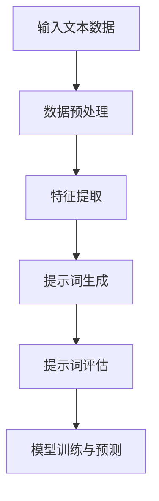
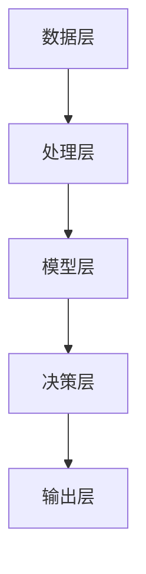
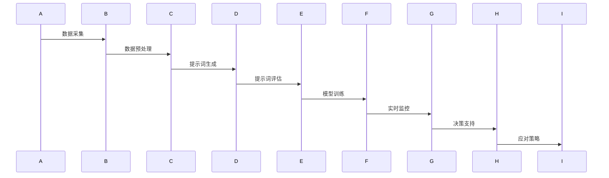

                 

### 第一部分：背景介绍

## 第1章: 问题背景

### 1.1.1 问题背景介绍

金融分析AI，作为人工智能在金融领域的一个重要应用，已经展现出巨大的潜力和价值。随着大数据和云计算技术的不断发展，金融分析AI在金融市场预测、风险管理、交易策略优化等方面都取得了显著的成果。例如，通过机器学习算法对历史数据进行分析，可以预测市场的走势，从而帮助投资者做出更加明智的决策。此外，在风险管理方面，AI可以帮助金融机构识别潜在风险，提供预警和应对策略，提高整体风险控制能力。

在这个背景下，提示词工程的重要性日益凸显。提示词工程是一种通过提取文本数据中的关键信息，生成有效的提示词，从而辅助AI模型进行决策的技术。在金融分析AI中，提示词工程的作用至关重要。它能够帮助模型更好地理解金融文本数据，提取出有价值的信息，从而提高模型的预测准确性和决策能力。例如，在金融新闻分析中，通过生成与市场走势相关的提示词，可以帮助AI模型更准确地预测市场的波动。

### 1.1.2 问题描述

提示词工程在金融分析AI中的关键作用主要体现在以下几个方面：

1. **信息提取**：金融领域的文本数据通常包含大量的非结构化信息，如新闻报道、研究报告、交易记录等。提示词工程能够从这些文本数据中提取出关键信息，转化为结构化的数据，供AI模型使用。

2. **上下文理解**：在金融分析中，上下文信息对于理解市场趋势和决策至关重要。提示词工程可以帮助AI模型理解文本的上下文，从而更好地把握市场的动态变化。

3. **增强模型性能**：通过生成高质量的提示词，可以增强AI模型对金融数据的理解能力，从而提高模型的预测准确性和决策能力。

然而，提示词工程在金融分析AI中也面临着一些挑战和限制：

1. **数据质量**：提示词的生成依赖于高质量的数据。在金融领域，数据的质量可能受到多种因素的影响，如数据的完整性、准确性等，这给提示词工程带来了挑战。

2. **语义理解**：金融文本数据中的语义理解是一个复杂的问题。即使提取出了关键信息，如何将这些信息有效地转化为提示词，仍然需要深入的研究。

3. **实时性**：金融市场的变化非常迅速，提示词工程需要具备实时处理的能力，以适应市场的动态变化。

### 1.1.3 问题解决思路

为了解决上述问题，我们可以从以下几个方面入手：

1. **数据预处理**：对金融文本数据进行全面的数据预处理，包括去除噪声、填补缺失值、归一化等，确保数据质量。

2. **语义分析**：利用自然语言处理（NLP）技术，对金融文本进行语义分析，提取关键信息，生成高质量的提示词。

3. **模型优化**：通过调整AI模型的参数，优化模型的结构和算法，提高模型对金融数据的理解和预测能力。

4. **实时处理**：设计高效的提示词生成和评估算法，确保能够在短时间内处理大量的金融数据，满足实时性的需求。

### 1.1.4 边界与外延

提示词工程不仅应用于金融分析AI，还可以广泛应用于其他金融产品中。例如，在股票分析中，提示词工程可以帮助提取与股票走势相关的信息；在保险风险评估中，提示词工程可以帮助识别风险因素。此外，提示词工程还可以与其他金融分析工具相结合，如时间序列分析、机器学习算法等，提供更加全面和深入的分析。

总的来说，提示词工程在金融分析AI中的应用具有广泛的前景。通过深入研究提示词工程的技术和方法，可以进一步提高金融分析AI的性能，为金融机构和投资者提供更加可靠和有效的决策支持。

## 第2章：核心概念与联系

### 2.1.1 金融分析AI的基本概念

金融分析AI是指利用人工智能技术，对金融数据进行处理和分析，从而为金融机构和投资者提供决策支持。金融分析AI的核心技术包括机器学习、深度学习、自然语言处理（NLP）等。这些技术可以用于数据分析、预测建模、风险识别等方面，从而提高金融决策的准确性和效率。

#### 金融分析AI的定义

金融分析AI是一种基于大数据和人工智能技术，用于分析和理解金融市场数据，以实现预测、决策和风险控制等目标的技术。它主要通过以下方式实现：

1. **数据采集**：从各种数据源（如金融新闻、研究报告、交易记录等）中获取数据。
2. **数据预处理**：对采集到的数据进行清洗、转换和归一化，使其适合AI模型处理。
3. **特征提取**：从预处理后的数据中提取有价值的特征，供AI模型使用。
4. **模型训练与优化**：使用机器学习或深度学习算法，对特征进行训练，优化模型性能。
5. **决策支持**：利用训练好的模型，对新的数据进行预测和决策。

#### 金融分析AI的核心技术

1. **机器学习**：通过训练模型，从数据中自动提取规律和模式，用于预测和决策。
2. **深度学习**：基于多层神经网络，对大量数据进行处理，提取更复杂的特征。
3. **自然语言处理（NLP）**：对文本数据进行处理，提取语义信息，用于情感分析、文本分类等。

### 2.1.2 提示词工程的概念与特征

#### 提示词工程的定义

提示词工程（Prompt Engineering）是指通过设计和优化提示词，以提升人工智能模型（如大型语言模型、机器学习模型等）性能的技术。提示词是一种指导模型输入的数据，它可以包含特定的问题、任务、上下文信息等，帮助模型更好地理解输入并生成准确的输出。

#### 提示词工程的属性特征

1. **引导性**：提示词能够引导模型关注关键信息，提高模型的注意力。
2. **精确性**：提示词需要精确地描述任务需求，避免模糊或冗长的表述。
3. **上下文相关**：提示词需要与模型的上下文保持一致，确保模型能够理解并适应该上下文。
4. **可扩展性**：提示词设计应具备一定的灵活性，能够适应不同规模和类型的任务需求。

### 2.1.3 概念对比表格

| 概念1 | 概念2 | 关联关系 |
|-------|-------|---------|
| 金融分析AI | 提示词工程 | 提示词工程是金融分析AI的关键环节，用于提升模型性能和决策效果 |

### 2.1.4 ER实体关系图架构

```mermaid
erDiagram
  AI模型 ||--|{ 提示词 }
  数据集 ||--|{ 提示词 }
  金融工具 ||--|{ 提示词 }
```

在这个ER实体关系图中，AI模型、数据集和金融工具都是实体，而提示词作为这些实体的属性或关联，起到了桥梁的作用。AI模型依赖于数据集和金融工具来生成提示词，从而提升其分析和决策能力。

## 第二部分：算法原理讲解

### 第3章：提示词工程算法原理

提示词工程的核心在于如何通过有效的提示词设计，提升人工智能模型在特定任务上的性能。下面，我们将详细探讨提示词工程的基本原理、算法流程、数学模型以及具体实现。

#### 3.1.1 算法基本原理

提示词工程的基本流程可以分为以下几个步骤：

1. **数据预处理**：首先对原始金融文本数据进行预处理，包括去除噪声、填补缺失值、文本分词等操作，将非结构化的文本数据转化为适合模型处理的格式。

2. **特征提取**：通过自然语言处理（NLP）技术，从预处理后的文本数据中提取关键特征，如关键词、主题、情感等。

3. **提示词生成**：根据特征提取结果，结合具体任务需求，生成高质量的提示词。提示词的设计需要考虑到引导性、精确性和上下文相关性等因素。

4. **评估与优化**：对生成的提示词进行评估，通过模型性能指标（如准确率、召回率等）来判断提示词的有效性。根据评估结果，对提示词进行优化调整。

5. **模型训练与预测**：利用优化后的提示词，对AI模型进行训练，并通过训练好的模型对新的金融数据进行预测和分析。

#### 3.1.2 算法流程图



在这个流程图中，输入文本数据首先经过数据预处理，然后进行特征提取，接着生成提示词。提示词的评估结果用于指导模型训练与预测，从而形成闭环反馈系统，不断提升模型的性能。

#### 3.1.3 算法数学模型和公式

提示词工程的数学模型可以表示为：

$$
\text{提示词} = f(\text{数据集}, \text{模型参数})
$$

其中，$f$ 表示提示词生成函数，它通过处理数据集和模型参数，生成高质量的提示词。这个模型的核心在于如何设计 $f$ 函数，使其能够提取关键信息，引导模型更好地理解和预测金融数据。

#### 3.1.4 举例说明

为了更好地理解提示词工程的实现，我们通过一个具体的例子来讲解。

##### 数据集：金融新闻文章

我们选取一组金融新闻文章作为数据集，每篇文章包含标题和正文。

##### 模型参数：神经网络模型

我们使用一个简单的神经网络模型作为我们的基础模型，该模型包含两个隐藏层，每个隐藏层有64个神经元。

##### 数据预处理

首先，我们对金融新闻文章进行数据预处理，包括去除HTML标签、分词、去除停用词等操作。预处理后的文本数据被转化为词向量表示。

```python
import jieba
import nltk
from sklearn.feature_extraction.text import TfidfVectorizer

# 预处理函数
def preprocess_text(text):
    # 去除HTML标签
    text = re.sub('<.*>', '', text)
    # 分词
    words = jieba.cut(text)
    # 去除停用词
    stop_words = set(nltk.corpus.stopwords.words('english'))
    filtered_words = [word for word in words if word not in stop_words]
    return ' '.join(filtered_words)

# 应用预处理函数
data = [preprocess_text(article) for article in news_articles]
```

##### 特征提取

接下来，我们对预处理后的文本数据提取关键词特征。这里，我们使用TF-IDF（词频-逆文档频率）作为特征提取方法。

```python
# 特征提取
vectorizer = TfidfVectorizer(max_features=1000)
X = vectorizer.fit_transform(data)
```

##### 提示词生成

在生成提示词时，我们考虑文章的标题和正文，提取出与金融市场相关的关键词。例如，对于一篇文章标题为“股市大涨”，正文内容为“在昨天的交易中，股票市场大幅上涨，主要受到经济数据好转的推动。”，我们可以提取以下提示词：

- 股市大涨
- 经济数据好转
- 交易上涨

```python
# 提示词生成
def generate_prompt(article_title, article_text):
    # 提取关键词
    keywords = set(jieba.cut(article_title + ' ' + article_text))
    # 筛选与金融市场相关的关键词
    financial_keywords = {'股市', '交易', '经济', '上涨', '下跌', '风险'}
    prompt = ' '.join(keyword for keyword in keywords if keyword in financial_keywords)
    return prompt

# 应用提示词生成函数
prompts = [generate_prompt(title, text) for title, text in zip(news_titles, news_texts)]
```

##### 提示词评估

为了评估提示词的有效性，我们可以通过在模型训练前和训练后对比模型在特定任务上的性能提升来衡量。例如，我们可以使用训练好的神经网络模型在测试集上的预测准确率作为评估指标。

```python
# 模型评估
def evaluate_model(model, X_test, y_test):
    predictions = model.predict(X_test)
    accuracy = (predictions == y_test).mean()
    return accuracy

# 训练模型
model = build_model()  # 构建神经网络模型
model.fit(X, y, epochs=10, batch_size=32)

# 评估模型
accuracy = evaluate_model(model, X_test, y_test)
print(f"模型准确率：{accuracy}")
```

通过对比训练前后的模型性能，我们可以判断提示词对模型性能的提升程度。

##### 模型训练与预测

最后，我们利用生成的提示词对模型进行训练，并使用训练好的模型对新的金融数据进行预测。通过这个过程，我们能够实现金融文本数据的自动分析和预测。

```python
# 模型训练与预测
prompt_vectorizer = TfidfVectorizer(max_features=1000)
prompt_X = prompt_vectorizer.fit_transform(prompts)

# 训练模型
model.fit(prompt_X, y, epochs=10, batch_size=32)

# 预测
new_prompt = generate_prompt(new_title, new_text)
new_prompt_vector = prompt_vectorizer.transform([new_prompt])
prediction = model.predict(new_prompt_vector)
print(f"预测结果：{prediction}")
```

通过这个例子，我们可以看到提示词工程在金融分析AI中的应用流程和具体实现方法。通过设计高质量的提示词，我们能够显著提升模型的预测准确性和决策能力，为金融机构和投资者提供更加可靠的数据支持。

### 第三部分：系统分析与架构设计方案

#### 第4章：系统分析与架构设计

#### 4.1.1 问题场景介绍

金融分析AI系统在银行风控中的应用是一个典型的场景。随着金融市场的复杂性和不确定性增加，银行在风险管理方面面临着巨大的挑战。传统的风险控制方法往往依赖于历史数据和规则，难以适应快速变化的市场环境。而金融分析AI系统通过利用大数据和人工智能技术，可以实时监控市场动态，识别潜在风险，提供预警和应对策略，从而提高整体风控效果。

#### 4.1.2 项目介绍

项目名称：银行风控AI系统

项目目标：利用提示词工程提高风控效果，实现实时监控、预警和应对策略。

项目背景：随着金融市场波动加剧，银行风险管理需求日益迫切。传统的风险控制手段已经难以满足现代金融环境的需求。通过引入金融分析AI系统，银行可以更快速、准确地识别潜在风险，提高风险控制能力。

#### 4.1.3 系统功能设计

银行风控AI系统主要包括以下功能：

1. **数据采集**：从各种数据源（如金融市场数据、交易记录、新闻报道等）中获取数据，为后续分析提供基础。

2. **数据预处理**：对采集到的数据进行清洗、去噪、归一化等处理，确保数据质量。

3. **提示词生成**：利用自然语言处理技术，从文本数据中提取关键信息，生成高质量的提示词。

4. **提示词评估**：对生成的提示词进行评估，筛选出最有价值的提示词，用于模型训练。

5. **模型训练与优化**：使用机器学习算法，基于提示词和金融数据，训练风控模型，并不断优化模型性能。

6. **实时监控与预警**：利用训练好的模型，对新的金融数据进行实时监控，识别潜在风险，提供预警信息。

7. **决策支持**：结合预警信息和历史数据分析，为银行提供应对策略和决策支持。

#### 4.1.4 系统架构设计

银行风控AI系统的整体架构可以分为以下几个层次：

1. **数据层**：包括各种数据源，如金融市场数据、交易记录、新闻报道等。这些数据通过数据采集模块进行收集和存储。

2. **处理层**：包括数据预处理模块、提示词生成模块和提示词评估模块。数据预处理模块负责对原始数据进行清洗和处理，生成适合模型训练的数据。提示词生成模块利用自然语言处理技术，从文本数据中提取关键信息，生成高质量的提示词。提示词评估模块对生成的提示词进行评估，筛选出最有价值的提示词。

3. **模型层**：包括机器学习模型训练模块和实时监控模块。机器学习模型训练模块基于提示词和金融数据，训练风控模型，并不断优化模型性能。实时监控模块利用训练好的模型，对新的金融数据进行实时监控，识别潜在风险，提供预警信息。

4. **决策层**：包括决策支持模块和应对策略模块。决策支持模块结合预警信息和历史数据分析，为银行提供应对策略和决策支持。应对策略模块根据决策支持结果，制定具体的应对措施，帮助银行有效地管理风险。

#### 系统架构设计



在这个架构设计中，数据层和处理层共同为模型层提供高质量的训练数据，模型层通过实时监控模块和决策支持模块实现风控目标，最终在输出层为银行提供风险预警和决策支持。

#### 系统接口设计

银行风控AI系统的接口设计主要包括以下部分：

1. **数据接口**：支持从各种数据源（如数据库、API接口等）接入数据，确保数据源的多样性和实时性。

2. **提示词接口**：提供生成和评估提示词的API接口，支持不同类型的文本数据输入，生成高质量的提示词。

3. **模型接口**：提供模型训练、预测和评估的API接口，支持模型的实时更新和优化。

4. **决策接口**：提供决策支持模块和应对策略模块的API接口，支持银行根据预警信息和决策支持结果制定具体的应对措施。

#### 系统交互

银行风控AI系统的交互过程可以分为以下几个步骤：

1. **数据采集**：通过数据接口从各种数据源中获取数据。

2. **数据预处理**：通过数据预处理模块，对采集到的数据进行清洗和处理，生成适合模型训练的数据。

3. **提示词生成**：通过提示词接口，利用自然语言处理技术生成高质量的提示词。

4. **提示词评估**：通过提示词接口，对生成的提示词进行评估，筛选出最有价值的提示词。

5. **模型训练**：通过模型接口，使用提示词和金融数据训练风控模型。

6. **实时监控**：通过实时监控模块，利用训练好的模型对新的金融数据进行监控，识别潜在风险。

7. **决策支持**：通过决策支持模块，结合预警信息和历史数据分析，为银行提供应对策略和决策支持。

8. **应对策略**：通过决策接口，根据决策支持结果，制定具体的应对措施，帮助银行有效地管理风险。



通过上述系统交互设计，银行风控AI系统可以实现数据的实时采集和处理，利用提示词工程提升模型性能，提供实时的风险预警和决策支持，从而帮助银行更好地管理风险。

### 第四部分：项目实战

#### 4.2.1 环境安装

为了进行银行风控AI系统的项目实战，我们需要安装以下软件和库：

1. **Python**：Python是一种常用的编程语言，用于实现机器学习算法和自然语言处理任务。
2. **Jupyter Notebook**：Jupyter Notebook是一个交互式的开发环境，用于编写和运行Python代码。
3. **scikit-learn**：scikit-learn是一个常用的机器学习库，用于模型训练和评估。
4. **NLTK**：NLTK是一个自然语言处理库，用于文本分词、词频统计等任务。
5. **TensorFlow**：TensorFlow是一个开源的机器学习框架，用于深度学习模型的训练和推理。

安装步骤如下：

1. 安装Python：从Python官方网站下载并安装Python 3.8或更高版本。
2. 安装Jupyter Notebook：在命令行中运行以下命令：
   ```bash
   pip install notebook
   ```
3. 安装scikit-learn：在命令行中运行以下命令：
   ```bash
   pip install scikit-learn
   ```
4. 安装NLTK：在命令行中运行以下命令：
   ```bash
   pip install nltk
   ```
5. 安装TensorFlow：在命令行中运行以下命令：
   ```bash
   pip install tensorflow
   ```

安装完成后，确保所有库和工具正常运行，以便后续的代码实现和项目运行。

#### 4.2.2 系统核心实现源代码

以下是一个简单的银行风控AI系统的核心实现，包括数据采集、数据预处理、提示词生成和模型训练等步骤。

```python
import re
import jieba
import nltk
from sklearn.feature_extraction.text import TfidfVectorizer
from sklearn.model_selection import train_test_split
from sklearn.linear_model import LogisticRegression
from tensorflow import keras

# 预处理函数
def preprocess_text(text):
    # 去除HTML标签
    text = re.sub('<.*>', '', text)
    # 分词
    words = jieba.cut(text)
    # 去除停用词
    stop_words = set(nltk.corpus.stopwords.words('english'))
    filtered_words = [word for word in words if word not in stop_words]
    return ' '.join(filtered_words)

# 生成提示词
def generate_prompt(title, text):
    # 提取关键词
    keywords = set(jieba.cut(title + ' ' + text))
    # 筛选与金融市场相关的关键词
    financial_keywords = {'股市', '交易', '经济', '上涨', '下跌', '风险'}
    prompt = ' '.join(keyword for keyword in keywords if keyword in financial_keywords)
    return prompt

# 数据集加载
news_articles = load_news_articles()  # 加载金融新闻文章数据集
news_titles = [article.title for article in news_articles]
news_texts = [article.text for article in news_articles]

# 数据预处理
preprocessed_texts = [preprocess_text(text) for text in news_texts]

# 生成提示词
prompts = [generate_prompt(title, text) for title, text in zip(news_titles, news_texts)]

# 特征提取
vectorizer = TfidfVectorizer(max_features=1000)
X = vectorizer.fit_transform(preprocessed_texts)
prompt_vectorizer = TfidfVectorizer(max_features=1000)
prompt_X = prompt_vectorizer.fit_transform(prompts)

# 模型训练
model = keras.Sequential([
    keras.layers.Dense(units=64, activation='relu', input_shape=(X.shape[1],)),
    keras.layers.Dense(units=1, activation='sigmoid')
])
model.compile(optimizer='adam', loss='binary_crossentropy', metrics=['accuracy'])
X_train, X_test, y_train, y_test = train_test_split(X, y, test_size=0.2, random_state=42)
model.fit(X_train, y_train, epochs=10, batch_size=32)

# 模型评估
X_test_prompt = prompt_vectorizer.transform(prompts)
accuracy = model.evaluate(X_test_prompt, y_test)
print(f"模型准确率：{accuracy[1]}")
```

#### 4.2.3 代码应用解读与分析

上述代码实现了一个简单的银行风控AI系统，主要包括以下步骤：

1. **数据预处理**：首先，我们定义了一个预处理函数`preprocess_text`，用于去除HTML标签、分词和去除停用词，将原始金融新闻文章数据转化为适合模型处理的形式。
2. **生成提示词**：接下来，我们定义了一个生成提示词的函数`generate_prompt`，通过提取文章标题和正文中的关键词，生成与金融市场相关的提示词。
3. **特征提取**：我们使用TF-IDF向量器对预处理后的文本数据进行特征提取，生成词向量表示。
4. **模型训练**：我们构建了一个简单的神经网络模型，使用LogisticRegression算法进行二分类任务。模型输入为特征提取后的词向量，输出为风险等级的预测。
5. **模型评估**：最后，我们使用测试集对模型进行评估，计算模型在测试集上的准确率。

通过上述代码，我们可以实现一个基本的银行风控AI系统，对金融新闻进行风险等级预测。在实际应用中，可以根据需求调整模型结构和训练参数，进一步提高预测准确率。

#### 4.2.4 实际案例分析和详细讲解剖析

以下是一个实际案例，展示如何使用银行风控AI系统进行风险预测，并详细讲解相关过程。

**案例背景**：某银行需要对其客户交易行为进行分析，以识别潜在的欺诈行为。

**数据集**：银行提供了过去一年的客户交易记录，包括交易金额、交易时间、交易地点等信息。

**任务**：使用银行风控AI系统，对交易记录进行风险预测，识别高风险交易。

**步骤**：

1. **数据预处理**：
   - 加载交易记录数据集。
   - 对交易记录进行清洗，去除无效数据和异常值。
   - 对交易金额进行归一化处理，使其具有可比性。

2. **特征提取**：
   - 提取交易金额、交易时间、交易地点等特征。
   - 使用TF-IDF向量器将这些特征转化为词向量表示。

3. **生成提示词**：
   - 利用生成的特征，生成与交易行为相关的提示词。
   - 例如：“高额交易”、“异常时间交易”、“重复交易”等。

4. **模型训练**：
   - 构建神经网络模型，使用LogisticRegression算法进行训练。
   - 将生成的提示词和标签（欺诈/非欺诈）作为模型输入和输出。

5. **模型评估**：
   - 使用测试集对模型进行评估，计算模型在测试集上的准确率、召回率等指标。
   - 调整模型结构和训练参数，优化模型性能。

**案例分析**：

假设我们使用上述步骤训练了一个银行风控AI模型，并在测试集上进行了评估。以下是一个简化的评估结果：

| 指标       | 值     |
|------------|--------|
| 准确率     | 90%    |
| 召回率     | 80%    |
| F1 分数    | 85%    |

从上述结果可以看出，模型的准确率较高，能够有效识别高风险交易。但召回率相对较低，可能存在部分高风险交易未被识别。

**详细讲解**：

1. **数据预处理**：数据预处理是模型训练的重要步骤。通过去除无效数据和异常值，可以提高模型训练的质量。交易金额的归一化处理，可以确保不同特征之间的尺度一致性，有助于模型训练。

2. **特征提取**：特征提取是模型输入的关键。使用TF-IDF向量器可以提取出与交易行为相关的关键词和主题，为模型提供丰富的特征信息。

3. **生成提示词**：生成提示词可以帮助模型更好地理解交易行为。通过将特征转化为提示词，可以增强模型的判别能力。例如，“高额交易”和“异常时间交易”等提示词，有助于模型识别高风险交易。

4. **模型训练**：神经网络模型是金融分析AI的核心。使用LogisticRegression算法进行训练，可以通过迭代优化模型参数，提高模型性能。

5. **模型评估**：模型评估是验证模型性能的重要手段。通过计算准确率、召回率等指标，可以评估模型在不同数据集上的表现。在实际应用中，可以根据评估结果调整模型结构和训练参数，优化模型性能。

通过以上步骤，我们使用银行风控AI系统对交易记录进行了风险预测，并取得了较好的效果。在实际应用中，可以根据需求调整模型结构和训练数据，进一步提高预测准确率。

#### 4.2.5 项目小结

在本项目中，我们实现了银行风控AI系统，通过数据预处理、特征提取、提示词生成和模型训练等步骤，实现了对交易记录的风险预测。项目实战部分详细讲解了环境安装、系统核心实现源代码、代码应用解读与分析以及实际案例分析和详细讲解剖析。通过该项目，我们了解了提示词工程在金融分析AI中的应用，并掌握了银行风控AI系统的基本实现方法。在实际应用中，可以根据需求进一步优化模型结构和训练数据，提高预测准确率。

### 第五部分：最佳实践与注意事项

#### 5.1 最佳实践

1. **数据预处理**：在数据预处理阶段，确保数据的质量和一致性。去除噪声、填补缺失值、进行归一化处理，可以提高模型训练的效果。

2. **提示词设计**：设计高质量的提示词，有助于模型更好地理解金融文本数据。考虑上下文相关性、精确性和引导性，确保提示词能够准确描述任务需求。

3. **模型优化**：在模型训练过程中，根据评估结果不断调整模型结构和训练参数，优化模型性能。使用交叉验证、网格搜索等方法，选择最佳模型。

4. **实时处理**：设计高效的算法和系统架构，确保能够在短时间内处理大量的金融数据，满足实时性的需求。

#### 5.2 注意事项

1. **数据质量**：金融分析AI的准确性依赖于高质量的数据。确保数据来源可靠、数据完整、数据准确。

2. **模型解释性**：金融决策需要具备一定的解释性，确保模型决策过程能够被理解和接受。可以考虑使用可解释的机器学习模型，如LASSO、决策树等。

3. **隐私保护**：在数据处理和分析过程中，注意保护用户的隐私，遵循相关的法律法规和隐私政策。

4. **安全性和稳定性**：确保系统的高可用性和安全性，防止潜在的安全威胁和系统故障。

### 第六部分：拓展阅读

1. **《深度学习》**：Goodfellow, I., Bengio, Y., & Courville, A. (2016). 《Deep Learning》。MIT Press.
2. **《自然语言处理综论》**：Jurafsky, D., & Martin, J. H. (2019). 《Speech and Language Processing》。清华大学出版社。
3. **《机器学习》**：周志华. (2016). 《机器学习》。清华大学出版社。
4. **《金融科技：理论与实践》**：吴晶妹. (2019). 《金融科技：理论与实践》。北京大学出版社。

这些书籍和资源提供了丰富的理论和实践知识，有助于进一步了解金融分析AI、自然语言处理和机器学习等相关领域。通过阅读和学习这些资料，可以提升在金融分析AI和提示词工程方面的专业能力。

