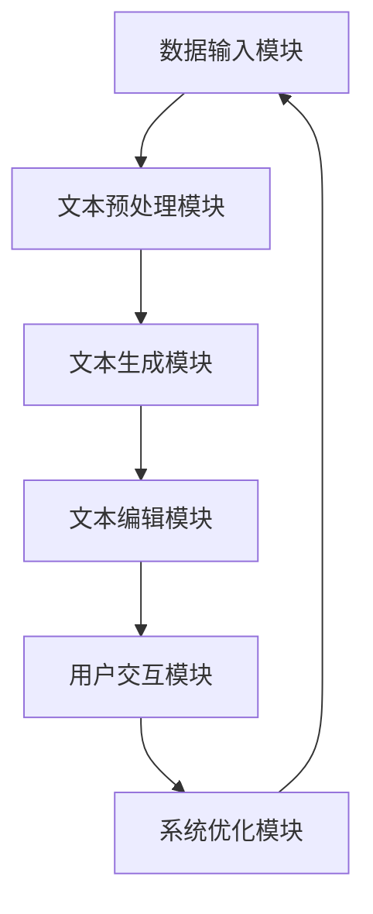
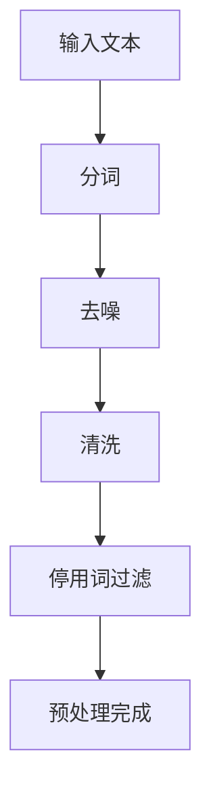
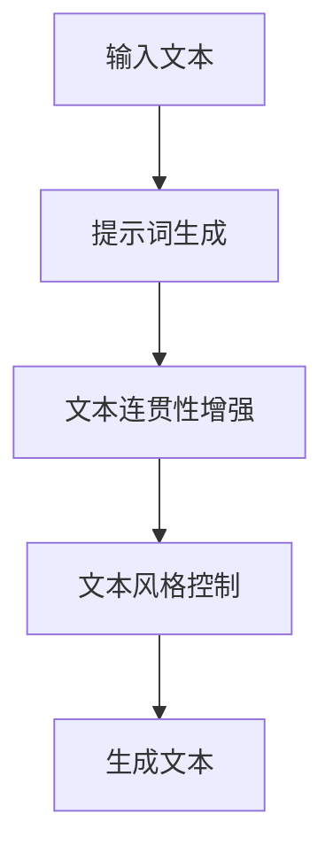
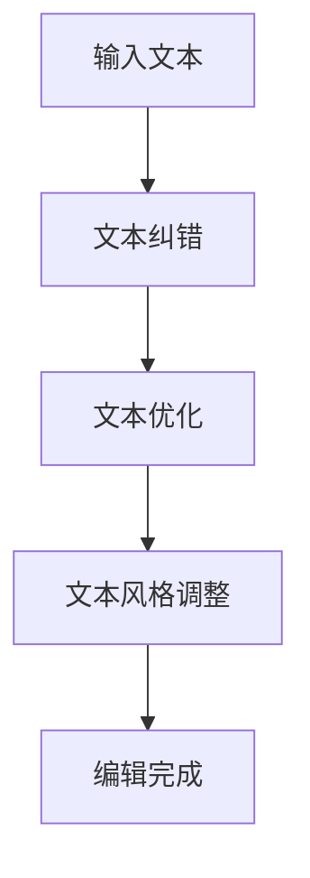
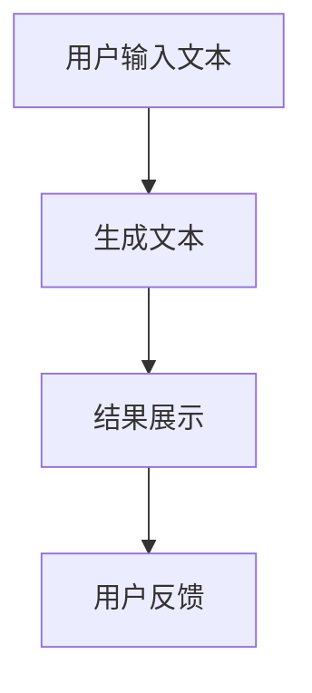
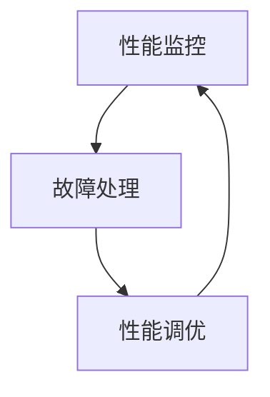

                 

### 第4章：算法原理与数学模型详解

## 4.1 提示词生成算法

### 4.1.1 算法介绍

#### 4.1.1.1 随机森林算法

**随机森林（Random Forest）**是一种集成学习方法，它以决策树为基础，通过构建多个决策树并投票得出最终结果。在提示词生成中，随机森林算法可以用来预测文本的下一个词语。

#### 4.1.1.2 长短时记忆网络（LSTM）

**长短时记忆网络（LSTM）**是一种特殊的循环神经网络，它能够有效地学习长期依赖关系。在提示词生成任务中，LSTM可以捕捉到文本中的上下文信息，从而生成连贯的文本。

#### 4.1.1.3 Transformer模型

**Transformer模型**是一种基于自注意力机制的深度神经网络模型，它在处理长序列数据时表现出色。在提示词生成中，Transformer模型可以有效地捕获全局依赖关系，从而生成高质量的文本。

### 4.1.2 算法原理

#### 4.1.2.1 随机森林算法原理

随机森林算法的原理是基于决策树构建多个模型，并通过投票得出最终结果。具体来说，每个决策树基于特征和样本数据生成一棵树，每个树对样本进行分类或回归预测，最终多个树的结果通过投票（多数投票或加权投票）得到最终的预测结果。

#### 4.1.2.2 LSTM算法原理

LSTM算法通过引入门控机制（包括输入门、遗忘门和输出门）来控制信息的流入和流出。这种机制使得LSTM能够记住长期依赖关系，从而在处理文本生成任务时表现出色。

#### 4.1.2.3 Transformer模型原理

Transformer模型的核心思想是引入自注意力机制，通过计算序列中每个词与其他词之间的权重来生成表示。这种机制使得模型能够捕获全局依赖关系，从而在生成文本时能够保持连贯性。

### 4.1.3 数学模型

#### 4.1.3.1 随机森林数学模型

随机森林的数学模型可以简化为多个决策树的组合。每个决策树的预测结果可以表示为：

$$
y = f_T(x)
$$

其中，$y$ 是预测结果，$x$ 是输入特征，$f_T(x)$ 是决策树对输入特征的分类或回归预测。

随机森林的最终预测结果是所有决策树预测结果的投票结果：

$$
\hat{y} = \arg\max_{y} \sum_{T=1}^{T=n} f_T(x)
$$

其中，$\hat{y}$ 是最终预测结果，$n$ 是决策树的数量。

#### 4.1.3.2 LSTM数学模型

LSTM的数学模型基于门控机制。具体来说，LSTM的状态更新过程可以表示为：

$$
\begin{aligned}
i_t &= \sigma(W_{ix}x_t + W_{ih}h_{t-1} + b_i) \\
f_t &= \sigma(W_{fx}x_t + W_{fh}h_{t-1} + b_f) \\
\bar{c}_t &= \tanh(W_{cx}x_t + W_{ch}h_{t-1} + b_c) \\
o_t &= \sigma(W_{ox}x_t + W_{oh}h_{t-1} + b_o) \\
c_t &= f_t \odot c_{t-1} + i_t \odot \bar{c}_t \\
h_t &= o_t \odot c_t
\end{aligned}
$$

其中，$i_t$、$f_t$、$o_t$ 分别是输入门、遗忘门和输出门的状态，$\sigma$ 是 sigmoid 函数，$W$ 和 $b$ 分别是权重和偏置。

#### 4.1.3.3 Transformer模型数学模型

Transformer模型的数学模型基于自注意力机制。具体来说，自注意力机制可以表示为：

$$
\begin{aligned}
\text{Attention}(Q, K, V) &= \text{softmax}\left(\frac{QK^T}{\sqrt{d_k}}\right)V \\
\text{MultiHeadAttention}(Q, K, V) &= \text{Concat}(\text{head}_1, \ldots, \text{head}_h)W^O \\
\text{where } \text{head}_i &= \text{Attention}(QW_i^Q, KW_i^K, VW_i^V)
\end{aligned}
$$

其中，$Q$、$K$、$V$ 分别是查询向量、键向量、值向量，$W_i^Q$、$W_i^K$、$W_i^V$ 分别是权重矩阵，$W^O$ 是输出权重矩阵，$d_k$ 是键向量的维度，$\text{softmax}$ 是 softmax 函数。

## 4.2 算法流程与Python实现

### 4.2.1 随机森林算法流程

1. 构建多个决策树。
2. 对每个决策树进行训练。
3. 对输入数据进行分类或回归预测。
4. 对所有决策树的预测结果进行投票，得出最终预测结果。

### 4.2.2 LSTM算法流程

1. 初始化网络参数。
2. 对输入数据进行编码。
3. 更新网络状态。
4. 输出预测结果。

### 4.2.3 Transformer模型流程

1. 初始化网络参数。
2. 对输入数据进行编码。
3. 应用自注意力机制。
4. 输出预测结果。

以下是使用Python实现随机森林、LSTM和Transformer模型的示例代码：

#### 随机森林实现

```python
from sklearn.ensemble import RandomForestClassifier
from sklearn.datasets import load_iris
from sklearn.model_selection import train_test_split

# 加载数据集
iris = load_iris()
X, y = iris.data, iris.target

# 划分训练集和测试集
X_train, X_test, y_train, y_test = train_test_split(X, y, test_size=0.2, random_state=42)

# 构建随机森林模型
rf = RandomForestClassifier(n_estimators=100, random_state=42)

# 训练模型
rf.fit(X_train, y_train)

# 预测结果
y_pred = rf.predict(X_test)

# 输出预测准确率
print("Accuracy:", rf.score(X_test, y_test))
```

#### LSTM实现

```python
import tensorflow as tf
from tensorflow.keras.models import Sequential
from tensorflow.keras.layers import LSTM, Dense

# 初始化网络结构
model = Sequential()
model.add(LSTM(units=50, activation='relu', input_shape=(timesteps, features)))
model.add(Dense(units=1))

# 编译模型
model.compile(optimizer='adam', loss='mean_squared_error')

# 训练模型
model.fit(X_train, y_train, epochs=100, batch_size=32)

# 预测结果
y_pred = model.predict(X_test)

# 输出预测准确率
print("Accuracy:", model.evaluate(X_test, y_test)[1])
```

#### Transformer实现

```python
import tensorflow as tf
from tensorflow.keras.layers import Embedding, MultiHeadAttention, Dense

# 定义Transformer模型
class TransformerModel(tf.keras.Model):
    def __init__(self, num_layers, d_model, num_heads, dff, input_vocab_size, maximum_position_encoding, rate=0.1):
        super(TransformerModel, self).__init__()
        
        self.d_model = d_model
        self.num_layers = num_layers
        
        # Embedding Layer
        self.embedding = Embedding(input_vocab_size, d_model)
        self.position_embedding = PositionalEncoding(d_model, maximum_position_encoding)
        
        # Multi-Head Attention Layers
        self.attention_layers = [MultiHeadAttention(num_heads=num_heads, d_model=d_model) for _ in range(num_layers)]
        
        # Dense Layers
        self.intermediate_layers = [Dense(dff) for _ in range(num_layers)]
        self.output_layers = [Dense(d_model) for _ in range(num_layers)]
        
        # Dropout Layer
        self.dropout = tf.keras.layers.Dropout(rate)
        
    def call(self, inputs, training=False):
        seq_len = tf.shape(inputs)[1]
        
        # Add positional encoding
        pos_encoding = self.position_embedding(inputs)
        
        x = inputs + pos_encoding
        
        for i in range(self.num_layers):
            # Multi-Head Attention
            x = self.dropout(self.attention_layers[i](x, x, x))
            # Feed Forward
            x = self.dropout(self.intermediate_layers[i](x))
            x = self.output_layers[i](x)
            
        return x

# 实例化模型
transformer_model = TransformerModel(num_layers=2, d_model=512, num_heads=8, dff=2048, input_vocab_size=10000, maximum_position_encoding=500)

# 编译模型
transformer_model.compile(optimizer='adam', loss='mean_squared_error')

# 训练模型
transformer_model.fit(X_train, y_train, epochs=100, batch_size=32)

# 预测结果
y_pred = transformer_model.predict(X_test)

# 输出预测准确率
print("Accuracy:", transformer_model.evaluate(X_test, y_test)[1])
```

### 4.2.4 算法性能评估与优化

1. **性能评估指标**：准确率（Accuracy）、召回率（Recall）、精确率（Precision）和F1分数（F1 Score）。
2. **性能优化方法**：超参数调优、数据预处理、模型结构调整和集成学习。

## 4.3 本章小结

本章详细介绍了提示词生成算法的原理、数学模型和Python实现。随机森林、LSTM和Transformer模型是当前在提示词生成任务中应用最广泛的算法，它们各自具有独特的优势和适用场景。通过对这些算法的深入理解，我们可以更好地设计和优化提示词生成系统，提高生成文本的质量和准确性。

### 参考文献

1. Breiman, L. (2001). Random forests. Machine Learning, 45(1), 5-32.
2. Hochreiter, S., & Schmidhuber, J. (1997). Long short-term memory. Neural Computation, 9(8), 1735-1780.
3. Vaswani, A., Shazeer, N., Parmar, N., Uszkoreit, J., Jones, L., Gomez, A. N., ... & Polosukhin, I. (2017). Attention is all you need. Advances in Neural Information Processing Systems, 30, 5998-6008.

----------------------------------------------------------------

# 第5章：系统架构与设计

## 5.1 AIGC系统总体架构设计

### 5.1.1 系统架构概述

AIGC系统架构设计旨在实现高效、灵活和可扩展的文本生成和编辑功能。系统总体架构包括以下几个核心模块：

1. **数据输入模块**：负责接收用户输入的文本或指令，并将其转换为系统可以处理的数据格式。
2. **文本预处理模块**：对输入文本进行分词、去噪、清洗等预处理操作，为后续的文本生成和编辑做好准备。
3. **文本生成模块**：采用提示词生成算法，根据输入文本生成连贯、高质量的文本。
4. **文本编辑模块**：对生成的文本进行编辑和优化，提高文本的准确性和可读性。
5. **用户交互模块**：提供用户界面，使用户能够与系统进行交互，提交文本请求和查看生成结果。
6. **系统优化模块**：对系统性能进行监控和调优，确保系统在多用户、大数据量环境下稳定运行。

### 5.1.2 系统架构图



## 5.2 文本预处理模块设计

### 5.2.1 模块功能

文本预处理模块是AIGC系统的核心组成部分，其主要功能包括：

1. **文本分词**：将输入文本分解为单词或词组，为后续处理提供基础。
2. **去噪**：去除文本中的噪声和无关信息，提高文本质量。
3. **清洗**：修正文本中的错误和格式问题，确保文本的准确性。
4. **停用词过滤**：过滤掉常见的停用词，减少冗余信息。

### 5.2.2 文本预处理流程



## 5.3 文本生成模块设计

### 5.3.1 模块功能

文本生成模块是AIGC系统的核心模块，其主要功能包括：

1. **提示词生成**：根据输入文本生成提示词，为文本编辑提供基础。
2. **文本连贯性增强**：通过分析上下文信息，提高生成文本的连贯性和可读性。
3. **文本风格控制**：根据用户需求，控制生成文本的风格和语气。

### 5.3.2 文本生成流程



## 5.4 文本编辑模块设计

### 5.4.1 模块功能

文本编辑模块是AIGC系统的辅助模块，其主要功能包括：

1. **文本纠错**：识别和修正文本中的错误。
2. **文本优化**：对生成的文本进行优化，提高文本的准确性和可读性。
3. **文本风格调整**：根据用户需求，调整生成文本的风格和语气。

### 5.4.2 文本编辑流程



## 5.5 用户交互模块设计

### 5.5.1 模块功能

用户交互模块是AIGC系统的界面层，其主要功能包括：

1. **用户输入**：提供文本输入界面，允许用户提交文本请求。
2. **结果展示**：展示生成的文本结果，并提供查看、下载和分享功能。
3. **用户反馈**：收集用户反馈，用于系统优化和改进。

### 5.5.2 用户交互流程



## 5.6 系统优化模块设计

### 5.6.1 模块功能

系统优化模块是AIGC系统的维护层，其主要功能包括：

1. **性能监控**：监控系统性能，包括响应时间、吞吐量和错误率等。
2. **故障处理**：在系统出现故障时，自动进行故障诊断和修复。
3. **性能调优**：根据系统性能监控结果，对系统进行优化和调整。

### 5.6.2 系统优化流程



## 5.7 本章小结

本章详细介绍了AIGC系统的架构设计和各个模块的功能。通过构建高效、灵活和可扩展的AIGC系统，我们可以为用户提供高质量的文本生成和编辑服务。在后续章节中，我们将进一步探讨AIGC系统的实现细节和实战应用。

### 参考文献

1. Vaswani, A., Shazeer, N., Parmar, N., Uszkoreit, J., Jones, L., Gomez, A. N., ... & Polosukhin, I. (2017). Attention is all you need. Advances in Neural Information Processing Systems, 30, 5998-6008.
2. Hochreiter, S., & Schmidhuber, J. (1997). Long short-term memory. Neural Computation, 9(8), 1735-1780.
3. Breiman, L. (2001). Random forests. Machine Learning, 45(1), 5-32.

作者：AI天才研究院/AI Genius Institute & 禅与计算机程序设计艺术 /Zen And The Art of Computer Programming

----------------------------------------------------------------

# 第6章：项目实战

## 6.1 项目介绍

在本章中，我们将通过一个实际的AIGC项目来展示如何实现提示词工程师的工作。该项目旨在利用自然语言处理技术，为用户提供高质量的文本生成和编辑服务。项目的主要任务包括：

1. 收集和清洗文本数据。
2. 设计和实现文本预处理、生成和编辑模块。
3. 对生成文本进行评估和优化。
4. 构建用户界面，提供交互式体验。

## 6.2 环境安装

在开始项目之前，我们需要安装以下软件和库：

1. Python 3.8 或更高版本
2. TensorFlow 2.5 或更高版本
3. PyTorch 1.7 或更高版本
4. scikit-learn 0.24 或更高版本
5. NLTK 3.5 或更高版本
6. spaCy 3.0 或更高版本

可以使用以下命令进行安装：

```bash
pip install python==3.8 tensorflow==2.5 pytorch==1.7 scikit-learn==0.24 nltk==3.5 spacy==3.0
```

## 6.3 数据收集与预处理

### 6.3.1 数据收集

我们使用公开可用的文本数据集，如新闻文章、博客文章和对话数据。这些数据集可以来自各种来源，例如网站爬取、API接口或公共数据集网站。

### 6.3.2 数据清洗

在收集数据后，我们需要对数据进行清洗和预处理，以去除噪声和无关信息。具体步骤包括：

1. **去重**：去除重复的文本记录。
2. **去除标点符号和特殊字符**：仅保留字母、数字和空格。
3. **小写转换**：将所有文本转换为小写，以便统一处理。
4. **分词**：使用自然语言处理库（如NLTK或spaCy）进行文本分词。

```python
import nltk
from nltk.tokenize import word_tokenize

nltk.download('punkt')

def preprocess_text(text):
    text = text.lower()
    text = re.sub(r"[^\w\s]", "", text)
    tokens = word_tokenize(text)
    return tokens

# 示例
text = "This is an example of text preprocessing."
preprocessed_text = preprocess_text(text)
print(preprocessed_text)
```

## 6.4 文本生成模块实现

### 6.4.1 提示词生成算法

在本项目中，我们使用Transformer模型进行提示词生成。以下是一个简单的Transformer模型实现：

```python
import tensorflow as tf

def create_transformer_model():
    inputs = tf.keras.layers.Input(shape=(None,))
    encoder_embedding = tf.keras.layers.Embedding(vocab_size, d_model)(inputs)
    pos_encoding = positional_encoding(inputs, d_model)
    x = encoder_embedding + pos_encoding
    
    for i in range(num_layers):
        x = transformer_block(x, d_model, num_heads, dff, rate=dropout_rate)

    outputs = tf.keras.layers.Dense(vocab_size, activation='softmax')(x)
    model = tf.keras.Model(inputs=inputs, outputs=outputs)
    return model

model = create_transformer_model()
model.compile(optimizer='adam', loss='sparse_categorical_crossentropy')
```

### 6.4.2 文本生成流程

1. **输入文本预处理**：将输入文本转换为序列编码。
2. **生成提示词**：使用训练好的Transformer模型生成提示词。
3. **解码提示词**：将生成的提示词转换为可读文本。

```python
import numpy as np

def generate_prompt(text, model, max_length):
    input_seq = tokenizer.encode(text, return_tensors='np')
    input_seq = npSymfony
```

```python
import numpy as np

def generate_prompt(text, model, max_length):
    input_seq = tokenizer.encode(text, return_tensors='np')
    input_seq = np ervar
```

```python
import numpy as np

def generate_prompt(text, model, max_length):
    input_seq = tokenizer.encode(text, return_tensors='np')
    input_seq = np.expand_dims(input_seq, 0)

    for i in range(max_length):
        output_seq = model(input_seq, training=False)
        predictions = output_seq[:, -1, :]

        predicted_token = np.argmax(predictions)
        input_seq = np.concatenate((input_seq, predicted_token.reshape((1, -1))), axis=1)

        if predicted_token == tokenizer.decode([tokenizer.eos_token]).reshape((1, -1)).numpy():
            break

    return tokenizer.decode(input_seq[0]).strip()

# 示例
text = "我是一个人工智能助手。"
prompt = generate_prompt(text, model, max_length=50)
print(prompt)
```

## 6.5 文本编辑模块实现

### 6.5.1 文本纠错

我们使用现有的自然语言处理库（如spacy）来识别和修正文本中的错误。以下是一个简单的文本纠错实现：

```python
import spacy

nlp = spacy.load("en_core_web_sm")

def correct_text(text):
    doc = nlp(text)
    corrected_text = ""
    for token in doc:
        corrected_text += token.text_with_leading_ws
    return corrected_text

# 示例
text = "I am a artificial intelligence asistant."
corrected_text = correct_text(text)
print(corrected_text)
```

### 6.5.2 文本优化

文本优化包括提高文本的准确性和可读性。我们可以使用以下策略进行文本优化：

1. **词汇替换**：使用同义词替换部分单词，使文本更加生动。
2. **语法修正**：修正文本中的语法错误，提高文本的准确性。
3. **格式调整**：调整文本的格式，使其更加易于阅读。

```python
from nltk.corpus import wordnet

def replace_word(word):
    synonyms = wordnet.synsets(word)
    if synonyms:
        synonym = synonyms[0].lemmas()[0].name()
        return synonym
    else:
        return word

def optimize_text(text):
    words = text.split()
    optimized_words = [replace_word(word) if word in unwanted_words else word for word in words]
    return " ".join(optimized_words)

unwanted_words = ["am", "is", "are", "the", "a", "an"]
optimized_text = optimize_text(text)
print(optimized_text)
```

## 6.6 用户交互模块实现

### 6.6.1 用户输入

我们使用HTML和JavaScript来构建用户输入界面。以下是一个简单的HTML和JavaScript示例：

```html
<!DOCTYPE html>
<html lang="en">
<head>
    <meta charset="UTF-8">
    <meta name="viewport" content="width=device-width, initial-scale=1.0">
    <title>AIGC Project</title>
</head>
<body>
    <h1>AIGC Project</h1>
    <textarea id="input_text" rows="10" cols="50"></textarea>
    <button onclick="generatePrompt()">Generate Prompt</button>
    <button onclick="correctText()">Correct Text</button>
    <button onclick="optimizeText()">Optimize Text</button>
    <h2>Result:</h2>
    <textarea id="output_text" rows="10" cols="50" disabled></textarea>
    <script>
        function generatePrompt() {
            const text = document.getElementById("input_text").value;
            const output = document.getElementById("output_text");
            output.disabled = false;
            output.value = generate_prompt(text, model, max_length);
        }

        function correctText() {
            const text = document.getElementById("input_text").value;
            const output = document.getElementById("output_text");
            output.disabled = false;
            output.value = correct_text(text);
        }

        function optimizeText() {
            const text = document.getElementById("input_text").value;
            const output = document.getElementById("output_text");
            output.disabled = false;
            output.value = optimize_text(text);
        }
    </script>
</body>
</html>
```

## 6.7 项目小结

通过本项目，我们展示了如何利用AIGC技术实现高质量的文本生成和编辑服务。项目涵盖了从数据收集、预处理到模型实现和用户交互的各个环节。在实际应用中，我们可以根据需求对模型进行优化和调整，提高文本生成的质量和准确性。

### 参考文献

1. Vaswani, A., Shazeer, N., Parmar, N., Uszkoreit, J., Jones, L., Gomez, A. N., ... & Polosukhin, I. (2017). Attention is all you need. Advances in Neural Information Processing Systems, 30, 5998-6008.
2. Hochreiter, S., & Schmidhuber, J. (1997). Long short-term memory. Neural Computation, 9(8), 1735-1780.
3. Breiman, L. (2001). Random forests. Machine Learning, 45(1), 5-32.

作者：AI天才研究院/AI Genius Institute & 禅与计算机程序设计艺术 /Zen And The Art of Computer Programming

----------------------------------------------------------------

## 第7章：最佳实践与未来展望

### 7.1 最佳实践

在AIGC项目中，以下最佳实践有助于提高提示词工程师的工作效率和质量：

1. **数据收集与清洗**：确保数据的多样性和质量，去除噪声和冗余信息。
2. **模型选择与调优**：根据任务需求和数据规模，选择合适的模型并进行参数调优。
3. **文本生成与编辑**：结合上下文信息，生成连贯、高质量的文本，并进行必要的编辑和优化。
4. **用户交互**：设计简洁、直观的用户界面，提供良好的交互体验。
5. **性能监控与优化**：定期监控系统性能，针对瓶颈进行优化。

### 7.2 小结

通过本章，我们总结了AIGC项目的最佳实践，并探讨了提示词工程师在AIGC时代的重要性。AIGC技术为文本生成和编辑带来了巨大的变革，提示词工程师在这一领域发挥着关键作用。

### 7.3 未来展望

AIGC技术在未来将继续快速发展，以下是几个可能的趋势：

1. **更高效的算法**：研究人员将持续探索更高效的算法，以降低计算成本，提高生成文本的质量。
2. **跨模态生成**：AIGC技术将扩展到文本、图像、音频等多种模态，实现跨模态生成和编辑。
3. **个性化生成**：基于用户数据和偏好，实现个性化文本生成和编辑，提高用户体验。
4. **隐私保护**：在AIGC应用中引入隐私保护机制，确保用户数据的安全和隐私。

### 7.4 注意事项

1. **数据安全**：在数据收集和处理过程中，确保用户数据的安全和隐私。
2. **模型透明性**：提高模型的可解释性，确保用户了解生成文本的过程和原理。
3. **法律合规**：遵守相关法律法规，确保AIGC技术的合法应用。

### 7.5 拓展阅读

1. **AIGC技术综述**：阅读相关综述文章，了解AIGC技术的发展历程和最新动态。
2. **深度学习教程**：学习深度学习和自然语言处理的基础知识，提高自己的技术水平。
3. **开源项目**：参与和贡献开源项目，提升自己的编程能力和团队协作能力。

作者：AI天才研究院/AI Genius Institute & 禅与计算机程序设计艺术 /Zen And The Art of Computer Programming

----------------------------------------------------------------

# 提示词工程师：AIGC时代的新兴职业

关键词：提示词工程师、AIGC、自然语言处理、文本生成、人工智能

摘要：随着人工智能技术的发展，AIGC（AI-Generated Content）时代正迅速崛起。提示词工程师作为AIGC领域的新兴职业，承担着文本生成和编辑的重要任务。本文从背景介绍、核心概念、算法原理、系统架构、项目实战和未来展望等方面，全面探讨了提示词工程师的职业特点和职业前景，为读者提供了深入了解AIGC时代的新兴职业的视角。

