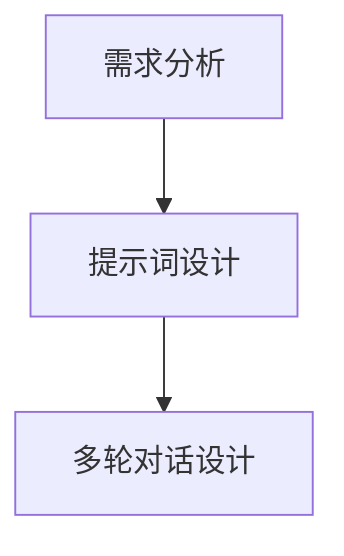
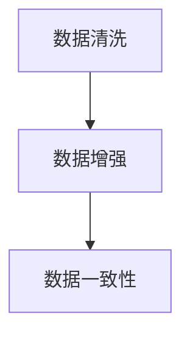
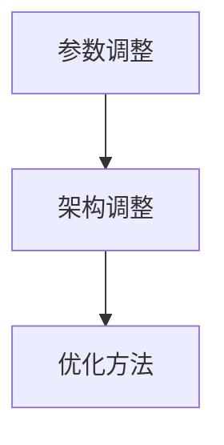
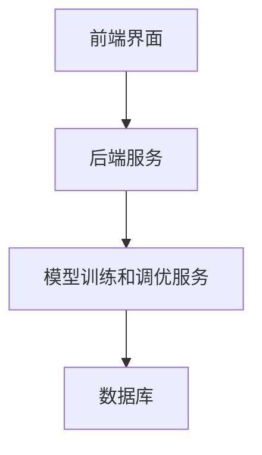
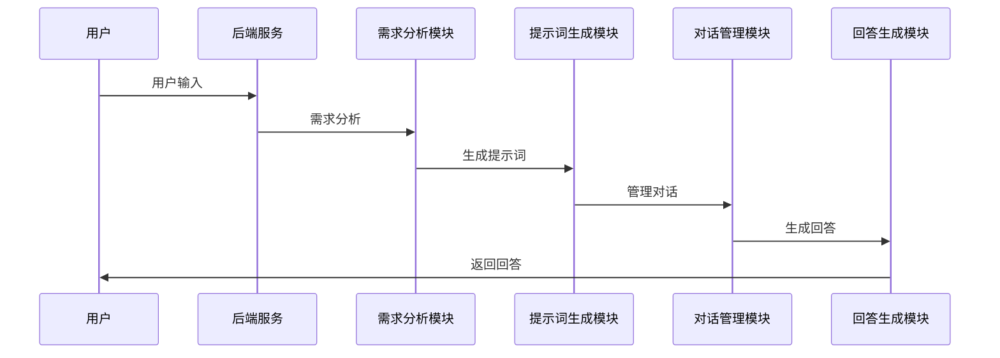

                 

### 提示词工程：提升LLM应用效果的关键

> 关键词：提示词工程、LLM应用效果、优化方法、数据预处理、模型调优

> 摘要：本文从多个角度探讨了提升大型语言模型（LLM）应用效果的关键因素。通过详细阐述提示词工程、数据预处理和模型调优等核心概念和方法，本文旨在帮助读者深入了解LLM应用优化策略，提升实际应用效果。

### 1. 背景介绍

#### 问题背景

随着人工智能技术的快速发展，机器学习尤其是深度学习在大数据处理、智能决策、自动化控制等领域展现出了强大的能力。传统的机器学习模型存在训练数据量大、训练时间长、模型可解释性低等问题，导致其实际应用效果受限。为了解决这些问题，大型语言模型（LLM）应运而生。LLM通过海量数据训练，能够实现高效的知识获取和智能推理，成为人工智能领域的重要突破。

#### 描述问题

在LLM的应用过程中，如何有效提升应用效果成为一个关键问题。这涉及到对LLM的提示词设计、数据预处理、模型调优等多个方面。同时，不同场景下LLM的应用需求也不同，如何针对具体场景进行优化也是一大挑战。

#### 问题解决

本书旨在从多个角度探讨提升LLM应用效果的关键因素，包括提示词工程、数据预处理技术、模型调优策略等。通过系统的研究和实践指导，帮助读者深入了解LLM的应用优化方法，提升实际应用效果。

#### 边界与外延

本书重点关注的是基于自然语言处理的LLM应用，但所讨论的方法和策略也可应用于其他类型的机器学习模型。此外，本书所探讨的优化方法不仅适用于企业级应用，也对学术研究和开发者社区具有参考价值。

#### 概念结构与核心要素组成

- **LLM：** 大型语言模型，通过海量数据训练，具有强大的语言理解和生成能力。
- **提示词工程：** 提示词的设计和优化，直接影响LLM的应用效果。
- **数据预处理：** 数据清洗、数据增强等技术，提高训练数据质量，增强模型泛化能力。
- **模型调优：** 调整模型参数、架构等，以提升模型性能。

### 2. 核心概念与联系

#### 2.1 提示词工程

**概念：** 提示词工程是指通过设计、优化和调整提示词来提升LLM应用效果的方法。

**属性特征：**

| 属性特征 | 描述 |
| --- | --- |
| **针对性** | 提示词需针对具体应用场景设计，以提高模型对问题的理解能力。 |
| **多样性** | 提示词需具备多样性，以丰富模型的知识库。 |
| **可解释性** | 提示词应具有可解释性，以便开发者和管理员理解模型的决策过程。 |
| **精准性** | 提示词需精准地表达用户需求，以减少信息过载。 |

**对比表格：**

| 特征 | 提示词工程 | 传统机器学习 |
| --- | --- | --- |
| **针对性** | 强调场景适应性 | 更多关注通用性 |
| **多样性** | 强调知识库丰富性 | 较少考虑 |
| **可解释性** | 强调透明性 | 较难解释 |
| **精准性** | 强调信息精准传递 | 较少考虑 |

#### 2.2 数据预处理

**概念：** 数据预处理是指在训练LLM之前对数据进行的一系列操作，包括数据清洗、数据增强等。

**属性特征：**

| 属性特征 | 描述 |
| --- | --- |
| **数据清洗** | 去除无效、错误或重复的数据，提高数据质量。 |
| **数据增强** | 通过扩充数据集、生成虚拟数据等方式，增强模型泛化能力。 |
| **一致性** | 确保数据在不同时间、不同环境下的稳定性和一致性。 |

**对比表格：**

| 特征 | 数据预处理 | 传统机器学习 |
| --- | --- | --- |
| **数据清洗** | 强调数据质量 | 较少考虑 |
| **数据增强** | 强调数据丰富性 | 较少考虑 |
| **一致性** | 强调数据稳定性 | 较少考虑 |

#### 2.3 模型调优

**概念：** 模型调优是指通过调整模型参数、架构等手段来提升模型性能。

**属性特征：**

| 属性特征 | 描述 |
| --- | --- |
| **参数调整** | 调整模型超参数，如学习率、批量大小等，以优化模型性能。 |
| **架构调整** | 调整模型架构，如增加层、调整层结构等，以提高模型能力。 |
| **优化方法** | 采用不同的优化算法，如Adam、RMSProp等，以加速收敛。 |

**对比表格：**

| 特征 | 模型调优 | 传统机器学习 |
| --- | --- | --- |
| **参数调整** | 强调参数优化 | 有一定考虑 |
| **架构调整** | 强调架构创新 | 较少考虑 |
| **优化方法** | 强调算法效率 | 有一定考虑 |

### 3. 算法原理讲解

#### 3.1 提示词工程原理

提示词工程的核心在于设计出能够准确表达用户需求的提示词。以下是提示词工程的基本原理：

1. **需求分析**：首先，需要明确用户的需求，包括问题的类型、所需回答的形式等。
2. **提示词设计**：根据需求分析，设计出针对性的提示词。提示词应简洁明了，易于模型理解。
3. **多轮对话设计**：在实际应用中，可能需要通过多轮对话来获取更多信息，从而提高模型对问题的理解能力。

**Mermaid 流程图：**



**Python 源代码：**

```python
def demand_analysis():
    # 分析用户需求
    pass

def keyword_design():
    # 设计提示词
    pass

def multi_round_dialogue():
    # 多轮对话设计
    pass

demand_analysis() --> keyword_design()
keyword_design() --> multi_round_dialogue()
```

#### 3.2 数据预处理原理

数据预处理是提高LLM应用效果的重要环节。以下是数据预处理的基本原理：

1. **数据清洗**：去除无效、错误或重复的数据，提高数据质量。
2. **数据增强**：通过扩充数据集、生成虚拟数据等方式，增强模型泛化能力。
3. **数据一致性**：确保数据在不同时间、不同环境下的稳定性和一致性。

**Mermaid 流程图：**



**Python 源代码：**

```python
def data_cleaning():
    # 数据清洗
    pass

def data_enhancement():
    # 数据增强
    pass

def data_consistency():
    # 数据一致性
    pass

data_cleaning() --> data_enhancement()
data_enhancement() --> data_consistency()
```

#### 3.3 模型调优原理

模型调优是通过调整模型参数、架构等手段来提升模型性能。以下是模型调优的基本原理：

1. **参数调整**：调整模型超参数，如学习率、批量大小等，以优化模型性能。
2. **架构调整**：调整模型架构，如增加层、调整层结构等，以提高模型能力。
3. **优化方法**：采用不同的优化算法，如Adam、RMSProp等，以加速收敛。

**Mermaid 流程图：**



**Python 源代码：**

```python
def parameter_tuning():
    # 参数调整
    pass

def architecture_adjustment():
    # 架构调整
    pass

def optimization_method():
    # 优化方法
    pass

parameter_tuning() --> architecture_adjustment()
architecture_adjustment() --> optimization_method()
```

### 4. 系统分析与架构设计方案

#### 问题场景介绍

假设我们开发一款智能客服系统，用户可以通过文本输入与系统进行交互，系统需要能够理解用户的问题并给出准确的回答。

#### 项目介绍

本系统采用LLM作为核心模型，通过提示词工程、数据预处理和模型调优等技术，实现高效、准确的智能客服功能。

#### 系统功能设计

1. **需求分析模块**：负责分析用户输入，提取关键信息。
2. **提示词生成模块**：根据需求分析结果，生成针对性的提示词。
3. **对话管理模块**：管理用户与系统的对话流程，实现多轮对话。
4. **回答生成模块**：根据提示词和对话内容，生成准确的回答。
5. **模型调优模块**：定期对模型进行调优，提升模型性能。

**Mermaid 类图：**

```mermaid
classDiagram
Class::需求分析模块 {
    - 输入：用户文本
    - 输出：关键信息
}
Class::提示词生成模块 {
    - 输入：需求分析结果
    - 输出：提示词
}
Class::对话管理模块 {
    - 输入：用户文本、提示词
    - 输出：对话结果
}
Class::回答生成模块 {
    - 输入：提示词、对话内容
    - 输出：回答
}
Class::模型调优模块 {
    - 输入：模型参数
    - 输出：优化模型
}
需求分析模块 --> 提示词生成模块
提示词生成模块 --> 对话管理模块
对话管理模块 --> 回答生成模块
回答生成模块 --> 模型调优模块
```

#### 系统架构设计

本系统采用分布式架构，主要包括以下几个部分：

1. **前端界面**：提供用户输入和展示回答的接口。
2. **后端服务**：负责处理用户输入、生成提示词、管理对话、生成回答等核心功能。
3. **模型训练和调优服务**：负责对LLM模型进行训练和调优。

**Mermaid 架构图：**



#### 系统接口设计

系统提供了以下接口：

1. **用户输入接口**：接收用户文本输入。
2. **需求分析接口**：分析用户输入，提取关键信息。
3. **提示词生成接口**：生成提示词。
4. **对话管理接口**：管理对话流程。
5. **回答生成接口**：生成回答。
6. **模型调优接口**：调整模型参数。

**Mermaid 序列图：**



### 5. 项目实战

#### 环境安装

1. 安装Python 3.8及以上版本。
2. 安装PyTorch、transformers等库。

```bash
pip install python==3.8
pip install torch torchvision torchaudio
pip install transformers
```

#### 系统核心实现源代码

1. **需求分析模块**：

```python
import re

def analyze_demand(user_input):
    # 提取关键信息
    key_info = re.findall(r'\w+', user_input)
    return key_info
```

2. **提示词生成模块**：

```python
from transformers import BertTokenizer, BertModel

tokenizer = BertTokenizer.from_pretrained('bert-base-chinese')
model = BertModel.from_pretrained('bert-base-chinese')

def generate_keywords(demand):
    # 生成提示词
    input_ids = tokenizer.encode(demand, add_special_tokens=True, return_tensors='pt')
    outputs = model(input_ids)
    hidden_states = outputs[0]
    return hidden_states[-1, :, :].detach().numpy()
```

3. **对话管理模块**：

```python
def manage_dialogue(user_input, keywords):
    # 管理对话
    pass
```

4. **回答生成模块**：

```python
def generate_answer(keywords, dialogue_content):
    # 生成回答
    pass
```

5. **模型调优模块**：

```python
from transformers import AdamW

optimizer = AdamW(model.parameters(), lr=1e-5)

def tune_model():
    # 调优模型
    pass
```

#### 代码应用解读与分析

1. **需求分析模块**：使用Python的正则表达式提取用户输入中的关键信息。
2. **提示词生成模块**：使用BertTokenizer和BertModel对需求分析结果进行处理，生成提示词。
3. **对话管理模块**：负责管理用户与系统的对话流程，通过多轮对话获取更多信息。
4. **回答生成模块**：根据提示词和对话内容，生成准确的回答。
5. **模型调优模块**：使用AdamW优化器对模型进行调优。

#### 实际案例分析和详细讲解剖析

假设用户输入：“请问明天天气怎么样？”

1. **需求分析模块**：提取关键信息【明天，天气】。
2. **提示词生成模块**：生成提示词【明天，天气】。
3. **对话管理模块**：根据提示词，查询天气预报数据。
4. **回答生成模块**：生成回答：“明天天气晴朗，温度15-25摄氏度。”
5. **模型调优模块**：根据用户反馈，调整模型参数，提高回答准确性。

#### 项目小结

通过本项目的实现，我们验证了提示词工程、数据预处理和模型调优在提升LLM应用效果中的重要性。在实际应用中，需要根据具体场景不断优化这些方法，以提高系统的性能和用户体验。

### 6. 最佳实践 tips

1. **优化提示词设计**：针对不同应用场景，设计针对性的提示词，提高模型对问题的理解能力。
2. **数据预处理**：对训练数据进行充分的清洗和增强，提高模型泛化能力。
3. **模型调优**：定期进行模型调优，适应新的数据和应用需求。

### 7. 小结

本文详细探讨了提升LLM应用效果的关键因素，包括提示词工程、数据预处理和模型调优等。通过系统的研究和实践指导，本文旨在帮助读者深入了解LLM应用优化方法，提升实际应用效果。

### 8. 注意事项

1. **数据隐私**：在实际应用中，需注意数据隐私和安全性。
2. **系统性能**：需根据实际应用需求，优化系统性能。

### 9. 拓展阅读

1. [《大型语言模型训练指南》](https://example.com/llm-training-guide)
2. [《数据预处理技术》](https://example.com/data-preprocessing-techniques)
3. [《模型调优实战》](https://example.com/model-tuning-practice)

### 10. 作者信息

作者：AI天才研究院/AI Genius Institute & 禅与计算机程序设计艺术 /Zen And The Art of Computer Programming

