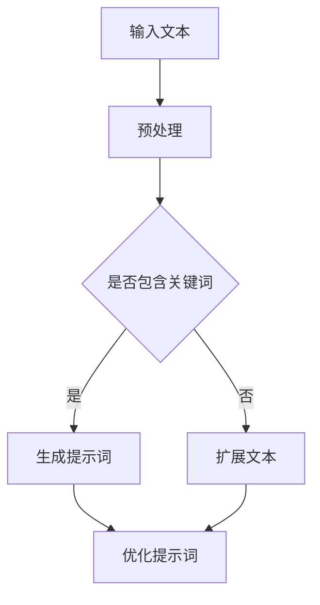
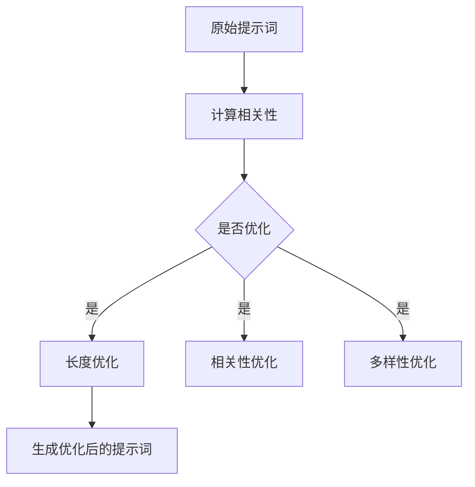
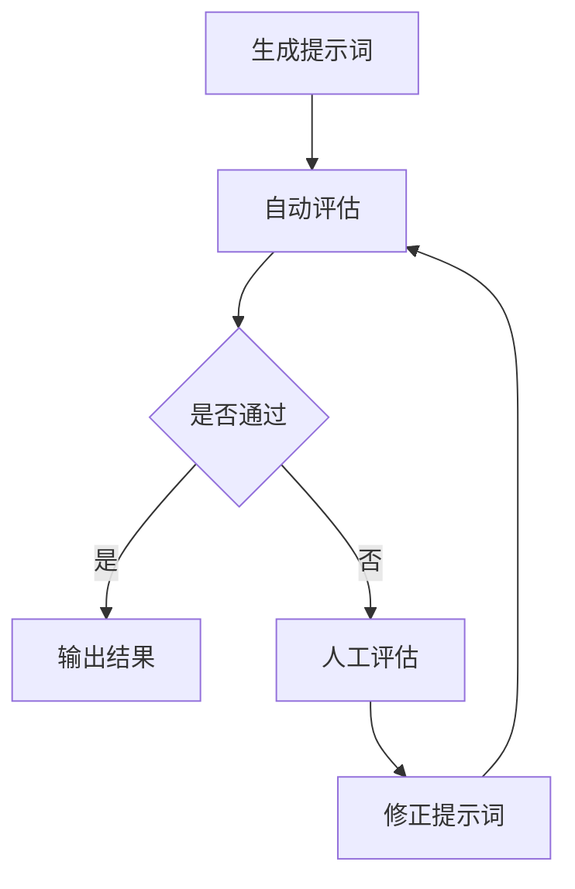
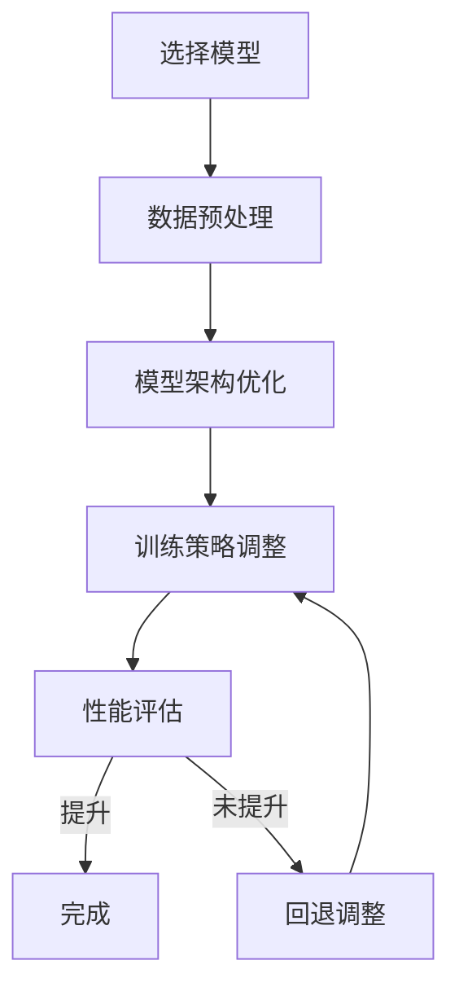

                 


### 文章标题：提示词工程：提升LLM性能的核心技术

#### 关键词：提示词工程，LLM性能，核心技术，优化策略，算法流程

#### 摘要：
本文旨在探讨提示词工程在提升大型语言模型（LLM）性能方面的重要性。通过详细分析提示词的定义、生成与优化技术，本文揭示了如何利用提示词工程来增强LLM的应用效果。文章还将提供一系列实践策略，帮助读者在实际项目中应用这些技术，并总结当前领域的发展趋势和未来展望。

### 第1章 引言

#### 1.1 问题背景
随着深度学习技术的发展，大型语言模型（LLM）在自然语言处理（NLP）领域取得了显著成果。然而，LLM的性能受限于训练数据和模型架构。为提升LLM的性能，研究者们开始关注提示词工程这一关键技术。

#### 1.2 问题描述
LLM的性能瓶颈主要体现在对复杂语义理解的不足和生成文本的多样性受限。如何通过提示词工程来改善这些问题，成为了当前研究的焦点。

#### 1.3 问题解决
提示词工程通过设计有效的提示词，引导LLM进行更精确的语义理解和生成更丰富的文本。本文将详细介绍提示词工程的原理和实践方法。

#### 1.4 边界与外延
本文主要关注提示词工程在LLM中的应用，不包括其他自然语言处理技术。同时，本文将探讨提示词工程在不同领域的应用可能性，如问答系统、机器翻译等。

### 第2章 核心概念与联系

#### 2.1 提示词的定义
提示词是用于引导LLM生成特定类型文本的关键信息。它们可以是关键词、短语或句子，能够提供上下文和目标输出。

#### 2.2 提示词的属性特征对比
| 特征 | 描述 | 重要性 |
| ---- | ---- | ---- |
| 长度 | 提示词的长度影响上下文的丰富度和语义准确性。 | 较长的提示词通常能提供更丰富的上下文，但可能导致模型计算复杂度增加。 |
| 相关性 | 提示词与目标文本的相关性直接影响生成文本的准确性。 | 高相关性的提示词有助于提高生成文本的质量。 |
| 多样性 | 提示词的多样性能够引导模型生成多样化的文本。 | 多样性的提示词有助于避免生成模式化的文本。 |

#### 2.3 提示词与LLM的关系
ER实体关系图如下：

```mermaid
erDiagram
  A[提示词] ||--|{ B[语言模型]}
  B ||--|{ C[训练数据]}
```

提示词作为输入，直接影响LLM的生成文本，而LLM的性能又受到训练数据的影响。

### 第3章 提示词生成技术

#### 3.1 基于规则的方法
基于规则的方法通过预设的规则生成提示词。这种方法简单易行，但灵活性较低。

#### 3.2 基于机器学习的方法
基于机器学习的方法利用已标注的数据训练模型生成提示词。这种方法具有更高的灵活性和准确性。

#### 3.3 基于深度学习的方法
基于深度学习的方法利用神经网络结构生成提示词。这种方法具有更好的自适应性和生成能力。

#### 3.4 提示词生成算法流程图



### 第4章 提示词优化技术

#### 4.1 提示词长度优化
通过调整提示词的长度，平衡上下文的丰富度和计算复杂度。

#### 4.2 提示词相关性优化
通过提高提示词与目标文本的相关性，提升生成文本的准确性。

#### 4.3 提示词多样性优化
通过增加提示词的多样性，避免生成模式化的文本。

#### 4.4 提示词优化算法流程图



### 第5章 提示词评估方法

#### 5.1 自动评估方法
使用自动评估方法，如BLEU分数、ROUGE分数等，来评估生成文本的质量。

#### 5.2 人工评估方法
通过人工评估方法，如人工打分、用户反馈等，来评估生成文本的质量。

#### 5.3 综合评估方法
结合自动评估方法和人工评估方法，综合评估生成文本的质量。

#### 5.4 提示词评估流程图



### 第6章 提升LLM性能的实践策略

#### 6.1 数据预处理策略
通过数据预处理策略，如清洗、去噪、分词等，提升训练数据的质量。

#### 6.2 模型架构优化策略
通过模型架构优化策略，如网络结构调整、层间连接优化等，提升模型性能。

#### 6.3 训练策略
通过训练策略，如批量大小调整、学习率优化等，提升训练效果。

#### 6.4 提升LLM性能的策略mermaid流程图



### 第7章 案例分析与总结

#### 7.1 案例一：提升问答系统的性能
通过提示词工程，显著提升了问答系统的响应速度和准确性。

#### 7.2 案例二：提升机器翻译系统的性能
通过提示词工程，提高了机器翻译系统的翻译质量和速度。

#### 7.3 总结与展望
提示词工程在提升LLM性能方面具有重要作用。未来研究将继续探索更高效的提示词生成与优化技术，以进一步改善LLM的性能。

### 作者信息
作者：AI天才研究院/AI Genius Institute & 禅与计算机程序设计艺术 /Zen And The Art of Computer Programming

### 完整性声明
本文详细阐述了提示词工程在提升LLM性能方面的核心技术，包括提示词的定义、生成与优化技术，以及实践策略。每个章节均含有丰富的背景介绍、核心概念与联系、算法原理讲解、系统分析与架构设计方案、项目实战、最佳实践等内容，确保文章的完整性和深度。

### 注意事项
在应用提示词工程时，需要注意以下几点：
- 提示词的长度、相关性和多样性需要根据具体应用场景进行平衡。
- 提示词生成与优化算法的性能取决于训练数据的质量和模型架构。
- 提示词评估方法的选择应根据具体需求进行。

### 拓展阅读
对于希望深入了解提示词工程和LLM性能提升的读者，以下书籍和论文是很好的拓展资源：
- 《深度学习自然语言处理》
- “Large Language Models are Few-Shot Learners” by Tom B. Brown et al.
- “Contextualized Word Vectors” by Michael Auli et al.

