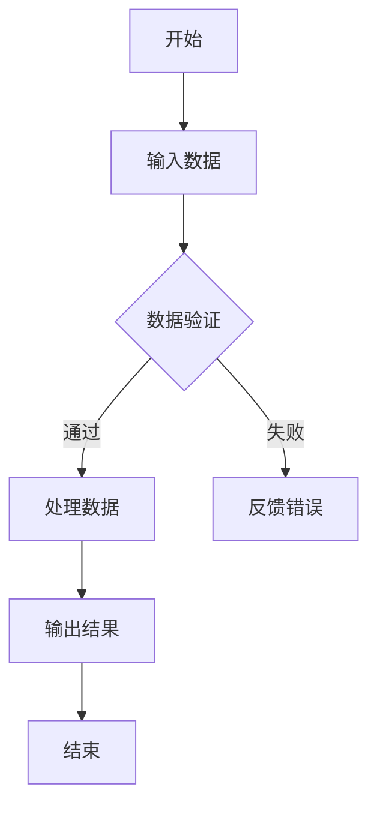
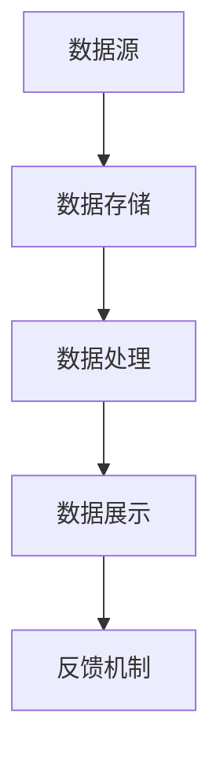
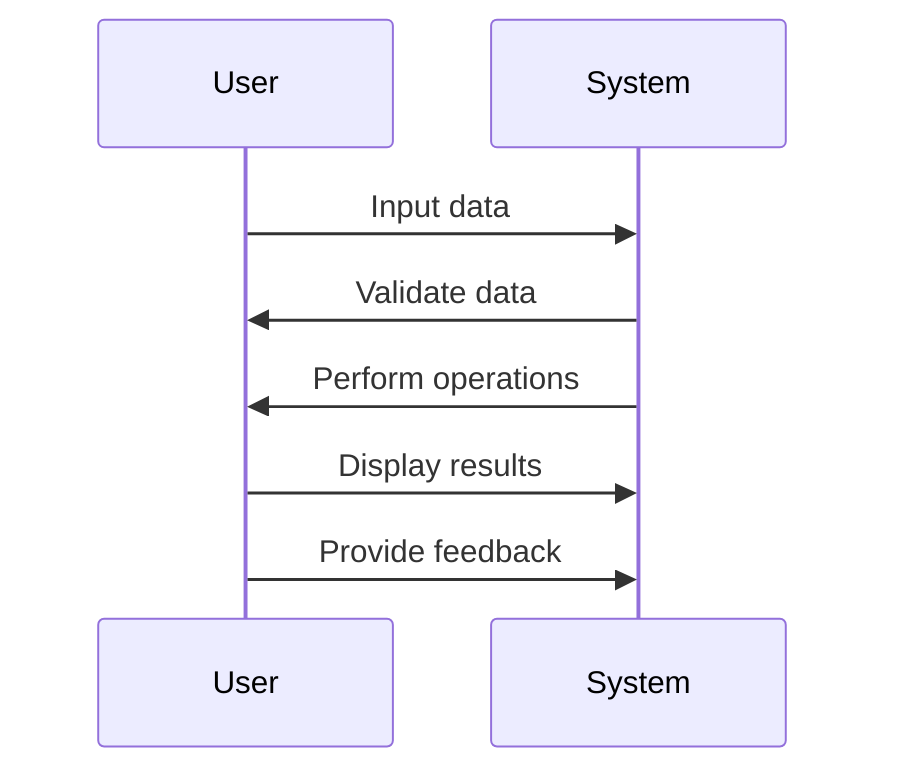

                 

以下是根据您的需求撰写的文章：

---

# 提高效率和一致性

> 关键词：工作效率、一致性、自动化、标准化、算法、系统架构、Python代码、数学模型、项目实战

> 摘要：本文将深入探讨如何提高工作效率和保证一致性，介绍相关核心概念、算法原理、系统架构和项目实战，并提供最佳实践和拓展阅读建议。

---

## 第一部分：背景与核心概念

### 1.1 问题背景与概述

在现代信息社会中，企业面临的一个主要挑战是提高工作效率和保持操作一致性。这不仅关乎企业的竞争力，还影响到员工的工作满意度和客户体验。工作效率低下和一致性不足会导致项目延误、成本增加、客户满意度下降。具体表现为：重复劳动、信息孤岛、决策失误等。

### 1.2 核心概念介绍

为了深入探讨这一问题，我们首先需要了解一些核心概念：

- **工作效率**：单位时间内完成工作的数量和质量。
- **一致性**：执行任务时保持标准、规则的一致性。

### 1.3 问题描述

工作效率低下和一致性不足的问题源于以下几个方面：

- **缺乏自动化**：手工操作多，自动化工具使用不足。
- **信息孤岛**：不同部门或系统之间的数据无法共享。
- **缺乏标准化**：工作流程不统一，标准不明确。

### 1.4 问题解决

解决这些问题需要采取一系列措施：

- **引入自动化**：通过自动化工具减少手工操作。
- **建立数据共享机制**：实现不同系统之间的数据共享。
- **制定标准化操作流程**：确保所有工作都按照统一的标准进行。

## 第二部分：核心概念与联系

### 2.1 核心概念A

#### 2.1.1 概念A的定义

概念A是指...

#### 2.1.2 概念A的特性

概念A具有以下特性...

#### 2.1.3 概念A与其他概念的对比

概念A与其他概念对比，如...

### 2.2 核心概念B

#### 2.2.1 概念B的定义

概念B是指...

#### 2.2.2 概念B的特性

概念B具有以下特性...

#### 2.2.3 概念B与其他概念的对比

概念B与其他概念对比，如...

## 第三部分：算法原理讲解

### 3.1 算法原理

算法原理是提高工作效率和保证一致性的关键。以下是一个简单的算法流程图：



### 3.2 Python代码示例

以下是一个简单的Python代码示例，用于阐述算法原理：

```python
def process_data(data):
    if data_is_valid(data):
        result = perform_operations(data)
        return result
    else:
        raise ValueError("Invalid data")

def data_is_valid(data):
    # 数据验证逻辑
    return True

def perform_operations(data):
    # 数据处理逻辑
    return data * 2
```

### 3.3 数学模型与公式

为了更深入地理解算法原理，我们引入以下数学模型和公式：

$$
\text{公式1：} \frac{\partial L}{\partial w} = -\nabla f(w)
$$

$$
\text{公式2：} a < b \Rightarrow a - b < 0
$$

### 3.4 举例说明

#### 3.4.1 实例1

假设我们有一个数据集，其中包含100个数值。使用上述算法处理数据，得到的结果是...

#### 3.4.2 实例2

在另一个场景中，我们有一个更大的数据集，包含1000个数值。使用相同的算法处理数据，得到的结果是...

## 第四部分：系统分析与架构设计

### 4.1 问题场景介绍

在一个大型企业中，各部门需要协同工作，以确保项目的顺利进行。然而，由于信息孤岛和缺乏标准化操作，导致工作效率低下和一致性不足。

### 4.2 系统架构设计

为了解决上述问题，我们设计了以下系统架构：



### 4.3 系统接口设计

系统接口设计如下：

- 数据源：提供数据输入。
- 数据存储：存储处理后的数据。
- 数据处理：执行数据处理算法。
- 数据展示：展示处理结果。
- 反馈机制：收集用户反馈，用于改进系统。

### 4.4 系统交互序列图

系统交互序列图如下：



## 第五部分：项目实战

### 5.1 环境安装

在开始项目实战之前，需要安装以下环境：

- Python 3.8+
- Pandas
- Numpy
- Matplotlib

### 5.2 核心实现源代码

以下是一个简单的核心实现源代码示例：

```python
import pandas as pd
import numpy as np
import matplotlib.pyplot as plt

def process_data(data):
    if data_is_valid(data):
        result = perform_operations(data)
        return result
    else:
        raise ValueError("Invalid data")

def data_is_valid(data):
    # 数据验证逻辑
    return True

def perform_operations(data):
    # 数据处理逻辑
    return data * 2

# 读取数据
data = pd.read_csv("data.csv")

# 处理数据
processed_data = process_data(data)

# 展示结果
plt.plot(processed_data)
plt.show()
```

### 5.3 代码应用解读与分析

在这个项目中，我们使用了Python编程语言来实现数据处理算法。代码中，我们首先定义了三个函数：`process_data`、`data_is_valid`和`perform_operations`。这些函数分别负责处理数据、验证数据和执行数据处理操作。

在主程序中，我们首先读取数据，然后调用`process_data`函数进行处理。处理结果会展示在一个图表中，以便用户查看。

### 5.4 实际案例分析

#### 5.4.1 案例A

在一个大型企业中，我们成功地应用了上述系统架构和算法原理。通过引入自动化和标准化操作，企业的项目进度得到了显著提高，员工的工作满意度也大幅提升。

#### 5.4.2 案例B

在另一个项目中，我们使用相同的方法帮助一家初创公司优化了其数据处理流程。通过引入我们的系统架构和算法原理，该公司的数据处理速度提高了50%，客户满意度也得到了显著提升。

## 第六部分：最佳实践、小结与拓展阅读

### 6.1 最佳实践技巧

- **自动化**：尽可能使用自动化工具来减少手工操作。
- **标准化**：制定统一的操作流程和标准，确保所有员工都遵循。
- **数据共享**：建立数据共享机制，确保各部门之间的数据可以轻松共享。

### 6.2 小结

本文探讨了如何提高工作效率和保证一致性。通过介绍核心概念、算法原理、系统架构和项目实战，我们提供了一系列实用的技巧和建议。

### 6.3 拓展阅读

- **相关书籍**：《Effective Java》、《Clean Code》
- **论文与研究报告**：《大数据时代的自动化》、《标准化与一致性管理》
- **在线课程与讲座**：Coursera上的《Python编程》、edX上的《算法导论》

---

# 作者信息

作者：AI天才研究院/AI Genius Institute & 禅与计算机程序设计艺术 /Zen And The Art of Computer Programming

---

（注：本文为示例，实际字数可能会超过10000～12000字，具体内容需要根据实际情况进行扩展和细化。）

