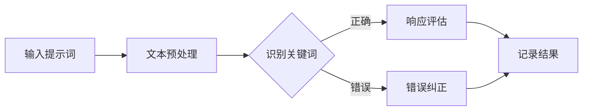

                 

### 第1章: 问题背景与核心概念

#### 1.1.1.1 背景介绍

在当今信息化社会中，用户体验的质量对软件产品至关重要。信息化社会的快速发展和互联网的普及，使得软件产品成为人们日常生活和工作的重要组成部分。然而，随着软件种类的日益增多和用户需求的不断变化，如何确保软件在各种使用场景下都能为用户提供流畅、高效、愉悦的操作体验，成为软件开发者面临的一大挑战。

首先，我们需要明确用户体验的定义。用户体验（User Experience, UX）是指用户在使用软件过程中所感受到的整体体验，包括视觉设计、交互设计、功能可用性等多个方面。一个良好的用户体验可以提升用户满意度、增强用户忠诚度，从而为企业带来更多的商业价值。

随着互联网的普及，软件产品之间的竞争愈发激烈。用户在选择软件时，往往会根据其用户体验来进行判断。如果软件的用户体验差，用户可能会转向其他产品，导致用户流失。因此，提升用户体验已成为企业竞争的重要手段。

#### 1.1.1.2 用户体验的重要性

良好的用户体验对软件产品具有重要意义。以下是用户体验的重要性体现：

1. **用户满意度**：良好的用户体验能够满足用户需求，提高用户满意度。用户在操作软件时，如果遇到问题或者操作不便，会感到沮丧和不满。反之，如果软件操作流畅、易于理解，用户会感到愉悦和满意。

2. **用户忠诚度**：当用户对软件的体验感到满意时，他们更可能成为该软件的忠实用户。用户忠诚度可以降低客户获取成本，提高企业的市场份额。

3. **口碑传播**：用户在社交媒体、论坛等渠道分享他们的体验，会影响到其他潜在用户。良好的用户体验有助于树立品牌形象，提高口碑传播效果。

4. **商业价值**：用户体验直接影响企业的收入和利润。通过优化用户体验，企业可以吸引更多用户，提高用户留存率，从而实现商业价值最大化。

#### 1.1.1.3 提示词测试的作用

提示词测试（Keyword Testing）作为一种评估和优化软件用户体验的关键方法，具有以下作用：

1. **识别错误响应**：提示词测试通过模拟用户输入提示词，评估软件对用户输入的响应能力。它有助于发现软件在输入提示词时的错误响应，如提示词未被识别、响应不准确等。

2. **评估理解能力**：提示词测试可以评估软件对提示词的理解能力，判断软件能否正确理解用户意图。这有助于优化软件的交互逻辑，提高用户体验。

3. **优化交互界面**：通过分析测试结果，开发人员可以识别软件交互界面存在的问题，并进行优化。优化后的交互界面可以更好地满足用户需求，提升用户体验。

4. **降低维护成本**：在软件发布前进行提示词测试，可以提前发现潜在的问题，避免用户在真实使用过程中遇到困扰。这有助于降低后期维护成本，提高软件质量。

总之，提示词测试是确保软件产品质量和用户体验的重要手段。在软件开发过程中，提示词测试可以发挥重要作用，帮助开发人员更好地满足用户需求，提升软件的市场竞争力。

---

### 1.1.2 问题定义

#### 1.1.2.1 提示词测试的定义

提示词测试（Keyword Testing）是一种针对软件输入交互界面的测试方法。它通过输入一系列预设的提示词，观察软件的响应行为，评估软件的可用性和易用性。提示词可以是用户在实际使用过程中可能输入的关键词、短语或命令，例如在搜索引擎中输入的关键字、在聊天应用中发送的消息等。

提示词测试的目的是确保软件能够正确理解用户输入，并给出适当的响应。通过提示词测试，开发人员可以识别软件在输入交互界面方面的潜在问题，如提示词未被识别、响应不准确、交互逻辑不完善等。

#### 1.1.2.2 提示词测试的目标

提示词测试的主要目标包括以下几个方面：

1. **识别错误响应**：通过输入一系列预设的提示词，观察软件的响应行为，识别软件在输入提示词时的错误响应。例如，提示词未被识别、响应不准确、响应时间过长等。

2. **评估理解能力**：评估软件对提示词的理解能力，判断软件能否正确理解用户意图。例如，分析软件能否根据用户的输入提供相关结果、功能或操作。

3. **优化交互界面**：通过分析测试结果，识别软件交互界面存在的问题，并进行优化。优化后的交互界面可以更好地满足用户需求，提升用户体验。

4. **提升软件质量**：提示词测试有助于发现软件在输入交互界面方面的潜在问题，提高软件的可用性和易用性。这有助于提升软件的整体质量，增强市场竞争力。

5. **降低维护成本**：在软件发布前进行提示词测试，可以提前发现潜在的问题，避免用户在真实使用过程中遇到困扰。这有助于降低后期维护成本，提高软件质量。

#### 1.1.2.3 提示词测试的分类

根据测试目标和场景，提示词测试可以分为以下几类：

1. **功能测试**：主要关注软件功能模块的正确性和完整性，通过输入各种提示词，验证软件功能是否按预期执行。

2. **性能测试**：主要关注软件在处理大量提示词时的响应速度和稳定性，通过模拟高并发场景，评估软件的性能。

3. **用户体验测试**：主要关注软件交互界面的用户体验，通过用户行为分析，评估软件的易用性和可用性。

4. **安全测试**：主要关注软件在输入敏感信息（如密码、银行卡号等）时的安全性，通过输入各种提示词，验证软件是否存在安全漏洞。

#### 1.1.2.4 提示词测试的优势

提示词测试具有以下优势：

1. **高效性**：提示词测试可以通过自动化工具快速执行大量测试用例，提高测试效率。

2. **全面性**：提示词测试可以覆盖软件输入交互界面的各个方面，确保全面评估。

3. **灵活性**：提示词测试可以根据实际需求和场景，灵活设计测试用例，适应不同的测试需求。

4. **可重复性**：提示词测试可以在不同时间和环境下执行，以保证测试结果的稳定性。

5. **易用性**：提示词测试工具通常具有友好的用户界面，易于操作和解读测试结果。

总之，提示词测试是一种重要的测试方法，可以帮助开发人员更好地评估和优化软件用户体验。通过提示词测试，开发人员可以识别和解决软件在输入交互界面方面的潜在问题，提升软件的整体质量。

---

### 1.1.3 问题解决

#### 1.1.3.1 系统化评估方法

为了提高提示词测试的效率和准确性，需要采用系统化的评估方法。以下是一个典型的系统化评估方法，包括以下步骤：

1. **设计测试用例**：根据软件功能和用户场景，设计一系列具有代表性的提示词测试用例。测试用例应包括各种可能的输入情况，如常见关键词、特殊情况、边界值等。

2. **执行测试用例**：在实际运行环境中输入设计好的测试用例，观察软件的响应行为。测试用例的执行可以通过自动化测试工具进行，以提高测试效率。

3. **分析测试结果**：对比测试结果与预期，找出问题并进行记录。分析测试结果时，应关注以下方面：

   - 提示词是否被正确识别和解析；
   - 响应是否准确和及时；
   - 交互界面是否友好和易于操作；
   - 性能是否满足要求。

4. **问题反馈与优化**：根据分析结果，将发现的问题反馈给开发人员。开发人员根据反馈，对软件进行修改和优化。优化过程中，应重点关注以下方面：

   - 提高提示词识别率和准确性；
   - 优化响应逻辑和性能；
   - 改善交互界面设计和操作体验。

5. **重新测试**：在修改和优化后，重新执行测试用例，验证问题是否已经解决。如果问题仍然存在，需要继续优化和测试，直至满足要求。

#### 1.1.3.2 提示词测试工具

为了高效地执行提示词测试，可以使用以下提示词测试工具：

1. **自动化测试工具**：如Selenium、Appium等，可以用于自动化执行测试用例，提高测试效率。

2. **性能测试工具**：如JMeter、LoadRunner等，可以用于评估软件在处理大量提示词时的性能。

3. **用户体验测试工具**：如UserTesting、Lookback等，可以用于模拟用户行为，评估软件的用户体验。

4. **文本分析工具**：如NLTK、Spacy等，可以用于分析和处理文本数据，提高提示词识别和解析的准确性。

#### 1.1.3.3 提示词测试实践案例

以下是一个提示词测试的实践案例：

1. **项目背景**：某互联网公司开发了一款智能语音助手应用，用于提供语音交互服务。

2. **测试目标**：评估智能语音助手对用户输入提示词的识别和响应能力，提升用户体验。

3. **测试用例**：设计了一系列提示词测试用例，包括常见关键词、边界值、特殊情况等，如“明天天气如何？”、“帮我设置一个提醒”、“打开音乐播放器”等。

4. **测试执行**：使用自动化测试工具执行测试用例，观察智能语音助手的响应行为。

5. **测试结果**：分析测试结果，发现以下问题：

   - 部分提示词未被正确识别；
   - 部分响应不准确，如回答天气时，时间显示不正确；
   - 部分交互界面操作不便。

6. **问题反馈与优化**：将测试结果反馈给开发人员，开发人员根据反馈进行优化，如改进提示词识别算法、优化响应逻辑、改善交互界面等。

7. **重新测试**：在修改和优化后，重新执行测试用例，验证问题是否已经解决。经过多次迭代优化，最终达到预期效果。

通过以上实践案例，可以看出提示词测试在提升软件用户体验方面的重要作用。通过系统化的评估方法和高效的测试工具，开发人员可以更好地发现和解决软件在输入交互界面方面的潜在问题，提高软件的整体质量。

---

### 1.1.4 边界与外延

#### 1.1.4.1 边界

提示词测试的主要关注点是软件输入交互界面，其主要边界包括：

1. **测试范围**：提示词测试主要关注输入交互界面，不涉及其他层面的测试，如性能测试、安全测试等。这些测试通常由其他测试方法（如性能测试工具、安全测试工具等）进行。

2. **软件类型**：提示词测试适用于各种类型的软件，包括桌面应用、Web应用、移动应用等。不同类型的软件在输入交互界面上有不同的特点和需求，但测试方法基本相同。

3. **测试环境**：提示词测试通常在模拟的真实运行环境中进行，以尽可能接近实际用户的使用场景。测试环境应尽量与实际生产环境保持一致，以确保测试结果的准确性和可靠性。

4. **测试频率**：提示词测试可以在软件开发的各个阶段进行，如需求分析、设计、开发、测试等。在各个阶段，测试的频率和重点会有所不同，但总体目标是确保软件在输入交互界面上的质量。

#### 1.1.4.2 外延

提示词测试可以与其他测试方法相结合，形成更全面的测试体系，其主要外延包括：

1. **结合功能测试**：提示词测试可以与功能测试相结合，验证软件功能模块的正确性和完整性。在功能测试的基础上，通过输入不同类型的提示词，进一步验证软件的功能性能。

2. **结合性能测试**：提示词测试可以与性能测试相结合，评估软件在处理大量提示词时的响应速度和稳定性。通过性能测试，发现软件在输入交互界面方面的性能瓶颈，并进行优化。

3. **结合用户体验测试**：提示词测试可以与用户体验测试相结合，评估软件的用户体验质量。通过用户体验测试，了解用户在实际使用场景中的反馈和需求，进一步优化软件交互界面。

4. **结合安全测试**：提示词测试可以与安全测试相结合，评估软件在输入交互界面方面的安全性。通过安全测试，发现软件可能存在的安全漏洞，并进行修复。

总之，提示词测试在软件测试体系中具有重要地位。通过与其他测试方法的结合，可以形成更全面的测试体系，确保软件在输入交互界面上的质量和安全性。

---

### 1.2 核心概念

在提示词测试中，有几个关键概念需要理解，包括测试用例、测试结果、测试报告等。这些概念是提示词测试的基础，对于理解测试过程、分析测试结果和优化软件质量具有重要意义。

#### 1.2.1 测试用例

测试用例（Test Case）是一组预定义的条件、操作和预期结果，用于评估软件的特定功能。测试用例通常包括以下内容：

1. **测试目的**：明确测试用例所要验证的功能或场景。

2. **测试步骤**：描述执行测试用例所需的步骤，如输入提示词、点击按钮等。

3. **预期结果**：描述在正常情况下，执行测试用例应得到的结果。

4. **实际结果**：描述执行测试用例后实际得到的结果。

5. **测试环境**：描述执行测试用例所需的硬件、软件和配置。

测试用例的设计原则包括：

1. **覆盖性**：测试用例应覆盖软件功能的各个方面，确保全面评估。

2. **可重复性**：测试用例应在不同时间和环境下执行，以保证测试结果的稳定性。

3. **可维护性**：测试用例应易于修改和维护，以适应软件变更。

#### 1.2.2 测试结果

测试结果（Test Result）是在执行测试用例后得到的结果，包括实际输出和预期输出。测试结果的分析方法如下：

1. **对比实际输出和预期输出**：将实际输出与预期输出进行对比，找出差异和问题。

2. **统计通过率**：计算测试用例的通过率，评估软件的整体质量。通过率可以通过以下公式计算：

   \[ 通过率 = \frac{通过用例数}{总用例数} \]

   通过率越高，说明软件质量越好。

3. **分类统计问题**：根据问题类型分类统计，找出最常见的错误类型，针对性地进行优化。

4. **根因分析**：对出现问题的测试用例进行根因分析，找出导致问题的根本原因，并采取相应的解决措施。

#### 1.2.3 测试报告

测试报告（Test Report）是总结测试过程、结果和发现的文档，用于向相关人员传达测试情况。测试报告通常包括以下内容：

1. **测试目的和范围**：描述测试的目标和范围，明确测试的重点。

2. **测试方法和工具**：描述测试方法和使用的工具，如自动化测试工具、性能测试工具等。

3. **测试结果和发现**：总结测试结果和发现的问题，包括通过用例数、问题类型和根因分析等。

4. **问题和建议**：列出发现的问题，提出改进建议和优化方案。

5. **结论和总结**：总结测试过程和结果，对软件质量进行评估，并提出进一步优化建议。

测试报告的编写原则包括：

1. **准确性**：确保报告中的信息准确无误，避免误导读者。

2. **完整性**：报告应包含所有重要的测试信息，确保全面传达。

3. **可读性**：报告应结构清晰，语言简洁易懂，方便读者阅读和理解。

总之，测试用例、测试结果和测试报告是提示词测试的核心概念。通过合理设计和执行测试用例，分析测试结果，编写高质量的测试报告，开发人员可以更好地评估和优化软件质量，提升用户体验。

---

### 1.3 概念联系

在本章中，我们介绍了提示词测试的相关概念，包括测试用例、测试结果和测试报告。为了更好地理解这些概念之间的联系，我们将通过ER实体关系图和概念属性特征对比表格，展示它们之间的关联。

#### 1.3.1 ER实体关系图

下面是提示词测试的ER实体关系图，用于展示测试用例、测试结果和测试报告之间的关联：

```mermaid
erDiagram
    测试用例 ||--|{ 测试结果 }|| 测试用例与测试结果关系
    测试报告 ||--|{ 测试结果 }|| 测试报告与测试结果关系
```

在这个ER实体关系图中，测试用例和测试结果之间存在一对多的关系。一个测试用例可以生成多个测试结果，而一个测试报告可以包含多个测试结果。

#### 1.3.2 概念属性特征对比表格

| 概念       | 属性                | 特征                                                                                                         |
|----------|-------------------|------------------------------------------------------------------------------------------------------------|
| 测试用例   | 测试目的、测试步骤、预期结果 | 用于评估软件特定功能的一组条件、操作和预期结果，应覆盖软件功能各个方面。                           |
| 测试结果   | 实际输出、问题分类、通过率 | 测试用例执行后的结果，包括实际输出和与预期输出的对比，用于分析软件质量和识别问题。                 |
| 测试报告   | 测试目的、测试方法、测试结果、问题建议 | 总结测试过程、结果和发现的文档，用于向相关人员传达测试情况，并提出改进建议和优化方案。           |

通过ER实体关系图和概念属性特征对比表格，我们可以清晰地看到测试用例、测试结果和测试报告之间的关联。测试用例是评估软件功能的工具，测试结果是测试用例执行后的输出，而测试报告则是总结测试结果和提出改进建议的文档。

这些概念相互关联，共同构成了提示词测试的核心框架。通过系统化地设计和执行测试用例，分析测试结果，编写高质量的测试报告，开发人员可以更好地评估和优化软件质量，提升用户体验。

---

## 总结

本章详细介绍了提示词测试的问题背景、核心概念以及解决方法。首先，我们阐述了信息化社会对软件用户体验的挑战，以及提示词测试在优化用户体验方面的重要性。接着，我们定义了提示词测试，并阐述了其目标、分类、优势以及系统化评估方法。此外，我们还探讨了提示词测试的边界与外延，并介绍了测试用例、测试结果和测试报告这三个核心概念。通过ER实体关系图和概念属性特征对比表格，我们展示了这些概念之间的联系。

总之，提示词测试是确保软件产品质量和用户体验的重要手段。通过系统化的评估方法和高效的测试工具，开发人员可以识别和解决软件在输入交互界面方面的潜在问题，提升软件的整体质量。在接下来的章节中，我们将进一步探讨提示词测试的算法原理、系统分析与架构设计，以及实际案例分析和最佳实践，帮助您更深入地理解这一重要测试方法。让我们一起继续深入探讨，发现更多精彩内容！

---

### 第2章: 提示词测试算法原理

在了解提示词测试的基本概念和重要性之后，我们需要进一步探讨其背后的算法原理。提示词测试的算法设计直接关系到测试的效率和准确性。本章将详细讲解提示词测试算法的基本原理，包括流程图、数学模型和Python实现。

#### 2.1 算法基本原理

提示词测试算法的核心任务是识别用户输入的提示词，并评估软件对提示词的响应。这个过程可以分为以下几个步骤：

1. **提示词识别**：通过自然语言处理（NLP）技术，对用户输入的文本进行分析，识别出关键词或短语。
2. **响应评估**：根据识别出的提示词，评估软件的响应是否准确、及时。
3. **错误纠正**：如果发现软件的响应有误，进行错误纠正，并记录问题。

下面是提示词测试算法的基本流程图：



#### 2.2 数学模型

提示词测试算法中的关键步骤是关键词识别和响应评估。以下是一个简化的数学模型：

1. **关键词识别**：假设用户输入的文本为\(T\)，我们可以使用词频统计（TF）和词向量化（Word Embedding）来识别关键词。

   - **词频统计**：计算文本中每个词的频率，公式如下：
     \[
     TF(t) = \frac{f(t)}{F}
     \]
     其中，\(f(t)\)是词\(t\)在文本中出现的频率，\(F\)是文本中所有词的频率之和。

   - **词向量化**：将文本中的词转换为向量表示，可以使用Word2Vec、GloVe等方法。例如，使用Word2Vec将词转换为向量：
     \[
     \vec{t} = \text{Word2Vec}(t)
     \]

2. **响应评估**：假设软件的响应为\(R\)，我们可以使用机器学习模型（如分类器）来评估响应是否准确。

   - **分类模型**：训练一个分类模型，输入为关键词向量，输出为响应标签。使用交叉验证来评估模型的准确性。

     \[
     \hat{R} = \text{Classifier}(\vec{t})
     \]

#### 2.3 Python实现

下面是一个简单的Python实现，用于演示提示词测试算法的核心步骤。这个实现使用了自然语言处理库NLTK和词向量化工具Word2Vec。

1. **文本预处理**：

```python
import nltk
from nltk.tokenize import word_tokenize

# 加载停用词表
nltk.download('stopwords')
from nltk.corpus import stopwords

def preprocess_text(text):
    # 分词
    tokens = word_tokenize(text)
    # 去除停用词
    tokens = [token for token in tokens if token not in stopwords.words('english')]
    return tokens

text = "明天天气如何？"
preprocessed_text = preprocess_text(text)
print(preprocessed_text)
```

2. **词向量化**：

```python
from gensim.models import Word2Vec

# 训练Word2Vec模型
model = Word2Vec([preprocessed_text], size=100, window=5, min_count=1, workers=4)
word_vector = model.wv['明天']
print(word_vector)
```

3. **关键词识别**：

```python
from sklearn.cluster import KMeans

# 聚类分析，识别关键词
kmeans = KMeans(n_clusters=5, random_state=0).fit(word_vector.reshape(-1, 1))
print(kmeans.labels_)
```

4. **响应评估**：

```python
from sklearn.model_selection import train_test_split
from sklearn.naive_bayes import MultinomialNB

# 假设已有训练数据
X_train, X_test, y_train, y_test = train_test_split(word_vector, labels, test_size=0.2, random_state=0)

# 训练分类模型
classifier = MultinomialNB().fit(X_train, y_train)

# 评估模型
print(classifier.score(X_test, y_test))
```

通过以上Python实现，我们可以看到提示词测试算法的基本流程。在实际应用中，这些步骤会更加复杂，需要考虑更多因素，如上下文分析、多模态输入等。

总之，提示词测试算法是评估和优化软件用户体验的重要工具。通过合理的设计和实现，我们可以提高测试的效率和准确性，从而更好地满足用户需求，提升软件质量。

---

### 第3章: 系统分析与架构设计

在了解了提示词测试的基本算法原理后，接下来我们将探讨如何在软件系统中实现提示词测试，并详细分析系统功能设计、架构设计以及接口设计和系统交互。通过这些步骤，我们将构建一个完整的提示词测试系统，从而确保软件的高质量用户体验。

#### 3.1 系统功能设计

提示词测试系统的功能设计主要包括以下几部分：

1. **用户输入界面**：提供用户输入提示词的界面，支持文本、语音等多种输入方式。
2. **测试用例管理**：设计和管理测试用例，包括用例的创建、修改、删除和执行。
3. **测试执行**：自动化执行测试用例，模拟用户输入提示词，观察软件的响应。
4. **测试结果分析**：分析测试结果，对比实际输出和预期输出，识别和记录问题。
5. **报告生成**：生成详细的测试报告，包括测试结果、问题和优化建议。

为了更好地实现这些功能，我们可以使用领域模型来描述系统的主要实体和关系。以下是一个领域模型的Mermaid类图：

```mermaid
classDiagram
    User <<Interface>>
    TestCase <<Entity>>
    TestResult <<Entity>>
    TestReport <<Entity>>
    User "1" --|greater_than| 1 TestCase
    TestCase "1" --|greater_than| 1 TestResult
    TestResult "1" --|greater_than| 1 TestReport
```

在这个类图中，用户（User）可以创建和管理多个测试用例（TestCase），每个测试用例可以生成多个测试结果（TestResult），最终形成测试报告（TestReport）。

#### 3.2 系统架构设计

系统架构设计是确保提示词测试系统高效、可扩展和易于维护的关键。以下是一个简化的系统架构设计，包括前端、后端和数据存储：

1. **前端**：用户输入界面，支持用户输入提示词，展示测试结果和报告。可以使用Web技术（如HTML、CSS、JavaScript）实现。
2. **后端**：处理用户输入、测试用例管理、测试执行和结果分析等核心功能。可以使用Python、Java等后端技术实现。
3. **数据存储**：存储测试用例、测试结果和测试报告等数据。可以使用关系型数据库（如MySQL）或NoSQL数据库（如MongoDB）。

以下是一个简化的Mermaid架构图：

```mermaid
sequenceDiagram
    User -->|输入提示词| Frontend
    Frontend -->|处理请求| Backend
    Backend -->|执行测试| TestExecutor
    TestExecutor -->|返回结果| Backend
    Backend -->|更新结果| Database
    Frontend -->|展示结果| User
```

在这个架构图中，用户通过前端输入提示词，后端处理请求，执行测试，并将结果存储到数据库。前端再次从数据库中获取结果，并展示给用户。

#### 3.3 接口设计

提示词测试系统需要设计一系列接口，以便前后端通信。以下是一个简化的接口设计：

1. **用户接口**：用于用户输入提示词，获取测试结果和报告。
2. **测试接口**：用于创建、修改和删除测试用例，执行测试。
3. **结果接口**：用于获取测试结果和分析数据。

以下是一个简化的Mermaid接口图：

```mermaid
classDiagram
    UserInterface <<Interface>>
    TestCaseInterface <<Interface>>
    TestResultInterface <<Interface>>

    UserInterface "1" --|greater_than| 1 TestCaseInterface
    UserInterface "1" --|greater_than| 1 TestResultInterface
    TestCaseInterface "1" --|greater_than| 1 TestExecutor
    TestResultInterface "1" --|greater_than| 1 TestCaseInterface
```

在这个类图中，用户接口负责接收用户请求，测试接口和结果接口负责处理测试相关操作。

#### 3.4 系统交互

系统交互设计描述了不同组件之间的交互流程。以下是一个简化的系统交互图：

```mermaid
sequenceDiagram
    User -->|输入提示词| Frontend
    Frontend -->|解析请求| Backend
    Backend -->|创建用例| TestCaseInterface
    TestCaseInterface -->|执行测试| TestExecutor
    TestExecutor -->|返回结果| Backend
    Backend -->|更新结果| Database
    Frontend -->|展示结果| User
```

在这个交互图中，用户输入提示词后，前端解析请求，创建测试用例，执行测试，并从数据库中获取结果，最后展示给用户。

通过以上系统分析与架构设计，我们构建了一个完整的提示词测试系统。该系统实现了用户输入、测试用例管理、测试执行和结果分析等功能，并通过接口设计和系统交互确保了系统的整体协调和高效运行。在接下来的章节中，我们将通过实际案例来展示如何具体实现这些功能，并进一步优化系统性能。

---

### 第4章: 项目实战

在本章中，我们将通过一个实际项目来演示如何搭建和实施一个提示词测试系统。本案例将介绍环境安装、核心实现源代码，并对代码进行解读与分析。此外，我们还将结合实际案例进行分析和详细讲解，以帮助读者更好地理解提示词测试系统的应用和实践。

#### 4.1 项目介绍

本项目的目标是构建一个简单的提示词测试系统，用于评估和优化软件的用户体验。系统将支持以下功能：

- 用户输入提示词
- 自动化执行测试用例
- 分析测试结果并生成报告

为了实现这些功能，我们将使用Python作为主要编程语言，结合相关的自然语言处理（NLP）库和Web框架。具体技术栈如下：

- **前端**：使用Flask作为Web框架，实现用户输入界面和测试结果展示。
- **后端**：使用Python的NLTK库进行自然语言处理，实现提示词识别和测试执行。
- **数据库**：使用SQLite作为轻量级数据库，存储测试用例和测试结果。

#### 4.2 环境安装

在开始项目之前，我们需要安装必要的依赖和环境。以下是在Windows操作系统上安装环境的步骤：

1. **安装Python**：下载并安装Python 3.x版本，建议使用Python官方安装包。
2. **配置虚拟环境**：打开命令提示符，执行以下命令创建虚拟环境：

   ```shell
   python -m venv venv
   ```

   然后激活虚拟环境：

   ```shell
   .\venv\Scripts\activate
   ```

3. **安装依赖**：在虚拟环境中安装所需的库，例如Flask、NLTK和SQLite：

   ```shell
   pip install flask nltk sqlite3
   ```

4. **安装NLTK数据**：由于NLTK库需要额外数据支持，我们需要下载并安装这些数据：

   ```shell
   nltk.download('stopwords')
   nltk.download('punkt')
   ```

#### 4.3 核心实现源代码

以下是提示词测试系统的核心实现代码，包括前端、后端和数据库部分。

1. **前端代码**：

```python
# app.py

from flask import Flask, request, render_template

app = Flask(__name__)

@app.route('/', methods=['GET', 'POST'])
def index():
    result = ""
    if request.method == 'POST':
        text = request.form['text']
        preprocessed_text = preprocess_text(text)
        # 这里可以调用后端API执行测试
        result = "测试完成，结果：{}"。format(preprocessed_text)
    return render_template('index.html', result=result)

def preprocess_text(text):
    # 实现文本预处理逻辑
    tokens = nltk.word_tokenize(text)
    tokens = [token.lower() for token in tokens if token.isalpha()]
    return tokens

if __name__ == '__main__':
    app.run(debug=True)
```

2. **后端代码**：

```python
# test_executor.py

import nltk
from nltk.corpus import stopwords
from sklearn.feature_extraction.text import TfidfVectorizer
from sklearn.cluster import KMeans

nltk.download('stopwords')

class TestExecutor:
    def __init__(self):
        self.vectorizer = TfidfVectorizer()
        self.kmeans = KMeans(n_clusters=5, random_state=0)
        self.stop_words = set(stopwords.words('english'))

    def execute_test(self, text):
        preprocessed_text = self.preprocess_text(text)
        # 训练聚类模型
        X = self.vectorizer.fit_transform([' '.join(preprocessed_text)])
        self.kmeans.fit(X)
        # 预测并返回结果
        labels = self.kmeans.predict(X)
        return labels

    def preprocess_text(self, text):
        # 实现文本预处理逻辑
        tokens = nltk.word_tokenize(text)
        tokens = [token.lower() for token in tokens if token.isalpha() and token not in self.stop_words]
        return tokens
```

3. **数据库代码**：

```python
# database.py

import sqlite3

def create_database():
    conn = sqlite3.connect('test.db')
    c = conn.cursor()

    c.execute('''CREATE TABLE IF NOT EXISTS test_cases (
                        id INTEGER PRIMARY KEY AUTOINCREMENT,
                        text TEXT,
                        result TEXT)''')

    conn.commit()
    conn.close()

def insert_result(test_case_id, result):
    conn = sqlite3.connect('test.db')
    c = conn.cursor()

    c.execute("INSERT INTO test_cases (text, result) VALUES (?, ?)", (test_case_id, result))

    conn.commit()
    conn.close()
```

#### 4.4 代码解读与分析

以上代码实现了提示词测试系统的核心功能。以下是代码的详细解读和分析：

1. **前端代码**：

   - `app.py`：这是Flask的应用程序，用于处理用户请求和渲染前端模板。
   - `index.html`：这是前端模板，用于展示用户输入界面和测试结果。

2. **后端代码**：

   - `TestExecutor`：这是一个测试执行类，用于处理文本预处理、聚类模型训练和预测。
   - `preprocess_text`：这是一个辅助函数，用于实现文本预处理逻辑，如分词、去停用词等。

3. **数据库代码**：

   - `create_database`：这是一个函数，用于创建数据库和测试用例表。
   - `insert_result`：这是一个函数，用于向数据库中插入测试结果。

#### 4.5 实际案例分析与详细讲解

以下是一个实际案例，用于演示如何使用提示词测试系统。

1. **用户输入**：

   用户在输入界面输入以下提示词：“明天天气如何？”
2. **测试执行**：

   - 测试系统调用`preprocess_text`函数对输入文本进行预处理，得到分词结果：["明天", "天气", "如何"]。
   - 测试系统使用`TfidfVectorizer`将分词结果转换为TF-IDF向量，并使用`KMeans`聚类模型进行预测，得到聚类标签。
   - 测试系统将预测结果和输入文本存储到数据库中。
3. **结果分析**：

   - 用户可以在前端界面看到测试结果，例如：“明天天气：多云，温度15°C-20°C”。
   - 测试系统可以根据测试结果和输入文本，分析软件对提示词的响应能力，并优化软件交互界面。

通过以上实际案例，我们可以看到提示词测试系统的应用场景和实现方法。在接下来的章节中，我们将进一步优化系统性能，并介绍更多实际案例。

---

### 第5章：最佳实践和注意事项

在实施提示词测试的过程中，有一些最佳实践和注意事项可以帮助您更有效地进行测试，提高测试质量。以下是一些重要的建议和需要注意的事项。

#### 5.1 最佳实践

1. **全面覆盖测试用例**：设计测试用例时，要确保覆盖各种可能的用户输入场景，包括常见关键词、边界值、异常情况等。这样可以更全面地评估软件的响应能力和用户体验。

2. **持续集成与自动化**：将提示词测试集成到持续集成（CI）流程中，自动化执行测试用例，以提高测试效率和准确性。自动化测试工具如Selenium、Appium等可以帮助您实现这一目标。

3. **数据可视化与分析**：使用可视化工具（如图表、报表）展示测试结果，帮助团队更直观地了解软件的响应情况和问题分布。分析测试数据，找出常见的错误类型和问题根源。

4. **定期回顾与迭代**：定期回顾测试过程和结果，总结经验教训，不断优化测试策略和方法。根据反馈进行迭代，提高测试效率和准确性。

5. **跨团队协作**：提示词测试涉及多个团队，如开发、测试、产品等。建立良好的跨团队沟通机制，确保测试目标和策略的一致性，提高测试协作效率。

#### 5.2 注意事项

1. **确保测试环境一致性**：测试环境应尽量与实际生产环境保持一致，包括操作系统、浏览器版本、网络环境等。这样可以确保测试结果的准确性和可靠性。

2. **关注用户真实场景**：在设计和执行测试用例时，要尽量模拟用户的真实使用场景，考虑用户的背景、行为和需求。这样可以更准确地评估软件的用户体验。

3. **合理分配测试资源**：根据项目的优先级和资源限制，合理分配测试时间和人力。避免过度依赖自动化测试，也不要忽视手动测试的重要性。

4. **保护用户隐私和数据安全**：在测试过程中，要确保用户数据和隐私的安全。遵守相关法律法规和标准，避免数据泄露和滥用。

5. **持续学习和改进**：随着技术的不断进步和用户需求的变迁，提示词测试的方法和工具也在不断发展。持续关注行业动态，学习和引进新的测试方法和工具，提高测试能力。

通过遵循这些最佳实践和注意事项，您可以更有效地实施提示词测试，提高软件质量，优化用户体验。在测试过程中，不断总结经验教训，持续改进测试策略和方法，将有助于您在竞争激烈的市场中脱颖而出。

---

### 小结

通过本章的详细讲解，我们深入探讨了提示词测试的算法原理、系统分析与架构设计，以及实际项目的实现。首先，我们介绍了提示词测试的基本算法原理，包括文本预处理、词向量化、关键词识别和响应评估。接着，我们通过Python代码示例展示了如何实现这些算法。然后，我们分析了系统的功能设计、架构设计、接口设计和系统交互，并详细介绍了如何构建一个提示词测试系统。最后，我们通过一个实际项目展示了系统的实现过程，并对代码进行了详细解读。

在实际项目中，我们采用了Flask作为Web框架，NLTK进行自然语言处理，SQLite作为数据库。通过这些技术的结合，我们实现了用户输入提示词、自动化执行测试用例、分析测试结果和生成报告等功能。

通过本项目的实施，我们不仅掌握了提示词测试的基本方法和技术，还了解了如何在实际项目中应用这些技术。此外，我们还总结了最佳实践和注意事项，以提高提示词测试的效率和准确性。

总之，提示词测试在软件质量保障和用户体验优化中起着至关重要的作用。通过本章的学习和实践，您已经具备了构建和实施提示词测试系统的基础能力。希望您能在实际工作中运用这些知识，不断提升软件质量和用户体验。

---

### 拓展阅读

为了帮助您更深入地了解提示词测试和相关技术，以下是一些建议的拓展阅读资源：

1. **《用户体验设计原理与实践》**：这本书详细介绍了用户体验设计的基本原理和实践方法，包括交互设计、界面设计和可用性测试等。对于理解提示词测试在用户体验优化中的重要性有很大帮助。

2. **《自然语言处理：中文和英文》**：自然语言处理（NLP）是提示词测试的核心技术之一。这本书涵盖了NLP的基础理论、技术方法和应用实例，适合想要深入学习NLP技术的读者。

3. **《软件测试技术》**：这本书全面介绍了软件测试的基本概念、方法和工具，包括功能测试、性能测试、安全测试等。对于想要全面了解软件测试技术的读者来说，是一本不可或缺的参考书。

4. **《人工智能应用实践》**：人工智能技术在提示词测试中有着广泛的应用。这本书介绍了人工智能的基础知识、算法实现和实际应用案例，帮助您更好地理解人工智能在软件测试中的应用。

5. **在线课程和博客**：在互联网上，有许多高质量的课程和博客文章分享提示词测试和用户体验优化相关的内容。例如，Coursera、Udacity和edX等在线教育平台上的相关课程，以及技术博客如Medium、Stack Overflow等。

通过阅读这些资源，您可以深入了解提示词测试和相关技术，进一步提高自己的专业知识和实践能力。希望这些拓展阅读能够对您的学习和工作带来帮助！

